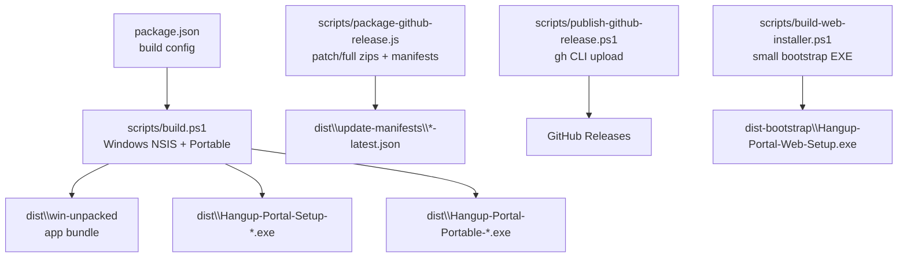
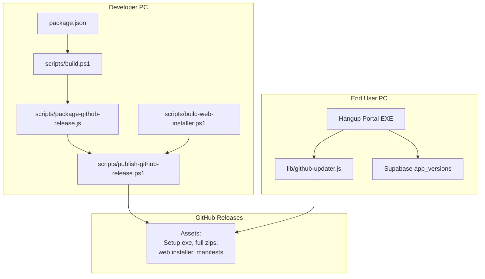
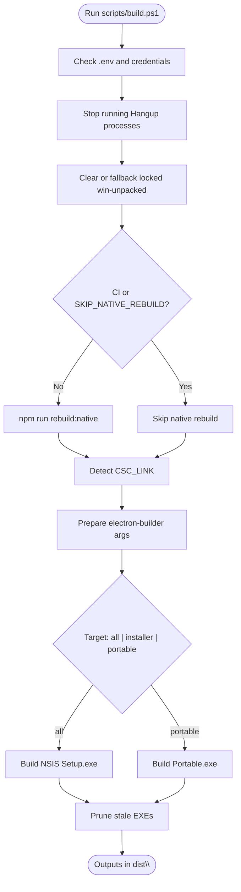
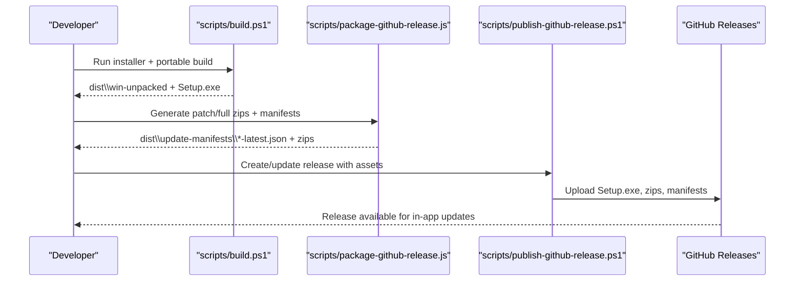
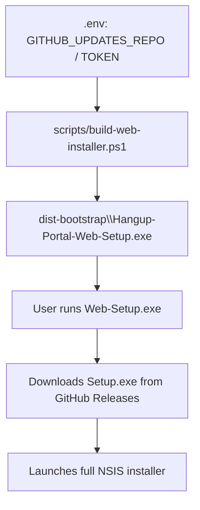
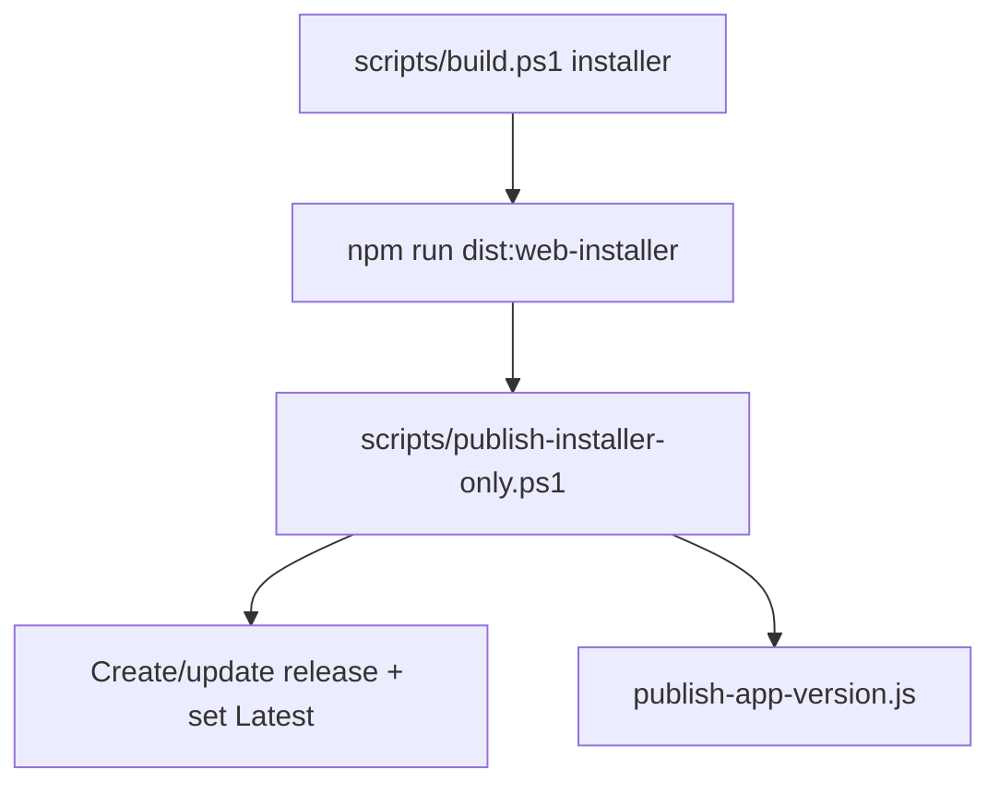
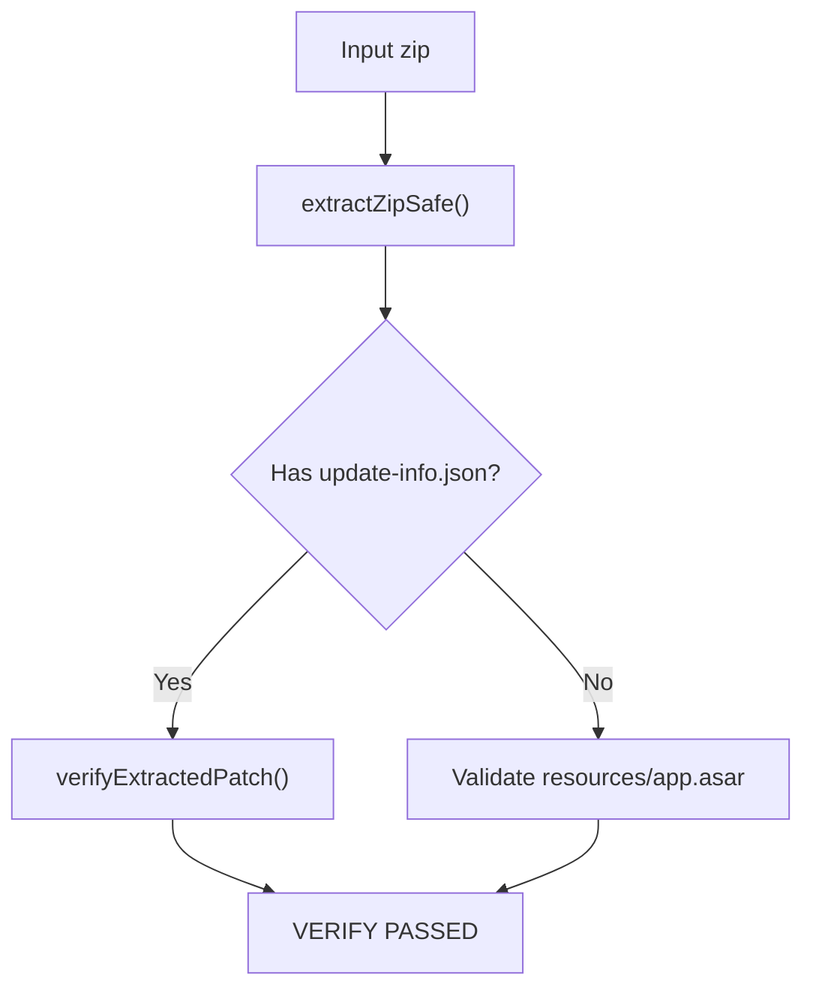
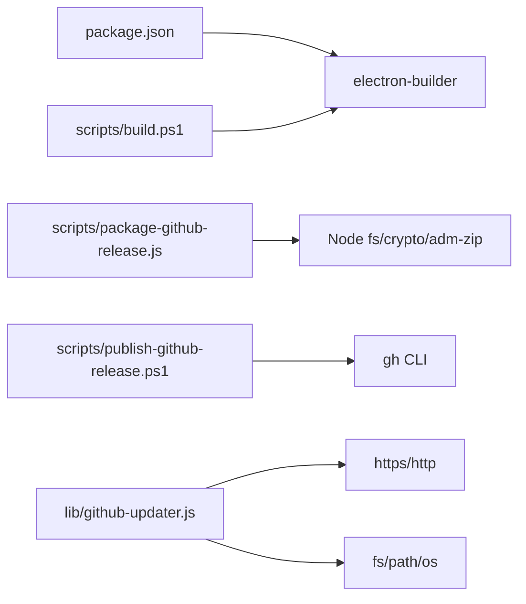

# Deployment & Operations

<cite>
**Referenced Files in This Document**
- [package.json](file://package.json)
- [README.md](file://README.md)
- [UPDATES.md](file://UPDATES.md)
- [scripts/build.ps1](file://scripts/build.ps1)
- [scripts/publish-github-release.ps1](file://scripts/publish-github-release.ps1)
- [scripts/package-github-release.js](file://scripts/package-github-release.js)
- [scripts/build-web-installer.ps1](file://scripts/build-web-installer.ps1)
- [scripts/publish-installer-only.ps1](file://scripts/publish-installer-only.ps1)
- [scripts/verify-update-package.js](file://scripts/verify-update-package.js)
- [lib/github-updater.js](file://lib/github-updater.js)
- [electron/main.js](file://electron/main.js)
- [electron/preload.js](file://electron/preload.js)
- [public/js/app.js](file://public/js/app.js)
- [lib/backup-service.js](file://lib/backup-service.js)
- [scripts/build-backup.ps1](file://scripts/build-backup.ps1)
- [electron/backup-main.js](file://electron/backup-main.js)
</cite>

## Table of Contents
1. Introduction
2. Project Structure
3. Core Components
4. Architecture Overview
5. Detailed Component Analysis
6. Dependency Analysis
7. Performance Considerations
8. Troubleshooting Guide
9. Conclusion

## Introduction
This document describes the end-to-end deployment and operations for Hangup Portal, focusing on:
- Build processes for Windows installers (NSIS) and portable EXEs
- Distribution methods including GitHub Releases automation
- Two update channels: installer/portable distribution and GitHub in-app updates
- Operational procedures for monitoring system health, backups, and maintenance
- Troubleshooting common deployment issues and scaling across multiple PCs

The application is an Electron desktop app with a Supabase backend and local SQLite cache per PC. Updates are delivered via GitHub Releases; version policy enforcement uses the database.

## Project Structure
Key build and distribution artifacts are produced under dist\ and dist-bootstrap\. The main packaging configuration is defined in package.json, which wires electron-builder targets (NSIS installer and portable), extra resources (.env and credentials), and post-pack hooks.



**Diagram sources**
- [package.json:49-137](file://package.json#L49-L137)
- [scripts/build.ps1:108-190](file://scripts/build.ps1#L108-L190)
- [scripts/package-github-release.js:292-357](file://scripts/package-github-release.js#L292-L357)
- [scripts/publish-github-release.ps1:132-216](file://scripts/publish-github-release.ps1#L132-L216)
- [scripts/build-web-installer.ps1:66-105](file://scripts/build-web-installer.ps1#L66-L105)

**Section sources**
- [package.json:49-137](file://package.json#L49-L137)
- [README.md:104-141](file://README.md#L104-L141)

## Core Components
- Windows build pipeline: scripts/build.ps1 orchestrates dependency installation, optional native rebuild, code signing detection, and electron-builder invocation to produce NSIS Setup.exe and Portable.exe. It also cleans locked outputs and prunes stale EXEs.
- Update packaging: scripts/package-github-release.js computes file manifests, generates patch zips against previous versions, and full zips when needed. It writes platform manifests used by CI and updater logic.
- Release publishing: scripts/publish-github-release.ps1 uses gh CLI to create or update a GitHub Release with required assets (Setup.exe, full zips, web installer, manifests).
- Web installer bootstrap: scripts/build-web-installer.ps1 compiles a small .NET WinForms installer that embeds a GitHub token and pins a release version at build time.
- In-app updater: lib/github-updater.js checks GitHub Releases, downloads appropriate assets, runs silent NSIS upgrade, or performs atomic swap for portable/mac bundles.
- Version policy: README and UPDATES describe how app_versions controls warnings/blocks and how both channels coexist.

**Section sources**
- [scripts/build.ps1:1-205](file://scripts/build.ps1#L1-L205)
- [scripts/package-github-release.js:1-357](file://scripts/package-github-release.js#L1-L357)
- [scripts/publish-github-release.ps1:1-216](file://scripts/publish-github-release.ps1#L1-L216)
- [scripts/build-web-installer.ps1:1-105](file://scripts/build-web-installer.ps1#L1-L105)
- [lib/github-updater.js:1-752](file://lib/github-updater.js#L1-L752)
- [README.md:212-244](file://README.md#L212-L244)
- [UPDATES.md:142-186](file://UPDATES.md#L142-L186)

## Architecture Overview
Two complementary distribution/update channels operate together:



**Diagram sources**
- [package.json:49-137](file://package.json#L49-L137)
- [scripts/build.ps1:108-190](file://scripts/build.ps1#L108-L190)
- [scripts/package-github-release.js:292-357](file://scripts/package-github-release.js#L292-L357)
- [scripts/publish-github-release.ps1:132-216](file://scripts/publish-github-release.ps1#L132-L216)
- [scripts/build-web-installer.ps1:66-105](file://scripts/build-web-installer.ps1#L66-L105)
- [lib/github-updater.js:227-259](file://lib/github-updater.js#L227-L259)
- [README.md:212-244](file://README.md#L212-L244)

## Detailed Component Analysis

### Windows Installer Creation (NSIS) and Packaging
- Entry point: npm scripts in package.json delegate to scripts/build.ps1.
- Build script responsibilities:
  - Ensure .env and credentials stubs exist (CI-friendly).
  - Stop running app processes to avoid locked outputs.
  - Optionally skip native rebuilds via environment variables.
  - Detect code signing certificate presence.
  - Invoke electron-builder to produce NSIS Setup.exe and/or Portable.exe.
  - Prune stale EXEs from output directory.
- Output naming and artifact structure are configured in package.json build.win and nsis sections.



**Diagram sources**
- [scripts/build.ps1:39-105](file://scripts/build.ps1#L39-L105)
- [scripts/build.ps1:111-131](file://scripts/build.ps1#L111-L131)
- [scripts/build.ps1:152-190](file://scripts/build.ps1#L152-L190)
- [scripts/build.ps1:192-205](file://scripts/build.ps1#L192-L205)
- [package.json:83-108](file://package.json#L83-L108)

**Section sources**
- [scripts/build.ps1:1-205](file://scripts/build.ps1#L1-L205)
- [package.json:83-108](file://package.json#L83-L108)

### GitHub Release Automation (Patch Updates and Full Distribution)
- Patch/full packaging: scripts/package-github-release.js walks the unpacked app, builds file manifests, diffs against previous manifests, and creates:
  - Patch zips for one or more prior versions (multi-patch supported)
  - Full zips for first releases or when requested
  - Platform manifests (e.g., win-x64-latest.json)
- Publishing: scripts/publish-github-release.ps1:
  - Ensures Setup.exe exists (required for in-app updates)
  - Builds missing full zip if no patch was generated
  - Uploads Setup.exe, patch/full zips, manifests, and optionally web installer and extras
  - Creates or updates a GitHub Release using gh CLI



**Diagram sources**
- [scripts/build.ps1:108-190](file://scripts/build.ps1#L108-L190)
- [scripts/package-github-release.js:219-290](file://scripts/package-github-release.js#L219-L290)
- [scripts/publish-github-release.ps1:89-172](file://scripts/publish-github-release.ps1#L89-L172)
- [scripts/publish-github-release.ps1:179-216](file://scripts/publish-github-release.ps1#L179-L216)

**Section sources**
- [scripts/package-github-release.js:1-357](file://scripts/package-github-release.js#L1-L357)
- [scripts/publish-github-release.ps1:1-216](file://scripts/publish-github-release.ps1#L1-L216)

### Web Installer Bootstrap (Small GUI Installer)
- Purpose: Provide a tiny (~10 KB) installer that downloads the full Setup.exe from GitHub Releases at runtime.
- Build process:
  - Reads GITHUB_UPDATES_REPO and GITHUB_UPDATES_TOKEN from .env (or gh auth token)
  - Pins a release version (defaults to package.json version unless overridden)
  - Compiles a small .NET WinForms executable that fetches and launches the pinned release’s Setup.exe
- Distribution: USB/internal share only due to embedded token.



**Diagram sources**
- [scripts/build-web-installer.ps1:40-105](file://scripts/build-web-installer.ps1#L40-L105)

**Section sources**
- [scripts/build-web-installer.ps1:1-105](file://scripts/build-web-installer.ps1#L1-L105)
- [UPDATES.md:159-186](file://UPDATES.md#L159-L186)

### In-App Update Flow (GitHub-based)
- Detection: On boot/login/background intervals, the app queries GitHub Releases for a newer tag and selects the correct asset based on install type (NSIS, portable, macOS).
- Application:
  - NSIS: Downloads Setup.exe and runs silently (/S), closing the app during upgrade.
  - Portable/mac: Downloads full zip, stages it, writes an atomic-swap manifest, and relaunches to perform the swap.
- Integrity: ASAR header validation and SHA-256 verification before applying updates.

```mermaid
sequenceDiagram
participant UI as "UI (public/js/app.js)"
participant Main as "electron/main.js"
preload as "electron/preload.js"
Updater as "lib/github-updater.js"
GH as "GitHub Releases"
UI->>Main : checkForAppUpdate()
Main->>preload : hrDesktop.checkGitHubUpdate()
preload->>Updater : checkForGitHubUpdate()
Updater->>GH : GET /releases/latest
GH-->>Updater : {tag_name, assets[]}
Updater-->>Main : {updateAvailable, method, assetUrl}
Main->>Updater : applyGitHubUpdate(info)
alt NSIS
Updater->>GH : Download Setup.exe
Updater-->>Main : needsQuit=true
else Portable/mac
Updater->>GH : Download full zip
Updater->>Updater : Validate ASAR + SHA-256
Updater->>Updater : Write atomic-swap manifest
Updater-->>Main : needsRelaunch=true
end
```

**Diagram sources**
- [public/js/app.js](file://public/js/app.js)
- [electron/main.js](file://electron/main.js)
- [electron/preload.js](file://electron/preload.js)
- [lib/github-updater.js:227-259](file://lib/github-updater.js#L227-L259)
- [lib/github-updater.js:356-492](file://lib/github-updater.js#L356-L492)
- [lib/github-updater.js:503-549](file://lib/github-updater.js#L503-L549)

**Section sources**
- [lib/github-updater.js:1-752](file://lib/github-updater.js#L1-L752)
- [UPDATES.md:322-391](file://UPDATES.md#L322-L391)

### Fast Installer-Only Publish
- Use case: Rapidly ship Setup.exe, web installer, and latest manifest without full zips.
- Steps:
  - Build installer locally
  - Build web installer
  - Run publish-installer-only.ps1 to create/update release and mark Latest
  - Automatically publishes current version policy to Supabase



**Diagram sources**
- [scripts/publish-installer-only.ps1:33-97](file://scripts/publish-installer-only.ps1#L33-L97)

**Section sources**
- [scripts/publish-installer-only.ps1:1-97](file://scripts/publish-installer-only.ps1#L1-L97)

### Pre-Publish Validation
- Verify update packages before uploading to ensure integrity:
  - Extract safely
  - Validate ASAR header
  - For patch zips, verify file list and checksums



**Diagram sources**
- [scripts/verify-update-package.js:12-64](file://scripts/verify-update-package.js#L12-L64)

**Section sources**
- [scripts/verify-update-package.js:1-64](file://scripts/verify-update-package.js#L1-L64)

## Dependency Analysis
- Build-time dependencies:
  - electron-builder (via package.json devDependencies)
  - Node.js tooling for zip creation and hashing
- Runtime dependencies for updates:
  - GitHub API access (HTTP(S))
  - Filesystem operations for staging and atomic swaps
  - Optional code signing via CSC_* env vars during build



**Diagram sources**
- [package.json:153-159](file://package.json#L153-L159)
- [scripts/build.ps1:165-180](file://scripts/build.ps1#L165-L180)
- [scripts/package-github-release.js:5-10](file://scripts/package-github-release.js#L5-L10)
- [scripts/publish-github-release.ps1:30-46](file://scripts/publish-github-release.ps1#L30-L46)
- [lib/github-updater.js:6-15](file://lib/github-updater.js#L6-L15)

**Section sources**
- [package.json:153-159](file://package.json#L153-L159)
- [scripts/publish-github-release.ps1:30-46](file://scripts/publish-github-release.ps1#L30-L46)

## Performance Considerations
- Prefer patch zips for incremental updates to reduce download size and bandwidth.
- Use fast installer-only publish for quick rollouts when full zips are not required.
- Avoid rebuilding native modules unnecessarily by setting SKIP_NATIVE_REBUILD=1 when prebuilt modules are available.
- Keep dist directories unlocked to prevent fallback to alternate output folders and additional I/O overhead.

[No sources needed since this section provides general guidance]

## Troubleshooting Guide
Common deployment issues and resolutions:
- Invalid package app.asar:
  - The app attempts to restore from backup and prompts an in-app update to reinstall. If stuck, run Setup.exe manually or use Update now.
- No update popup:
  - Ensure GITHUB_UPDATES_REPO (+ GITHUB_UPDATES_TOKEN for private repos) is present in packaged .env and rebuilt.
- NSIS update fails:
  - Confirm GitHub release includes the correct Setup.exe asset. Rebuild installer locally before publishing.
- Portable/mac update stuck:
  - Restart the app; startup completes the atomic swap from the manifest.
- Stuck on old patch-only updater:
  - Close the app and run Setup.exe manually or apply a patch standalone.
- Private repo rate limits:
  - Set GITHUB_UPDATES_TOKEN in .env.
- CI build failures due to credentials:
  - CI uses a stub for credentials; normal behavior.
- macOS Gatekeeper blocks unsigned builds:
  - Allow in Privacy & Security until code signing is enabled.

Operational procedures:
- Monitoring system health:
  - The updater validates ASAR headers and detects missing/incomplete installs on startup.
- Managing backups:
  - Use the dedicated Backup app to export database tables and storage objects to a timestamped folder.
- Maintenance tasks:
  - Apply pending migrations via npm commands or Supabase MCP.
  - Rebuild native modules when switching Node/Electron versions.

**Section sources**
- [UPDATES.md:514-527](file://UPDATES.md#L514-L527)
- [lib/github-updater.js:602-638](file://lib/github-updater.js#L602-L638)
- [lib/backup-service.js:113-176](file://lib/backup-service.js#L113-L176)
- [README.md:63-76](file://README.md#L63-L76)

## Conclusion
Hangup Portal’s deployment model centers on reliable local builds producing NSIS installers and portable EXEs, complemented by GitHub Releases for in-app updates. The two-channel approach ensures new PCs can be provisioned quickly while existing installations receive seamless upgrades. Operational safeguards include ASAR integrity checks, atomic swaps, and robust backup utilities. Following the documented workflows enables consistent, scalable deployments across many PCs with minimal friction.

[No sources needed since this section summarizes without analyzing specific files]