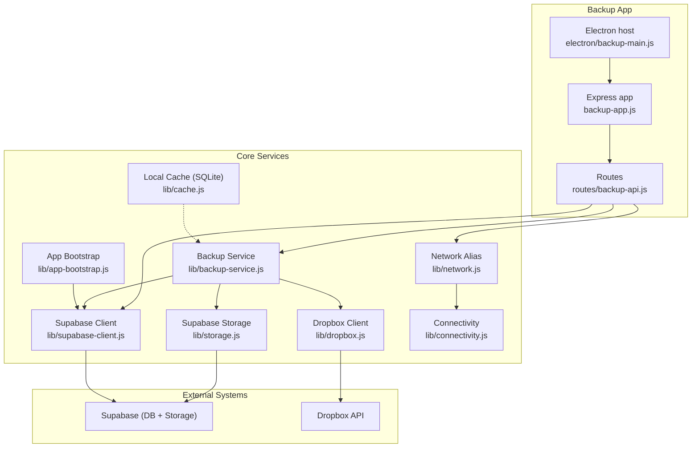
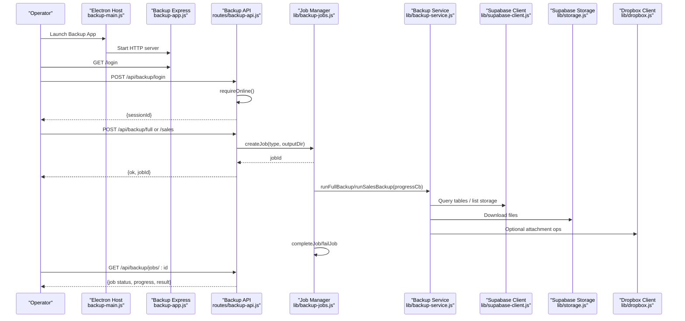
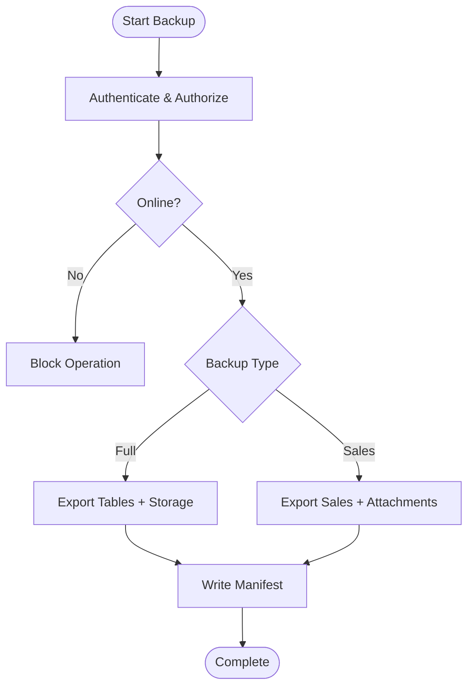
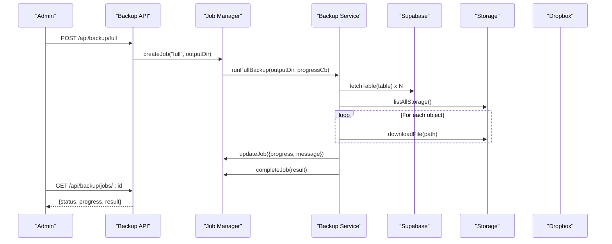
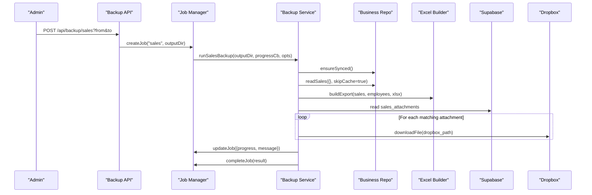
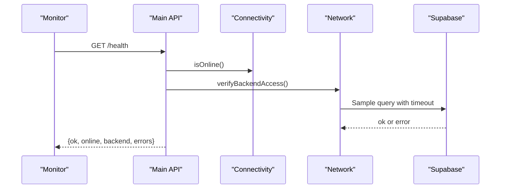
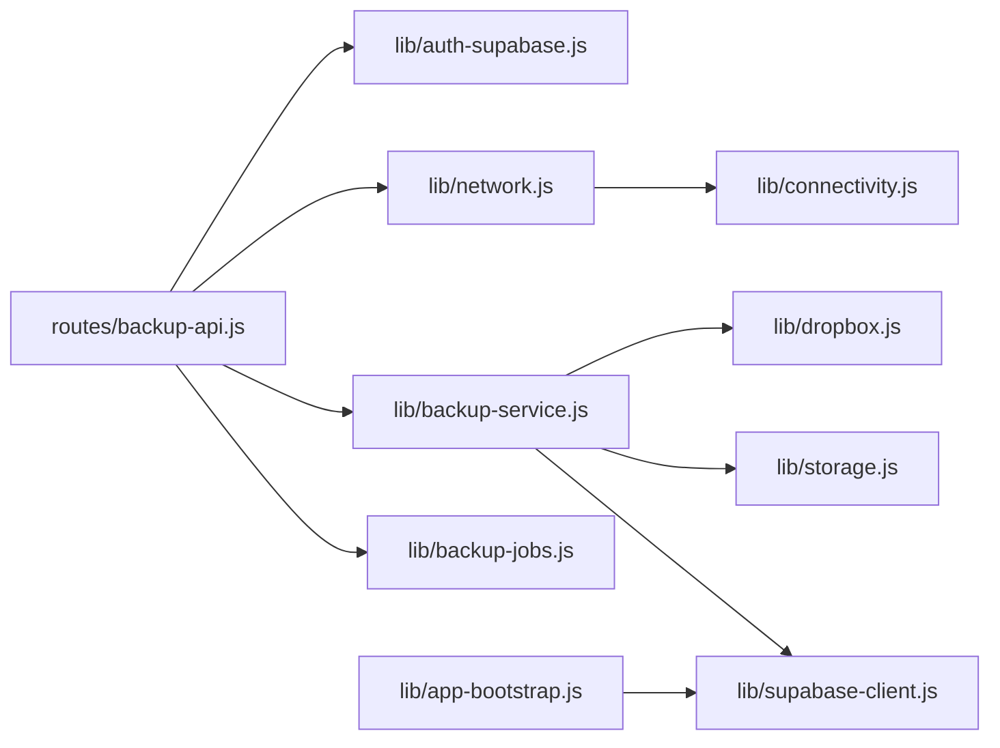

# Operational Procedures

<cite>
**Referenced Files in This Document**
- [backup-app.js](file://backup-app.js)
- [backup-api.js](file://routes/backup-api.js)
- [backup-service.js](file://lib/backup-service.js)
- [dropbox.js](file://lib/dropbox.js)
- [connectivity.js](file://lib/connectivity.js)
- [network.js](file://lib/network.js)
- [supabase-client.js](file://lib/supabase-client.js)
- [storage.js](file://lib/storage.js)
- [app-bootstrap.js](file://lib/app-bootstrap.js)
- [api.js](file://routes/api.js)
- [backup-main.js](file://electron/backup-main.js)
- [cache.js](file://lib/cache.js)
</cite>

## Table of Contents
1. Introduction
2. Project Structure
3. Core Components
4. Architecture Overview
5. Detailed Component Analysis
6. Dependency Analysis
7. Performance Considerations
8. Troubleshooting Guide
9. Conclusion

## Introduction
This document provides operational procedures for day-to-day system administration and maintenance. It covers backup and restore workflows, automated scheduling guidance, Dropbox integration, disaster recovery, monitoring and health checks, connectivity management, performance tuning, log analysis, troubleshooting, scaling across multiple PCs, credential management, security best practices, routine maintenance, capacity planning, and production operational guidelines.

## Project Structure
The application exposes a dedicated Backup UI and API, backed by Supabase (database and storage), with optional Dropbox integration for sales attachments. An Electron host can run the Backup UI locally. Health and version endpoints are available on the main API surface.

**Diagram sources**
- [backup-app.js:1-35](file://backup-app.js#L1-L35)
- [backup-api.js:1-127](file://routes/backup-api.js#L1-L127)
- [backup-service.js:1-179](file://lib/backup-service.js#L1-L179)
- [dropbox.js:1-323](file://lib/dropbox.js#L1-L323)
- [storage.js:1-96](file://lib/storage.js#L1-L96)
- [supabase-client.js:1-134](file://lib/supabase-client.js#L1-L134)
- [connectivity.js:1-78](file://lib/connectivity.js#L1-L78)
- [network.js:1-4](file://lib/network.js#L1-L4)
- [app-bootstrap.js:1-76](file://lib/app-bootstrap.js#L1-L76)
- [cache.js:1-54](file://lib/cache.js#L1-L54)

**Section sources**
- [backup-app.js:1-35](file://backup-app.js#L1-L35)
- [backup-api.js:1-127](file://routes/backup-api.js#L1-L127)
- [backup-service.js:1-179](file://lib/backup-service.js#L1-L179)
- [dropbox.js:1-323](file://lib/dropbox.js#L1-L323)
- [connectivity.js:1-78](file://lib/connectivity.js#L1-L78)
- [network.js:1-4](file://lib/network.js#L1-L4)
- [supabase-client.js:1-134](file://lib/supabase-client.js#L1-L134)
- [storage.js:1-96](file://lib/storage.js#L1-L96)
- [app-bootstrap.js:1-76](file://lib/app-bootstrap.js#L1-L76)
- [cache.js:1-54](file://lib/cache.js#L1-L54)

## Core Components
- Backup Express App: Serves static assets, mounts backup routes, configures session middleware, and sets error handling.
- Backup API Routes: Enforces authentication and role-based access, validates output directories, starts background jobs, and exposes job status.
- Backup Service: Orchestrates full database and storage exports, and targeted sales export including Excel generation and attachment downloads.
- Dropbox Integration: Provides upload, download, shared link creation, URL import, and scope verification utilities.
- Connectivity and Network: Probes internet reachability and verifies backend access to Supabase.
- Supabase Client: Manages admin and anonymous clients, environment validation, and client options.
- Storage: Uploads/downloads files to Supabase storage buckets and generates signed URLs.
- App Bootstrap: Loads .env from multiple locations, ensures cache directory, and asserts required configuration.
- Local Cache: SQLite-backed local cache used by various modules.

**Section sources**
- [backup-app.js:1-35](file://backup-app.js#L1-L35)
- [backup-api.js:1-127](file://routes/backup-api.js#L1-L127)
- [backup-service.js:1-179](file://lib/backup-service.js#L1-L179)
- [dropbox.js:1-323](file://lib/dropbox.js#L1-L323)
- [connectivity.js:1-78](file://lib/connectivity.js#L1-L78)
- [network.js:1-4](file://lib/network.js#L1-L4)
- [supabase-client.js:1-134](file://lib/supabase-client.js#L1-L134)
- [storage.js:1-96](file://lib/storage.js#L1-L96)
- [app-bootstrap.js:1-76](file://lib/app-bootstrap.js#L1-L76)
- [cache.js:1-54](file://lib/cache.js#L1-L54)

## Architecture Overview
The Backup UI is served by an Express server hosted within Electron or standalone. Users authenticate via the Backup login endpoint, which validates credentials and issues a session. Authorized users can trigger full or sales backups; operations run asynchronously as jobs with progress updates. Data is exported from Supabase tables and storage, optionally integrating with Dropbox for sales attachments.

**Diagram sources**
- [backup-main.js:1-57](file://electron/backup-main.js#L1-L57)
- [backup-app.js:1-35](file://backup-app.js#L1-L35)
- [backup-api.js:1-127](file://routes/backup-api.js#L1-L127)
- [backup-service.js:1-179](file://lib/backup-service.js#L1-L179)
- [supabase-client.js:1-134](file://lib/supabase-client.js#L1-L134)
- [storage.js:1-96](file://lib/storage.js#L1-L96)
- [dropbox.js:1-323](file://lib/dropbox.js#L1-L323)

## Detailed Component Analysis

### Backup Application and API
- Authentication and Authorization
  - Login requires online connectivity and valid credentials. Role check restricts access to Admin and RTM roles.
  - Session is created and validated per request using a session store.
- Job Management
  - Jobs are created with type and metadata, updated with progress patches, and completed or failed with timestamps.
  - Old finished jobs are pruned periodically.
- Endpoints
  - POST /api/backup/login: Authenticates and returns sessionId.
  - POST /api/backup/logout: Destroys session.
  - GET /api/backup/me: Returns current user info and supported attachment kinds.
  - POST /api/backup/full: Starts a full backup job.
  - POST /api/backup/sales: Starts a sales backup job with optional date filters.
  - GET /api/backup/jobs/:id: Returns job details.

Operational notes:
- Validate output directory path exists and is absolute before starting jobs.
- Use job polling to track progress and results.

**Section sources**
- [backup-app.js:1-35](file://backup-app.js#L1-L35)
- [backup-api.js:1-127](file://routes/backup-api.js#L1-L127)
- [connectivity.js:1-78](file://lib/connectivity.js#L1-L78)
- [network.js:1-4](file://lib/network.js#L1-L4)

### Backup Service
- Full Backup
  - Iterates configured tables, paginates rows, writes JSON files under a timestamped root, and records a manifest.
  - Lists all storage objects recursively and downloads them into a mirrored structure.
- Sales Backup
  - Ensures business data sync, builds an Excel export, and downloads relevant attachments based on kind filters.
  - Produces a manifest summarizing rows, attachments, bytes, and errors.
- Progress Reporting
  - Uses a callback to update job phase and percentage.

Operational notes:
- Ensure sufficient disk space for large exports.
- Monitor errors array in manifests for partial failures.

**Section sources**
- [backup-service.js:1-179](file://lib/backup-service.js#L1-L179)

### Dropbox Integration
- Configuration
  - Requires DROPBOX_ACCESS_TOKEN and optional folder path.
- Capabilities
  - Verify write/read/sharing scopes.
  - Upload content, download files, create shared links, import from remote URLs, delete files, confirm existence.
- Error Handling
  - Detects missing scopes and suggests regenerating tokens with correct permissions.

Operational notes:
- After enabling new scopes in Dropbox App Console, regenerate token and update environment.
- Use verifyAccess to validate configuration before automating uploads.

**Section sources**
- [dropbox.js:1-323](file://lib/dropbox.js#L1-L323)

### Connectivity and Backend Access
- Internet Reachability
  - Probes configurable endpoints and public probes to determine online status.
- Backend Verification
  - Verifies Supabase configuration and performs a sample query with timeout protection.
- Convenience Wrapper
  - Exposes network helpers for use across routes.

Operational notes:
- If offline, some operations may be blocked until connectivity is restored.
- Use health endpoints to monitor overall system state.

**Section sources**
- [connectivity.js:1-78](file://lib/connectivity.js#L1-L78)
- [network.js:1-4](file://lib/network.js#L1-L4)

### Supabase Client and Storage
- Client Initialization
  - Reads URL and keys from environment, supports admin and anon clients, and user-scoped client with JWT.
- Storage Operations
  - Upload buffers/files, generate signed URLs, delete files, stream downloads, and MIME guessing.

Operational notes:
- Keep secret keys server-side only.
- Signed URLs default to a safe TTL; adjust as needed.

**Section sources**
- [supabase-client.js:1-134](file://lib/supabase-client.js#L1-L134)
- [storage.js:1-96](file://lib/storage.js#L1-L96)

### App Bootstrap and Environment
- Environment Loading
  - Searches multiple .env locations including portable and resource paths.
- Cache Directory
  - Ensures a writable cache directory exists and sets environment variable.
- Configuration Assertions
  - Blocks legacy sheets backend and enforces Supabase configuration.

Operational notes:
- Place .env in the expected location for your deployment mode.
- Validate configuration at startup to fail fast.

**Section sources**
- [app-bootstrap.js:1-76](file://lib/app-bootstrap.js#L1-L76)

### Local Cache
- SQLite-backed cache with WAL mode and busy timeout.
- Schema includes meta, employees, attendance, bonuses, and more.

Operational notes:
- Monitor cache directory size and rotate if necessary.
- Rebuild native dependencies if cache module fails to load.

**Section sources**
- [cache.js:1-54](file://lib/cache.js#L1-L54)

## Architecture Overview
High-level operational flows:

[No sources needed since this diagram shows conceptual workflow, not actual code structure]

## Detailed Component Analysis

### Backup Flow Sequence

**Diagram sources**
- [backup-api.js:1-127](file://routes/backup-api.js#L1-L127)
- [backup-service.js:1-179](file://lib/backup-service.js#L1-L179)
- [storage.js:1-96](file://lib/storage.js#L1-L96)

### Sales Backup Flow

**Diagram sources**
- [backup-api.js:1-127](file://routes/backup-api.js#L1-L127)
- [backup-service.js:1-179](file://lib/backup-service.js#L1-L179)
- [dropbox.js:1-323](file://lib/dropbox.js#L1-L323)

### Health Check Endpoint

**Diagram sources**
- [api.js:525-550](file://routes/api.js#L525-L550)
- [connectivity.js:1-78](file://lib/connectivity.js#L1-L78)
- [network.js:1-4](file://lib/network.js#L1-L4)

## Dependency Analysis
Key runtime dependencies and relationships:
- Backup API depends on connectivity checks, session store, roles, job manager, and backup service.
- Backup service depends on Supabase client, storage, and optionally Dropbox.
- Dropbox client uses HTTPS requests to external APIs.
- Supabase client manages environment variables and client instances.
- App bootstrap loads environment and enforces configuration.

**Diagram sources**
- [backup-api.js:1-127](file://routes/backup-api.js#L1-L127)
- [backup-service.js:1-179](file://lib/backup-service.js#L1-L179)
- [network.js:1-4](file://lib/network.js#L1-L4)
- [connectivity.js:1-78](file://lib/connectivity.js#L1-L78)
- [supabase-client.js:1-134](file://lib/supabase-client.js#L1-L134)
- [storage.js:1-96](file://lib/storage.js#L1-L96)
- [dropbox.js:1-323](file://lib/dropbox.js#L1-L323)
- [app-bootstrap.js:1-76](file://lib/app-bootstrap.js#L1-L76)

**Section sources**
- [backup-api.js:1-127](file://routes/backup-api.js#L1-L127)
- [backup-service.js:1-179](file://lib/backup-service.js#L1-L179)
- [network.js:1-4](file://lib/network.js#L1-L4)
- [connectivity.js:1-78](file://lib/connectivity.js#L1-L78)
- [supabase-client.js:1-134](file://lib/supabase-client.js#L1-L134)
- [storage.js:1-96](file://lib/storage.js#L1-L96)
- [dropbox.js:1-323](file://lib/dropbox.js#L1-L323)
- [app-bootstrap.js:1-76](file://lib/app-bootstrap.js#L1-L76)

## Performance Considerations
- Pagination and batching
  - Database exports use page-sized queries to avoid memory spikes.
- Streaming and buffering
  - Storage downloads convert responses to buffers; consider disk I/O throughput.
- Concurrency
  - Avoid parallel heavy operations unless necessary; the current flow is sequential per job.
- Caching
  - Local SQLite cache improves responsiveness; keep it warm and monitor size.
- Timeouts
  - Backend queries include timeouts to prevent hanging operations.

[No sources needed since this section provides general guidance]

## Troubleshooting Guide
Common operational issues and resolutions:
- Dropbox scope errors
  - Symptom: Missing scope or permission errors during upload/share.
  - Resolution: Enable required scopes in Dropbox App Console, regenerate token, and update environment.
- Supabase configuration missing
  - Symptom: Startup assertion fails indicating missing keys.
  - Resolution: Set SUPABASE_URL, SUPABASE_SECRET_KEY, and SUPABASE_PUBLISHABLE_KEY in .env.
- Offline or unreachable backend
  - Symptom: Health check reports offline or backend errors.
  - Resolution: Verify internet connectivity and firewall rules; re-run health endpoint.
- Invalid output directory
  - Symptom: Backup start fails due to non-existent or relative path.
  - Resolution: Provide an absolute, existing directory path.
- Job not found or stale
  - Symptom: Job ID returns 404 or old job persists.
  - Resolution: Use current job IDs; jobs are pruned after a time window.

**Section sources**
- [dropbox.js:1-323](file://lib/dropbox.js#L1-L323)
- [app-bootstrap.js:1-76](file://lib/app-bootstrap.js#L1-L76)
- [connectivity.js:1-78](file://lib/connectivity.js#L1-L78)
- [backup-api.js:1-127](file://routes/backup-api.js#L1-L127)

## Conclusion
This guide outlines operational procedures for managing backups, monitoring health, maintaining connectivity, and performing routine maintenance. Follow the documented workflows for full and sales backups, integrate Dropbox securely, and leverage health endpoints for ongoing observability. Apply the security and performance recommendations to ensure reliable production operations.