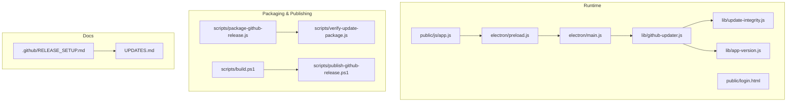
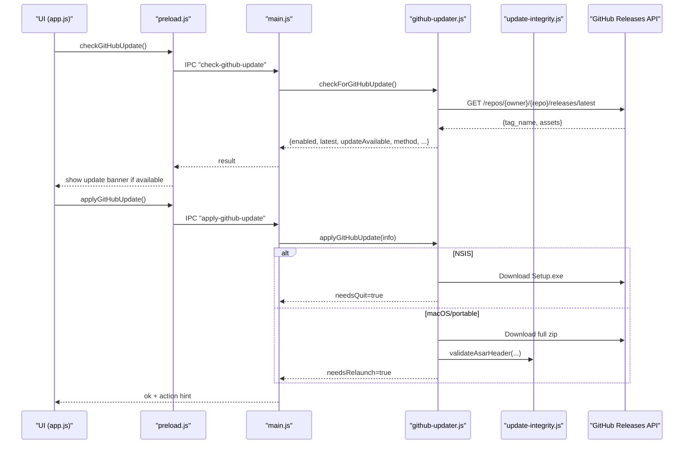
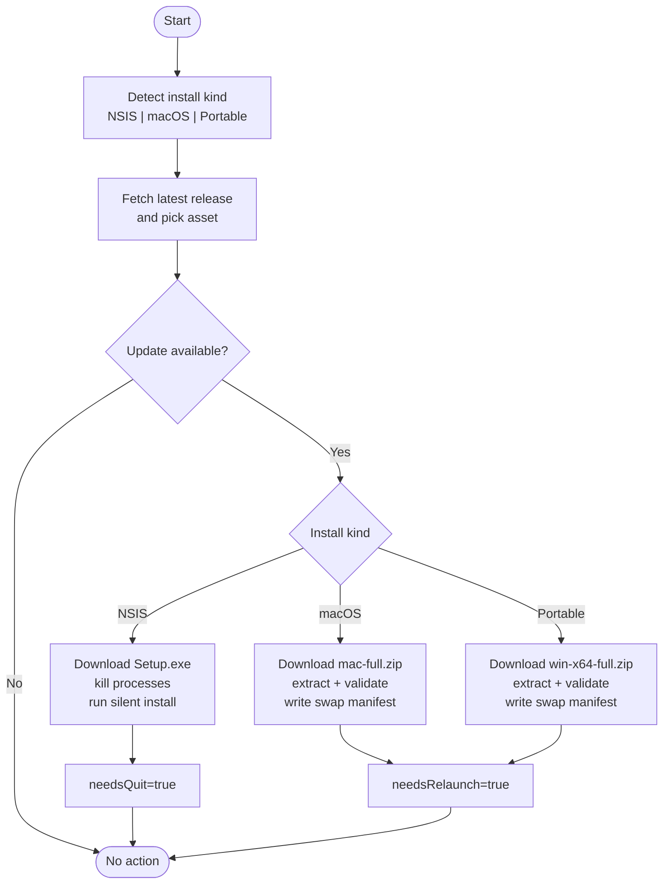
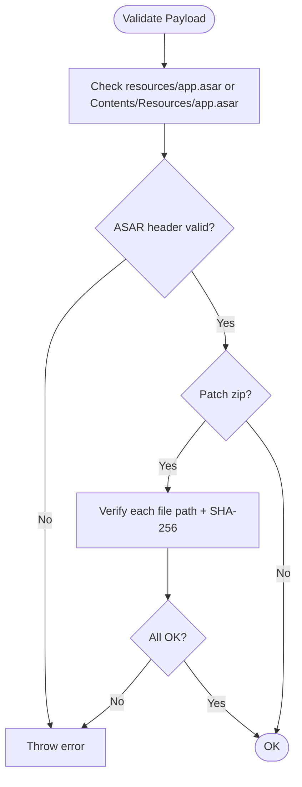
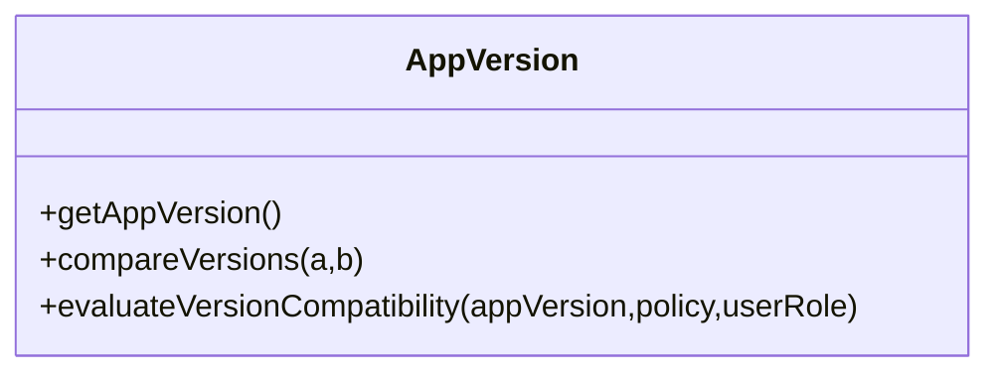
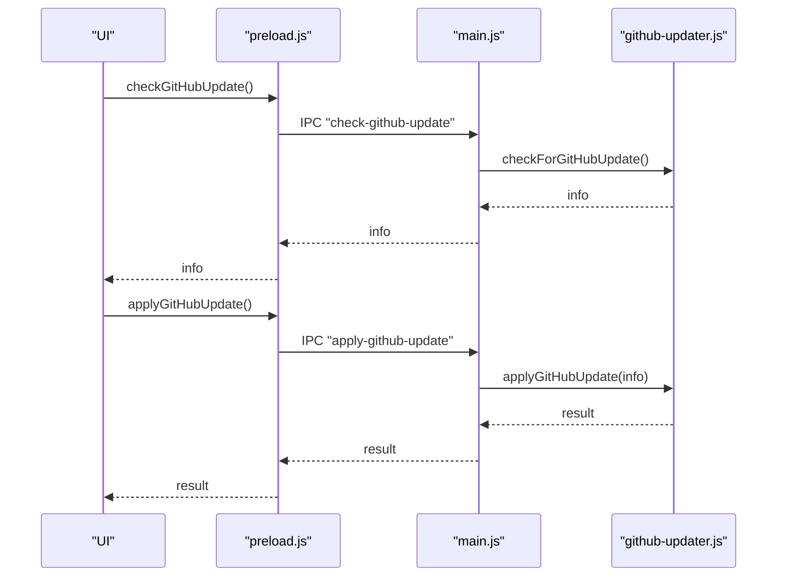
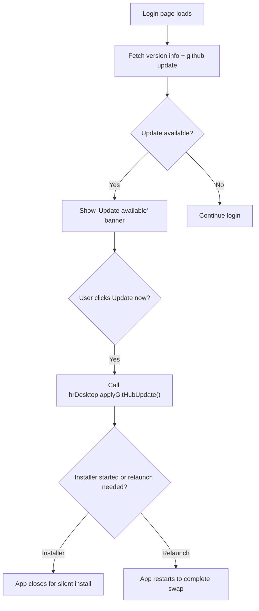
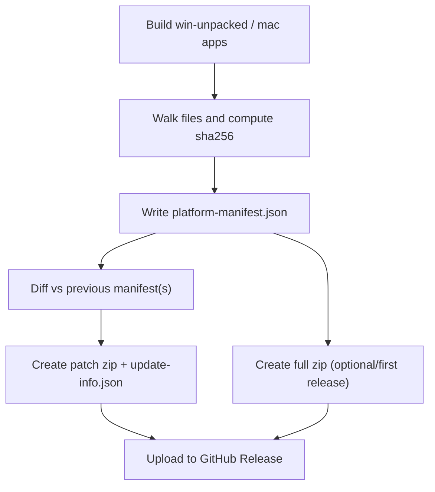
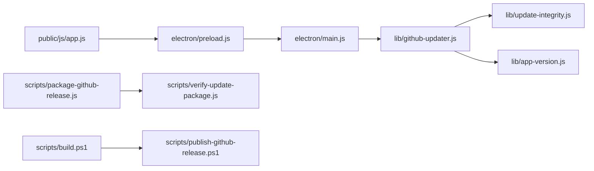

# Update Management

<cite>
**Referenced Files in This Document**
- [lib/github-updater.js](file://lib/github-updater.js)
- [lib/update-integrity.js](file://lib/update-integrity.js)
- [lib/app-version.js](file://lib/app-version.js)
- [electron/main.js](file://electron/main.js)
- [electron/preload.js](file://electron/preload.js)
- [public/js/app.js](file://public/js/app.js)
- [public/login.html](file://public/login.html)
- [scripts/package-github-release.js](file://scripts/package-github-release.js)
- [scripts/verify-update-package.js](file://scripts/verify-update-package.js)
- [scripts/build.ps1](file://scripts/build.ps1)
- [scripts/publish-github-release.ps1](file://scripts/publish-github-release.ps1)
- [.github/RELEASE_SETUP.md](file://.github/RELEASE_SETUP.md)
- [UPDATES.md](file://UPDATES.md)
</cite>

## Table of Contents
1. Introduction
2. Project Structure
3. Core Components
4. Architecture Overview
5. Detailed Component Analysis
6. Dependency Analysis
7. Performance Considerations
8. Troubleshooting Guide
9. Conclusion
10. Appendices

## Introduction
This document describes the dual-channel update system for Hangup Portal:
- Installer/portable distribution for initial deployment and major releases (NSIS Setup.exe, portable zip, macOS DMG).
- GitHub-based in-app updates for Windows NSIS installs (silent installer), Windows portable/macOS full app swap.
It covers version checking, asset selection, download and installation flows, manifest and integrity verification, configuration, release automation via GitHub Actions, rollback behavior, security, user notifications, and troubleshooting.

## Project Structure
The update system spans runtime libraries, Electron IPC integration, UI prompts, packaging scripts, and documentation.

**Diagram sources**
- [lib/github-updater.js:1-752](file://lib/github-updater.js#L1-L752)
- [lib/update-integrity.js:1-97](file://lib/update-integrity.js#L1-L97)
- [lib/app-version.js:1-190](file://lib/app-version.js#L1-L190)
- [electron/main.js:1-309](file://electron/main.js#L1-L309)
- [electron/preload.js:1-14](file://electron/preload.js#L1-L14)
- [public/js/app.js:992-1138](file://public/js/app.js#L992-L1138)
- [public/login.html:238-269](file://public/login.html#L238-L269)
- [scripts/package-github-release.js:1-357](file://scripts/package-github-release.js#L1-L357)
- [scripts/verify-update-package.js:1-64](file://scripts/verify-update-package.js#L1-L64)
- [scripts/build.ps1:1-200](file://scripts/build.ps1#L1-L200)
- [scripts/publish-github-release.ps1:1-200](file://scripts/publish-github-release.ps1#L1-L200)
- [.github/RELEASE_SETUP.md:1-110](file://.github/RELEASE_SETUP.md#L1-L110)
- [UPDATES.md:142-536](file://UPDATES.md#L142-L536)

**Section sources**
- [lib/github-updater.js:1-752](file://lib/github-updater.js#L1-L752)
- [electron/main.js:223-253](file://electron/main.js#L223-L253)
- [public/js/app.js:992-1138](file://public/js/app.js#L992-L1138)
- [scripts/package-github-release.js:1-357](file://scripts/package-github-release.js#L1-L357)
- [scripts/publish-github-release.ps1:1-200](file://scripts/publish-github-release.ps1#L1-L200)
- [UPDATES.md:142-536](file://UPDATES.md#L142-L536)

## Core Components
- In-app updater (Windows/macOS/portable): checks GitHub Releases, selects platform-specific assets, downloads, stages, and applies updates with atomic swap or silent installer.
- Integrity verification: ASAR header validation and optional SHA-256 checks for patch payloads.
- Version policy: Supabase-driven compatibility and force-update rules; client-side comparison utilities.
- Packaging: generates patch/full zips and manifests from electron-builder outputs.
- Publishing: uploads artifacts to GitHub Releases and supports CI workflows.

Key responsibilities:
- lib/github-updater.js: update discovery, download, staging, install methods, atomic swap, health checks.
- lib/update-integrity.js: validateAsarHeader, verifyExtractedPatch, copyFileVerified.
- lib/app-version.js: compareVersions, evaluateVersionCompatibility, role-based force updates.
- electron/main.js + preload.js: IPC handlers exposing check/apply/relaunch to UI.
- public/js/app.js + login.html: UI prompts and banners for update availability and actions.
- scripts/package-github-release.js: diffing previous manifests, building patch/full zips, file hashes.
- scripts/verify-update-package.js: pre-publish verification of zips.
- scripts/build.ps1 + publish-github-release.ps1: build/installer generation and publishing workflow.
- .github/RELEASE_SETUP.md + UPDATES.md: setup and process documentation.

**Section sources**
- [lib/github-updater.js:1-752](file://lib/github-updater.js#L1-L752)
- [lib/update-integrity.js:1-97](file://lib/update-integrity.js#L1-L97)
- [lib/app-version.js:1-190](file://lib/app-version.js#L1-L190)
- [electron/main.js:223-253](file://electron/main.js#L223-L253)
- [electron/preload.js:1-14](file://electron/preload.js#L1-L14)
- [public/js/app.js:992-1138](file://public/js/app.js#L992-L1138)
- [public/login.html:238-269](file://public/login.html#L238-L269)
- [scripts/package-github-release.js:1-357](file://scripts/package-github-release.js#L1-L357)
- [scripts/verify-update-package.js:1-64](file://scripts/verify-update-package.js#L1-L64)
- [scripts/build.ps1:1-200](file://scripts/build.ps1#L1-L200)
- [scripts/publish-github-release.ps1:1-200](file://scripts/publish-github-release.ps1#L1-L200)
- [.github/RELEASE_SETUP.md:1-110](file://.github/RELEASE_SETUP.md#L1-L110)
- [UPDATES.md:142-536](file://UPDATES.md#L142-L536)

## Architecture Overview
The system uses two complementary channels:
- Initial deployment: NSIS Setup.exe (Windows), Portable zip (Windows), DMG (macOS).
- In-app updates: GitHub Releases assets selected by platform and install kind.

**Diagram sources**
- [public/js/app.js:992-1138](file://public/js/app.js#L992-L1138)
- [electron/preload.js:1-14](file://electron/preload.js#L1-L14)
- [electron/main.js:223-253](file://electron/main.js#L223-L253)
- [lib/github-updater.js:227-259](file://lib/github-updater.js#L227-L259)
- [lib/update-integrity.js:15-42](file://lib/update-integrity.js#L15-L42)

## Detailed Component Analysis

### In-App Updater (Windows/macOS/portable)
Responsibilities:
- Detect install kind (NSIS, macOS .app, portable).
- Resolve latest release and pick correct asset by naming patterns.
- Download payload, stage it, validate integrity, and apply via:
  - NSIS: silent installer execution after closing running processes.
  - macOS/portable: atomic folder/bundle swap on relaunch using a manifest.
- Recover interrupted swaps on startup and report install health.

Key behaviors:
- Asset selection prioritizes Setup.exe for NSIS; otherwise full zips per platform suffix.
- Atomic swap writes a manifest and runs a small script to move target to backup and staged to target, then relaunches.
- Health checks ensure app.asar exists and is valid; provides actionable messages when broken.

**Diagram sources**
- [lib/github-updater.js:51-95](file://lib/github-updater.js#L51-L95)
- [lib/github-updater.js:186-259](file://lib/github-updater.js#L186-L259)
- [lib/github-updater.js:356-391](file://lib/github-updater.js#L356-L391)
- [lib/github-updater.js:422-492](file://lib/github-updater.js#L422-L492)
- [lib/github-updater.js:503-549](file://lib/github-updater.js#L503-L549)
- [lib/github-updater.js:670-700](file://lib/github-updater.js#L670-L700)

**Section sources**
- [lib/github-updater.js:1-752](file://lib/github-updater.js#L1-L752)

### Integrity Verification
Responsibilities:
- Validate ASAR headers to prevent corrupted installations.
- Verify extracted patch files against expected SHA-256 hashes.
- Provide safe copy helpers that re-validate after copy.

**Diagram sources**
- [lib/update-integrity.js:15-42](file://lib/update-integrity.js#L15-L42)
- [lib/update-integrity.js:59-69](file://lib/update-integrity.js#L59-L69)
- [lib/update-integrity.js:71-88](file://lib/update-integrity.js#L71-L88)

**Section sources**
- [lib/update-integrity.js:1-97](file://lib/update-integrity.js#L1-L97)

### Version Policy and Compatibility
Responsibilities:
- Compare versions including pre-release tokens.
- Evaluate Supabase policy to block or recommend updates based on roles and thresholds.

**Diagram sources**
- [lib/app-version.js:1-190](file://lib/app-version.js#L1-L190)

**Section sources**
- [lib/app-version.js:1-190](file://lib/app-version.js#L1-L190)

### Electron IPC Integration
Responsibilities:
- Expose update functions to UI via contextBridge.
- Handle IPC calls to check/apply updates and relaunch.

**Diagram sources**
- [electron/preload.js:1-14](file://electron/preload.js#L1-L14)
- [electron/main.js:223-253](file://electron/main.js#L223-L253)

**Section sources**
- [electron/preload.js:1-14](file://electron/preload.js#L1-L14)
- [electron/main.js:223-253](file://electron/main.js#L223-L253)

### User Notification Handling
Responsibilities:
- Show update banners on login and within the app.
- Provide “Update now” action that triggers the desktop flow.

**Diagram sources**
- [public/login.html:238-269](file://public/login.html#L238-L269)
- [public/js/app.js:992-1138](file://public/js/app.js#L992-L1138)

**Section sources**
- [public/login.html:238-269](file://public/login.html#L238-L269)
- [public/js/app.js:992-1138](file://public/js/app.js#L992-L1138)

### Update Manifest Format and Blockmap Generation
Responsibilities:
- Generate per-platform manifests listing files and SHA-256 hashes.
- Build patch zips by diffing against previous manifests; include removed files list.
- Produce full zips for first releases or when requested.

Manifest fields (per platform):
- version, platform, generatedAt, files map (relative -> {sha256, size}).
- For patches: update-info.json includes type, fromVersion, toVersion, changed/added counts, removed list, files list, and fileHashes.

Blockmaps:
- The build script prunes stale .blockmap files alongside EXEs; blockmaps are part of the standard electron-builder output but are not used by the in-app updater.

**Diagram sources**
- [scripts/package-github-release.js:35-52](file://scripts/package-github-release.js#L35-L52)
- [scripts/package-github-release.js:78-91](file://scripts/package-github-release.js#L78-L91)
- [scripts/package-github-release.js:183-217](file://scripts/package-github-release.js#L183-L217)
- [scripts/package-github-release.js:219-290](file://scripts/package-github-release.js#L219-L290)
- [scripts/build.ps1:192-200](file://scripts/build.ps1#L192-L200)

**Section sources**
- [scripts/package-github-release.js:1-357](file://scripts/package-github-release.js#L1-L357)
- [scripts/build.ps1:192-200](file://scripts/build.ps1#L192-L200)

### Configuration for Update Channels
- GITHUB_UPDATES_REPO: packaged into the app’s environment to point at the GitHub repository containing releases.
- GITHUB_UPDATES_TOKEN: optional token for private repos or higher rate limits.
- Web installer bootstrap pins to a specific release at build time; can be rebuilt to pin to latest.

Configuration locations:
- Packaged .env (via extraResources) read at runtime.
- Local .env used during builds and publishing.

**Section sources**
- [lib/github-updater.js:28-30](file://lib/github-updater.js#L28-L30)
- [lib/github-updater.js:154-172](file://lib/github-updater.js#L154-L172)
- [.github/RELEASE_SETUP.md:52-60](file://.github/RELEASE_SETUP.md#L52-L60)
- [UPDATES.md:159-186](file://UPDATES.md#L159-L186)

### Release Automation via GitHub Actions
- Workflow triggered by tags or manual dispatch.
- Jobs build Windows and macOS artifacts, generate patch/full zips, and publish a single GitHub Release.
- Required secrets include Supabase keys and optional code signing.

Operational notes:
- First release publishes full zips only; subsequent releases include patch zips.
- CI uses provided GITHUB_TOKEN; no local gh CLI required.

**Section sources**
- [UPDATES.md:436-474](file://UPDATES.md#L436-L474)
- [.github/RELEASE_SETUP.md:76-91](file://.github/RELEASE_SETUP.md#L76-L91)

### Rollback Procedures
- Atomic swap preserves the previous install under a backup path and archives older backups.
- On next launch, the app completes the swap; if staged content is missing, the manifest is cleaned up.
- If the installed app becomes invalid (e.g., bad ASAR), the app reports install health and suggests reinstalling via Update now or Setup.exe.

Manual recovery options:
- Run Setup.exe manually.
- Use standalone patch apply script for legacy scenarios.

**Section sources**
- [lib/github-updater.js:503-549](file://lib/github-updater.js#L503-L549)
- [lib/github-updater.js:670-700](file://lib/github-updater.js#L670-L700)
- [UPDATES.md:514-527](file://UPDATES.md#L514-L527)

### Update Security
- HTTPS-only requests to GitHub APIs and asset endpoints.
- Optional bearer token for authenticated access.
- ASAR header validation prevents loading corrupted packages.
- Patch verification enforces SHA-256 checksums for all included files.
- Safe extraction avoids unsafe archive traversal.

**Section sources**
- [lib/github-updater.js:97-172](file://lib/github-updater.js#L97-L172)
- [lib/update-integrity.js:15-42](file://lib/update-integrity.js#L15-L42)
- [lib/update-integrity.js:59-69](file://lib/update-integrity.js#L59-L69)

### Troubleshooting Failed Updates
Common issues and resolutions:
- Invalid package app.asar: use Update now or run Setup.exe; app may auto-recover via backup.
- No update popup: ensure GITHUB_UPDATES_REPO (+ token) configured in packaged .env.
- NSIS update fails: confirm Setup.exe present in release; rebuild locally before publishing.
- Stuck on swap: restart app to complete atomic swap.
- Private repo rate limits: set GITHUB_UPDATES_TOKEN.
- macOS Gatekeeper warnings: unsigned builds require manual allow until code signing is enabled.

**Section sources**
- [UPDATES.md:514-527](file://UPDATES.md#L514-L527)
- [lib/github-updater.js:602-638](file://lib/github-updater.js#L602-L638)

## Dependency Analysis
High-level dependencies among components:

**Diagram sources**
- [public/js/app.js:992-1138](file://public/js/app.js#L992-L1138)
- [electron/preload.js:1-14](file://electron/preload.js#L1-L14)
- [electron/main.js:223-253](file://electron/main.js#L223-L253)
- [lib/github-updater.js:1-752](file://lib/github-updater.js#L1-L752)
- [lib/update-integrity.js:1-97](file://lib/update-integrity.js#L1-L97)
- [lib/app-version.js:1-190](file://lib/app-version.js#L1-L190)
- [scripts/package-github-release.js:1-357](file://scripts/package-github-release.js#L1-L357)
- [scripts/verify-update-package.js:1-64](file://scripts/verify-update-package.js#L1-L64)
- [scripts/build.ps1:1-200](file://scripts/build.ps1#L1-L200)
- [scripts/publish-github-release.ps1:1-200](file://scripts/publish-github-release.ps1#L1-L200)

**Section sources**
- [lib/github-updater.js:1-752](file://lib/github-updater.js#L1-L752)
- [electron/main.js:223-253](file://electron/main.js#L223-L253)
- [public/js/app.js:992-1138](file://public/js/app.js#L992-L1138)
- [scripts/package-github-release.js:1-357](file://scripts/package-github-release.js#L1-L357)
- [scripts/verify-update-package.js:1-64](file://scripts/verify-update-package.js#L1-L64)
- [scripts/build.ps1:1-200](file://scripts/build.ps1#L1-L200)
- [scripts/publish-github-release.ps1:1-200](file://scripts/publish-github-release.ps1#L1-L200)

## Performance Considerations
- Prefer patch zips where possible to reduce bandwidth; full zips are always published for first releases and fallback.
- Avoid unnecessary rebuilds by skipping native rebuilds in CI or when SKIP_NATIVE_REBUILD=1.
- Prune stale EXEs and blockmaps post-build to keep dist clean and fast.
- Use GITHUB_UPDATES_TOKEN to avoid rate limiting and retries.

[No sources needed since this section provides general guidance]

## Troubleshooting Guide
- Install health diagnostics: the updater checks for missing or invalid app.asar and surfaces actionable messages.
- Recovery on startup: incomplete swaps are completed automatically; missing staged content cleans up the manifest.
- Manual patch application: standalone script available for emergency cases.
- Web installer bootstrap: ensure it is rebuilt after each release to pin the correct Setup.exe.

**Section sources**
- [lib/github-updater.js:602-638](file://lib/github-updater.js#L602-L638)
- [lib/github-updater.js:670-700](file://lib/github-updater.js#L670-L700)
- [UPDATES.md:514-527](file://UPDATES.md#L514-L527)
- [UPDATES.md:159-186](file://UPDATES.md#L159-L186)

## Conclusion
The dual-channel update system combines reliable initial deployment (installer/portable) with seamless in-app updates via GitHub Releases. It emphasizes safety through integrity checks, atomic swaps, and clear user feedback, while providing robust tooling for packaging, verification, and automated publishing.

[No sources needed since this section summarizes without analyzing specific files]

## Appendices

### Update Process Summary (End User)
- App checks Supabase policy and GitHub Releases.
- If an update is available, user clicks “Update now.”
- Windows NSIS: silent installer runs and app closes.
- Windows portable/macOS: full zip downloaded, staged, and applied on restart.
- User data preserved; shortcuts maintained.

**Section sources**
- [UPDATES.md:379-391](file://UPDATES.md#L379-L391)

### Developer Release Checklist Highlights
- Bump version and changelog.
- Build installers locally.
- Package GitHub assets (patch/full).
- Publish to GitHub Releases.
- Ensure packaged .env has GITHUB_UPDATES_REPO (+ token if private).
- Optionally use GitHub Actions for multi-platform builds and publishing.

**Section sources**
- [UPDATES.md:394-432](file://UPDATES.md#L394-L432)
- [UPDATES.md:436-474](file://UPDATES.md#L436-L474)