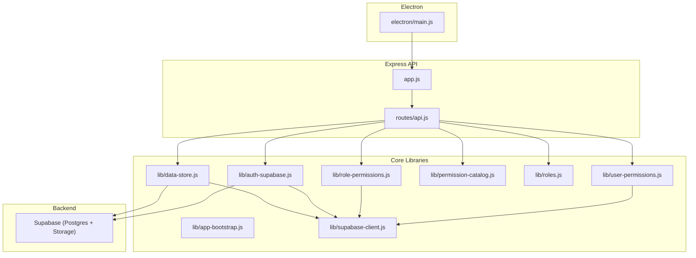
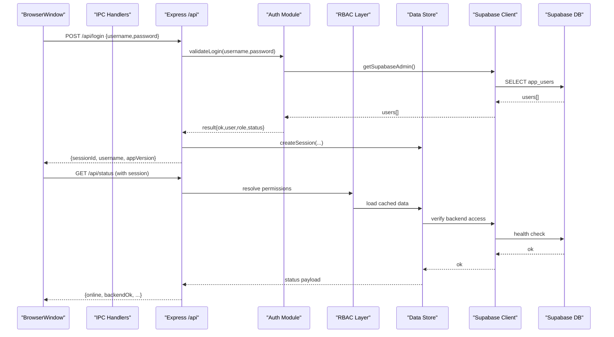
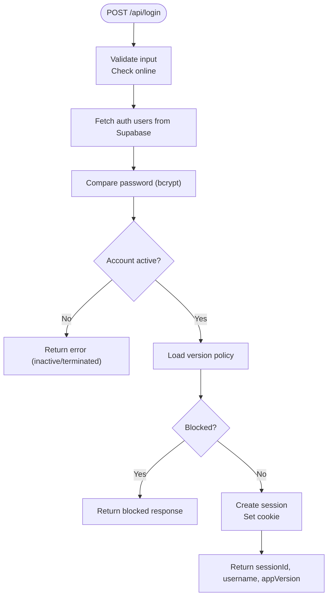
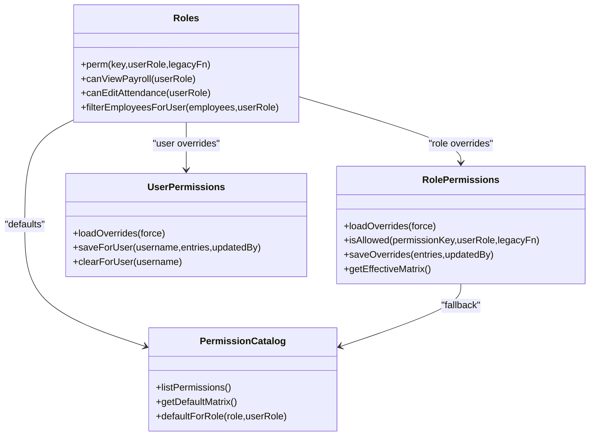
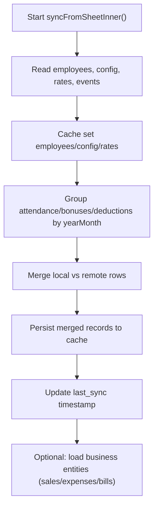
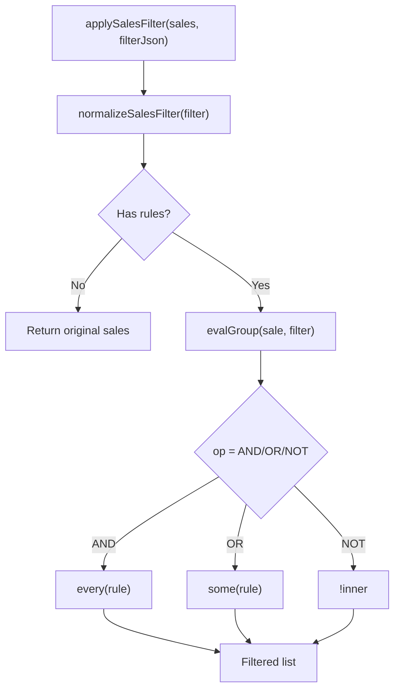
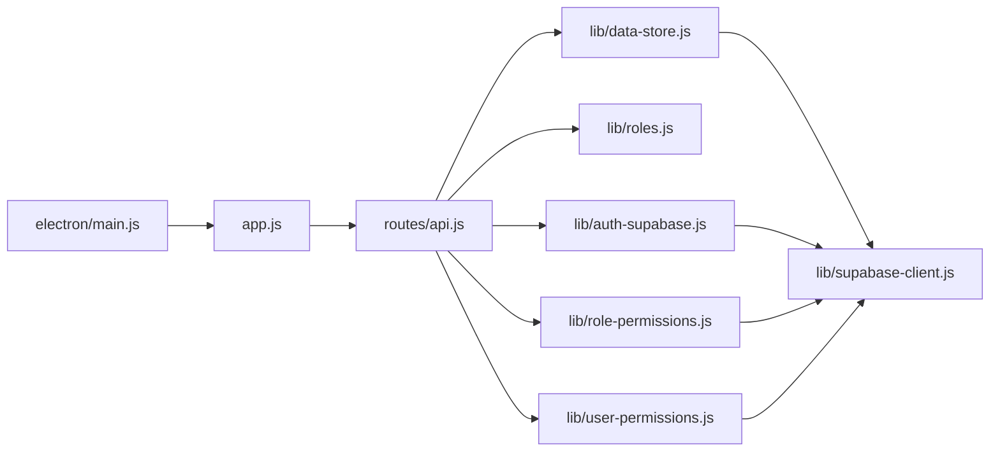

# Code Standards & Guidelines

<cite>
**Referenced Files in This Document**
- [README.md](file://README.md)
- [package.json](file://package.json)
- [app.js](file://app.js)
- [electron/main.js](file://electron/main.js)
- [lib/app-bootstrap.js](file://lib/app-bootstrap.js)
- [lib/auth-supabase.js](file://lib/auth-supabase.js)
- [lib/role-permissions.js](file://lib/role-permissions.js)
- [lib/user-permissions.js](file://lib/user-permissions.js)
- [lib/permission-catalog.js](file://lib/permission-catalog.js)
- [lib/roles.js](file://lib/roles.js)
- [lib/supabase-client.js](file://lib/supabase-client.js)
- [lib/data-store.js](file://lib/data-store.js)
- [routes/api.js](file://routes/api.js)
- [lib/sales-filter.js](file://lib/sales-filter.js)
- [lib/sales-submit-required.js](file://lib/sales-submit-required.js)
</cite>

## Table of Contents
1. Introduction
2. Project Structure
3. Core Components
4. Architecture Overview
5. Detailed Component Analysis
6. Dependency Analysis
7. Performance Considerations
8. Troubleshooting Guide
9. Conclusion
10. Appendices

## Introduction
This document defines the code standards and contribution guidelines for the Hangup Portal HR Management System. It covers JavaScript coding conventions, file organization patterns, naming conventions, architectural principles, role-based access control (RBAC) implementation patterns, business rule definition standards, API design guidelines, Git workflow procedures, pull request requirements, code review checklist, release preparation steps, security considerations, performance optimization guidelines, and documentation standards for new features.

The system is an Electron desktop application with a local Express server on loopback, a Supabase backend as the source of truth, and a local SQLite cache for fast reads. Authentication uses bcrypt-hashed passwords stored in Supabase, and authorization is enforced via RBAC with role defaults and per-user overrides.

## Project Structure
High-level structure:
- electron/: Electron main process entry, IPC handlers, window management, update flow
- lib/: Business logic, data store, RBAC, Supabase client, utilities
- routes/: Express API endpoints
- public/: Static UI assets
- supabase/migrations/: Database schema migrations
- scripts/: Build, migration, seeding, and QA scripts
- test/: Unit tests for critical modules

**Diagram sources**
- [electron/main.js:1-309](file://electron/main.js#L1-L309)
- [app.js:1-57](file://app.js#L1-L57)
- [routes/api.js:1-800](file://routes/api.js#L1-L800)
- [lib/app-bootstrap.js:1-76](file://lib/app-bootstrap.js#L1-L76)
- [lib/auth-supabase.js:1-73](file://lib/auth-supabase.js#L1-L73)
- [lib/role-permissions.js:1-159](file://lib/role-permissions.js#L1-L159)
- [lib/user-permissions.js:1-127](file://lib/user-permissions.js#L1-L127)
- [lib/permission-catalog.js:1-325](file://lib/permission-catalog.js#L1-L325)
- [lib/roles.js:1-800](file://lib/roles.js#L1-L800)
- [lib/supabase-client.js:1-134](file://lib/supabase-client.js#L1-L134)
- [lib/data-store.js:1-200](file://lib/data-store.js#L1-L200)

**Section sources**
- [README.md:25-43](file://README.md#L25-L43)
- [package.json:1-161](file://package.json#L1-L161)

## Core Components
- Electron main process: bootstraps environment, starts Express on loopback, manages BrowserWindow, handles IPC for updates and file operations, polls session validity.
- Express app: mounts static files, registers API routes, preloads permission catalogs, provides login/session pages.
- Auth module: fetches users from Supabase, validates credentials using bcrypt, checks account status, supports session revalidation.
- RBAC layer: role permissions with catalog defaults, database-backed overrides, per-user overrides, effective matrix computation.
- Data store: syncs from backend into local cache, merges attendance/bonuses/deductions by month, enforces mutation locks, exposes read APIs to routes.
- Supabase client: admin and anon clients, user-scoped client, configuration validation, real-time transport setup.

Key responsibilities and interactions are illustrated in the architecture diagram above.

**Section sources**
- [electron/main.js:1-309](file://electron/main.js#L1-L309)
- [app.js:1-57](file://app.js#L1-L57)
- [lib/auth-supabase.js:1-73](file://lib/auth-supabase.js#L1-L73)
- [lib/role-permissions.js:1-159](file://lib/role-permissions.js#L1-L159)
- [lib/user-permissions.js:1-127](file://lib/user-permissions.js#L1-L127)
- [lib/permission-catalog.js:1-325](file://lib/permission-catalog.js#L1-L325)
- [lib/roles.js:1-800](file://lib/roles.js#L1-L800)
- [lib/supabase-client.js:1-134](file://lib/supabase-client.js#L1-L134)
- [lib/data-store.js:1-200](file://lib/data-store.js#L1-L200)

## Architecture Overview
The application follows a layered architecture:
- Presentation: Electron BrowserWindow loads static HTML/CSS/JS served by Express.
- API Layer: Express routes enforce authentication and authorization, orchestrate business logic, and return JSON responses.
- Domain Logic: lib/* modules implement business rules, RBAC, payroll calculations, sales filters, and data transformations.
- Persistence: Local SQLite cache for performance; Supabase Postgres as authoritative source. Migrations live under supabase/migrations.

**Diagram sources**
- [routes/api.js:552-627](file://routes/api.js#L552-L627)
- [lib/auth-supabase.js:24-47](file://lib/auth-supabase.js#L24-L47)
- [lib/role-permissions.js:71-83](file://lib/role-permissions.js#L71-L83)
- [lib/data-store.js:105-112](file://lib/data-store.js#L105-L112)
- [lib/supabase-client.js:80-91](file://lib/supabase-client.js#L80-L91)

## Detailed Component Analysis

### Authentication and Session Flow
- Login endpoint validates credentials against Supabase-stored bcrypt hashes, checks account status, enforces version policy, creates a session, and returns sessionId.
- Session polling in Electron periodically revalidates user status and can trigger uninstall or logout flows.

**Diagram sources**
- [routes/api.js:552-627](file://routes/api.js#L552-L627)
- [lib/auth-supabase.js:24-47](file://lib/auth-supabase.js#L24-L47)

**Section sources**
- [routes/api.js:552-627](file://routes/api.js#L552-L627)
- [lib/auth-supabase.js:1-73](file://lib/auth-supabase.js#L1-L73)
- [electron/main.js:125-164](file://electron/main.js#L125-L164)

### Role-Based Access Control (RBAC)
- Permission catalog defines default permissions per role and categories.
- Role permissions are loaded from Supabase with in-memory caching and TTL invalidation.
- Per-user overrides allow exception grants.
- Centralized helpers in roles.js expose fine-grained checks that route through perm(), which consults user overrides first, then role overrides, then catalog defaults.

**Diagram sources**
- [lib/permission-catalog.js:1-325](file://lib/permission-catalog.js#L1-L325)
- [lib/role-permissions.js:1-159](file://lib/role-permissions.js#L1-L159)
- [lib/user-permissions.js:1-127](file://lib/user-permissions.js#L1-L127)
- [lib/roles.js:69-76](file://lib/roles.js#L69-L76)

**Section sources**
- [lib/permission-catalog.js:1-325](file://lib/permission-catalog.js#L1-L325)
- [lib/role-permissions.js:1-159](file://lib/role-permissions.js#L1-L159)
- [lib/user-permissions.js:1-127](file://lib/user-permissions.js#L1-L127)
- [lib/roles.js:1-800](file://lib/roles.js#L1-L800)

### Data Store and Sync Strategy
- The data store groups records by year-month, merges local and remote attendance/bonuses/deductions, and caches results for fast reads.
- Mutation lock ensures serialized writes to avoid race conditions.
- Sync orchestrates bulk reads from backend and populates local cache.

**Diagram sources**
- [lib/data-store.js:114-200](file://lib/data-store.js#L114-L200)

**Section sources**
- [lib/data-store.js:1-200](file://lib/data-store.js#L1-L200)

### Sales Filtering and Submission Validation
- Sales filter engine supports nested AND/OR/NOT groups, field operators (IS, IS NOT, CONTAINS, ON, BEFORE, AFTER), and normalization to remove no-op rules.
- Submission validation enforces required fields based on payment method and top-level constraints.

**Diagram sources**
- [lib/sales-filter.js:112-142](file://lib/sales-filter.js#L112-L142)

**Section sources**
- [lib/sales-filter.js:50-142](file://lib/sales-filter.js#L50-L142)
- [lib/sales-submit-required.js:111-135](file://lib/sales-submit-required.js#L111-L135)

## Dependency Analysis
- Electron main depends on app bootstrap, Express app creation, auth, session store, network, and GitHub updater.
- Express app mounts API routes and preloads permission catalogs at startup.
- API routes depend on auth, roles, RBAC, data store, calendar, payroll, and various domain modules.
- Data store depends on backend abstraction, cache, changelog, and business modules.
- Supabase client provides admin/anon/user-scoped clients used across auth, RBAC, and data store.

**Diagram sources**
- [electron/main.js:1-309](file://electron/main.js#L1-L309)
- [app.js:1-57](file://app.js#L1-L57)
- [routes/api.js:1-800](file://routes/api.js#L1-L800)
- [lib/auth-supabase.js:1-73](file://lib/auth-supabase.js#L1-L73)
- [lib/role-permissions.js:1-159](file://lib/role-permissions.js#L1-L159)
- [lib/user-permissions.js:1-127](file://lib/user-permissions.js#L1-L127)
- [lib/data-store.js:1-200](file://lib/data-store.js#L1-L200)
- [lib/supabase-client.js:1-134](file://lib/supabase-client.js#L1-L134)

**Section sources**
- [electron/main.js:1-309](file://electron/main.js#L1-L309)
- [app.js:1-57](file://app.js#L1-L57)
- [routes/api.js:1-800](file://routes/api.js#L1-L800)

## Performance Considerations
- Prefer reading from local cache via data store; only hit Supabase when necessary.
- Use group-by-year-month indexing patterns when processing large datasets to minimize memory pressure.
- Leverage RBAC in-memory caches with TTL to reduce repeated DB queries for permission checks.
- Batch operations where possible (e.g., bulk reads during sync).
- Avoid heavy computations inside hot paths; precompute summaries and reuse maps.

[No sources needed since this section provides general guidance]

## Troubleshooting Guide
Common issues and resolutions:
- Port already in use: Close other instances or change port in Electron main before starting.
- Supabase not configured: Ensure .env contains SUPABASE_URL, SUPABASE_SECRET_KEY, and SUPABASE_PUBLISHABLE_KEY.
- Session revoked or expired: Re-login; Electron will prompt if admin action is required.
- Backend unreachable: Health endpoint reports offline state; verify network and Supabase keys.

Operational references:
- Startup errors and fatal dialogs are handled in Electron main.
- Health and status endpoints provide diagnostics.

**Section sources**
- [electron/main.js:53-76](file://electron/main.js#L53-L76)
- [lib/app-bootstrap.js:59-73](file://lib/app-bootstrap.js#L59-L73)
- [routes/api.js:525-550](file://routes/api.js#L525-L550)

## Conclusion
This guide consolidates coding standards, architectural principles, and operational practices for the Hangup Portal HR Management System. By adhering to these conventions—especially around RBAC, data store usage, and secure configuration—you ensure consistent, maintainable, and secure development across the project.

[No sources needed since this section summarizes without analyzing specific files]

## Appendices

### Coding Conventions for JavaScript Modules
- File organization:
  - Feature-oriented modules in lib/ with clear single-responsibility functions.
  - Route handlers in routes/ grouped by domain.
  - Electron-specific code in electron/.
- Naming:
  - camelCase for variables/functions, PascalCase for classes (if any), UPPER_SNAKE_CASE for constants.
  - Permission keys use kebab-to-snake mapping consistently (e.g., view_payroll → viewPayroll).
- Error handling:
  - Throw typed errors with descriptive messages; catch non-fatal failures gracefully.
  - Return structured JSON responses with explicit status codes.
- Async patterns:
  - Use async/await; guard against unhandled rejections.
  - Serialize mutations with provided locks to prevent races.
- Logging:
  - Use console.warn/error for non-fatal issues; include context identifiers (module, operation).

**Section sources**
- [routes/api.js:1-800](file://routes/api.js#L1-L800)
- [lib/data-store.js:105-112](file://lib/data-store.js#L105-L112)

### File Organization Patterns
- Keep business logic in lib/ with cohesive modules (e.g., payroll, attendance, sales).
- Place API endpoints in routes/, each file owning a feature area.
- Maintain Electron entry and IPC in electron/.
- Store migrations under supabase/migrations/ with timestamps.

**Section sources**
- [package.json:49-108](file://package.json#L49-L108)
- [README.md:63-70](file://README.md#L63-L70)

### Architectural Principles
- Single source of truth: Supabase; local cache for performance.
- Server-side secrets never reach the UI.
- RBAC-first: all sensitive actions must pass permission checks.
- Idempotent sync: merge strategies prevent accidental overwrites.

**Section sources**
- [README.md:25-43](file://README.md#L25-L43)
- [lib/supabase-client.js:80-91](file://lib/supabase-client.js#L80-L91)

### Role-Based Access Control Implementation Patterns
- Define defaults in permission catalog.
- Persist overrides in Supabase tables with normalized keys.
- Provide both async and sync permission checks; prefer async for consistency.
- Expose helpers in roles.js for UI and API gating.

**Section sources**
- [lib/permission-catalog.js:1-325](file://lib/permission-catalog.js#L1-L325)
- [lib/role-permissions.js:1-159](file://lib/role-permissions.js#L1-L159)
- [lib/user-permissions.js:1-127](file://lib/user-permissions.js#L1-L127)
- [lib/roles.js:69-76](file://lib/roles.js#L69-L76)

### Business Rule Definition Standards
- Encapsulate rules in dedicated modules (e.g., sales submit validation, attendance employment checks).
- Keep rules pure and testable; separate side effects from decision logic.
- Document rule intent and edge cases near definitions.

**Section sources**
- [lib/sales-submit-required.js:111-135](file://lib/sales-submit-required.js#L111-L135)
- [lib/sales-filter.js:112-142](file://lib/sales-filter.js#L112-L142)

### API Design Guidelines
- RESTful endpoints under /api with clear verbs and nouns.
- Enforce authentication via requireAuth middleware.
- Return consistent error shapes with HTTP status codes.
- Support pagination/filtering where applicable.

**Section sources**
- [routes/api.js:90-145](file://routes/api.js#L90-L145)
- [routes/api.js:525-550](file://routes/api.js#L525-L550)

### Git Workflow Procedures
- Branching:
  - Main branch protected; feature branches named feature/<short-desc>.
  - Hotfix branches named hotfix/<short-desc>.
- Commits:
  - Conventional commit style (feat:, fix:, chore:, docs:).
  - Scope changes to small, focused commits.
- Pull Requests:
  - Link related issues.
  - Include screenshots for UI changes.
  - Add/update tests for critical logic.
- Reviews:
  - Require at least one approval.
  - CI must pass before merge.

[No sources needed since this section provides general guidance]

### Pull Request Requirements
- Description of changes and rationale.
- Test coverage for new logic.
- Migration notes if schema changed.
- Security implications reviewed.

[No sources needed since this section provides general guidance]

### Code Review Checklist
- Correctness: logic matches requirements.
- Security: secrets not exposed, inputs validated, RBAC enforced.
- Performance: avoids unnecessary DB calls, uses cache appropriately.
- Readability: clear names, comments where needed.
- Tests: unit tests added/updated.

[No sources needed since this section provides general guidance]

### Release Preparation Steps
- Bump package.json version.
- Update documentation (README, FEATURES, TUTORIAL).
- Apply pending migrations.
- Build installer/portable artifacts.
- Distribute EXE and optionally publish GitHub updates.
- Verify app_versions in Supabase.

**Section sources**
- [README.md:265-274](file://README.md#L265-L274)
- [package.json:10-22](file://package.json#L10-L22)

### Security Considerations
- Keep SUPABASE_SECRET_KEY server-side only.
- Use admin client for privileged operations; anon client for RLS-enforced access.
- Validate and sanitize all inputs.
- Enforce session timeouts and revocation.

**Section sources**
- [lib/supabase-client.js:80-91](file://lib/supabase-client.js#L80-L91)
- [app.js:13-19](file://app.js#L13-L19)

### Performance Optimization Guidelines
- Cache frequently accessed data (permissions, configs).
- Group operations by year-month to leverage cache indexes.
- Minimize round-trips by batching reads/writes.
- Debounce frequent UI-triggered requests.

[No sources needed since this section provides general guidance]

### Documentation Standards for New Features
- Update README and relevant docs (FEATURES, TUTORIAL).
- Add inline comments for complex logic.
- Include migration scripts and rollback notes if needed.
- Record permission changes in Access Control impact.

**Section sources**
- [README.md:265-274](file://README.md#L265-L274)