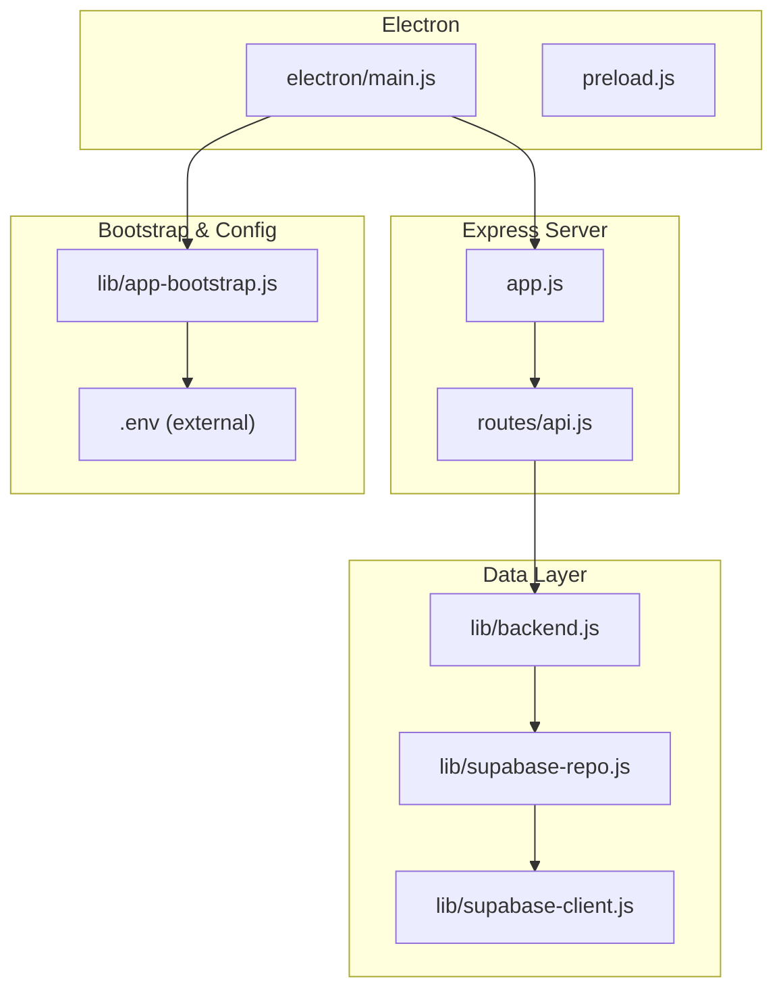
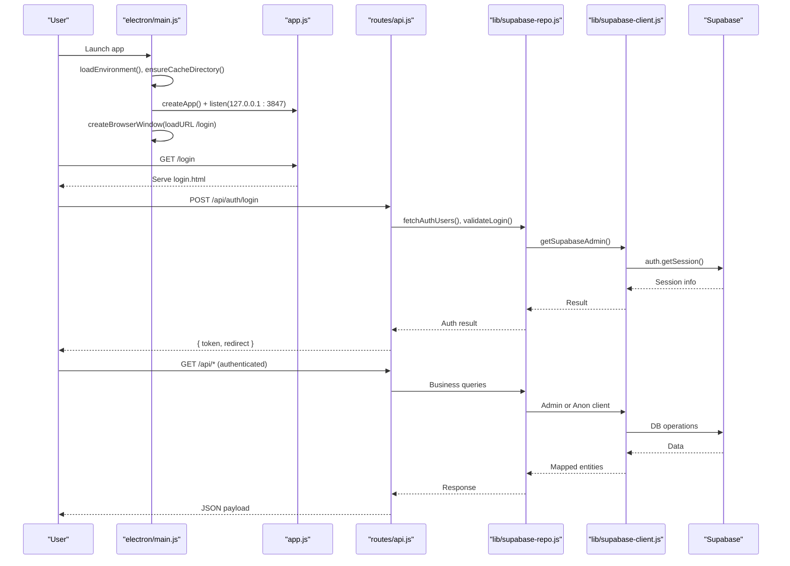
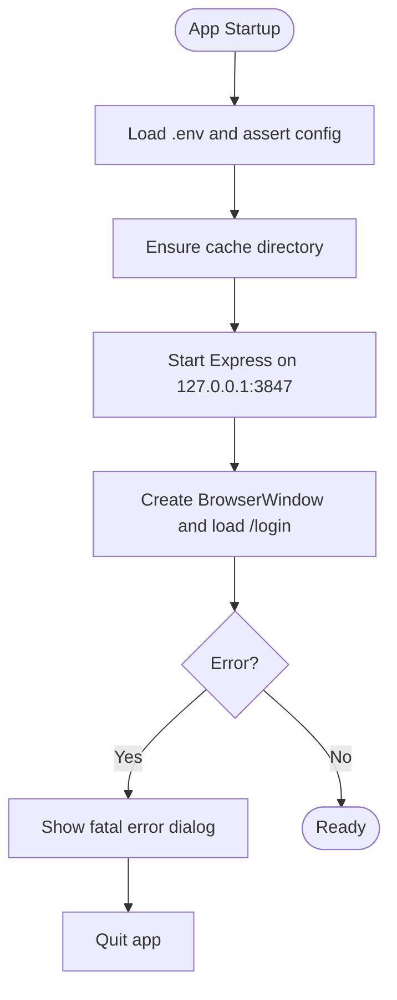
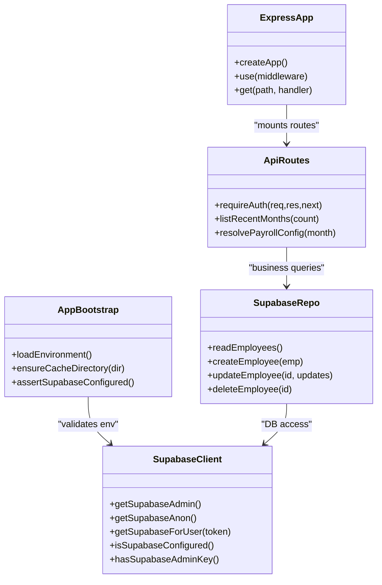
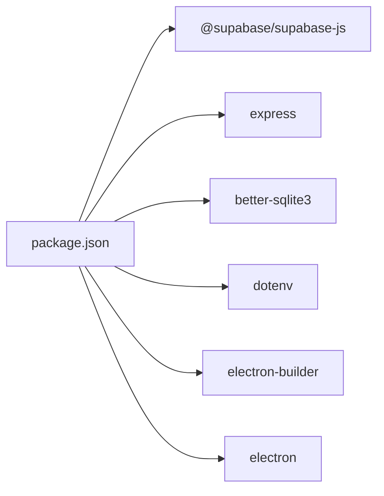

# Developer Guide

<cite>
**Referenced Files in This Document**
- [package.json](file://package.json)
- [README.md](file://README.md)
- [app.js](file://app.js)
- [electron/main.js](file://electron/main.js)
- [lib/app-bootstrap.js](file://lib/app-bootstrap.js)
- [lib/backend.js](file://lib/backend.js)
- [lib/supabase-client.js](file://lib/supabase-client.js)
- [lib/supabase-express.js](file://lib/supabase-express.js)
- [lib/supabase-repo.js](file://lib/supabase-repo.js)
- [routes/api.js](file://routes/api.js)
- [scripts/ensure-electron.js](file://scripts/ensure-electron.js)
- [scripts/run-all-tests.js](file://scripts/run-all-tests.js)
- [scripts/test-supabase.js](file://scripts/test-supabase.js)
- [test/attendance-validation.test.js](file://test/attendance-validation.test.js)
- [.github/RELEASE_SETUP.md](file:.github/RELEASE_SETUP.md)
</cite>

## Table of Contents
1. [Introduction](#introduction)
2. [Project Structure](#project-structure)
3. [Core Components](#core-components)
4. [Architecture Overview](#architecture-overview)
5. [Detailed Component Analysis](#detailed-component-analysis)
6. [Dependency Analysis](#dependency-analysis)
7. [Performance Considerations](#performance-considerations)
8. [Troubleshooting Guide](#troubleshooting-guide)
9. [Conclusion](#conclusion)
10. [Appendices](#appendices)

## Introduction
This developer guide explains how to set up the local development environment, run and debug the Electron application, execute tests, follow contribution guidelines, and extend the system via plugins and custom reports. It also covers release procedures and common troubleshooting strategies for the Electron main process, Express backend, and Supabase integration.

The application is an Electron desktop app with a local Express server (loopback only) that serves the UI and routes API calls to Supabase. A local SQLite cache improves read performance while writes are persisted to Supabase.

## Project Structure
Key directories and files:
- electron/: Electron entry points and preload scripts
- lib/: Core business logic, data access, and utilities
- routes/: Express route handlers
- public/: Static frontend assets
- scripts/: Build, migration, testing, and utility scripts
- test/: Unit tests using Node’s built-in test runner
- supabase/migrations/: Database schema migrations

**Diagram sources**
- [electron/main.js:1-309](file://electron/main.js#L1-L309)
- [app.js:1-57](file://app.js#L1-L57)
- [routes/api.js:1-200](file://routes/api.js#L1-L200)
- [lib/backend.js:1-29](file://lib/backend.js#L1-L29)
- [lib/supabase-repo.js:1-200](file://lib/supabase-repo.js#L1-L200)
- [lib/supabase-client.js:1-134](file://lib/supabase-client.js#L1-L134)
- [lib/app-bootstrap.js:1-76](file://lib/app-bootstrap.js#L1-L76)

**Section sources**
- [README.md:1-120](file://README.md#L1-L120)
- [package.json:1-161](file://package.json#L1-L161)

## Core Components
- Electron Main Process: Bootstraps environment, starts Express on loopback, creates BrowserWindow, manages IPC, session polling, and updates.
- Express Application: Middleware stack, static file serving, authentication/session handling, and API routing.
- Data Access Layer: Supabase client wrappers and repository functions for database operations.
- Bootstrap and Configuration: Environment loading, cache directory setup, and configuration validation.
- Testing Utilities: Test orchestrator and connectivity checks.

**Section sources**
- [electron/main.js:1-309](file://electron/main.js#L1-L309)
- [app.js:1-57](file://app.js#L1-L57)
- [lib/supabase-client.js:1-134](file://lib/supabase-client.js#L1-L134)
- [lib/supabase-repo.js:1-200](file://lib/supabase-repo.js#L1-L200)
- [lib/app-bootstrap.js:1-76](file://lib/app-bootstrap.js#L1-L76)
- [scripts/run-all-tests.js:1-29](file://scripts/run-all-tests.js#L1-L29)

## Architecture Overview
High-level flow from startup to user interaction:

**Diagram sources**
- [electron/main.js:1-309](file://electron/main.js#L1-L309)
- [app.js:1-57](file://app.js#L1-L57)
- [routes/api.js:1-200](file://routes/api.js#L1-L200)
- [lib/supabase-repo.js:1-200](file://lib/supabase-repo.js#L1-L200)
- [lib/supabase-client.js:1-134](file://lib/supabase-client.js#L1-L134)

## Detailed Component Analysis

### Development Environment Setup
- Prerequisites: Windows 10/11 x64, Node.js 18+, .env with Supabase keys, optional credentials for legacy Drive-backed IDs.
- Install dependencies and rebuild native modules:
  - npm install
  - npm run rebuild:native
- Start the app:
  - npm start
- If Electron fails to start:
  - npm run fix:electron

Environment loading and validation:
- The bootstrap module loads .env from multiple locations including portable mode and packaged resources.
- On startup, it asserts Supabase configuration and ensures the cache directory exists.

Supabase connectivity check:
- Use the provided script to verify URL and keys, and probe admin/anon clients.

**Section sources**
- [README.md:104-176](file://README.md#L104-L176)
- [lib/app-bootstrap.js:1-76](file://lib/app-bootstrap.js#L1-L76)
- [scripts/ensure-electron.js:1-39](file://scripts/ensure-electron.js#L1-L39)
- [scripts/test-supabase.js:1-66](file://scripts/test-supabase.js#L1-L66)

### Debugging Techniques for Electron Applications
- Single instance lock: Prevents multiple instances; focuses existing window if launched again.
- Error dialogs: Fatal errors during startup or unexpected exceptions show dialog boxes and quit gracefully.
- Port conflicts: If the Express port is already in use, a clear error message guides resolution.
- IPC debugging: File picker and write-file-buffer handlers allow inspecting UI-to-main interactions.
- Update flow: IPC handles for GitHub update checks and apply/update relaunch help diagnose update issues.

**Diagram sources**
- [electron/main.js:1-309](file://electron/main.js#L1-L309)
- [lib/app-bootstrap.js:1-76](file://lib/app-bootstrap.js#L1-L76)

**Section sources**
- [electron/main.js:1-309](file://electron/main.js#L1-L309)

### Testing Procedures
- Run all scripted tests:
  - npm test
- Supabase connectivity test:
  - npm run test:supabase
- Unit tests with Node’s built-in test runner:
  - Example: test/attendance-validation.test.js

Test orchestration:
- The orchestrator runs a list of scripts sequentially and aggregates failures.

Unit test example path:
- [test/attendance-validation.test.js:1-22](file://test/attendance-validation.test.js#L1-L22)

**Section sources**
- [scripts/run-all-tests.js:1-29](file://scripts/run-all-tests.js#L1-L29)
- [scripts/test-supabase.js:1-66](file://scripts/test-supabase.js#L1-L66)
- [test/attendance-validation.test.js:1-22](file://test/attendance-validation.test.js#L1-L22)

### Contribution Guidelines
- Repository setup and secrets:
  - Follow the GitHub repository setup guide to configure secrets and enable in-app updates.
- Do not commit sensitive files:
  - .env, credentials/service-account.json, node_modules/, dist/
- Release workflow:
  - Tag versions and publish via GitHub Actions or locally using provided scripts.

**Section sources**
- [.github/RELEASE_SETUP.md](file:.github/RELEASE_SETUP.md#L1-L110)

### Code Standards
- Backend selection:
  - Only Supabase is supported; Sheets backend is disabled at runtime.
- Authentication and sessions:
  - Express middleware validates sessions and enforces role-based access.
- Security:
  - Secret key stays server-side; RLS applies for anonymous/publishable clients.

**Section sources**
- [lib/backend.js:1-29](file://lib/backend.js#L1-L29)
- [routes/api.js:1-200](file://routes/api.js#L1-L200)
- [lib/supabase-client.js:1-134](file://lib/supabase-client.js#L1-L134)

### Extending the System
- Plugins and custom reports:
  - Add new Express routes under routes/ and integrate with the data layer via lib/supabase-repo.js.
  - Use lib/supabase-express.js middleware to attach Supabase clients to requests.
- Integration points:
  - Use getSupabaseAdmin() for server-side operations bypassing RLS.
  - Use getSupabaseAnon() or getSupabaseForUser(token) for RLS-enforced operations.
- Customizing behavior:
  - Extend lib/ modules for domain logic (e.g., attendance, payroll, sales).
  - Use lib/app-bootstrap.js patterns for environment and cache management.

**Diagram sources**
- [lib/app-bootstrap.js:1-76](file://lib/app-bootstrap.js#L1-L76)
- [lib/supabase-client.js:1-134](file://lib/supabase-client.js#L1-L134)
- [lib/supabase-repo.js:1-200](file://lib/supabase-repo.js#L1-L200)
- [app.js:1-57](file://app.js#L1-L57)
- [routes/api.js:1-200](file://routes/api.js#L1-L200)

**Section sources**
- [lib/supabase-express.js:1-38](file://lib/supabase-express.js#L1-L38)
- [lib/supabase-repo.js:1-200](file://lib/supabase-repo.js#L1-L200)
- [routes/api.js:1-200](file://routes/api.js#L1-L200)

### Release Procedures
- Local builds:
  - npm run dist:all
  - Outputs installer and portable EXE to dist/.
- GitHub in-app updates:
  - Configure GITHUB_UPDATES_REPO in .env.
  - Publish releases via GitHub CLI or Actions.
- Version policy:
  - Bump package.json version and update app_versions in Supabase.
  - Distribute new EXE to HR PCs.

**Section sources**
- [README.md:104-176](file://README.md#L104-L176)
- [package.json:1-161](file://package.json#L1-L161)
- [.github/RELEASE_SETUP.md](file:.github/RELEASE_SETUP.md#L1-L110)

## Dependency Analysis
Runtime dependencies include Express, Supabase JS SDK, better-sqlite3, dotenv, cookie-parser, express-session, ws, and others. DevDependencies include Electron, electron-builder, and pg.

**Diagram sources**
- [package.json:138-161](file://package.json#L138-L161)

**Section sources**
- [package.json:1-161](file://package.json#L1-L161)

## Performance Considerations
- Local SQLite cache reduces latency for reads; writes are persisted to Supabase and re-synced automatically.
- Avoid heavy synchronous operations in the main process; prefer async flows and offload work to worker threads if needed.
- Minimize network calls by batching operations and leveraging Supabase query optimizations.
- Keep Express request payloads reasonable; default limit is configured for larger uploads.

[No sources needed since this section provides general guidance]

## Troubleshooting Guide
Common issues and strategies:
- Port already in use:
  - Close other Hangup Portal windows or processes using port 3847.
- Electron binary invalid:
  - Re-run the ensure-electron script or reinstall Electron.
- Missing Supabase configuration:
  - Ensure SUPABASE_URL, SUPABASE_SECRET_KEY, and SUPABASE_PUBLISHABLE_KEY are set in .env.
- Session expired or revoked:
  - Re-authenticate; the server will invalidate sessions when roles change or admins revoke access.
- Unexpected errors:
  - Fatal error dialogs capture uncaught exceptions; review logs and restart the app.

**Section sources**
- [electron/main.js:1-309](file://electron/main.js#L1-L309)
- [scripts/ensure-electron.js:1-39](file://scripts/ensure-electron.js#L1-L39)
- [lib/app-bootstrap.js:1-76](file://lib/app-bootstrap.js#L1-L76)
- [routes/api.js:1-200](file://routes/api.js#L1-L200)

## Conclusion
This guide covered environment setup, testing, debugging, code standards, contributions, extensions, and release procedures. By following these practices, developers can efficiently build, test, and ship updates for the Electron desktop application integrated with Supabase.

[No sources needed since this section summarizes without analyzing specific files]

## Appendices
- Commands reference:
  - npm start: Run from source
  - npm run dist:all: Build installer and portable
  - npm test: Run all tests
  - npm run test:supabase: Verify Supabase connectivity
- Useful paths:
  - Electron main: electron/main.js
  - Express app: app.js
  - API routes: routes/api.js
  - Supabase client: lib/supabase-client.js
  - Data repo: lib/supabase-repo.js
  - Bootstrap: lib/app-bootstrap.js

**Section sources**
- [package.json:1-161](file://package.json#L1-L161)
- [README.md:162-179](file://README.md#L162-L179)