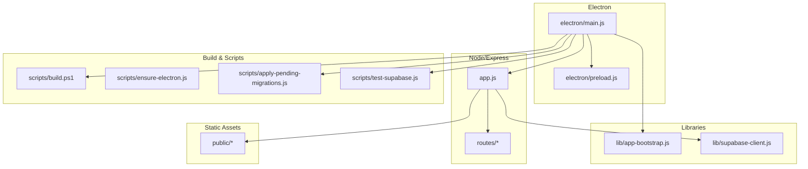
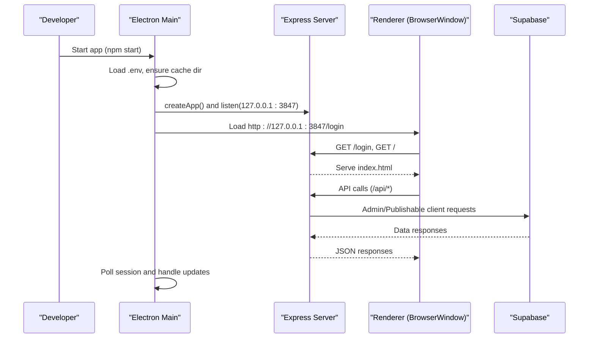
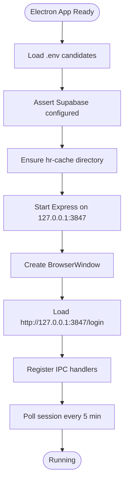
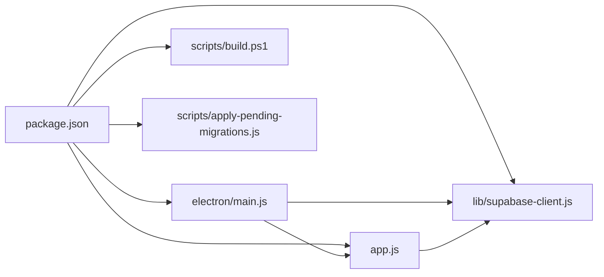

# Development Setup

<cite>
**Referenced Files in This Document**
- [package.json](file://package.json)
- [README.md](file://README.md)
- [app.js](file://app.js)
- [electron/main.js](file://electron/main.js)
- [electron/preload.js](file://electron/preload.js)
- [lib/app-bootstrap.js](file://lib/app-bootstrap.js)
- [lib/supabase-client.js](file://lib/supabase-client.js)
- [scripts/build.ps1](file://scripts/build.ps1)
- [scripts/ensure-electron.js](file://scripts/ensure-electron.js)
- [scripts/apply-pending-migrations.js](file://scripts/apply-pending-migrations.js)
- [scripts/test-supabase.js](file://scripts/test-supabase.js)
</cite>

## Table of Contents
1. Introduction
2. Project Structure
3. Core Components
4. Architecture Overview
5. Detailed Component Analysis
6. Dependency Analysis
7. Performance Considerations
8. Troubleshooting Guide
9. Conclusion
10. Appendices

## Introduction
This document provides a complete development setup guide for the Hangup Portal HR Management System. It covers local environment configuration, Node.js requirements, dependency installation, project structure overview, Electron development workflow, Supabase connection setup, local database migrations, build process using PowerShell scripts, debugging techniques for main and renderer processes, common setup issues with solutions, IDE recommendations, and environment variables management.

The application is an Electron desktop app that runs a local Express server on loopback, serves static HTML/JS/CSS from the public folder, and communicates with a Supabase backend (Postgres + Storage). A local SQLite cache improves read performance while writes are persisted to Supabase.

## Project Structure
Key directories and files relevant to development:
- electron/: Electron entry points and preload bridge
- lib/: Shared business logic, Supabase client helpers, bootstrap utilities
- routes/: Express API route handlers
- public/: Static frontend assets served by Express
- scripts/: Build, migration, and utility scripts
- supabase/migrations/: DDL migration SQL files applied to the live database

**Diagram sources**
- [electron/main.js:1-309](file://electron/main.js#L1-L309)
- [electron/preload.js:1-14](file://electron/preload.js#L1-L14)
- [app.js:1-57](file://app.js#L1-L57)
- [lib/app-bootstrap.js:1-76](file://lib/app-bootstrap.js#L1-L76)
- [lib/supabase-client.js:1-134](file://lib/supabase-client.js#L1-L134)
- [scripts/build.ps1:1-205](file://scripts/build.ps1#L1-L205)
- [scripts/apply-pending-migrations.js:1-288](file://scripts/apply-pending-migrations.js#L1-L288)
- [scripts/test-supabase.js:1-48](file://scripts/test-supabase.js#L1-L48)

**Section sources**
- [package.json:1-161](file://package.json#L1-L161)
- [README.md:1-275](file://README.md#L1-L275)

## Core Components
- Electron main process: initializes environment, starts Express, creates BrowserWindow, sets up IPC, and manages session polling and updates.
- Express server: serves static UI, mounts API routes, configures sessions, and loads permission overrides at startup.
- Preload bridge: exposes safe IPC methods to the renderer via contextBridge.
- Supabase client helpers: provide admin and anon clients, validation, and environment checks.
- Bootstrap utilities: load .env from multiple locations, ensure cache directory, assert Supabase configuration.
- Build and migration scripts: automate native rebuilds, packaging, and applying pending migrations.

**Section sources**
- [electron/main.js:1-309](file://electron/main.js#L1-L309)
- [app.js:1-57](file://app.js#L1-L57)
- [electron/preload.js:1-14](file://electron/preload.js#L1-L14)
- [lib/app-bootstrap.js:1-76](file://lib/app-bootstrap.js#L1-L76)
- [lib/supabase-client.js:1-134](file://lib/supabase-client.js#L1-L134)

## Architecture Overview
The runtime architecture consists of:
- Electron main process launching a local Express server on loopback
- Renderer process loading the login/index pages from the Express server
- Server-side Supabase client calls for authentication and data operations
- Local SQLite cache layer for fast reads (managed by libraries under lib/)

**Diagram sources**
- [electron/main.js:53-115](file://electron/main.js#L53-L115)
- [app.js:8-54](file://app.js#L8-L54)
- [lib/supabase-client.js:80-133](file://lib/supabase-client.js#L80-L133)

## Detailed Component Analysis

### Environment Configuration and .env Loading
- The bootstrap module searches for .env across multiple paths including app root, current working directory, resources path, portable executable directory, and app path.
- It ensures a cache directory exists and validates that Supabase is configured; it rejects legacy Google Sheets backend.

Environment variables required for development:
- DATA_BACKEND=supabase
- SUPABASE_URL
- SUPABASE_SECRET_KEY or SUPABASE_SERVICE_ROLE_KEY
- SUPABASE_PUBLISHABLE_KEY or SUPABASE_ANON_KEY
- SESSION_SECRET (optional; defaults if not set)

Recommended additional variables:
- GITHUB_UPDATES_REPO (for in-app update checks)
- PORTABLE_EXECUTABLE_DIR (when running portable builds)

**Section sources**
- [lib/app-bootstrap.js:4-47](file://lib/app-bootstrap.js#L4-L47)
- [lib/app-bootstrap.js:49-57](file://lib/app-bootstrap.js#L49-L57)
- [lib/app-bootstrap.js:59-73](file://lib/app-bootstrap.js#L59-L73)
- [app.js:13-18](file://app.js#L13-L18)

### Supabase Client Setup
- Provides functions to check configuration, obtain admin/publishable clients, and expose public config.
- Uses WebSocket implementation when available for realtime features.

Validation and usage:
- Use npm run test:supabase to verify URL and keys.
- Admin client bypasses RLS; publishable client enforces RLS.

**Section sources**
- [lib/supabase-client.js:19-67](file://lib/supabase-client.js#L19-L67)
- [lib/supabase-client.js:80-133](file://lib/supabase-client.js#L80-L133)
- [scripts/test-supabase.js:1-48](file://scripts/test-supabase.js#L1-L48)

### Electron Main Process and Express Integration
- Loads environment, asserts Supabase configuration, ensures cache directory, starts Express on 127.0.0.1:3847, and creates a BrowserWindow.
- Exposes IPC handlers for file pickers, writing buffers, session management, GitHub update checks, and relaunch.
- Handles single-instance lock and window lifecycle.

**Diagram sources**
- [electron/main.js:166-256](file://electron/main.js#L166-L256)
- [electron/main.js:53-115](file://electron/main.js#L53-L115)

**Section sources**
- [electron/main.js:1-309](file://electron/main.js#L1-L309)
- [app.js:1-57](file://app.js#L1-L57)

### Preload Bridge and Renderer Access
- Exposes a minimal API to the renderer via contextBridge, including session control, file operations, and update actions.
- Ensures nodeIntegration is disabled and contextIsolation enabled for security.

**Section sources**
- [electron/preload.js:1-14](file://electron/preload.js#L1-L14)
- [electron/main.js:88-93](file://electron/main.js#L88-L93)

### Build Process (PowerShell)
- scripts/build.ps1 orchestrates dependency installation, optional native rebuild, code signing detection, and packaging via electron-builder.
- Supports targets: installer (NSIS), portable, and all.
- Handles locked output folders by renaming or switching to alternate dist directories.
- Sets MSVS version for native rebuilds and can skip rebuilds via SKIP_NATIVE_REBUILD.

Common commands:
- npm run dist:all
- .\scripts\build.ps1 all
- .\scripts\build.ps1 installer
- .\scripts\build.ps1 portable

Code signing:
- Set CSC_LINK and CSC_KEY_PASSWORD to sign the installer.

**Section sources**
- [scripts/build.ps1:1-205](file://scripts/build.ps1#L1-L205)
- [package.json:10-23](file://package.json#L10-L23)

### Database Migrations
- scripts/apply-pending-migrations.js probes the database state and applies missing DDL changes from supabase/migrations/*.sql.
- Auth options: Supabase MCP apply_migration, SUPABASE_ACCESS_TOKEN (Management API), or SUPABASE_DB_PASSWORD (direct Postgres via pg).
- Verifies applied migrations by re-probing state.

Usage:
- npm run apply:migrations
- node scripts/apply-pending-migrations.js

**Section sources**
- [scripts/apply-pending-migrations.js:1-288](file://scripts/apply-pending-migrations.js#L1-L288)

### Development Workflow
Prerequisites:
- Windows 10/11 x64
- Node.js 18+ (CI uses Node 20)
- .env with Supabase keys
- Optional credentials/service-account.json (stub allowed for Supabase backend)

Steps:
- Install dependencies: npm install
- Rebuild native modules for Electron: npm run rebuild:native
- Start app: npm start
- If Electron fails to start: npm run fix:electron

Notes:
- The app runs only as a packaged Electron EXE; there is no browser/localhost mode.
- First launch requires internet for initial Supabase sync.

**Section sources**
- [README.md:104-159](file://README.md#L104-L159)
- [package.json:6-47](file://package.json#L6-L47)
- [scripts/ensure-electron.js:1-39](file://scripts/ensure-electron.js#L1-L39)

## Dependency Analysis
Core runtime dependencies include Express, Supabase JS client, better-sqlite3, dotenv, cookie-parser, express-session, and others. Development dependencies include Electron, electron-builder, @electron/rebuild, and pg.

**Diagram sources**
- [package.json:138-159](file://package.json#L138-L159)
- [electron/main.js:1-309](file://electron/main.js#L1-L309)
- [app.js:1-57](file://app.js#L1-L57)
- [lib/supabase-client.js:1-134](file://lib/supabase-client.js#L1-L134)
- [scripts/build.ps1:1-205](file://scripts/build.ps1#L1-L205)
- [scripts/apply-pending-migrations.js:1-288](file://scripts/apply-pending-migrations.js#L1-L288)

**Section sources**
- [package.json:138-159](file://package.json#L138-L159)

## Performance Considerations
- Local SQLite cache accelerates reads; writes are persisted to Supabase and re-synced automatically.
- Avoid exposing secret keys in the renderer; keep them server-side only.
- Keep the Express payload limit appropriate (configured in app.js) to handle large uploads efficiently.

[No sources needed since this section provides general guidance]

## Troubleshooting Guide
Common setup issues and resolutions:
- Port already in use: Close other Hangup Portal windows or apps using port 3847 and restart.
- Electron binary invalid: The ensure-electron script attempts to re-download; if still failing, delete node_modules/electron and reinstall.
- Missing .env or Supabase keys: Ensure DATA_BACKEND=supabase and required keys are present; use npm run test:supabase to validate.
- Native module rebuild failures: Ensure Visual Studio 2022 build tools are installed; the build script sets npm_config_msvs_version=2022 by default.
- Locked dist folders during build: Close any running app instances and File Explorer windows in dist\; the build script will rename or switch to alternate output directories.
- SmartScreen warnings on unsigned builds: Accept “More info → Run anyway” or configure code signing with CSC_LINK and CSC_KEY_PASSWORD.

**Section sources**
- [electron/main.js:61-71](file://electron/main.js#L61-L71)
- [scripts/ensure-electron.js:25-38](file://scripts/ensure-electron.js#L25-L38)
- [scripts/build.ps1:39-89](file://scripts/build.ps1#L39-L89)
- [scripts/build.ps1:155-160](file://scripts/build.ps1#L155-L160)
- [README.md:140-159](file://README.md#L140-L159)

## Conclusion
You now have the essential steps to set up, run, and build the Hangup Portal HR Management System locally. Configure your .env with Supabase credentials, install dependencies, rebuild native modules, and use the provided scripts for development and packaging. For database schema changes, apply pending migrations through the provided script or Supabase MCP. Follow the troubleshooting tips to resolve common issues quickly.

[No sources needed since this section summarizes without analyzing specific files]

## Appendices

### Environment Variables Reference
- DATA_BACKEND: Must be supabase
- SUPABASE_URL: Supabase project URL
- SUPABASE_SECRET_KEY or SUPABASE_SERVICE_ROLE_KEY: Server-side admin key
- SUPABASE_PUBLISHABLE_KEY or SUPABASE_ANON_KEY: Publishable key for RLS-enforced access
- SESSION_SECRET: Session secret (defaults if not set)
- GITHUB_UPDATES_REPO: Repository for in-app updates (optional)
- PORTABLE_EXECUTABLE_DIR: Portable executable directory (optional)
- CSC_LINK and CSC_KEY_PASSWORD: Code signing certificate and password (optional)

**Section sources**
- [lib/app-bootstrap.js:59-73](file://lib/app-bootstrap.js#L59-L73)
- [lib/supabase-client.js:19-67](file://lib/supabase-client.js#L19-L67)
- [app.js:13-18](file://app.js#L13-L18)
- [scripts/build.ps1:155-160](file://scripts/build.ps1#L155-L160)

### IDE and Tooling Recommendations
- VS Code with ESLint, Prettier, and GitLens extensions
- Node.js 18+ (or 20 for CI parity)
- PowerShell for build scripts
- Optional: Supabase CLI for local testing and MCP integration for Cursor agents

[No sources needed since this section provides general guidance]