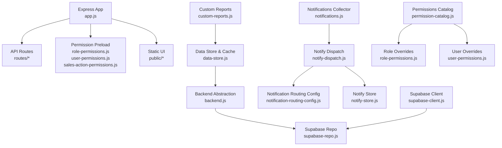
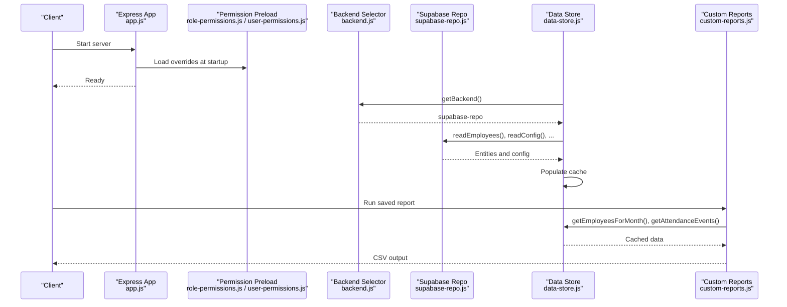
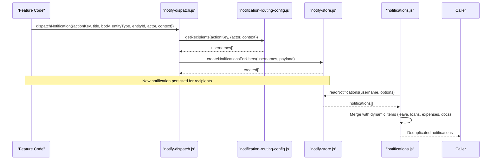
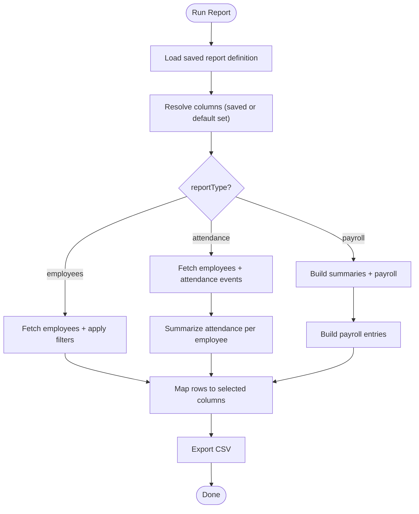
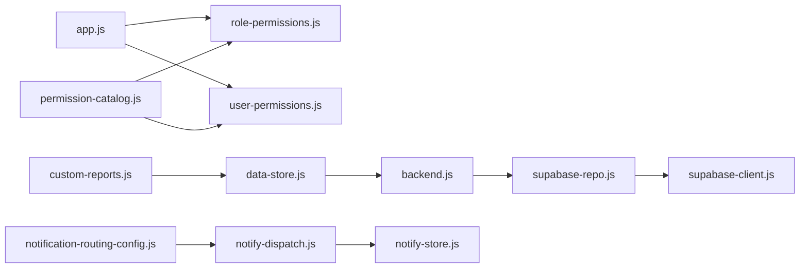

# Extension Points & Customization

<cite>
**Referenced Files in This Document**
- [app.js](file://app.js)
- [backend.js](file://lib/backend.js)
- [supabase-repo.js](file://lib/supabase-repo.js)
- [data-store.js](file://lib/data-store.js)
- [custom-reports.js](file://lib/custom-reports.js)
- [notifications.js](file://lib/notifications.js)
- [notify-dispatch.js](file://lib/notify-dispatch.js)
- [notification-routing-config.js](file://lib/notification-routing-config.js)
- [notify-store.js](file://lib/notify-store.js)
- [role-permissions.js](file://lib/role-permissions.js)
- [user-permissions.js](file://lib/user-permissions.js)
- [permission-catalog.js](file://lib/permission-catalog.js)
- [supabase-client.js](file://lib/supabase-client.js)
- [access-control.js](file://public/js/access-control.js)
</cite>

## Table of Contents
1. Introduction
2. Project Structure
3. Core Components
4. Architecture Overview
5. Detailed Component Analysis
6. Dependency Analysis
7. Performance Considerations
8. Troubleshooting Guide
9. Conclusion

## Introduction
This document explains the extension points and customization capabilities of the system, focusing on:
- Plugin-style architecture for adding custom business logic
- Extending the notification system with new event types and routing rules
- Creating custom reports by reusing existing report engines
- Backend abstraction layer to implement alternative data sources and caching strategies
- Extending permission systems and adding new employee attributes
- Integrating with external services via configuration and client modules
- Module loading mechanism, configuration override patterns, and best practices for update compatibility

The goal is to provide a clear guide for extending functionality while maintaining compatibility across updates.

## Project Structure
At a high level, the application uses an Express server that wires routes and preloads permission overrides at startup. The core runtime loads environment variables, initializes caches, and selects a backend implementation (Supabase). Business features such as notifications, permissions, and reports are implemented as modular libraries under lib/.

**Diagram sources**
- [app.js:1-57](file://app.js#L1-L57)
- [backend.js:1-29](file://lib/backend.js#L1-L29)
- [supabase-repo.js:1-733](file://lib/supabase-repo.js#L1-L733)
- [data-store.js:1-800](file://lib/data-store.js#L1-L800)
- [custom-reports.js:1-207](file://lib/custom-reports.js#L1-L207)
- [notifications.js:1-202](file://lib/notifications.js#L1-L202)
- [notify-dispatch.js:1-29](file://lib/notify-dispatch.js#L1-L29)
- [notification-routing-config.js:1-179](file://lib/notification-routing-config.js#L1-L179)
- [notify-store.js:1-110](file://lib/notify-store.js#L1-L110)
- [permission-catalog.js:1-325](file://lib/permission-catalog.js#L1-L325)
- [role-permissions.js:1-159](file://lib/role-permissions.js#L1-L159)
- [user-permissions.js:1-127](file://lib/user-permissions.js#L1-L127)
- [supabase-client.js:1-134](file://lib/supabase-client.js#L1-L134)

**Section sources**
- [app.js:1-57](file://app.js#L1-L57)
- [backend.js:1-29](file://lib/backend.js#L1-L29)

## Core Components
- Backend abstraction: Selects and returns the active data backend module based on environment configuration.
- Supabase repository: Implements all data operations against Supabase tables, including employees, attendance, payroll adjustments, loans, documents, warnings, and more.
- Data store and cache: Orchestrates synchronization from the backend into an in-memory cache, provides query helpers, and coordinates monthly profiles and position rates.
- Permission catalog and overrides: Defines default role-to-permission mappings and supports database-backed overrides for roles and individual users.
- Notification system: Collects notifications from multiple sources, dispatches them using configurable routing rules, and persists them.
- Custom reports: Provides saved report definitions and execution engine for employees, attendance, and payroll reports.

Key extension points:
- Add new permission keys and defaults in the permission catalog.
- Extend notification routing rules and action keys.
- Implement additional report types in the report runner.
- Swap or extend the backend implementation via the backend abstraction.
- Configure environment and cache directories through bootstrap utilities.

**Section sources**
- [backend.js:1-29](file://lib/backend.js#L1-L29)
- [supabase-repo.js:1-733](file://lib/supabase-repo.js#L1-L733)
- [data-store.js:1-800](file://lib/data-store.js#L1-L800)
- [permission-catalog.js:1-325](file://lib/permission-catalog.js#L1-L325)
- [role-permissions.js:1-159](file://lib/role-permissions.js#L1-L159)
- [user-permissions.js:1-127](file://lib/user-permissions.js#L1-L127)
- [notifications.js:1-202](file://lib/notifications.js#L1-L202)
- [notify-dispatch.js:1-29](file://lib/notify-dispatch.js#L1-L29)
- [notification-routing-config.js:1-179](file://lib/notification-routing-config.js#L1-L179)
- [notify-store.js:1-110](file://lib/notify-store.js#L1-L110)
- [custom-reports.js:1-207](file://lib/custom-reports.js#L1-L207)

## Architecture Overview
The system follows a layered architecture:
- Presentation: Express app serves static UI and API routes.
- Application layer: Data store orchestrates sync, caching, and business workflows.
- Domain modules: Notifications, permissions, reports, and other features.
- Infrastructure: Backend abstraction and Supabase client/repository.

**Diagram sources**
- [app.js:1-57](file://app.js#L1-L57)
- [backend.js:1-29](file://lib/backend.js#L1-L29)
- [supabase-repo.js:1-733](file://lib/supabase-repo.js#L1-L733)
- [data-store.js:1-800](file://lib/data-store.js#L1-L800)
- [custom-reports.js:1-207](file://lib/custom-reports.js#L1-L207)

## Detailed Component Analysis

### Backend Abstraction Layer
Purpose:
- Provide a single entry point to select the active data backend.
- Enforce supported backends and throw errors for deprecated ones.
- Return the repository module implementing data operations.

Extension pattern:
- To add a new backend, implement a module with the same interface as supabase-repo.js and return it from getBackend().
- Ensure functions like readEmployees, readConfig, batchUpsertAttendance, etc., exist to satisfy data-store expectations.

Configuration:
- DATA_BACKEND environment variable controls selection; sheets is explicitly unsupported.

Compatibility:
- Keep function signatures stable to avoid breaking data-store and feature modules.

**Section sources**
- [backend.js:1-29](file://lib/backend.js#L1-L29)
- [supabase-repo.js:1-733](file://lib/supabase-repo.js#L1-L733)

### Data Store and Caching Strategy
Purpose:
- Orchestrate full sync from backend into memory cache.
- Provide query APIs for employees, attendance, bonuses, deductions, payroll adjustments, commission tiers, loans, splits, documents, warnings.
- Maintain month-keyed records and merge local vs remote changes for attendance.

Caching strategy:
- In-memory cache warmed by syncFromSheet.
- Month-keyed grouping for attendance, bonuses, deductions, and payroll adjustments.
- Mutation lock serializes writes to prevent races.

Extensibility:
- Add new entity types by exposing read/write methods in the backend repo and wiring them into syncFromSheet and cache setters/getters.
- Use ensureSynced before heavy reads to guarantee warm cache.

**Section sources**
- [data-store.js:1-800](file://lib/data-store.js#L1-L800)

### Permission System Extensions
Components:
- Permission catalog defines default permissions per role and lists all available permission keys.
- Role-based overrides stored in database with in-memory cache and TTL.
- Per-user overrides stored separately with similar caching.

How to extend:
- Add new permission keys and labels in the catalog.
- Define default behavior for roles in the catalog’s default matrix.
- Use role-permissions and user-permissions modules to persist and evaluate overrides.
- Frontend Access Control UI consumes effective matrices and catalogs.

Best practices:
- Always validate permission keys against the catalog when saving overrides.
- Invalidate caches after persistence to reflect changes immediately.
- Keep role normalization consistent across modules.

**Section sources**
- [permission-catalog.js:1-325](file://lib/permission-catalog.js#L1-L325)
- [role-permissions.js:1-159](file://lib/role-permissions.js#L1-L159)
- [user-permissions.js:1-127](file://lib/user-permissions.js#L1-L127)
- [access-control.js:1-37](file://public/js/access-control.js#L1-L37)

### Notification System Extensions
Capabilities:
- Collect notifications from persisted storage and domain sources (leave requests, loan requests, expenses, expiring documents).
- Dispatch notifications using admin-configurable routing rules keyed by action type.
- Persist notifications to a dedicated table.

How to extend:
- Add new action keys and default routing rules in the routing config.
- Call dispatchNotification with a unique actionKey and context to route to recipients.
- Optionally create direct notifications via notify-store for targeted messages.

Flow:

**Diagram sources**
- [notify-dispatch.js:1-29](file://lib/notify-dispatch.js#L1-L29)
- [notification-routing-config.js:1-179](file://lib/notification-routing-config.js#L1-L179)
- [notify-store.js:1-110](file://lib/notify-store.js#L1-L110)
- [notifications.js:1-202](file://lib/notifications.js#L1-L202)

**Section sources**
- [notify-dispatch.js:1-29](file://lib/notify-dispatch.js#L1-L29)
- [notification-routing-config.js:1-179](file://lib/notification-routing-config.js#L1-L179)
- [notify-store.js:1-110](file://lib/notify-store.js#L1-L110)
- [notifications.js:1-202](file://lib/notifications.js#L1-L202)

### Custom Reports Engine
Capabilities:
- Saved reports with filters, columns, and report type.
- Built-in report types: employees, attendance, payroll.
- CSV export with column mapping and escaping.

How to extend:
- Add new report types in the report runner by handling additional reportType branches.
- Define default column sets for new types.
- Reuse data-store queries to fetch employees, attendance events, and payroll inputs.

Example flow:

**Diagram sources**
- [custom-reports.js:1-207](file://lib/custom-reports.js#L1-L207)
- [data-store.js:1-800](file://lib/data-store.js#L1-L800)

**Section sources**
- [custom-reports.js:1-207](file://lib/custom-reports.js#L1-L207)

### Configuration and Environment Loading
Environment loading:
- Loads .env from multiple candidate locations, including Electron resources and portable executable directories.
- Ensures cache directory exists and sets HR_CACHE_DIR.
- Asserts Supabase configuration presence and throws descriptive errors if missing.

Override patterns:
- DATA_BACKEND selects backend implementation.
- SUPABASE_* keys configure Supabase clients.
- Session secret and cookie settings configured in Express app.

Best practices:
- Centralize environment checks in bootstrap utilities.
- Fail fast with clear messages during startup if required configuration is absent.

**Section sources**
- [app.js:1-57](file://app.js#L1-L57)
- [supabase-client.js:1-134](file://lib/supabase-client.js#L1-L134)

### Integration Patterns and External Services
- Supabase client module provides admin and anonymous clients, plus user-scoped client with JWT headers.
- Backend repository encapsulates all Supabase interactions, making it easy to swap implementations.
- Optional business integrations (e.g., sales, expenses) are loaded conditionally and cached.

Integration tips:
- Wrap external calls in try/catch where appropriate and degrade gracefully.
- Use admin client only server-side; never expose secrets to the frontend.

**Section sources**
- [supabase-client.js:1-134](file://lib/supabase-client.js#L1-L134)
- [supabase-repo.js:1-733](file://lib/supabase-repo.js#L1-L733)
- [data-store.js:1-800](file://lib/data-store.js#L1-L800)

## Dependency Analysis
High-level dependencies:
- app.js depends on routes and preloads permission overrides.
- data-store.js depends on backend abstraction and cache.
- supabase-repo.js depends on supabase-client.
- Notifications depend on routing config and notify store.
- Permissions depend on catalog and DB-backed overrides.

**Diagram sources**
- [app.js:1-57](file://app.js#L1-L57)
- [backend.js:1-29](file://lib/backend.js#L1-L29)
- [supabase-repo.js:1-733](file://lib/supabase-repo.js#L1-L733)
- [supabase-client.js:1-134](file://lib/supabase-client.js#L1-L134)
- [data-store.js:1-800](file://lib/data-store.js#L1-L800)
- [notification-routing-config.js:1-179](file://lib/notification-routing-config.js#L1-L179)
- [notify-dispatch.js:1-29](file://lib/notify-dispatch.js#L1-L29)
- [notify-store.js:1-110](file://lib/notify-store.js#L1-L110)
- [permission-catalog.js:1-325](file://lib/permission-catalog.js#L1-L325)
- [role-permissions.js:1-159](file://lib/role-permissions.js#L1-L159)
- [user-permissions.js:1-127](file://lib/user-permissions.js#L1-L127)
- [custom-reports.js:1-207](file://lib/custom-reports.js#L1-L207)

**Section sources**
- [app.js:1-57](file://app.js#L1-L57)
- [backend.js:1-29](file://lib/backend.js#L1-L29)
- [supabase-repo.js:1-733](file://lib/supabase-repo.js#L1-L733)
- [data-store.js:1-800](file://lib/data-store.js#L1-L800)
- [permission-catalog.js:1-325](file://lib/permission-catalog.js#L1-L325)
- [role-permissions.js:1-159](file://lib/role-permissions.js#L1-L159)
- [user-permissions.js:1-127](file://lib/user-permissions.js#L1-L127)
- [notification-routing-config.js:1-179](file://lib/notification-routing-config.js#L1-L179)
- [notify-dispatch.js:1-29](file://lib/notify-dispatch.js#L1-L29)
- [notify-store.js:1-110](file://lib/notify-store.js#L1-L110)
- [custom-reports.js:1-207](file://lib/custom-reports.js#L1-L207)

## Performance Considerations
- Use data-store.ensureSynced before heavy reads to avoid cold cache penalties.
- Leverage month-keyed caches for attendance, bonuses, deductions, and payroll adjustments.
- Avoid unnecessary full-table scans; prefer filtered queries and pagination where possible.
- Serialize mutations with mutation locks to prevent race conditions.
- Cache permission overrides with TTL and invalidate on write to balance freshness and performance.

[No sources needed since this section provides general guidance]

## Troubleshooting Guide
Common issues and resolutions:
- Missing Supabase configuration: Ensure SUPABASE_URL and keys are set; bootstrap asserts configuration and throws helpful errors.
- Deprecated backend: DATA_BACKEND=sheets is not supported; switch to supabase.
- Permission overrides not applied: Verify that overrides are persisted and caches invalidated; check catalog validation.
- Notifications not delivered: Confirm routing rules exist for the action key and recipients resolved correctly; check table existence fallback behavior.
- Sync timeouts: Increase timeout or investigate network latency to Supabase.

**Section sources**
- [backend.js:1-29](file://lib/backend.js#L1-L29)
- [supabase-client.js:1-134](file://lib/supabase-client.js#L1-L134)
- [role-permissions.js:1-159](file://lib/role-permissions.js#L1-L159)
- [user-permissions.js:1-127](file://lib/user-permissions.js#L1-L127)
- [notification-routing-config.js:1-179](file://lib/notification-routing-config.js#L1-L179)
- [notify-store.js:1-110](file://lib/notify-store.js#L1-L110)
- [data-store.js:1-800](file://lib/data-store.js#L1-L800)

## Conclusion
The system provides robust extension points:
- Backend abstraction enables alternative data sources and caching strategies.
- Permission catalog and overrides allow fine-grained access control without code changes.
- Notification routing and dispatch support extensible event-driven messaging.
- Custom reports engine can be extended with new report types and column sets.
- Configuration and environment loading centralize setup and enforce correctness.

Follow best practices to maintain compatibility:
- Preserve function signatures in backend implementations.
- Validate permission keys against the catalog.
- Use caching and TTLs judiciously; invalidate caches after writes.
- Fail fast with clear error messages for misconfiguration.

[No sources needed since this section summarizes without analyzing specific files]