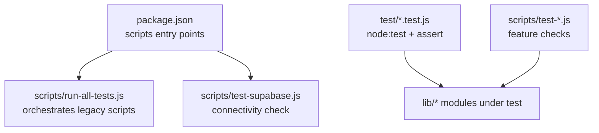
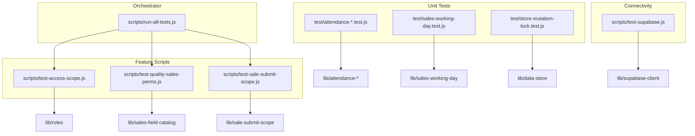
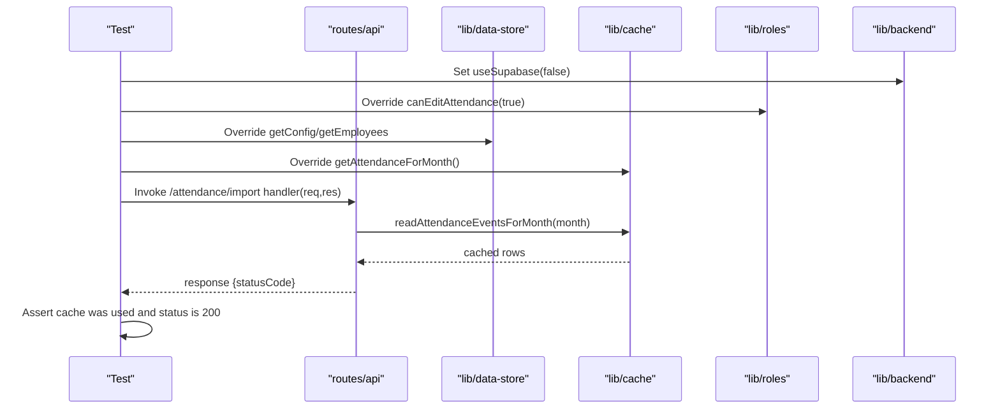
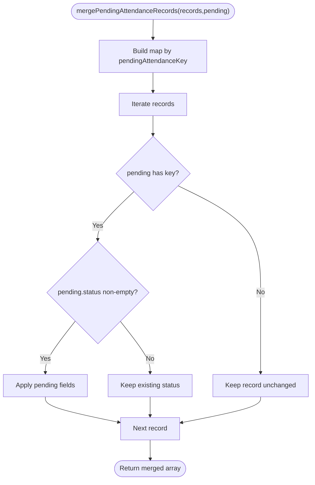
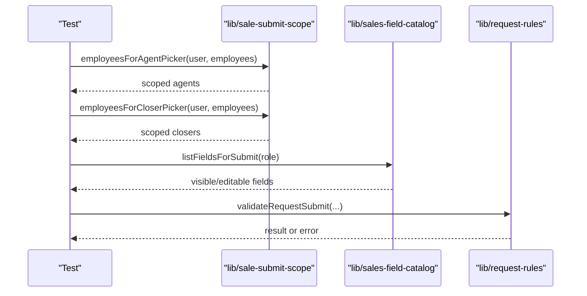
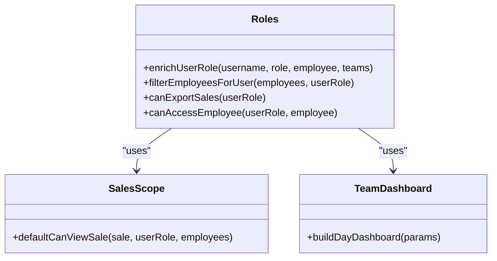
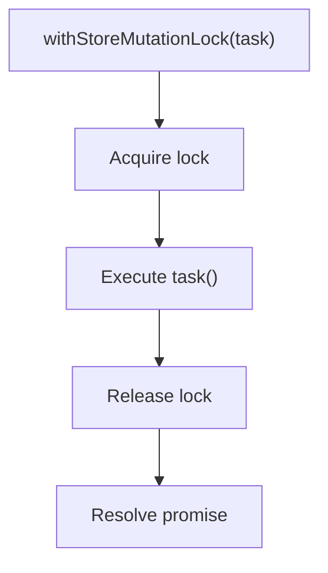
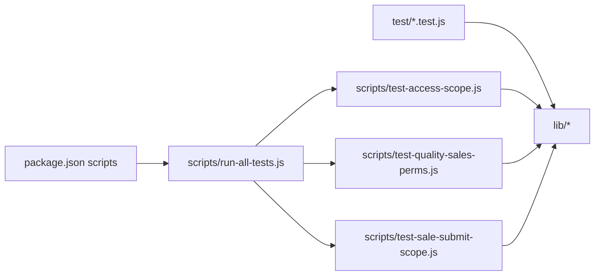

# Testing Framework

<cite>
**Referenced Files in This Document**
- [package.json](file://package.json)
- [scripts/run-all-tests.js](file://scripts/run-all-tests.js)
- [test/attendance-employment.test.js](file://test/attendance-employment.test.js)
- [test/attendance-fp-protection.test.js](file://test/attendance-fp-protection.test.js)
- [test/attendance-import-route.test.js](file://test/attendance-import-route.test.js)
- [test/attendance-persistence.test.js](file://test/attendance-persistence.test.js)
- [test/attendance-supabase-path.test.js](file://test/attendance-supabase-path.test.js)
- [test/attendance-validation.test.js](file://test/attendance-validation.test.js)
- [test/sales-working-day.test.js](file://test/sales-working-day.test.js)
- [test/store-mutation-lock.test.js](file://test/store-mutation-lock.test.js)
- [scripts/test-access-scope.js](file://scripts/test-access-scope.js)
- [scripts/test-quality-sales-perms.js](file://scripts/test-quality-sales-perms.js)
- [scripts/test-sale-submit-scope.js](file://scripts/test-sale-submit-scope.js)
- [scripts/test-supabase.js](file://scripts/test-supabase.js)
</cite>

## Table of Contents
1. Introduction
2. Project Structure
3. Core Components
4. Architecture Overview
5. Detailed Component Analysis
6. Dependency Analysis
7. Performance Considerations
8. Troubleshooting Guide
9. Conclusion

## Introduction
This document explains the testing strategy and implementation for the project. It covers:
- Test structure and organization
- Available test suites for attendance, sales, payroll, and permission systems
- How to run individual tests and all suites
- Interpreting results
- Writing new tests following established patterns
- Mocking external dependencies (Supabase, Dropbox)
- Testing Electron-specific functionality
- Test data management, continuous integration setup, and performance testing considerations

The project uses Node’s built-in test runner for unit tests and a set of custom scripts for feature-level checks. There is no dedicated third-party test framework; assertions are performed with Node’s assert module or simple console-based checks.

## Project Structure
Tests are organized into two categories:
- Unit tests under test/: small, focused tests using node:test and assert/strict
- Feature/integration-style scripts under scripts/: self-contained scripts that validate business logic, permissions, and connectivity

**Diagram sources**
- [package.json:6-47](file://package.json#L6-L47)
- [scripts/run-all-tests.js:1-29](file://scripts/run-all-tests.js#L1-L29)
- [scripts/test-supabase.js:1-66](file://scripts/test-supabase.js#L1-L66)

**Section sources**
- [package.json:6-47](file://package.json#L6-L47)
- [scripts/run-all-tests.js:1-29](file://scripts/run-all-tests.js#L1-L29)

## Core Components
- Node test runner: All files under test/ use node:test and assert/strict for deterministic assertions.
- Custom test harnesses: Several scripts under scripts/ implement their own lightweight test helpers and exit codes to integrate with npm scripts.
- Orchestration: package.json exposes npm scripts to run specific suites or all tests via scripts/run-all-tests.js.

Key responsibilities:
- Attendance: validation, import protection, persistence merge/prune, Supabase path behavior
- Sales: working day computation, submit scope, field catalog permissions, quality ticket flows
- Permissions: role scoping, export defaults, org structure filtering
- Connectivity: Supabase client configuration and health checks

**Section sources**
- [test/attendance-employment.test.js:1-25](file://test/attendance-employment.test.js#L1-L25)
- [test/attendance-fp-protection.test.js:1-18](file://test/attendance-fp-protection.test.js#L1-L18)
- [test/attendance-import-route.test.js:1-61](file://test/attendance-import-route.test.js#L1-L61)
- [test/attendance-persistence.test.js:1-47](file://test/attendance-persistence.test.js#L1-L47)
- [test/attendance-supabase-path.test.js:1-133](file://test/attendance-supabase-path.test.js#L1-L133)
- [test/attendance-validation.test.js:1-22](file://test/attendance-validation.test.js#L1-L22)
- [test/sales-working-day.test.js:1-9](file://test/sales-working-day.test.js#L1-L9)
- [test/store-mutation-lock.test.js:1-20](file://test/store-mutation-lock.test.js#L1-L20)
- [scripts/test-access-scope.js:1-170](file://scripts/test-access-scope.js#L1-L170)
- [scripts/test-quality-sales-perms.js:1-233](file://scripts/test-quality-sales-perms.js#L1-L233)
- [scripts/test-sale-submit-scope.js:1-155](file://scripts/test-sale-submit-scope.js#L1-L155)
- [scripts/test-supabase.js:1-66](file://scripts/test-supabase.js#L1-L66)

## Architecture Overview
The testing architecture separates concerns:
- Unit tests verify pure functions and isolated behaviors by importing lib modules directly
- Route-level tests mock backend/cache/roles to validate request handling without full server startup
- Feature scripts validate cross-module interactions and business rules
- Connectivity script validates environment configuration and client initialization

**Diagram sources**
- [test/attendance-employment.test.js:1-25](file://test/attendance-employment.test.js#L1-L25)
- [test/attendance-fp-protection.test.js:1-18](file://test/attendance-fp-protection.test.js#L1-L18)
- [test/attendance-import-route.test.js:1-61](file://test/attendance-import-route.test.js#L1-L61)
- [test/attendance-persistence.test.js:1-47](file://test/attendance-persistence.test.js#L1-L47)
- [test/attendance-supabase-path.test.js:1-133](file://test/attendance-supabase-path.test.js#L1-L133)
- [test/attendance-validation.test.js:1-22](file://test/attendance-validation.test.js#L1-L22)
- [test/sales-working-day.test.js:1-9](file://test/sales-working-day.test.js#L1-L9)
- [test/store-mutation-lock.test.js:1-20](file://test/store-mutation-lock.test.js#L1-L20)
- [scripts/test-access-scope.js:1-170](file://scripts/test-access-scope.js#L1-L170)
- [scripts/test-quality-sales-perms.js:1-233](file://scripts/test-quality-sales-perms.js#L1-L233)
- [scripts/test-sale-submit-scope.js:1-155](file://scripts/test-sale-submit-scope.js#L1-L155)
- [scripts/test-supabase.js:1-66](file://scripts/test-supabase.js#L1-L66)
- [scripts/run-all-tests.js:1-29](file://scripts/run-all-tests.js#L1-L29)

## Detailed Component Analysis

### Attendance Suite
Focus areas:
- Employment date editing rules
- FP import protection against overwriting real attendance
- Import route behavior and cache-first reads
- Persistence merge/prune semantics
- Supabase fallback and timestamp normalization

**Diagram sources**
- [test/attendance-import-route.test.js:1-61](file://test/attendance-import-route.test.js#L1-L61)

**Diagram sources**
- [test/attendance-persistence.test.js:1-47](file://test/attendance-persistence.test.js#L1-L47)

Key behaviors validated:
- Employment date gating and period overlap checks
- FP import skips rows already marked with real attendance statuses
- Cache-first reads prevent unnecessary Supabase calls
- Merge preserves unseen rows and respects blank updates
- Timestamp comparison tolerates millisecond differences

**Section sources**
- [test/attendance-employment.test.js:1-25](file://test/attendance-employment.test.js#L1-L25)
- [test/attendance-fp-protection.test.js:1-18](file://test/attendance-fp-protection.test.js#L1-L18)
- [test/attendance-import-route.test.js:1-61](file://test/attendance-import-route.test.js#L1-L61)
- [test/attendance-persistence.test.js:1-47](file://test/attendance-persistence.test.js#L1-L47)
- [test/attendance-supabase-path.test.js:1-133](file://test/attendance-supabase-path.test.js#L1-L133)
- [test/attendance-validation.test.js:1-22](file://test/attendance-validation.test.js#L1-L22)

### Sales Suite
Focus areas:
- Working day grace window around midnight
- Submit scope picker visibility and validation
- Field catalog permissions across surfaces (main, quality)
- Quality ticket sanitization and editability

**Diagram sources**
- [scripts/test-sale-submit-scope.js:1-155](file://scripts/test-sale-submit-scope.js#L1-L155)

Additional validations:
- Working day boundary at 2:00 AM
- Catalog default permissions and surface-specific visibility
- Sanitization strips unauthorized fields while preserving allowed ones

**Section sources**
- [test/sales-working-day.test.js:1-9](file://test/sales-working-day.test.js#L1-L9)
- [scripts/test-quality-sales-perms.js:1-233](file://scripts/test-quality-sales-perms.js#L1-L233)
- [scripts/test-sale-submit-scope.js:1-155](file://scripts/test-sale-submit-scope.js#L1-L155)

### Permission Systems Suite
Focus areas:
- Dual-role agent scoping and team visibility
- Export defaults by role
- Org structure filtering for roles
- Quality vs OP access to fields and attachments

**Diagram sources**
- [scripts/test-access-scope.js:1-170](file://scripts/test-access-scope.js#L1-L170)

**Section sources**
- [scripts/test-access-scope.js:1-170](file://scripts/test-access-scope.js#L1-L170)
- [scripts/test-quality-sales-perms.js:1-233](file://scripts/test-quality-sales-perms.js#L1-L233)

### Payroll Suite
There are no dedicated unit tests under test/ for payroll. The repository includes a script for training payroll verification:
- scripts/test-training-payroll.js (invoked by the orchestrator)

To add payroll unit tests, follow the same pattern as other suites: create a file under test/ that imports payroll-related modules and asserts expected outcomes.

**Section sources**
- [scripts/run-all-tests.js:1-29](file://scripts/run-all-tests.js#L1-L29)

### Store Concurrency Control
Validates that store mutation operations are serialized to avoid concurrent writes.

**Diagram sources**
- [test/store-mutation-lock.test.js:1-20](file://test/store-mutation-lock.test.js#L1-L20)

**Section sources**
- [test/store-mutation-lock.test.js:1-20](file://test/store-mutation-lock.test.js#L1-L20)

## Dependency Analysis
- Unit tests depend on lib modules only; they do not start the HTTP server or Electron main process
- Route-level tests temporarily override backend flags and cache methods to control execution paths
- Feature scripts rely on multiple modules to simulate realistic scenarios
- Connectivity script depends on environment variables and initializes Supabase clients

**Diagram sources**
- [package.json:6-47](file://package.json#L6-L47)
- [scripts/run-all-tests.js:1-29](file://scripts/run-all-tests.js#L1-L29)

**Section sources**
- [package.json:6-47](file://package.json#L6-L47)
- [scripts/run-all-tests.js:1-29](file://scripts/run-all-tests.js#L1-L29)

## Performance Considerations
- Prefer unit tests over heavy integration tests to keep CI fast
- Use mocks for network calls (Supabase) and I/O (Dropbox) to avoid flaky timing
- For concurrency tests, keep delays minimal and deterministic
- Batch assertions within a single test file to reduce startup overhead

[No sources needed since this section provides general guidance]

## Troubleshooting Guide
Common issues and resolutions:
- Missing environment variables for Supabase checks: ensure SUPABASE_URL and optional keys are present before running connectivity tests
- Native module crashes when loading SQLite in plain Node: tests override config and cache to avoid native dependencies during route-level tests
- Flaky network-dependent tests: always stub Supabase repo methods and cache getters/setters to isolate behavior

Operational tips:
- Use npm scripts to run targeted suites quickly
- Inspect console output from feature scripts for FAIL markers and exit codes

**Section sources**
- [scripts/test-supabase.js:1-66](file://scripts/test-supabase.js#L1-L66)
- [test/attendance-import-route.test.js:1-61](file://test/attendance-import-route.test.js#L1-L61)

## Conclusion
The testing approach combines lightweight unit tests with focused feature scripts to cover core business logic, permissions, and critical paths like attendance import and sales submission. By mocking external services and controlling caches, tests remain fast and deterministic. Extend coverage by adding new unit tests under test/ and integrating them into the orchestrator where appropriate.

[No sources needed since this section summarizes without analyzing specific files]

## Appendices

### Running Tests
- Run all orchestrated tests: npm test
- Run specific npm-defined suites:
  - npm run test:supabase
  - npm run test:training-payroll
  - npm run test:access-scope
  - npm run test:quality-sales-perms
  - npm run test:rbac-defaults
- Run node:test files directly:
  - node --test test/attendance-employment.test.js
  - node --test test/attendance-fp-protection.test.js
  - node --test test/attendance-import-route.test.js
  - node --test test/attendance-persistence.test.js
  - node --test test/attendance-supabase-path.test.js
  - node --test test/attendance-validation.test.js
  - node --test test/sales-working-day.test.js
  - node --test test/store-mutation-lock.test.js

**Section sources**
- [package.json:6-47](file://package.json#L6-L47)
- [scripts/run-all-tests.js:1-29](file://scripts/run-all-tests.js#L1-L29)

### Interpreting Results
- node:test outputs pass/fail per test and exits with non-zero on failure
- Feature scripts print “ok” for passes and “FAIL” for failures, then set process.exitCode accordingly
- The orchestrator aggregates failures and reports the total number of failed scripts

**Section sources**
- [scripts/run-all-tests.js:1-29](file://scripts/run-all-tests.js#L1-L29)
- [scripts/test-access-scope.js:1-170](file://scripts/test-access-scope.js#L1-L170)
- [scripts/test-quality-sales-perms.js:1-233](file://scripts/test-quality-sales-perms.js#L1-L233)
- [scripts/test-sale-submit-scope.js:1-155](file://scripts/test-sale-submit-scope.js#L1-L155)

### Writing New Tests
Patterns to follow:
- Use node:test and assert/strict for unit tests under test/
- Import only the lib module under test; avoid starting servers or Electron
- For route-level behavior, override backend flags, roles, cache, and store methods as shown in the import route test
- For feature scripts, implement a simple test helper that prints “ok”/“FAIL” and sets process.exitCode

Example references:
- Basic unit test pattern: [test/attendance-employment.test.js:1-25](file://test/attendance-employment.test.js#L1-L25)
- Route-level mocking: [test/attendance-import-route.test.js:1-61](file://test/attendance-import-route.test.js#L1-L61)
- Feature script pattern: [scripts/test-access-scope.js:1-170](file://scripts/test-access-scope.js#L1-L170)

**Section sources**
- [test/attendance-employment.test.js:1-25](file://test/attendance-employment.test.js#L1-L25)
- [test/attendance-import-route.test.js:1-61](file://test/attendance-import-route.test.js#L1-L61)
- [scripts/test-access-scope.js:1-170](file://scripts/test-access-scope.js#L1-L170)

### Mocking External Dependencies
- Supabase:
  - Stub supabaseRepo.readAttendanceEvents and batchUpsertAttendance
  - Override cache.getAttendanceForMonth and cache.setAttendanceForMonth
  - Toggle backend.useSupabase to control code paths
- Dropbox:
  - Create a local module that exports the same interface as lib/dropbox.js and replace it via require.cache or dependency injection
- Data store:
  - Override store.getConfig, store.getEmployees, and related methods to provide deterministic data

References:
- Supabase path tests: [test/attendance-supabase-path.test.js:1-133](file://test/attendance-supabase-path.test.js#L1-L133)
- Route-level overrides: [test/attendance-import-route.test.js:1-61](file://test/attendance-import-route.test.js#L1-L61)

**Section sources**
- [test/attendance-supabase-path.test.js:1-133](file://test/attendance-supabase-path.test.js#L1-L133)
- [test/attendance-import-route.test.js:1-61](file://test/attendance-import-route.test.js#L1-L61)

### Testing Electron-Specific Functionality
- Current tests focus on lib modules and routes; they do not launch Electron
- To test Electron-specific behavior:
  - Isolate Electron-only logic into a separate module and write unit tests for its pure functions
  - For IPC or preload tests, consider spawning a headless Electron instance in a dedicated test suite and mock network layers

[No sources needed since this section provides general guidance]

### Test Data Management
- Provide small, explicit fixtures inline within tests
- Avoid shared mutable state between tests; reset any overridden modules in finally blocks
- For route tests, supply minimal req/res objects and override only what is necessary

References:
- Inline fixtures and overrides: [test/attendance-import-route.test.js:1-61](file://test/attendance-import-route.test.js#L1-L61)

**Section sources**
- [test/attendance-import-route.test.js:1-61](file://test/attendance-import-route.test.js#L1-L61)

### Continuous Integration Setup
Recommended steps:
- Add a GitHub Actions workflow that installs dependencies and runs npm test
- Cache node_modules to speed up subsequent runs
- Fail the job if any test script exits non-zero
- Optionally run node:test files explicitly for clearer logs

[No sources needed since this section provides general guidance]

### Performance Testing Considerations
- Keep unit tests fast and deterministic
- Avoid real network calls; prefer stubs and canned responses
- For concurrency tests, minimize sleep durations and assert ordering strictly

[No sources needed since this section provides general guidance]