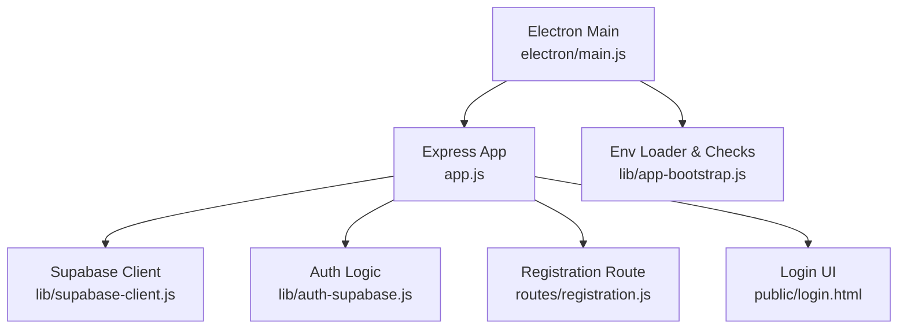
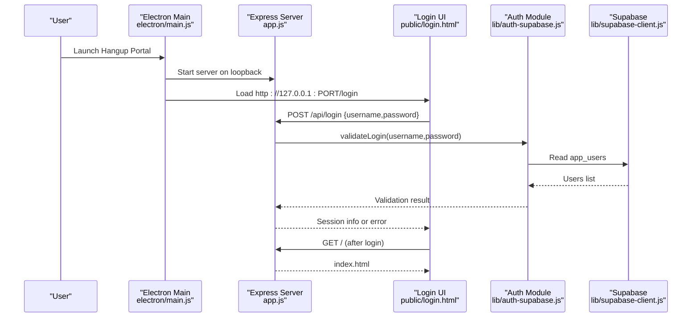
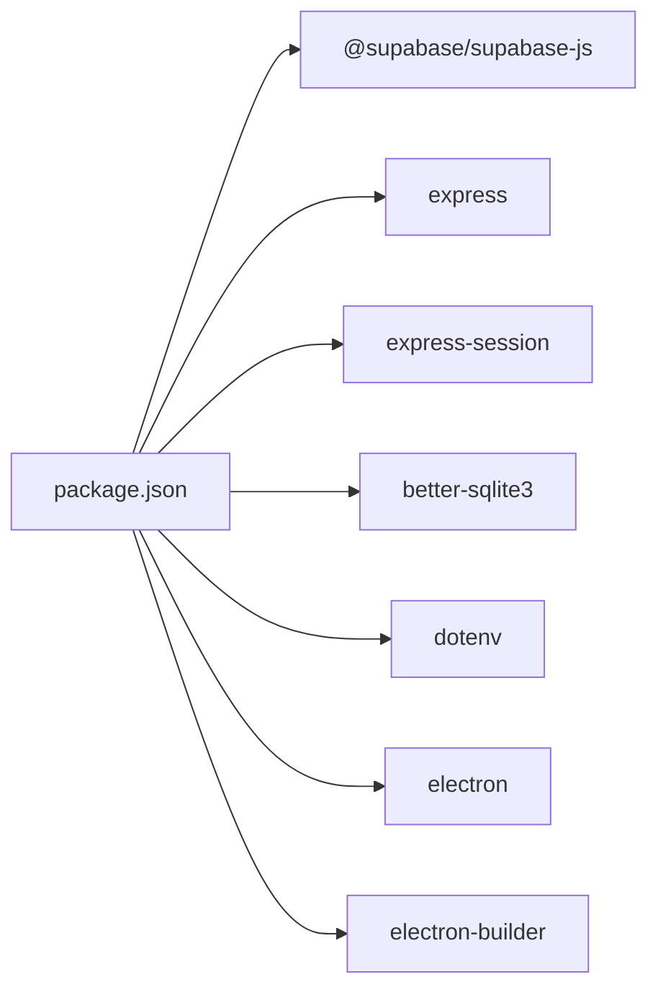

# Getting Started

<cite>
**Referenced Files in This Document**
- [README.md](file://README.md)
- [package.json](file://package.json)
- [electron/main.js](file://electron/main.js)
- [app.js](file://app.js)
- [lib/app-bootstrap.js](file://lib/app-bootstrap.js)
- [lib/supabase-client.js](file://lib/supabase-client.js)
- [lib/auth-supabase.js](file://lib/auth-supabase.js)
- [routes/registration.js](file://routes/registration.js)
- [public/login.html](file://public/login.html)
- [scripts/test-supabase.js](file://scripts/test-supabase.js)
</cite>

## Table of Contents
1. Introduction
2. Project Structure
3. Core Components
4. Architecture Overview
5. Detailed Component Analysis
6. Dependency Analysis
7. Performance Considerations
8. Troubleshooting Guide
9. Conclusion

## Introduction
Hangup Portal is a Windows desktop application for employee records, attendance, payroll, documents, and HR operations. It connects to Supabase as the live backend and maintains a local SQLite cache on each PC for fast reads. The app runs only as a packaged Electron desktop EXE (no browser or localhost mode).

Key points:
- Data backend: Supabase only
- Source of truth: Supabase
- Performance layer: Local SQLite cache per machine
- Authentication: app_users table with bcrypt passwords; session token after login
- Documents: Supabase Storage bucket hr-documents
- Version policy: app_versions table enforces minimum compatible versions

## Project Structure
At a high level:
- Electron main process boots an Express server on loopback and serves the UI
- Environment configuration is loaded from .env files at startup
- Supabase clients are created server-side; secrets never reach the UI
- Login and registration flows are handled via Express routes and the UI

**Diagram sources**
- [electron/main.js:1-120](file://electron/main.js#L1-L120)
- [app.js:1-57](file://app.js#L1-L57)
- [lib/app-bootstrap.js:1-76](file://lib/app-bootstrap.js#L1-L76)
- [lib/supabase-client.js:1-134](file://lib/supabase-client.js#L1-L134)
- [lib/auth-supabase.js:1-73](file://lib/auth-supabase.js#L1-L73)
- [routes/registration.js:1-36](file://routes/registration.js#L1-L36)
- [public/login.html:1-120](file://public/login.html#L1-L120)

**Section sources**
- [README.md:1-44](file://README.md#L1-L44)
- [README.md:104-159](file://README.md#L104-L159)
- [package.json:1-48](file://package.json#L1-L48)

## Core Components
- Electron main process: starts the Express server, creates the BrowserWindow, handles IPC, and manages updates and sessions
- Express server: hosts static UI, API routes, and session middleware
- Supabase client: provides admin and anonymous clients based on environment variables
- Auth module: validates users against app_users and supports password hashing
- Registration route: accepts new user requests with a daily PIN verification
- Login UI: handles sign-in, remembered credentials, update banners, and registration flow

**Section sources**
- [electron/main.js:53-115](file://electron/main.js#L53-L115)
- [app.js:8-54](file://app.js#L8-L54)
- [lib/supabase-client.js:80-133](file://lib/supabase-client.js#L80-L133)
- [lib/auth-supabase.js:10-47](file://lib/auth-supabase.js#L10-L47)
- [routes/registration.js:6-34](file://routes/registration.js#L6-L34)
- [public/login.html:28-126](file://public/login.html#L28-L126)

## Architecture Overview
The app follows a simple, secure architecture:
- Electron launches an Express server on 127.0.0.1
- The UI loads from the local server
- All data operations go through the Express server to Supabase
- A local SQLite cache improves read performance

**Diagram sources**
- [electron/main.js:53-115](file://electron/main.js#L53-L115)
- [app.js:43-51](file://app.js#L43-L51)
- [public/login.html:360-418](file://public/login.html#L360-L418)
- [lib/auth-supabase.js:24-47](file://lib/auth-supabase.js#L24-L47)
- [lib/supabase-client.js:80-99](file://lib/supabase-client.js#L80-L99)

## Detailed Component Analysis

### Installation Requirements
- Operating system: Windows 10/11 x64
- Node.js: 18+
- Internet access for initial Supabase sync
- Optional: GitHub CLI for publishing workflows (not required to run the app)

**Section sources**
- [README.md:104-112](file://README.md#L104-L112)
- [README.md:150-159](file://README.md#L150-L159)

### Supabase Configuration
You must configure Supabase before running the app. Required environment variables include:
- SUPABASE_URL
- SUPABASE_SECRET_KEY (or SUPABASE_SERVICE_ROLE_KEY)
- SUPABASE_PUBLISHABLE_KEY (or SUPABASE_ANON_KEY)

The app checks these values at startup and will show a configuration error if missing.

**Section sources**
- [lib/app-bootstrap.js:59-73](file://lib/app-bootstrap.js#L59-L73)
- [lib/supabase-client.js:19-39](file://lib/supabase-client.js#L19-L39)
- [scripts/test-supabase.js:15-48](file://scripts/test-supabase.js#L15-L48)

### Step-by-Step Setup (Development)
1. Install dependencies: npm install
2. Rebuild native modules if needed: npm run rebuild:native
3. Create a .env file with your Supabase keys (see next section)
4. Start the app: npm start
5. If Electron fails to start, run: npm run fix:electron

Notes:
- The app binds to 127.0.0.1 on port 3847 by default
- First launch requires internet to sync with Supabase

**Section sources**
- [README.md:150-159](file://README.md#L150-L159)
- [electron/main.js:19-22](file://electron/main.js#L19-L22)
- [README.md:147-149](file://README.md#L147-L149)

### Step-by-Step Setup (Production)
1. Build the installer/portable package on Windows:
   - npm run dist:all
   - Or use scripts/build.ps1 all
2. Distribute the installer or portable EXE to target PCs
3. On first run, ensure internet connectivity for initial Supabase sync
4. Sign in with credentials from app_users

Optional code signing: set CSC_LINK and CSC_KEY_PASSWORD before building.

**Section sources**
- [README.md:113-141](file://README.md#L113-L141)
- [README.md:143-149](file://README.md#L143-L149)

### Initial Configuration (.env)
Create a .env file at the repository root (or alongside the executable for portable installs). Include:
- DATA_BACKEND=supabase
- SUPABASE_URL
- SUPABASE_SECRET_KEY (or SUPABASE_SERVICE_ROLE_KEY)
- SUPABASE_PUBLISHABLE_KEY (or SUPABASE_ANON_KEY)
- SESSION_SECRET (optional; defaults to a safe value if not provided)

The loader searches multiple locations including resourcesPath and portable directories.

**Section sources**
- [lib/app-bootstrap.js:4-47](file://lib/app-bootstrap.js#L4-L47)
- [package.json:70-82](file://package.json#L70-L82)
- [app.js:13-18](file://app.js#L13-L18)

### First Launch Procedures
- Run the EXE or npm start
- The app verifies Supabase configuration and shows a fatal error dialog if misconfigured
- The Express server starts on loopback and the BrowserWindow opens the login page
- On first login, the app syncs with Supabase

**Section sources**
- [electron/main.js:166-194](file://electron/main.js#L166-L194)
- [electron/main.js:78-115](file://electron/main.js#L78-L115)
- [README.md:147-149](file://README.md#L147-L149)

### Basic User Onboarding
New users can submit a registration request using the in-app form:
- Enter today’s 4-digit PIN
- Provide personal details (name, nationality, phone, unit)
- Submit the request; OP/Admin/HR approves and creates a login
- Admin activates the account; the user then signs in

Admins can approve/reject registrations and view pending requests.

**Section sources**
- [public/login.html:60-126](file://public/login.html#L60-L126)
- [routes/registration.js:6-34](file://routes/registration.js#L6-L34)
- [public/js/app.js:6391-6425](file://public/js/app.js#L6391-L6425)

## Dependency Analysis
Core runtime dependencies relevant to setup:
- @supabase/supabase-js for database and auth
- express and express-session for the local server and sessions
- better-sqlite3 for local caching
- dotenv for loading .env
- electron and electron-builder for packaging

**Diagram sources**
- [package.json:138-159](file://package.json#L138-L159)

**Section sources**
- [package.json:1-48](file://package.json#L1-L48)
- [package.json:138-159](file://package.json#L138-L159)

## Performance Considerations
- Local SQLite cache ensures fast reads while edits are persisted to Supabase
- Keep the app updated; older versions may be blocked or warned based on app_versions
- Avoid exposing SUPABASE_SECRET_KEY in public web clients; it stays server-side only

[No sources needed since this section provides general guidance]

## Troubleshooting Guide
Common issues and resolutions:
- Missing .env or wrong keys: The app throws a configuration error at startup. Ensure SUPABASE_URL, SUPABASE_SECRET_KEY, and SUPABASE_PUBLISHABLE_KEY are set.
- Port already in use: Another instance is listening on 3847. Close other Hangup Portal windows or processes.
- Electron binary invalid: Reinstall Electron binaries using npm run fix:electron or delete node_modules/electron and reinstall.
- Native modules mismatch: Rebuild with npm run rebuild:native.
- Supabase connectivity: Use npm run test:supabase to verify environment and clients.

**Section sources**
- [lib/app-bootstrap.js:59-73](file://lib/app-bootstrap.js#L59-L73)
- [electron/main.js:61-71](file://electron/main.js#L61-L71)
- [scripts/ensure-electron.js:25-38](file://scripts/ensure-electron.js#L25-L38)
- [scripts/test-supabase.js:15-48](file://scripts/test-supabase.js#L15-L48)

## Conclusion
You now have the essentials to install, configure, and run Hangup Portal on Windows. Configure Supabase in .env, build or download the EXE, and sign in. For ongoing maintenance, keep the app updated and ensure Supabase credentials remain current.

[No sources needed since this section summarizes without analyzing specific files]