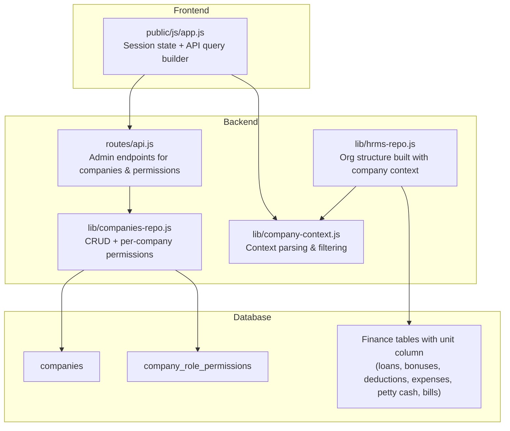
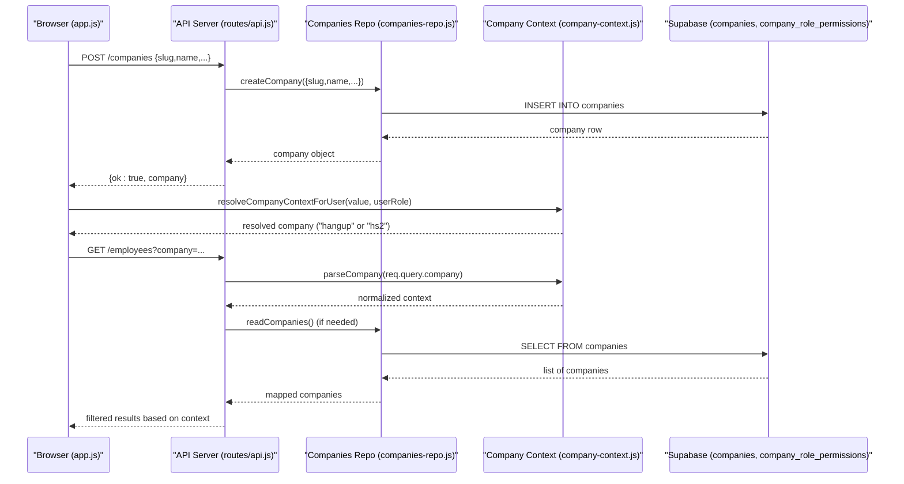
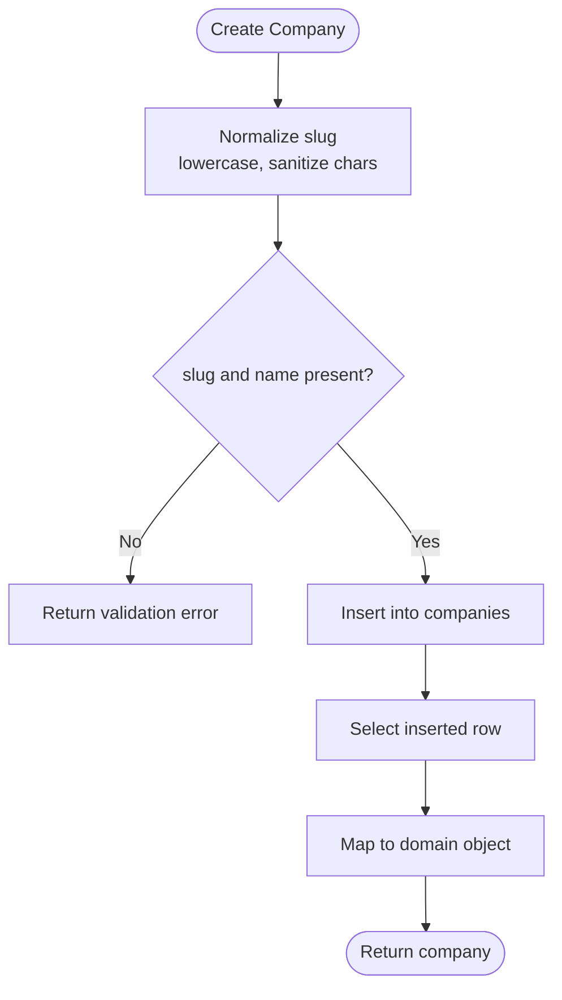
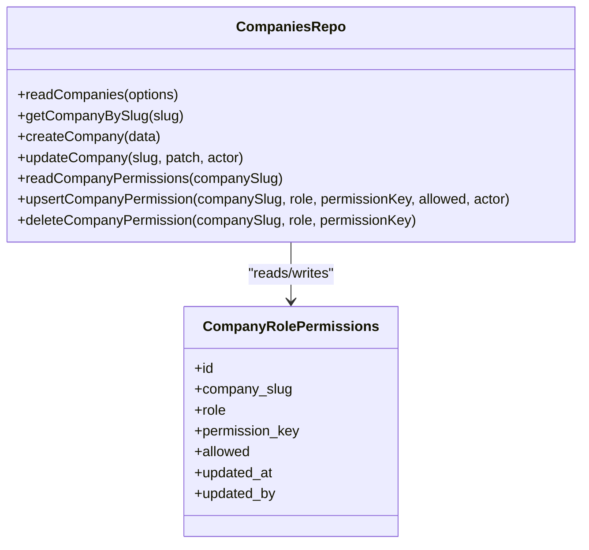
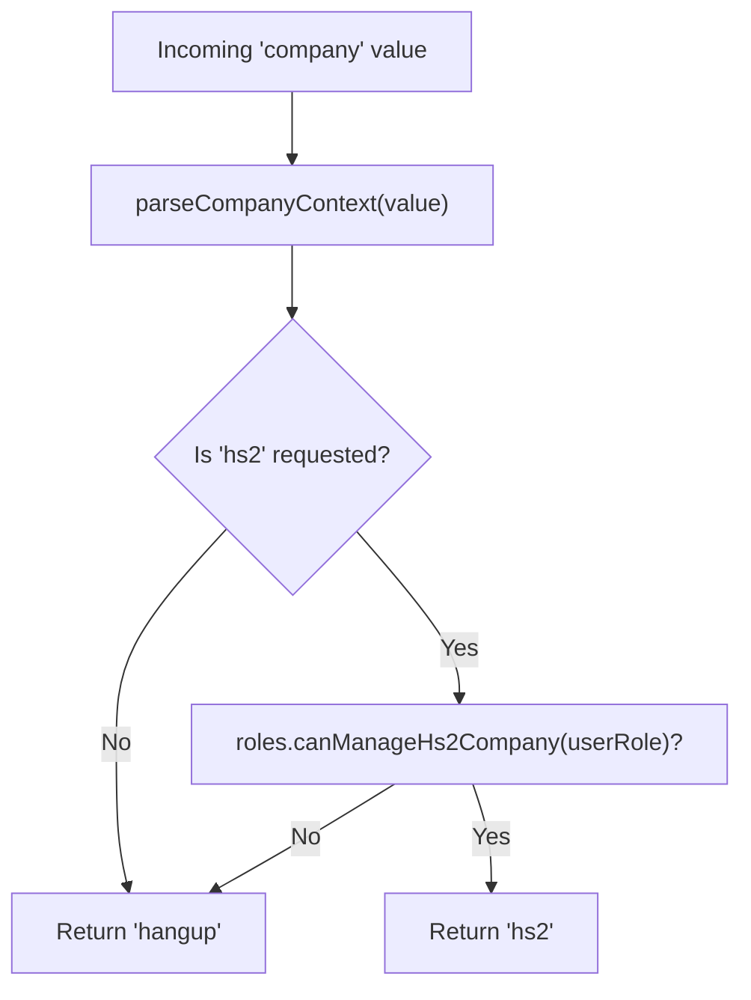
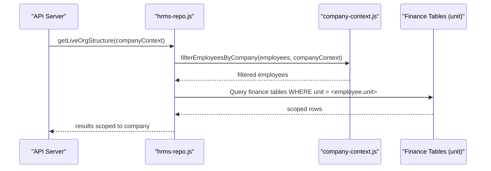
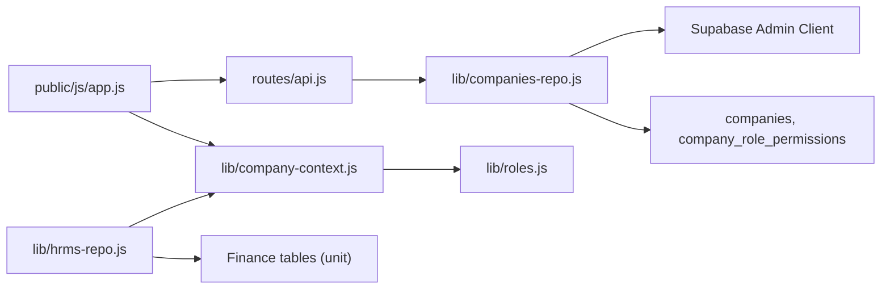

# Multi-Company Support

<cite>
**Referenced Files in This Document**
- [companies-repo.js](file://lib/companies-repo.js)
- [company-context.js](file://lib/company-context.js)
- [20260723_v129_multi_feature_sprint.sql](file://supabase/migrations/20260723_v129_multi_feature_sprint.sql)
- [20260724_v130_finance_company_scope.sql](file://supabase/migrations/20260724_v130_finance_company_scope.sql)
- [api.js](file://routes/api.js)
- [app.js](file://public/js/app.js)
- [hrms-repo.js](file://lib/hrms-repo.js)
</cite>

## Table of Contents
1. [Introduction](#introduction)
2. [Project Structure](#project-structure)
3. [Core Components](#core-components)
4. [Architecture Overview](#architecture-overview)
5. [Detailed Component Analysis](#detailed-component-analysis)
6. [Dependency Analysis](#dependency-analysis)
7. [Performance Considerations](#performance-considerations)
8. [Troubleshooting Guide](#troubleshooting-guide)
9. [Conclusion](#conclusion)
10. [Appendices](#appendices)

## Introduction
This document explains the multi-company support implemented across the application. It covers:
- The dynamic company registry backed by a companies table with slug-based identification, default company configuration, and active/inactive status management.
- Company-scoped data isolation for HR-related entities (loans, bonuses, deductions, expenses, petty cash, monthly bills).
- The company context system that maintains current company scope throughout user sessions and scopes API requests accordingly.
- Examples for creating new companies, configuring company-specific settings, and managing per-company permissions.
- Fallback behavior when database tables do not exist and migration paths for existing installations.

## Project Structure
Multi-company support spans backend repositories, routes, frontend session state, and database migrations:
- Backend repository: dynamic registry and per-company permission overrides
- Context utilities: parsing and enforcing company scoping
- Routes: admin APIs to create/update companies and manage per-company permissions
- Frontend: persistent company context in session storage and automatic query parameter injection
- Database: schema definitions and backfills for company-scoped finance tables

**Diagram sources**
- [app.js:70-100](file://public/js/app.js#L70-L100)
- [api.js:3980-4072](file://routes/api.js#L3980-L4072)
- [companies-repo.js:47-110](file://lib/companies-repo.js#L47-L110)
- [company-context.js:10-77](file://lib/company-context.js#L10-L77)
- [hrms-repo.js:935-938](file://lib/hrms-repo.js#L935-L938)
- [20260723_v129_multi_feature_sprint.sql:46-90](file://supabase/migrations/20260723_v129_multi_feature_sprint.sql#L46-L90)
- [20260724_v130_finance_company_scope.sql:1-112](file://supabase/migrations/20260724_v130_finance_company_scope.sql#L1-L112)

**Section sources**
- [companies-repo.js:1-166](file://lib/companies-repo.js#L1-L166)
- [company-context.js:1-117](file://lib/company-context.js#L1-L117)
- [20260723_v129_multi_feature_sprint.sql:46-133](file://supabase/migrations/20260723_v129_multi_feature_sprint.sql#L46-L133)
- [20260724_v130_finance_company_scope.sql:1-112](file://supabase/migrations/20260724_v130_finance_company_scope.sql#L1-L112)
- [api.js:3980-4072](file://routes/api.js#L3980-L4072)
- [app.js:70-100](file://public/js/app.js#L70-L100)
- [hrms-repo.js:935-938](file://lib/hrms-repo.js#L935-L938)

## Core Components
- Dynamic company registry
  - CRUD operations for companies via Supabase admin client
  - Slug normalization and validation on creation
  - Active/inactive flags and sort order
  - Default fallback when the companies table is missing
- Per-company role permissions
  - Overrides stored in a dedicated table keyed by company slug, role, and permission key
  - Upsert/delete operations for granular control
- Company context system
  - Parses incoming company values and enforces role-based visibility
  - Filters employees, units, org structures, and sales lists based on context
- Finance company scoping
  - Adds unit columns to finance tables and backfills from employee records
  - Enables per-company financial reporting and isolation

**Section sources**
- [companies-repo.js:47-110](file://lib/companies-repo.js#L47-L110)
- [companies-repo.js:114-154](file://lib/companies-repo.js#L114-L154)
- [company-context.js:10-98](file://lib/company-context.js#L10-L98)
- [20260724_v130_finance_company_scope.sql:1-112](file://supabase/migrations/20260724_v130_finance_company_scope.sql#L1-L112)

## Architecture Overview
The multi-company architecture combines a dynamic registry, context-aware filtering, and scoped data tables.

**Diagram sources**
- [api.js:3980-4021](file://routes/api.js#L3980-L4021)
- [companies-repo.js:74-97](file://lib/companies-repo.js#L74-L97)
- [company-context.js:72-77](file://lib/company-context.js#L72-L77)
- [app.js:92-98](file://public/js/app.js#L92-L98)

## Detailed Component Analysis

### Dynamic Company Registry (companies table)
- Schema highlights
  - Unique slug used as internal identifier
  - Display name and optional short label
  - Boolean flags for default and active status
  - Sort order and optional color
  - Audit fields created_at, updated_at, created_by
- Seeding defaults
  - Two default companies are inserted if absent
- Fallback behavior
  - If the companies table does not exist, the repository returns seeded defaults gracefully
- CRUD operations
  - Create normalizes slug and validates required fields
  - Update supports toggling active status, renaming, reordering, and coloring
  - Read supports active-only filtering and ordering by sort_order then name

**Diagram sources**
- [companies-repo.js:74-97](file://lib/companies-repo.js#L74-L97)

**Section sources**
- [20260723_v129_multi_feature_sprint.sql:46-71](file://supabase/migrations/20260723_v129_multi_feature_sprint.sql#L46-L71)
- [companies-repo.js:47-97](file://lib/companies-repo.js#L47-L97)

### Per-Company Role Permissions
- Purpose
  - Allow overriding global role permissions on a per-company basis
- Storage
  - company_role_permissions table with unique constraint on (company_slug, role, permission_key)
- Operations
  - Upsert to set allow/deny overrides
  - Delete to remove override and revert to global default
- Admin API
  - GET/PUT/DELETE endpoints under /companies/:slug/permissions guarded by admin checks

**Diagram sources**
- [companies-repo.js:114-154](file://lib/companies-repo.js#L114-L154)
- [20260723_v129_multi_feature_sprint.sql:74-90](file://supabase/migrations/20260723_v129_multi_feature_sprint.sql#L74-L90)

**Section sources**
- [companies-repo.js:114-154](file://lib/companies-repo.js#L114-L154)
- [api.js:4023-4072](file://routes/api.js#L4023-L4072)
- [20260723_v129_multi_feature_sprint.sql:74-90](file://supabase/migrations/20260723_v129_multi_feature_sprint.sql#L74-L90)

### Company Context System
- Parsing and resolution
  - Normalizes input values to either "hangup" or "hs2"
  - Enforces role-based visibility: non-managing roles cannot switch to "hs2"
- Filtering helpers
  - Employees: filters HS-2 related entries out of default "hangup" view
  - Units and org units: removes HS-2 variants unless user can manage HS-2
  - Sales: hides HS-2 sales unless user has explicit visibility
- Session persistence
  - Frontend stores selected company in sessionStorage and injects it into API queries

**Diagram sources**
- [company-context.js:10-14](file://lib/company-context.js#L10-L14)
- [company-context.js:72-77](file://lib/company-context.js#L72-L77)

**Section sources**
- [company-context.js:10-98](file://lib/company-context.js#L10-L98)
- [app.js:92-98](file://public/js/app.js#L92-L98)

### Data Isolation Across Companies
- Employee and org scoping
  - Org structure building applies company context before assembling teams and agents
- Finance scoping
  - Unit column added to finance tables; backfilled from employee unit
  - Indexes created for efficient per-unit queries
- Access enforcement
  - Context-aware filters ensure users only see data relevant to their company scope

**Diagram sources**
- [hrms-repo.js:935-938](file://lib/hrms-repo.js#L935-L938)
- [company-context.js:50-65](file://lib/company-context.js#L50-L65)
- [20260724_v130_finance_company_scope.sql:1-112](file://supabase/migrations/20260724_v130_finance_company_scope.sql#L1-L112)

**Section sources**
- [hrms-repo.js:935-938](file://lib/hrms-repo.js#L935-L938)
- [20260724_v130_finance_company_scope.sql:1-112](file://supabase/migrations/20260724_v130_finance_company_scope.sql#L1-L112)

### Example Workflows

#### Creating a New Company
- Steps
  - Call the admin endpoint to create a company with slug and name
  - Optionally provide shortName, color, sortOrder, and createdBy
- Validation
  - Slug must be present and will be sanitized
  - Name is required
- Response
  - Returns the created company object

**Section sources**
- [api.js:3980-4001](file://routes/api.js#L3980-L4001)
- [companies-repo.js:74-97](file://lib/companies-repo.js#L74-L97)

#### Configuring Company-Specific Settings
- Steps
  - PATCH /companies/:slug to update name, shortName, active, color, sortOrder
- Effects
  - Toggling active affects listing behavior
  - Sort order influences display ordering

**Section sources**
- [api.js:4003-4021](file://routes/api.js#L4003-L4021)
- [companies-repo.js:99-110](file://lib/companies-repo.js#L99-L110)

#### Managing Company Permissions
- Steps
  - GET /companies/:slug/permissions to fetch catalog and current overrides
  - PUT /companies/:slug/permissions to upsert an override (allow/deny)
  - DELETE /companies/:slug/permissions to remove an override
- Behavior
  - Overrides apply only to the specified company and role
  - Removing an override reverts to global defaults

**Section sources**
- [api.js:4023-4072](file://routes/api.js#L4023-L4072)
- [companies-repo.js:114-154](file://lib/companies-repo.js#L114-L154)

## Dependency Analysis
- Repository layer depends on Supabase admin client and backend feature flag
- Context module depends on roles to enforce HS-2 visibility rules
- Frontend app persists company context and injects it into all API calls
- Migrations define schema and backfill logic for company-scoped finance tables

**Diagram sources**
- [app.js:92-98](file://public/js/app.js#L92-L98)
- [api.js:3980-4072](file://routes/api.js#L3980-L4072)
- [companies-repo.js:6-15](file://lib/companies-repo.js#L6-L15)
- [company-context.js:72-77](file://lib/company-context.js#L72-L77)
- [hrms-repo.js:935-938](file://lib/hrms-repo.js#L935-L938)
- [20260724_v130_finance_company_scope.sql:1-112](file://supabase/migrations/20260724_v130_finance_company_scope.sql#L1-L112)

**Section sources**
- [companies-repo.js:6-15](file://lib/companies-repo.js#L6-L15)
- [company-context.js:72-77](file://lib/company-context.js#L72-L77)
- [app.js:92-98](file://public/js/app.js#L92-L98)
- [hrms-repo.js:935-938](file://lib/hrms-repo.js#L935-L938)
- [20260724_v130_finance_company_scope.sql:1-112](file://supabase/migrations/20260724_v130_finance_company_scope.sql#L1-L112)

## Performance Considerations
- Use indexes on company_slug and active columns for fast lookups
- Finance tables include unit indexes to optimize per-company queries
- Prefer activeOnly=true when listing companies to reduce payload size
- Avoid unnecessary reloads of company permissions by caching at the UI layer where appropriate

[No sources needed since this section provides general guidance]

## Troubleshooting Guide
- Missing companies table
  - The repository falls back to seeded defaults when the table does not exist
  - Ensure migrations have been applied to avoid repeated fallback behavior
- Permission overrides not taking effect
  - Verify the override exists for the correct company_slug, role, and permission_key
  - Remove overrides to revert to global defaults
- HS-2 visibility issues
  - Confirm user role allows managing HS-2 or seeing HS-2 in sales
  - Check that the frontend company context is correctly persisted and injected into API queries

**Section sources**
- [companies-repo.js:47-58](file://lib/companies-repo.js#L47-L58)
- [company-context.js:72-98](file://lib/company-context.js#L72-L98)
- [app.js:92-98](file://public/js/app.js#L92-L98)

## Conclusion
Multi-company support is implemented through a combination of a dynamic registry, context-aware filtering, and per-company permission overrides. Finance data is isolated using unit columns and backfills, while the frontend ensures consistent scoping across sessions. Administrators can create and configure companies and fine-tune access per company. Existing installations benefit from graceful fallbacks and comprehensive migrations.

[No sources needed since this section summarizes without analyzing specific files]

## Appendices

### Migration Path for Existing Installations
- v1.29 introduces companies and per-company permissions tables and seeds defaults
- v1.30 adds unit columns to finance tables and backfills from employee records
- RLS policies deny direct anonymous/authenticated access to new tables, ensuring controlled access via server endpoints

**Section sources**
- [20260723_v129_multi_feature_sprint.sql:46-133](file://supabase/migrations/20260723_v129_multi_feature_sprint.sql#L46-L133)
- [20260724_v130_finance_company_scope.sql:1-112](file://supabase/migrations/20260724_v130_finance_company_scope.sql#L1-L112)