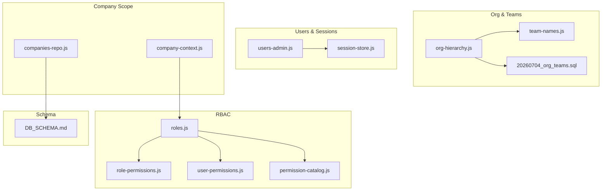
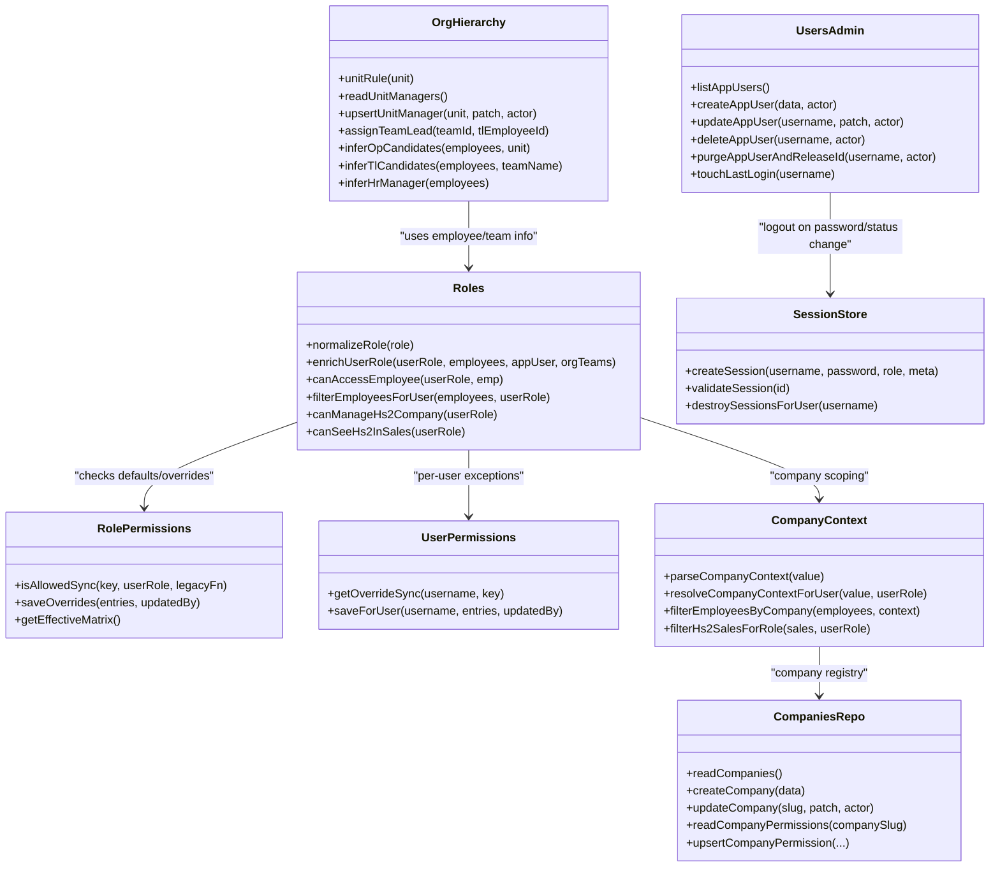
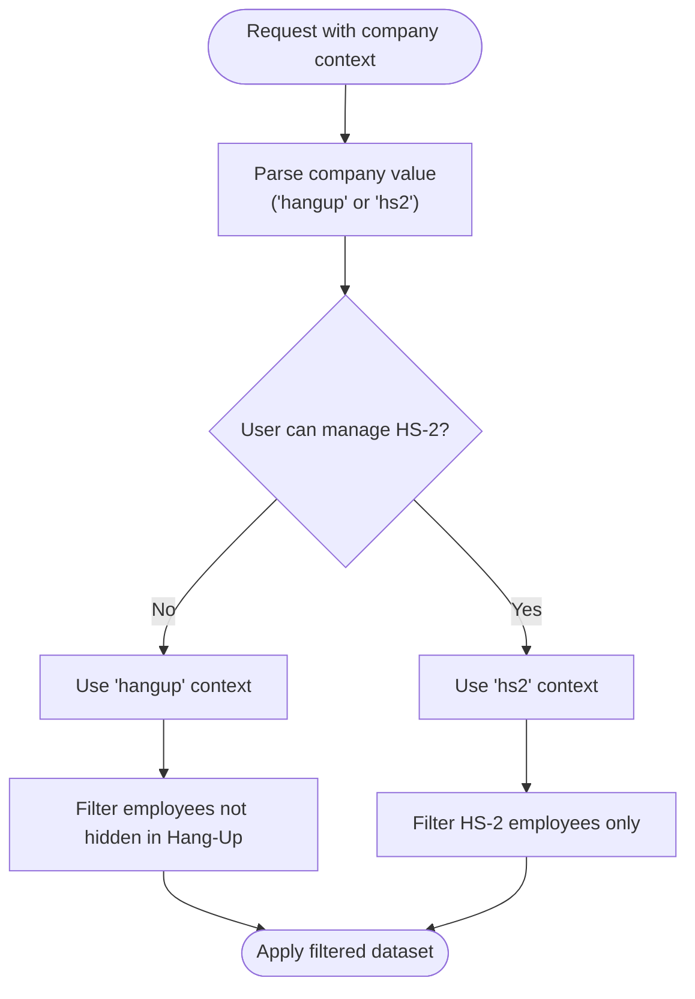
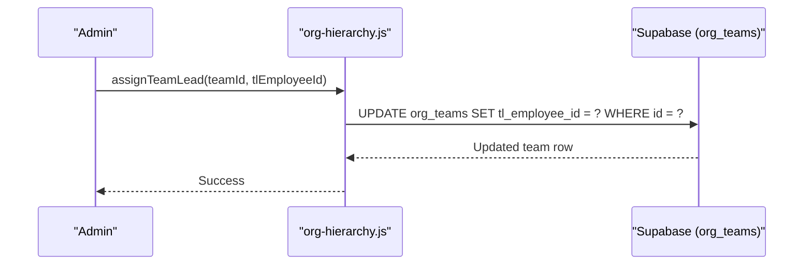
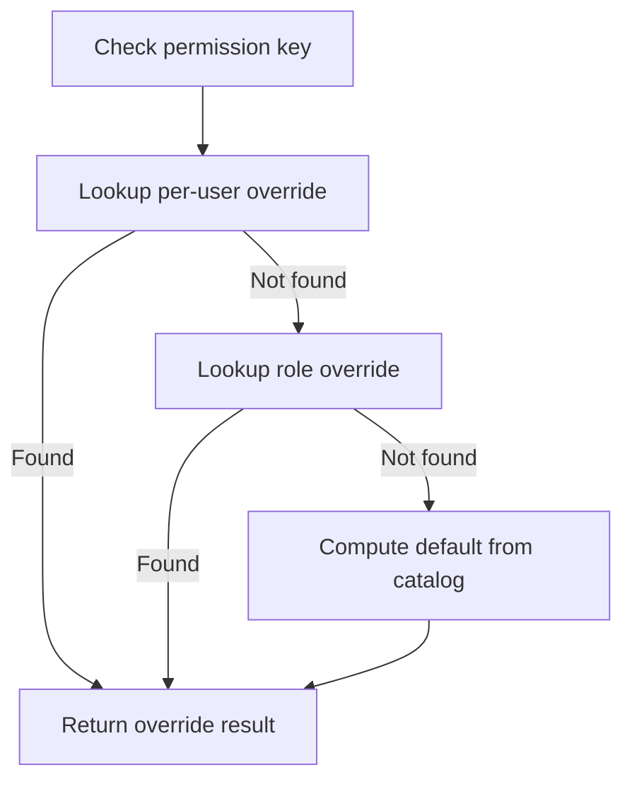
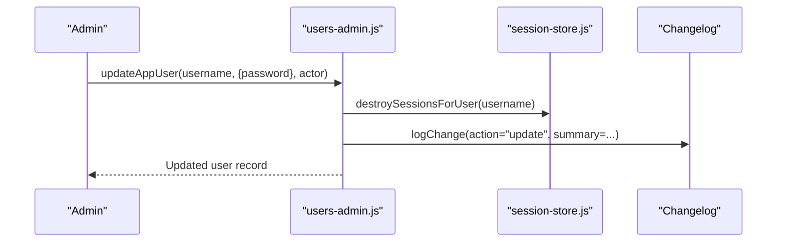
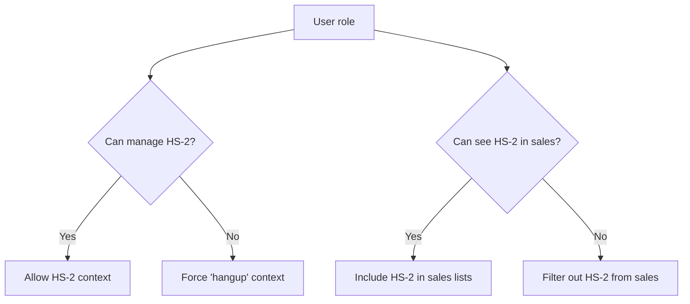
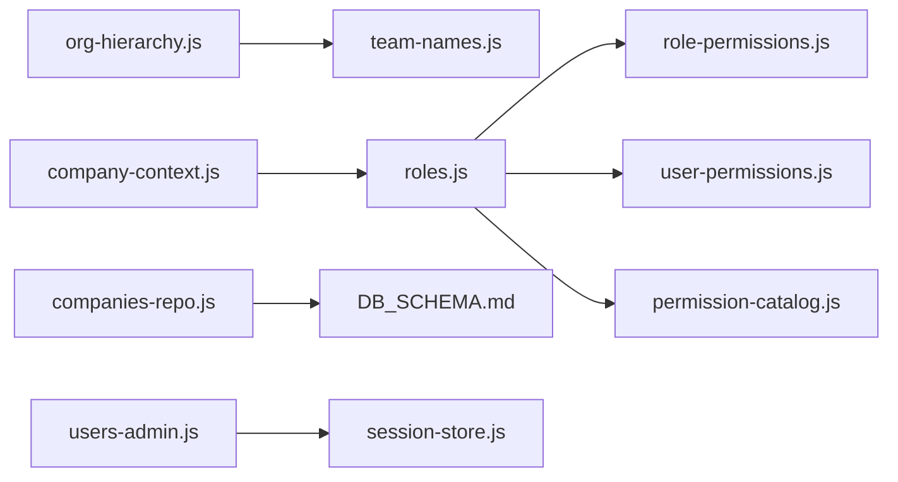

# Organizational Management

<cite>
**Referenced Files in This Document**
- [org-hierarchy.js](file://lib/org-hierarchy.js)
- [roles.js](file://lib/roles.js)
- [role-permissions.js](file://lib/role-permissions.js)
- [user-permissions.js](file://lib/user-permissions.js)
- [users-admin.js](file://lib/users-admin.js)
- [session-store.js](file://lib/session-store.js)
- [company-context.js](file://lib/company-context.js)
- [companies-repo.js](file://lib/companies-repo.js)
- [team-names.js](file://lib/team-names.js)
- [permission-catalog.js](file://lib/permission-catalog.js)
- [20260704_org_teams.sql](file://supabase/migrations/20260704_org_teams.sql)
- [20260716_app_role_permissions.sql](file://supabase/migrations/20260716_app_role_permissions.sql)
- [20260717_app_user_permissions.sql](file://supabase/migrations/20260717_app_user_permissions.sql)
- [20260724_v130_finance_company_scope.sql](file://supabase/migrations/20260724_v130_finance_company_scope.sql)
- [DB_SCHEMA.md](file://DB_SCHEMA.md)
</cite>

## Table of Contents
1. [Introduction](#introduction)
2. [Project Structure](#project-structure)
3. [Core Components](#core-components)
4. [Architecture Overview](#architecture-overview)
5. [Detailed Component Analysis](#detailed-component-analysis)
6. [Dependency Analysis](#dependency-analysis)
7. [Performance Considerations](#performance-considerations)
8. [Troubleshooting Guide](#troubleshooting-guide)
9. [Conclusion](#conclusion)
10. [Appendices](#appendices)

## Introduction
This document explains the organizational management capabilities of the application, focusing on:
- Multi-company support and company-scoped data isolation
- Team hierarchy definition and team lead assignments
- Role-based access control (RBAC) with granular permissions
- User administration including session management, impersonation controls, and audit trails
- Examples for setting up organizations and configuring access for different user types

The system supports two companies (“Hang-Up” and “HS-2 Company”), with HS-1 and HS-3 grouped under “Hang-Up”. Data is isolated by company/unit where applicable, while certain roles can operate across companies.

## Project Structure
Organizational management spans several modules:
- Organization structure and teams: org-hierarchy.js, team-names.js, 20260704_org_teams.sql
- Roles and permissions: roles.js, role-permissions.js, user-permissions.js, permission-catalog.js
- Users and sessions: users-admin.js, session-store.js
- Company context and registry: company-context.js, companies-repo.js
- Schema reference: DB_SCHEMA.md

**Diagram sources**
- [org-hierarchy.js:1-124](file://lib/org-hierarchy.js#L1-L124)
- [team-names.js:1-32](file://lib/team-names.js#L1-L32)
- [20260704_org_teams.sql:1-35](file://supabase/migrations/20260704_org_teams.sql#L1-L35)
- [roles.js:1-800](file://lib/roles.js#L1-L800)
- [role-permissions.js:1-159](file://lib/role-permissions.js#L1-L159)
- [user-permissions.js:1-127](file://lib/user-permissions.js#L1-L127)
- [permission-catalog.js:1-325](file://lib/permission-catalog.js#L1-L325)
- [users-admin.js:1-488](file://lib/users-admin.js#L1-L488)
- [session-store.js:1-83](file://lib/session-store.js#L1-L83)
- [company-context.js:1-117](file://lib/company-context.js#L1-L117)
- [companies-repo.js:1-166](file://lib/companies-repo.js#L1-L166)
- [DB_SCHEMA.md:1-228](file://DB_SCHEMA.md#L1-L228)

**Section sources**
- [DB_SCHEMA.md:1-228](file://DB_SCHEMA.md#L1-L228)

## Core Components
- Organization hierarchy and teams:
  - Units map to companies; teams are registered and linked to units; team leads are assigned per team.
- Role-based access control:
  - Role definitions and rank, default permissions catalog, database-backed overrides for roles and individual users.
- Company context and multi-company scope:
  - Two companies with unit mapping; filters enforce company-scoped visibility.
- User administration:
  - App user lifecycle, role assignment, IT flag, last login tracking, activation guards, and purge flows.
- Session management:
  - In-memory sessions with optional Supabase persistence, revocation, idle timeout, and per-user logout.

**Section sources**
- [org-hierarchy.js:1-124](file://lib/org-hierarchy.js#L1-L124)
- [roles.js:1-800](file://lib/roles.js#L1-L800)
- [role-permissions.js:1-159](file://lib/role-permissions.js#L1-L159)
- [user-permissions.js:1-127](file://lib/user-permissions.js#L1-L127)
- [company-context.js:1-117](file://lib/company-context.js#L1-L117)
- [companies-repo.js:1-166](file://lib/companies-repo.js#L1-L166)
- [users-admin.js:1-488](file://lib/users-admin.js#L1-L488)
- [session-store.js:1-83](file://lib/session-store.js#L1-L83)

## Architecture Overview
The organizational management architecture combines a hierarchical org model with RBAC and company scoping:

**Diagram sources**
- [org-hierarchy.js:1-124](file://lib/org-hierarchy.js#L1-L124)
- [roles.js:1-800](file://lib/roles.js#L1-L800)
- [role-permissions.js:1-159](file://lib/role-permissions.js#L1-L159)
- [user-permissions.js:1-127](file://lib/user-permissions.js#L1-L127)
- [company-context.js:1-117](file://lib/company-context.js#L1-L117)
- [companies-repo.js:1-166](file://lib/companies-repo.js#L1-L166)
- [users-admin.js:1-488](file://lib/users-admin.js#L1-L488)
- [session-store.js:1-83](file://lib/session-store.js#L1-L83)

## Detailed Component Analysis

### Multi-Company Support and Data Isolation
- Company registry:
  - Dynamic list of companies with slugs and metadata; defaults include “hangup” and “hs2”.
  - Per-company role permission overrides stored separately from app-wide overrides.
- Company context resolution:
  - Parses requested company context and enforces user capability to switch to HS-2.
  - Filters employees, units, and sales based on current company and user role.
- Finance company scoping:
  - Finance-related tables include a unit column to isolate financial records per company/unit.

**Diagram sources**
- [company-context.js:1-117](file://lib/company-context.js#L1-L117)
- [roles.js:709-727](file://lib/roles.js#L709-L727)
- [20260724_v130_finance_company_scope.sql:1-112](file://supabase/migrations/20260724_v130_finance_company_scope.sql#L1-L112)

**Section sources**
- [companies-repo.js:1-166](file://lib/companies-repo.js#L1-L166)
- [company-context.js:1-117](file://lib/company-context.js#L1-L117)
- [20260724_v130_finance_company_scope.sql:1-112](file://supabase/migrations/20260724_v130_finance_company_scope.sql#L1-L112)
- [DB_SCHEMA.md:190-217](file://DB_SCHEMA.md#L190-L217)

### Team Hierarchy Definition and Lead Assignments
- Teams are registered with a unit and optional dialing flags.
- Team leads are assigned via team records; helpers infer candidates by ID prefix or role.
- Team name normalization ensures consistent matching between roster and org registry.

**Diagram sources**
- [org-hierarchy.js:64-74](file://lib/org-hierarchy.js#L64-L74)
- [20260704_org_teams.sql:1-35](file://supabase/migrations/20260704_org_teams.sql#L1-L35)

**Section sources**
- [org-hierarchy.js:1-124](file://lib/org-hierarchy.js#L1-L124)
- [team-names.js:1-32](file://lib/team-names.js#L1-L32)
- [20260704_org_teams.sql:1-35](file://supabase/migrations/20260704_org_teams.sql#L1-L35)

### Role-Based Access Control and Granular Permissions
- Role definitions and ranks define baseline capabilities.
- Permission catalog enumerates all keys and default values per role.
- Overrides:
  - Role-level overrides persisted in app_role_permissions.
  - Per-user overrides persisted in app_user_permissions.
- Resolution order:
  - Per-user override → Role override → Catalog default.

**Diagram sources**
- [role-permissions.js:71-78](file://lib/role-permissions.js#L71-L78)
- [user-permissions.js:56-59](file://lib/user-permissions.js#L56-L59)
- [permission-catalog.js:121-213](file://lib/permission-catalog.js#L121-L213)

**Section sources**
- [roles.js:1-800](file://lib/roles.js#L1-L800)
- [role-permissions.js:1-159](file://lib/role-permissions.js#L1-L159)
- [user-permissions.js:1-127](file://lib/user-permissions.js#L1-L127)
- [permission-catalog.js:1-325](file://lib/permission-catalog.js#L1-L325)
- [20260716_app_role_permissions.sql:1-26](file://supabase/migrations/20260716_app_role_permissions.sql#L1-L26)
- [20260717_app_user_permissions.sql:1-12](file://supabase/migrations/20260717_app_user_permissions.sql#L1-L12)

### User Administration, Session Management, and Audit Trails
- User lifecycle:
  - Create, update, delete, and purge app users with validation and safeguards.
  - Auto-create inactive logins for employees without accounts; infer role from employee ID.
  - Activation guard restricts who can activate employee logins.
- Session management:
  - Create sessions with device/IP metadata; validate against persistent store; revoke on idle or manual action.
  - Destroy all sessions for a user when password changes or status becomes inactive.
- Impersonation:
  - Hardcoded allowlist for impersonation capability.
- Audit trails:
  - Changes to app users are logged with actor, entity, action, and summary.

**Diagram sources**
- [users-admin.js:261-337](file://lib/users-admin.js#L261-L337)
- [session-store.js:61-72](file://lib/session-store.js#L61-L72)

**Section sources**
- [users-admin.js:1-488](file://lib/users-admin.js#L1-L488)
- [session-store.js:1-83](file://lib/session-store.js#L1-L83)
- [DB_SCHEMA.md:76-85](file://DB_SCHEMA.md#L76-L85)

### Cross-Company Operation Capabilities
- Certain roles can operate across companies:
  - Manage HS-2 company: admin, ceo, hr.
  - See HS-2 in sales: admin, ceo, hr, quality.
- Context resolution prevents unauthorized switching to HS-2.

**Diagram sources**
- [roles.js:709-727](file://lib/roles.js#L709-L727)
- [company-context.js:72-98](file://lib/company-context.js#L72-L98)

**Section sources**
- [roles.js:709-727](file://lib/roles.js#L709-L727)
- [company-context.js:1-117](file://lib/company-context.js#L1-L117)

## Dependency Analysis
Key dependencies and relationships:
- org-hierarchy.js depends on team names normalization and Supabase client.
- roles.js composes permission checks using role-permissions.js, user-permissions.js, and permission-catalog.js.
- company-context.js uses roles.js to enforce cross-company visibility.
- companies-repo.js provides CRUD for companies and per-company permission overrides.
- users-admin.js integrates session-store.js for logout behavior and changelog for auditing.

**Diagram sources**
- [org-hierarchy.js:1-124](file://lib/org-hierarchy.js#L1-L124)
- [team-names.js:1-32](file://lib/team-names.js#L1-L32)
- [roles.js:1-800](file://lib/roles.js#L1-L800)
- [role-permissions.js:1-159](file://lib/role-permissions.js#L1-L159)
- [user-permissions.js:1-127](file://lib/user-permissions.js#L1-L127)
- [permission-catalog.js:1-325](file://lib/permission-catalog.js#L1-L325)
- [company-context.js:1-117](file://lib/company-context.js#L1-L117)
- [companies-repo.js:1-166](file://lib/companies-repo.js#L1-L166)
- [users-admin.js:1-488](file://lib/users-admin.js#L1-L488)
- [session-store.js:1-83](file://lib/session-store.js#L1-L83)
- [DB_SCHEMA.md:1-228](file://DB_SCHEMA.md#L1-L228)

**Section sources**
- [DB_SCHEMA.md:1-228](file://DB_SCHEMA.md#L1-L228)

## Performance Considerations
- Permission caches:
  - Role and user permission overrides are cached in memory with TTL to reduce DB load.
- Session validation:
  - Optional Supabase persistence with background touch operations; idle timeout enforced server-side.
- Filtering efficiency:
  - Employee and sales filtering functions operate on in-memory arrays after initial fetches.

[No sources needed since this section provides general guidance]

## Troubleshooting Guide
- Cannot switch to HS-2:
  - Ensure the user has the “manage HS-2 company” capability; otherwise, context resolves to “hangup”.
- Permission not applied:
  - Verify per-user override exists and takes precedence over role override and catalog default.
- Session still active after password change:
  - Confirm that destroySessionsForUser was invoked during update; check session store and Supabase revocation.
- Purge user fails:
  - Owner accounts cannot be purged; ensure the target is not an owner username or linked to an owner employee.

**Section sources**
- [company-context.js:72-77](file://lib/company-context.js#L72-L77)
- [role-permissions.js:71-78](file://lib/role-permissions.js#L71-L78)
- [user-permissions.js:56-59](file://lib/user-permissions.js#L56-L59)
- [users-admin.js:261-337](file://lib/users-admin.js#L261-L337)
- [users-admin.js:379-453](file://lib/users-admin.js#L379-L453)

## Conclusion
The organizational management layer provides robust multi-company support, clear team hierarchies, and fine-grained RBAC with both role-level and per-user overrides. Company-scoped data isolation is enforced at multiple layers, while session management and audit trails ensure secure and accountable operations.

[No sources needed since this section summarizes without analyzing specific files]

## Appendices

### Example: Setting Up Organizational Structures
- Define teams within units:
  - Register teams with unit association and display order.
- Assign team leads:
  - Update team records to set lead employee IDs; use inference helpers to find candidates.
- Configure unit managers:
  - Set OP, HR, and Quality managers per unit; optionally specify company association.

**Section sources**
- [20260704_org_teams.sql:1-35](file://supabase/migrations/20260704_org_teams.sql#L1-L35)
- [org-hierarchy.js:64-74](file://lib/org-hierarchy.js#L64-L74)
- [org-hierarchy.js:37-62](file://lib/org-hierarchy.js#L37-L62)

### Example: Configuring Access Permissions
- Adjust role defaults:
  - Use the Access Control UI to persist role-level overrides for specific permission keys.
- Grant per-user exceptions:
  - Add per-user overrides for targeted access beyond role defaults.
- Enable HS-2 operations:
  - Assign “manage HS-2 company” to admin/ceo/hr; enable “see HS-2 in sales” for additional roles.

**Section sources**
- [role-permissions.js:95-113](file://lib/role-permissions.js#L95-L113)
- [user-permissions.js:81-107](file://lib/user-permissions.js#L81-L107)
- [roles.js:709-727](file://lib/roles.js#L709-L727)