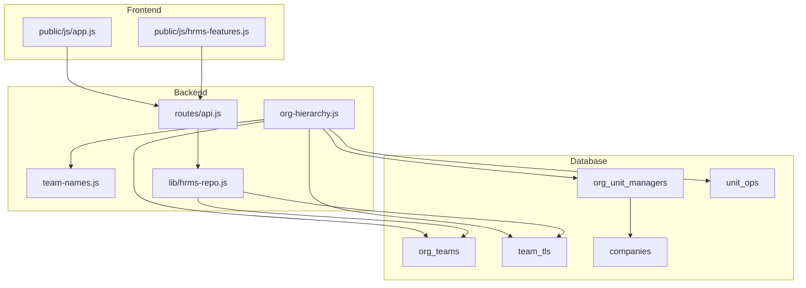
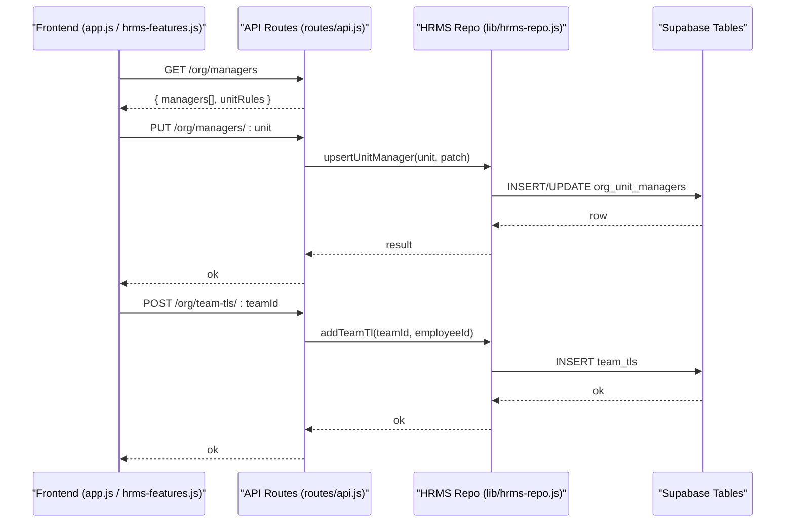
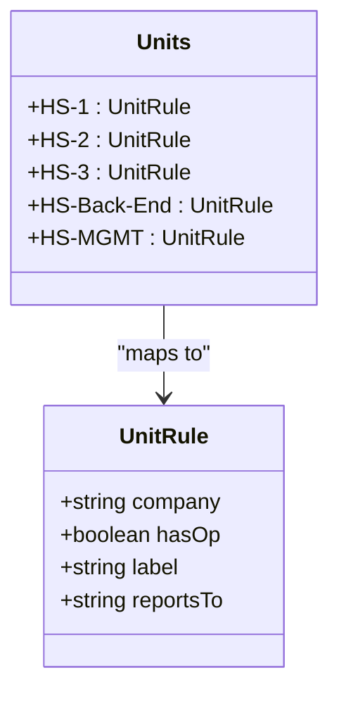
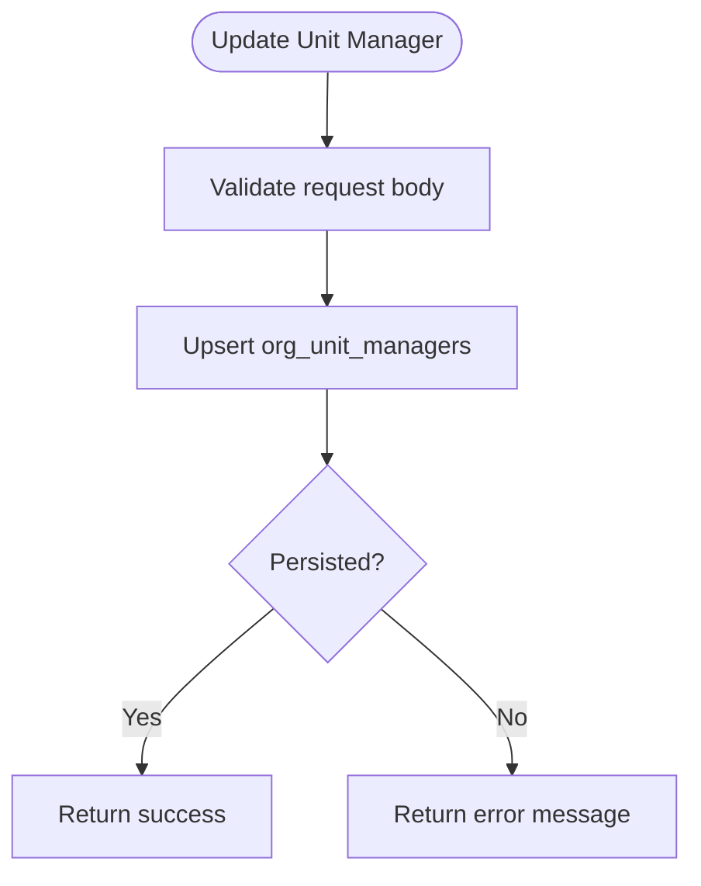
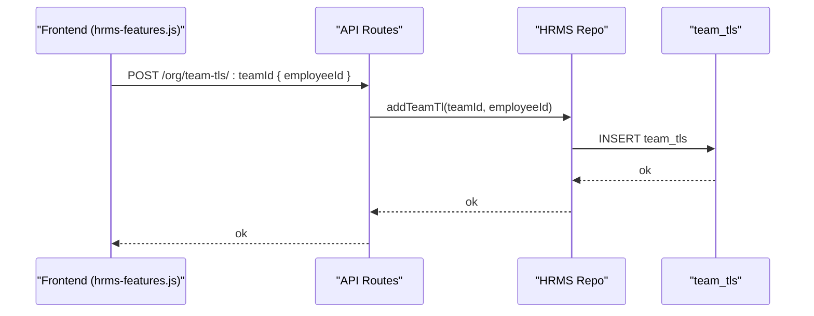
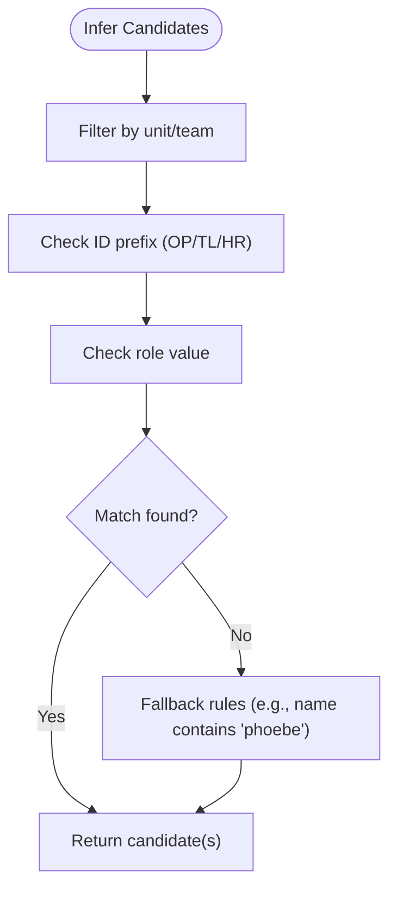
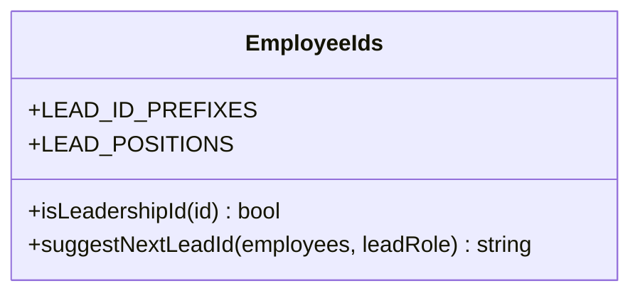
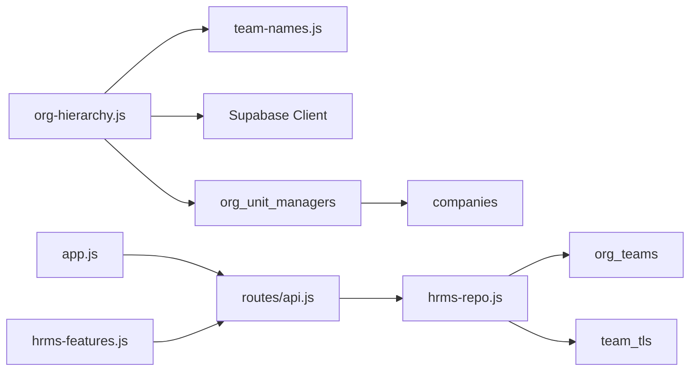

# Organizational Hierarchy

<cite>
**Referenced Files in This Document**
- [org-hierarchy.js](file://lib/org-hierarchy.js)
- [team-names.js](file://lib/team-names.js)
- [api.js](file://routes/api.js)
- [hrms-repo.js](file://lib/hrms-repo.js)
- [20260704_org_teams.sql](file://supabase/migrations/20260704_org_teams.sql)
- [20260712_org_registration.sql](file://supabase/migrations/20260712_org_registration.sql)
- [20260722_v128_phase1_rules_it_meetings_separation.sql](file://supabase/migrations/20260722_v128_phase1_rules_it_meetings_separation.sql)
- [20260723_v129_multi_feature_sprint.sql](file://supabase/migrations/20260723_v129_multi_feature_sprint.sql)
- [app.js](file://public/js/app.js)
- [hrms-features.js](file://public/js/hrms-features.js)
- [employee-ids.js](file://lib/employee-ids.js)
- [id-generator.js](file://lib/id-generator.js)
</cite>

## Table of Contents
1. Introduction
2. Project Structure
3. Core Components
4. Architecture Overview
5. Detailed Component Analysis
6. Dependency Analysis
7. Performance Considerations
8. Troubleshooting Guide
9. Conclusion
10. Appendices

## Introduction
This document explains the organizational hierarchy system used by the application. It covers:
- The unit-based structure with predefined units and their company associations
- UNIT_RULES configuration for ownership, operational capabilities, and reporting relationships
- Manager assignment at the unit level (Operations Managers, HR Managers, Quality Managers)
- Team lead assignment to teams and inference logic for suitable candidates based on employee IDs and roles
- Practical examples for setting up new units, assigning managers, and configuring reporting structures

## Project Structure
The organizational hierarchy spans backend modules, database migrations, and UI components:
- Backend module defines units, rules, manager persistence, team lead assignment, and candidate inference
- Database schema defines teams, managers, and multi-company support
- API routes expose endpoints for managing team leads and unit operations
- Frontend renders unit management and team leadership controls

**Diagram sources**
- [org-hierarchy.js:1-124](file://lib/org-hierarchy.js#L1-L124)
- [team-names.js:1-32](file://lib/team-names.js#L1-L32)
- [api.js:1131-1184](file://routes/api.js#L1131-L1184)
- [hrms-repo.js:121-142](file://lib/hrms-repo.js#L121-L142)
- [20260704_org_teams.sql:1-35](file://supabase/migrations/20260704_org_teams.sql#L1-L35)
- [20260712_org_registration.sql:5-12](file://supabase/migrations/20260712_org_registration.sql#L5-L12)
- [20260722_v128_phase1_rules_it_meetings_separation.sql:16-38](file://supabase/migrations/20260722_v128_phase1_rules_it_meetings_separation.sql#L16-L38)
- [20260723_v129_multi_feature_sprint.sql:78-100](file://supabase/migrations/20260723_v129_multi_feature_sprint.sql#L78-L100)
- [app.js:5885-5934](file://public/js/app.js#L5885-L5934)
- [hrms-features.js:755-787](file://public/js/hrms-features.js#L755-L787)

**Section sources**
- [org-hierarchy.js:1-124](file://lib/org-hierarchy.js#L1-L124)
- [20260704_org_teams.sql:1-35](file://supabase/migrations/20260704_org_teams.sql#L1-L35)
- [20260712_org_registration.sql:5-12](file://supabase/migrations/20260712_org_registration.sql#L5-L12)
- [20260722_v128_phase1_rules_it_meetings_separation.sql:16-38](file://supabase/migrations/20260722_v128_phase1_rules_it_meetings_separation.sql#L16-L38)
- [20260723_v129_multi_feature_sprint.sql:78-100](file://supabase/migrations/20260723_v129_multi_feature_sprint.sql#L78-L100)
- [app.js:5885-5934](file://public/js/app.js#L5885-L5934)
- [hrms-features.js:755-787](file://public/js/hrms-features.js#L755-L787)

## Core Components
- Units and Company Mapping
  - Predefined units include HS-1, HS-2, HS-3, HS-Back-End, and HS-MGMT
  - HS-1 and HS-3 belong to the Hang-Up company; HS-2 is its own company
  - UNIT_RULES encodes company association, whether a unit has an Operations Manager, and optional reporting relationships
- Unit Managers
  - Each unit can have an Operations Manager (OP), an HR Manager, and a Quality Manager
  - These are persisted in org_unit_managers and can be updated via API
- Teams and Team Leads
  - Teams are registered in org_teams and can be assigned to units
  - Multiple team leads per team are supported via team_tls join table
  - A legacy single-team lead column exists alongside the multi-lead model
- Inference Helpers
  - Candidate selection for OPs, TLs, and HR managers uses employee ID prefixes and role values
  - Team name normalization ensures consistent matching across roster and org data

**Section sources**
- [org-hierarchy.js:8-23](file://lib/org-hierarchy.js#L8-L23)
- [org-hierarchy.js:33-35](file://lib/org-hierarchy.js#L33-L35)
- [org-hierarchy.js:37-62](file://lib/org-hierarchy.js#L37-L62)
- [org-hierarchy.js:64-74](file://lib/org-hierarchy.js#L64-L74)
- [org-hierarchy.js:76-101](file://lib/org-hierarchy.js#L76-L101)
- [20260704_org_teams.sql:1-35](file://supabase/migrations/20260704_org_teams.sql#L1-L35)
- [20260722_v128_phase1_rules_it_meetings_separation.sql:16-38](file://supabase/migrations/20260722_v128_phase1_rules_it_meetings_separation.sql#L16-L38)

## Architecture Overview
The system combines configuration-driven unit rules with relational storage for managers and teams, exposed through REST endpoints and consumed by the frontend.

**Diagram sources**
- [app.js:5885-5934](file://public/js/app.js#L5885-L5934)
- [hrms-features.js:755-787](file://public/js/hrms-features.js#L755-L787)
- [api.js:1131-1184](file://routes/api.js#L1131-L1184)
- [hrms-repo.js:121-142](file://lib/hrms-repo.js#L121-L142)
- [20260712_org_registration.sql:5-12](file://supabase/migrations/20260712_org_registration.sql#L5-L12)
- [20260722_v128_phase1_rules_it_meetings_separation.sql:16-38](file://supabase/migrations/20260722_v128_phase1_rules_it_meetings_separation.sql#L16-L38)

## Detailed Component Analysis

### Units and Company Associations
- Predefined units:
  - HS-1, HS-2, HS-3 (dialing units)
  - HS-Back-End (non-operational, reports to CEO)
  - HS-MGMT (non-operational, reports to CEO)
- Company mapping:
  - HS-1 and HS-3 → hangup
  - HS-2 → hs2
- Operational capability:
  - Dialing units have hasOp = true
  - Back-end and management units have hasOp = false
- Reporting:
  - Non-operational units report to CEO

**Diagram sources**
- [org-hierarchy.js:8-23](file://lib/org-hierarchy.js#L8-L23)

**Section sources**
- [org-hierarchy.js:8-23](file://lib/org-hierarchy.js#L8-L23)

### Unit Managers (OP, HR, Quality)
- Storage:
  - org_unit_managers holds per-unit manager assignments and notes
  - company_slug links each unit to a company record
- API:
  - PUT /org/managers/:unit updates op_employee_id, hr_manager_id, quality_manager_id, company, notes
- UI:
  - Settings page allows selecting employees from the same unit for OP, HR, and Quality roles

**Diagram sources**
- [org-hierarchy.js:51-62](file://lib/org-hierarchy.js#L51-L62)
- [20260712_org_registration.sql:5-12](file://supabase/migrations/20260712_org_registration.sql#L5-L12)
- [20260723_v129_multi_feature_sprint.sql:95-100](file://supabase/migrations/20260723_v129_multi_feature_sprint.sql#L95-L100)
- [app.js:5915-5934](file://public/js/app.js#L5915-L5934)

**Section sources**
- [org-hierarchy.js:37-62](file://lib/org-hierarchy.js#L37-L62)
- [20260712_org_registration.sql:5-12](file://supabase/migrations/20260712_org_registration.sql#L5-L12)
- [20260723_v129_multi_feature_sprint.sql:95-100](file://supabase/migrations/20260723_v129_multi_feature_sprint.sql#L95-L100)
- [app.js:5915-5934](file://public/js/app.js#L5915-L5934)

### Teams and Team Leads
- Team registry:
  - org_teams stores team names, associated unit, display order, and dialing flag
- Multi-lead support:
  - team_tls join table supports multiple team leads per team
  - Legacy tl_employee_id remains for compatibility
- Assignment flow:
  - POST /org/team-tls/:teamId adds a lead
  - DELETE /org/team-tls/:teamId/:employeeId removes a lead
  - UI confirms cross-team or unusual assignments before saving

**Diagram sources**
- [hrms-features.js:755-787](file://public/js/hrms-features.js#L755-L787)
- [api.js:1131-1151](file://routes/api.js#L1131-L1151)
- [hrms-repo.js:121-142](file://lib/hrms-repo.js#L121-L142)
- [20260704_org_teams.sql:1-35](file://supabase/migrations/20260704_org_teams.sql#L1-L35)
- [20260722_v128_phase1_rules_it_meetings_separation.sql:16-26](file://supabase/migrations/20260722_v128_phase1_rules_it_meetings_separation.sql#L16-L26)

**Section sources**
- [20260704_org_teams.sql:1-35](file://supabase/migrations/20260704_org_teams.sql#L1-L35)
- [20260722_v128_phase1_rules_it_meetings_separation.sql:16-26](file://supabase/migrations/20260722_v128_phase1_rules_it_meetings_separation.sql#L16-L26)
- [api.js:1131-1151](file://routes/api.js#L1131-L1151)
- [hrms-repo.js:121-142](file://lib/hrms-repo.js#L121-L142)
- [hrms-features.js:755-787](file://public/js/hrms-features.js#L755-L787)

### Inference Logic for Candidates
- Operations Manager candidates:
  - Employees whose unit matches and either ID starts with "OP" or role equals "op"
- Team Lead candidates:
  - Employees whose normalized team matches and either ID starts with "TL" or role equals "tl"
- HR Manager inference:
  - Prefer employee named Phoebe; otherwise prefer HR-prefixed ID with role "hr" or name containing "phoebe"
- Team name normalization:
  - Removes leading "team " prefix to ensure consistent matching

**Diagram sources**
- [org-hierarchy.js:76-101](file://lib/org-hierarchy.js#L76-L101)
- [team-names.js:1-11](file://lib/team-names.js#L1-L11)

**Section sources**
- [org-hierarchy.js:76-101](file://lib/org-hierarchy.js#L76-L101)
- [team-names.js:1-11](file://lib/team-names.js#L1-L11)

### Employee ID Prefixes and Role Mapping
- Leadership ID prefixes:
  - TL, CL, OP
- Role-to-position mapping includes TL, OP, HR, RTM, IT Support
- Suggest next lead ID function validates allowed roles and avoids reserved IDs

**Diagram sources**
- [employee-ids.js:1-12](file://lib/employee-ids.js#L1-L12)
- [employee-ids.js:48-121](file://lib/employee-ids.js#L48-L121)

**Section sources**
- [employee-ids.js:1-12](file://lib/employee-ids.js#L1-L12)
- [employee-ids.js:48-121](file://lib/employee-ids.js#L48-L121)

## Dependency Analysis
- Backend dependencies:
  - org-hierarchy depends on Supabase client, backend config, and team-name normalization
  - hrms-repo orchestrates team reads/writes and merges multi-lead data
- Database dependencies:
  - org_teams references teams and units
  - team_tls and unit_ops provide many-to-many relationships
  - companies and company_role_permissions enable multi-company scoping
- Frontend dependencies:
  - app.js and hrms-features.js call API endpoints and render UI elements

**Diagram sources**
- [org-hierarchy.js:1-10](file://lib/org-hierarchy.js#L1-L10)
- [hrms-repo.js:121-142](file://lib/hrms-repo.js#L121-L142)
- [20260723_v129_multi_feature_sprint.sql:78-100](file://supabase/migrations/20260723_v129_multi_feature_sprint.sql#L78-L100)
- [app.js:5885-5934](file://public/js/app.js#L5885-L5934)
- [hrms-features.js:755-787](file://public/js/hrms-features.js#L755-L787)

**Section sources**
- [org-hierarchy.js:1-10](file://lib/org-hierarchy.js#L1-L10)
- [hrms-repo.js:121-142](file://lib/hrms-repo.js#L121-L142)
- [20260723_v129_multi_feature_sprint.sql:78-100](file://supabase/migrations/20260723_v129_multi_feature_sprint.sql#L78-L100)
- [app.js:5885-5934](file://public/js/app.js#L5885-L5934)
- [hrms-features.js:755-787](file://public/js/hrms-features.js#L755-L787)

## Performance Considerations
- Use normalized team names to avoid repeated string transformations during filtering
- Prefer indexed queries on team_id and unit columns for large datasets
- Batch manager updates where possible to reduce round-trips
- Avoid redundant lookups by caching employee lists in the frontend when rendering unit management

[No sources needed since this section provides general guidance]

## Troubleshooting Guide
- Common issues:
  - Missing DATA_BACKEND=supabase: Ensure environment variable is set before calling org functions
  - Invalid team name normalization: Confirm team labels do not contain unexpected prefixes
  - Duplicate team lead entries: team_tls enforces uniqueness per team_id and employee_id
  - Company mismatch: Verify company_slug on org_unit_managers aligns with UNIT_RULES defaults
- Debugging steps:
  - Inspect API responses for errors returned by Supabase
  - Validate employee IDs against expected prefixes (OP/TL/HR)
  - Check that teams exist in org_teams before assigning leads

**Section sources**
- [org-hierarchy.js:29-31](file://lib/org-hierarchy.js#L29-L31)
- [20260722_v128_phase1_rules_it_meetings_separation.sql:16-26](file://supabase/migrations/20260722_v128_phase1_rules_it_meetings_separation.sql#L16-L26)
- [team-names.js:1-11](file://lib/team-names.js#L1-L11)

## Conclusion
The organizational hierarchy system provides a robust framework for managing units, teams, and leadership roles across multiple companies. Configuration-driven unit rules simplify company associations and operational capabilities, while relational tables and APIs enable flexible manager and team lead assignments. Inference helpers streamline candidate selection using standardized ID prefixes and roles, ensuring consistency and reducing manual overhead.

[No sources needed since this section summarizes without analyzing specific files]

## Appendices

### Practical Examples

- Setting up a new unit:
  - Add a new entry to UNIT_RULES with company, hasOp, and optional reportsTo
  - Create corresponding org_unit_managers row with initial manager placeholders
  - Seed any default teams under the new unit in org_teams if needed

- Assigning managers:
  - Use PUT /org/managers/:unit to set opEmployeeId, hrManagerId, qualityManagerId
  - Optionally update company to override default mapping for a specific unit

- Configuring reporting structures:
  - For non-operational units, set reportsTo to "CEO" in UNIT_RULES
  - Ensure company_slug on org_unit_managers reflects the correct company

- Assigning team leads:
  - Use POST /org/team-tls/:teamId with employeeId to add a lead
  - Remove leads via DELETE /org/team-tls/:teamId/:employeeId
  - Confirm cross-team assignments in the UI before saving

- Using inference helpers:
  - inferOpCandidates(employees, unit) returns eligible OPs by unit and ID/role
  - inferTlCandidates(employees, teamName) returns eligible TLs by normalized team and ID/role
  - inferHrManager(employees) prefers Phoebe or HR-prefixed IDs with HR role

**Section sources**
- [org-hierarchy.js:15-21](file://lib/org-hierarchy.js#L15-L21)
- [org-hierarchy.js:51-62](file://lib/org-hierarchy.js#L51-L62)
- [api.js:1131-1184](file://routes/api.js#L1131-L1184)
- [hrms-repo.js:144-201](file://lib/hrms-repo.js#L144-L201)
- [org-hierarchy.js:76-101](file://lib/org-hierarchy.js#L76-L101)