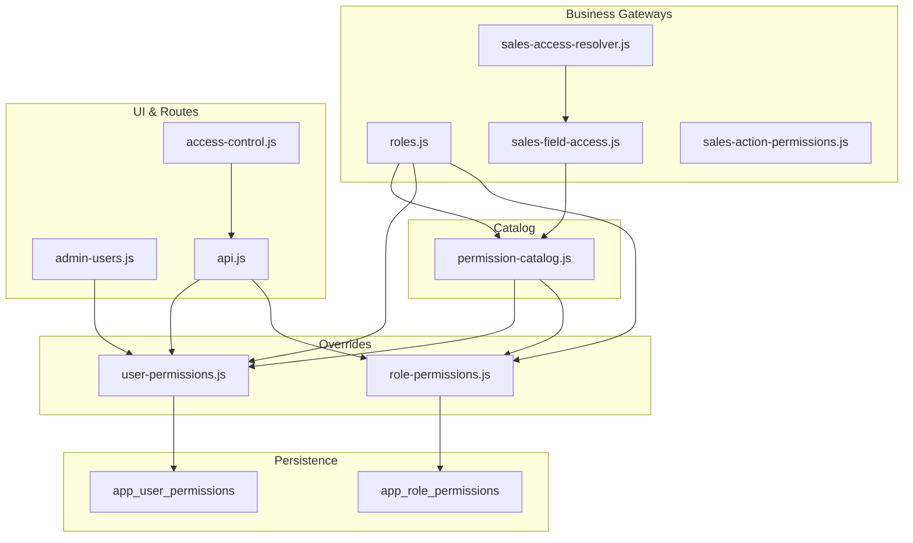
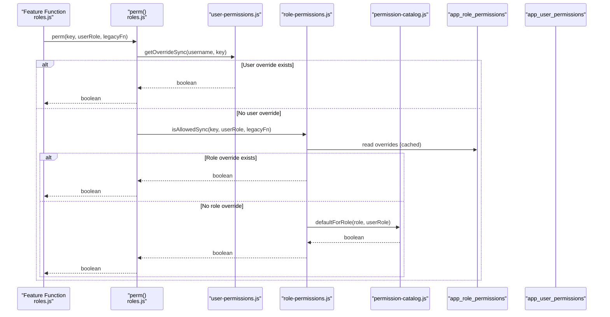
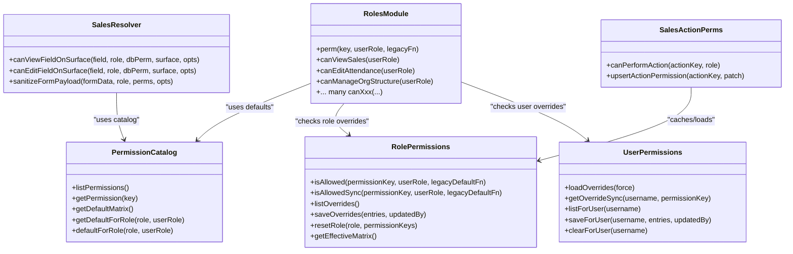

# Permission Catalog

<cite>
**Referenced Files in This Document**
- [permission-catalog.js](file://lib/permission-catalog.js)
- [role-permissions.js](file://lib/role-permissions.js)
- [user-permissions.js](file://lib/user-permissions.js)
- [roles.js](file://lib/roles.js)
- [sales-access-resolver.js](file://lib/sales-access-resolver.js)
- [sales-field-access.js](file://lib/sales-field-access.js)
- [sales-action-permissions.js](file://lib/sales-action-permissions.js)
- [20260716_app_role_permissions.sql](file://supabase/migrations/20260716_app_role_permissions.sql)
- [20260717_app_user_permissions.sql](file://supabase/migrations/20260717_app_user_permissions.sql)
- [access-control.js](file://public/js/access-control.js)
- [admin-users.js](file://routes/admin-users.js)
- [api.js](file://routes/api.js)
</cite>

## Table of Contents
1. [Introduction](#introduction)
2. [Project Structure](#project-structure)
3. [Core Components](#core-components)
4. [Architecture Overview](#architecture-overview)
5. [Detailed Component Analysis](#detailed-component-analysis)
6. [Dependency Analysis](#dependency-analysis)
7. [Performance Considerations](#performance-considerations)
8. [Troubleshooting Guide](#troubleshooting-guide)
9. [Conclusion](#conclusion)
10. [Appendices](#appendices)

## Introduction
This document explains the permission catalog system used across the application’s modules (attendance, payroll, sales, admin). It covers:
- All available permission keys and their business meanings
- The role hierarchy and how granular permissions combine to form capabilities
- Permission evaluation logic, including team-level and organization-level interactions
- Examples for checking permissions programmatically
- Guidance for extending the catalog with custom permissions
- Troubleshooting steps for access issues

## Project Structure
The permission system is implemented as a layered architecture:
- A central catalog defines all permission keys, labels, categories, and default assignments per role
- Role-based overrides are persisted in the database and cached in memory
- Per-user exceptions can override role defaults
- Feature-specific modules (e.g., Sales) add additional field-level and action-level controls
- Frontend UIs expose management interfaces backed by API routes

**Diagram sources**
- [permission-catalog.js:1-325](file://lib/permission-catalog.js#L1-L325)
- [role-permissions.js:1-159](file://lib/role-permissions.js#L1-L159)
- [user-permissions.js:1-127](file://lib/user-permissions.js#L1-L127)
- [roles.js:1-800](file://lib/roles.js#L1-L800)
- [sales-access-resolver.js:1-356](file://lib/sales-access-resolver.js#L1-L356)
- [sales-field-access.js:1-112](file://lib/sales-field-access.js#L1-L112)
- [sales-action-permissions.js:1-127](file://lib/sales-action-permissions.js#L1-L127)
- [access-control.js:1-225](file://public/js/access-control.js#L1-L225)
- [admin-users.js:71-138](file://routes/admin-users.js#L71-L138)
- [api.js:4023-4072](file://routes/api.js#L4023-L4072)

**Section sources**
- [permission-catalog.js:1-325](file://lib/permission-catalog.js#L1-L325)
- [role-permissions.js:1-159](file://lib/role-permissions.js#L1-L159)
- [user-permissions.js:1-127](file://lib/user-permissions.js#L1-L127)
- [roles.js:1-800](file://lib/roles.js#L1-L800)
- [sales-access-resolver.js:1-356](file://lib/sales-access-resolver.js#L1-L356)
- [sales-field-access.js:1-112](file://lib/sales-field-access.js#L1-L112)
- [sales-action-permissions.js:1-127](file://lib/sales-action-permissions.js#L1-L127)
- [access-control.js:1-225](file://public/js/access-control.js#L1-L225)
- [admin-users.js:71-138](file://routes/admin-users.js#L71-L138)
- [api.js:4023-4072](file://routes/api.js#L4023-L4072)

## Core Components
- Permission catalog: Defines all permission keys, labels, categories, descriptions, and default matrices per role
- Role overrides: Database-backed overrides that change defaults for a given role
- User overrides: Per-user exceptions that take precedence over role defaults
- Business gateways: Feature functions (e.g., canViewSales, canEditAttendance) that evaluate permissions using the above layers
- Sales-specific controls: Field-level and attachment-level permissions, plus action-level permissions

Key responsibilities:
- Centralize permission definitions and defaults
- Provide efficient evaluation with caching
- Allow safe extension via new keys and roles
- Support granular control at role and user levels

**Section sources**
- [permission-catalog.js:1-325](file://lib/permission-catalog.js#L1-L325)
- [role-permissions.js:1-159](file://lib/role-permissions.js#L1-L159)
- [user-permissions.js:1-127](file://lib/user-permissions.js#L1-L127)
- [roles.js:1-800](file://lib/roles.js#L1-L800)

## Architecture Overview
Permission evaluation follows a strict precedence:
1. Per-user override (highest priority)
2. Role override (overrides defaults)
3. Default matrix from catalog (fallback)

**Diagram sources**
- [roles.js:69-76](file://lib/roles.js#L69-L76)
- [user-permissions.js:56-68](file://lib/user-permissions.js#L56-L68)
- [role-permissions.js:71-83](file://lib/role-permissions.js#L71-L83)
- [permission-catalog.js:121-213](file://lib/permission-catalog.js#L121-L213)
- [20260716_app_role_permissions.sql:1-26](file://supabase/migrations/20260716_app_role_permissions.sql#L1-L26)
- [20260717_app_user_permissions.sql:1-12](file://supabase/migrations/20260717_app_user_permissions.sql#L1-L12)

## Detailed Component Analysis

### Permission Catalog
- Defines all permission keys, labels, categories, and descriptions
- Provides default matrices per role based on role rank and lists
- Exposes helpers to list permissions, categories, and compute defaults

Examples of permission keys and business meanings (selected):
- Pages: viewPayroll, viewBonuses, viewSales, viewEquipment, viewReports
- Employees: manageEmployees, addEmployee, editEmployeeRecord, viewEmployeeNotes, writeEmployeeNotes, viewQualityNotes, writeQualityNotes, viewEmployeeDirectory, useEmployeeFilters, viewEmployeeNationality, viewEmployeeCompliance, viewEmployeeComplianceFilters
- Payroll: viewTransportControls, viewBonusTransferSource, viewTlOpBonusTransfers, transferBonus, submitBonusRequest, approveBonusRequest, manageTrainingProgram, viewTrainingPayPreview, approveTrainingPayslip, manageResignationPayRules
- Sales: editSales, viewSale, approveSales, submitSales, workQualityTicket, deleteSales, reassignSaleLead, grantSalesVisibility, manageSalesFieldPermissions, viewSalesAdmin, exportSales, seeHs2InSales
- Organization: manageOrgStructure, viewOrgFull, manageHs2Company
- Dashboard: viewDashboardPayroll, viewDashboardFull, viewDashboardUnits, viewTeamDashboard
- Admin: manageAppUsers, manageAccessControl, manageCompanies
- Settings: settingsHolidays, settingsSession, settingsHideOut, settingsSync, settingsTheme, settingsProfilePhoto, settingsManagingUnits
- Costs: accessCostsFull, submitExpense
- Requests: viewItRequests, submitItRequest, assignItRequest, resolveItRequest, deleteItRequest, viewMeetingRequests, submitMeetingRequest, reviewMeetingRequest
- Rules: viewRules, editRules

How defaults are computed:
- Role rank determines baseline access (e.g., finance threshold for payroll)
- Specific role lists determine feature visibility (e.g., quality ticket roles)
- Some permissions depend on linked employee context (e.g., profile photo)

**Section sources**
- [permission-catalog.js:1-325](file://lib/permission-catalog.js#L1-L325)

### Role-Based Overrides
- Loads overrides from app_role_permissions into an in-memory cache
- Evaluates effective permission by combining overrides with catalog defaults
- Supports reset and listing of overrides

Database schema:
- Primary key: (role, permission_key)
- Columns: allowed, updated_at, updated_by
- Row-level security denies anonymous/authenticated access by default

**Section sources**
- [role-permissions.js:1-159](file://lib/role-permissions.js#L1-L159)
- [20260716_app_role_permissions.sql:1-26](file://supabase/migrations/20260716_app_role_permissions.sql#L1-L26)

### User-Level Overrides
- Loads per-user overrides from app_user_permissions into an in-memory cache
- Takes highest precedence over role defaults
- Supports save/clear/list operations

Database schema:
- Primary key: (username, permission_key)
- Columns: allowed, updated_at, updated_by

**Section sources**
- [user-permissions.js:1-127](file://lib/user-permissions.js#L1-L127)
- [20260717_app_user_permissions.sql:1-12](file://supabase/migrations/20260717_app_user_permissions.sql#L1-L12)

### Business Gateways (Roles Module)
- Central entry point perm() checks user overrides first, then delegates to role-based evaluation
- Each feature exposes a canXxx function that maps to a permission key and provides a legacy fallback
- Team-level and org-level scoping is applied where relevant (e.g., TL/OP scope, unit filters)

Key behaviors:
- Team-level scoping: TLs can access employees in teams they lead; OPs can access employees in their unit
- Org-level scoping: HR/Admin/CEO/Finance have broader access; others are limited by unit/team or self
- Special cases: IT flag affects IT requests; named executives bypass Access Control for leave approvals

Examples of gateway functions:
- Attendance/Payroll: canEditAttendance, canViewTransportControls, canViewPayroll, canViewBonusesDeductions, canTransferBonus, canSubmitBonusRequest, canApproveBonusRequest
- Sales: canViewSales, canSubmitSales, canWorkQualityTicket, canEditSale, canDeleteSales, canReassignSaleLead, canGrantSalesVisibility, canManageSalesFieldPermissions
- Employees: canManageEmployees, canAddEmployee, canEditEmployeeRecord, canViewEmployeeNotes, canWriteEmployeeNotes, canViewQualityNotes, canWriteQualityNotes, canViewEmployeeDirectory, canUseEmployeeFilters, canViewEmployeeNationality, canViewEmployeeCompliance
- Organization: canManageOrgStructure, canViewOrgFull, canManageHs2Company
- Dashboard: canViewDashboardPayroll, canViewDashboardFull, canViewDashboardUnits, canViewTeamDashboard
- Admin/Settings/Costs/Requests/Rules: various canXxx functions mapped to permission keys

**Section sources**
- [roles.js:69-800](file://lib/roles.js#L69-L800)

### Sales-Specific Permissions
- Field-level and attachment-level permissions controlled by a dedicated resolver and catalog
- Action-level permissions (approve/deny/callback) managed separately with DB-backed configuration

Highlights:
- Surfaces: main, quality, edit — each surface has its own view/edit rules
- System-hidden fields and quality-only fields are handled explicitly
- Verifier feedback and client feedback have special edit/view rules tied to assignment and roles

**Section sources**
- [sales-access-resolver.js:1-356](file://lib/sales-access-resolver.js#L1-L356)
- [sales-field-access.js:1-112](file://lib/sales-field-access.js#L1-L112)
- [sales-action-permissions.js:1-127](file://lib/sales-action-permissions.js#L1-L127)

### Frontend and API Integration
- Access Control UI loads catalog and effective overrides, allows toggling role permissions, and persists changes
- Users page shows per-user overrides and integrates with the same catalog
- Company-level permissions endpoints allow per-company overrides for roles

API endpoints:
- RBAC catalog and overrides
- Per-user permissions CRUD
- Company permissions CRUD

**Section sources**
- [access-control.js:1-225](file://public/js/access-control.js#L1-L225)
- [admin-users.js:71-138](file://routes/admin-users.js#L71-L138)
- [api.js:4023-4072](file://routes/api.js#L4023-L4072)

## Dependency Analysis

**Diagram sources**
- [permission-catalog.js:1-325](file://lib/permission-catalog.js#L1-L325)
- [role-permissions.js:1-159](file://lib/role-permissions.js#L1-L159)
- [user-permissions.js:1-127](file://lib/user-permissions.js#L1-L127)
- [roles.js:1-800](file://lib/roles.js#L1-L800)
- [sales-access-resolver.js:1-356](file://lib/sales-access-resolver.js#L1-L356)
- [sales-action-permissions.js:1-127](file://lib/sales-action-permissions.js#L1-L127)

**Section sources**
- [permission-catalog.js:1-325](file://lib/permission-catalog.js#L1-L325)
- [role-permissions.js:1-159](file://lib/role-permissions.js#L1-L159)
- [user-permissions.js:1-127](file://lib/user-permissions.js#L1-L127)
- [roles.js:1-800](file://lib/roles.js#L1-L800)
- [sales-access-resolver.js:1-356](file://lib/sales-access-resolver.js#L1-L356)
- [sales-action-permissions.js:1-127](file://lib/sales-action-permissions.js#L1-L127)

## Performance Considerations
- In-memory caches:
  - Role overrides cache TTL ~60 seconds
  - User overrides cache TTL ~60 seconds
  - Sales field permissions cache TTL ~60 seconds
  - Sales action permissions cache TTL ~60 seconds
- Cache invalidation:
  - After saving overrides, caches are invalidated and reloaded
- Recommendations:
  - Avoid frequent reloads in tight loops; rely on sync paths when possible
  - Use effective matrix APIs sparingly during heavy operations
  - Monitor DB errors gracefully; tables may not exist early in deployment

[No sources needed since this section provides general guidance]

## Troubleshooting Guide
Common issues and resolutions:
- Missing DB tables:
  - If app_role_permissions or app_user_permissions do not exist, code falls back to catalog defaults
  - Ensure migrations are applied
- Unexpected access denied:
  - Check per-user overrides for the username
  - Verify role overrides for the normalized role
  - Confirm legacy fallbacks align with catalog defaults
- Sales field not visible:
  - Validate surface (main vs quality) and assigned verifier
  - Check field-level permissions map and attachment kind permissions
- UI shows “unsaved” or “override”:
  - Review pending changes in Access Control UI
  - Save changes or reset role to defaults if needed

Operational tips:
- Use the effective matrix endpoint to inspect defaults vs overrides
- Clear caches after manual DB edits to ensure consistency
- For IT-related features, confirm is_it flag and role combinations

**Section sources**
- [role-permissions.js:19-54](file://lib/role-permissions.js#L19-L54)
- [user-permissions.js:15-49](file://lib/user-permissions.js#L15-L49)
- [sales-field-access.js:11-23](file://lib/sales-field-access.js#L11-L23)
- [sales-action-permissions.js:30-58](file://lib/sales-action-permissions.js#L30-L58)
- [access-control.js:1-225](file://public/js/access-control.js#L1-L225)

## Conclusion
The permission catalog system provides a robust, extensible framework for controlling access across modules. With clear precedence (user > role > default), strong defaults, and fine-grained controls for sales fields and actions, it supports both broad organizational needs and precise operational requirements. Administrators can manage role and user overrides through intuitive UIs and APIs, while developers can extend the catalog safely and consistently.

[No sources needed since this section summarizes without analyzing specific files]

## Appendices

### How to Check Permissions Programmatically
- Use the roles module functions:
  - Example: roles.canViewSales(userRole), roles.canEditAttendance(userRole), roles.canManageOrgStructure(userRole)
- Under the hood, these call perm() which evaluates user overrides, role overrides, and catalog defaults

**Section sources**
- [roles.js:69-800](file://lib/roles.js#L69-L800)

### Extending the Permission Catalog
- Add a new permission key:
  - Define key, label, category, description in the catalog
  - Update defaultForRole to include the new key with appropriate defaults
  - Implement a canXxx function in roles.js mapping to the new key
  - Persist role overrides via API/UI and verify effective matrix
- Add a new role:
  - Include in MANAGEABLE_ROLES and normalizeRole mappings
  - Adjust defaultForRole and any role lists as needed

**Section sources**
- [permission-catalog.js:1-325](file://lib/permission-catalog.js#L1-L325)
- [roles.js:1-800](file://lib/roles.js#L1-L800)

### Team-Level and Organization-Level Interactions
- Team-level:
  - TLs access employees in teams they lead; OPs access employees in their unit
- Organization-level:
  - HR/Admin/CEO/Finance have broader access; others are scoped by unit/team/self
- These scopes are enforced in roles.js functions like canAccessEmployee and filterEmployeesForUser

**Section sources**
- [roles.js:130-293](file://lib/roles.js#L130-L293)

### Sales Field and Attachment Permissions
- Field-level:
  - Controlled by sales-access-resolver and sales-field-access
  - Surface-aware (main, quality, edit)
- Attachment-level:
  - Controlled by attachment kinds and per-role view/edit lists
- Action-level:
  - Approve/deny/callback actions configured in sales-action-permissions

**Section sources**
- [sales-access-resolver.js:1-356](file://lib/sales-access-resolver.js#L1-L356)
- [sales-field-access.js:1-112](file://lib/sales-field-access.js#L1-L112)
- [sales-action-permissions.js:1-127](file://lib/sales-action-permissions.js#L1-L127)