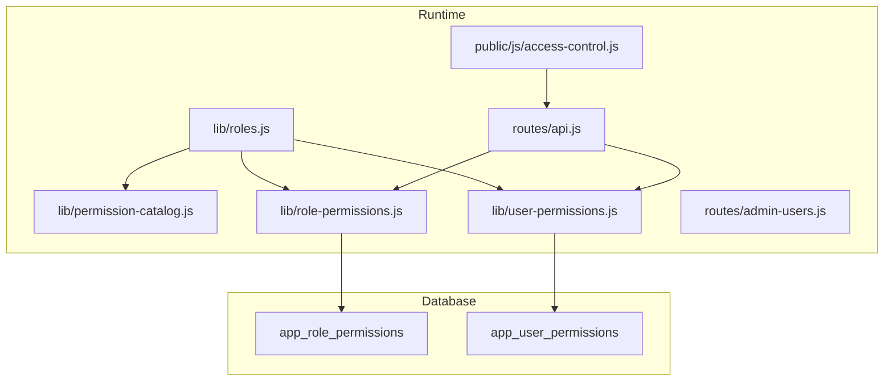
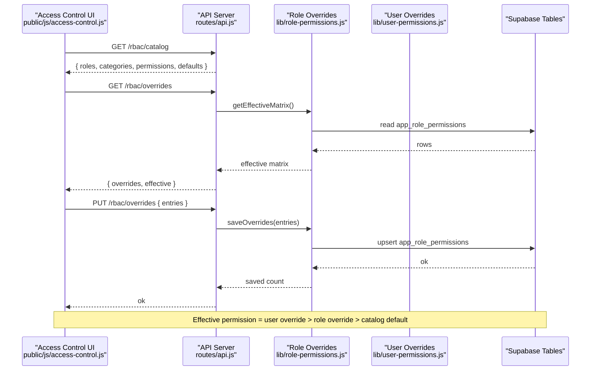
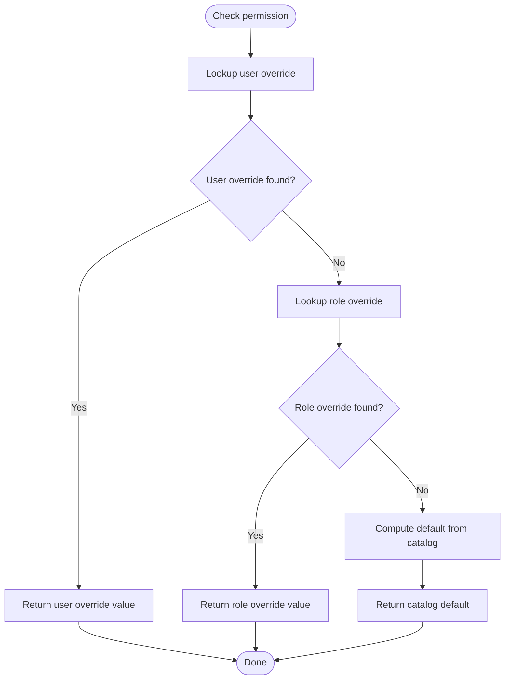
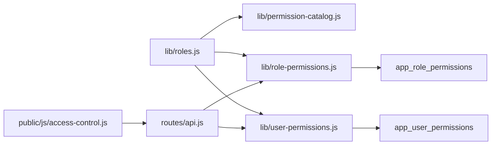

# Role System

<cite>
**Referenced Files in This Document**
- [roles.js](file://lib/roles.js)
- [permission-catalog.js](file://lib/permission-catalog.js)
- [role-permissions.js](file://lib/role-permissions.js)
- [user-permissions.js](file://lib/user-permissions.js)
- [access-control.js](file://public/js/access-control.js)
- [api.js](file://routes/api.js)
- [admin-users.js](file://routes/admin-users.js)
- [20260716_app_role_permissions.sql](file://supabase/migrations/20260716_app_role_permissions.sql)
- [20260717_app_user_permissions.sql](file://supabase/migrations/20260717_app_user_permissions.sql)
- [team-names.js](file://lib/team-names.js)
- [org-hierarchy.js](file://lib/org-hierarchy.js)
</cite>

## Table of Contents
1. [Introduction](#introduction)
2. [Project Structure](#project-structure)
3. [Core Components](#core-components)
4. [Architecture Overview](#architecture-overview)
5. [Detailed Component Analysis](#detailed-component-analysis)
6. [Dependency Analysis](#dependency-analysis)
7. [Performance Considerations](#performance-considerations)
8. [Troubleshooting Guide](#troubleshooting-guide)
9. [Conclusion](#conclusion)
10. [Appendices](#appendices)

## Introduction
This document explains the role-based access control (RBAC) system used across the application. It covers built-in roles and their default permissions, how custom role overrides work, user-level exceptions, and how roles are assigned to users within teams and organizations. It also provides practical examples for defining custom roles, configuring hierarchies, and implementing complex permission scenarios.

## Project Structure
The RBAC system is implemented with a clear separation between:
- Role definitions and helpers
- Permission catalog and defaults
- Database-backed overrides for roles and per-user exceptions
- Admin UI and API endpoints to manage Access Control
- Organization and team structures that influence scope

**Diagram sources**
- [roles.js](file://lib/roles.js)
- [permission-catalog.js](file://lib/permission-catalog.js)
- [role-permissions.js](file://lib/role-permissions.js)
- [user-permissions.js](file://lib/user-permissions.js)
- [access-control.js](file://public/js/access-control.js)
- [api.js](file://routes/api.js)
- [admin-users.js](file://routes/admin-users.js)
- [20260716_app_role_permissions.sql](file://supabase/migrations/20260716_app_role_permissions.sql)
- [20260717_app_user_permissions.sql](file://supabase/migrations/20260717_app_user_permissions.sql)

**Section sources**
- [roles.js](file://lib/roles.js)
- [permission-catalog.js](file://lib/permission-catalog.js)
- [role-permissions.js](file://lib/role-permissions.js)
- [user-permissions.js](file://lib/user-permissions.js)
- [access-control.js](file://public/js/access-control.js)
- [api.js](file://routes/api.js)
- [admin-users.js](file://routes/admin-users.js)
- [20260716_app_role_permissions.sql](file://supabase/migrations/20260716_app_role_permissions.sql)
- [20260717_app_user_permissions.sql](file://supabase/migrations/20260717_app_user_permissions.sql)

## Core Components
- Built-in roles and aliases: The system defines canonical roles and aliases to normalize input into supported roles.
- Permission catalog: A central list of all available permissions with human-readable labels and default values per role.
- Role overrides: Database-backed table to override defaults for any role.
- User exceptions: Per-user overrides that take precedence over role defaults and role overrides.
- Scope resolution: Team and unit context influences data visibility and actions.

Key responsibilities:
- lib/roles.js: Role normalization, helper functions for feature-level checks, and scope calculations.
- lib/permission-catalog.js: Canonical permission keys, categories, and default matrices.
- lib/role-permissions.js: Loads and applies role overrides from the database; computes effective permissions.
- lib/user-permissions.js: Loads and applies per-user overrides from the database.
- public/js/access-control.js: Admin UI to select a role and toggle permissions; persists changes via API.
- routes/api.js: Endpoints to serve catalog, overrides, effective matrix, and to save/reset overrides.
- routes/admin-users.js: Assigns roles to users and manages per-user permission overrides.

**Section sources**
- [roles.js](file://lib/roles.js)
- [permission-catalog.js](file://lib/permission-catalog.js)
- [role-permissions.js](file://lib/role-permissions.js)
- [user-permissions.js](file://lib/user-permissions.js)
- [access-control.js](file://public/js/access-control.js)
- [api.js](file://routes/api.js)
- [admin-users.js](file://routes/admin-users.js)

## Architecture Overview
The permission evaluation pipeline combines three layers:
1) User-level overrides (highest priority)
2) Role-level overrides (overrides defaults)
3) Defaults from the permission catalog

**Diagram sources**
- [access-control.js](file://public/js/access-control.js)
- [api.js](file://routes/api.js)
- [role-permissions.js](file://lib/role-permissions.js)
- [user-permissions.js](file://lib/user-permissions.js)
- [20260716_app_role_permissions.sql](file://supabase/migrations/20260716_app_role_permissions.sql)
- [20260717_app_user_permissions.sql](file://supabase/migrations/20260717_app_user_permissions.sql)

## Detailed Component Analysis

### Built-in Roles and Default Permissions
- Canonical roles include agent, office_assistant, quality, rtm, public_relations, tl, op, finance, it, hr, admin, ceo. Aliases map common names to these canonical forms.
- Default permissions are defined centrally in the permission catalog and mirrored by helper functions in the roles module.
- Example built-in behaviors:
  - App access requires at least agent rank.
  - Payroll viewing defaults to finance and above.
  - Sales submission defaults to agents and certain operational roles.
  - Management operations default to hr/admin/ceo.

Practical guidance:
- To change what a role can do globally, use the Access Control page to set role overrides.
- To grant or deny a specific permission for one person regardless of role, use per-user overrides on the Users page.

**Section sources**
- [roles.js](file://lib/roles.js)
- [permission-catalog.js](file://lib/permission-catalog.js)

### Role Overrides (Custom Role Creation)
- The Access Control UI allows selecting a role and toggling each permission’s effective state.
- Changes are persisted to the role overrides table and cached in memory for performance.
- Resetting a role clears its overrides and reverts to catalog defaults.

How it works:
- Frontend collects pending changes keyed by role and permission key.
- Backend validates against the permission catalog and upserts rows.
- Cache invalidation ensures subsequent checks reflect new overrides.

Example workflow:
- Select “tl” role.
- Toggle “submitSales” to Allow if not already allowed.
- Save changes; verify effective matrix shows override.

**Section sources**
- [access-control.js](file://public/js/access-control.js)
- [api.js](file://routes/api.js)
- [role-permissions.js](file://lib/role-permissions.js)
- [20260716_app_role_permissions.sql](file://supabase/migrations/20260716_app_role_permissions.sql)

### User-Level Exceptions
- Per-user overrides allow granting or denying specific permissions for a particular username.
- These overrides are checked first and short-circuit role and default checks.
- Useful for temporary access or special cases without changing role defaults.

Implementation notes:
- Stored in a dedicated table with primary key on username and permission key.
- Admin UI for Users page supports saving and clearing per-user overrides.

Example scenario:
- Grant “approveLeave” to a non-HR user temporarily.
- Deny “exportSales” for a specific user while keeping role defaults intact.

**Section sources**
- [user-permissions.js](file://lib/user-permissions.js)
- [admin-users.js](file://routes/admin-users.js)
- [20260717_app_user_permissions.sql](file://supabase/migrations/20260717_app_user_permissions.sql)

### Role Assignment to Users Within Teams and Organizations
- Users are assigned a role when created or updated via the Users API.
- Role determines baseline permissions; team/unit context further scopes data visibility.
- Team leadership is derived from organization teams registry and affects which employees a TL can see and act upon.

Assignment flow:
- Create/update user with a role.
- Optionally link user to an employee record to enable team-based scoping.
- Organization teams define unit and team membership; TL assignments determine leadTeams.

Scope rules:
- Some roles have company-wide access (e.g., hr/admin/ceo).
- TLs can access their own team members and self.
- Agents and office assistants are typically scoped to themselves unless they lead a team.

**Section sources**
- [admin-users.js](file://routes/admin-users.js)
- [roles.js](file://lib/roles.js)
- [team-names.js](file://lib/team-names.js)
- [org-hierarchy.js](file://lib/org-hierarchy.js)

### Permission Evaluation Flow
The effective permission decision follows a strict order:
1) Check user-level override for the permission key.
2) If no user override, check role-level override for the role and permission key.
3) If no role override, compute default from the permission catalog.

**Diagram sources**
- [role-permissions.js](file://lib/role-permissions.js)
- [user-permissions.js](file://lib/user-permissions.js)
- [permission-catalog.js](file://lib/permission-catalog.js)

**Section sources**
- [role-permissions.js](file://lib/role-permissions.js)
- [user-permissions.js](file://lib/user-permissions.js)
- [permission-catalog.js](file://lib/permission-catalog.js)

### Practical Examples

#### Define a Custom Role Override
- Use Access Control to select a role (e.g., “quality”).
- Toggle permissions such as “workQualityTicket”, “viewSale”, “editSales”.
- Save changes; verify effective matrix reflects overrides.

#### Configure Role Hierarchies
- While there is no explicit inheritance table, hierarchy is modeled through role ranks and helper logic:
  - Higher ranks imply broader capabilities (e.g., finance and above can view payroll).
  - Management roles (hr/admin/ceo) gain management features by default.
- Adjust defaults only via role overrides if you need deviations from the standard hierarchy.

#### Implement Complex Scenarios
- Temporary exception: Add a per-user override to grant “approveLeave” to a non-HR user for a limited period.
- Scoped visibility: Ensure TLs can only see their team members by linking users to employees and setting org_teams correctly.
- Feature gating: Deny “exportSales” for a specific role using Access Control while allowing other sales-related permissions.

**Section sources**
- [access-control.js](file://public/js/access-control.js)
- [api.js](file://routes/api.js)
- [roles.js](file://lib/roles.js)
- [permission-catalog.js](file://lib/permission-catalog.js)
- [user-permissions.js](file://lib/user-permissions.js)

## Dependency Analysis
The following diagram maps core dependencies among modules and tables:

**Diagram sources**
- [roles.js](file://lib/roles.js)
- [permission-catalog.js](file://lib/permission-catalog.js)
- [role-permissions.js](file://lib/role-permissions.js)
- [user-permissions.js](file://lib/user-permissions.js)
- [access-control.js](file://public/js/access-control.js)
- [api.js](file://routes/api.js)
- [20260716_app_role_permissions.sql](file://supabase/migrations/20260716_app_role_permissions.sql)
- [20260717_app_user_permissions.sql](file://supabase/migrations/20260717_app_user_permissions.sql)

**Section sources**
- [roles.js](file://lib/roles.js)
- [permission-catalog.js](file://lib/permission-catalog.js)
- [role-permissions.js](file://lib/role-permissions.js)
- [user-permissions.js](file://lib/user-permissions.js)
- [access-control.js](file://public/js/access-control.js)
- [api.js](file://routes/api.js)
- [20260716_app_role_permissions.sql](file://supabase/migrations/20260716_app_role_permissions.sql)
- [20260717_app_user_permissions.sql](file://supabase/migrations/20260717_app_user_permissions.sql)

## Performance Considerations
- In-memory caching: Both role and user overrides are cached with TTL to reduce database reads.
- Single-flight loads: Concurrent requests share a single load promise until completion.
- Cache invalidation: After saving overrides, caches are invalidated and reloaded to ensure consistency.

Recommendations:
- Batch updates to role overrides to minimize cache churn.
- Avoid frequent per-user override changes during peak usage.

[No sources needed since this section provides general guidance]

## Troubleshooting Guide
Common issues and resolutions:
- Permission not applied after saving:
  - Verify the Access Control save endpoint returned success and that the effective matrix reflects the change.
  - Check that the role name is normalized correctly (aliases handled automatically).
- Per-user override not taking effect:
  - Confirm the username matches exactly (case-insensitive normalization is applied).
  - Ensure the permission key exists in the catalog.
- Data visibility still too broad:
  - Review team and unit scoping; ensure the user is linked to an employee and org_teams are configured.
  - For TLs, confirm leadTeams are computed based on org_teams.

Operational tips:
- Use the “Reset role to defaults” action to revert accidental changes.
- Inspect the effective matrix to understand whether a permission comes from default, override, or user exception.

**Section sources**
- [access-control.js](file://public/js/access-control.js)
- [api.js](file://routes/api.js)
- [role-permissions.js](file://lib/role-permissions.js)
- [user-permissions.js](file://lib/user-permissions.js)
- [roles.js](file://lib/roles.js)

## Conclusion
The RBAC system combines a robust permission catalog with flexible overrides at both role and user levels. Built-in roles provide sensible defaults, while the Access Control UI enables administrators to tailor permissions precisely. Team and unit scoping further refine data visibility, ensuring users see only what they should. By leveraging role overrides and per-user exceptions judiciously, organizations can implement complex access policies aligned with their operational needs.

[No sources needed since this section summarizes without analyzing specific files]

## Appendices

### Key API Endpoints for RBAC
- GET /rbac/catalog: Returns roles, categories, permissions, and defaults.
- GET /rbac/overrides: Returns current overrides and effective matrix.
- PUT /rbac/overrides: Saves role permission overrides.
- POST /rbac/reset: Resets a role’s overrides to defaults.
- Admin Users endpoints: Create/update users, assign roles, and manage per-user overrides.

**Section sources**
- [api.js](file://routes/api.js)
- [admin-users.js](file://routes/admin-users.js)

### Database Schema Highlights
- app_role_permissions: Stores role-level overrides with timestamps and actor metadata.
- app_user_permissions: Stores per-user overrides with timestamps and actor metadata.

**Section sources**
- [20260716_app_role_permissions.sql](file://supabase/migrations/20260716_app_role_permissions.sql)
- [20260717_app_user_permissions.sql](file://supabase/migrations/20260717_app_user_permissions.sql)