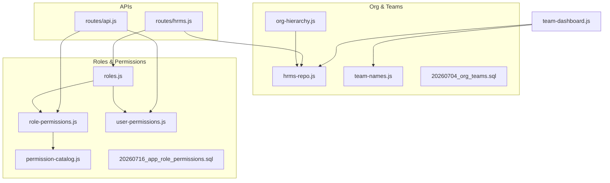
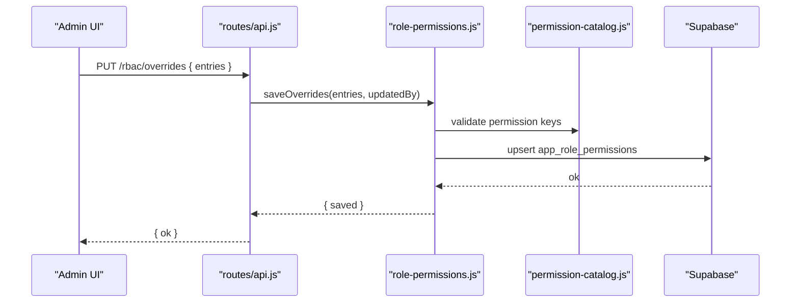
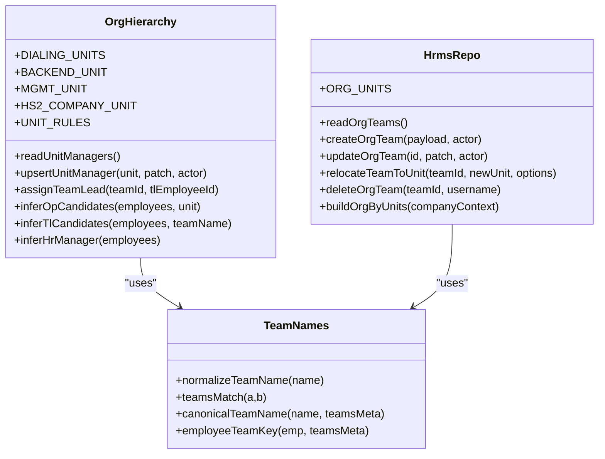
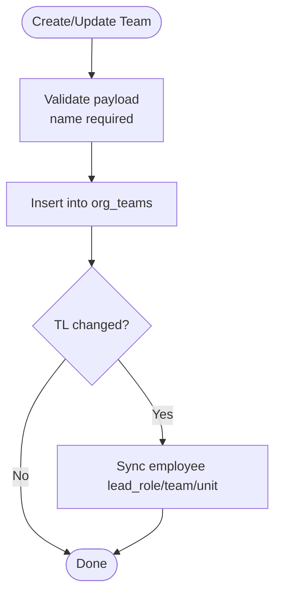
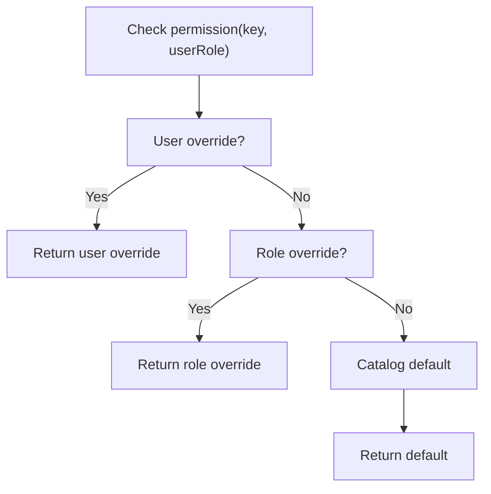
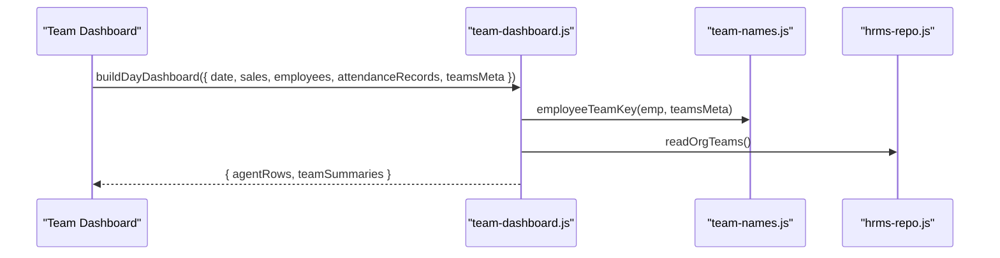
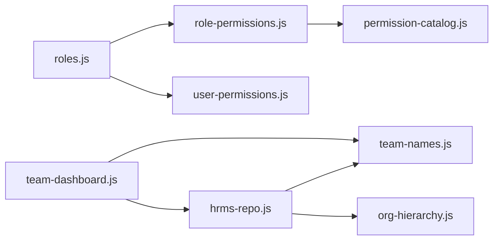

# Team & Role Management

<cite>
**Referenced Files in This Document**
- [org-hierarchy.js](file://lib/org-hierarchy.js)
- [roles.js](file://lib/roles.js)
- [role-permissions.js](file://lib/role-permissions.js)
- [permission-catalog.js](file://lib/permission-catalog.js)
- [team-names.js](file://lib/team-names.js)
- [hrms-repo.js](file://lib/hrms-repo.js)
- [team-dashboard.js](file://lib/team-dashboard.js)
- [user-permissions.js](file://lib/user-permissions.js)
- [20260704_org_teams.sql](file://supabase/migrations/20260704_org_teams.sql)
- [20260716_app_role_permissions.sql](file://supabase/migrations/20260716_app_role_permissions.sql)
- [hrms.js](file://routes/hrms.js)
- [api.js](file://routes/api.js)
</cite>

## Table of Contents
1. [Introduction](#introduction)
2. [Project Structure](#project-structure)
3. [Core Components](#core-components)
4. [Architecture Overview](#architecture-overview)
5. [Detailed Component Analysis](#detailed-component-analysis)
6. [Dependency Analysis](#dependency-analysis)
7. [Performance Considerations](#performance-considerations)
8. [Troubleshooting Guide](#troubleshooting-guide)
9. [Conclusion](#conclusion)
10. [Appendices](#appendices)

## Introduction
This document explains the Team & Role Management system, including:
- Organizational hierarchy definition and team structure configuration
- Role-based access control (RBAC), built-in roles, custom role creation, and permission catalog
- Permission inheritance and team-level overrides
- Practical examples for setting up teams, assigning roles, and configuring permissions

The system is designed to support multi-unit organizations with clear separation between units, teams, and roles, while providing granular, auditable permissions that can be overridden per role or per user.

## Project Structure
Key modules involved in Team & Role Management:
- Organization and teams: org-hierarchy.js, hrms-repo.js, team-names.js, 20260704_org_teams.sql
- Roles and permissions: roles.js, permission-catalog.js, role-permissions.js, user-permissions.js, 20260716_app_role_permissions.sql
- API endpoints: routes/hrms.js, routes/api.js
- Team dashboards: team-dashboard.js

**Diagram sources**
- [org-hierarchy.js:1-124](file://lib/org-hierarchy.js#L1-L124)
- [hrms-repo.js:107-339](file://lib/hrms-repo.js#L107-L339)
- [team-names.js:1-32](file://lib/team-names.js#L1-L32)
- [20260704_org_teams.sql:1-35](file://supabase/migrations/20260704_org_teams.sql#L1-L35)
- [roles.js:1-120](file://lib/roles.js#L1-L120)
- [permission-catalog.js:1-120](file://lib/permission-catalog.js#L1-L120)
- [role-permissions.js:1-159](file://lib/role-permissions.js#L1-L159)
- [user-permissions.js:1-127](file://lib/user-permissions.js#L1-L127)
- [20260716_app_role_permissions.sql:1-26](file://supabase/migrations/20260716_app_role_permissions.sql#L1-L26)
- [hrms.js:42-98](file://routes/hrms.js#L42-L98)
- [api.js:879-904](file://routes/api.js#L879-L904)

**Section sources**
- [org-hierarchy.js:1-124](file://lib/org-hierarchy.js#L1-L124)
- [hrms-repo.js:107-339](file://lib/hrms-repo.js#L107-L339)
- [team-names.js:1-32](file://lib/team-names.js#L1-L32)
- [20260704_org_teams.sql:1-35](file://supabase/migrations/20260704_org_teams.sql#L1-L35)
- [roles.js:1-120](file://lib/roles.js#L1-L120)
- [permission-catalog.js:1-120](file://lib/permission-catalog.js#L1-L120)
- [role-permissions.js:1-159](file://lib/role-permissions.js#L1-L159)
- [user-permissions.js:1-127](file://lib/user-permissions.js#L1-L127)
- [20260716_app_role_permissions.sql:1-26](file://supabase/migrations/20260716_app_role_permissions.sql#L1-L26)
- [hrms.js:42-98](file://routes/hrms.js#L42-L98)
- [api.js:879-904](file://routes/api.js#L879-L904)

## Core Components
- Organization Hierarchy: Units and managers are defined and managed via org-hierarchy.js and Supabase tables.
- Teams Registry: Teams are stored in org_teams with unit assignment, display order, and optional dialing flags.
- Role System: Built-in roles with normalized aliases and rank; role defaults mapped to a permission catalog.
- Permission Overrides: Database-backed overrides for roles and users, cached in memory.
- APIs: REST endpoints to manage teams and RBAC overrides.

**Section sources**
- [org-hierarchy.js:1-124](file://lib/org-hierarchy.js#L1-L124)
- [hrms-repo.js:107-339](file://lib/hrms-repo.js#L107-L339)
- [roles.js:1-120](file://lib/roles.js#L1-L120)
- [permission-catalog.js:1-120](file://lib/permission-catalog.js#L1-L120)
- [role-permissions.js:1-159](file://lib/role-permissions.js#L1-L159)
- [user-permissions.js:1-127](file://lib/user-permissions.js#L1-L127)
- [hrms.js:42-98](file://routes/hrms.js#L42-L98)
- [api.js:879-904](file://routes/api.js#L879-L904)

## Architecture Overview
The system combines a hierarchical organization model with a flexible RBAC engine:
- Units contain teams; teams have metadata (unit, display order, dials sales flag).
- Employees belong to teams and units; team leads are tracked at the team level.
- Roles define default permissions via a catalog; overrides are persisted in app_role_permissions and optionally per-user in app_user_permissions.
- APIs enforce permissions before allowing changes to org structure or RBAC.

**Diagram sources**
- [api.js:879-904](file://routes/api.js#L879-L904)
- [role-permissions.js:95-113](file://lib/role-permissions.js#L95-L113)
- [permission-catalog.js:291-325](file://lib/permission-catalog.js#L291-L325)
- [20260716_app_role_permissions.sql:1-26](file://supabase/migrations/20260716_app_role_permissions.sql#L1-L26)

## Detailed Component Analysis

### Organizational Hierarchy Definition
- Units: HS-1, HS-2, HS-3, HS-Back-End, HS-MGMT. Unit rules define company mapping and reporting lines.
- Unit Managers: OP, HR Manager, Quality Manager assignments per unit.
- Team Leads: Assigned per team; also recorded in team_tls for multiple TLs.

**Diagram sources**
- [org-hierarchy.js:1-124](file://lib/org-hierarchy.js#L1-L124)
- [team-names.js:1-32](file://lib/team-names.js#L1-L32)
- [hrms-repo.js:107-339](file://lib/hrms-repo.js#L107-L339)

**Section sources**
- [org-hierarchy.js:1-124](file://lib/org-hierarchy.js#L1-L124)
- [hrms-repo.js:107-339](file://lib/hrms-repo.js#L107-L339)
- [team-names.js:1-32](file://lib/team-names.js#L1-L32)

### Team Structure Configuration
- Teams registry table includes name, unit, display_order, dials_sales.
- Teams can be created, updated, relocated across units, and deleted. Relocation can reassign employee IDs based on unit ID rules.
- Team metadata integrates with dashboards and filtering logic.

**Diagram sources**
- [hrms-repo.js:144-201](file://lib/hrms-repo.js#L144-L201)
- [20260704_org_teams.sql:1-35](file://supabase/migrations/20260704_org_teams.sql#L1-L35)

**Section sources**
- [hrms-repo.js:144-201](file://lib/hrms-repo.js#L144-L201)
- [20260704_org_teams.sql:1-35](file://supabase/migrations/20260704_org_teams.sql#L1-L35)

### Team Naming Conventions and Display Name Management
- Team names are normalized by stripping leading “Team ” prefix and case-insensitive matching.
- Canonical team names resolve to registered meta when available; otherwise fallback to normalized name.
- Employee team key uses canonical name for consistent matching across roster and org_teams.

Practical implications:
- Use consistent naming like “Tris” or “Team Tris”; both normalize to “Tris”.
- When creating teams, prefer exact names to leverage canonical display.

**Section sources**
- [team-names.js:1-32](file://lib/team-names.js#L1-L32)

### Role Definition System
- Built-in roles include agent, office_assistant, quality, rtm, public_relations, tl, op, finance, it, hr, admin, ceo. Aliases map common titles to canonical roles.
- Role rank defines hierarchy and baseline access thresholds.
- Default permissions per role are defined in the permission catalog.

Built-in roles referenced:
- admin, hr_manager (alias hr), team_lead (alias tl), agent

Custom role creation:
- The system normalizes unknown roles to “none” unless explicitly added to manageable roles and catalog defaults. To create a custom role:
  - Add the role to MANAGEABLE_ROLES and defaultForRole mappings in the permission catalog.
  - Optionally seed defaults and allow overrides via Access Control.

**Section sources**
- [roles.js:1-120](file://lib/roles.js#L1-L120)
- [permission-catalog.js:1-120](file://lib/permission-catalog.js#L1-L120)

### Permission Catalog System
- Centralized list of permission keys with labels, categories, and descriptions.
- Defaults computed from role rank and role membership lists.
- Effective matrix merges defaults with database overrides.

Examples of permission keys and business meanings:
- viewPayroll: Payroll page and data visibility
- manageEmployees: HR-level employee management
- editAttendance: Modify attendance records
- approveSales: Review actions on pending sales
- manageAccessControl: Access Control page — role permission overrides
- viewItRequests: IT requests list and details
- submitMeetingRequest: Create meeting requests

**Section sources**
- [permission-catalog.js:215-325](file://lib/permission-catalog.js#L215-L325)

### Role Inheritance and Permission Resolution
- Permission checks route through a helper that first checks per-user overrides, then role overrides, then catalog defaults.
- Role overrides are loaded into an in-memory cache and applied atomically.
- User overrides take precedence over role overrides.

**Diagram sources**
- [roles.js:69-76](file://lib/roles.js#L69-L76)
- [role-permissions.js:71-78](file://lib/role-permissions.js#L71-L78)
- [user-permissions.js:56-59](file://lib/user-permissions.js#L56-L59)

**Section sources**
- [roles.js:69-76](file://lib/roles.js#L69-L76)
- [role-permissions.js:71-78](file://lib/role-permissions.js#L71-L78)
- [user-permissions.js:56-59](file://lib/user-permissions.js#L56-L59)

### Team-Level Overrides and Scope
- Team-level scope affects data visibility and operations:
  - Team leads can see/edit their team’s employees and related metrics.
  - Team dashboards aggregate sales and attendance by team using team metadata.
- Team membership is matched via normalized team names and canonical team keys.

**Diagram sources**
- [team-dashboard.js:57-96](file://lib/team-dashboard.js#L57-L96)
- [team-names.js:1-32](file://lib/team-names.js#L1-L32)
- [hrms-repo.js:121-142](file://lib/hrms-repo.js#L121-L142)

**Section sources**
- [team-dashboard.js:57-96](file://lib/team-dashboard.js#L57-L96)
- [team-names.js:1-32](file://lib/team-names.js#L1-L32)
- [hrms-repo.js:121-142](file://lib/hrms-repo.js#L121-L142)

### API Endpoints for Team & Role Management
- Teams CRUD and relocation:
  - GET /hrms/teams: List teams and org units (requires viewOrgFull or manageOrgStructure)
  - POST /hrms/teams: Create team (manageOrgStructure)
  - PATCH /hrms/teams/:id: Update team (manageOrgStructure)
  - POST /hrms/teams/:id/relocate: Move team to unit (manageOrgStructure)
  - DELETE /hrms/teams/:id: Delete team (manageOrgStructure)
- RBAC overrides:
  - PUT /rbac/overrides: Save role permission overrides (manageAccessControl)
  - POST /rbac/reset: Reset role overrides (manageAccessControl)

**Section sources**
- [hrms.js:42-98](file://routes/hrms.js#L42-L98)
- [api.js:879-904](file://routes/api.js#L879-L904)

## Dependency Analysis
- roles.js depends on role-permissions.js and user-permissions.js to resolve effective permissions.
- role-permissions.js depends on permission-catalog.js for defaults and validation.
- hrms-repo.js depends on team-names.js for consistent team matching and on org-hierarchy.js for unit rules.
- team-dashboard.js depends on team-names.js and hrms-repo.js for team aggregation.

**Diagram sources**
- [roles.js:1-120](file://lib/roles.js#L1-L120)
- [role-permissions.js:1-159](file://lib/role-permissions.js#L1-L159)
- [permission-catalog.js:1-120](file://lib/permission-catalog.js#L1-L120)
- [hrms-repo.js:107-339](file://lib/hrms-repo.js#L107-L339)
- [team-names.js:1-32](file://lib/team-names.js#L1-L32)
- [team-dashboard.js:57-96](file://lib/team-dashboard.js#L57-L96)

**Section sources**
- [roles.js:1-120](file://lib/roles.js#L1-L120)
- [role-permissions.js:1-159](file://lib/role-permissions.js#L1-L159)
- [permission-catalog.js:1-120](file://lib/permission-catalog.js#L1-L120)
- [hrms-repo.js:107-339](file://lib/hrms-repo.js#L107-L339)
- [team-names.js:1-32](file://lib/team-names.js#L1-L32)
- [team-dashboard.js:57-96](file://lib/team-dashboard.js#L57-L96)

## Performance Considerations
- Role and user permission caches reduce repeated DB reads; TTL is set to avoid frequent reloads.
- Invalidate caches after saving overrides to ensure consistency.
- Team listing and dashboard building use in-memory maps for efficient lookups.

[No sources needed since this section provides general guidance]

## Troubleshooting Guide
Common issues and resolutions:
- Missing Supabase backend: Functions require DATA_BACKEND=supabase; ensure environment is configured.
- Permission not taking effect: Check if a user or role override exists; verify cache invalidation after updates.
- Team not appearing in dashboard: Ensure team name matches canonical name and team has TL or agents; check dials_sales flag.
- Relocation errors: Confirm new unit has valid ID rules; verify employee eligibility for ID reassignment.

**Section sources**
- [org-hierarchy.js:29-31](file://lib/org-hierarchy.js#L29-L31)
- [role-permissions.js:56-59](file://lib/role-permissions.js#L56-L59)
- [team-dashboard.js:259-264](file://lib/team-dashboard.js#L259-L264)
- [hrms-repo.js:206-257](file://lib/hrms-repo.js#L206-L257)

## Conclusion
The Team & Role Management system provides a robust framework for defining organizational hierarchies, managing teams, and enforcing fine-grained permissions. With normalized team naming, database-backed overrides, and comprehensive APIs, administrators can configure structures and access controls tailored to complex operational needs.

[No sources needed since this section summarizes without analyzing specific files]

## Appendices

### Practical Examples

- Setting up team structures:
  - Create teams under appropriate units with display order and dials_sales flags.
  - Assign team leads; update employee records automatically.
  - Relocate teams across units; optionally reassign employee IDs according to unit rules.

- Assigning roles to users:
  - Normalize role names using aliases; ensure roles exist in the manageable set.
  - Apply role defaults via the permission catalog; adjust with overrides if needed.

- Configuring permission matrices:
  - Use Access Control endpoints to save role overrides.
  - For exceptional cases, apply per-user overrides.
  - Verify effective permissions by checking the effective matrix endpoint.

**Section sources**
- [hrms.js:42-98](file://routes/hrms.js#L42-L98)
- [api.js:879-904](file://routes/api.js#L879-L904)
- [permission-catalog.js:291-325](file://lib/permission-catalog.js#L291-L325)
- [role-permissions.js:129-145](file://lib/role-permissions.js#L129-L145)