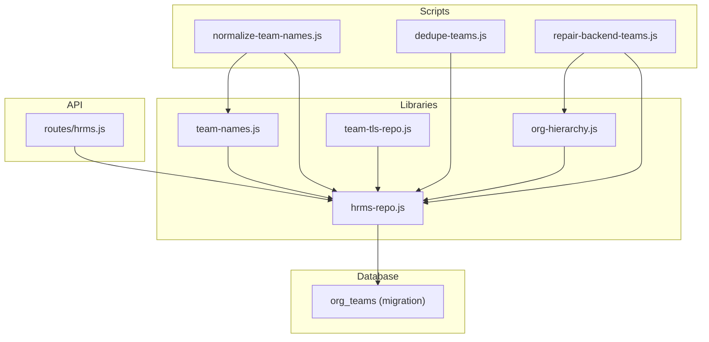
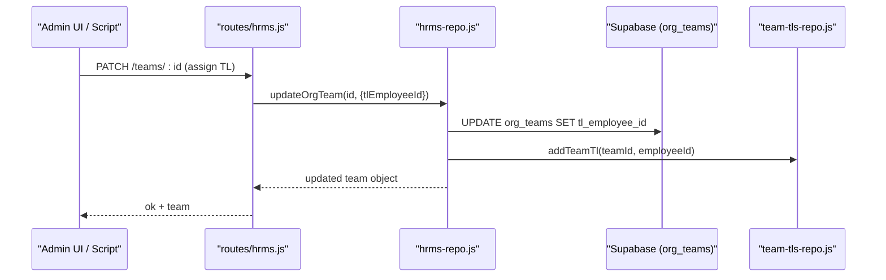
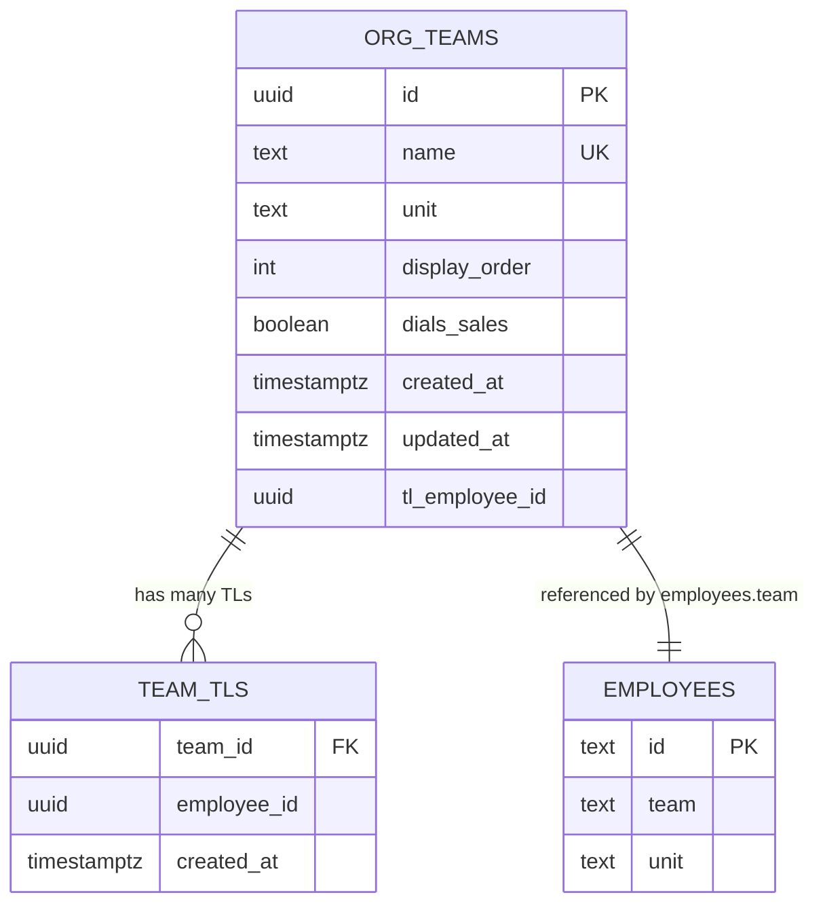
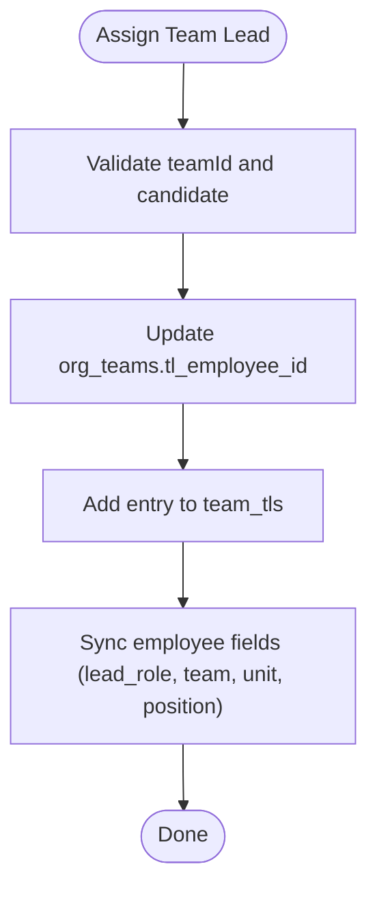
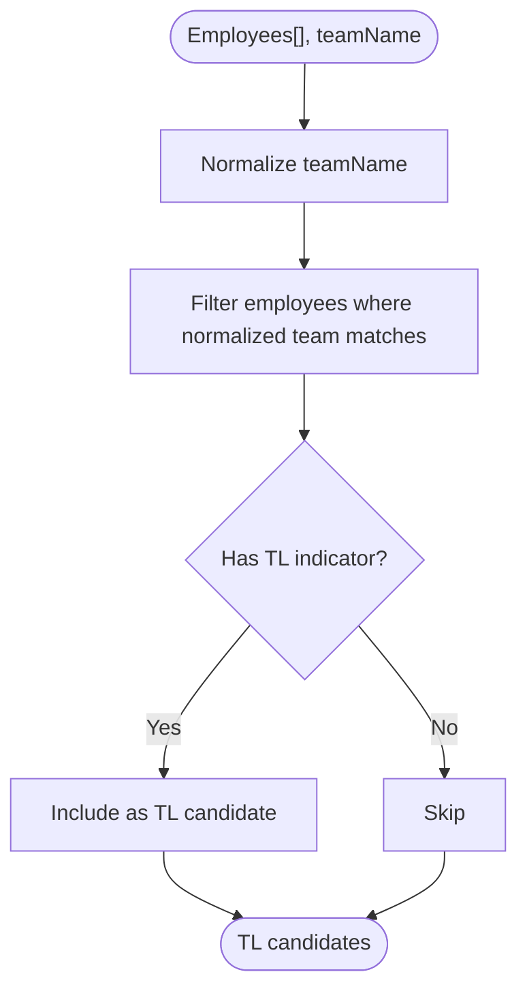
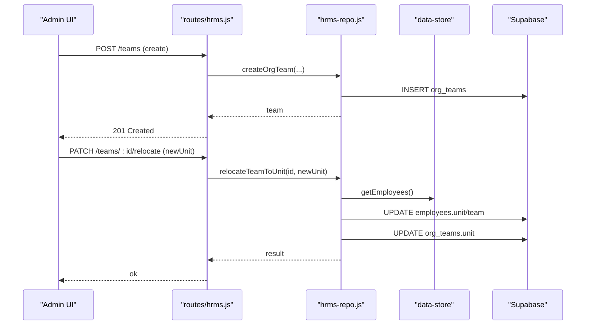
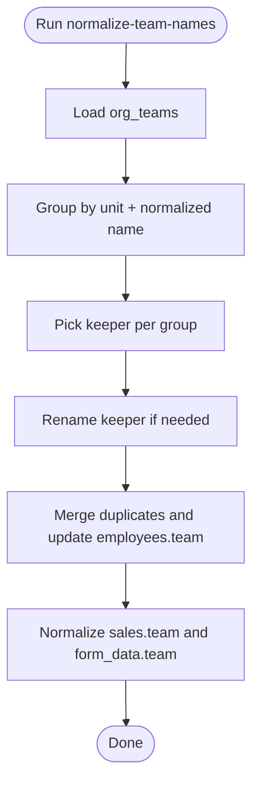
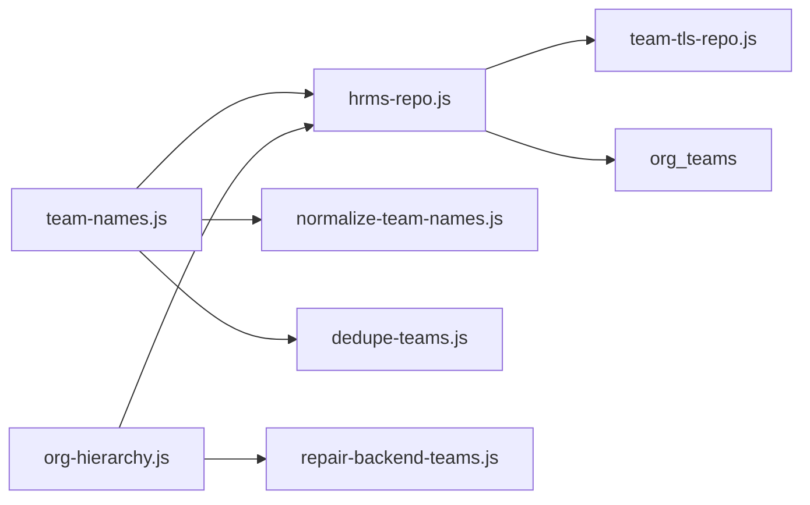

# Team Management

<cite>
**Referenced Files in This Document**
- [lib/team-names.js](file://lib/team-names.js)
- [lib/org-hierarchy.js](file://lib/org-hierarchy.js)
- [lib/hrms-repo.js](file://lib/hrms-repo.js)
- [lib/team-tls-repo.js](file://lib/team-tls-repo.js)
- [supabase/migrations/20260704_org_teams.sql](file://supabase/migrations/20260704_org_teams.sql)
- [scripts/normalize-team-names.js](file://scripts/normalize-team-names.js)
- [scripts/dedupe-teams.js](file://scripts/dedupe-teams.js)
- [scripts/repair-backend-teams.js](file://scripts/repair-backend-teams.js)
- [routes/hrms.js](file://routes/hrms.js)
</cite>

## Table of Contents
1. [Introduction](#introduction)
2. [Project Structure](#project-structure)
3. [Core Components](#core-components)
4. [Architecture Overview](#architecture-overview)
5. [Detailed Component Analysis](#detailed-component-analysis)
6. [Dependency Analysis](#dependency-analysis)
7. [Performance Considerations](#performance-considerations)
8. [Troubleshooting Guide](#troubleshooting-guide)
9. [Conclusion](#conclusion)

## Introduction
This document explains how teams are named, normalized, and organized across the system. It covers:
- Team naming conventions and normalization rules
- The BACKEND_TEAMS set for identifying backend support teams
- How teams relate to organizational units and how properties propagate
- Team lead assignment workflows and inference logic for qualified candidates
- Examples of creating teams, managing memberships, and handling name variations across data sources

The goal is to provide a clear, code-sourced reference for developers and administrators working with team management features.

## Project Structure
Team-related functionality spans libraries, scripts, routes, and database migrations:
- Naming normalization utilities
- Organization hierarchy and unit rules
- Repository layer for reading/writing teams and leads
- Database schema for org_teams and related tables
- Scripts for normalization, deduplication, and repair
- API routes for creating/updating/relocating/deleting teams

**Diagram sources**
- [lib/team-names.js:1-31](file://lib/team-names.js#L1-L31)
- [lib/org-hierarchy.js:1-124](file://lib/org-hierarchy.js#L1-L124)
- [lib/hrms-repo.js:100-299](file://lib/hrms-repo.js#L100-L299)
- [lib/team-tls-repo.js:1-100](file://lib/team-tls-repo.js#L1-L100)
- [supabase/migrations/20260704_org_teams.sql:1-35](file://supabase/migrations/20260704_org_teams.sql#L1-L35)
- [scripts/normalize-team-names.js:1-96](file://scripts/normalize-team-names.js#L1-L96)
- [scripts/dedupe-teams.js:1-69](file://scripts/dedupe-teams.js#L1-L69)
- [scripts/repair-backend-teams.js:1-76](file://scripts/repair-backend-teams.js#L1-L76)
- [routes/hrms.js:61-98](file://routes/hrms.js#L61-L98)

**Section sources**
- [lib/team-names.js:1-31](file://lib/team-names.js#L1-L31)
- [lib/org-hierarchy.js:1-124](file://lib/org-hierarchy.js#L1-L124)
- [lib/hrms-repo.js:100-299](file://lib/hrms-repo.js#L100-L299)
- [lib/team-tls-repo.js:1-100](file://lib/team-tls-repo.js#L1-L100)
- [supabase/migrations/20260704_org_teams.sql:1-35](file://supabase/migrations/20260704_org_teams.sql#L1-L35)
- [scripts/normalize-team-names.js:1-96](file://scripts/normalize-team-names.js#L1-L96)
- [scripts/dedupe-teams.js:1-69](file://scripts/dedupe-teams.js#L1-L69)
- [scripts/repair-backend-teams.js:1-76](file://scripts/repair-backend-teams.js#L1-L76)
- [routes/hrms.js:61-98](file://routes/hrms.js#L61-L98)

## Core Components
- Team name normalization and matching utilities
- Organization hierarchy constants and helpers
- Team repository operations (read, create, update, relocate, delete)
- Team lead records and unit operator records
- Database schema for teams and relationships
- Maintenance scripts for normalization and repair

Key responsibilities:
- Normalize team names consistently across sources
- Identify backend support teams via a constant set
- Maintain team-to-unit mapping and optional dialing flags
- Assign and track team leads and multiple TLs per team
- Provide APIs and scripts to manage teams and memberships

**Section sources**
- [lib/team-names.js:1-31](file://lib/team-names.js#L1-L31)
- [lib/org-hierarchy.js:1-124](file://lib/org-hierarchy.js#L1-L124)
- [lib/hrms-repo.js:100-299](file://lib/hrms-repo.js#L100-L299)
- [lib/team-tls-repo.js:1-100](file://lib/team-tls-repo.js#L1-L100)
- [supabase/migrations/20260704_org_teams.sql:1-35](file://supabase/migrations/20260704_org_teams.sql#L1-L35)

## Architecture Overview
The team management architecture centers on a canonical team registry (org_teams), employee assignments (employees.team), and lead records (team_tls). Normalization ensures that different input formats resolve to consistent keys. Backend teams are identified by a constant set and may be relocated into a dedicated unit.

**Diagram sources**
- [routes/hrms.js:61-98](file://routes/hrms.js#L61-L98)
- [lib/hrms-repo.js:159-201](file://lib/hrms-repo.js#L159-L201)
- [lib/team-tls-repo.js:35-49](file://lib/team-tls-repo.js#L35-L49)
- [supabase/migrations/20260704_org_teams.sql:1-35](file://supabase/migrations/20260704_org_teams.sql#L1-L35)

## Detailed Component Analysis

### Team Name Normalization and Matching
- normalizeTeamName removes leading “Team ” prefix and trims whitespace.
- teamsMatch compares normalized names case-insensitively.
- canonicalTeamName resolves an incoming name to the canonical org_teams.name when available; otherwise returns the normalized form.
- employeeTeamKey builds a stable key for employees using canonical or normalized names.

These functions ensure that roster imports, sales records, and org_teams can be matched reliably even if inputs vary.

**Section sources**
- [lib/team-names.js:1-31](file://lib/team-names.js#L1-L31)

### Organizational Units and Backend Teams
- Units include dialing units and back-end/management units.
- UNIT_RULES defines company context and operational flags per unit.
- BACKEND_TEAMS is a Set used to identify backend support teams.
- Unit managers and operators are managed separately from teams but influence visibility and permissions.

Backend teams are expected to reside under the back-end unit and typically do not dial sales.

**Section sources**
- [lib/org-hierarchy.js:1-124](file://lib/org-hierarchy.js#L1-L124)

### Team Data Model and Relationships
- org_teams stores canonical team metadata: id, name, unit, display_order, dials_sales, timestamps.
- Employees reference their team via employees.team.
- team_tls tracks multiple team leads per team; org_teams.tl_employee_id holds the primary lead.
- readOrgTeams merges primary lead and additional TLs into a single view.

**Diagram sources**
- [supabase/migrations/20260704_org_teams.sql:1-35](file://supabase/migrations/20260704_org_teams.sql#L1-L35)
- [lib/hrms-repo.js:121-142](file://lib/hrms-repo.js#L121-L142)
- [lib/team-tls-repo.js:12-33](file://lib/team-tls-repo.js#L12-L33)

**Section sources**
- [supabase/migrations/20260704_org_teams.sql:1-35](file://supabase/migrations/20260704_org_teams.sql#L1-L35)
- [lib/hrms-repo.js:100-142](file://lib/hrms-repo.js#L100-L142)
- [lib/team-tls-repo.js:1-100](file://lib/team-tls-repo.js#L1-L100)

### Team Lead Assignment Workflows
- assignTeamLead updates the primary team lead on org_teams.
- updateOrgTeam supports setting tlEmployeeId and maintains team_tls history:
  - Adds the new TL to team_tls
  - Removes previous TL from team_tls if changed
  - Updates employee record fields (lead_role, team, unit, position)
- inferTlCandidates filters employees who belong to the target team and have TL indicators (ID prefix or role).

**Diagram sources**
- [lib/org-hierarchy.js:64-74](file://lib/org-hierarchy.js#L64-L74)
- [lib/hrms-repo.js:159-201](file://lib/hrms-repo.js#L159-L201)
- [lib/team-tls-repo.js:35-49](file://lib/team-tls-repo.js#L35-L49)

**Section sources**
- [lib/org-hierarchy.js:64-74](file://lib/org-hierarchy.js#L64-L74)
- [lib/hrms-repo.js:159-201](file://lib/hrms-repo.js#L159-L201)
- [lib/team-tls-repo.js:35-49](file://lib/team-tls-repo.js#L35-L49)

### Inference Logic for Qualified Team Lead Candidates
- inferTlCandidates uses normalized team names to filter employees whose team matches and who qualify as TLs based on ID prefix or role.
- inferOpCandidates identifies potential unit operators by unit and OP indicators.
- inferHrManager locates HR manager candidates by name and role heuristics.

**Diagram sources**
- [lib/org-hierarchy.js:84-91](file://lib/org-hierarchy.js#L84-L91)
- [lib/team-names.js:1-31](file://lib/team-names.js#L1-L31)

**Section sources**
- [lib/org-hierarchy.js:76-101](file://lib/org-hierarchy.js#L76-L101)
- [lib/team-names.js:1-31](file://lib/team-names.js#L1-L31)

### Team Membership Management
- Creating a team: createOrgTeam inserts a row into org_teams with name, unit, dials_sales, display_order.
- Updating a team: updateOrgTeam allows changing name, unit, dials_sales, display_order, and tlEmployeeId.
- Relocating a team: relocateTeamToUnit moves a team to a new unit and optionally reassigns employee IDs according to unit rules; it also updates all affected employees’ unit and team fields.
- Deleting a team: deleteOrgTeam clears employees.team for all members and deletes the team row.

**Diagram sources**
- [routes/hrms.js:61-98](file://routes/hrms.js#L61-L98)
- [lib/hrms-repo.js:144-257](file://lib/hrms-repo.js#L144-L257)

**Section sources**
- [routes/hrms.js:61-98](file://routes/hrms.js#L61-L98)
- [lib/hrms-repo.js:144-257](file://lib/hrms-repo.js#L144-L257)

### Handling Team Name Variations Across Data Sources
- normalizeTeamNames script:
  - Groups org_teams by unit and normalized name
  - Picks a keeper (prefers already-normalized names and those with unit)
  - Renames keeper if needed, merges duplicates, updates employees.team and sales.form_data.team
- dedupeTeams script:
  - Merges case-insensitive duplicate teams and updates employees.team
- repairBackendTeams script:
  - Ensures backend teams exist under the back-end unit and sets dials_sales=false
  - Uses BACKEND_TEAMS and normalizeTeamName to reconcile names

**Diagram sources**
- [scripts/normalize-team-names.js:1-96](file://scripts/normalize-team-names.js#L1-L96)
- [scripts/dedupe-teams.js:1-69](file://scripts/dedupe-teams.js#L1-L69)
- [scripts/repair-backend-teams.js:1-76](file://scripts/repair-backend-teams.js#L1-L76)
- [lib/team-names.js:1-31](file://lib/team-names.js#L1-L31)

**Section sources**
- [scripts/normalize-team-names.js:1-96](file://scripts/normalize-team-names.js#L1-L96)
- [scripts/dedupe-teams.js:1-69](file://scripts/dedupe-teams.js#L1-L69)
- [scripts/repair-backend-teams.js:1-76](file://scripts/repair-backend-teams.js#L1-L76)
- [lib/team-names.js:1-31](file://lib/team-names.js#L1-L31)

### Relationship Between Teams and Organizational Units
- Each team belongs to a unit (org_teams.unit).
- When relocating a team, employees on that team are updated to the new unit and, if applicable, reassigned IDs following unit rules.
- Backend and management units are special: teams there typically do not dial sales.

Inheritance behavior:
- Teams do not inherit properties from parent units directly; instead, they carry explicit unit membership and flags (e.g., dials_sales).
- Visibility and permissions often derive from unit membership and team lead associations.

**Section sources**
- [lib/hrms-repo.js:206-257](file://lib/hrms-repo.js#L206-L257)
- [lib/org-hierarchy.js:1-124](file://lib/org-hierarchy.js#L1-L124)

## Dependency Analysis
- team-names.js provides normalization and matching used by hrms-repo and scripts.
- org-hierarchy.js exposes BACKEND_TEAMS and inference helpers used by scripts and other modules.
- hrms-repo.js orchestrates team CRUD and relocation, integrating with team-tls-repo.js for lead history.
- Scripts depend on both libraries and Supabase client to perform maintenance tasks.

**Diagram sources**
- [lib/team-names.js:1-31](file://lib/team-names.js#L1-L31)
- [lib/org-hierarchy.js:1-124](file://lib/org-hierarchy.js#L1-L124)
- [lib/hrms-repo.js:100-299](file://lib/hrms-repo.js#L100-L299)
- [lib/team-tls-repo.js:1-100](file://lib/team-tls-repo.js#L1-L100)
- [scripts/normalize-team-names.js:1-96](file://scripts/normalize-team-names.js#L1-L96)
- [scripts/dedupe-teams.js:1-69](file://scripts/dedupe-teams.js#L1-L69)
- [scripts/repair-backend-teams.js:1-76](file://scripts/repair-backend-teams.js#L1-L76)

**Section sources**
- [lib/team-names.js:1-31](file://lib/team-names.js#L1-L31)
- [lib/org-hierarchy.js:1-124](file://lib/org-hierarchy.js#L1-L124)
- [lib/hrms-repo.js:100-299](file://lib/hrms-repo.js#L100-L299)
- [lib/team-tls-repo.js:1-100](file://lib/team-tls-repo.js#L1-L100)
- [scripts/normalize-team-names.js:1-96](file://scripts/normalize-team-names.js#L1-L96)
- [scripts/dedupe-teams.js:1-69](file://scripts/dedupe-teams.js#L1-L69)
- [scripts/repair-backend-teams.js:1-76](file://scripts/repair-backend-teams.js#L1-L76)

## Performance Considerations
- Use normalized names for comparisons to avoid repeated string processing in hot paths.
- Batch updates where possible (e.g., bulk employee updates during team relocation).
- Prefer canonical team names from org_teams to reduce ambiguity and improve cache efficiency.
- Avoid unnecessary reads by caching org_teams and team_tls mappings at runtime.

[No sources needed since this section provides general guidance]

## Troubleshooting Guide
Common issues and resolutions:
- Duplicate or inconsistent team names: run normalize-team-names.js [--dry-run] first to preview changes, then execute without dry-run.
- Case-only duplicates: use dedupe-teams.js to merge them and update employees.team.
- Backend teams misassigned: run repair-backend-teams.js [--dry-run] to verify intended actions, then apply.
- Team lead not reflected: ensure team_tls has entries and org_teams.tl_employee_id is set; check updateOrgTeam logs.

Operational tips:
- Always validate team existence before assigning leads.
- After relocation, confirm employees.team and unit fields were updated.
- For import scenarios, rely on teamsMatch and canonicalTeamName to map varied inputs to canonical names.

**Section sources**
- [scripts/normalize-team-names.js:1-96](file://scripts/normalize-team-names.js#L1-L96)
- [scripts/dedupe-teams.js:1-69](file://scripts/dedupe-teams.js#L1-L69)
- [scripts/repair-backend-teams.js:1-76](file://scripts/repair-backend-teams.js#L1-L76)
- [lib/hrms-repo.js:159-201](file://lib/hrms-repo.js#L159-L201)

## Conclusion
Team management relies on robust normalization, clear unit relationships, and maintainable lead assignment workflows. By standardizing team names, leveraging BACKEND_TEAMS, and using repository operations and scripts, teams can be created, updated, relocated, and cleaned up consistently across the platform.

[No sources needed since this section summarizes without analyzing specific files]