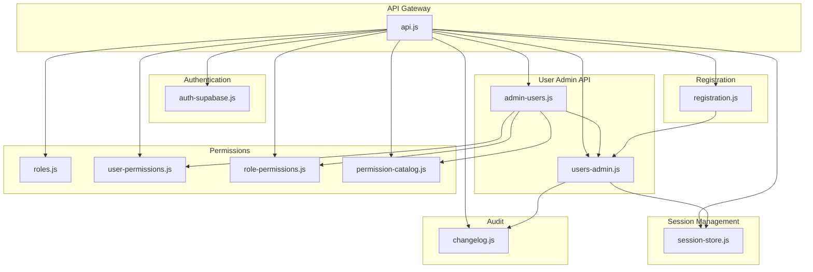
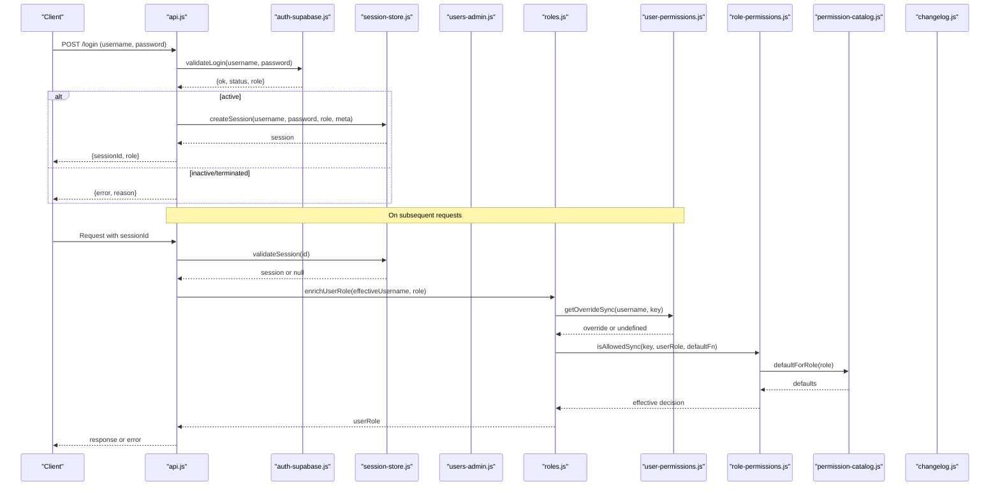
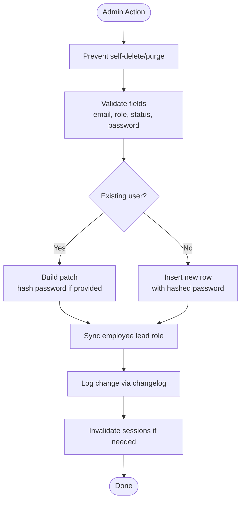
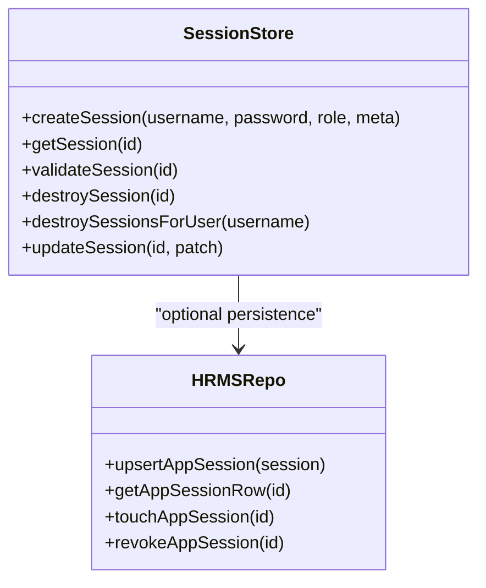
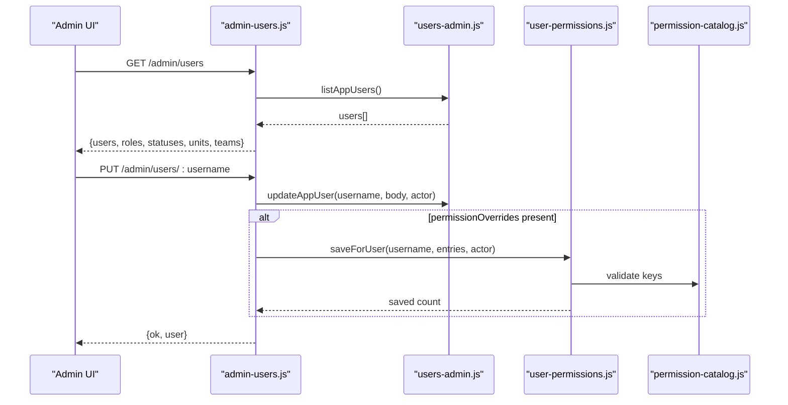
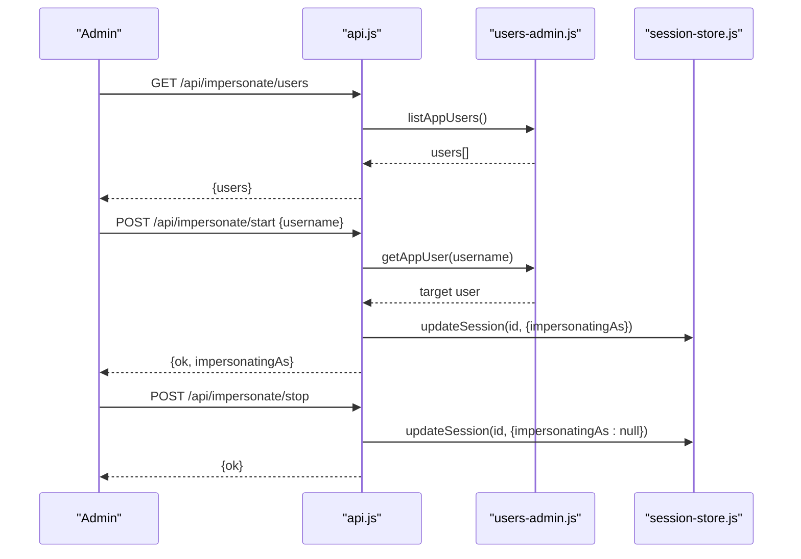
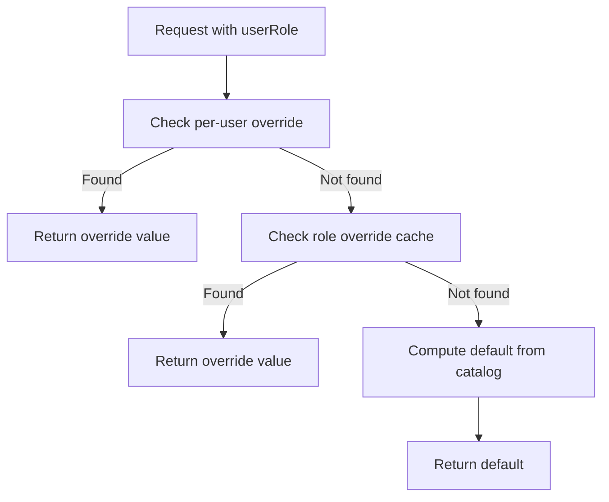
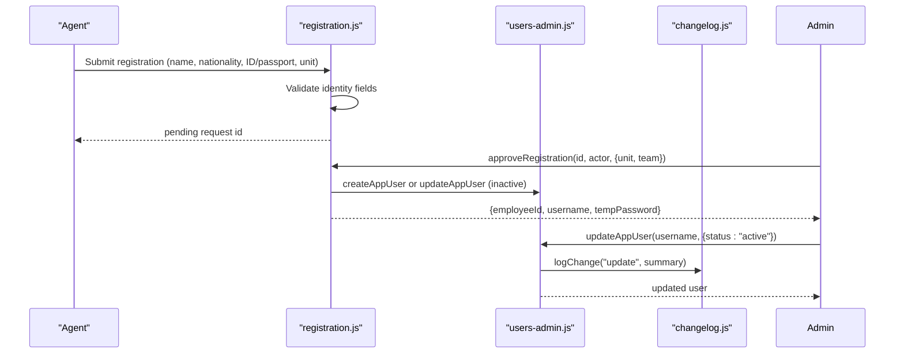
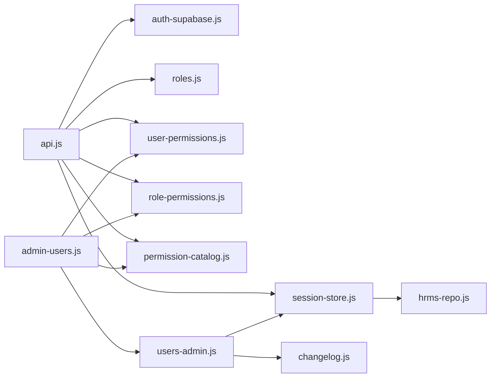

# User Administration

<cite>
**Referenced Files in This Document**
- [lib/users-admin.js](file://lib/users-admin.js)
- [lib/session-store.js](file://lib/session-store.js)
- [lib/auth-supabase.js](file://lib/auth-supabase.js)
- [routes/admin-users.js](file://routes/admin-users.js)
- [routes/auth-routes.js](file://routes/auth-routes.js)
- [routes/api.js](file://routes/api.js)
- [lib/roles.js](file://lib/roles.js)
- [lib/user-permissions.js](file://lib/user-permissions.js)
- [lib/role-permissions.js](file://lib/role-permissions.js)
- [lib/permission-catalog.js](file://lib/permission-catalog.js)
- [lib/changelog.js](file://lib/changelog.js)
- [lib/registration.js](file://lib/registration.js)
</cite>

## Table of Contents
1. Introduction
2. Project Structure
3. Core Components
4. Architecture Overview
5. Detailed Component Analysis
6. Dependency Analysis
7. Performance Considerations
8. Troubleshooting Guide
9. Conclusion
10. Appendices

## Introduction
This document explains the User Administration subsystem, covering user lifecycle management (registration, profile updates, status control), session handling and persistence, administrative capabilities (including impersonation), permission resolution at runtime, audit trails, and security best practices. It is designed for both technical and non-technical readers to understand how users are created, authenticated, authorized, and audited across the application.

## Project Structure
The user administration functionality spans several modules:
- Authentication and login validation
- Session creation, validation, and revocation
- Administrative APIs for user CRUD and permissions
- Role-based and per-user permission evaluation
- Audit logging for compliance
- Self-registration workflow with approval and activation

**Diagram sources**
- [routes/api.js:90-145](file://routes/api.js#L90-L145)
- [lib/auth-supabase.js:1-73](file://lib/auth-supabase.js#L1-L73)
- [lib/session-store.js:1-83](file://lib/session-store.js#L1-L83)
- [lib/users-admin.js:1-488](file://lib/users-admin.js#L1-L488)
- [routes/admin-users.js:1-157](file://routes/admin-users.js#L1-L157)
- [lib/roles.js:1-800](file://lib/roles.js#L1-L800)
- [lib/user-permissions.js:1-127](file://lib/user-permissions.js#L1-L127)
- [lib/role-permissions.js:1-159](file://lib/role-permissions.js#L1-L159)
- [lib/permission-catalog.js:1-325](file://lib/permission-catalog.js#L1-L325)
- [lib/changelog.js:1-157](file://lib/changelog.js#L1-L157)
- [lib/registration.js:1-313](file://lib/registration.js#L1-L313)

**Section sources**
- [routes/api.js:90-145](file://routes/api.js#L90-L145)
- [routes/admin-users.js:1-157](file://routes/admin-users.js#L1-L157)
- [lib/users-admin.js:1-488](file://lib/users-admin.js#L1-L488)
- [lib/session-store.js:1-83](file://lib/session-store.js#L1-L83)
- [lib/auth-supabase.js:1-73](file://lib/auth-supabase.js#L1-L73)
- [lib/roles.js:1-800](file://lib/roles.js#L1-L800)
- [lib/user-permissions.js:1-127](file://lib/user-permissions.js#L1-L127)
- [lib/role-permissions.js:1-159](file://lib/role-permissions.js#L1-L159)
- [lib/permission-catalog.js:1-325](file://lib/permission-catalog.js#L1-L325)
- [lib/changelog.js:1-157](file://lib/changelog.js#L1-L157)
- [lib/registration.js:1-313](file://lib/registration.js#L1-L313)

## Core Components
- Authentication provider: validates credentials against stored hashes and enforces account status.
- Session store: in-memory sessions with optional Supabase persistence, idle timeout, and revocation.
- User admin module: creates, updates, deletes, purges app users; manages roles, statuses, IT flag; syncs employee logins; logs changes.
- Admin routes: protected endpoints for listing users, updating profiles, managing permissions, purging accounts.
- Permission system: role defaults, DB-backed role overrides, per-user overrides, catalog-driven defaults.
- Impersonation: privileged admins can act as other users for troubleshooting.
- Registration: self-registration with daily PIN, approval, and inactive account creation.
- Audit trail: change_log entries for user operations and related entities.

**Section sources**
- [lib/auth-supabase.js:1-73](file://lib/auth-supabase.js#L1-L73)
- [lib/session-store.js:1-83](file://lib/session-store.js#L1-L83)
- [lib/users-admin.js:1-488](file://lib/users-admin.js#L1-L488)
- [routes/admin-users.js:1-157](file://routes/admin-users.js#L1-L157)
- [lib/roles.js:1-800](file://lib/roles.js#L1-L800)
- [lib/user-permissions.js:1-127](file://lib/user-permissions.js#L1-L127)
- [lib/role-permissions.js:1-159](file://lib/role-permissions.js#L1-L159)
- [lib/permission-catalog.js:1-325](file://lib/permission-catalog.js#L1-L325)
- [lib/changelog.js:1-157](file://lib/changelog.js#L1-L157)
- [lib/registration.js:1-313](file://lib/registration.js#L1-L313)

## Architecture Overview
The authentication and authorization flow integrates multiple layers:
- Login validates credentials and checks account status.
- Sessions are created and validated with optional persistence and idle timeouts.
- Authorization uses a layered approach: per-user overrides, role overrides, then catalog defaults.
- Administrative actions are guarded by explicit checks and logged to an audit table.
- Impersonation allows privileged users to temporarily assume another identity within a valid session.

**Diagram sources**
- [routes/api.js:90-145](file://routes/api.js#L90-L145)
- [lib/auth-supabase.js:24-65](file://lib/auth-supabase.js#L24-L65)
- [lib/session-store.js:8-52](file://lib/session-store.js#L8-L52)
- [lib/roles.js:69-128](file://lib/roles.js#L69-L128)
- [lib/user-permissions.js:56-79](file://lib/user-permissions.js#L56-L79)
- [lib/role-permissions.js:71-83](file://lib/role-permissions.js#L71-L83)
- [lib/permission-catalog.js:121-213](file://lib/permission-catalog.js#L121-L213)

## Detailed Component Analysis

### User Lifecycle Management
- Create user: validates username, password length, email format, role, and status; persists hashed password; logs change; syncs employee lead role if applicable.
- Update user: supports password reset, role/status/email/IT flag updates; enforces activation restrictions; invalidates sessions on sensitive changes; logs changes.
- Delete user: prevents self-deletion; logs deletion.
- Purge user: releases linked employee IDs, clears per-user permissions, destroys sessions, logs purge.
- Upsert employee login: auto-creates inactive logins for employees without one; infers role from employee ID prefix.
- Touch last login: updates last_login_at timestamp.

**Diagram sources**
- [lib/users-admin.js:224-337](file://lib/users-admin.js#L224-L337)
- [lib/users-admin.js:339-364](file://lib/users-admin.js#L339-L364)
- [lib/users-admin.js:379-453](file://lib/users-admin.js#L379-L453)
- [lib/users-admin.js:163-209](file://lib/users-admin.js#L163-L209)
- [lib/users-admin.js:211-222](file://lib/users-admin.js#L211-L222)
- [lib/changelog.js:3-22](file://lib/changelog.js#L3-L22)

**Section sources**
- [lib/users-admin.js:224-337](file://lib/users-admin.js#L224-L337)
- [lib/users-admin.js:339-364](file://lib/users-admin.js#L339-L364)
- [lib/users-admin.js:379-453](file://lib/users-admin.js#L379-L453)
- [lib/users-admin.js:163-209](file://lib/users-admin.js#L163-L209)
- [lib/users-admin.js:211-222](file://lib/users-admin.js#L211-L222)
- [lib/changelog.js:3-22](file://lib/changelog.js#L3-L22)

### Session Handling and Persistence
- Creation: generates a random session ID, stores metadata (device label, IP), persists to Supabase when enabled.
- Validation: checks in-memory map, verifies Supabase record, enforces idle timeout, touches last seen.
- Destruction: removes from memory and marks revoked in Supabase.
- Per-user destruction: used when passwords change or status becomes non-active.

**Diagram sources**
- [lib/session-store.js:1-83](file://lib/session-store.js#L1-L83)
- [lib/hrms-repo.js:1-200](file://lib/hrms-repo.js#L1-L200)

**Section sources**
- [lib/session-store.js:1-83](file://lib/session-store.js#L1-L83)
- [routes/auth-routes.js:36-59](file://routes/auth-routes.js#L36-L59)

### Administrative Capabilities
- Protected endpoints require system administrator privileges and Supabase backend.
- List users with enriched employee info and exception access flags.
- Update user profile and permission overrides in one request.
- Manage per-user permission overrides (list, save, clear).
- Purge user and release associated employee IDs.

**Diagram sources**
- [routes/admin-users.js:1-157](file://routes/admin-users.js#L1-L157)
- [lib/users-admin.js:261-337](file://lib/users-admin.js#L261-L337)
- [lib/user-permissions.js:81-107](file://lib/user-permissions.js#L81-L107)
- [lib/permission-catalog.js:295-325](file://lib/permission-catalog.js#L295-L325)

**Section sources**
- [routes/admin-users.js:1-157](file://routes/admin-users.js#L1-L157)
- [lib/users-admin.js:261-337](file://lib/users-admin.js#L261-L337)
- [lib/user-permissions.js:81-107](file://lib/user-permissions.js#L81-L107)
- [lib/permission-catalog.js:295-325](file://lib/permission-catalog.js#L295-L325)

### Impersonation Workflow
- Only designated administrators can start/stop impersonation.
- Starting impersonation records target username in the current session.
- Subsequent requests use the impersonated identity for authorization while preserving real user context.
- Stopping impersonation clears the flag.

**Diagram sources**
- [routes/api.js:906-960](file://routes/api.js#L906-L960)
- [lib/users-admin.js:101-106](file://lib/users-admin.js#L101-L106)
- [lib/session-store.js:74-80](file://lib/session-store.js#L74-L80)

**Section sources**
- [routes/api.js:906-960](file://routes/api.js#L906-L960)
- [lib/users-admin.js:101-106](file://lib/users-admin.js#L101-L106)
- [lib/session-store.js:74-80](file://lib/session-store.js#L74-L80)

### Permission Resolution at Runtime
- Layered evaluation order:
  1) Per-user overrides (app_user_permissions)
  2) Role overrides (app_role_permissions)
  3) Catalog defaults (defaultForRole)
- The roles module centralizes permission checks and delegates to the appropriate layer.
- Catalog provides human-readable labels and categories for all permissions.

**Diagram sources**
- [lib/roles.js:69-76](file://lib/roles.js#L69-L76)
- [lib/user-permissions.js:56-79](file://lib/user-permissions.js#L56-L79)
- [lib/role-permissions.js:71-83](file://lib/role-permissions.js#L71-L83)
- [lib/permission-catalog.js:121-213](file://lib/permission-catalog.js#L121-L213)

**Section sources**
- [lib/roles.js:69-76](file://lib/roles.js#L69-L76)
- [lib/user-permissions.js:56-79](file://lib/user-permissions.js#L56-L79)
- [lib/role-permissions.js:71-83](file://lib/role-permissions.js#L71-L83)
- [lib/permission-catalog.js:121-213](file://lib/permission-catalog.js#L121-L213)

### Registration and Activation
- Daily PIN generation and verification for self-registration.
- Approval workflow creates employee record and inactive app user with temporary password.
- Activation restricted to designated owners; changing status to active triggers session invalidation.

**Diagram sources**
- [lib/registration.js:99-136](file://lib/registration.js#L99-L136)
- [lib/registration.js:216-283](file://lib/registration.js#L216-L283)
- [lib/users-admin.js:224-259](file://lib/users-admin.js#L224-L259)
- [lib/users-admin.js:261-337](file://lib/users-admin.js#L261-L337)
- [lib/changelog.js:3-22](file://lib/changelog.js#L3-L22)

**Section sources**
- [lib/registration.js:99-136](file://lib/registration.js#L99-L136)
- [lib/registration.js:216-283](file://lib/registration.js#L216-L283)
- [lib/users-admin.js:224-259](file://lib/users-admin.js#L224-L259)
- [lib/users-admin.js:261-337](file://lib/users-admin.js#L261-L337)
- [lib/changelog.js:3-22](file://lib/changelog.js#L3-L22)

## Dependency Analysis
Key relationships:
- api.js orchestrates authentication, session validation, and authorization using roles, user-permissions, role-permissions, and permission-catalog.
- admin-users.js depends on users-admin.js for data operations and user-permissions.js for overrides.
- users-admin.js integrates changelog.js for audit trails and session-store.js for session invalidation.
- auth-supabase.js provides credential validation and status checks.
- session-store.js optionally persists to hrms-repo.js tables.

**Diagram sources**
- [routes/api.js:90-145](file://routes/api.js#L90-L145)
- [routes/admin-users.js:1-157](file://routes/admin-users.js#L1-L157)
- [lib/users-admin.js:1-488](file://lib/users-admin.js#L1-L488)
- [lib/session-store.js:1-83](file://lib/session-store.js#L1-L83)
- [lib/auth-supabase.js:1-73](file://lib/auth-supabase.js#L1-L73)
- [lib/roles.js:1-800](file://lib/roles.js#L1-L800)
- [lib/user-permissions.js:1-127](file://lib/user-permissions.js#L1-L127)
- [lib/role-permissions.js:1-159](file://lib/role-permissions.js#L1-L159)
- [lib/permission-catalog.js:1-325](file://lib/permission-catalog.js#L1-L325)
- [lib/changelog.js:1-157](file://lib/changelog.js#L1-L157)
- [lib/hrms-repo.js:1-200](file://lib/hrms-repo.js#L1-L200)

**Section sources**
- [routes/api.js:90-145](file://routes/api.js#L90-L145)
- [routes/admin-users.js:1-157](file://routes/admin-users.js#L1-L157)
- [lib/users-admin.js:1-488](file://lib/users-admin.js#L1-L488)
- [lib/session-store.js:1-83](file://lib/session-store.js#L1-L83)
- [lib/auth-supabase.js:1-73](file://lib/auth-supabase.js#L1-L73)
- [lib/roles.js:1-800](file://lib/roles.js#L1-L800)
- [lib/user-permissions.js:1-127](file://lib/user-permissions.js#L1-L127)
- [lib/role-permissions.js:1-159](file://lib/role-permissions.js#L1-L159)
- [lib/permission-catalog.js:1-325](file://lib/permission-catalog.js#L1-L325)
- [lib/changelog.js:1-157](file://lib/changelog.js#L1-L157)
- [lib/hrms-repo.js:1-200](file://lib/hrms-repo.js#L1-L200)

## Performance Considerations
- Permission caches: Both role and user permission caches reduce database reads; TTL is set to avoid frequent reloads.
- Session validation: In-memory Map lookup is O(1); Supabase calls are optional and only performed when enabled.
- Batch operations: Admin endpoints return aggregated data (e.g., users with employee details) to minimize round trips.
- Idle timeout: Enforced at 10 hours to limit long-lived sessions and reduce stale state.

[No sources needed since this section provides general guidance]

## Troubleshooting Guide
Common issues and resolutions:
- Login fails due to inactive/terminated status: Verify account status and ensure activation is allowed by designated owners.
- Session expired or revoked: Re-authenticate; check for admin revocation or idle timeout.
- Permission denied despite role: Inspect per-user overrides and role overrides; confirm catalog defaults.
- Cannot activate user: Only designated owners may activate employee logins.
- Password change not applied: Ensure current password matches; note that changing password invalidates existing sessions.

**Section sources**
- [lib/auth-supabase.js:24-65](file://lib/auth-supabase.js#L24-L65)
- [lib/session-store.js:30-52](file://lib/session-store.js#L30-L52)
- [lib/users-admin.js:261-337](file://lib/users-admin.js#L261-L337)
- [lib/user-permissions.js:56-79](file://lib/user-permissions.js#L56-L79)
- [lib/role-permissions.js:71-83](file://lib/role-permissions.js#L71-L83)
- [lib/permission-catalog.js:121-213](file://lib/permission-catalog.js#L121-L213)

## Conclusion
The User Administration subsystem provides a robust, auditable, and secure foundation for managing users, sessions, and permissions. Its layered authorization model ensures flexibility through per-user and role overrides while maintaining strong defaults. Impersonation enables safe troubleshooting, and comprehensive audit trails support compliance requirements. Following the recommended best practices will help maintain security and operational reliability.

[No sources needed since this section summarizes without analyzing specific files]

## Appendices

### Example Workflows
- Create a new user:
  - Call admin endpoint to create user with username, password, role, status, and optional email.
  - System hashes password, persists user, logs change, and returns sanitized user object.
- Update user profile and permissions:
  - Send PATCH with fields to update; include permissionOverrides array if modifying exceptions.
  - System validates inputs, updates user, persists overrides, invalidates sessions if necessary, and logs changes.
- Impersonate a user:
  - Admin lists available users, starts impersonation for a target, performs troubleshooting, then stops impersonation.
- Change password:
  - Provide current and new password; system verifies current password, updates hash, and refreshes session password.

**Section sources**
- [routes/admin-users.js:69-89](file://routes/admin-users.js#L69-L89)
- [lib/users-admin.js:224-337](file://lib/users-admin.js#L224-L337)
- [routes/api.js:906-960](file://routes/api.js#L906-L960)
- [routes/auth-routes.js:11-34](file://routes/auth-routes.js#L11-L34)

### Security Considerations
- Passwords are always hashed before storage; minimum length enforced.
- Account status controls prevent usage of inactive or terminated accounts.
- Activation of employee logins is restricted to designated owners.
- Session revocation occurs on password changes and status deactivation.
- Impersonation is limited to privileged users and requires explicit start/stop actions.
- All administrative changes are recorded in the audit trail.

**Section sources**
- [lib/users-admin.js:224-337](file://lib/users-admin.js#L224-L337)
- [lib/auth-supabase.js:24-65](file://lib/auth-supabase.js#L24-L65)
- [lib/session-store.js:61-72](file://lib/session-store.js#L61-L72)
- [routes/api.js:906-960](file://routes/api.js#L906-L960)
- [lib/changelog.js:3-22](file://lib/changelog.js#L3-L22)