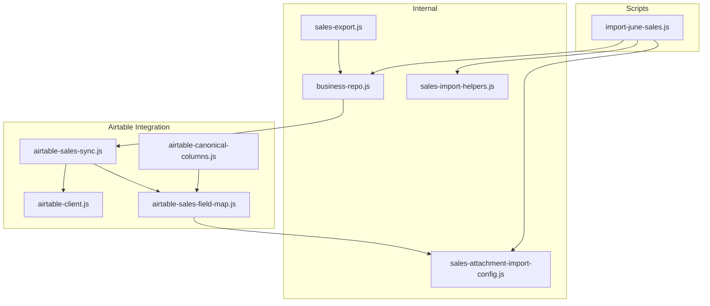
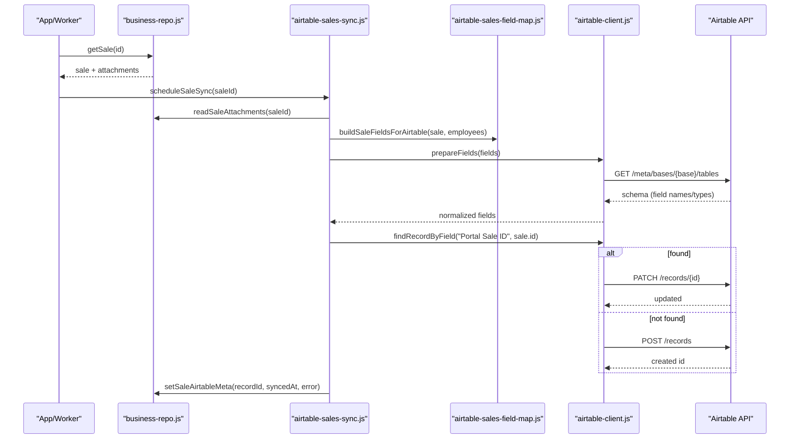
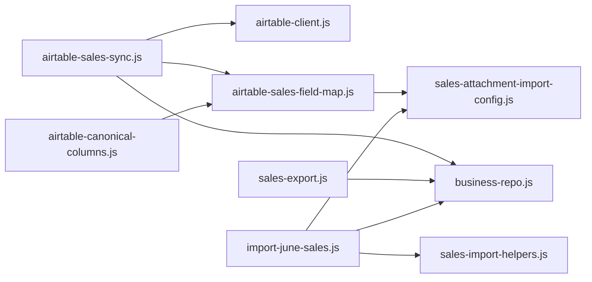

# External Integrations & Data Sync

<cite>
**Referenced Files in This Document**
- [airtable-client.js](file://lib/airtable-client.js)
- [airtable-sales-sync.js](file://lib/airtable-sales-sync.js)
- [airtable-sales-field-map.js](file://lib/airtable-sales-field-map.js)
- [business-repo.js](file://lib/business-repo.js)
- [sales-export.js](file://lib/sales-export.js)
- [sales-import-helpers.js](file://lib/sales-import-helpers.js)
- [sales-attachment-import-config.js](file://lib/sales-attachment-import-config.js)
- [airtable-canonical-columns.js](file://lib/airtable-canonical-columns.js)
- [import-june-sales.js](file://scripts/import-june-sales.js)
</cite>

## Table of Contents
1. [Introduction](#introduction)
2. [Project Structure](#project-structure)
3. [Core Components](#core-components)
4. [Architecture Overview](#architecture-overview)
5. [Detailed Component Analysis](#detailed-component-analysis)
6. [Dependency Analysis](#dependency-analysis)
7. [Performance Considerations](#performance-considerations)
8. [Troubleshooting Guide](#troubleshooting-guide)
9. [Conclusion](#conclusion)
10. [Appendices](#appendices)

## Introduction
This document explains the external integrations and data synchronization for sales data, focusing on:
- Outbound sync to Airtable (field mapping, conflict resolution, error handling)
- CSV import/export for bulk operations (including a reference June sales import script)
- Data transformation pipelines and validation rules during sync
- Rollback mechanisms and failure modes
- Setup examples, configuration options, and troubleshooting guidance

The system uses Supabase as the source of truth for sales records and synchronizes them to an Airtable table named “Sales All Data.” It also supports exporting sales to CSV/XLSX/PDF and importing legacy CSVs into Supabase.

## Project Structure
Key modules involved in external integrations and data sync:
- Airtable client and schema normalization
- Sales-to-Airtable sync orchestrator
- Field mapping between app form_data and Airtable columns
- Business repository for reading/writing sales and attachments
- Export utilities for reporting
- Import helpers and attachment column mapping
- Canonical Airtable column definitions
- Reference import script for June sales

**Diagram sources**
- [airtable-client.js](file://lib/airtable-client.js)
- [airtable-sales-sync.js](file://lib/airtable-sales-sync.js)
- [airtable-sales-field-map.js](file://lib/airtable-sales-field-map.js)
- [business-repo.js](file://lib/business-repo.js)
- [sales-export.js](file://lib/sales-export.js)
- [sales-import-helpers.js](file://lib/sales-import-helpers.js)
- [sales-attachment-import-config.js](file://lib/sales-attachment-import-config.js)
- [airtable-canonical-columns.js](file://lib/airtable-canonical-columns.js)
- [import-june-sales.js](file://scripts/import-june-sales.js)

**Section sources**
- [airtable-client.js](file://lib/airtable-client.js)
- [airtable-sales-sync.js](file://lib/airtable-sales-sync.js)
- [airtable-sales-field-map.js](file://lib/airtable-sales-field-map.js)
- [business-repo.js](file://lib/business-repo.js)
- [sales-export.js](file://lib/sales-export.js)
- [sales-import-helpers.js](file://lib/sales-import-helpers.js)
- [sales-attachment-import-config.js](file://lib/sales-attachment-import-config.js)
- [airtable-canonical-columns.js](file://lib/airtable-canonical-columns.js)
- [import-june-sales.js](file://scripts/import-june-sales.js)

## Core Components
- Airtable REST client: HTTP wrapper, schema caching, field normalization, record CRUD, batch delete, and safe select/multiple-select matching.
- Sales-to-Airtable sync: Debounced upsert flow, attachment URL generation, duplicate row cleanup, and metadata persistence.
- Field mapping: Canonical mappings from app fields to Airtable columns, with overrides and formatting for dates, teams, units, devices, and prices.
- Business repo: Reads/writes sales, stores Airtable sync metadata, and provides employee lookups.
- Export utilities: CSV, XLSX, and PDF export with consistent column set.
- Import helpers: Name normalization, device/unit/status mapping, closer/agent resolution, and date parsing.
- Attachment import config: Maps CSV headers to attachment kinds and parses Airtable-style attachment cells.
- Canonical columns: Template-driven Airtable column order and types for provisioning.
- June sales import script: End-to-end example of CSV ingestion, employee creation/updating, deduplication, and chunked inserts.

**Section sources**
- [airtable-client.js](file://lib/airtable-client.js)
- [airtable-sales-sync.js](file://lib/airtable-sales-sync.js)
- [airtable-sales-field-map.js](file://lib/airtable-sales-field-map.js)
- [business-repo.js](file://lib/business-repo.js)
- [sales-export.js](file://lib/sales-export.js)
- [sales-import-helpers.js](file://lib/sales-import-helpers.js)
- [sales-attachment-import-config.js](file://lib/sales-attachment-import-config.js)
- [airtable-canonical-columns.js](file://lib/airtable-canonical-columns.js)
- [import-june-sales.js](file://scripts/import-june-sales.js)

## Architecture Overview
End-to-end outbound sync flow from Supabase sales to Airtable:

**Diagram sources**
- [airtable-sales-sync.js](file://lib/airtable-sales-sync.js)
- [airtable-client.js](file://lib/airtable-client.js)
- [airtable-sales-field-map.js](file://lib/airtable-sales-field-map.js)
- [business-repo.js](file://lib/business-repo.js)

## Detailed Component Analysis

### Airtable Client
Responsibilities:
- Authentication via environment variables and base/table selection
- Schema discovery and caching for field names, types, and choices
- Safe normalization of values to match Airtable field types (numbers, selects, attachments, collaborator exclusion)
- Record operations: create, update, delete, list, and batch delete
- Formula-safe search by field value with pagination

Key behaviors:
- Select choice matching tolerates casing and minor prefixes (e.g., team/team, HS variants)
- Number parsing strips non-numeric characters and validates safety
- Attachments normalized to {url, filename} arrays; collaborators excluded
- Errors include HTTP status and parsed response payload

Configuration:
- AIRTABLE_API_KEY or AIRTABLE_PAT
- AIRTABLE_BASE_ID
- AIRTABLE_TABLE_NAME (default “Sales All Data”)
- AIRTABLE_SYNC_ENABLED (false disables sync)

Error handling:
- Non-OK responses throw with status and response body
- JSON parse fallback returns raw text for diagnostics

**Section sources**
- [airtable-client.js](file://lib/airtable-client.js)

### Sales-to-Airtable Sync Orchestrator
Responsibilities:
- Debounced scheduling to avoid thundering herds
- In-flight guard to prevent concurrent duplicates
- Build Airtable fields using mapping module
- Resolve existing Airtable record by “Portal Sale ID” and clean duplicates
- Upsert logic with 404 retry and fallback create
- Persist sync metadata (recordId, syncedAt, last error) back to sales row

Conflict resolution:
- If multiple rows share the same Portal Sale ID, keep the stored one if present, otherwise pick the first and delete the rest
- On 404 during update, re-resolve by Portal Sale ID and retry update or create

Error handling:
- Fail-open: errors are logged and recorded on the sale row; DB writes are never blocked by sync failures

Environment:
- AIRTABLE_SYNC_DEBOUNCE_MS controls delay before syncing

**Section sources**
- [airtable-sales-sync.js](file://lib/airtable-sales-sync.js)
- [business-repo.js](file://lib/business-repo.js)

### Field Mapping (Form → Airtable)
Responsibilities:
- Canonical mapping from app form_data keys to Airtable column labels
- Overrides for specific Airtable column names
- Formatting for dates, times, teams, units, devices, and price tiers
- Employee name resolution for reviewer/assigner fields
- Attachment kind-to-column mapping derived from import config

Highlights:
- Date/time normalization to ISO strings accepted by Airtable
- Team normalization (“Team X”, “HSx” variants)
- Unit normalization (“HS-1” ↔ “HS1”)
- Device normalization (“smartwatch”, “bracelet”, “necklace”)
- Price tier label construction when missing

Attachment handling:
- Skips configured kinds
- Generates signed URLs for Supabase-hosted attachments
- Falls back to Dropbox links when available

**Section sources**
- [airtable-sales-field-map.js](file://lib/airtable-sales-field-map.js)
- [sales-attachment-import-config.js](file://lib/sales-attachment-import-config.js)

### Business Repository (Sales and Metadata)
Responsibilities:
- Read/write sales records
- Store Airtable sync metadata per sale (recordId, syncedAt, error)
- Provide employee lookup for name resolution
- Enforce feature flags and handle missing tables gracefully

Integration points:
- Used by sync to load sale and attachments
- Used by export to enrich rows with employee names

**Section sources**
- [business-repo.js](file://lib/business-repo.js)

### Export Utilities
Responsibilities:
- Transform sales to standardized rows
- Generate CSV, XLSX, and PDF exports
- Consistent column set across formats

Customization:
- Column definitions can be extended by modifying the export column catalog
- PDF title/subtitle customization supported

**Section sources**
- [sales-export.js](file://lib/sales-export.js)

### Import Helpers and Attachment Config
Responsibilities:
- Normalize names and map statuses/devices/units
- Resolve closers and agents via aliases and quality maps
- Parse submission/billing dates
- Map CSV headers to attachment kinds and parse Airtable-style attachment cells

Usage:
- Shared by import scripts and canonical column provisioning

**Section sources**
- [sales-import-helpers.js](file://lib/sales-import-helpers.js)
- [sales-attachment-import-config.js](file://lib/sales-attachment-import-config.js)
- [airtable-canonical-columns.js](file://lib/airtable-canonical-columns.js)

### June Sales Import Script (Reference Implementation)
Purpose:
- Demonstrate end-to-end CSV ingestion into Supabase
- Create/update employees as needed
- Deduplicate by phone_number + submission_date
- Chunked inserts for performance

Key steps:
- Parse CSV header and rows
- Load employees and build index
- Map device, unit, status, dates
- Resolve agent/closer with overrides and fuzzy matching
- Optionally create new employees and update teams based on votes
- Insert sales in chunks while skipping duplicates

Dry-run support:
- --dry-run flag prevents database writes

**Section sources**
- [import-june-sales.js](file://scripts/import-june-sales.js)
- [sales-import-helpers.js](file://lib/sales-import-helpers.js)

## Dependency Analysis
High-level dependencies among integration components:

**Diagram sources**
- [airtable-sales-sync.js](file://lib/airtable-sales-sync.js)
- [airtable-client.js](file://lib/airtable-client.js)
- [airtable-sales-field-map.js](file://lib/airtable-sales-field-map.js)
- [sales-attachment-import-config.js](file://lib/sales-attachment-import-config.js)
- [business-repo.js](file://lib/business-repo.js)
- [sales-export.js](file://lib/sales-export.js)
- [import-june-sales.js](file://scripts/import-june-sales.js)
- [sales-import-helpers.js](file://lib/sales-import-helpers.js)
- [airtable-canonical-columns.js](file://lib/airtable-canonical-columns.js)

**Section sources**
- [airtable-sales-sync.js](file://lib/airtable-sales-sync.js)
- [airtable-client.js](file://lib/airtable-client.js)
- [airtable-sales-field-map.js](file://lib/airtable-sales-field-map.js)
- [sales-attachment-import-config.js](file://lib/sales-attachment-import-config.js)
- [business-repo.js](file://lib/business-repo.js)
- [sales-export.js](file://lib/sales-export.js)
- [import-june-sales.js](file://scripts/import-june-sales.js)
- [sales-import-helpers.js](file://lib/sales-import-helpers.js)
- [airtable-canonical-columns.js](file://lib/airtable-canonical-columns.js)

## Performance Considerations
- Debounce: Use AIRTABLE_SYNC_DEBOUNCE_MS to coalesce rapid updates and reduce API calls.
- In-flight guard: Prevents concurrent syncs for the same sale.
- Schema cache: Airtable schema is cached for 10 minutes to minimize meta requests.
- Batch deletes: Airtable deletions are chunked to 10 IDs per request.
- Chunked inserts: Import script batches sales inserts (e.g., 50 per call).
- Attachment URL generation: Parallelized per attachment kind to speed up field building.

[No sources needed since this section provides general guidance]

## Troubleshooting Guide
Common issues and resolutions:
- Sync disabled: Ensure AIRTABLE_SYNC_ENABLED is not set to false and that AIRTABLE_API_KEY/AIRTABLE_BASE_ID are configured.
- Field mismatch: Verify AIRTABLE_TABLE_NAME matches the target table and that column names align with the canonical template.
- Duplicate rows: The sync cleans duplicates by “Portal Sale ID”; check for stale entries and allow the next sync to remove extras.
- Attachment failures: Signed URL generation may fail for certain storage paths; logs will warn about individual attachments.
- Error persistence: Last sync error is stored on the sale row; inspect airtable_sync_error to diagnose.
- Missing table: Some functions handle missing tables gracefully; ensure migrations have been applied.

Operational tips:
- Force schema refresh: Clear the internal schema cache by calling the provided function to reload Airtable field definitions.
- Dry-run imports: Use --dry-run on the June import script to preview changes without writing to the database.
- Review logs: Console warnings/errors capture detailed messages for failed network calls and transformations.

**Section sources**
- [airtable-client.js](file://lib/airtable-client.js)
- [airtable-sales-sync.js](file://lib/airtable-sales-sync.js)
- [business-repo.js](file://lib/business-repo.js)
- [import-june-sales.js](file://scripts/import-june-sales.js)

## Conclusion
The integration layer provides a robust, fail-open pipeline to synchronize sales data to Airtable with strong field normalization, conflict resolution, and error tracking. Bulk operations are supported through well-tested import/export utilities, including a reference script for historical data migration. Configuration is centralized via environment variables, and performance is optimized through debouncing, caching, and batching.

[No sources needed since this section summarizes without analyzing specific files]

## Appendices

### Setup Examples
- Configure Airtable:
  - Set AIRTABLE_API_KEY or AIRTABLE_PAT
  - Set AIRTABLE_BASE_ID
  - Set AIRTABLE_TABLE_NAME (default “Sales All Data”)
  - Optionally set AIRTABLE_SYNC_ENABLED=false to disable sync
  - Optionally set AIRTABLE_SYNC_DEBOUNCE_MS to control debounce timing
  - Optionally set AIRTABLE_PORTAL_SALE_ID_FIELD to customize the unique identifier column used for matching
  - Optionally set AIRTABLE_SKIP_ATTACHMENT_KINDS to exclude attachment kinds

- Provision Airtable columns:
  - Use canonical column definitions to ensure correct field types and ordering
  - Template columns come from the canonical CSV; portal-only columns are appended

- Run June import:
  - Execute the import script with optional --dry-run to validate transformations
  - Review console output for new employees, team updates, and inserted sales

**Section sources**
- [airtable-client.js](file://lib/airtable-client.js)
- [airtable-canonical-columns.js](file://lib/airtable-canonical-columns.js)
- [import-june-sales.js](file://scripts/import-june-sales.js)

### Data Transformation Pipelines and Validation Rules
- Dates/times:
  - Submission date/time normalized to ISO format acceptable by Airtable
  - Billing/effective dates normalized to YYYY-MM-DD
- Teams/units/devices:
  - Team names normalized to “Team X” or recognized HS variants
  - Units normalized to HS-1/HS-2/HS-3 forms
  - Devices mapped to allowed values
- Numbers:
  - Numeric fields sanitized and validated for safe integer ranges
- Select fields:
  - Choice matching tolerant of casing and minor prefixes
- Attachments:
  - Normalized to arrays of {url, filename}; collaborators excluded
  - Optional signing for secure access

**Section sources**
- [airtable-sales-field-map.js](file://lib/airtable-sales-field-map.js)
- [airtable-client.js](file://lib/airtable-client.js)

### Rollback Mechanisms and Failure Modes
- Outbound sync:
  - Fail-open design: DB writes proceed even if Airtable fails
  - Errors recorded on the sale row for later inspection
  - Duplicate row cleanup ensures eventual consistency
- Imports:
  - No automatic rollback; use --dry-run to validate
  - Chunked inserts limit partial failures; manual re-run after fixing issues

**Section sources**
- [airtable-sales-sync.js](file://lib/airtable-sales-sync.js)
- [business-repo.js](file://lib/business-repo.js)
- [import-june-sales.js](file://scripts/import-june-sales.js)

### Export Formats and Customization
- Supported formats:
  - CSV: human-readable, portable
  - XLSX: spreadsheet-ready
  - PDF: printable report with fixed column widths
- Customization:
  - Extend EXPORT_COLUMNS to add/remove fields
  - Adjust PDF column widths and titles/subtitles as needed

**Section sources**
- [sales-export.js](file://lib/sales-export.js)