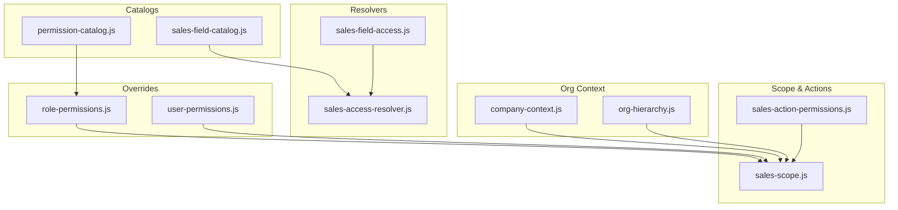
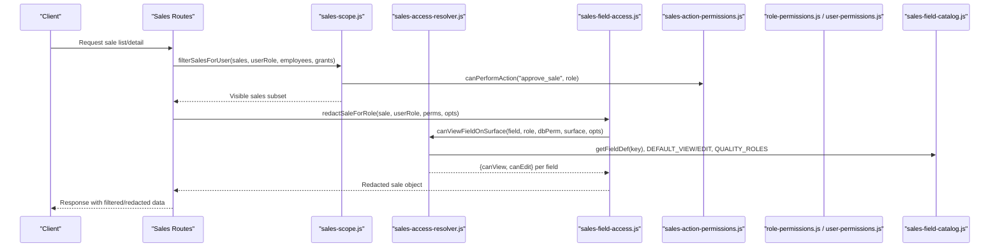
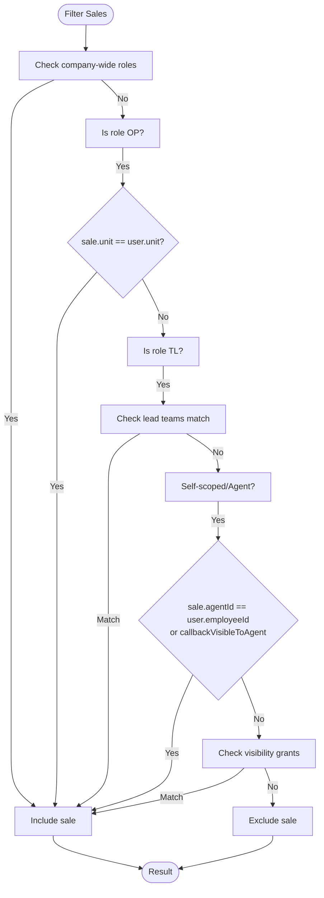
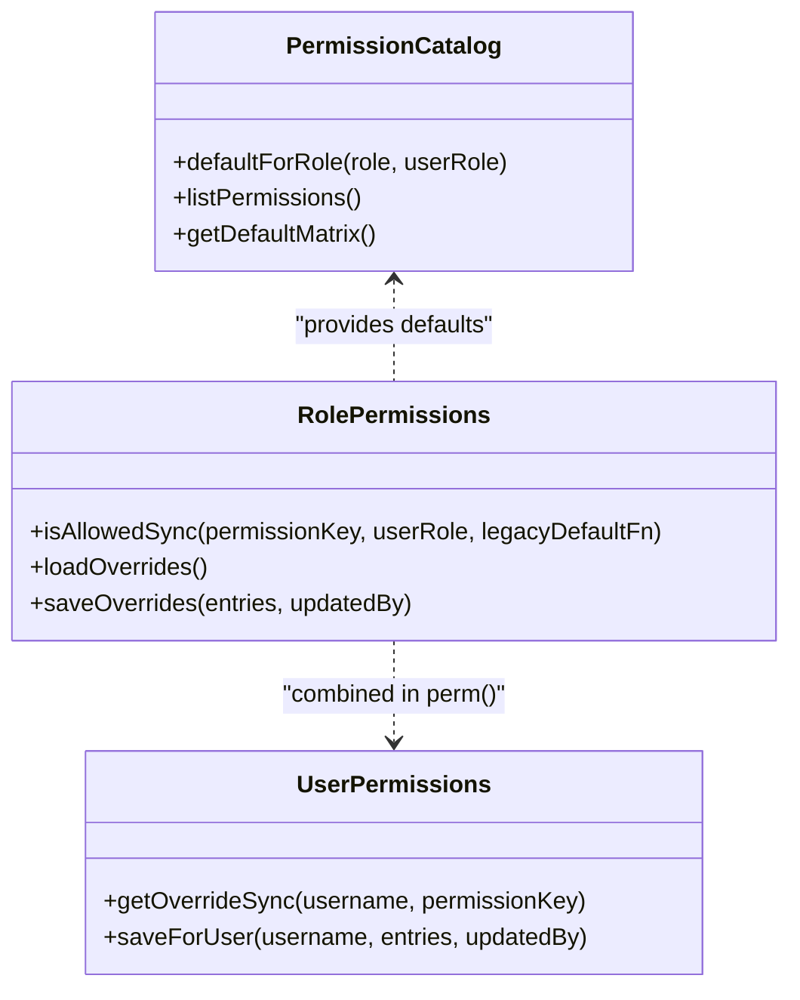
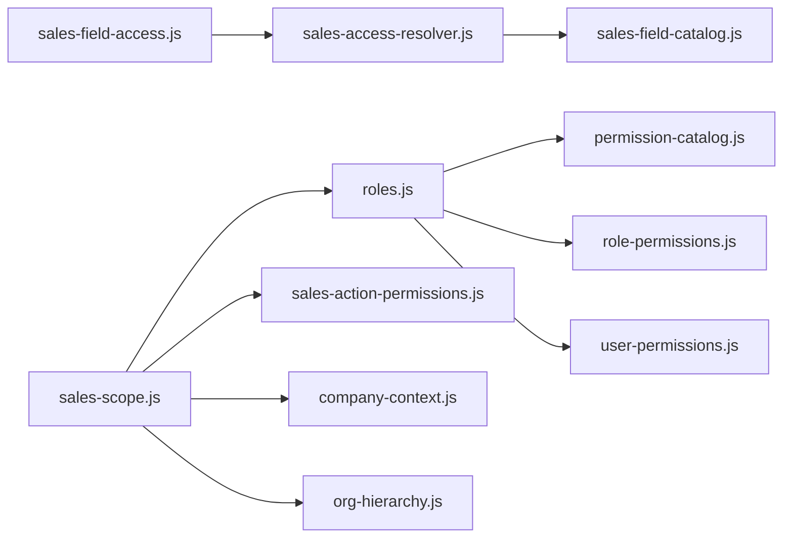

# Sales Access Control & Permissions

<cite>
**Referenced Files in This Document**
- [sales-access-resolver.js](file://lib/sales-access-resolver.js)
- [sales-field-catalog.js](file://lib/sales-field-catalog.js)
- [sales-field-access.js](file://lib/sales-field-access.js)
- [sales-action-permissions.js](file://lib/sales-action-permissions.js)
- [sales-scope.js](file://lib/sales-scope.js)
- [roles.js](file://lib/roles.js)
- [permission-catalog.js](file://lib/permission-catalog.js)
- [role-permissions.js](file://lib/role-permissions.js)
- [user-permissions.js](file://lib/user-permissions.js)
- [company-context.js](file://lib/company-context.js)
- [org-hierarchy.js](file://lib/org-hierarchy.js)
- [sales-attachment-permissions.js](file://lib/sales-attachment-permissions.js)
</cite>

## Table of Contents
1. [Introduction](#introduction)
2. [Project Structure](#project-structure)
3. [Core Components](#core-components)
4. [Architecture Overview](#architecture-overview)
5. [Detailed Component Analysis](#detailed-component-analysis)
6. [Dependency Analysis](#dependency-analysis)
7. [Performance Considerations](#performance-considerations)
8. [Troubleshooting Guide](#troubleshooting-guide)
9. [Conclusion](#conclusion)

## Introduction
This document explains the Sales Access Control and Permissions system, focusing on:
- Role-based authorization for sales data across company context, team membership, and individual role assignments
- Field-level access controls that restrict visibility and editing of sensitive sales information
- Action permissions governing operations such as create, edit, delete, approve, and callback
- Permission scenarios, scope resolution, and custom overrides
- The relationship between organizational hierarchy and sales data access patterns

The system combines a permission catalog with database-backed overrides to provide flexible, auditable control over who can see or modify what in the sales module.

## Project Structure
The sales access control is implemented across several modules:
- Catalogs define default roles and field definitions
- Resolvers compute view/edit permissions per field and surface (main vs quality)
- Scope logic determines which sales records are visible based on role, unit, team, and grants
- Action permissions govern workflow actions like approve/deny/callback
- Company context and org hierarchy influence visibility and filtering

**Diagram sources**
- [sales-field-catalog.js:1-120](file://lib/sales-field-catalog.js#L1-L120)
- [permission-catalog.js:1-120](file://lib/permission-catalog.js#L1-L120)
- [sales-access-resolver.js:1-120](file://lib/sales-access-resolver.js#L1-L120)
- [sales-field-access.js:1-60](file://lib/sales-field-access.js#L1-L60)
- [sales-scope.js:1-80](file://lib/sales-scope.js#L1-L80)
- [sales-action-permissions.js:1-60](file://lib/sales-action-permissions.js#L1-L60)
- [role-permissions.js:1-80](file://lib/role-permissions.js#L1-L80)
- [user-permissions.js:1-60](file://lib/user-permissions.js#L1-L60)
- [company-context.js:1-60](file://lib/company-context.js#L1-L60)
- [org-hierarchy.js:1-60](file://lib/org-hierarchy.js#L1-L60)

**Section sources**
- [sales-field-catalog.js:1-120](file://lib/sales-field-catalog.js#L1-L120)
- [permission-catalog.js:1-120](file://lib/permission-catalog.js#L1-L120)
- [sales-access-resolver.js:1-120](file://lib/sales-access-resolver.js#L1-L120)
- [sales-field-access.js:1-60](file://lib/sales-field-access.js#L1-L60)
- [sales-scope.js:1-80](file://lib/sales-scope.js#L1-L80)
- [sales-action-permissions.js:1-60](file://lib/sales-action-permissions.js#L1-L60)
- [role-permissions.js:1-80](file://lib/role-permissions.js#L1-L80)
- [user-permissions.js:1-60](file://lib/user-permissions.js#L1-L60)
- [company-context.js:1-60](file://lib/company-context.js#L1-L60)
- [org-hierarchy.js:1-60](file://lib/org-hierarchy.js#L1-L60)

## Core Components
- Sales field catalog: Defines fields, sections, defaults, and base role sets for view/edit permissions. It also defines attachment kinds and their default roles.
- Access resolver: Computes whether a user can view or edit a specific field on a given surface (main or quality), including special rules for verifier/client feedback and quality-only fields.
- Field access layer: Orchestrates sanitization of incoming form payloads and redaction of sale objects for a given role and surface.
- Scope engine: Determines which sales records are visible by role, unit/team membership, and delegated grants; integrates action permissions for approvals.
- Action permissions: Database-backed configuration of allowed roles for actions like approve/deny/callback.
- Overrides: Role-level and user-level permission overrides that adjust defaults from the permission catalog.
- Company context and org hierarchy: Influence visibility (e.g., HS-2 separation) and manager assignments.

**Section sources**
- [sales-field-catalog.js:1-120](file://lib/sales-field-catalog.js#L1-L120)
- [sales-access-resolver.js:1-120](file://lib/sales-access-resolver.js#L1-L120)
- [sales-field-access.js:1-80](file://lib/sales-field-access.js#L1-L80)
- [sales-scope.js:1-120](file://lib/sales-scope.js#L1-L120)
- [sales-action-permissions.js:1-80](file://lib/sales-action-permissions.js#L1-L80)
- [role-permissions.js:1-120](file://lib/role-permissions.js#L1-L120)
- [user-permissions.js:1-120](file://lib/user-permissions.js#L1-L120)
- [company-context.js:1-120](file://lib/company-context.js#L1-L120)
- [org-hierarchy.js:1-120](file://lib/org-hierarchy.js#L1-L120)

## Architecture Overview
The authorization model layers multiple checks:
- Base defaults from catalogs
- DB-backed overrides for roles and users
- Contextual scope (unit/team/agent) and company context
- Surface-specific rules (main vs quality)
- Special-case logic for sensitive fields and workflows

**Diagram sources**
- [sales-scope.js:1-120](file://lib/sales-scope.js#L1-L120)
- [sales-access-resolver.js:1-200](file://lib/sales-access-resolver.js#L1-L200)
- [sales-field-access.js:1-112](file://lib/sales-field-access.js#L1-L112)
- [sales-action-permissions.js:1-127](file://lib/sales-action-permissions.js#L1-L127)
- [sales-field-catalog.js:1-200](file://lib/sales-field-catalog.js#L1-L200)
- [role-permissions.js:1-120](file://lib/role-permissions.js#L1-L120)
- [user-permissions.js:1-120](file://lib/user-permissions.js#L1-L120)

## Detailed Component Analysis

### Sales Field Catalog
- Defines all sales form fields, sections, types, and default role sets for view/edit.
- Includes sensitive payment fields and bank/card keys used for stricter handling.
- Provides attachment kind definitions with default view/edit roles.
- Exposes helpers to seed default permissions into the database.

Key behaviors:
- Default view/edit role lists per section and field
- Quality-only fields and extra fields surfaced on quality tickets
- System-hidden fields excluded from UI and processing

**Section sources**
- [sales-field-catalog.js:1-200](file://lib/sales-field-catalog.js#L1-L200)
- [sales-field-catalog.js:200-462](file://lib/sales-field-catalog.js#L200-L462)

### Access Resolver
- Central authority for field-level permissions per surface (main vs quality).
- Uses catalog defaults and optional DB overrides to determine allowed roles.
- Implements special cases:
  - Verifier feedback: assignable verifiers can edit/view under conditions
  - Client feedback: restricted to specific roles
  - Quality surface: additional visibility/edit allowances for quality fields
- Maps fields to {canView, canEdit} for rendering and submission.

Important functions:
- rolesForSurface: resolves view/edit roles per surface and field
- canViewFieldOnSurface/canEditFieldOnSurface: core checks
- sanitizeFormPayload/filterFormDataForRole: input/output sanitization respecting permissions
- Attachment kind resolution: view/edit per kind and role

**Section sources**
- [sales-access-resolver.js:1-200](file://lib/sales-access-resolver.js#L1-L200)
- [sales-access-resolver.js:200-356](file://lib/sales-access-resolver.js#L200-L356)

### Field Access Layer
- Bridges resolver and business logic:
  - Sanitizes incoming form data before persistence
  - Redacts sale objects for a given role and surface
  - Merges quality fields into main view when appropriate
- Loads field permissions map from DB and caches it.

**Section sources**
- [sales-field-access.js:1-112](file://lib/sales-field-access.js#L1-L112)

### Sales Scope Engine
- Determines visibility of sales records:
  - Company-wide roles (quality, rtm, hr, admin, ceo, finance) see all
  - OP sees own unit
  - TL sees teams they lead
  - Agents/self-scoped roles see own sales and some callback visibility
- Supports temporary visibility grants scoped by company/unit/team.
- Integrates action permissions for approval workflows.

**Diagram sources**
- [sales-scope.js:1-120](file://lib/sales-scope.js#L1-L120)

**Section sources**
- [sales-scope.js:1-209](file://lib/sales-scope.js#L1-L209)

### Action Permissions
- Configurable via database table with caching.
- Controls high-impact actions like approve/deny/callback.
- Defaults include a set of allowed roles; can be overridden at runtime.

**Section sources**
- [sales-action-permissions.js:1-127](file://lib/sales-action-permissions.js#L1-L127)

### Permission Catalog and Overrides
- Permission catalog defines default matrices for roles across many features, including sales-related permissions.
- Role-level overrides allow admins to adjust defaults per role.
- User-level overrides grant exceptions per username.

**Diagram sources**
- [permission-catalog.js:1-200](file://lib/permission-catalog.js#L1-L200)
- [role-permissions.js:1-120](file://lib/role-permissions.js#L1-L120)
- [user-permissions.js:1-120](file://lib/user-permissions.js#L1-L120)

**Section sources**
- [permission-catalog.js:1-325](file://lib/permission-catalog.js#L1-L325)
- [role-permissions.js:1-159](file://lib/role-permissions.js#L1-L159)
- [user-permissions.js:1-127](file://lib/user-permissions.js#L1-L127)

### Company Context and Org Hierarchy
- Company context separates HS-2 from Hang-Up, affecting visibility and management.
- Org hierarchy provides unit managers and team lead assignments, influencing scope.

**Section sources**
- [company-context.js:1-117](file://lib/company-context.js#L1-L117)
- [org-hierarchy.js:1-124](file://lib/org-hierarchy.js#L1-L124)

### Attachment Permissions
- Attachment kinds have configurable view/edit roles per kind.
- Integrated into resolver and catalog for consistent enforcement.

**Section sources**
- [sales-attachment-permissions.js:1-137](file://lib/sales-attachment-permissions.js#L1-L137)
- [sales-field-catalog.js:278-284](file://lib/sales-field-catalog.js#L278-L284)

## Dependency Analysis
- sales-field-access depends on sales-access-resolver and sales-field-catalog
- sales-access-resolver depends on sales-field-catalog
- sales-scope depends on roles, sales-action-permissions, and team names
- roles uses permission-catalog, role-permissions, and user-permissions
- company-context and org-hierarchy feed into scope decisions

**Diagram sources**
- [sales-field-access.js:1-60](file://lib/sales-field-access.js#L1-L60)
- [sales-access-resolver.js:1-60](file://lib/sales-access-resolver.js#L1-L60)
- [sales-field-catalog.js:1-60](file://lib/sales-field-catalog.js#L1-L60)
- [sales-scope.js:1-60](file://lib/sales-scope.js#L1-L60)
- [roles.js:1-120](file://lib/roles.js#L1-L120)
- [permission-catalog.js:1-120](file://lib/permission-catalog.js#L1-L120)
- [role-permissions.js:1-120](file://lib/role-permissions.js#L1-L120)
- [user-permissions.js:1-120](file://lib/user-permissions.js#L1-L120)
- [company-context.js:1-60](file://lib/company-context.js#L1-L60)
- [org-hierarchy.js:1-60](file://lib/org-hierarchy.js#L1-L60)

**Section sources**
- [sales-field-access.js:1-60](file://lib/sales-field-access.js#L1-L60)
- [sales-access-resolver.js:1-60](file://lib/sales-access-resolver.js#L1-L60)
- [sales-field-catalog.js:1-60](file://lib/sales-field-catalog.js#L1-L60)
- [sales-scope.js:1-60](file://lib/sales-scope.js#L1-L60)
- [roles.js:1-120](file://lib/roles.js#L1-L120)
- [permission-catalog.js:1-120](file://lib/permission-catalog.js#L1-L120)
- [role-permissions.js:1-120](file://lib/role-permissions.js#L1-L120)
- [user-permissions.js:1-120](file://lib/user-permissions.js#L1-L120)
- [company-context.js:1-60](file://lib/company-context.js#L1-L60)
- [org-hierarchy.js:1-60](file://lib/org-hierarchy.js#L1-L60)

## Performance Considerations
- In-memory caching:
  - Field permissions map cached for 60 seconds
  - Role and user overrides cached for 60 seconds
  - Action permissions and attachment permissions cached for 60 seconds
- Cache invalidation occurs after writes to ensure consistency.
- Avoid repeated DB queries by leveraging cached maps and short TTLs.

[No sources needed since this section provides general guidance]

## Troubleshooting Guide
Common issues and resolutions:
- Missing DB tables:
  - If schema not yet created, modules fall back to defaults and cache them. Ensure migrations run to enable DB-backed overrides.
- Unexpected field visibility:
  - Verify field permissions in DB and catalog defaults; check surface (main vs quality) and special-case rules for verifier/client feedback.
- Approval denied despite role:
  - Confirm action permissions entry for approve_sale includes the role; check cache refresh after updates.
- Visibility grants not applied:
  - Validate grant scope type and value; ensure grant has not expired; confirm granter has permission to grant.

**Section sources**
- [sales-field-access.js:1-60](file://lib/sales-field-access.js#L1-L60)
- [sales-action-permissions.js:1-80](file://lib/sales-action-permissions.js#L1-L80)
- [sales-scope.js:1-120](file://lib/sales-scope.js#L1-L120)

## Conclusion
The Sales Access Control and Permissions system provides a layered, configurable authorization model:
- Catalog-driven defaults with DB-backed overrides for roles and users
- Field-level controls tailored to surfaces and sensitive data
- Scope resolution integrating organizational hierarchy and temporary grants
- Action permissions controlling critical workflows

This design balances security with operational flexibility, enabling precise control over sales data visibility and edits while supporting dynamic adjustments through overrides and grants.