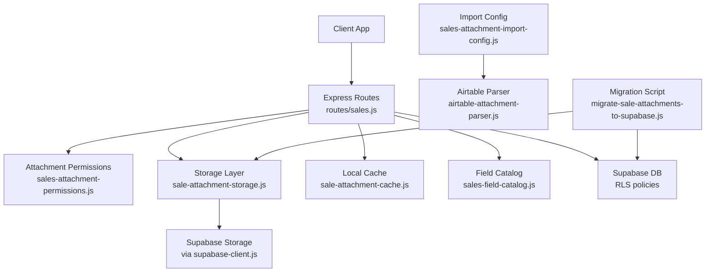
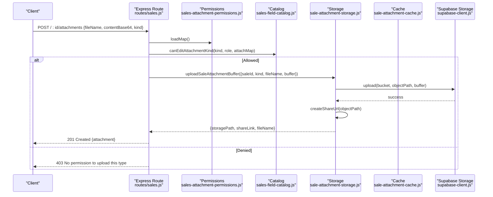
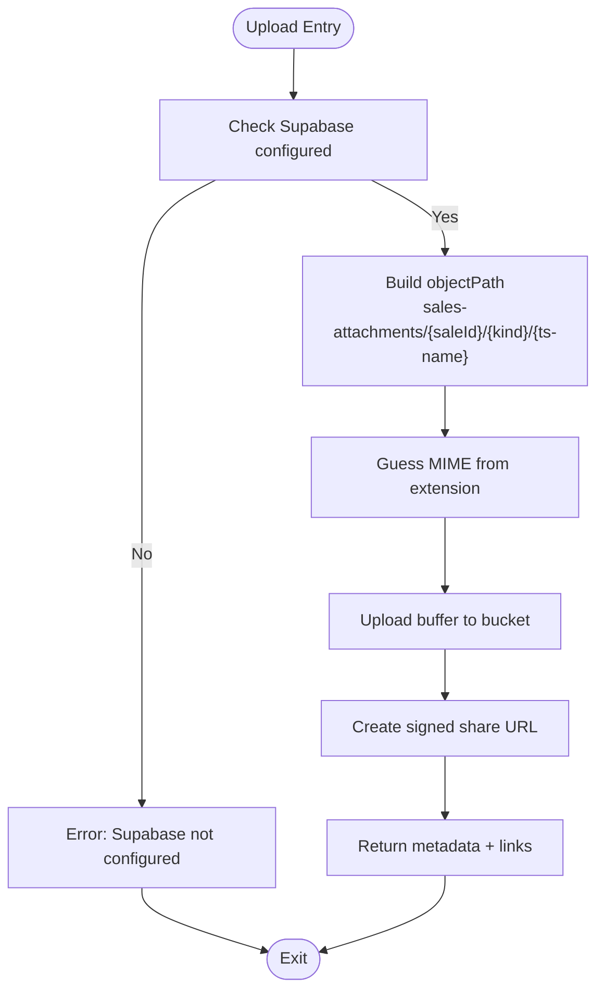
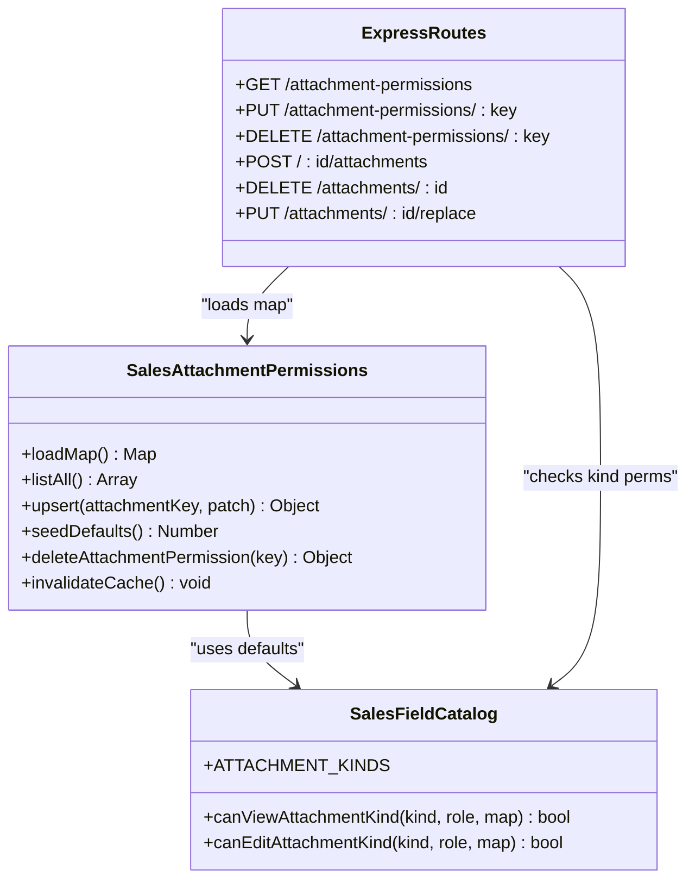
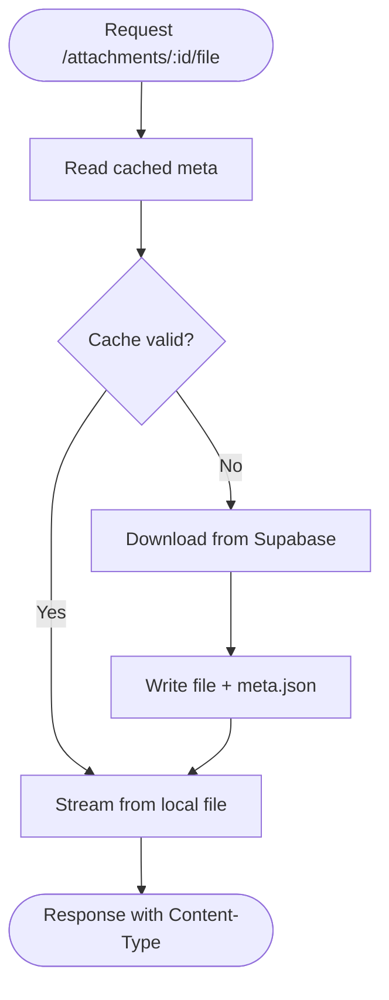
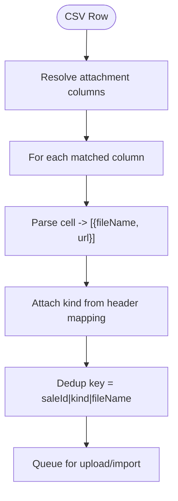
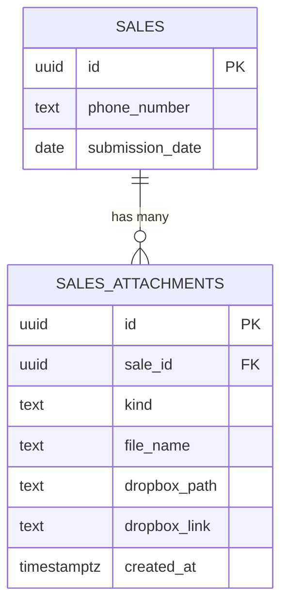
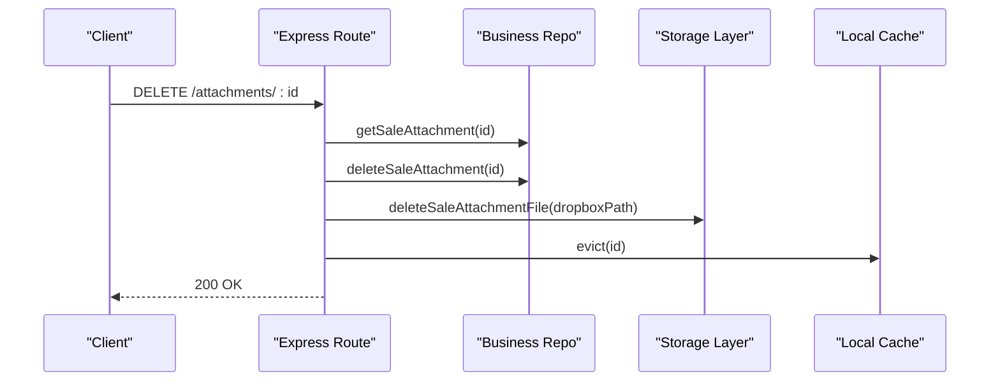
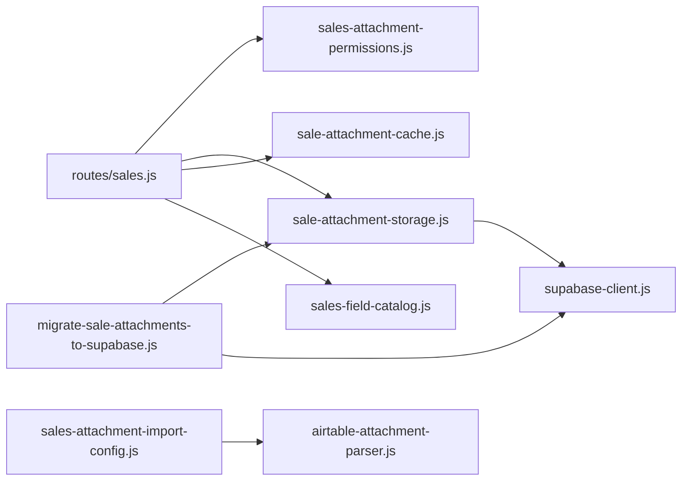

# Sales Attachments & File Management

<cite>
**Referenced Files in This Document**
- [sale-attachment-storage.js](file://lib/sale-attachment-storage.js)
- [sale-attachment-cache.js](file://lib/sale-attachment-cache.js)
- [sales-attachment-permissions.js](file://lib/sales-attachment-permissions.js)
- [sales-attachment-import-config.js](file://lib/sales-attachment-import-config.js)
- [airtable-attachment-parser.js](file://lib/airtable-attachment-parser.js)
- [supabase-client.js](file://lib/supabase-client.js)
- [storage.js](file://lib/storage.js)
- [sales-field-catalog.js](file://lib/sales-field-catalog.js)
- [sales.js](file://routes/sales.js)
- [supabase.js](file://routes/supabase.js)
- [migrate-sale-attachments-to-supabase.js](file://scripts/migrate-sale-attachments-to-supabase.js)
- [20260720_sales_attachment_permissions.sql](file://supabase/migrations/20260720_sales_attachment_permissions.sql)
</cite>

## Table of Contents
1. [Introduction](#introduction)
2. [Project Structure](#project-structure)
3. [Core Components](#core-components)
4. [Architecture Overview](#architecture-overview)
5. [Detailed Component Analysis](#detailed-component-analysis)
6. [Dependency Analysis](#dependency-analysis)
7. [Performance Considerations](#performance-considerations)
8. [Troubleshooting Guide](#troubleshooting-guide)
9. [Conclusion](#conclusion)
10. [Appendices](#appendices)

## Introduction
This document explains the complete file handling system for sales attachments, including Supabase Storage integration, role-based permission controls, caching for performance, bulk import configuration, and security measures for sensitive financial documents. It also covers workflows for uploading, viewing, replacing, and deleting attachments; permission-based access control; validation rules; cleanup and archival processes; and the relationship between attachments and sales records.

## Project Structure
The attachment system is implemented across a small set of focused modules:
- Storage layer: uploads/downloads to Supabase Storage and generates signed share URLs.
- Cache layer: on-demand local cache with TTL to reduce repeated downloads.
- Permission layer: DB-backed per-kind view/edit roles with short-lived server-side cache.
- Import configuration: CSV column mapping and Airtable cell parsing for bulk imports.
- Routes: REST endpoints for listing, uploading, downloading, sharing, replacing, and deleting attachments.
- Migration script: migrates legacy Dropbox paths to Supabase Storage.

**Diagram sources**
- [sales.js:1112-1312](file://routes/sales.js#L1112-L1312)
- [sale-attachment-storage.js:1-91](file://lib/sale-attachment-storage.js#L1-L91)
- [sale-attachment-cache.js:1-124](file://lib/sale-attachment-cache.js#L1-L124)
- [sales-attachment-permissions.js:1-137](file://lib/sales-attachment-permissions.js#L1-L137)
- [sales-attachment-import-config.js:1-50](file://lib/sales-attachment-import-config.js#L1-L50)
- [airtable-attachment-parser.js:1-26](file://lib/airtable-attachment-parser.js#L1-L26)
- [supabase-client.js:1-134](file://lib/supabase-client.js#L1-L134)
- [migrate-sale-attachments-to-supabase.js:1-309](file://scripts/migrate-sale-attachments-to-supabase.js#L1-L309)

**Section sources**
- [sales.js:1112-1312](file://routes/sales.js#L1112-L1312)
- [sale-attachment-storage.js:1-91](file://lib/sale-attachment-storage.js#L1-L91)
- [sale-attachment-cache.js:1-124](file://lib/sale-attachment-cache.js#L1-L124)
- [sales-attachment-permissions.js:1-137](file://lib/sales-attachment-permissions.js#L1-L137)
- [sales-attachment-import-config.js:1-50](file://lib/sales-attachment-import-config.js#L1-L50)
- [airtable-attachment-parser.js:1-26](file://lib/airtable-attachment-parser.js#L1-L26)
- [supabase-client.js:1-134](file://lib/supabase-client.js#L1-L134)
- [migrate-sale-attachments-to-supabase.js:1-309](file://scripts/migrate-sale-attachments-to-supabase.js#L1-L309)

## Core Components
- Supabase Storage integration: Uploads, downloads, signed URL generation, and path normalization for sale attachments.
- Attachment permissions: Per-kind view/edit roles persisted in the database with a short-lived server cache.
- Local cache: On-demand download and caching with TTL to improve performance when opening files.
- Import configuration: Maps CSV columns to attachment kinds and parses Airtable-style cells for bulk processing.
- Security: Role checks, RLS policy defaults, and signed URLs for secure sharing.

Key responsibilities by module:
- sale-attachment-storage.js: Upload buffer, create share URLs, delete files, ensure configuration.
- sale-attachment-cache.js: Read cached files, fetch from storage if missing, evict entries.
- sales-attachment-permissions.js: Load map, upsert, seed defaults, invalidate cache.
- sales-attachment-import-config.js: Resolve columns, parse rows, dedup keys.
- airtable-attachment-parser.js: Parse "name (url)" or raw URL cells into structured items.
- routes/sales.js: Endpoints for CRUD operations, access checks, and streaming responses.
- supabase-client.js: Admin/anon clients and environment checks.
- storage.js: Shared helpers for bucket name, MIME guessing, and signed URLs.
- sales-field-catalog.js: Defines attachment kinds and default role sets.
- migrate-sale-attachments-to-supabase.js: Migrates legacy Dropbox paths to Supabase Storage.

**Section sources**
- [sale-attachment-storage.js:1-91](file://lib/sale-attachment-storage.js#L1-L91)
- [sale-attachment-cache.js:1-124](file://lib/sale-attachment-cache.js#L1-L124)
- [sales-attachment-permissions.js:1-137](file://lib/sales-attachment-permissions.js#L1-L137)
- [sales-attachment-import-config.js:1-50](file://lib/sales-attachment-import-config.js#L1-L50)
- [airtable-attachment-parser.js:1-26](file://lib/airtable-attachment-parser.js#L1-L26)
- [sales.js:1112-1312](file://routes/sales.js#L1112-L1312)
- [supabase-client.js:1-134](file://lib/supabase-client.js#L1-L134)
- [storage.js:1-96](file://lib/storage.js#L1-L96)
- [sales-field-catalog.js:278-284](file://lib/sales-field-catalog.js#L278-L284)
- [migrate-sale-attachments-to-supabase.js:1-309](file://scripts/migrate-sale-attachments-to-supabase.js#L1-L309)

## Architecture Overview
The system enforces role-based access at multiple layers: route-level authorization, attachment kind permissions, and Supabase RLS policies. Files are stored in Supabase Storage under a dedicated bucket and accessed via signed URLs or through a local cache.

**Diagram sources**
- [sales.js:1146-1189](file://routes/sales.js#L1146-L1189)
- [sales-attachment-permissions.js:30-59](file://lib/sales-attachment-permissions.js#L30-L59)
- [sales-field-catalog.js:315-321](file://lib/sales-field-catalog.js#L315-L321)
- [sale-attachment-storage.js:41-60](file://lib/sale-attachment-storage.js#L41-L60)
- [supabase-client.js:80-91](file://lib/supabase-client.js#L80-L91)

## Detailed Component Analysis

### Supabase Storage Integration
- Upload flow: Validates configuration, constructs a safe object path under sales-attachments/{saleId}/{kind}/{timestamp}-{fileName}, uploads buffer with correct MIME type, and returns metadata including a share link.
- Share URLs: Generates time-limited signed URLs for external consumption (e.g., Airtable sync).
- Deletion: Removes files only if they reside in Supabase storage; legacy paths require migration first.
- Configuration: Requires SUPABASE_URL and secret key; admin client used for storage operations.

**Diagram sources**
- [sale-attachment-storage.js:41-60](file://lib/sale-attachment-storage.js#L41-L60)
- [storage.js:80-85](file://lib/storage.js#L80-L85)
- [supabase-client.js:80-91](file://lib/supabase-client.js#L80-L91)

**Section sources**
- [sale-attachment-storage.js:1-91](file://lib/sale-attachment-storage.js#L1-L91)
- [storage.js:1-96](file://lib/storage.js#L1-L96)
- [supabase-client.js:1-134](file://lib/supabase-client.js#L1-L134)

### Attachment Permission Controls
- Default kinds and roles are defined in the field catalog and can be overridden per kind in the database table sales_attachment_permissions.
- Server-side cache loads the map with a short TTL and invalidates on updates.
- Route handlers enforce both general edit rights and kind-specific edit/view permissions before allowing actions.

**Diagram sources**
- [sales-attachment-permissions.js:1-137](file://lib/sales-attachment-permissions.js#L1-L137)
- [sales-field-catalog.js:278-321](file://lib/sales-field-catalog.js#L278-L321)
- [sales.js:1067-1110](file://routes/sales.js#L1067-L1110)

**Section sources**
- [sales-attachment-permissions.js:1-137](file://lib/sales-attachment-permissions.js#L1-L137)
- [sales-field-catalog.js:278-321](file://lib/sales-field-catalog.js#L278-L321)
- [sales.js:1067-1110](file://routes/sales.js#L1067-L1110)
- [20260720_sales_attachment_permissions.sql:1-21](file://supabase/migrations/20260720_sales_attachment_permissions.sql#L1-L21)

### Caching Mechanism for Performance
- On-demand cache: When a user opens an attachment, the server downloads it once and stores it locally with a 48-hour TTL.
- Cache metadata: Stores file path, MIME type, and timestamp; auto-evicts expired entries.
- Download flow: Checks cache first; if missing, downloads from Supabase, writes to disk, persists metadata, then streams to client.

**Diagram sources**
- [sale-attachment-cache.js:45-104](file://lib/sale-attachment-cache.js#L45-L104)
- [sales.js:1112-1124](file://routes/sales.js#L1112-L1124)

**Section sources**
- [sale-attachment-cache.js:1-124](file://lib/sale-attachment-cache.js#L1-L124)
- [sales.js:1112-1124](file://routes/sales.js#L1112-L1124)

### Import Configuration for Bulk Processing
- Column mapping: Recognizes headers like Recordings, Raw call record, Quality Record, Receipt Attachment, Confirmation and maps them to internal kinds.
- Parsing: Extracts multiple attachments per cell using Airtable-style format or raw URLs.
- Deduplication: Uses a composite key based on sale ID, kind, and file name to avoid duplicates during import.

**Diagram sources**
- [sales-attachment-import-config.js:8-42](file://lib/sales-attachment-import-config.js#L8-L42)
- [airtable-attachment-parser.js:1-26](file://lib/airtable-attachment-parser.js#L1-L26)

**Section sources**
- [sales-attachment-import-config.js:1-50](file://lib/sales-attachment-import-config.js#L1-L50)
- [airtable-attachment-parser.js:1-26](file://lib/airtable-attachment-parser.js#L1-L26)

### Security Measures for Sensitive Financial Documents
- Role-based visibility: Attachment kinds have default view/edit roles; these can be tightened via the permissions table.
- Route-level checks: Only users who can edit the sale, work quality tickets, or open a quality ticket on the sale can upload/replace/delete.
- Signed URLs: Share links are time-limited and refreshed on demand; legacy Dropbox paths are rejected until migrated.
- RLS policy: The permissions table has a deny-all policy for anonymous/authenticated clients, ensuring only server-side admin calls can modify permissions.

Best practices:
- Keep kind permissions restrictive for sensitive types (e.g., receipts, confirmations).
- Use signed URLs instead of public links.
- Audit and rotate service role keys regularly.

**Section sources**
- [sales.js:1146-1189](file://routes/sales.js#L1146-L1189)
- [sales.js:1191-1217](file://routes/sales.js#L1191-L1217)
- [sales.js:1249-1271](file://routes/sales.js#L1249-L1271)
- [sales-attachment-permissions.js:1-137](file://lib/sales-attachment-permissions.js#L1-L137)
- [20260720_sales_attachment_permissions.sql:1-21](file://supabase/migrations/20260720_sales_attachment_permissions.sql#L1-L21)

### Relationship Between Attachments and Sales Records
- Each attachment references a sale ID and includes kind, file name, and storage path.
- Listing attachments filters by user’s ability to view the sale and the attachment kind’s view roles.
- Deleting or replacing an attachment updates the underlying storage and clears any cached copy.

[No diagram sources needed since this diagram shows conceptual relationships]

**Section sources**
- [sales.js:1126-1144](file://routes/sales.js#L1126-L1144)
- [sales.js:1191-1217](file://routes/sales.js#L1191-L1217)

### Cleanup and Archival Processes
- Delete endpoint: Removes the DB row and attempts to delete the file from Supabase Storage; also evicts local cache entry.
- Replace endpoint: Deletes the old file, uploads the new one, updates DB fields, and evicts cache.
- Migration script: Scans legacy attachments, matches against CSV/Airtable URLs or Dropbox, uploads to Supabase, and updates DB records.

**Diagram sources**
- [sales.js:1191-1217](file://routes/sales.js#L1191-L1217)
- [sale-attachment-storage.js:68-74](file://lib/sale-attachment-storage.js#L68-L74)
- [sale-attachment-cache.js:106-115](file://lib/sale-attachment-cache.js#L106-L115)

**Section sources**
- [sales.js:1191-1217](file://routes/sales.js#L1191-L1217)
- [sale-attachment-storage.js:68-74](file://lib/sale-attachment-storage.js#L68-L74)
- [sale-attachment-cache.js:106-115](file://lib/sale-attachment-cache.js#L106-L115)
- [migrate-sale-attachments-to-supabase.js:1-309](file://scripts/migrate-sale-attachments-to-supabase.js#L1-L309)

## Dependency Analysis
- Routes depend on:
  - Permission loader for kind-based access control.
  - Storage layer for upload/download/share-link operations.
  - Cache layer for efficient file serving.
  - Field catalog for default kinds and role sets.
- Storage layer depends on:
  - Supabase client (admin) for storage operations.
  - MIME guessing utilities.
- Import config depends on:
  - Airtable parser for robust cell parsing.
  - Normalization helpers for flexible header matching.

**Diagram sources**
- [sales.js:1112-1312](file://routes/sales.js#L1112-L1312)
- [sale-attachment-storage.js:1-91](file://lib/sale-attachment-storage.js#L1-L91)
- [sale-attachment-cache.js:1-124](file://lib/sale-attachment-cache.js#L1-L124)
- [sales-attachment-permissions.js:1-137](file://lib/sales-attachment-permissions.js#L1-L137)
- [sales-field-catalog.js:278-321](file://lib/sales-field-catalog.js#L278-L321)
- [supabase-client.js:1-134](file://lib/supabase-client.js#L1-L134)
- [sales-attachment-import-config.js:1-50](file://lib/sales-attachment-import-config.js#L1-L50)
- [airtable-attachment-parser.js:1-26](file://lib/airtable-attachment-parser.js#L1-L26)
- [migrate-sale-attachments-to-supabase.js:1-309](file://scripts/migrate-sale-attachments-to-supabase.js#L1-L309)

**Section sources**
- [sales.js:1112-1312](file://routes/sales.js#L1112-L1312)
- [sale-attachment-storage.js:1-91](file://lib/sale-attachment-storage.js#L1-L91)
- [sale-attachment-cache.js:1-124](file://lib/sale-attachment-cache.js#L1-L124)
- [sales-attachment-permissions.js:1-137](file://lib/sales-attachment-permissions.js#L1-L137)
- [sales-field-catalog.js:278-321](file://lib/sales-field-catalog.js#L278-L321)
- [supabase-client.js:1-134](file://lib/supabase-client.js#L1-L134)
- [sales-attachment-import-config.js:1-50](file://lib/sales-attachment-import-config.js#L1-L50)
- [airtable-attachment-parser.js:1-26](file://lib/airtable-attachment-parser.js#L1-L26)
- [migrate-sale-attachments-to-supabase.js:1-309](file://scripts/migrate-sale-attachments-to-supabase.js#L1-L309)

## Performance Considerations
- Local cache reduces repeated downloads and network overhead; TTL is 48 hours.
- Signed URLs allow direct external access without proxying large files.
- Short-lived server cache for permissions avoids frequent DB reads while keeping changes responsive.
- Streaming responses minimize memory usage when serving files.

[No sources needed since this section provides general guidance]

## Troubleshooting Guide
Common issues and resolutions:
- Supabase not configured: Ensure SUPABASE_URL and secret key are set; health/status endpoints help verify configuration.
- Legacy storage path errors: Run the migration script to move files to Supabase Storage before attempting share links or deletions.
- Permission denied: Verify user role and kind-specific permissions; update via the permissions endpoints if necessary.
- Cache stale after replace: Replacing an attachment triggers cache eviction; if issues persist, manually evict or wait for TTL expiry.

Operational tips:
- Use the health endpoint to check Supabase connectivity and legacy attachment counts.
- Validate CSV headers match expected names; minor variations are tolerated via normalization.
- For Airtable sync, use the longer TTL share URL helper to avoid mid-sync expiration.

**Section sources**
- [supabase.js:32-77](file://routes/supabase.js#L32-L77)
- [sale-attachment-storage.js:27-34](file://lib/sale-attachment-storage.js#L27-L34)
- [sale-attachment-storage.js:68-74](file://lib/sale-attachment-storage.js#L68-L74)
- [sales.js:1249-1271](file://routes/sales.js#L1249-L1271)
- [migrate-sale-attachments-to-supabase.js:1-309](file://scripts/migrate-sale-attachments-to-supabase.js#L1-L309)

## Conclusion
The sales attachment system combines secure Supabase Storage, fine-grained role-based permissions, and a performant local cache to deliver a robust file management experience. With clear APIs, import tooling, and migration support, teams can manage sensitive financial documents safely and efficiently while maintaining high availability and responsiveness.

[No sources needed since this section summarizes without analyzing specific files]

## Appendices

### Example Workflows

- Upload workflow:
  - Client sends base64 content with file name and kind.
  - Server validates sale visibility, user permissions, and kind edit rights.
  - Storage uploads to Supabase and returns metadata; DB row is created.

- Permission-based access control:
  - GET /:id/attachments lists only kinds the user can view.
  - GET /attachments/:id/file requires both sale visibility and kind view permission.

- Attachment validation rules:
  - Required fields: fileName and contentBase64 for upload/replace.
  - Kind must be allowed for the user’s role and context.
  - Legacy storage paths are rejected for share-link generation until migrated.

- Cleanup and archival:
  - DELETE removes DB row, deletes file from storage, and evicts cache.
  - REPLACE deletes old file, uploads new one, updates DB, and evicts cache.
  - Migration script moves legacy Dropbox paths to Supabase and updates DB records.

**Section sources**
- [sales.js:1146-1189](file://routes/sales.js#L1146-L1189)
- [sales.js:1126-1144](file://routes/sales.js#L1126-L1144)
- [sales.js:1112-1124](file://routes/sales.js#L1112-L1124)
- [sales.js:1191-1217](file://routes/sales.js#L1191-L1217)
- [sales.js:1273-1312](file://routes/sales.js#L1273-L1312)
- [migrate-sale-attachments-to-supabase.js:1-309](file://scripts/migrate-sale-attachments-to-supabase.js#L1-L309)