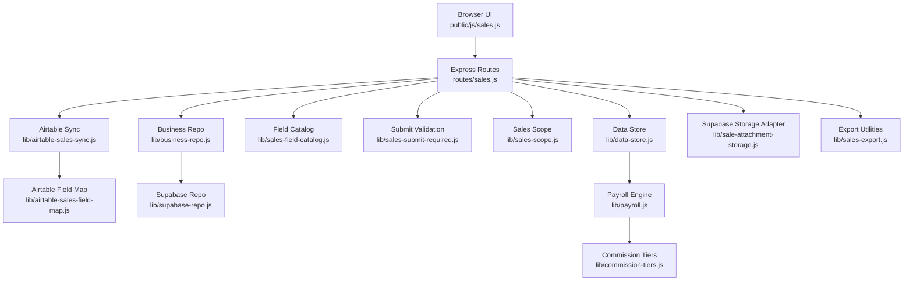
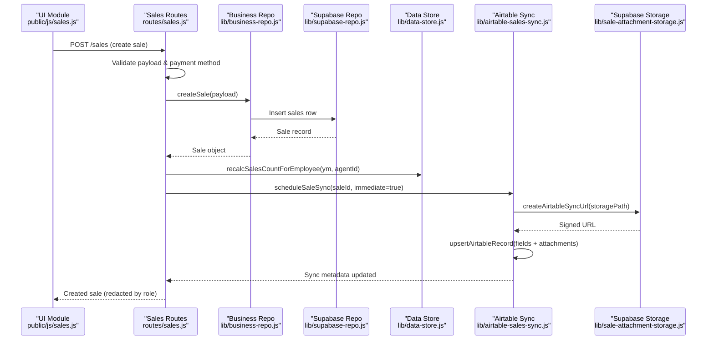
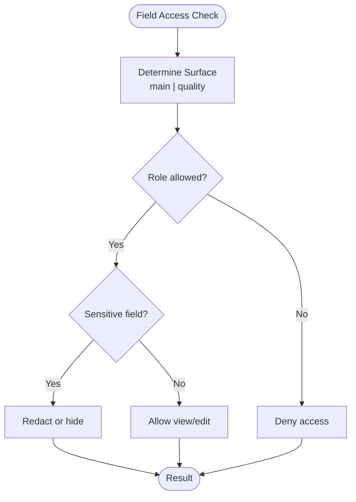
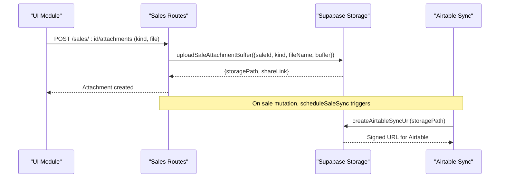
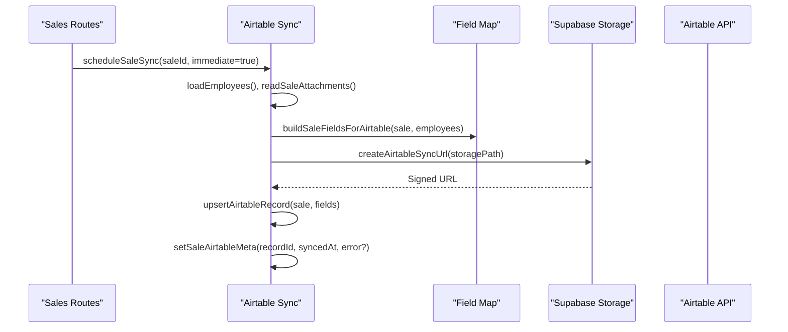
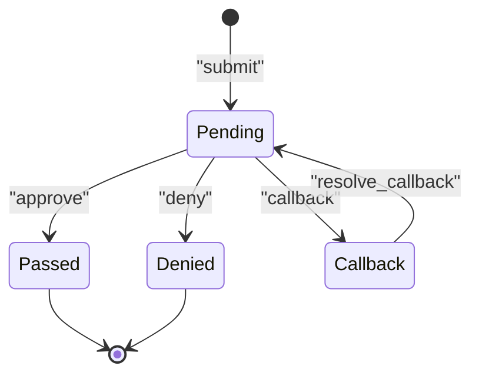
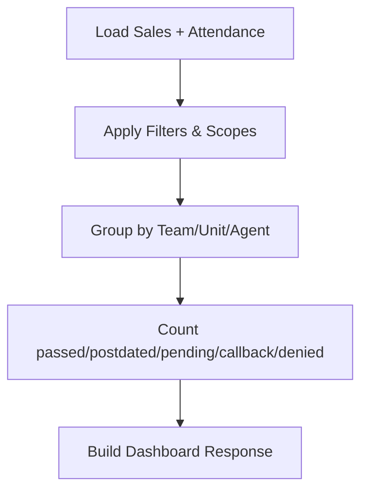
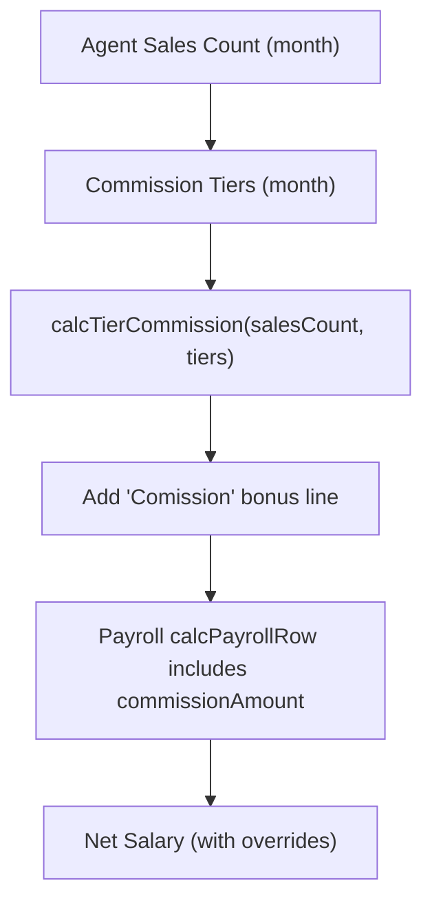
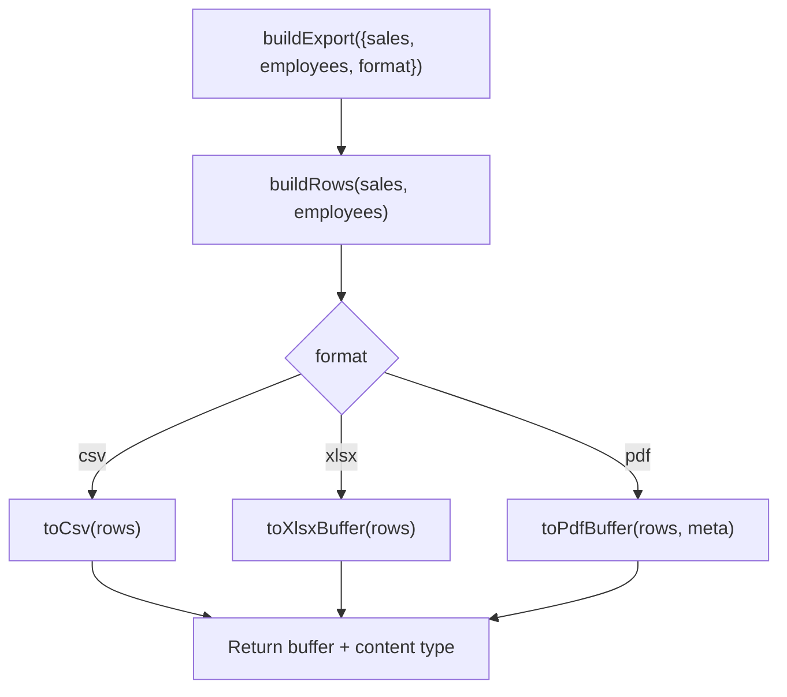
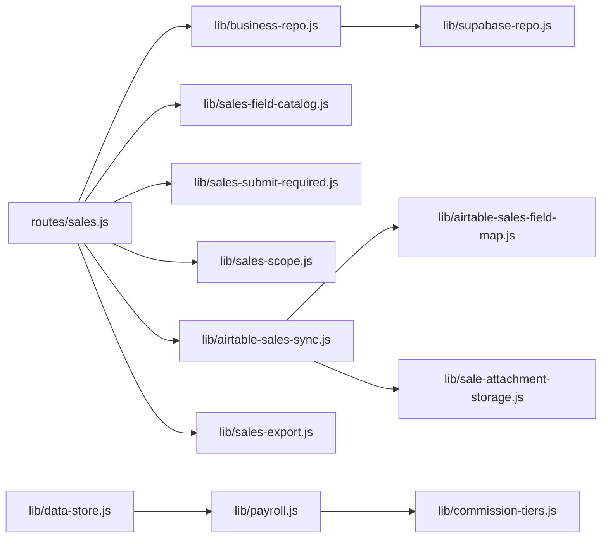

# Sales Performance Management

<cite>
**Referenced Files in This Document**
- [routes/sales.js](file://routes/sales.js)
- [lib/business-repo.js](file://lib/business-repo.js)
- [lib/supabase-repo.js](file://lib/supabase-repo.js)
- [lib/data-store.js](file://lib/data-store.js)
- [lib/sales-field-catalog.js](file://lib/sales-field-catalog.js)
- [lib/sales-submit-required.js](file://lib/sales-submit-required.js)
- [lib/sales-scope.js](file://lib/sales-scope.js)
- [lib/airtable-sales-sync.js](file://lib/airtable-sales-sync.js)
- [lib/airtable-sales-field-map.js](file://lib/airtable-sales-field-map.js)
- [lib/sale-attachment-storage.js](file://lib/sale-attachment-storage.js)
- [lib/commission-tiers.js](file://lib/commission-tiers.js)
- [lib/payroll.js](file://lib/payroll.js)
- [lib/sales-export.js](file://lib/sales-export.js)
- [public/js/sales.js](file://public/js/sales.js)
</cite>

## Table of Contents
1. Introduction
2. Project Structure
3. Core Components
4. Architecture Overview
5. Detailed Component Analysis
6. Dependency Analysis
7. Performance Considerations
8. Troubleshooting Guide
9. Conclusion

## Introduction
This document explains the Sales Performance Management system with a focus on:
- Sales record management and validation rules
- Agent performance tracking and commission calculations
- MLA-Ray integration (field catalog, Airtable mapping, outbound sync)
- Attachment handling via Supabase Storage
- Field-level permission controls
- Approval workflow for sales submissions
- Integration with external systems (Airtable) for outbound synchronization
- Import/export examples and processes
- Relationship between sales performance and payroll calculations

The system is built around an Express backend, a Supabase data layer, and a browser-based UI module. It enforces role-based access control, supports approval workflows, and integrates with Airtable for reporting and archival.

## Project Structure
Key modules involved in sales performance management:
- API routes for listing, creating, updating, deleting sales; dashboards; visibility grants
- Business repository for CRUD over sales and related metadata
- Data store for caching and orchestration across modules
- Field catalog defining form fields, permissions, and attachment kinds
- Submission validation enforcing required fields and payment method constraints
- Scope resolver controlling visibility and approvals
- Airtable sync orchestrator and field mapper
- Supabase storage adapter for attachments
- Commission tiers calculator and payroll integration
- Export utilities for CSV/XLSX/PDF
- Frontend UI module for forms, filters, attachments, and actions

**Diagram sources**
- [routes/sales.js:1-120](file://routes/sales.js#L1-L120)
- [lib/business-repo.js:120-210](file://lib/business-repo.js#L120-L210)
- [lib/supabase-repo.js:1-60](file://lib/supabase-repo.js#L1-L60)
- [lib/data-store.js:120-220](file://lib/data-store.js#L120-L220)
- [lib/sales-field-catalog.js:1-120](file://lib/sales-field-catalog.js#L1-L120)
- [lib/sales-submit-required.js:1-60](file://lib/sales-submit-required.js#L1-L60)
- [lib/sales-scope.js:1-60](file://lib/sales-scope.js#L1-L60)
- [lib/airtable-sales-sync.js:1-60](file://lib/airtable-sales-sync.js#L1-L60)
- [lib/airtable-sales-field-map.js:1-60](file://lib/airtable-sales-field-map.js#L1-L60)
- [lib/sale-attachment-storage.js:1-60](file://lib/sale-attachment-storage.js#L1-L60)
- [lib/payroll.js:1-60](file://lib/payroll.js#L1-L60)
- [lib/commission-tiers.js:1-33](file://lib/commission-tiers.js#L1-L33)
- [lib/sales-export.js:1-60](file://lib/sales-export.js#L1-L60)

**Section sources**
- [routes/sales.js:1-120](file://routes/sales.js#L1-L120)
- [lib/business-repo.js:120-210](file://lib/business-repo.js#L120-L210)
- [lib/supabase-repo.js:1-60](file://lib/supabase-repo.js#L1-L60)
- [lib/data-store.js:120-220](file://lib/data-store.js#L120-L220)
- [lib/sales-field-catalog.js:1-120](file://lib/sales-field-catalog.js#L1-L120)
- [lib/sales-submit-required.js:1-60](file://lib/sales-submit-required.js#L1-L60)
- [lib/sales-scope.js:1-60](file://lib/sales-scope.js#L1-L60)
- [lib/airtable-sales-sync.js:1-60](file://lib/airtable-sales-sync.js#L1-L60)
- [lib/airtable-sales-field-map.js:1-60](file://lib/airtable-sales-field-map.js#L1-L60)
- [lib/sale-attachment-storage.js:1-60](file://lib/sale-attachment-storage.js#L1-L60)
- [lib/payroll.js:1-60](file://lib/payroll.js#L1-L60)
- [lib/commission-tiers.js:1-33](file://lib/commission-tiers.js#L1-L33)
- [lib/sales-export.js:1-60](file://lib/sales-export.js#L1-L60)

## Core Components
- Sales API endpoints: list, period grid, team dashboard, visibility grants, create/update/delete sales, attachments
- Field catalog: defines all form fields, sections, roles, sensitive flags, and attachment kinds
- Submission validation: enforces required fields and payment method-specific requirements
- Visibility and approvals: role-based filtering, temporary grants, approver checks
- Airtable integration: outbound sync with debouncing, duplicate resolution, signed URLs for attachments
- Supabase storage: upload, share URL generation, deletion, configuration checks
- Commission tiers: tiered bonus calculation based on monthly sales count
- Payroll integration: uses sales counts to compute commissions and net salary overrides
- Export: CSV, XLSX, PDF exports for sales lists

**Section sources**
- [routes/sales.js:246-800](file://routes/sales.js#L246-L800)
- [lib/sales-field-catalog.js:54-276](file://lib/sales-field-catalog.js#L54-L276)
- [lib/sales-submit-required.js:6-127](file://lib/sales-submit-required.js#L6-L127)
- [lib/sales-scope.js:19-97](file://lib/sales-scope.js#L19-L97)
- [lib/airtable-sales-sync.js:15-179](file://lib/airtable-sales-sync.js#L15-L179)
- [lib/sale-attachment-storage.js:13-90](file://lib/sale-attachment-storage.js#L13-L90)
- [lib/commission-tiers.js:1-33](file://lib/commission-tiers.js#L1-L33)
- [lib/payroll.js:130-175](file://lib/payroll.js#L130-L175)
- [lib/sales-export.js:4-113](file://lib/sales-export.js#L4-L113)

## Architecture Overview
High-level flow from submission to external sync and payroll impact:

**Diagram sources**
- [routes/sales.js:466-648](file://routes/sales.js#L466-L648)
- [lib/business-repo.js:273-313](file://lib/business-repo.js#L273-L313)
- [lib/supabase-repo.js:1-60](file://lib/supabase-repo.js#L1-L60)
- [lib/data-store.js:730-741](file://lib/data-store.js#L730-L741)
- [lib/airtable-sales-sync.js:150-179](file://lib/airtable-sales-sync.js#L150-L179)
- [lib/sale-attachment-storage.js:36-39](file://lib/sale-attachment-storage.js#L36-L39)

## Detailed Component Analysis

### Sales Record Management and Validation Rules
- Creation pipeline:
  - Authorization check for submitter role
  - Assignment validation (agent/closer/unit/team)
  - Form sanitization and payload building
  - Payment method validation and scrubbing
  - Unit/team validation against org teams
  - Catalog resolution for client/device/price if enabled
  - Required field validation (top-level and form_data)
  - Duplicate detection by phone number and agent
  - Working day enrichment and effective date computation
  - Persist sale and update notes for bank details
  - Notifications and recalculation of agent sales count
  - Immediate Airtable sync scheduling

- Key validations:
  - Top-level required: agentId, unit, team, device, client (when catalog active), closerId
  - Form required: phone, name, DOB, address, state, zip, emergency contact, first-time device flag, medical conditions, payer name, payment method
  - Conditional requirements: service active info when not first-time device; card vs bank account fields
  - Payment method normalization and scrubbing to avoid storing irrelevant fields

- Status transitions:
  - Initial status depends on submitter role and permissions
  - Approve/deny/callback actions require approver role and set reviewedBy/reviewedAt

**Section sources**
- [routes/sales.js:466-648](file://routes/sales.js#L466-L648)
- [lib/sales-submit-required.js:6-127](file://lib/sales-submit-required.js#L6-L127)
- [lib/sales-field-catalog.js:54-276](file://lib/sales-field-catalog.js#L54-L276)
- [lib/business-repo.js:273-313](file://lib/business-repo.js#L273-L313)

### Field-Level Permission Controls
- Field catalog defines view/edit roles per field and surface (main/quality)
- Sensitive fields marked for redaction (card/bank details)
- Attachment kinds have separate view/edit permissions
- Default permissions seeded into database and can be overridden
- Resolver functions enforce permissions during read/write and UI rendering

**Diagram sources**
- [lib/sales-field-catalog.js:286-362](file://lib/sales-field-catalog.js#L286-L362)

**Section sources**
- [lib/sales-field-catalog.js:54-276](file://lib/sales-field-catalog.js#L54-L276)
- [lib/sales-field-catalog.js:286-362](file://lib/sales-field-catalog.js#L286-L362)

### Attachment Handling with Supabase Storage
- Uploads are stored under a bucket path prefixed with sales-attachments
- Share URLs are generated with configurable TTL; Airtable sync uses longer TTL
- Deletion requires migration to Supabase paths; legacy paths are rejected
- Airtable sync builds attachment entries using signed URLs

**Diagram sources**
- [lib/sale-attachment-storage.js:41-66](file://lib/sale-attachment-storage.js#L41-L66)
- [lib/airtable-sales-sync.js:37-56](file://lib/airtable-sales-sync.js#L37-L56)
- [routes/sales.js:30-32](file://routes/sales.js#L30-L32)

**Section sources**
- [lib/sale-attachment-storage.js:13-90](file://lib/sale-attachment-storage.js#L13-L90)
- [lib/airtable-sales-sync.js:37-56](file://lib/airtable-sales-sync.js#L37-L56)

### MLA-Ray Integration and Outbound Sync to Airtable
- Field mapping aligns app form_data keys to Airtable columns
- Special handling for dates, units, teams, devices, and employee names
- Portal Sale ID used to resolve existing records and deduplicate rows
- Fail-open behavior: errors logged and stored on sale row without blocking DB writes
- Debounced scheduling prevents excessive sync calls

**Diagram sources**
- [lib/airtable-sales-sync.js:58-128](file://lib/airtable-sales-sync.js#L58-L128)
- [lib/airtable-sales-field-map.js:183-249](file://lib/airtable-sales-field-map.js#L183-L249)
- [lib/sale-attachment-storage.js:36-39](file://lib/sale-attachment-storage.js#L36-L39)

**Section sources**
- [lib/airtable-sales-sync.js:15-179](file://lib/airtable-sales-sync.js#L15-L179)
- [lib/airtable-sales-field-map.js:1-265](file://lib/airtable-sales-field-map.js#L1-L265)

### Approval Workflow for Sales Submissions
- Roles determine initial status and ability to approve
- Actions include approve, deny, callback, resolve_callback
- Feedback and visibility flags controlled by approvers
- Notifications dispatched to assignees and relevant stakeholders

**Diagram sources**
- [lib/sales-scope.js:89-97](file://lib/sales-scope.js#L89-L97)
- [routes/sales.js:684-702](file://routes/sales.js#L684-L702)

**Section sources**
- [lib/sales-scope.js:76-97](file://lib/sales-scope.js#L76-L97)
- [routes/sales.js:684-702](file://routes/sales.js#L684-L702)

### Agent Performance Metrics and Reporting
- Dashboard aggregation by company/team/unit/agent
- Period grid and team dashboard combine sales with attendance
- Advanced filtering supports dynamic rule composition
- Export to CSV/XLSX/PDF for analysis

**Diagram sources**
- [lib/sales-scope.js:129-196](file://lib/sales-scope.js#L129-L196)
- [routes/sales.js:319-372](file://routes/sales.js#L319-L372)
- [public/js/sales.js:165-348](file://public/js/sales.js#L165-L348)

**Section sources**
- [lib/sales-scope.js:129-196](file://lib/sales-scope.js#L129-L196)
- [routes/sales.js:319-372](file://routes/sales.js#L319-L372)
- [public/js/sales.js:165-348](file://public/js/sales.js#L165-L348)

### Commission Calculations and Payroll Relationship
- Monthly sales count per agent drives tiered commission
- Tier definitions persisted per month; calculation sums eligible tiers
- Payroll engine incorporates commission amounts into bonuses and net salary
- Overrides allow manual commission values and net salary adjustments

**Diagram sources**
- [lib/commission-tiers.js:1-33](file://lib/commission-tiers.js#L1-L33)
- [lib/payroll.js:130-175](file://lib/payroll.js#L130-L175)
- [lib/data-store.js:730-741](file://lib/data-store.js#L730-L741)

**Section sources**
- [lib/commission-tiers.js:1-33](file://lib/commission-tiers.js#L1-L33)
- [lib/payroll.js:130-175](file://lib/payroll.js#L130-L175)
- [lib/data-store.js:730-741](file://lib/data-store.js#L730-L741)

### Import/Export Examples and Processes
- Export:
  - CSV: header labels match export columns; body rows map sale fields
  - XLSX: JSON-to-sheet conversion with sheet named “Sales”
  - PDF: formatted table via PDF builder utility
- Import helpers:
  - Normalize names, resolve closers via aliases, map units/devices/statuses
  - Parse submission dates and infer missing fields

**Diagram sources**
- [lib/sales-export.js:96-113](file://lib/sales-export.js#L96-L113)

**Section sources**
- [lib/sales-export.js:4-113](file://lib/sales-export.js#L4-L113)
- [lib/sales-import-helpers.js:1-133](file://lib/sales-import-helpers.js#L1-L133)

## Dependency Analysis
Component relationships and coupling:
- Routes depend on business repo, scope, catalog, validation, and sync
- Business repo depends on Supabase repo for persistence
- Data store orchestrates cache and cross-module reads
- Airtable sync depends on field map and storage adapter
- Payroll depends on commission tiers and data store for adjustments

**Diagram sources**
- [routes/sales.js:1-120](file://routes/sales.js#L1-L120)
- [lib/business-repo.js:120-210](file://lib/business-repo.js#L120-L210)
- [lib/supabase-repo.js:1-60](file://lib/supabase-repo.js#L1-L60)
- [lib/data-store.js:120-220](file://lib/data-store.js#L120-L220)
- [lib/sales-field-catalog.js:1-120](file://lib/sales-field-catalog.js#L1-L120)
- [lib/sales-submit-required.js:1-60](file://lib/sales-submit-required.js#L1-L60)
- [lib/sales-scope.js:1-60](file://lib/sales-scope.js#L1-L60)
- [lib/airtable-sales-sync.js:1-60](file://lib/airtable-sales-sync.js#L1-L60)
- [lib/airtable-sales-field-map.js:1-60](file://lib/airtable-sales-field-map.js#L1-L60)
- [lib/sale-attachment-storage.js:1-60](file://lib/sale-attachment-storage.js#L1-L60)
- [lib/payroll.js:1-60](file://lib/payroll.js#L1-L60)
- [lib/commission-tiers.js:1-33](file://lib/commission-tiers.js#L1-L33)
- [lib/sales-export.js:1-60](file://lib/sales-export.js#L1-L60)

**Section sources**
- [routes/sales.js:1-120](file://routes/sales.js#L1-L120)
- [lib/business-repo.js:120-210](file://lib/business-repo.js#L120-L210)
- [lib/supabase-repo.js:1-60](file://lib/supabase-repo.js#L1-L60)
- [lib/data-store.js:120-220](file://lib/data-store.js#L120-L220)
- [lib/sales-field-catalog.js:1-120](file://lib/sales-field-catalog.js#L1-L120)
- [lib/sales-submit-required.js:1-60](file://lib/sales-submit-required.js#L1-L60)
- [lib/sales-scope.js:1-60](file://lib/sales-scope.js#L1-L60)
- [lib/airtable-sales-sync.js:1-60](file://lib/airtable-sales-sync.js#L1-L60)
- [lib/airtable-sales-field-map.js:1-60](file://lib/airtable-sales-field-map.js#L1-L60)
- [lib/sale-attachment-storage.js:1-60](file://lib/sale-attachment-storage.js#L1-L60)
- [lib/payroll.js:1-60](file://lib/payroll.js#L1-L60)
- [lib/commission-tiers.js:1-33](file://lib/commission-tiers.js#L1-L33)
- [lib/sales-export.js:1-60](file://lib/sales-export.js#L1-L60)

## Performance Considerations
- Debounce Airtable sync to reduce API calls
- Use cached business data where available
- Generate short-lived signed URLs for general sharing; longer TTL for Airtable downloads
- Avoid redundant recalculations by checking inflight sync tasks
- Prefer server-side filtering and scoping to minimize payload sizes

[No sources needed since this section provides general guidance]

## Troubleshooting Guide
Common issues and resolutions:
- Supabase storage not configured: ensure SUPABASE_URL and SUPABASE_SECRET_KEY are set before uploading attachments
- Legacy attachment paths: migrate to Supabase storage before attempting delete or share operations
- Airtable sync failures: errors are recorded on the sale row; review airtableSyncError and retry after fixing mapped fields
- Duplicate Airtable rows: system attempts to deduplicate by Portal Sale ID; verify environment variable configuration
- Payment validation errors: ensure correct fields for selected payment method (Card vs Bank account)

**Section sources**
- [lib/sale-attachment-storage.js:23-34](file://lib/sale-attachment-storage.js#L23-L34)
- [lib/airtable-sales-sync.js:72-92](file://lib/airtable-sales-sync.js#L72-L92)
- [routes/sales.js:114-141](file://routes/sales.js#L114-L141)

## Conclusion
The Sales Performance Management system provides robust sales record management with strong validation, role-based permissions, and secure attachment handling. It integrates seamlessly with MLA-Ray through field catalogs and Airtable for reporting, while linking sales performance to payroll via commission tiers. The architecture balances reliability (fail-open sync, debouncing) with flexibility (overrides, advanced filters), enabling comprehensive agent performance tracking and operational insights.