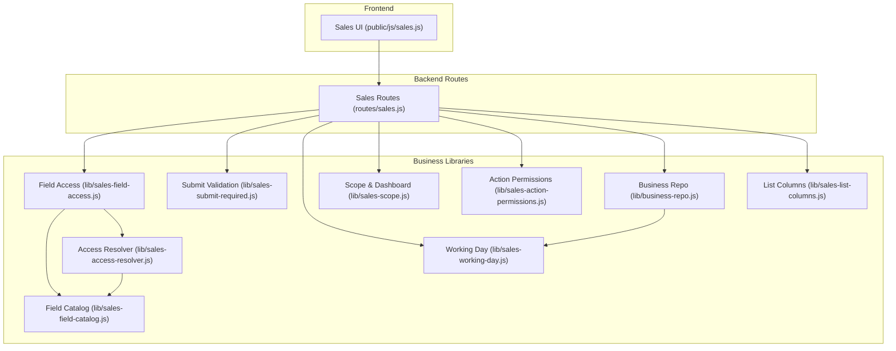
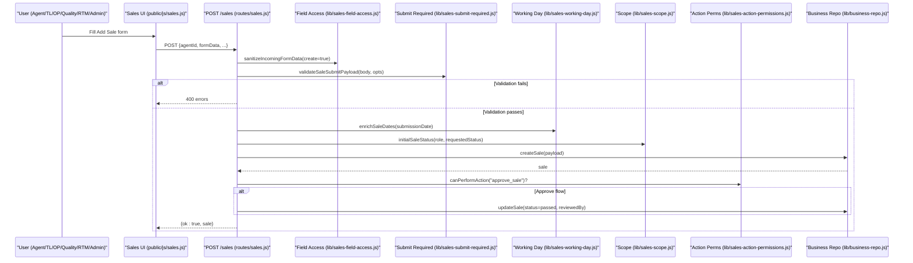
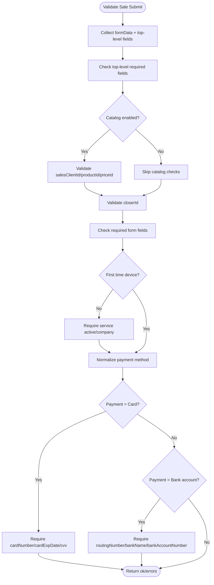
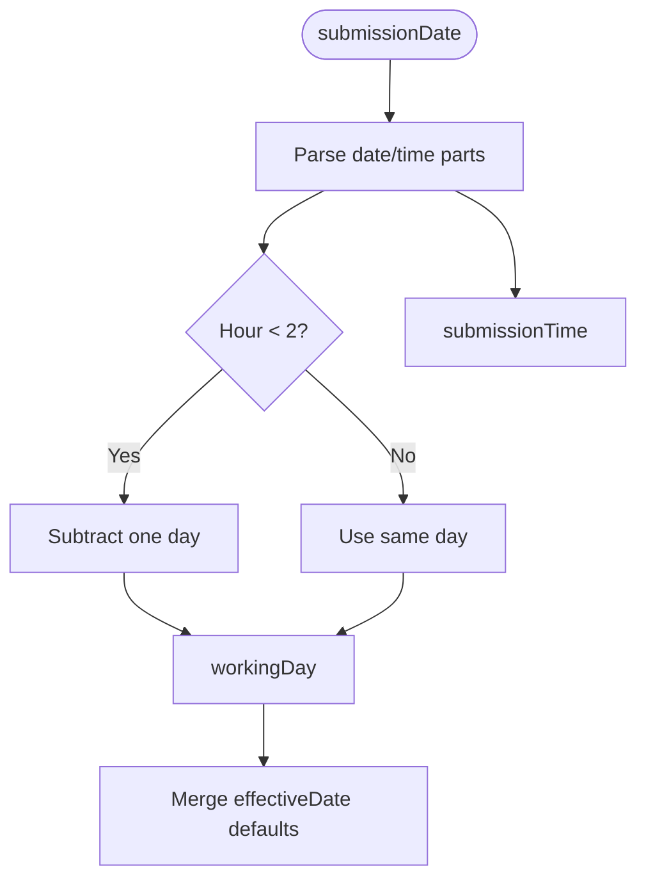
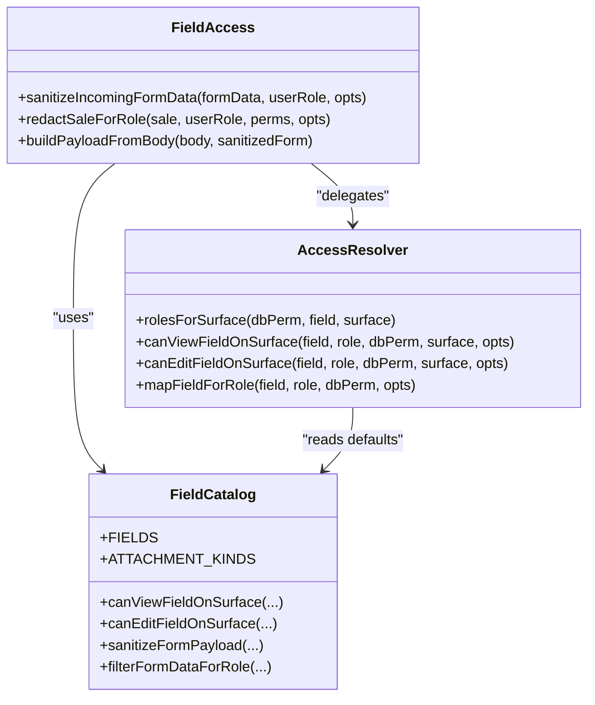
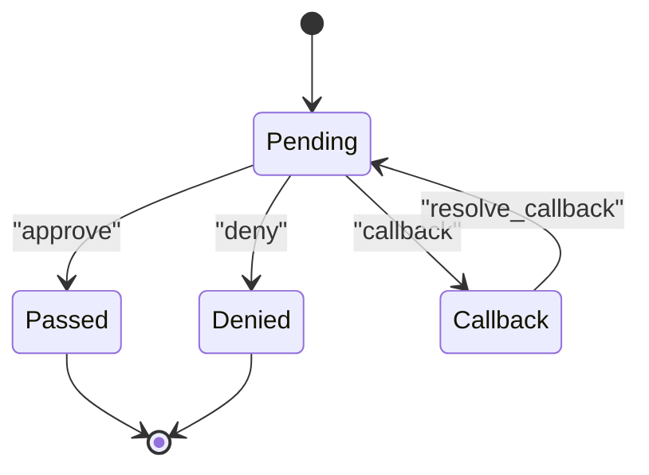
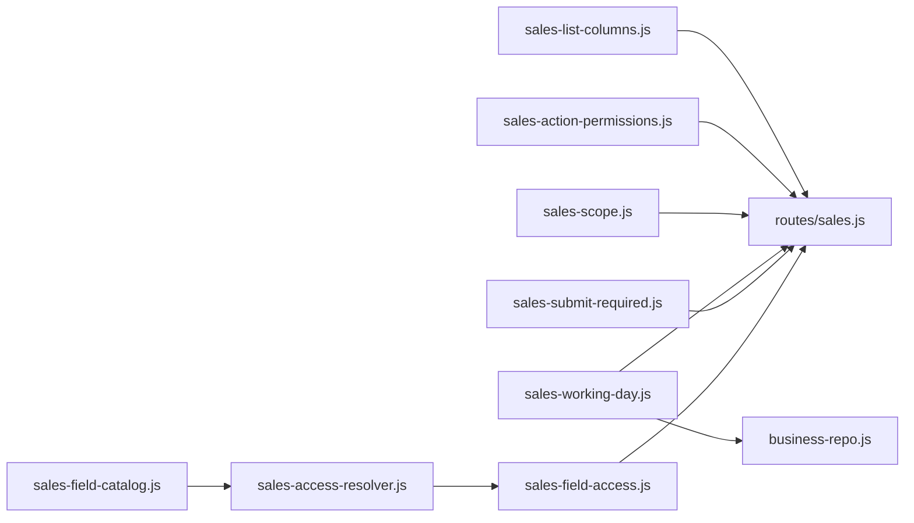

# Sales Record Management

<cite>
**Referenced Files in This Document**
- [sales-field-catalog.js](file://lib/sales-field-catalog.js)
- [sales-access-resolver.js](file://lib/sales-access-resolver.js)
- [sales-field-access.js](file://lib/sales-field-access.js)
- [sales-submit-required.js](file://lib/sales-submit-required.js)
- [sales-working-day.js](file://lib/sales-working-day.js)
- [sales-action-permissions.js](file://lib/sales-action-permissions.js)
- [sales-scope.js](file://lib/sales-scope.js)
- [business-repo.js](file://lib/business-repo.js)
- [sales-list-columns.js](file://lib/sales-list-columns.js)
- [sales.js](file://routes/sales.js)
- [sales.js](file://public/js/sales.js)
- [SALES_LOG.md](file://SALES_LOG.md)
</cite>

## Table of Contents
1. [Introduction](#introduction)
2. [Project Structure](#project-structure)
3. [Core Components](#core-components)
4. [Architecture Overview](#architecture-overview)
5. [Detailed Component Analysis](#detailed-component-analysis)
6. [Dependency Analysis](#dependency-analysis)
7. [Performance Considerations](#performance-considerations)
8. [Troubleshooting Guide](#troubleshooting-guide)
9. [Conclusion](#conclusion)

## Introduction
This document explains the end-to-end lifecycle of a sales record from creation to approval, including MLA-Ray field catalog integration, form validation and submission requirements, working day calculations, role-based field permissions, status management, and audit trail capabilities. It is intended for both technical and non-technical readers who need to understand how sales data flows through the system and how access controls are enforced.

## Project Structure
The sales feature spans backend routes, business logic libraries, and frontend UI:
- Backend route handlers orchestrate create/update/approve workflows, enforce permissions, and persist records.
- Business libraries implement field catalogs, access control, validation, working day rules, and scope filtering.
- Frontend UI renders forms, enforces client-side validation, and manages attachments and filters.

**Diagram sources**
- [sales.js:1-120](file://routes/sales.js#L1-L120)
- [sales-field-catalog.js:1-60](file://lib/sales-field-catalog.js#L1-L60)
- [sales-access-resolver.js:1-60](file://lib/sales-access-resolver.js#L1-L60)
- [sales-field-access.js:1-44](file://lib/sales-field-access.js#L1-L44)
- [sales-submit-required.js:1-40](file://lib/sales-submit-required.js#L1-L40)
- [sales-working-day.js:1-46](file://lib/sales-working-day.js#L1-L46)
- [sales-scope.js:1-44](file://lib/sales-scope.js#L1-L44)
- [sales-list-columns.js:1-32](file://lib/sales-list-columns.js#L1-L32)
- [sales-action-permissions.js:1-30](file://lib/sales-action-permissions.js#L1-L30)
- [business-repo.js:122-171](file://lib/business-repo.js#L122-L171)

**Section sources**
- [sales.js:1-120](file://routes/sales.js#L1-L120)
- [sales-field-catalog.js:1-60](file://lib/sales-field-catalog.js#L1-L60)
- [sales-access-resolver.js:1-60](file://lib/sales-access-resolver.js#L1-L60)
- [sales-field-access.js:1-44](file://lib/sales-field-access.js#L1-L44)
- [sales-submit-required.js:1-40](file://lib/sales-submit-required.js#L1-L40)
- [sales-working-day.js:1-46](file://lib/sales-working-day.js#L1-L46)
- [sales-scope.js:1-44](file://lib/sales-scope.js#L1-L44)
- [sales-list-columns.js:1-32](file://lib/sales-list-columns.js#L1-L32)
- [sales-action-permissions.js:1-30](file://lib/sales-action-permissions.js#L1-L30)
- [business-repo.js:122-171](file://lib/business-repo.js#L122-L171)

## Core Components
- Field catalog and attachment kinds define all MLA-Ray fields, default roles, sensitive flags, and surface-specific visibility/editability.
- Access resolver centralizes per-surface view/edit decisions, including special handling for verifier feedback and quality ticket surfaces.
- Field access layer sanitizes incoming payloads and redacts responses by role and surface.
- Submit validation enforces required fields and conditional payment requirements aligned with MLA Airtable form.
- Working day library computes payroll/dashboards date based on Cairo midnight grace rule.
- Action permissions manage approve/deny/callback actions and their allowed roles.
- Scope and dashboard utilities filter sales by user role and compute counts.
- List columns configuration determines which fields appear in the log view.

**Section sources**
- [sales-field-catalog.js:1-120](file://lib/sales-field-catalog.js#L1-L120)
- [sales-access-resolver.js:1-120](file://lib/sales-access-resolver.js#L1-L120)
- [sales-field-access.js:1-80](file://lib/sales-field-access.js#L1-L80)
- [sales-submit-required.js:1-136](file://lib/sales-submit-required.js#L1-L136)
- [sales-working-day.js:1-82](file://lib/sales-working-day.js#L1-L82)
- [sales-action-permissions.js:1-127](file://lib/sales-action-permissions.js#L1-L127)
- [sales-scope.js:1-120](file://lib/sales-scope.js#L1-L120)
- [sales-list-columns.js:1-32](file://lib/sales-list-columns.js#L1-L32)

## Architecture Overview
The sales lifecycle involves multiple layers enforcing business rules and security:

**Diagram sources**
- [sales.js:466-648](file://routes/sales.js#L466-L648)
- [sales-field-access.js:29-44](file://lib/sales-field-access.js#L29-L44)
- [sales-submit-required.js:67-128](file://lib/sales-submit-required.js#L67-L128)
- [sales-working-day.js:63-73](file://lib/sales-working-day.js#L63-L73)
- [sales-scope.js:89-97](file://lib/sales-scope.js#L89-L97)
- [sales-action-permissions.js:60-70](file://lib/sales-action-permissions.js#L60-L70)
- [business-repo.js:122-171](file://lib/business-repo.js#L122-L171)

## Detailed Component Analysis

### MLA-Ray Field Catalog Integration
- The catalog defines every field key, label, section, type, options, sensitivity, and default roles for view/edit across surfaces (main, quality, edit).
- Attachment kinds define upload/view permissions per kind (recordings, raw calls, quality records, receipts, confirmations).
- Default permissions are seeded into the database and can be overridden per field via DB rows.

Key behaviors:
- System-hidden fields are excluded from rendering and payload processing.
- Payment card/bank keys are recognized to scrub or require specific fields.
- Quality surface has additional hidden fields and extra fields that may be visible.

**Section sources**
- [sales-field-catalog.js:1-120](file://lib/sales-field-catalog.js#L1-L120)
- [sales-field-catalog.js:278-284](file://lib/sales-field-catalog.js#L278-L284)
- [sales-field-catalog.js:396-423](file://lib/sales-field-catalog.js#L396-L423)

### Form Validation Rules and Submission Requirements
- Top-level required fields include agent/closer/unit/team/device/client when applicable.
- On submit, required fields mirror MLA Airtable form; missing values produce actionable error messages.
- Conditional requirements:
  - If first-time device = No, service active/company info is required.
  - Card payment requires card number, expiry, CVV.
  - Bank account payment requires routing number, bank name, account number.
- Client/device/price selection is validated against the catalog if configured.

**Diagram sources**
- [sales-submit-required.js:67-128](file://lib/sales-submit-required.js#L67-L128)

**Section sources**
- [sales-submit-required.js:1-136](file://lib/sales-submit-required.js#L1-L136)

### Working Day Calculations and Relationship to Sales Records
- Working day rule: submissions before 2:00 AM Cairo count on the previous calendar day for payroll and dashboards.
- Enrichment functions compute working day and submission time from submissionDate.
- Business mapping ensures workingDay and submissionTime are available on read.

**Diagram sources**
- [sales-working-day.js:42-73](file://lib/sales-working-day.js#L42-L73)
- [business-repo.js:129-171](file://lib/business-repo.js#L129-L171)

**Section sources**
- [sales-working-day.js:1-82](file://lib/sales-working-day.js#L1-L82)
- [business-repo.js:129-171](file://lib/business-repo.js#L129-L171)

### Field-Level Permissions System
- Roles supported: agent, tl, op, quality, rtm, admin (plus hr/finance/ceo where applicable).
- Permission model:
  - Each field defines default viewRoles and editRoles.
  - Surface-specific overrides: main_view_roles, quality_view_roles, edit_roles.
  - Special rules for verifierFeedback and clientFeedback editing.
- Resolution:
  - Access resolver computes canView/canEdit per field and surface.
  - Field access layer sanitizes inputs and redacts outputs accordingly.
  - Quality ticket surface restricts certain fields but allows quality-section fields and extras.

**Diagram sources**
- [sales-field-catalog.js:295-366](file://lib/sales-field-catalog.js#L295-L366)
- [sales-access-resolver.js:132-178](file://lib/sales-access-resolver.js#L132-L178)
- [sales-field-access.js:29-73](file://lib/sales-field-access.js#L29-L73)

**Section sources**
- [sales-field-catalog.js:1-120](file://lib/sales-field-catalog.js#L1-L120)
- [sales-access-resolver.js:1-178](file://lib/sales-access-resolver.js#L1-L178)
- [sales-field-access.js:1-80](file://lib/sales-field-access.js#L1-L80)

### Status Management and Approval Workflow
- Initial status depends on submitter role and whether they can approve directly.
- Actions:
  - Approve: set status to passed and mark reviewedBy.
  - Deny: set status to denied with feedback.
  - Callback: set status to callback with optional feedback and visibility flag.
  - Resolve callback: return to pending.
- Action permissions table governs who can perform approve/deny/callback.

**Diagram sources**
- [sales.js:684-702](file://routes/sales.js#L684-L702)
- [sales-scope.js:89-97](file://lib/sales-scope.js#L89-L97)
- [sales-action-permissions.js:7-13](file://lib/sales-action-permissions.js#L7-L13)

**Section sources**
- [sales.js:684-702](file://routes/sales.js#L684-L702)
- [sales-scope.js:89-97](file://lib/sales-scope.js#L89-L97)
- [sales-action-permissions.js:1-127](file://lib/sales-action-permissions.js#L1-L127)

### Sales Log Tracking and Audit Trail Capabilities
- The sales log tracks submissions, quality review, and client feedback.
- Fields and list columns are configurable; synthetic columns show working day and submission time.
- Audit trail elements:
  - reviewedBy/reviewedAt on approvals/denials.
  - submittedBy on creation.
  - Feedback fields capture reviewer and client statuses.
  - Attachments (recordings, receipts, confirmations) provide evidence.
- Admin setup includes resetting defaults for permissions and log columns.

**Section sources**
- [SALES_LOG.md:1-131](file://SALES_LOG.md#L1-L131)
- [sales-list-columns.js:1-32](file://lib/sales-list-columns.js#L1-L32)
- [business-repo.js:129-171](file://lib/business-repo.js#L129-L171)

### Examples: Creation, Validation, and Status Management
- Example: Agent submits a sale with Card payment.
  - Frontend collects formData and top-level fields.
  - Server sanitizes input, validates required fields, checks duplicate phone+agent within window, computes working day, sets initial status to pending, persists sale, and returns redacted response.
- Example: TL/OP edits sale and assigns verifier.
  - Server validates assignee presence and status, scrubs payment fields based on method, updates formData, and notifies assigned parties.
- Example: Quality/RTM approves sale.
  - Server checks action permissions, updates status to passed, records reviewedBy, and triggers downstream sync.

These examples align with the route handlers and validation/access libraries referenced above.

**Section sources**
- [sales.js:466-648](file://routes/sales.js#L466-L648)
- [sales.js:671-800](file://routes/sales.js#L671-L800)
- [sales-submit-required.js:67-128](file://lib/sales-submit-required.js#L67-L128)
- [sales-field-access.js:29-73](file://lib/sales-field-access.js#L29-L73)

## Dependency Analysis
High-level dependencies among core modules:

**Diagram sources**
- [sales-field-catalog.js:1-60](file://lib/sales-field-catalog.js#L1-L60)
- [sales-access-resolver.js:1-60](file://lib/sales-access-resolver.js#L1-L60)
- [sales-field-access.js:1-44](file://lib/sales-field-access.js#L1-L44)
- [sales-submit-required.js:1-40](file://lib/sales-submit-required.js#L1-L40)
- [sales-working-day.js:1-46](file://lib/sales-working-day.js#L1-L46)
- [sales-scope.js:1-44](file://lib/sales-scope.js#L1-L44)
- [sales-action-permissions.js:1-30](file://lib/sales-action-permissions.js#L1-L30)
- [sales-list-columns.js:1-32](file://lib/sales-list-columns.js#L1-L32)
- [business-repo.js:122-171](file://lib/business-repo.js#L122-L171)
- [sales.js:1-120](file://routes/sales.js#L1-L120)

**Section sources**
- [sales-field-catalog.js:1-60](file://lib/sales-field-catalog.js#L1-L60)
- [sales-access-resolver.js:1-60](file://lib/sales-access-resolver.js#L1-L60)
- [sales-field-access.js:1-44](file://lib/sales-field-access.js#L1-L44)
- [sales-submit-required.js:1-40](file://lib/sales-submit-required.js#L1-L40)
- [sales-working-day.js:1-46](file://lib/sales-working-day.js#L1-L46)
- [sales-scope.js:1-44](file://lib/sales-scope.js#L1-L44)
- [sales-action-permissions.js:1-30](file://lib/sales-action-permissions.js#L1-L30)
- [sales-list-columns.js:1-32](file://lib/sales-list-columns.js#L1-L32)
- [business-repo.js:122-171](file://lib/business-repo.js#L122-L171)
- [sales.js:1-120](file://routes/sales.js#L1-L120)

## Performance Considerations
- Caching:
  - Field permissions map cached for 60 seconds to reduce DB reads.
  - Action permissions map cached similarly.
- Redaction and sanitization operate over defined field lists; avoid unnecessary large payloads.
- Working day computations are lightweight and deterministic.
- Duplicate submission guard prevents redundant writes and reduces load.

[No sources needed since this section provides general guidance]

## Troubleshooting Guide
Common issues and resolutions:
- Missing required fields on submit:
  - Ensure all required fields are present and payment fields match selected method.
- Invalid unit/team combination:
  - Verify team exists under the selected unit and supports dialing sales.
- Assignee out of status:
  - Reviewer or Verifier must not be marked out; reassign to an active employee.
- Double submit detected:
  - A recent duplicate sale for the same phone+agent was found; use existing sale ID.
- Permission denied to approve/deny/callback:
  - Confirm action permissions allow your role; check sales_action_permissions configuration.
- Working day mismatch:
  - Submissions before 2:00 AM Cairo count on the previous day; verify submissionDate and workingDay.

**Section sources**
- [sales.js:466-648](file://routes/sales.js#L466-L648)
- [sales.js:671-800](file://routes/sales.js#L671-L800)
- [sales-submit-required.js:67-128](file://lib/sales-submit-required.js#L67-L128)
- [sales-action-permissions.js:60-70](file://lib/sales-action-permissions.js#L60-L70)
- [sales-working-day.js:42-73](file://lib/sales-working-day.js#L42-L73)

## Conclusion
The sales record management system integrates MLA-Ray field definitions, robust validation, role-based field permissions, and clear status workflows. Working day calculations ensure accurate payroll and dashboard reporting. The design separates concerns between catalog definition, access resolution, route orchestration, and persistence, enabling maintainable evolution and clear auditing.