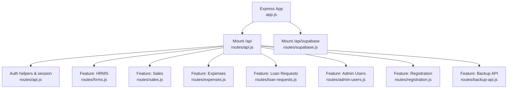
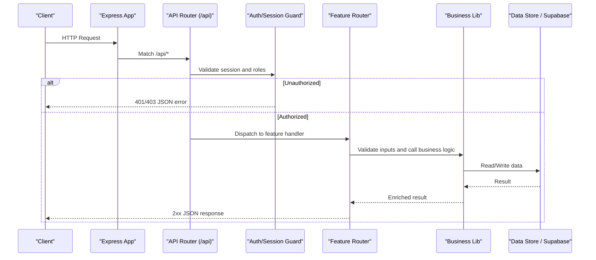
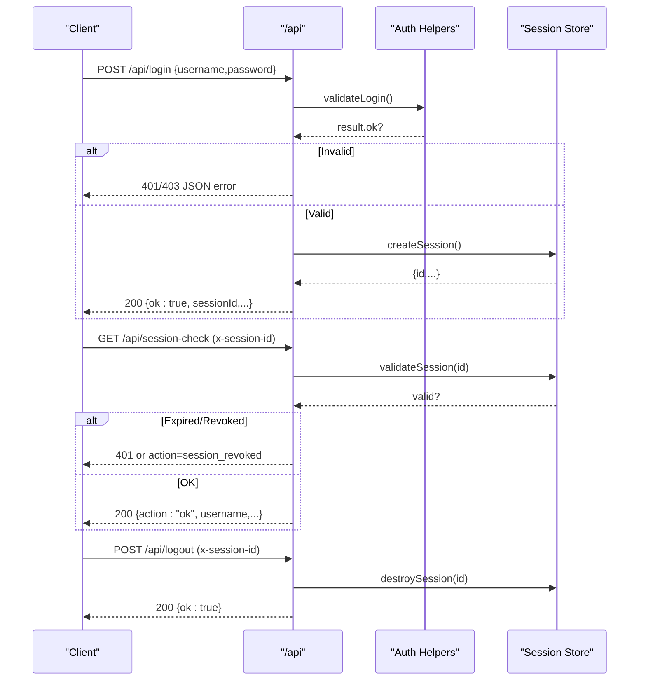
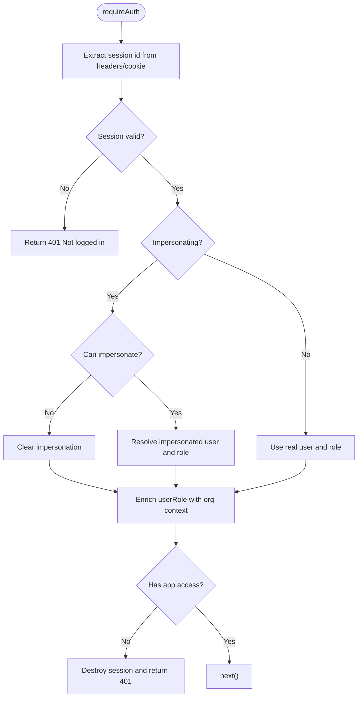
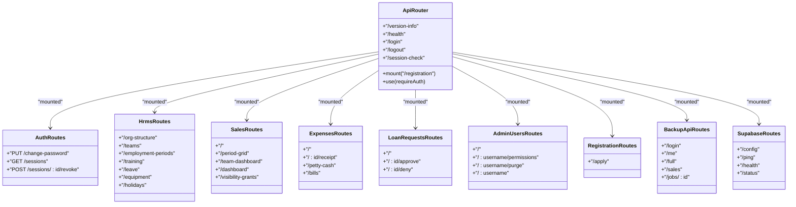
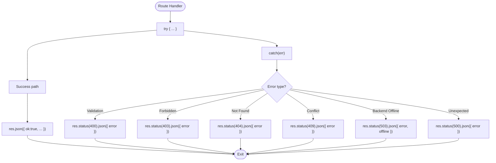
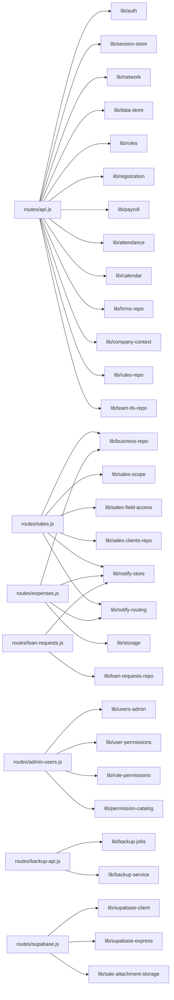

# API Route Organization

<cite>
**Referenced Files in This Document**
- [app.js](file://app.js)
- [routes/api.js](file://routes/api.js)
- [routes/auth-routes.js](file://routes/auth-routes.js)
- [routes/hrms.js](file://routes/hrms.js)
- [routes/sales.js](file://routes/sales.js)
- [routes/backup-api.js](file://routes/backup-api.js)
- [routes/admin-users.js](file://routes/admin-users.js)
- [routes/expenses.js](file://routes/expenses.js)
- [routes/loan-requests.js](file://routes/loan-requests.js)
- [routes/registration.js](file://routes/registration.js)
- [routes/supabase.js](file://routes/supabase.js)
</cite>

## Table of Contents
1. [Introduction](#introduction)
2. [Project Structure](#project-structure)
3. [Core Components](#core-components)
4. [Architecture Overview](#architecture-overview)
5. [Detailed Component Analysis](#detailed-component-analysis)
6. [Dependency Analysis](#dependency-analysis)
7. [Performance Considerations](#performance-considerations)
8. [Troubleshooting Guide](#troubleshooting-guide)
9. [Conclusion](#conclusion)
10. [Appendices](#appendices)

## Introduction
This document explains the API routing architecture and organization patterns used across the application. It focuses on how routes are grouped by feature domain (auth, hrms, sales, backup, etc.), mounted under /api/* prefixes, and how requests flow through authentication, authorization, validation, business logic, and response formatting. It also details error handling strategies, logging patterns, and provides guidance for creating new API routes following established conventions and RESTful design principles.

## Project Structure
The Express application mounts a primary API router at /api and a separate Supabase diagnostic router at /api/supabase. Feature-specific route modules are organized under the routes directory and mounted within the main API router or directly under /api as needed.

**Diagram sources**
- [app.js:21-22](file://app.js#L21-L22)
- [routes/api.js:629](file://routes/api.js#L629)
- [routes/hrms.js:15](file://routes/hrms.js#L15)
- [routes/sales.js:24](file://routes/sales.js#L24)
- [routes/expenses.js:8](file://routes/expenses.js#L8)
- [routes/loan-requests.js:7](file://routes/loan-requests.js#L7)
- [routes/admin-users.js:10](file://routes/admin-users.js#L10)
- [routes/registration.js:4](file://routes/registration.js#L4)
- [routes/backup-api.js:11](file://routes/backup-api.js#L11)

**Section sources**
- [app.js:1-56](file://app.js#L1-L56)

## Core Components
- Application bootstrap and middleware:
  - JSON body parsing with size limit
  - Session management with httpOnly cookies
  - Static file serving
  - Global error handler returning JSON errors
- Primary API router:
  - Centralized auth/session utilities
  - Mounting of sub-feature routers
  - Shared request/response helpers and guards
- Feature routers:
  - Auth-related endpoints (password change, sessions)
  - HRMS endpoints (org structure, teams, training, leave, equipment)
  - Sales endpoints (list, submit, approve/deny, dashboards)
  - Expenses endpoints (submit, approve/deny, receipts, petty cash)
  - Loan requests endpoints (submit, approve/deny)
  - Admin users endpoints (CRUD, permissions)
  - Registration endpoint (PIN-based registration)
  - Backup API endpoints (job control, status)
  - Supabase diagnostics endpoints (config, health, status)

Key responsibilities:
- Authentication and session lifecycle
- Role-based access control (RBAC) enforcement
- Request validation and normalization
- Business logic delegation to lib modules
- Consistent JSON responses and error shapes
- Audit and notification side effects

**Section sources**
- [app.js:10-41](file://app.js#L10-L41)
- [routes/api.js:84-145](file://routes/api.js#L84-L145)
- [routes/api.js:552-627](file://routes/api.js#L552-L627)
- [routes/api.js:629](file://routes/api.js#L629)

## Architecture Overview
The API follows a layered pattern:
- HTTP layer (Express): routing, middleware, request parsing
- Security layer: session validation, role checks, impersonation support
- Validation layer: input sanitization and business rule checks
- Domain layer: feature routers delegating to lib modules
- Persistence layer: data-store and Supabase clients
- Side effects: notifications, audit logs, cache refreshes

**Diagram sources**
- [app.js:21-22](file://app.js#L21-L22)
- [routes/api.js:84-145](file://routes/api.js#L84-L145)
- [routes/api.js:552-627](file://routes/api.js#L552-L627)

## Detailed Component Analysis

### Authentication and Session Lifecycle
- Login flow:
  - POST /api/login validates credentials, enforces version policy, creates session, returns sessionId and appVersion
  - On success, sets cookie; client must include x-session-id header for subsequent requests
- Session check:
  - GET /api/session-check verifies session validity, updates role if changed, returns user capabilities and optional settings revision
- Logout:
  - POST /api/logout destroys server-side session and clears cookie

**Diagram sources**
- [routes/api.js:552-627](file://routes/api.js#L552-L627)
- [routes/api.js:631-697](file://routes/api.js#L631-L697)
- [routes/api.js:623-627](file://routes/api.js#L623-L627)

**Section sources**
- [routes/api.js:552-627](file://routes/api.js#L552-L627)
- [routes/api.js:631-697](file://routes/api.js#L631-L697)
- [routes/api.js:623-627](file://routes/api.js#L623-L627)

### Authorization and Impersonation
- requireAuth middleware:
  - Extracts session from x-session-id header or cookie
  - Validates session and applies impersonation rules when allowed
  - Resolves enriched userRole including unit/team/employeeId and capability flags
  - Rejects revoked access and destroys session accordingly

**Diagram sources**
- [routes/api.js:90-145](file://routes/api.js#L90-L145)

**Section sources**
- [routes/api.js:90-145](file://routes/api.js#L90-L145)

### Feature Routers and Domain Boundaries
- Auth module:
  - Password change and session management endpoints
  - Requires authenticated session and admin privileges for session listing/revocation
- HRMS module:
  - Org structure, teams, employment periods, training programs, leave requests, equipment, holidays
  - Uses RBAC extensively and requires Supabase backend for many operations
- Sales module:
  - Listing, submission, approval workflows, dashboards, period grids, visibility grants
  - Strong field-level redaction and catalog-driven validation
- Expenses module:
  - Submission, approval/denial, receipt upload, petty cash ledger, monthly bills
  - Audits edits and deletions
- Loan requests module:
  - Submission by HR/Admin, executive approval/denial, notifications
- Admin users module:
  - User CRUD, permission overrides, employee sync, purge/delete
- Registration module:
  - PIN-based registration submission
- Backup API module:
  - Separate auth scope (Admin/RTM), job orchestration for full/sales backups
- Supabase diagnostics module:
  - Public config, publishable-key ping, secret-key health, status probe

**Diagram sources**
- [routes/api.js:629](file://routes/api.js#L629)
- [routes/auth-routes.js:11-61](file://routes/auth-routes.js#L11-L61)
- [routes/hrms.js:24-800](file://routes/hrms.js#L24-L800)
- [routes/sales.js:246-800](file://routes/sales.js#L246-L800)
- [routes/expenses.js:43-343](file://routes/expenses.js#L43-L343)
- [routes/loan-requests.js:9-146](file://routes/loan-requests.js#L9-L146)
- [routes/admin-users.js:24-157](file://routes/admin-users.js#L24-L157)
- [routes/registration.js:6-37](file://routes/registration.js#L6-L37)
- [routes/backup-api.js:48-127](file://routes/backup-api.js#L48-L127)
- [routes/supabase.js:15-122](file://routes/supabase.js#L15-L122)

**Section sources**
- [routes/auth-routes.js:11-61](file://routes/auth-routes.js#L11-L61)
- [routes/hrms.js:24-800](file://routes/hrms.js#L24-L800)
- [routes/sales.js:246-800](file://routes/sales.js#L246-L800)
- [routes/expenses.js:43-343](file://routes/expenses.js#L43-L343)
- [routes/loan-requests.js:9-146](file://routes/loan-requests.js#L9-L146)
- [routes/admin-users.js:24-157](file://routes/admin-users.js#L24-L157)
- [routes/registration.js:6-37](file://routes/registration.js#L6-L37)
- [routes/backup-api.js:48-127](file://routes/backup-api.js#L48-L127)
- [routes/supabase.js:15-122](file://routes/supabase.js#L15-L122)

### Request/Response Lifecycle and Standards
- Request parsing:
  - JSON bodies parsed up to 20MB
  - Sessions stored in cookies with httpOnly flag
- Parameter validation:
  - Each route performs explicit validation and returns 400 with descriptive messages
  - Some routes use dedicated validators (e.g., sales payment form, unit/team validation)
- Response formatting:
  - Success responses typically return { ok: true, ...data } or resource objects
  - Error responses return { error: "..." } with appropriate HTTP status codes
- Status codes:
  - 200 for successful reads/updates
  - 201 for created resources
  - 400 for validation failures
  - 401 for unauthenticated
  - 403 for insufficient permissions
  - 404 for not found
  - 409 for conflicts (e.g., duplicate sale)
  - 500 for unexpected server errors
  - 503 for offline/backend unavailable

**Section sources**
- [app.js:10-21](file://app.js#L10-L21)
- [routes/api.js:552-627](file://routes/api.js#L552-L627)
- [routes/sales.js:466-648](file://routes/sales.js#L466-L648)
- [routes/expenses.js:66-101](file://routes/expenses.js#L66-L101)
- [routes/loan-requests.js:34-70](file://routes/loan-requests.js#L34-L70)

### Error Handling Strategies and Logging Patterns
- Global error handler:
  - Catches unhandled exceptions, logs to console.error, and responds with 500 JSON
- Per-route try/catch:
  - Most handlers wrap logic in try/catch and respond with 400/500 JSON errors
- Offline/backend checks:
  - Health and login endpoints detect connectivity and backend availability, returning 503 with offline hints
- Audit and notifications:
  - Many mutations trigger audit notifications and user notifications via lib modules

**Diagram sources**
- [app.js:36-41](file://app.js#L36-L41)
- [routes/api.js:552-627](file://routes/api.js#L552-L627)
- [routes/sales.js:466-648](file://routes/sales.js#L466-L648)
- [routes/expenses.js:66-101](file://routes/expenses.js#L66-L101)

**Section sources**
- [app.js:36-41](file://app.js#L36-L41)
- [routes/api.js:552-627](file://routes/api.js#L552-L627)
- [routes/sales.js:466-648](file://routes/sales.js#L466-L648)
- [routes/expenses.js:66-101](file://routes/expenses.js#L66-L101)

### Creating New API Routes: Conventions and Best Practices
- File organization:
  - Create a new file under routes/ named after the feature domain
  - Export an Express.Router instance
- Mounting:
  - In routes/api.js, mount your router under /api/<feature> using router.use("/<feature>", require("./routes/<feature>"))
  - If it needs its own auth scope (like backup), mount it similarly and implement its own guard
- Authentication and authorization:
  - For standard features, rely on requireAuth middleware already applied in api.js
  - For special scopes (e.g., backup), implement a custom guard similar to requireBackupAuth
- Input validation:
  - Validate required fields early and return 400 with clear messages
  - Normalize inputs (e.g., payment method normalization) before business logic
- Business logic:
  - Delegate to lib modules for persistence and complex calculations
- Responses:
  - Use consistent JSON shapes: { ok: true, ...data } for mutations; resource objects for reads
  - Use proper HTTP status codes (201 for creation, 400/403/404/409/500/503 as applicable)
- Side effects:
  - Emit notifications and audit events where relevant
  - Refresh caches or recalculate aggregates when necessary
- Error handling:
  - Wrap handler logic in try/catch and map errors to appropriate statuses
  - Ensure global error handler is present for unhandled cases

Example mounting snippet path:
- [routes/api.js:629](file://routes/api.js#L629)

Example custom auth guard pattern:
- [routes/backup-api.js:24-37](file://routes/backup-api.js#L24-L37)

**Section sources**
- [routes/api.js:629](file://routes/api.js#L629)
- [routes/backup-api.js:24-37](file://routes/backup-api.js#L24-L37)

## Dependency Analysis
High-level dependencies between route modules and shared libraries:
- routes/api.js depends on:
  - lib/auth, lib/session-store, lib/network, lib/cache, lib/data-store, lib/roles, lib/role-permissions, lib/permission-catalog, lib/registration, lib/app-version, lib/version-sheet, lib/attendance, lib/payroll, lib/calendar, lib/id-generator, lib/hrms-repo, lib/payroll-gates, lib/backend, lib/company-context, lib/companies-repo, lib/rules-repo, lib/team-tls-repo
- Feature routers depend on:
  - lib/business-repo, lib/roles, lib/data-store, lib/notify-store, lib/notify-routing, lib/storage, lib/hrms-repo, lib/supabase-client, lib/supabase-express, lib/sale-attachment-storage, lib/sales-scope, lib/sales-field-access, lib/sales-clients-repo, lib/break-schedules-repo, lib/settings-revision, lib/loan-requests-repo, lib/registration

**Diagram sources**
- [routes/api.js:1-43](file://routes/api.js#L1-L43)
- [routes/sales.js:1-23](file://routes/sales.js#L1-L23)
- [routes/expenses.js:1-7](file://routes/expenses.js#L1-L7)
- [routes/loan-requests.js:1-6](file://routes/loan-requests.js#L1-L6)
- [routes/admin-users.js:1-9](file://routes/admin-users.js#L1-L9)
- [routes/backup-api.js:1-10](file://routes/backup-api.js#L1-L10)
- [routes/supabase.js:1-11](file://routes/supabase.js#L1-L11)

**Section sources**
- [routes/api.js:1-43](file://routes/api.js#L1-L43)
- [routes/sales.js:1-23](file://routes/sales.js#L1-L23)
- [routes/expenses.js:1-7](file://routes/expenses.js#L1-L7)
- [routes/loan-requests.js:1-6](file://routes/loan-requests.js#L1-L6)
- [routes/admin-users.js:1-9](file://routes/admin-users.js#L1-L9)
- [routes/backup-api.js:1-10](file://routes/backup-api.js#L1-L10)
- [routes/supabase.js:1-11](file://routes/supabase.js#L1-L11)

## Performance Considerations
- Avoid heavy synchronous operations inside route handlers; delegate to async lib functions
- Batch operations where possible (e.g., building payroll bundles)
- Use caching layers (store.getEmployees, store.buildAttendanceMap) to reduce repeated computations
- Keep payload sizes reasonable; note the 20MB JSON limit
- Prefer streaming for large file downloads (see expense receipt stream)

[No sources needed since this section provides general guidance]

## Troubleshooting Guide
- Common HTTP statuses and their meanings:
  - 400: Missing or invalid parameters; review request body and validation rules
  - 401: Unauthenticated; ensure x-session-id is set and session is valid
  - 403: Forbidden; verify role and permissions for the requested action
  - 404: Resource not found; confirm IDs and existence
  - 409: Conflict; e.g., duplicate sale submission
  - 500: Unexpected server error; check server logs and route try/catch blocks
  - 503: Offline or backend unavailable; check network and Supabase configuration
- Diagnostic endpoints:
  - /api/health: overall service health and backend reachability
  - /api/supabase/config, /api/supabase/health, /api/supabase/status: Supabase environment and connectivity checks

**Section sources**
- [routes/api.js:525-550](file://routes/api.js#L525-L550)
- [routes/supabase.js:15-122](file://routes/supabase.js#L15-L122)

## Conclusion
The API is organized by feature domains with clear separation of concerns, robust authentication and authorization, consistent validation and response formats, and comprehensive error handling. Following the conventions outlined here will help maintain consistency, security, and scalability as new features are added.

[No sources needed since this section summarizes without analyzing specific files]

## Appendices

### Example: Adding a New Feature Router
- Create routes/my-feature.js exporting an Express.Router
- Add validation and RBAC checks at the start of each handler
- Delegate to lib modules for persistence and business logic
- Return standardized JSON responses with correct status codes
- Mount in routes/api.js under /api/my-feature using router.use("/my-feature", require("./routes/my-feature"))

Reference mounting location:
- [routes/api.js:629](file://routes/api.js#L629)

**Section sources**
- [routes/api.js:629](file://routes/api.js#L629)