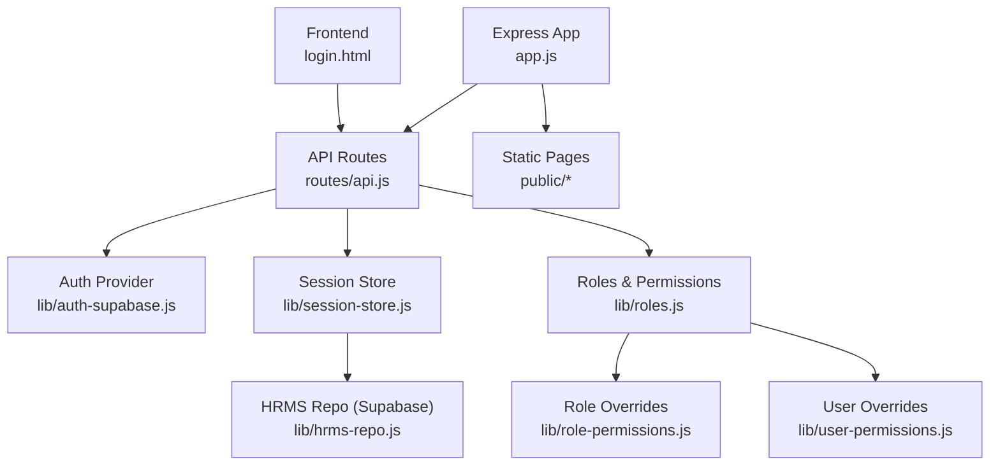
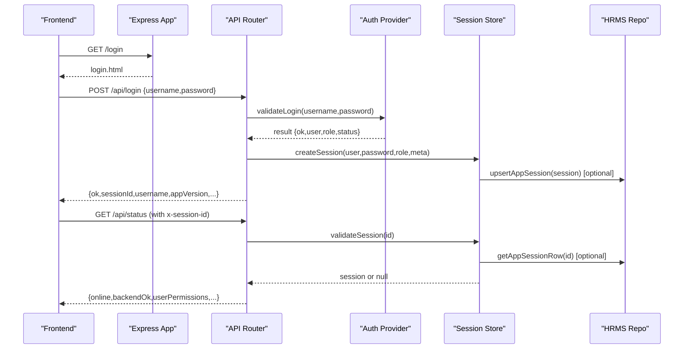
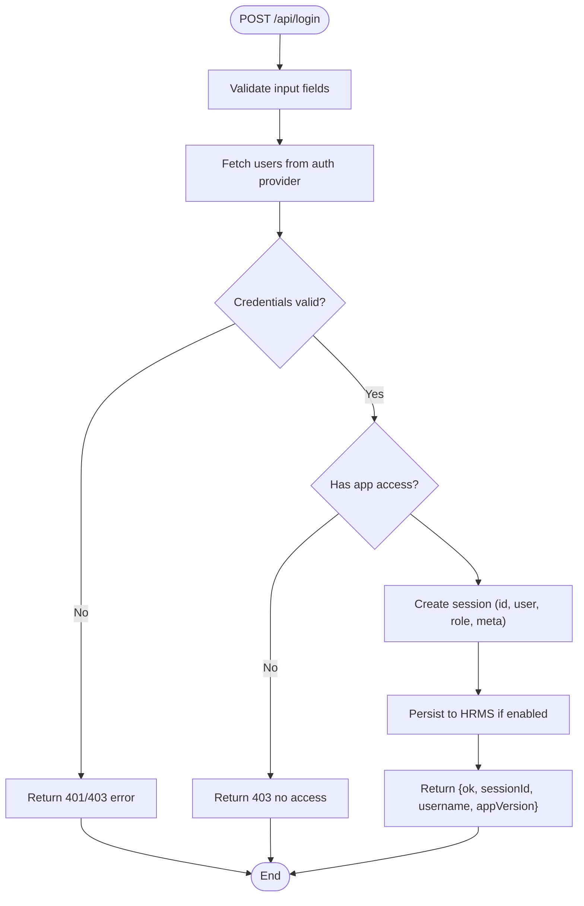
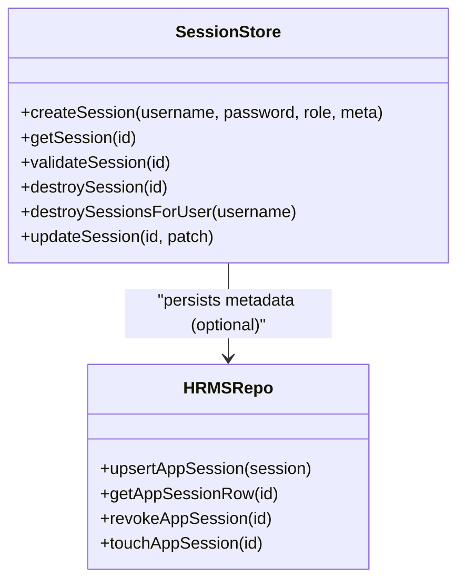
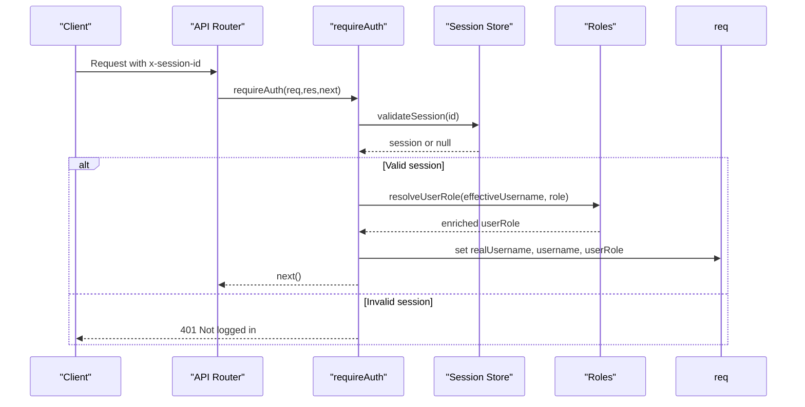
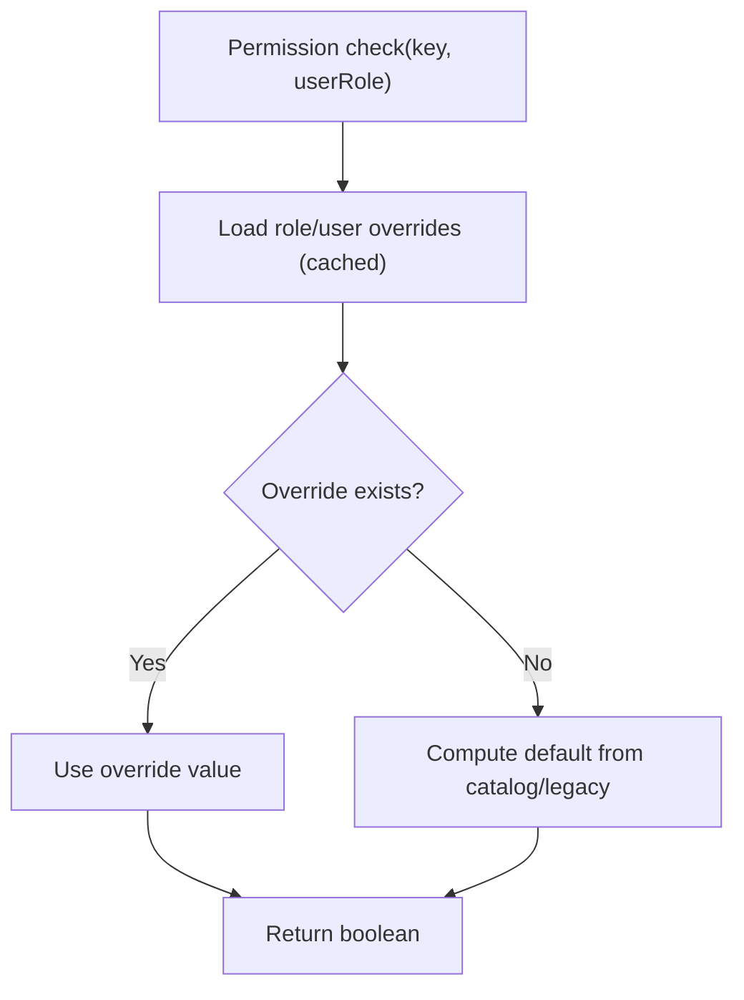
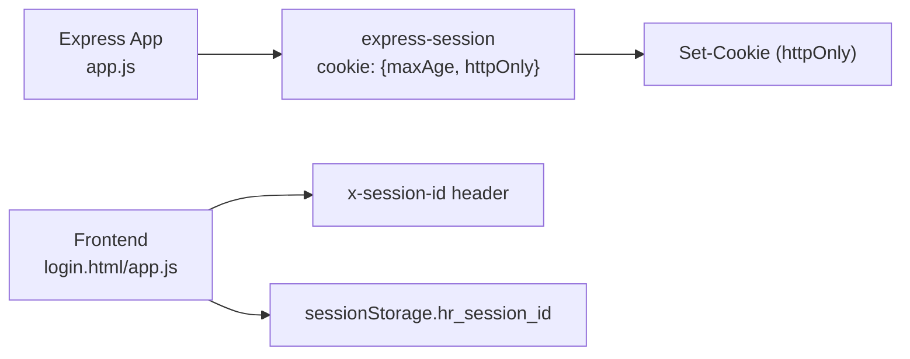
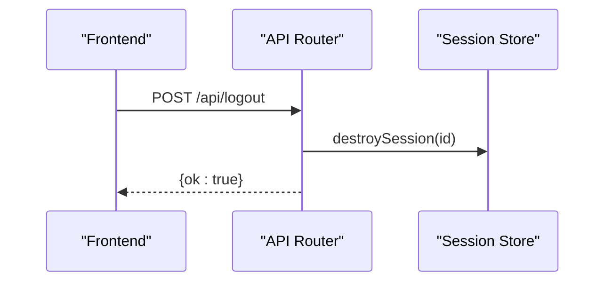
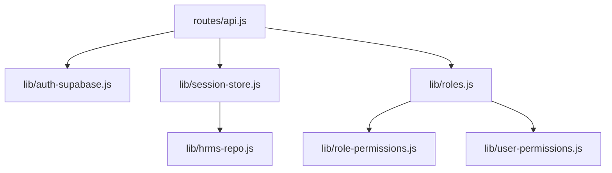

# Authentication & Session Management

<cite>
**Referenced Files in This Document**
- [app.js](file://app.js)
- [api.js](file://routes/api.js)
- [auth-supabase.js](file://lib/auth-supabase.js)
- [session-store.js](file://lib/session-store.js)
- [roles.js](file://lib/roles.js)
- [role-permissions.js](file://lib/role-permissions.js)
- [user-permissions.js](file://lib/user-permissions.js)
- [hrms-repo.js](file://lib/hrms-repo.js)
- [login.html](file://public/login.html)
- [package-lock.json](file://package-lock.json)
</cite>

## Table of Contents
1. [Introduction](#introduction)
2. [Project Structure](#project-structure)
3. [Core Components](#core-components)
4. [Architecture Overview](#architecture-overview)
5. [Detailed Component Analysis](#detailed-component-analysis)
6. [Dependency Analysis](#dependency-analysis)
7. [Performance Considerations](#performance-considerations)
8. [Troubleshooting Guide](#troubleshooting-guide)
9. [Conclusion](#conclusion)
10. [Appendices](#appendices)

## Introduction
This document explains the authentication and session management system used by the application. It covers:
- Login flow from the frontend to the backend
- Session creation, validation, and persistence (in-memory with optional Supabase persistence)
- Middleware chain for protecting API endpoints and injecting user context
- Role-based access control and permission overrides
- Security considerations including cookie configuration, session hijacking prevention, and CSRF guidance
- Extensibility points for custom authentication providers and role/permission extensions

Note: The system does not use JWT tokens; it uses server-side sessions identified by a session ID stored client-side and passed via headers or cookies.

## Project Structure
The authentication and session subsystem spans several modules:
- Express app setup and session middleware
- API routes handling login/logout and protected endpoints
- Authentication provider (Supabase-backed)
- Session store (in-memory + optional persistent store)
- Roles and permissions (defaults, role overrides, per-user overrides)
- Frontend login page and session handling

**Diagram sources**
- [app.js:1-56](file://app.js#L1-L56)
- [api.js:552-627](file://routes/api.js#L552-L627)
- [auth-supabase.js:1-73](file://lib/auth-supabase.js#L1-L73)
- [session-store.js:1-83](file://lib/session-store.js#L1-L83)
- [roles.js:1-128](file://lib/roles.js#L1-L128)
- [role-permissions.js:1-159](file://lib/role-permissions.js#L1-L159)
- [user-permissions.js:1-127](file://lib/user-permissions.js#L1-L127)
- [hrms-repo.js:1-200](file://lib/hrms-repo.js#L1-L200)

**Section sources**
- [app.js:1-56](file://app.js#L1-L56)
- [api.js:552-627](file://routes/api.js#L552-L627)

## Core Components
- Authentication provider: fetches users, validates credentials, checks account status, and supports password hashing.
- Session store: creates, validates, and destroys sessions; persists metadata when Supabase is enabled.
- API middleware: enforces authentication, resolves effective user identity (including impersonation), and enriches request context with roles and permissions.
- Roles and permissions: defines default role matrix, role aliases, and allows DB-backed overrides at both role and per-user levels.
- Frontend login: submits credentials, stores session ID, and handles versioning notices and termination flows.

Key responsibilities:
- Credentials verification against Supabase-backed user table
- Server-side session lifecycle with optional persistence
- Authorization checks using roles and permission overrides
- User context injection into requests for downstream handlers

**Section sources**
- [auth-supabase.js:1-73](file://lib/auth-supabase.js#L1-L73)
- [session-store.js:1-83](file://lib/session-store.js#L1-L83)
- [api.js:90-145](file://routes/api.js#L90-L145)
- [roles.js:1-128](file://lib/roles.js#L1-L128)
- [role-permissions.js:1-159](file://lib/role-permissions.js#L1-L159)
- [user-permissions.js:1-127](file://lib/user-permissions.js#L1-L127)
- [login.html:360-418](file://public/login.html#L360-L418)

## Architecture Overview
The system uses a traditional server-side session model rather than stateless JWTs. The frontend maintains a session ID and sends it with each request. The backend validates the session, enforces authorization, and injects user context.

**Diagram sources**
- [api.js:552-627](file://routes/api.js#L552-L627)
- [auth-supabase.js:24-47](file://lib/auth-supabase.js#L24-L47)
- [session-store.js:8-24](file://lib/session-store.js#L8-L24)
- [hrms-repo.js:1-200](file://lib/hrms-repo.js#L1-L200)

## Detailed Component Analysis

### Login Flow
- The login page posts credentials to the login endpoint.
- The server verifies credentials via the auth provider, checks account status and app access, then creates a session.
- The response includes a sessionId that the frontend stores and sends with subsequent requests.

**Diagram sources**
- [api.js:552-627](file://routes/api.js#L552-L627)
- [auth-supabase.js:24-47](file://lib/auth-supabase.js#L24-L47)
- [session-store.js:8-24](file://lib/session-store.js#L8-L24)

**Section sources**
- [login.html:360-418](file://public/login.html#L360-L418)
- [api.js:552-627](file://routes/api.js#L552-L627)
- [auth-supabase.js:24-47](file://lib/auth-supabase.js#L24-L47)
- [session-store.js:8-24](file://lib/session-store.js#L8-L24)

### Session Storage Strategy
- In-memory Map holds active sessions for fast lookup.
- Optional Supabase persistence stores session metadata and supports revocation and idle timeout enforcement.
- Validation synchronizes with persistent store when available, revoking expired or revoked sessions.

**Diagram sources**
- [session-store.js:1-83](file://lib/session-store.js#L1-L83)
- [hrms-repo.js:1-200](file://lib/hrms-repo.js#L1-L200)

**Section sources**
- [session-store.js:1-83](file://lib/session-store.js#L1-L83)
- [hrms-repo.js:1-200](file://lib/hrms-repo.js#L1-L200)

### Middleware Chain and User Context Injection
- A global requireAuth middleware protects API routes after public endpoints.
- It extracts the session ID from headers or cookies, validates the session, and sets req.appSession.
- Impersonation support allows authorized admins to act as another user; effective username and role are computed and attached to the request.
- Downstream handlers can read req.username, req.realUsername, req.impersonatingAs, and req.userRole.

**Diagram sources**
- [api.js:90-145](file://routes/api.js#L90-L145)
- [roles.js:86-128](file://lib/roles.js#L86-L128)
- [session-store.js:30-52](file://lib/session-store.js#L30-L52)

**Section sources**
- [api.js:90-145](file://routes/api.js#L90-L145)
- [roles.js:86-128](file://lib/roles.js#L86-L128)

### Roles and Permissions
- Default role hierarchy and aliases define baseline permissions.
- Role-level overrides are loaded from a database table and cached in memory.
- Per-user overrides allow fine-grained exceptions and are also cached.
- Permission checks route through a unified function that consults overrides first, then defaults.

**Diagram sources**
- [roles.js:69-76](file://lib/roles.js#L69-L76)
- [role-permissions.js:71-78](file://lib/role-permissions.js#L71-L78)
- [user-permissions.js:56-59](file://lib/user-permissions.js#L56-L59)

**Section sources**
- [roles.js:1-128](file://lib/roles.js#L1-L128)
- [role-permissions.js:1-159](file://lib/role-permissions.js#L1-L159)
- [user-permissions.js:1-127](file://lib/user-permissions.js#L1-L127)

### Cookie Configuration and Session Transport
- The Express app configures express-session with httpOnly cookies and a fixed maxAge.
- The frontend passes the session ID via an explicit header on API calls and also stores it in sessionStorage.
- No SameSite or Secure flags are configured in the app initialization.

**Diagram sources**
- [app.js:12-19](file://app.js#L12-L19)
- [login.html:392-406](file://public/login.html#L392-L406)
- [api.js:84-88](file://routes/api.js#L84-L88)

**Section sources**
- [app.js:12-19](file://app.js#L12-L19)
- [login.html:392-406](file://public/login.html#L392-L406)
- [api.js:84-88](file://routes/api.js#L84-L88)

### Logout and Session Revocation
- The logout endpoint destroys the server-side session and clears the Express session.
- Admins can list and revoke sessions for all users via dedicated admin endpoints.

**Diagram sources**
- [api.js:623-627](file://routes/api.js#L623-L627)
- [session-store.js:54-59](file://lib/session-store.js#L54-L59)

**Section sources**
- [api.js:623-627](file://routes/api.js#L623-L627)
- [session-store.js:54-59](file://lib/session-store.js#L54-L59)

### Custom Authentication Providers
- The current provider is Supabase-backed. The module exports functions for fetching users, validating login, and checking session validity.
- To implement a custom provider:
  - Replace the module export in the auth entry file with your implementation.
  - Ensure your implementation exposes the same interface: fetchAuthUsers, validateLogin, checkSession.
  - Update any credential storage expectations (e.g., hashed vs plaintext passwords).

**Section sources**
- [auth-supabase.js:1-73](file://lib/auth-supabase.js#L1-L73)

### Extending Roles and Permissions
- Add new roles by updating the role rank and alias mappings.
- Define default permissions in the permission catalog and enforce them via the unified permission function.
- Use role overrides and per-user overrides to grant exceptions without changing code.

**Section sources**
- [roles.js:1-128](file://lib/roles.js#L1-L128)
- [role-permissions.js:1-159](file://lib/role-permissions.js#L1-L159)
- [user-permissions.js:1-127](file://lib/user-permissions.js#L1-L127)

## Dependency Analysis
- API routes depend on the auth provider, session store, roles, and HRMS repo.
- Session store optionally depends on HRMS repo for persistence.
- Roles depend on role and user permission override modules.

**Diagram sources**
- [api.js:1-44](file://routes/api.js#L1-L44)
- [session-store.js:1-83](file://lib/session-store.js#L1-L83)
- [roles.js:1-128](file://lib/roles.js#L1-L128)
- [role-permissions.js:1-159](file://lib/role-permissions.js#L1-L159)
- [user-permissions.js:1-127](file://lib/user-permissions.js#L1-L127)
- [hrms-repo.js:1-200](file://lib/hrms-repo.js#L1-L200)

**Section sources**
- [api.js:1-44](file://routes/api.js#L1-L44)
- [session-store.js:1-83](file://lib/session-store.js#L1-L83)
- [roles.js:1-128](file://lib/roles.js#L1-L128)

## Performance Considerations
- Session validation is O(1) in-memory with optional DB round-trips only when Supabase is enabled.
- Idle timeout enforcement avoids long-lived stale sessions by revoking inactive sessions.
- Permission overrides are cached in memory with TTL to reduce database load.

[No sources needed since this section provides general guidance]

## Troubleshooting Guide
Common issues and resolutions:
- 401 Not logged in: Missing or invalid session ID; ensure x-session-id header is present and valid.
- Session expired or revoked: Session was invalidated due to revocation or idle timeout; re-authenticate.
- Account terminated/inactive: Backend rejected login due to user status; contact administrator.
- Version blocked: App version policy blocks login; update the application as instructed.

Operational tips:
- Use admin endpoints to list and revoke sessions if necessary.
- Verify Supabase connectivity when persistence features are enabled.

**Section sources**
- [api.js:90-145](file://routes/api.js#L90-L145)
- [api.js:552-627](file://routes/api.js#L552-L627)
- [auth-supabase.js:24-47](file://lib/auth-supabase.js#L24-L47)
- [session-store.js:30-52](file://lib/session-store.js#L30-L52)

## Conclusion
The application implements a robust server-side session model with optional persistence, strong role-based access control, and flexible permission overrides. While it does not use JWTs, it provides clear extensibility points for custom authentication providers and role/permission systems. Security should be strengthened by configuring secure cookie attributes and adding CSRF protection where appropriate.

[No sources needed since this section summarizes without analyzing specific files]

## Appendices

### Security Considerations
- CSRF protection:
  - Current implementation does not include CSRF middleware. For browser-based clients, consider adding CSRF protection for state-changing endpoints.
- Session hijacking prevention:
  - Cookies are marked httpOnly, reducing XSS exposure.
  - Consider binding sessions to device fingerprints or IP ranges and enforcing stricter SameSite policies.
- Secure cookie configuration:
  - Configure Secure flag for HTTPS-only environments.
  - Set SameSite=Lax or Strict depending on cross-site usage patterns.
  - Rotate SESSION_SECRET regularly and avoid defaults in production.

**Section sources**
- [app.js:12-19](file://app.js#L12-L19)
- [package-lock.json:3598-3620](file://package-lock.json#L3598-L3620)