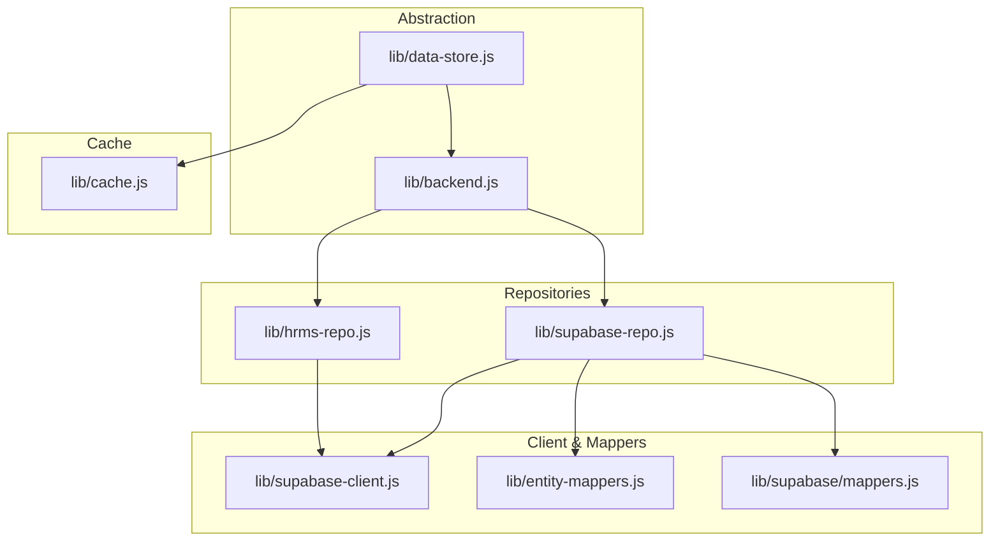
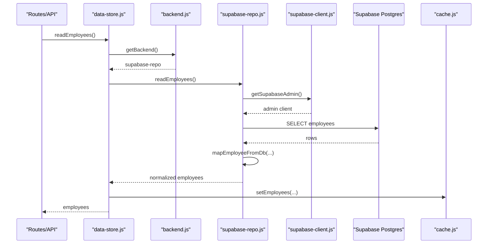
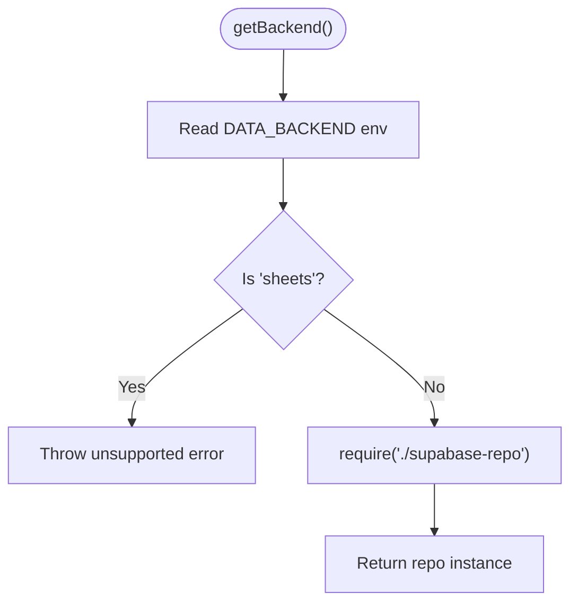
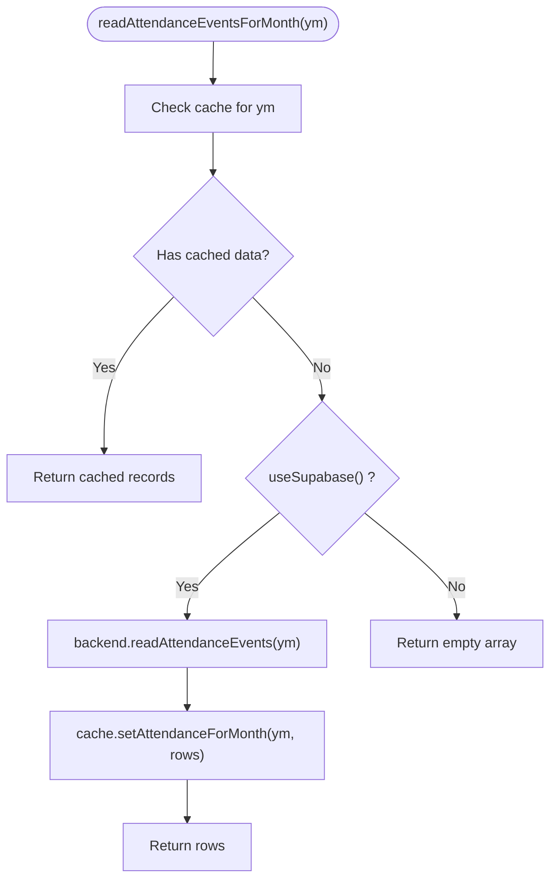
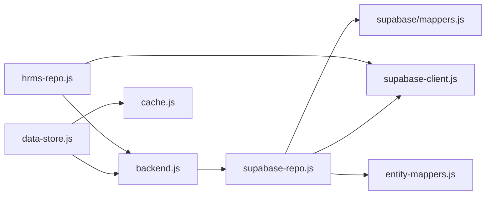

# Backend Abstraction Layer

<cite>
**Referenced Files in This Document**
- [backend.js](file://lib/backend.js)
- [data-store.js](file://lib/data-store.js)
- [supabase-repo.js](file://lib/supabase-repo.js)
- [hrms-repo.js](file://lib/hrms-repo.js)
- [cache.js](file://lib/cache.js)
- [supabase-client.js](file://lib/supabase-client.js)
- [entity-mappers.js](file://lib/entity-mappers.js)
- [mappers.js](file://lib/supabase/mappers.js)
- [LEGACY_GOOGLE_SHEETS.md](file://LEGACY_GOOGLE_SHEETS.md)
</cite>

## Table of Contents
1. [Introduction](#introduction)
2. [Project Structure](#project-structure)
3. [Core Components](#core-components)
4. [Architecture Overview](#architecture-overview)
5. [Detailed Component Analysis](#detailed-component-analysis)
6. [Dependency Analysis](#dependency-analysis)
7. [Performance Considerations](#performance-considerations)
8. [Troubleshooting Guide](#troubleshooting-guide)
9. [Conclusion](#conclusion)
10. [Appendices](#appendices)

## Introduction
This document explains the backend abstraction layer that supports multiple data sources, with a focus on the current Supabase implementation and the historical Google Sheets adapter. It documents:
- The interface design used to switch between backends
- The repository pattern for data access operations
- Connection management, query building, and result transformation layers
- Caching strategies and offline-first patterns in the data store layer
- How to implement new backend adapters and handle data source-specific features

The system is designed so that higher-level business logic (routes, UI) depends only on a stable repository interface, while concrete implementations (Supabase, legacy Sheets) are isolated behind it.

## Project Structure
At runtime, the application uses a small set of modules to abstract data access:
- Backend selection and factory
- Repository implementations per data source
- Client configuration and connection management
- Entity mapping and normalization
- Local SQLite cache for offline-first reads and fast writes

**Diagram sources**
- [backend.js:1-29](file://lib/backend.js#L1-L29)
- [data-store.js:1-20](file://lib/data-store.js#L1-L20)
- [supabase-repo.js:1-20](file://lib/supabase-repo.js#L1-L20)
- [hrms-repo.js:1-15](file://lib/hrms-repo.js#L1-L15)
- [supabase-client.js:1-30](file://lib/supabase-client.js#L1-L30)
- [entity-mappers.js:1-20](file://lib/entity-mappers.js#L1-L20)
- [mappers.js:1-20](file://lib/supabase/mappers.js#L1-L20)
- [cache.js:1-20](file://lib/cache.js#L1-L20)

**Section sources**
- [backend.js:1-29](file://lib/backend.js#L1-L29)
- [data-store.js:1-20](file://lib/data-store.js#L1-L20)

## Core Components
- Backend selector: Provides environment-driven selection and enforces supported backends.
- Data store: Orchestrates sync, caching, and business operations; calls repositories via the backend selector.
- Supabase repository: Implements the repository interface using Supabase client and mappers.
- HRMS repository: Additional Supabase-backed CRUD for advanced HR tables.
- Cache: Local SQLite persistence for offline-first reads and fast write-backs.
- Client and mappers: Connection management and entity normalization between app models and database rows.

Key responsibilities:
- Backend selection and validation
- Repository method contracts (CRUD, queries, bulk ops)
- Query construction and error handling
- Result transformation to normalized entities
- Offline-first caching and conflict resolution

**Section sources**
- [backend.js:1-29](file://lib/backend.js#L1-L29)
- [data-store.js:1-20](file://lib/data-store.js#L1-L20)
- [supabase-repo.js:1-20](file://lib/supabase-repo.js#L1-L20)
- [hrms-repo.js:1-15](file://lib/hrms-repo.js#L1-L15)
- [cache.js:1-20](file://lib/cache.js#L1-L20)
- [supabase-client.js:1-30](file://lib/supabase-client.js#L1-L30)
- [entity-mappers.js:1-20](file://lib/entity-mappers.js#L1-L20)
- [mappers.js:1-20](file://lib/supabase/mappers.js#L1-L20)

## Architecture Overview
The architecture follows a layered approach:
- Presentation/Route layer calls into the data store
- Data store coordinates caching and calls repositories
- Repositories encapsulate data source specifics (Supabase or legacy Sheets)
- Client module manages connections and auth context
- Mappers normalize data across layers

**Diagram sources**
- [data-store.js:1-20](file://lib/data-store.js#L1-L20)
- [backend.js:19-22](file://lib/backend.js#L19-L22)
- [supabase-repo.js:22-26](file://lib/supabase-repo.js#L22-L26)
- [supabase-client.js:80-91](file://lib/supabase-client.js#L80-L91)
- [mappers.js:12-59](file://lib/supabase/mappers.js#L12-L59)
- [cache.js:151-159](file://lib/cache.js#L151-L159)

## Detailed Component Analysis

### Backend Selector and Factory
Responsibilities:
- Determine active backend from environment
- Enforce supported backends (currently Supabase-only)
- Provide a factory to load the correct repository implementation

Design notes:
- Throws when legacy sheets backend is requested
- Returns a repository object implementing the expected interface

**Diagram sources**
- [backend.js:5-22](file://lib/backend.js#L5-L22)

**Section sources**
- [backend.js:1-29](file://lib/backend.js#L1-L29)

### Repository Pattern Implementation
The repository pattern isolates data access details behind a consistent interface. The data store calls repository methods without knowing whether they hit Supabase or another backend.

Repository contract highlights (examples):
- Employee CRUD: create, update, delete, read by id, list all
- Attendance events: read by month, batch upsert
- Bonus/deduction events: read and upsert/delete
- Payroll adjustments: read, upsert, bulk transport eligibility
- Commission types/tiers: read, upsert, write monthly tiers
- Loans and payments: append, update, delete, read
- Documents and warnings: append, update, delete, read
- Position rates: read, upsert, delete, monthly variants

Implementation example path references:
- Employee operations: [supabase-repo.js:22-57](file://lib/supabase-repo.js#L22-L57)
- Attendance operations: [supabase-repo.js:214-237](file://lib/supabase-repo.js#L214-L237)
- Payroll adjustments: [supabase-repo.js:285-392](file://lib/supabase-repo.js#L285-L392)
- Commission types/tiers: [supabase-repo.js:394-443](file://lib/supabase-repo.js#L394-L443)
- Loans and payments: [supabase-repo.js:445-543](file://lib/supabase-repo.js#L445-L543)
- Documents and warnings: [supabase-repo.js:603-671](file://lib/supabase-repo.js#L603-L671)

**Section sources**
- [supabase-repo.js:22-57](file://lib/supabase-repo.js#L22-L57)
- [supabase-repo.js:214-237](file://lib/supabase-repo.js#L214-L237)
- [supabase-repo.js:285-392](file://lib/supabase-repo.js#L285-L392)
- [supabase-repo.js:394-443](file://lib/supabase-repo.js#L394-L443)
- [supabase-repo.js:445-543](file://lib/supabase-repo.js#L445-L543)
- [supabase-repo.js:603-671](file://lib/supabase-repo.js#L603-L671)

### Connection Management
Connection management is centralized in the client module:
- Admin client bypasses RLS for server-side operations
- Anonymous client applies RLS for user-scoped access
- User-scoped client attaches JWT headers
- Environment variables supply URL and keys
- Optional WebSocket transport for realtime

Key behaviors:
- Validates presence of required keys
- Reuses singleton clients
- Exposes public config for UI readiness checks

Example paths:
- Admin client creation: [supabase-client.js:80-91](file://lib/supabase-client.js#L80-L91)
- Anon client: [supabase-client.js:94-99](file://lib/supabase-client.js#L94-L99)
- User-scoped client: [supabase-client.js:102-111](file://lib/supabase-client.js#L102-L111)
- Public config: [supabase-client.js:113-123](file://lib/supabase-client.js#L113-L123)

**Section sources**
- [supabase-client.js:1-134](file://lib/supabase-client.js#L1-L134)

### Query Building and Error Handling
Query building occurs within each repository function:
- Uses Supabase query builder to select, filter, order, and upsert
- Wraps errors with context for easier debugging
- Handles missing tables gracefully where needed (e.g., optional monthly tables)

Examples:
- Conditional table fallback for position rates: [supabase-repo.js:144-161](file://lib/supabase-repo.js#L144-L161)
- Missing table detection helper: [supabase-repo.js:208-212](file://lib/supabase-repo.js#L208-L212)
- Upsert with conflict targets: [supabase-repo.js:229-237](file://lib/supabase-repo.js#L229-L237)

Error handling strategy:
- Centralized throw wrapper adds context
- Specific domain errors thrown for invalid inputs (e.g., duplicate IDs)

**Section sources**
- [supabase-repo.js:144-161](file://lib/supabase-repo.js#L144-L161)
- [supabase-repo.js:208-212](file://lib/supabase-repo.js#L208-L212)
- [supabase-repo.js:229-237](file://lib/supabase-repo.js#L229-L237)

### Result Transformation Layer
Mappers normalize between database rows and application entities:
- Employee row mapping supports both legacy sheet column names and DB columns
- Attendance, bonus, deduction, payroll adjustment, loans, splits, documents, warnings, commission types/tiers mappings
- Boolean coercion helpers for DB booleans

Examples:
- Employee mapper: [mappers.js:12-59](file://lib/supabase/mappers.js#L12-L59)
- Attendance mapper: [mappers.js:112-141](file://lib/supabase/mappers.js#L112-L141)
- Payroll adjustment mapper: [mappers.js:177-234](file://lib/supabase/mappers.js#L177-L234)
- Shared employee field mapping: [entity-mappers.js:14-73](file://lib/entity-mappers.js#L14-L73)

**Section sources**
- [mappers.js:12-59](file://lib/supabase/mappers.js#L12-L59)
- [mappers.js:112-141](file://lib/supabase/mappers.js#L112-L141)
- [mappers.js:177-234](file://lib/supabase/mappers.js#L177-L234)
- [entity-mappers.js:14-73](file://lib/entity-mappers.js#L14-L73)

### Data Store Orchestration and Offline-First Caching
The data store orchestrates synchronization, caching, and business operations:
- Ensures cache warm state before serving data
- Performs full sync from backend and populates local cache
- Applies merge rules for attendance records to resolve conflicts
- Locks mutations to avoid concurrent writes
- Reads from cache first, falls back to backend if empty

Key flows:
- Sync orchestration and parallel fetches: [data-store.js:122-219](file://lib/data-store.js#L122-L219)
- Conflict resolution for attendance: [data-store.js:67-103](file://lib/data-store.js#L67-L103)
- Mutation lock: [data-store.js:105-112](file://lib/data-store.js#L105-L112)
- Read path preferring cache: [data-store.js:492-512](file://lib/data-store.js#L492-L512)

SQLite schema and indexes:
- Tables for employees, attendance, bonuses, deductions, payroll adjustments, commissions, loans, splits, warnings, documents
- Indexes optimized for month-based queries and employee lookups

Example paths:
- Schema initialization: [cache.js:37-135](file://lib/cache.js#L37-L135)
- Attendance month set/get: [cache.js:178-197](file://lib/cache.js#L178-L197)
- Payroll adjustments set/get: [cache.js:414-431](file://lib/cache.js#L414-L431)

**Diagram sources**
- [data-store.js:492-512](file://lib/data-store.js#L492-L512)
- [cache.js:178-197](file://lib/cache.js#L178-L197)

**Section sources**
- [data-store.js:122-219](file://lib/data-store.js#L122-L219)
- [data-store.js:67-103](file://lib/data-store.js#L67-L103)
- [data-store.js:105-112](file://lib/data-store.js#L105-L112)
- [data-store.js:492-512](file://lib/data-store.js#L492-L512)
- [cache.js:37-135](file://lib/cache.js#L37-L135)
- [cache.js:178-197](file://lib/cache.js#L178-L197)
- [cache.js:414-431](file://lib/cache.js#L414-L431)

### HRMS Advanced Features Repository
Additional Supabase-backed features include employment periods, org teams, action plans, onboarding/offboarding checklists, clearance items, equipment, leave requests, and public holidays. These follow the same repository pattern and use requireSupabase guards.

Examples:
- Employment periods CRUD: [hrms-repo.js:26-75](file://lib/hrms-repo.js#L26-L75)
- Org teams read/update/relocate: [hrms-repo.js:121-257](file://lib/hrms-repo.js#L121-L257)
- Leave requests CRUD: [hrms-repo.js:687-769](file://lib/hrms-repo.js#L687-L769)
- Public holidays: [hrms-repo.js:771-800](file://lib/hrms-repo.js#L771-L800)

**Section sources**
- [hrms-repo.js:26-75](file://lib/hrms-repo.js#L26-L75)
- [hrms-repo.js:121-257](file://lib/hrms-repo.js#L121-L257)
- [hrms-repo.js:687-769](file://lib/hrms-repo.js#L687-L769)
- [hrms-repo.js:771-800](file://lib/hrms-repo.js#L771-L800)

### Legacy Google Sheets Adapter (Historical)
Legacy Sheets support is deprecated and not loaded at runtime. Documentation and migration scripts remain under scripts/legacy and LEGACY_GOOGLE_SHEETS.md. The backend selector explicitly blocks usage of the sheets backend.

Key points:
- Historical tab layout and fields documented
- Migration scripts exist to move data to Supabase
- Runtime throws an error if sheets backend is configured

References:
- Deprecation notice and blocking behavior: [backend.js:9-17](file://lib/backend.js#L9-L17)
- Legacy documentation: [LEGACY_GOOGLE_SHEETS.md:1-13](file://LEGACY_GOOGLE_SHEETS.md#L1-L13)

**Section sources**
- [backend.js:9-17](file://lib/backend.js#L9-L17)
- [LEGACY_GOOGLE_SHEETS.md:1-13](file://LEGACY_GOOGLE_SHEETS.md#L1-L13)

## Dependency Analysis
High-level dependencies:
- data-store depends on backend selector and cache
- backend selector returns supabase-repo
- supabase-repo depends on supabase-client and mappers
- hrms-repo also depends on supabase-client and uses backend guard
- entity-mappers shared across mappers

**Diagram sources**
- [data-store.js:1-20](file://lib/data-store.js#L1-L20)
- [backend.js:19-22](file://lib/backend.js#L19-L22)
- [supabase-repo.js:1-20](file://lib/supabase-repo.js#L1-L20)
- [hrms-repo.js:1-15](file://lib/hrms-repo.js#L1-L15)
- [supabase-client.js:1-30](file://lib/supabase-client.js#L1-L30)
- [entity-mappers.js:1-20](file://lib/entity-mappers.js#L1-L20)
- [mappers.js:1-20](file://lib/supabase/mappers.js#L1-L20)
- [cache.js:1-20](file://lib/cache.js#L1-L20)

**Section sources**
- [data-store.js:1-20](file://lib/data-store.js#L1-L20)
- [backend.js:19-22](file://lib/backend.js#L19-L22)
- [supabase-repo.js:1-20](file://lib/supabase-repo.js#L1-L20)
- [hrms-repo.js:1-15](file://lib/hrms-repo.js#L1-L15)
- [supabase-client.js:1-30](file://lib/supabase-client.js#L1-L30)
- [entity-mappers.js:1-20](file://lib/entity-mappers.js#L1-L20)
- [mappers.js:1-20](file://lib/supabase/mappers.js#L1-L20)
- [cache.js:1-20](file://lib/cache.js#L1-L20)

## Performance Considerations
- Batch upserts reduce round trips (attendance, payroll adjustments).
- Month-scoped indexes improve query performance for attendance, bonuses, deductions, payroll adjustments, loan payments, and payroll splits.
- Transactional writes ensure consistency during bulk operations.
- Offline-first reads minimize network latency and provide resilience.
- Conditional table fallback avoids failures when optional tables are not yet migrated.

[No sources needed since this section provides general guidance]

## Troubleshooting Guide
Common issues and diagnostics:
- Missing Supabase keys: Ensure SUPABASE_URL and secret/publishable keys are set; admin client will throw if missing.
- Unsupported backend: If DATA_BACKEND=sheets is set, the backend selector throws an explicit error.
- Missing tables: Some operations gracefully fall back when optional tables do not exist (e.g., position_rate_monthly).
- Cache staleness: After remote changes, call refreshCache to re-sync and update local cache.

Relevant code paths:
- Admin key validation: [supabase-client.js:80-91](file://lib/supabase-client.js#L80-L91)
- Sheets backend block: [backend.js:9-17](file://lib/backend.js#L9-L17)
- Missing table detection: [supabase-repo.js:208-212](file://lib/supabase-repo.js#L208-L212)
- Refresh cache: [data-store.js:743-745](file://lib/data-store.js#L743-L745)

**Section sources**
- [supabase-client.js:80-91](file://lib/supabase-client.js#L80-L91)
- [backend.js:9-17](file://lib/backend.js#L9-L17)
- [supabase-repo.js:208-212](file://lib/supabase-repo.js#L208-L212)
- [data-store.js:743-745](file://lib/data-store.js#L743-L745)

## Conclusion
The backend abstraction layer cleanly separates concerns:
- A small selector controls which repository implementation is used
- Repositories encapsulate data source specifics and expose a stable interface
- Mappers normalize entities across layers
- The data store orchestrates caching, sync, and business logic
- Offline-first caching ensures responsiveness and resilience

This design enables easy extension to additional backends while maintaining a consistent API for consumers.

[No sources needed since this section summarizes without analyzing specific files]

## Appendices

### Implementing a New Backend Adapter
Steps to add a new adapter (conceptual):
- Create a new repository file implementing the same interface as supabase-repo.js
- Add mapping functions to convert between your data source rows and app entities
- Update backend.js to support the new backend name and return the new repository
- Ensure data-store.js can call the new repository methods without changes

Guidance:
- Follow existing patterns for error handling and context wrapping
- Use transactions for batch operations
- Keep mappers focused on normalization and type coercion

[No sources needed since this section provides general guidance]

### Handling Data Source-Specific Features
Some features are only available with certain backends:
- Monthly position rates and related operations may be Supabase-only
- HRMS advanced tables require Supabase and are guarded by requireSupabase

Recommendations:
- Guard feature availability with backend checks
- Provide graceful fallbacks or clear errors when features are unavailable

**Section sources**
- [hrms-repo.js:11-13](file://lib/hrms-repo.js#L11-L13)
- [supabase-repo.js:130-161](file://lib/supabase-repo.js#L130-L161)