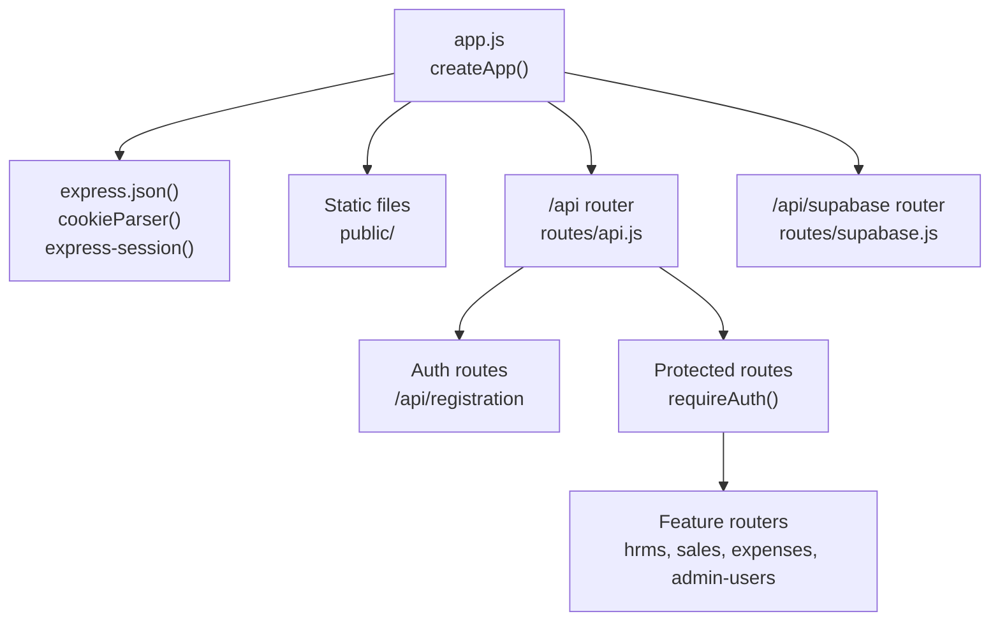
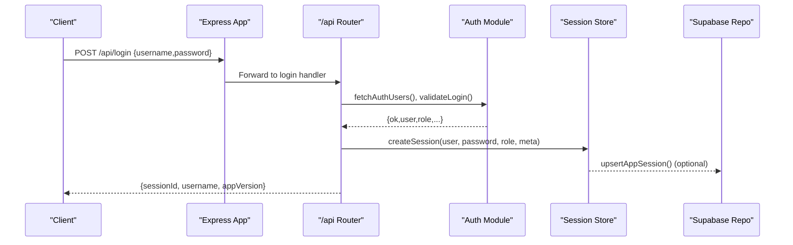
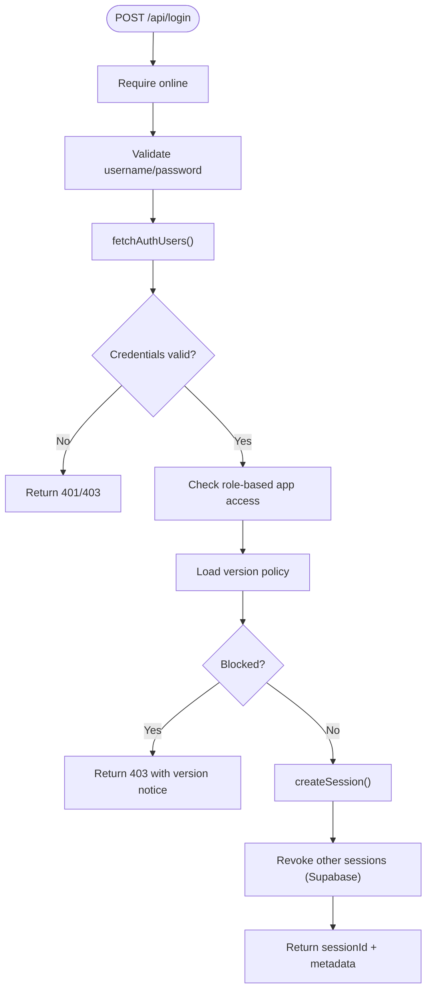
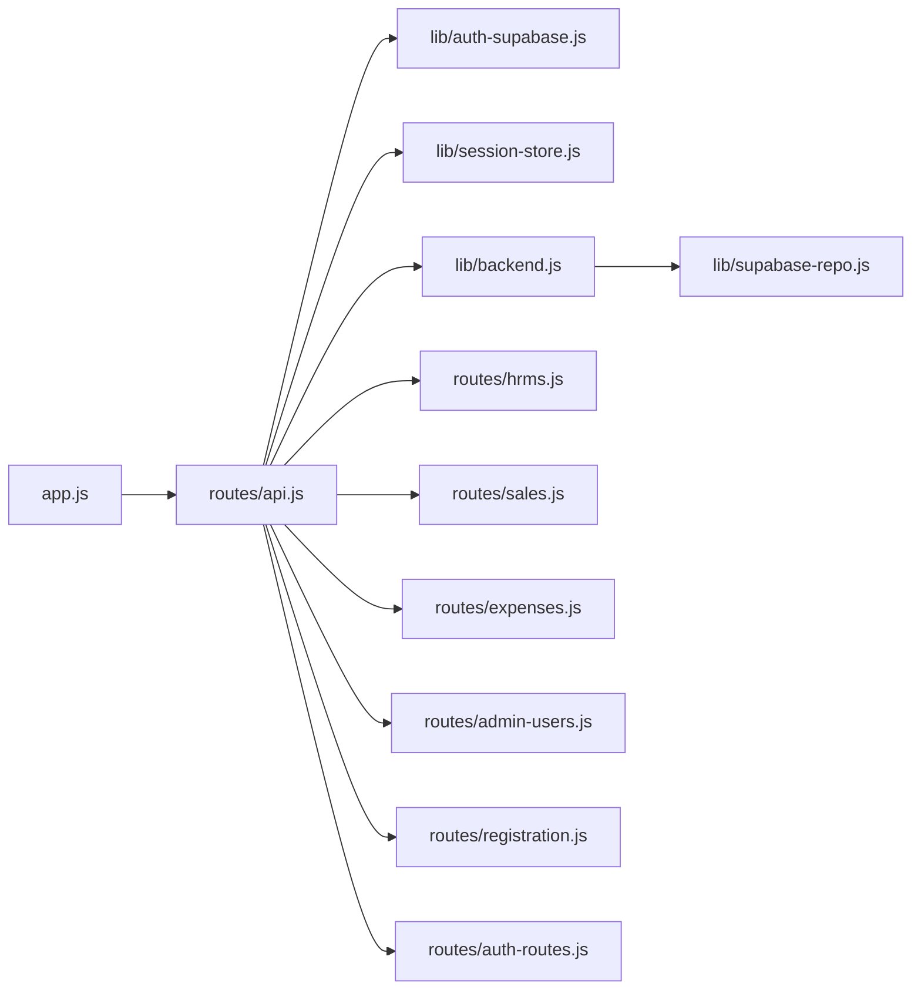

# Backend Services

<cite>
**Referenced Files in This Document**
- [app.js](file://app.js)
- [lib/backend.js](file://lib/backend.js)
- [routes/api.js](file://routes/api.js)
- [routes/auth-routes.js](file://routes/auth-routes.js)
- [routes/hrms.js](file://routes/hrms.js)
- [routes/sales.js](file://routes/sales.js)
- [routes/expenses.js](file://routes/expenses.js)
- [routes/admin-users.js](file://routes/admin-users.js)
- [routes/registration.js](file://routes/registration.js)
- [lib/auth-supabase.js](file://lib/auth-supabase.js)
- [lib/session-store.js](file://lib/session-store.js)
- [lib/supabase-repo.js](file://lib/supabase-repo.js)
</cite>

## Table of Contents
1. [Introduction](#introduction)
2. [Project Structure](#project-structure)
3. [Core Components](#core-components)
4. [Architecture Overview](#architecture-overview)
5. [Detailed Component Analysis](#detailed-component-analysis)
6. [Dependency Analysis](#dependency-analysis)
7. [Performance Considerations](#performance-considerations)
8. [Troubleshooting Guide](#troubleshooting-guide)
9. [Conclusion](#conclusion)

## Introduction
This document explains the Express.js backend services architecture with a focus on:
- Application factory pattern and bootstrapping in app.js
- API routing under /api/* endpoints organized by feature domain
- Backend abstraction layer for data sources (Supabase vs legacy sheets)
- Authentication, session management, and request validation patterns
- CORS configuration for localhost development and security headers
- Error handling strategies across routes
- Representative API endpoint patterns and middleware composition

The system is designed to be modular, secure, and adaptable to different data backends while providing consistent authorization and validation at the API layer.

## Project Structure
At runtime, the application is created via an application factory that wires up core middleware, static assets, and route modules. The primary entry point exports a function to create the Express app instance.

**Diagram sources**
- [app.js:8-22](file://app.js#L8-L22)
- [routes/api.js:44-699](file://routes/api.js#L44-L699)

**Section sources**
- [app.js:8-22](file://app.js#L8-L22)

## Core Components
- Application factory: Creates the Express app, configures JSON parsing, cookies, sessions, static file serving, mounts API routers, preloads permission overrides, and installs a global error handler.
- API router: Central mount for all /api/* endpoints; defines auth flows, session checks, and composes feature-specific sub-routers.
- Backend abstraction: Determines active data backend and returns the appropriate repository implementation.
- Auth module: Fetches users and validates credentials against Supabase-backed user store.
- Session store: In-memory session cache with optional Supabase persistence and revocation support.
- Feature routers: Domain-scoped route modules for HRMS, Sales, Expenses, Admin Users, Registration, etc.

**Section sources**
- [app.js:8-56](file://app.js#L8-L56)
- [routes/api.js:44-699](file://routes/api.js#L44-L699)
- [lib/backend.js:1-29](file://lib/backend.js#L1-L29)
- [lib/auth-supabase.js:1-73](file://lib/auth-supabase.js#L1-L73)
- [lib/session-store.js:1-83](file://lib/session-store.js#L1-L83)

## Architecture Overview
The backend follows a layered approach:
- Presentation layer: Express routes per feature domain
- Authorization/validation: Middleware enforcing authentication, role-based access control, and input validation
- Business logic: Route handlers orchestrate operations using libraries and repositories
- Data access: Repository layer abstracts data source (Supabase), with explicit fallback behavior for missing tables or legacy features

**Diagram sources**
- [routes/api.js:552-621](file://routes/api.js#L552-L621)
- [lib/auth-supabase.js:10-47](file://lib/auth-supabase.js#L10-L47)
- [lib/session-store.js:8-24](file://lib/session-store.js#L8-L24)
- [lib/supabase-repo.js:1-20](file://lib/supabase-repo.js#L1-L20)

## Detailed Component Analysis

### Application Factory (app.js)
Responsibilities:
- Configures cookie parsing, JSON body parsing with size limit, and express-session with httpOnly cookies and default maxAge
- Serves static frontend assets from public/
- Mounts /api and /api/supabase routers
- Preloads role/user permissions and sales action permissions (non-fatal)
- Global error handler returning JSON errors when headers are not sent
- Simple login/index page redirects based on session presence

Security notes:
- No explicit CORS middleware is configured in app.js; if needed for local development, add cors middleware before mounting routers
- No custom security headers are set here; consider adding helmet or similar middleware for production

**Section sources**
- [app.js:8-56](file://app.js#L8-L56)

### API Router Composition (/api/*)
Key responsibilities:
- Imports shared utilities: auth helpers, session store, network status, cache, roles, permissions, registration, versioning, attendance, payroll, calendar, id generator, hrms repo, company context, companies repo, rules repo, team TLS repo
- Defines helper functions for session extraction, authentication middleware, employee scoping, company context resolution, and month helpers
- Implements health and version endpoints
- Provides login/logout and session-check endpoints
- Applies requireAuth middleware to protected routes
- Mounts feature sub-routers such as registration

Patterns:
- Centralized session extraction supports both cookie and header-based session IDs
- requireAuth enriches req.userRole and handles impersonation and access revocation
- Feature routers are mounted after authentication where applicable

Example endpoints:
- GET /api/version-info
- GET /api/github-update
- GET /api/health
- POST /api/login
- POST /api/logout
- GET /api/session-check
- POST /api/registration/apply

**Section sources**
- [routes/api.js:1-800](file://routes/api.js#L1-L800)

### Authentication and Session Management
Authentication flow:
- Login handler requires online connectivity, validates credentials via auth module, checks role-based app access, enforces version policy, updates last login (Supabase path), creates a session, optionally revokes other sessions for the user, and returns sessionId and metadata
- Session check verifies session validity, re-validates user status and role, applies version blocking, and returns enriched user info including break schedule if available
- Logout destroys server-side session and clears client session

Session store:
- In-memory Map keyed by session ID
- Optional Supabase persistence for creation, validation, revocation, and idle timeout enforcement
- Supports updateSession and destroySessionsForUser

Auth module (Supabase):
- Fetches users from app_users table
- Validates login by comparing provided password against stored hash or plaintext depending on record flag
- Enforces account status (active/inactive/terminated)
- Session check re-verifies credentials and status on each heartbeat

**Diagram sources**
- [routes/api.js:552-621](file://routes/api.js#L552-L621)
- [lib/auth-supabase.js:24-47](file://lib/auth-supabase.js#L24-L47)
- [lib/session-store.js:8-24](file://lib/session-store.js#L8-L24)

**Section sources**
- [routes/api.js:552-697](file://routes/api.js#L552-L697)
- [lib/auth-supabase.js:10-73](file://lib/auth-supabase.js#L10-L73)
- [lib/session-store.js:1-83](file://lib/session-store.js#L1-L83)

### Request Validation Patterns
Common patterns observed across routes:
- Input presence checks with descriptive error messages
- Normalization of fields (e.g., payment method normalization)
- Conditional field requirements based on selected options (e.g., card vs bank account)
- Scrubbing sensitive fields based on payment method selection
- Catalog-driven validation and enrichment for sales submissions
- Role-based gating before mutation operations

Examples:
- Sales submission validates agent assignment, unit/team combination, required fields, catalog resolution, duplicate detection, and payment form constraints
- Expenses submission validates vendorName and amount, then persists and notifies approvers
- Leave requests validate request kind, dates, day fractions, and trigger notifications and audit events

**Section sources**
- [routes/sales.js:466-648](file://routes/sales.js#L466-L648)
- [routes/expenses.js:66-101](file://routes/expenses.js#L66-L101)
- [routes/hrms.js:538-601](file://routes/hrms.js#L538-L601)

### Backend Abstraction Layer (lib/backend.js)
Purpose:
- Determine active backend name from environment variable
- Enforce Supabase-only mode in current codebase; reject legacy sheets configuration
- Provide getBackend() to dynamically require the active repository implementation

Behavior:
- useSupabase() throws if DATA_BACKEND=sheets is set
- getBackend() returns supabase-repo module when Supabase is enabled

Implications:
- All data-layer calls should go through this abstraction to ensure consistent backend selection
- Legacy sheets integration is deprecated and blocked at runtime

**Section sources**
- [lib/backend.js:1-29](file://lib/backend.js#L1-L29)

### Supabase Repository (lib/supabase-repo.js)
Responsibilities:
- Mirrors the data-store interface for employees, config, position rates, attendance, bonuses/deductions, payroll adjustments, commissions, loans, splits, documents, warnings
- Maps between database rows and internal entities
- Handles missing table scenarios gracefully for certain queries
- Provides verification of backend access

Design notes:
- Consistent error wrapping with context labels
- Upsert operations with conflict keys to maintain idempotency
- Backward compatibility for monthly rate tables when not present

**Section sources**
- [lib/supabase-repo.js:1-733](file://lib/supabase-repo.js#L1-L733)

### Feature Routers

#### HRMS Routes (/api/hrms/*)
Highlights:
- Requires Supabase backend for most operations
- Organizes org structure, teams, employment periods, action plans, onboarding, training phases, equipment, leave requests, holidays
- Uses roles for fine-grained access control and company context filtering
- Integrates notifications and audit logging for key mutations

Example endpoints:
- GET /api/hrms/org-structure
- POST /api/hrms/teams
- PATCH /api/hrms/teams/:id
- DELETE /api/hrms/teams/:id
- GET /api/hrms/employment-periods/:employeeId
- POST /api/hrms/employment-periods/:employeeId/depart
- GET /api/hrms/action-plans/:employeeId
- POST /api/hrms/action-plans
- GET /api/hrms/onboarding/:employeeId
- PUT /api/hrms/onboarding/:employeeId
- GET /api/hrms/training/:employeeId
- POST /api/hrms/training/:employeeId
- PATCH /api/hrms/training/phases/:phaseId
- GET /api/hrms/equipment
- POST /api/hrms/equipment
- PATCH /api/hrms/equipment/:id
- POST /api/hrms/equipment/assign
- POST /api/hrms/equipment/return/:assignmentId
- GET /api/hrms/leave
- POST /api/hrms/leave
- PUT /api/hrms/leave/:id
- DELETE /api/hrms/leave/:id
- GET /api/hrms/holidays
- POST /api/hrms/holidays

**Section sources**
- [routes/hrms.js:1-800](file://routes/hrms.js#L1-L800)

#### Sales Routes (/api/sales/*)
Highlights:
- Extensive validation and enrichment pipeline for sale submissions
- Visibility grants and scope filtering by role, unit, team, and company context
- Period grid and dashboard aggregations
- Notifications for assignments and callbacks
- Airtable sync scheduling after mutations

Example endpoints:
- GET /api/sales/
- GET /api/sales/period-grid
- GET /api/sales/team-dashboard
- GET /api/sales/dashboard
- GET /api/sales/visibility-grants
- POST /api/sales/visibility-grants
- DELETE /api/sales/visibility-grants/:id
- POST /api/sales/
- PATCH /api/sales/:id
- DELETE /api/sales/:id

**Section sources**
- [routes/sales.js:1-800](file://routes/sales.js#L1-L800)

#### Expenses Routes (/api/expenses/*)
Highlights:
- Role-based access for finance users and submitters
- Receipt upload and streaming
- Petty cash ledger operations
- Monthly bills CRUD
- Audit logging for edits and deletions

Example endpoints:
- GET /api/expenses/
- POST /api/expenses/
- POST /api/expenses/:id/receipt
- GET /api/expenses/petty-cash/funds
- GET /api/expenses/petty-cash/ledger
- POST /api/expenses/petty-cash/deposit
- PATCH /api/expenses/petty-cash/ledger/:id
- GET /api/expenses/bills
- POST /api/expenses/bills
- DELETE /api/expenses/bills/:id
- POST /api/expenses/:id/approve
- POST /api/expenses/:id/deny
- GET /api/expenses/:id/receipt
- PATCH /api/expenses/:id
- DELETE /api/expenses/:id

**Section sources**
- [routes/expenses.js:1-343](file://routes/expenses.js#L1-L343)

#### Admin Users Routes (/api/admin-users/*)
Highlights:
- System administrator-only access
- User listing, creation, updates, deletion, purge
- Permission overrides per user and defaults by role
- Employee login synchronization

Example endpoints:
- GET /api/admin-users/
- POST /api/admin-users/
- PUT /api/admin-users/:username
- GET /api/admin-users/:username/permissions
- PUT /api/admin-users/:username/permissions
- DELETE /api/admin-users/:username/permissions
- POST /api/admin-users/:username/purge
- DELETE /api/admin-users/:username
- POST /api/admin-users/sync-employees

**Section sources**
- [routes/admin-users.js:1-157](file://routes/admin-users.js#L1-L157)

#### Registration Routes (/api/registration/*)
Highlights:
- Daily PIN verification for new registrations
- Creation of registration requests pending approval

Example endpoints:
- POST /api/registration/apply

**Section sources**
- [routes/registration.js:1-37](file://routes/registration.js#L1-L37)

#### Auth Admin Routes (/api/auth/*)
Highlights:
- Password change with bcrypt comparison
- Session listing and revocation for administrators

Example endpoints:
- PUT /api/auth/change-password
- GET /api/auth/sessions
- POST /api/auth/sessions/:id/revoke

**Section sources**
- [routes/auth-routes.js:1-62](file://routes/auth-routes.js#L1-L62)

## Dependency Analysis
High-level dependencies among core components:

**Diagram sources**
- [app.js:8-22](file://app.js#L8-L22)
- [routes/api.js:1-44](file://routes/api.js#L1-L44)
- [lib/backend.js:19-22](file://lib/backend.js#L19-L22)
- [lib/supabase-repo.js:1-16](file://lib/supabase-repo.js#L1-L16)

**Section sources**
- [app.js:8-22](file://app.js#L8-L22)
- [routes/api.js:1-44](file://routes/api.js#L1-L44)
- [lib/backend.js:19-22](file://lib/backend.js#L19-L22)

## Performance Considerations
- JSON body parser limit is set to 20MB; adjust only if necessary and ensure upstream clients respect limits
- Session validation includes idle timeout and Supabase revocation checks; keep Supabase latency low to avoid session churn
- Batch operations (e.g., payroll calculations) aggregate multiple reads; consider caching frequently accessed datasets like employees and config
- Missing table checks are handled gracefully; ensure migrations run before enabling features relying on newer tables

[No sources needed since this section provides general guidance]

## Troubleshooting Guide
Common issues and resolutions:
- Not logged in or session expired: Ensure x-session-id or cookie contains a valid session; verify session revocation state in Supabase
- Access revoked: User may have been deactivated or removed; contact admin to restore access
- Backend unavailable: Health endpoint reports backendOk and errors; verify Supabase credentials and network connectivity
- Sheets backend disabled: Attempting to use sheets will throw an error; set DATA_BACKEND=supabase
- Permission denied: Verify role-based permissions and company/unit/team scoping; review permission overrides for the user

Operational tips:
- Use /api/health to diagnose connectivity and backend status
- Use /api/session-check to validate current session and receive actionable actions (e.g., uninstall, admin, version_blocked)
- For login failures, check offline flag and credential-related messages

**Section sources**
- [routes/api.js:525-550](file://routes/api.js#L525-L550)
- [routes/api.js:631-697](file://routes/api.js#L631-L697)
- [lib/backend.js:9-17](file://lib/backend.js#L9-L17)

## Conclusion
The backend services follow a clean separation of concerns:
- An application factory centralizes middleware and router wiring
- A robust API router composes authentication, validation, and feature domains
- A backend abstraction ensures consistent data access and deprecates legacy paths
- Sessions are validated and persisted with optional Supabase backing
- Feature routers implement comprehensive validation, authorization, and notification workflows

To extend the system:
- Add new feature routers under /api/* and mount them in api.js
- Implement domain-specific validation and role checks within route handlers
- Use the backend abstraction to keep data access portable
- Consider adding CORS and security headers middleware for local development and production hardening

[No sources needed since this section summarizes without analyzing specific files]