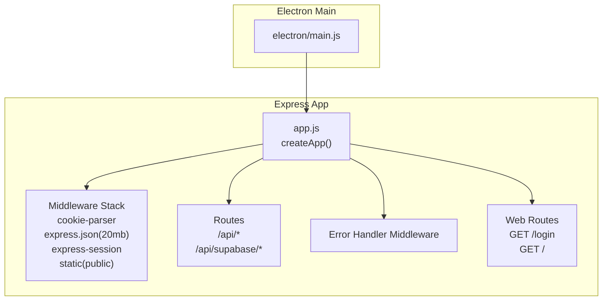
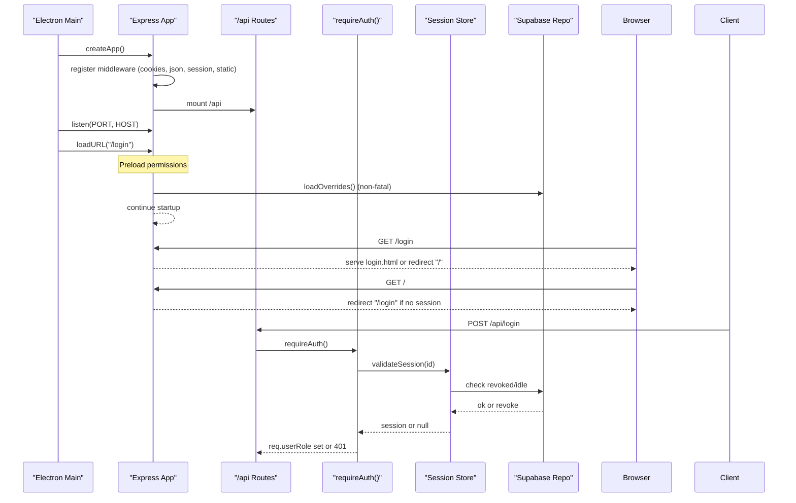
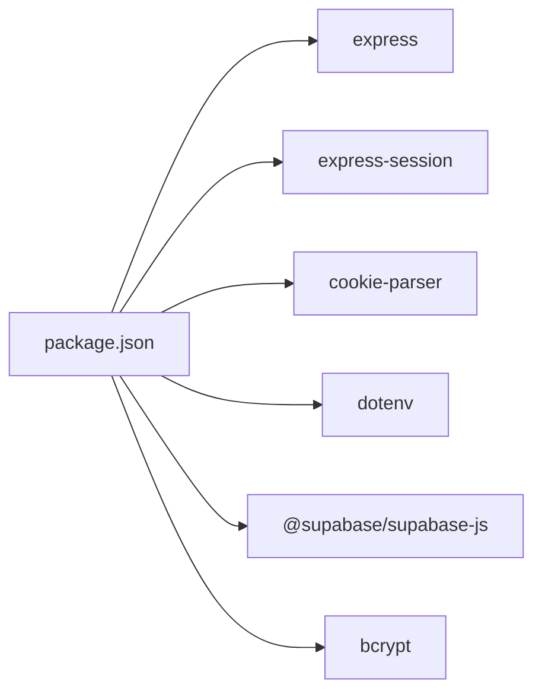

# Express Application Factory

<cite>
**Referenced Files in This Document**
- [app.js](file://app.js)
- [electron/main.js](file://electron/main.js)
- [routes/api.js](file://routes/api.js)
- [lib/session-store.js](file://lib/session-store.js)
- [lib/auth-supabase.js](file://lib/auth-supabase.js)
- [lib/role-permissions.js](file://lib/role-permissions.js)
- [lib/app-bootstrap.js](file://lib/app-bootstrap.js)
- [package.json](file://package.json)
</cite>

## Table of Contents
1. [Introduction](#introduction)
2. [Project Structure](#project-structure)
3. [Core Components](#core-components)
4. [Architecture Overview](#architecture-overview)
5. [Detailed Component Analysis](#detailed-component-analysis)
6. [Dependency Analysis](#dependency-analysis)
7. [Performance Considerations](#performance-considerations)
8. [Troubleshooting Guide](#troubleshooting-guide)
9. [Conclusion](#conclusion)

## Introduction
This document explains the Express application factory pattern used to initialize the server, configure middleware, mount routes, and enforce authentication and authorization. It focuses on how createApp() sets up cookie parsing, JSON body parsing with a 20MB limit, session management, static file serving, route mounting, error handling, and preloading permission systems for role-based access control (RBAC). It also provides guidance for extending the application with new middleware and routes.

## Project Structure
The Express app is created by a factory function that returns an initialized Express instance. The Electron main process starts this server and serves the login page. Routes are organized under a dedicated directory and mounted at /api. Static assets are served from a public folder.

**Diagram sources**
- [electron/main.js:53-76](file://electron/main.js#L53-L76)
- [app.js:8-54](file://app.js#L8-L54)

**Section sources**
- [electron/main.js:53-76](file://electron/main.js#L53-L76)
- [app.js:8-54](file://app.js#L8-L54)

## Core Components
- Application factory: createApp() initializes the Express app, configures middleware, mounts routes, preloads permissions, and registers global error handling.
- Session store: in-memory Map with optional Supabase persistence and idle-time revocation.
- Authentication guard: requireAuth() validates sessions, supports impersonation, resolves user roles, and enforces app access.
- Permission system: RBAC overrides loaded from database with caching; defaults provided by catalog.

Key responsibilities:
- Middleware stack order determines behavior: cookies first, then JSON parsing, then sessions, then static files, then routes, then error handler.
- Protected routes use requireAuth() to ensure valid sessions and authorized users.
- Public pages redirect based on session presence.

**Section sources**
- [app.js:8-54](file://app.js#L8-L54)
- [routes/api.js:84-145](file://routes/api.js#L84-L145)
- [lib/session-store.js:1-83](file://lib/session-store.js#L1-L83)
- [lib/role-permissions.js:19-83](file://lib/role-permissions.js#L19-L83)

## Architecture Overview
The Electron main process bootstraps environment configuration, ensures cache directories, asserts Supabase configuration, and starts the Express server. The Express app uses a layered middleware pipeline and mounts API routes under /api. A global error handler catches unhandled errors and responds with JSON.

**Diagram sources**
- [electron/main.js:53-76](file://electron/main.js#L53-L76)
- [app.js:8-54](file://app.js#L8-L54)
- [routes/api.js:84-145](file://routes/api.js#L84-L145)
- [lib/session-store.js:30-52](file://lib/session-store.js#L30-L52)

## Detailed Component Analysis

### Application Factory: createApp()
Responsibilities:
- Create Express instance.
- Register middleware in strict order:
  - Cookie parser.
  - JSON body parser with 20MB size limit.
  - Session middleware with secure cookie settings and default secret.
  - Static file serving from public directory.
  - Route mounting:
    - /api via api router.
    - /api/supabase via supabase router.
- Non-fatal preload of permission systems:
  - Role permissions overrides.
  - User permissions overrides.
  - Sales action permissions map.
- Global error-handling middleware that logs and returns JSON 500 responses.
- Web routes:
  - GET /login: serves login page or redirects to / if already authenticated.
  - GET /: serves index page or redirects to /login if not authenticated.

Notes:
- Session secret falls back to a hardcoded value when SESSION_SECRET is not set.
- Static files are served directly from the public folder.
- Error handler must be placed after all routes to catch unhandled exceptions.

**Section sources**
- [app.js:8-54](file://app.js#L8-L54)

### Middleware Stack Details
- Cookie parsing: enables req.cookies.
- JSON parsing: limits payload size to 20MB to support large uploads.
- Session management:
  - Uses express-session with httpOnly cookie and 24-hour maxAge.
  - Stores appSessionId in client cookies; server-side session data is managed by custom session store.
- Static files:
  - Serves assets from public directory for HTML/CSS/JS.

**Section sources**
- [app.js:10-21](file://app.js#L10-L21)

### Route Mounting Patterns
- API routes are mounted at /api using a dedicated router.
- Supabase proxy routes are mounted at /api/supabase.
- Web routes (/login, /) are registered directly on the app instance.

Best practices:
- Keep feature-specific routes in separate modules and mount them under scoped prefixes.
- Place global error handler after all route registrations.

**Section sources**
- [app.js:21-22](file://app.js#L21-L22)
- [app.js:43-51](file://app.js#L43-L51)

### Authentication Guard: requireAuth()
Behavior:
- Extracts session ID from x-session-id header or session cookie.
- Validates session existence and integrity via validateSession().
- Supports impersonation:
  - If session has impersonatingAs, checks current user’s ability to impersonate.
  - Resolves impersonated user and adjusts effective username and role.
- Enriches request with:
  - req.appSession: validated session object.
  - req.realUsername: original logged-in user.
  - req.impersonatingAs: target of impersonation (if any).
  - req.username: effective username for business logic.
  - req.userRole: resolved and enriched role context including org teams.
- Denies access if user lacks app access, destroying the session and returning 401.

Integration points:
- Uses session store for validation and updates.
- Uses roles module to resolve and enrich user roles and enforce access.

**Section sources**
- [routes/api.js:84-145](file://routes/api.js#L84-L145)
- [lib/session-store.js:30-52](file://lib/session-store.js#L30-L52)
- [lib/roles.js](file://lib/roles.js)

### Session Store: In-Memory + Optional Supabase Persistence
Features:
- In-memory Map for fast lookup.
- Optional Supabase persistence:
  - Upserts session records.
  - Revokes sessions on idle timeout or manual revocation.
  - Touches last_seen_at to keep active sessions alive.
- Idle timeout:
  - Sessions older than configured idle time are revoked and destroyed.
- Utilities:
  - createSession(), getSession(), destroySession(), updateSession(), destroySessionsForUser().

Security considerations:
- Session IDs are random hex strings.
- Revoked sessions are removed from memory and persisted state.

**Section sources**
- [lib/session-store.js:1-83](file://lib/session-store.js#L1-L83)

### Permission Systems and RBAC Preloading
Startup sequence:
- Role permissions overrides are loaded into an in-memory cache with TTL.
- User permissions overrides are loaded similarly.
- Sales action permissions map is loaded.
- Failures are non-fatal and logged as warnings.

Runtime checks:
- isAllowed(permissionKey, userRole) consults cached overrides and falls back to catalog defaults.
- Effective matrix can be computed for admin UIs.

**Section sources**
- [app.js:23-35](file://app.js#L23-L35)
- [lib/role-permissions.js:19-83](file://lib/role-permissions.js#L19-L83)

### Error Handling Middleware
Global error handler:
- Logs the error.
- Responds with JSON 500 if headers have not been sent.
- Ensures consistent error format for clients.

Placement:
- Must be registered after all routes so it only handles uncaught errors.

**Section sources**
- [app.js:36-41](file://app.js#L36-L41)

### Startup Sequence in Electron Main
Steps:
- Load environment variables from multiple candidate locations.
- Ensure cache directory exists.
- Assert Supabase configuration is present.
- Start Express server and handle port conflicts.
- Create browser window and navigate to /login.
- Periodically poll session validity against auth backend.

**Section sources**
- [electron/main.js:166-194](file://electron/main.js#L166-L194)
- [lib/app-bootstrap.js:4-73](file://lib/app-bootstrap.js#L4-L73)

### Examples: Extending the Application

#### Adding New Middleware
To add a new middleware:
- Insert it before session initialization if it needs to read cookies or parse bodies.
- Example pattern:
  - Add logging or rate-limiting before cookieParser.
  - Add request tracing after cookieParser but before session.

Guidelines:
- Maintain order: cookies → body parsing → sessions → static → routes → error handler.
- Avoid heavy synchronous work in middleware.

**Section sources**
- [app.js:10-21](file://app.js#L10-L21)

#### Adding New Routes
To add new API endpoints:
- Create a new router module.
- Apply requireAuth() to protected routes within the router.
- Mount the router under /api prefix in createApp().

Example pattern:
- Define router with methods like get/post.
- Use requireAuth() to protect sensitive endpoints.
- Return structured JSON responses.

**Section sources**
- [app.js:21-22](file://app.js#L21-L22)
- [routes/api.js:84-145](file://routes/api.js#L84-L145)

#### Adding Protected Web Pages
To protect additional web pages:
- Register a route similar to GET /.
- Check req.session?.appSessionId and redirect to /login if missing.
- Serve the corresponding HTML file from public.

**Section sources**
- [app.js:48-51](file://app.js#L48-L51)

## Dependency Analysis
High-level dependencies:
- Express and related packages:
  - express, express-session, cookie-parser.
- Data layer:
  - Supabase client and repo abstractions.
- Security:
  - bcrypt for password hashing.
- Environment and bootstrap:
  - dotenv for .env loading.

**Diagram sources**
- [package.json:138-152](file://package.json#L138-L152)

**Section sources**
- [package.json:138-152](file://package.json#L138-L152)

## Performance Considerations
- JSON body limit:
  - 20MB allows large payloads but increases memory usage per request. Consider adjusting based on actual upload sizes.
- Session storage:
  - In-memory Map is fast but does not scale across processes. For multi-process deployments, consider a persistent store (e.g., Redis-backed session store).
- Permission caching:
  - Overrides are cached with TTL to reduce database reads. Tune CACHE_TTL_MS based on update frequency.
- Idle timeout:
  - Long idle timeouts increase memory footprint. Adjust IDLE_MS according to security requirements.

[No sources needed since this section provides general guidance]

## Troubleshooting Guide
Common issues and resolutions:
- Port already in use:
  - The Electron main process reports EADDRINUSE and suggests closing other instances. Change PORT or terminate conflicting processes.
- Missing environment configuration:
  - assertSupabaseConfigured() throws if required Supabase variables are absent. Ensure SUPABASE_URL, SUPABASE_SECRET_KEY, and SUPABASE_PUBLISHABLE_KEY are set.
- Cache directory creation failure:
  - Ensure write permissions for the userData path.
- Session not found or revoked:
  - Verify x-session-id header or cookie presence. Check session revocation due to idle timeout or admin actions.
- Permission preload failures:
  - Non-fatal warnings indicate DB table absence or network issues. Permissions fall back to defaults.

Operational tips:
- Inspect console logs for “[startup]” messages indicating permission preload status.
- Use /api/session-check to diagnose session validity and version policy blocks.

**Section sources**
- [electron/main.js:61-71](file://electron/main.js#L61-L71)
- [lib/app-bootstrap.js:59-73](file://lib/app-bootstrap.js#L59-L73)
- [lib/session-store.js:30-52](file://lib/session-store.js#L30-L52)
- [app.js:23-35](file://app.js#L23-L35)

## Conclusion
The Express application factory pattern cleanly encapsulates server initialization, middleware ordering, route mounting, and startup tasks. Authentication and authorization are enforced through a robust session guard and RBAC system with cached overrides. The design supports extension points for new middleware and routes while maintaining clear separation of concerns and predictable error handling.