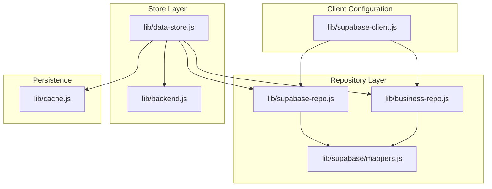
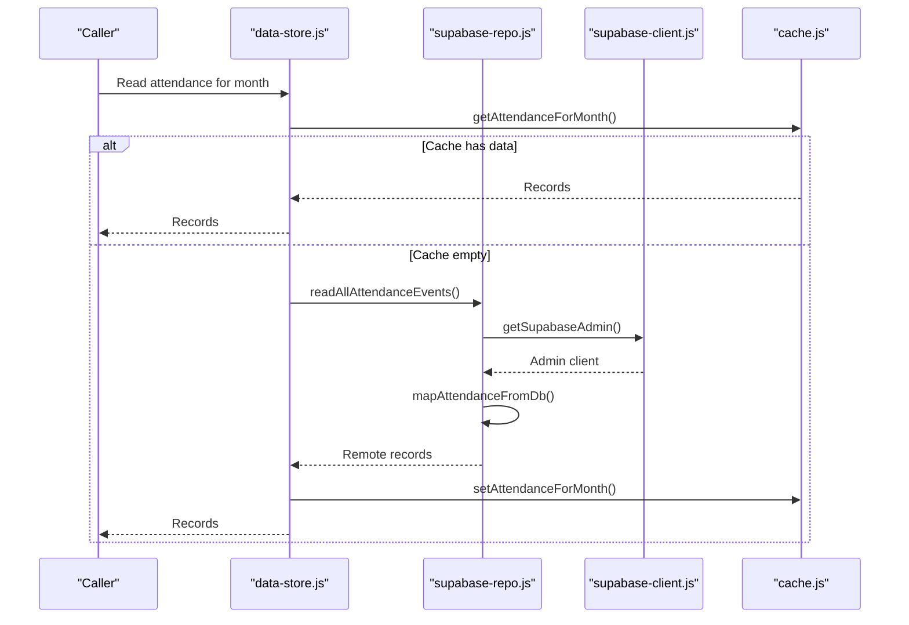
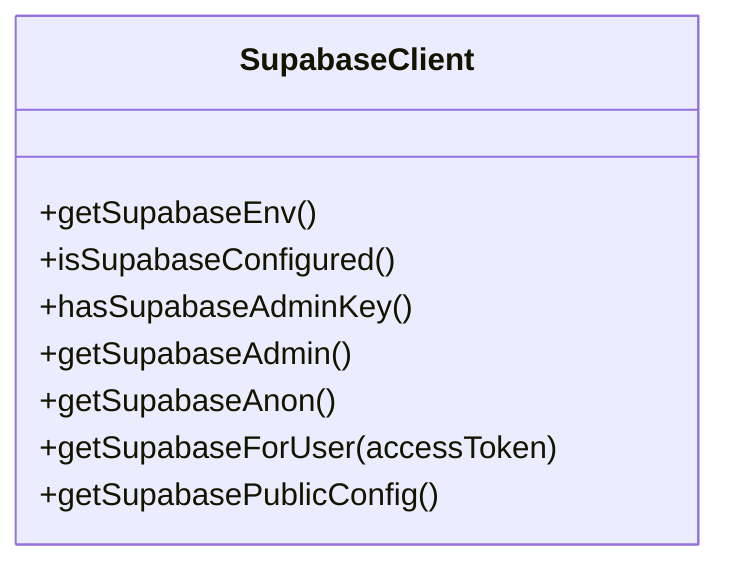
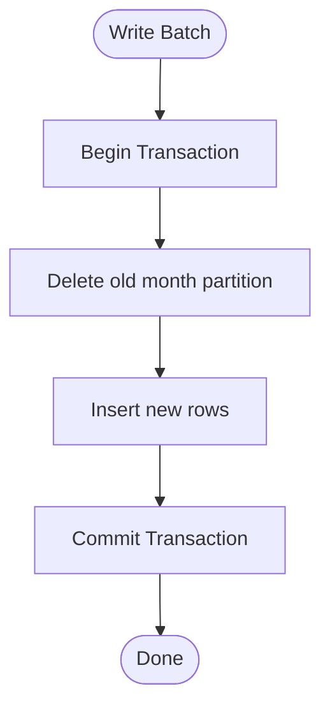
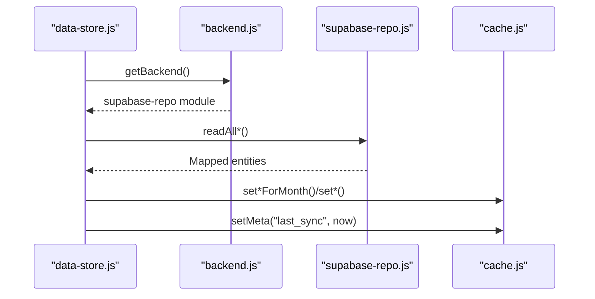
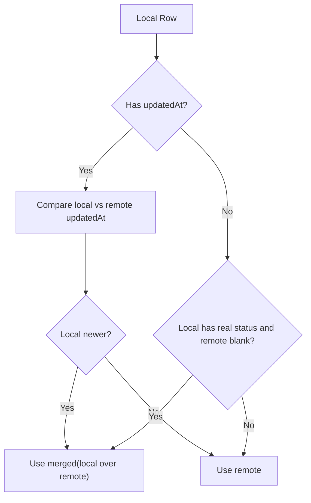
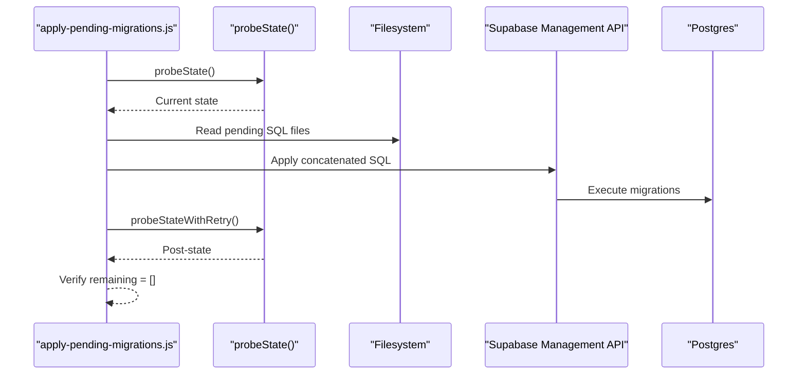
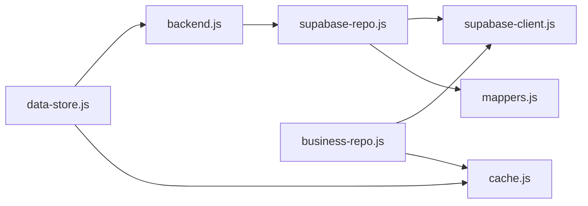

# Data Layer

<cite>
**Referenced Files in This Document**
- [supabase-client.js](file://lib/supabase-client.js)
- [cache.js](file://lib/cache.js)
- [data-store.js](file://lib/data-store.js)
- [backend.js](file://lib/backend.js)
- [supabase-repo.js](file://lib/supabase-repo.js)
- [DB_SCHEMA.md](file://DB_SCHEMA.md)
- [mappers.js](file://lib/supabase/mappers.js)
- [business-repo.js](file://lib/business-repo.js)
- [apply-pending-migrations.js](file://scripts/apply-pending-migrations.js)
</cite>

## Table of Contents
1. [Introduction](#introduction)
2. [Project Structure](#project-structure)
3. [Core Components](#core-components)
4. [Architecture Overview](#architecture-overview)
5. [Detailed Component Analysis](#detailed-component-analysis)
6. [Dependency Analysis](#dependency-analysis)
7. [Performance Considerations](#performance-considerations)
8. [Troubleshooting Guide](#troubleshooting-guide)
9. [Conclusion](#conclusion)
10. [Appendices](#appendices)

## Introduction
This document explains the multi-layered data access architecture used by the application:
- Supabase client configuration and connection management
- Local SQLite caching strategy for offline-first functionality and performance optimization
- Data store abstraction layer and repository patterns
- Database schema overview, synchronization patterns, conflict resolution, and migration handling
- Query optimization and indexing strategies

The design separates concerns across layers:
- Client configuration (Supabase)
- Repository layer (Supabase API calls and mappers)
- Store layer (orchestration, caching, sync, business logic)
- Persistence (local SQLite cache)

## Project Structure
At a high level, the data layer is organized as follows:
- lib/supabase-client.js: Supabase client factory and environment configuration
- lib/supabase-repo.js: Repository implementation over Supabase with entity mapping
- lib/business-repo.js: Business domain repositories (sales, expenses, etc.)
- lib/data-store.js: Orchestration layer that coordinates backend reads/writes and local cache updates
- lib/cache.js: Local SQLite persistence for offline-first reads and fast writes
- DB_SCHEMA.md: Canonical reference for Supabase tables and relationships
- scripts/apply-pending-migrations.js: Migration application tooling

**Diagram sources**
- [supabase-client.js:1-134](file://lib/supabase-client.js#L1-L134)
- [supabase-repo.js:1-733](file://lib/supabase-repo.js#L1-L733)
- [business-repo.js:1-200](file://lib/business-repo.js#L1-L200)
- [mappers.js:1-200](file://lib/supabase/mappers.js#L1-L200)
- [data-store.js:1-800](file://lib/data-store.js#L1-L800)
- [backend.js:1-29](file://lib/backend.js#L1-L29)
- [cache.js:1-748](file://lib/cache.js#L1-L748)

**Section sources**
- [supabase-client.js:1-134](file://lib/supabase-client.js#L1-L134)
- [backend.js:1-29](file://lib/backend.js#L1-L29)
- [supabase-repo.js:1-733](file://lib/supabase-repo.js#L1-L733)
- [business-repo.js:1-200](file://lib/business-repo.js#L1-L200)
- [data-store.js:1-800](file://lib/data-store.js#L1-L800)
- [cache.js:1-748](file://lib/cache.js#L1-L748)

## Core Components
- Supabase client configuration: Provides admin, anonymous, and user-scoped clients; validates environment variables; configures realtime transport.
- Repository pattern: Encapsulates all Supabase queries behind a stable interface; maps between DB rows and app entities.
- Data store: Orchestrates reads/writes, enforces consistency, manages sync windows, and maintains local cache state.
- Local cache: SQLite-backed persistence with transactional batch operations, indexes, and month-keyed partitions for performance.

**Section sources**
- [supabase-client.js:1-134](file://lib/supabase-client.js#L1-L134)
- [supabase-repo.js:1-733](file://lib/supabase-repo.js#L1-L733)
- [data-store.js:1-800](file://lib/data-store.js#L1-L800)
- [cache.js:1-748](file://lib/cache.js#L1-L748)

## Architecture Overview
The system uses an offline-first approach:
- Reads prefer local SQLite cache for speed and availability.
- Writes go through the repository to Supabase and immediately update the cache.
- Periodic full sync refreshes the cache from Supabase.
- Conflict resolution prefers newer local edits when timestamps are available.

**Diagram sources**
- [data-store.js:492-512](file://lib/data-store.js#L492-L512)
- [supabase-repo.js:214-227](file://lib/supabase-repo.js#L214-L227)
- [supabase-client.js:80-99](file://lib/supabase-client.js#L80-L99)
- [cache.js:178-197](file://lib/cache.js#L178-L197)

## Detailed Component Analysis

### Supabase Client Configuration and Connection Management
Responsibilities:
- Environment validation and exposure helpers
- Singleton creation of admin and anonymous clients
- User-scoped client creation with Authorization header
- Realtime transport selection (Node ws or global WebSocket)

Key behaviors:
- Throws if admin key missing when requesting admin client
- Returns public configuration without secrets
- Disables session persistence and token auto-refresh for server-side usage

**Diagram sources**
- [supabase-client.js:1-134](file://lib/supabase-client.js#L1-L134)

**Section sources**
- [supabase-client.js:1-134](file://lib/supabase-client.js#L1-L134)

### Local SQLite Caching Strategy (Offline-First)
Responsibilities:
- Initialize and manage a single SQLite database file
- Provide CRUD APIs per domain (employees, attendance, bonuses, deductions, payroll adjustments, commission tiers, loans, splits, documents, warnings)
- Maintain metadata such as last_sync timestamp and business caches
- Use transactions for bulk writes and indexes for query performance

Highlights:
- WAL mode and busy_timeout configured for concurrency
- Month-keyed storage for attendance/bonuses/deductions/payroll_adjustments
- JSON serialization for complex payloads
- Indexes on frequently filtered columns (e.g., date/year_month, employee_id)

**Diagram sources**
- [cache.js:178-189](file://lib/cache.js#L178-L189)
- [cache.js:220-232](file://lib/cache.js#L220-L232)
- [cache.js:257-274](file://lib/cache.js#L257-L274)
- [cache.js:414-424](file://lib/cache.js#L414-L424)

**Section sources**
- [cache.js:1-748](file://lib/cache.js#L1-L748)

### Data Store Abstraction Layer and Repository Patterns
Responsibilities:
- Backend selection and routing (currently Supabase only)
- Repository interface for HR and business domains
- Entity mapping between DB rows and app models
- Sync orchestration and cache warming
- Conflict resolution for concurrent edits

Key flows:
- Full sync: parallel fetch of all datasets, group by year-month, write to cache, mark last_sync
- Immediate upserts: after writing to Supabase, update cache to avoid stale reads
- Read path: prefer cache; fall back to repo and warm cache if needed

**Diagram sources**
- [data-store.js:122-219](file://lib/data-store.js#L122-L219)
- [backend.js:19-22](file://lib/backend.js#L19-L22)
- [supabase-repo.js:22-26](file://lib/supabase-repo.js#L22-L26)
- [cache.js:137-149](file://lib/cache.js#L137-L149)

**Section sources**
- [data-store.js:1-800](file://lib/data-store.js#L1-L800)
- [backend.js:1-29](file://lib/backend.js#L1-L29)
- [supabase-repo.js:1-733](file://lib/supabase-repo.js#L1-L733)

### Database Schema Overview
Canonical references and core tables include:
- employees, app_users, attendance_events, payroll_adjustments
- bonus_events, deduction_events, position_rates, position_rate_monthly
- commission_types, commission_tiers, employee_loans, loan_payments
- payroll_splits, employee_documents, employee_warnings
- Sales, finance, notifications, org/training tables

Relationships:
- employees.internal_id is a hub for child table FKs to preserve history across ID changes
- Many tables use composite keys (employee_id,date), (year_month,position), etc.
- RLS deny-all baseline enforced via migrations; app uses service role to bypass RLS

**Section sources**
- [DB_SCHEMA.md:1-228](file://DB_SCHEMA.md#L1-L228)

### Data Synchronization Patterns and Conflict Resolution
Patterns:
- Offline-first reads from cache
- Write-through to Supabase followed by immediate cache update
- Full sync batches grouped by year-month to minimize cache churn
- Optional business cache for sales/expenses/bills/bonus_requests

Conflict resolution:
- For attendance, compares updatedAt fields; local wins if newer
- If timestamps missing, local row with real status wins over blank remote skeleton

**Diagram sources**
- [data-store.js:67-103](file://lib/data-store.js#L67-L103)

**Section sources**
- [data-store.js:44-103](file://lib/data-store.js#L44-L103)

### Migration Handling
- Centralized SQL migrations under supabase/migrations
- Apply script probes current state, concatenates pending files, applies via Management API, then verifies
- App code tolerates missing tables gracefully for optional features using error detection helpers

**Diagram sources**
- [apply-pending-migrations.js:246-287](file://scripts/apply-pending-migrations.js#L246-L287)

**Section sources**
- [apply-pending-migrations.js:246-287](file://scripts/apply-pending-migrations.js#L246-L287)

### Query Optimization and Indexing Strategies
- Local cache indexes:
  - attendance.date, bonuses.date, deductions.date
  - payroll_adjustments.year_month
  - employee_documents.employee_id
  - employee_warnings.employee_id
  - employee_loans.employee_id
  - loan_payments.year_month
  - payroll_splits.year_month, employee_id
- Repository-level optimizations:
  - Select only required columns where possible
  - Filter by year-month prefix to leverage indexes
  - Upsert with explicit conflict targets to avoid unnecessary scans
- Graceful degradation:
  - Missing table errors detected and handled to keep app functional during rollout

**Section sources**
- [cache.js:37-135](file://lib/cache.js#L37-L135)
- [supabase-repo.js:130-161](file://lib/supabase-repo.js#L130-L161)
- [supabase-repo.js:208-212](file://lib/supabase-repo.js#L208-L212)

## Dependency Analysis
High-level dependencies:
- data-store depends on backend, cache, changelog, and various domain modules
- backend resolves to supabase-repo at runtime
- supabase-repo depends on supabase-client and mappers
- business-repo also depends on supabase-client and cache
- All Supabase interactions flow through supabase-client for consistent configuration

**Diagram sources**
- [data-store.js:1-20](file://lib/data-store.js#L1-L20)
- [backend.js:19-22](file://lib/backend.js#L19-L22)
- [supabase-repo.js:1-10](file://lib/supabase-repo.js#L1-L10)
- [business-repo.js:1-10](file://lib/business-repo.js#L1-L10)

**Section sources**
- [data-store.js:1-20](file://lib/data-store.js#L1-L20)
- [backend.js:1-29](file://lib/backend.js#L1-L29)
- [supabase-repo.js:1-10](file://lib/supabase-repo.js#L1-L10)
- [business-repo.js:1-10](file://lib/business-repo.js#L1-L10)

## Performance Considerations
- Prefer local reads to reduce network latency and enable offline operation
- Use month-keyed partitions and indexes to optimize range queries
- Batch writes within transactions to minimize disk I/O
- Avoid reading entire tables when filters can be applied at the repository layer
- Use skipCache options for authoritative reads during critical operations
- Handle missing tables gracefully to prevent startup failures during migrations

[No sources needed since this section provides general guidance]

## Troubleshooting Guide
Common issues and remedies:
- Missing Supabase URL or keys:
  - Ensure SUPABASE_URL and either secret or publishable keys are set
  - Admin-only endpoints require a secret/service role key
- Local cache native module not found:
  - Rebuild native dependencies or reinstall the app
- Sync timeouts:
  - Check network connectivity and Supabase availability; sync includes a timeout guard
- Missing tables during rollout:
  - Repository helpers detect 42P01 and “does not exist” errors and return safe defaults
- Stale cache after write:
  - Always upsert into cache immediately after successful Supabase write

**Section sources**
- [supabase-client.js:80-91](file://lib/supabase-client.js#L80-L91)
- [cache.js:7-18](file://lib/cache.js#L7-L18)
- [data-store.js:213-219](file://lib/data-store.js#L213-L219)
- [supabase-repo.js:208-212](file://lib/supabase-repo.js#L208-L212)

## Conclusion
The data layer combines a robust Supabase client, a clear repository pattern, and an offline-first SQLite cache to deliver reliable, performant data access. The store orchestrates synchronization and conflict resolution, while migrations and graceful error handling ensure smooth evolution of the schema.

[No sources needed since this section summarizes without analyzing specific files]

## Appendices

### Key Tables and Relationships Summary
- employees: central entity with internal_id hub for referential integrity
- attendance_events, bonus_events, deduction_events: keyed by employee_id and date
- payroll_adjustments: keyed by employee_id and year_month
- position_rates and position_rate_monthly: base and monthly overrides
- commission_types and commission_tiers: configuration and thresholds
- employee_loans and loan_payments: loan lifecycle and installments
- payroll_splits: payment splitting and deferrals
- employee_documents and employee_warnings: audit trails and notes

**Section sources**
- [DB_SCHEMA.md:56-228](file://DB_SCHEMA.md#L56-L228)