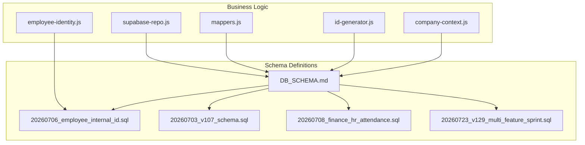
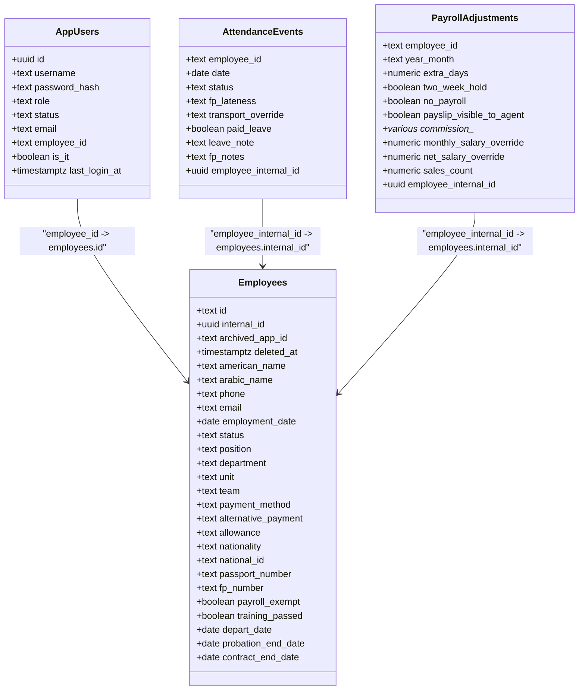
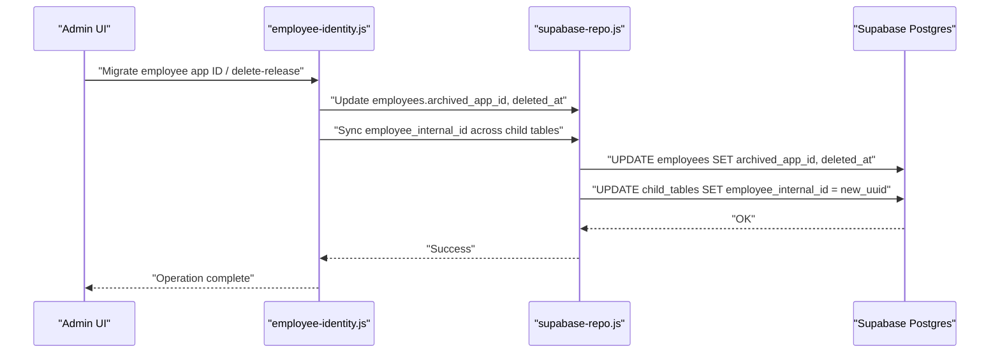
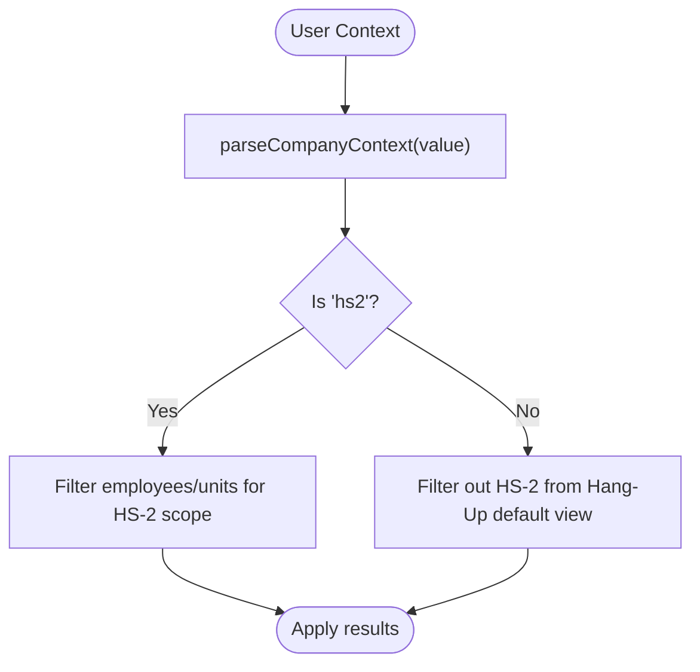
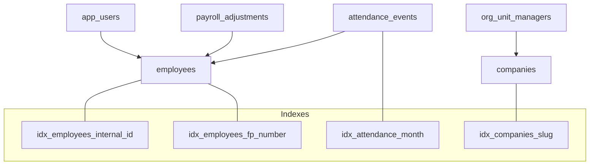

# Core HR Entities

<cite>
**Referenced Files in This Document**
- [DB_SCHEMA.md](file://DB_SCHEMA.md)
- [20260706_employee_internal_id.sql](file://supabase/migrations/20260706_employee_internal_id.sql)
- [20260703_v107_schema.sql](file://supabase/migrations/20260703_v107_schema.sql)
- [20260708_finance_hr_attendance.sql](file://supabase/migrations/20260708_finance_hr_attendance.sql)
- [20260723_v129_multi_feature_sprint.sql](file://supabase/migrations/20260723_v129_multi_feature_sprint.sql)
- [company-context.js](file://lib/company-context.js)
- [employee-identity.js](file://lib/employee-identity.js)
- [id-generator.js](file://lib/id-generator.js)
- [mappers.js](file://lib/supabase/mappers.js)
- [supabase-repo.js](file://lib/supabase-repo.js)
</cite>

## Table of Contents
1. [Introduction](#introduction)
2. [Project Structure](#project-structure)
3. [Core Components](#core-components)
4. [Architecture Overview](#architecture-overview)
5. [Detailed Component Analysis](#detailed-component-analysis)
6. [Dependency Analysis](#dependency-analysis)
7. [Performance Considerations](#performance-considerations)
8. [Troubleshooting Guide](#troubleshooting-guide)
9. [Conclusion](#conclusion)
10. [Appendices](#appendices)

## Introduction
This document provides comprehensive documentation for the core HR database entities: employees, app_users, attendance_events, and payroll_adjustments. It details schema columns, data types, constraints, relationships, indexing strategies, and validation rules. It also explains the employee_internal_id hub pattern that ensures stable UUID references across system changes (including app ID reassignments), and documents the company architecture where HS-1 and HS-3 are merged into "Hang-Up" while HS-2 remains separate. Finally, it includes examples of common queries for employee management operations and explains soft archive mechanisms using archived_app_id and deleted_at fields.

## Project Structure
The repository organizes schema definitions as Supabase migrations under supabase/migrations and business logic in lib. The canonical schema reference is maintained in DB_SCHEMA.md. Migrations add or alter tables, indexes, and constraints over time. Business logic modules implement identity management, company context, and data mapping between application objects and database rows.

**Diagram sources**
- [DB_SCHEMA.md](file://DB_SCHEMA.md)
- [20260706_employee_internal_id.sql](file://supabase/migrations/20260706_employee_internal_id.sql)
- [20260703_v107_schema.sql](file://supabase/migrations/20260703_v107_schema.sql)
- [20260708_finance_hr_attendance.sql](file://supabase/migrations/20260708_finance_hr_attendance.sql)
- [20260723_v129_multi_feature_sprint.sql](file://supabase/migrations/20260723_v129_multi_feature_sprint.sql)
- [company-context.js](file://lib/company-context.js)
- [employee-identity.js](file://lib/employee-identity.js)
- [id-generator.js](file://lib/id-generator.js)
- [mappers.js](file://lib/supabase/mappers.js)
- [supabase-repo.js](file://lib/supabase-repo.js)

**Section sources**
- [DB_SCHEMA.md](file://DB_SCHEMA.md)

## Core Components
This section summarizes the four core HR tables with their columns, types, constraints, and relationships.

- employees
  - Primary key: id (text)
  - Stable identity: internal_id (uuid) with unique index; used as FK target by child tables
  - Soft archive: archived_app_id (text), deleted_at (timestamptz)
  - Identity and contact: american_name, arabic_name, phone, email
  - Employment metadata: employment_date, status, position, department, unit, team
  - Payment and compliance: payment_method, alternative_payment, allowance, payroll_exempt, training_passed
  - Nationality and IDs: nationality, national_id, passport_number
  - Attendance fingerprint: fp_number (indexed when present)
  - Dates: depart_date, probation_end_date, contract_end_date
  - Relationships:
    - app_users.employee_id → employees.id (FK)
    - Many child tables link via employee_internal_id → employees.internal_id

- app_users
  - Primary key: id (uuid)
  - Login and roles: username, password_hash, role, status
  - Email: email
  - Employee linkage: employee_id (text) → employees.id (FK)
  - Legacy IT flag: is_it (boolean)
  - Audit: last_login_at (timestamptz)

- attendance_events
  - Composite primary key: (employee_id text, date date)
  - Status and notes: status, fp_lateness, transport_override, paid_leave, leave_note, fp_notes
  - Stable identity: employee_internal_id (uuid) → employees.internal_id (FK)
  - Indexes: composite PK; additional indexes may be applied by migrations

- payroll_adjustments
  - Composite primary key: (employee_id text, year_month text)
  - Adjustments: extra_days, two_week_hold, no_payroll, payslip_visible_to_agent
  - Payroll fields: commission_* variants, monthly_salary_override, net_salary_override, sales_count
  - Stable identity: employee_internal_id (uuid) → employees.internal_id (FK)

Notes on constraints and validation:
- Foreign keys ensure referential integrity to employees.id and employees.internal_id.
- Check constraints exist in other tables (e.g., loan_requests.status); payroll_adjustments uses numeric/boolean fields without explicit check constraints in the referenced schema summary.
- Unique indexes include idx_employees_internal_id and others defined in migrations.

**Section sources**
- [DB_SCHEMA.md](file://DB_SCHEMA.md)
- [20260706_employee_internal_id.sql](file://supabase/migrations/20260706_employee_internal_id.sql)
- [20260703_v107_schema.sql](file://supabase/migrations/20260703_v107_schema.sql)
- [20260708_finance_hr_attendance.sql](file://supabase/migrations/20260708_finance_hr_attendance.sql)

## Architecture Overview
The HR architecture centers around a stable internal identity per employee (internal_id) while allowing changeable display/app IDs (id). Child tables maintain both legacy employee_id and new employee_internal_id to preserve historical records even if an employee’s app ID changes. Company architecture consolidates HS-1 and HS-3 into "Hang-Up", while HS-2 remains separate. Access control and filtering are enforced through company context and RBAC.

**Diagram sources**
- [DB_SCHEMA.md](file://DB_SCHEMA.md)
- [20260706_employee_internal_id.sql](file://supabase/migrations/20260706_employee_internal_id.sql)

## Detailed Component Analysis

### Employee Internal ID Hub Pattern
The employee_internal_id hub ensures that all child records remain linked to the correct person even if the employee’s app ID changes. The migration adds internal_id to employees and backfills child tables with employee_internal_id referencing employees(internal_id). Application logic updates these fields during promotions, reassignments, and deletions.

**Diagram sources**
- [employee-identity.js](file://lib/employee-identity.js)
- [20260706_employee_internal_id.sql](file://supabase/migrations/20260706_employee_internal_id.sql)
- [supabase-repo.js](file://lib/supabase-repo.js)

**Section sources**
- [20260706_employee_internal_id.sql](file://supabase/migrations/20260706_employee_internal_id.sql)
- [employee-identity.js](file://lib/employee-identity.js)

### Company Architecture: Hang-Up vs HS-2
HS-1 and HS-3 are merged into "Hang-Up"; HS-2 remains separate. The companies table stores slugs and names, and org_unit_managers links units to companies. Business logic filters employees and units based on user roles and company context.

**Diagram sources**
- [company-context.js](file://lib/company-context.js)
- [20260723_v129_multi_feature_sprint.sql](file://supabase/migrations/20260723_v129_multi_feature_sprint.sql)

**Section sources**
- [company-context.js](file://lib/company-context.js)
- [20260723_v129_multi_feature_sprint.sql](file://supabase/migrations/20260723_v129_multi_feature_sprint.sql)
- [DB_SCHEMA.md](file://DB_SCHEMA.md)

### Employee Management Operations and Queries
Common operations include creating, updating, archiving, and querying employees and related records. The following examples illustrate typical queries and upsert patterns used by the application.

- Create or update an employee record:
  - Upsert employees by id; set internal_id once; populate identity and employment fields.
  - Example path: [id-generator.js](file://lib/id-generator.js) for ID suggestion/validation.

- Archive an employee (soft delete):
  - Set archived_app_id and deleted_at; optionally reassign app_id references; sync employee_internal_id across child tables.
  - Example path: [employee-identity.js](file://lib/employee-identity.js)

- Read attendance events for a month:
  - Select attendance_events filtered by date prefix (YYYY-MM).
  - Example path: [supabase-repo.js](file://lib/supabase-repo.js)

- Upsert payroll adjustments:
  - Upsert payroll_adjustments by (employee_id, year_month); merge existing fields; map to/from application model.
  - Example path: [mappers.js](file://lib/supabase/mappers.js), [supabase-repo.js](file://lib/supabase-repo.js)

- Link app users to employees:
  - Ensure app_users.employee_id references employees.id; handle ON DELETE SET NULL.
  - Example path: [20260703_v107_schema.sql](file://supabase/migrations/20260703_v107_schema.sql), [20260710_v110_relations.sql](file://supabase/migrations/20260710_v110_relations.sql)

**Section sources**
- [id-generator.js](file://lib/id-generator.js)
- [employee-identity.js](file://lib/employee-identity.js)
- [supabase-repo.js](file://lib/supabase-repo.js)
- [mappers.js](file://lib/supabase/mappers.js)
- [20260703_v107_schema.sql](file://supabase/migrations/20260703_v107_schema.sql)

### Data Validation Rules
- Check constraints:
  - loan_requests.status IN ('pending', 'approved', 'denied', 'cancelled')
  - saved_reports.report_type IN ('employees', 'attendance', 'payroll')
  - Other tables define domain-specific checks (e.g., sales, expenses, notifications)
- Unique constraints:
  - companies.slug UNIQUE
  - idx_public_holidays_date_country on (holiday_date, country)
  - idx_employees_internal_id UNIQUE
- Referential integrity:
  - app_users.employee_id → employees.id
  - attendance_events.employee_internal_id → employees.internal_id
  - payroll_adjustments.employee_internal_id → employees.internal_id

**Section sources**
- [20260708_finance_hr_attendance.sql](file://supabase/migrations/20260708_finance_hr_attendance.sql)
- [20260723_v129_multi_feature_sprint.sql](file://supabase/migrations/20260723_v129_multi_feature_sprint.sql)
- [20260707_holidays_country_unique.sql](file://supabase/migrations/20260707_holidays_country_unique.sql)
- [20260706_employee_internal_id.sql](file://supabase/migrations/20260706_employee_internal_id.sql)
- [20260703_v107_schema.sql](file://supabase/migrations/20260703_v107_schema.sql)

## Dependency Analysis
The core HR entities depend on stable identity and company scoping. The dependency graph shows how migrations establish relationships and how business logic enforces constraints and filters.

**Diagram sources**
- [20260706_employee_internal_id.sql](file://supabase/migrations/20260706_employee_internal_id.sql)
- [20260708_finance_hr_attendance.sql](file://supabase/migrations/20260708_finance_hr_attendance.sql)
- [20260723_v129_multi_feature_sprint.sql](file://supabase/migrations/20260723_v129_multi_feature_sprint.sql)
- [DB_SCHEMA.md](file://DB_SCHEMA.md)

**Section sources**
- [DB_SCHEMA.md](file://DB_SCHEMA.md)
- [20260706_employee_internal_id.sql](file://supabase/migrations/20260706_employee_internal_id.sql)
- [20260708_finance_hr_attendance.sql](file://supabase/migrations/20260708_finance_hr_attendance.sql)
- [20260723_v129_multi_feature_sprint.sql](file://supabase/migrations/20260723_v129_multi_feature_sprint.sql)

## Performance Considerations
- Use composite primary keys efficiently:
  - attendance_events(employee_id, date)
  - payroll_adjustments(employee_id, year_month)
- Leverage indexes:
  - idx_employees_internal_id for stable joins
  - idx_employees_fp_number for fingerprint lookups
  - idx_companies_slug for company scoping
  - Month-based indexes (e.g., idx_attendance_month) for range scans
- Prefer employee_internal_id for joins to avoid cascading updates when app IDs change.
- Batch upserts for large imports (e.g., batchUpsertAttendance) to reduce round-trips.

[No sources needed since this section provides general guidance]

## Troubleshooting Guide
- Missing table errors:
  - Detect and handle missing tables gracefully during migrations or reads.
  - Example path: [supabase-repo.js](file://lib/supabase-repo.js)

- RLS deny-all policies:
  - All public tables have deny_anon/deny_authenticated policies; ensure service role usage for backend operations.
  - Example path: [DB_SCHEMA.md](file://DB_SCHEMA.md)

- Employee deletion and release:
  - When deleting or releasing an employee, ensure archived_app_id and deleted_at are set; verify employee_internal_id synchronization.
  - Example path: [employee-identity.js](file://lib/employee-identity.js)

- Company context mismatches:
  - Verify parseCompanyContext and filterEmployeesByCompany behavior for HS-2 vs Hang-Up views.
  - Example path: [company-context.js](file://lib/company-context.js)

**Section sources**
- [supabase-repo.js](file://lib/supabase-repo.js)
- [DB_SCHEMA.md](file://DB_SCHEMA.md)
- [employee-identity.js](file://lib/employee-identity.js)
- [company-context.js](file://lib/company-context.js)

## Conclusion
The core HR entities are designed for stability and scalability. The employee_internal_id hub preserves historical integrity across app ID changes, while company architecture cleanly separates HS-2 from Hang-Up. Robust constraints, indexes, and RLS policies support secure and efficient operations. Common queries and mappings are implemented consistently across the codebase, enabling reliable employee management workflows.

[No sources needed since this section summarizes without analyzing specific files]

## Appendices

### Appendix A: Soft Archive Mechanism
- archived_app_id: Stores the original app ID before reassignment or deletion.
- deleted_at: Timestamp marking the soft delete event.
- Behavior:
  - On delete-release, employees are marked with archived_app_id and deleted_at.
  - employee_internal_id remains unchanged, preserving links to child records.
  - Example path: [employee-identity.js](file://lib/employee-identity.js)

**Section sources**
- [employee-identity.js](file://lib/employee-identity.js)
- [20260706_employee_internal_id.sql](file://supabase/migrations/20260706_employee_internal_id.sql)

### Appendix B: Mapping Between Application Models and Database Rows
- mappers.js maps payroll adjustments and attendance events between application models and database rows.
- Example paths:
  - [mappers.js](file://lib/supabase/mappers.js)
  - [supabase-repo.js](file://lib/supabase-repo.js)

**Section sources**
- [mappers.js](file://lib/supabase/mappers.js)
- [supabase-repo.js](file://lib/supabase-repo.js)