# Database Schema Design

<cite>
**Referenced Files in This Document**
- [DB_SCHEMA.md](file://DB_SCHEMA.md)
- [20260702_hrms_advanced_schema.sql](file://supabase/migrations/20260702_hrms_advanced_schema.sql)
- [20260702_rls_deny_all.sql](file://supabase/migrations/20260702_rls_deny_all.sql)
- [20260709_v109b5_sprint.sql](file://supabase/migrations/20260709_v109b5_sprint.sql)
- [20260715_rbac_payslip_grants.sql](file://supabase/migrations/20260715_rbac_payslip_grants.sql)
- [20260716_app_role_permissions.sql](file://supabase/migrations/20260716_app_role_permissions.sql)
- [20260717_app_user_permissions.sql](file://supabase/migrations/20260717_app_user_permissions.sql)
- [20260718_notifications_quality_notes.sql](file://supabase/migrations/20260718_notifications_quality_notes.sql)
- [20260719_v140_sales_org_dashboards.sql](file://supabase/migrations/20260719_v140_sales_org_dashboards.sql)
- [20260720_sales_attachment_permissions.sql](file://supabase/migrations/20260720_sales_attachment_permissions.sql)
- [20260721_sales_airtable_sync.sql](file://supabase/migrations/20260721_sales_airtable_sync.sql)
- [20260723_v129_multi_feature_sprint.sql](file://supabase/migrations/20260723_v129_multi_feature_sprint.sql)
- [20260724_v130_finance_company_scope.sql](file://supabase/migrations/20260724_v130_finance_company_scope.sql)
- [20260725_add_net_salary_override.sql](file://supabase/migrations/20260725_add_net_salary_override.sql)
- [20260726_v178_leave_fraction_pause.sql](file://supabase/migrations/20260726_v178_leave_fraction_pause.sql)
</cite>

## Table of Contents
1. Introduction
2. Project Structure
3. Core Components
4. Architecture Overview
5. Detailed Component Analysis
6. Dependency Analysis
7. Performance Considerations
8. Troubleshooting Guide
9. Conclusion
10. Appendices

## Introduction
This document provides comprehensive database schema documentation for the HR management system built on Supabase Postgres. It covers core entities (employees, attendance, payroll, sales), organizational structures, and multi-company scoping. It also documents Row Level Security (RLS) policies for data isolation, migration history, versioning, upgrade procedures, performance considerations, query patterns, and backup/restore strategies.

## Project Structure
The canonical schema reference is maintained in DB_SCHEMA.md with a chronological migration timeline. Migrations under supabase/migrations implement DDL changes, RLS policies, indexes, and backfills. The application uses the service role to bypass RLS; direct client access is denied by default.

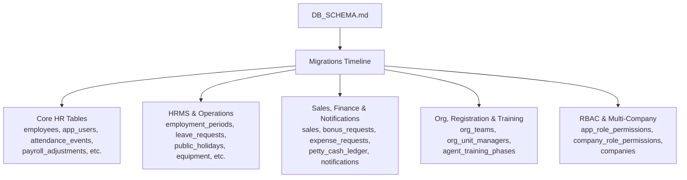

**Diagram sources**
- [DB_SCHEMA.md:13-50](file://DB_SCHEMA.md#L13-L50)

**Section sources**
- [DB_SCHEMA.md:1-12](file://DB_SCHEMA.md#L1-L12)
- [DB_SCHEMA.md:13-50](file://DB_SCHEMA.md#L13-L50)

## Core Components
- Employees and identity
  - employees: primary employee record with identifiers, employment metadata, compliance flags, and soft archive fields.
  - app_users: login accounts linked to employees via employee_id; includes role and optional IT flag.
- Attendance
  - attendance_events: per-employee daily records with status, lateness, overrides, and notes.
- Payroll
  - payroll_adjustments: monthly adjustments including salary overrides, commission fields, visibility flags, and net override.
- Sales
  - sales: MLA-Ray sales log with JSON form_data, working_day, submission_time, price_tier_label, and Airtable sync fields.
  - sales_field_permissions, sales_action_permissions, sales_list_column_config, sales_attachment_permissions: fine-grained field/action/attachment permissions.
  - sales_attachments: Dropbox file references tied to sales.
  - sales_visibility_grants: temporary wider view grants with expiry.
- Finance and expenses
  - bonus_requests, expense_requests, monthly_bills, petty_cash_funds, petty_cash_ledger, employee_loans, loan_payments, bonus_events, deduction_events: all scoped by unit/company.
- HRMS and operations
  - employment_periods, action_improvement_plans, onboarding_checklists, offboarding_checklists, clearance_items, equipment, equipment_assignments, leave_requests, public_holidays, payroll_month_locks, app_sessions.
- Org, registration, training
  - org_teams, org_unit_managers (with company_slug), registration_daily_pins, agent_registration_requests, agent_training_programs, agent_training_phases.
- RBAC and multi-company
  - companies: dynamic registry of companies with slug, defaults, and active state.
  - app_role_permissions: global role-permission overrides.
  - company_role_permissions: per-company permission overrides.
  - app_user_permissions: per-user permission exceptions.
- Notifications and quality
  - notification_routing_rules: configurable recipients per action.
  - employee_quality_notes: quality-team notes per employee.

**Section sources**
- [DB_SCHEMA.md:56-228](file://DB_SCHEMA.md#L56-L228)
- [20260702_hrms_advanced_schema.sql:1-140](file://supabase/migrations/20260702_hrms_advanced_schema.sql#L1-L140)
- [20260709_v109b5_sprint.sql:1-46](file://supabase/migrations/20260709_v109b5_sprint.sql#L1-L46)
- [20260715_rbac_payslip_grants.sql:1-6](file://supabase/migrations/20260715_rbac_payslip_grants.sql#L1-L6)
- [20260716_app_role_permissions.sql:1-26](file://supabase/migrations/20260716_app_role_permissions.sql#L1-L26)
- [20260717_app_user_permissions.sql:1-12](file://supabase/migrations/20260717_app_user_permissions.sql#L1-L12)
- [20260718_notifications_quality_notes.sql:1-37](file://supabase/migrations/20260718_notifications_quality_notes.sql#L1-L37)
- [20260719_v140_sales_org_dashboards.sql:1-36](file://supabase/migrations/20260719_v140_sales_org_dashboards.sql#L1-L36)
- [20260720_sales_attachment_permissions.sql:1-22](file://supabase/migrations/20260720_sales_attachment_permissions.sql#L1-L22)
- [20260721_sales_airtable_sync.sql:1-9](file://supabase/migrations/20260721_sales_airtable_sync.sql#L1-L9)
- [20260723_v129_multi_feature_sprint.sql:1-133](file://supabase/migrations/20260723_v129_multi_feature_sprint.sql#L1-L133)
- [20260724_v130_finance_company_scope.sql:1-112](file://supabase/migrations/20260724_v130_finance_company_scope.sql#L1-L112)
- [20260725_add_net_salary_override.sql:1-6](file://supabase/migrations/20260725_add_net_salary_override.sql#L1-L6)
- [20260726_v178_leave_fraction_pause.sql:1-29](file://supabase/migrations/20260726_v178_leave_fraction_pause.sql#L1-L29)

## Architecture Overview
The database enforces strict access control via RLS. All tables are created with RLS enabled and deny-all policies for anon/authenticated roles. Application code uses the service role to bypass RLS. New tables receive explicit deny-all policies within their migrations.

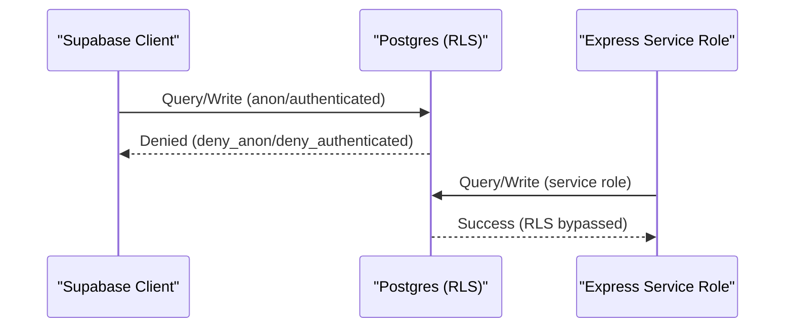

**Diagram sources**
- [20260702_rls_deny_all.sql:1-23](file://supabase/migrations/20260702_rls_deny_all.sql#L1-L23)

**Section sources**
- [DB_SCHEMA.md:8-11](file://DB_SCHEMA.md#L8-L11)
- [DB_SCHEMA.md:51-54](file://DB_SCHEMA.md#L51-L54)
- [20260702_rls_deny_all.sql:1-23](file://supabase/migrations/20260702_rls_deny_all.sql#L1-L23)

## Detailed Component Analysis

### Employee and Identity Model
- employees: Primary entity with composite identifiers (id, internal_id). Internal UUID enables stable FK targets across app ID changes.
- app_users: Login account with role and optional IT flag; links to employees via employee_id.
- Key relationships:
  - attendance_events.employee_internal_id → employees.internal_id
  - payroll_adjustments.employee_internal_id → employees.internal_id
  - Many child tables reference employees.id or employees.internal_id depending on design choice.

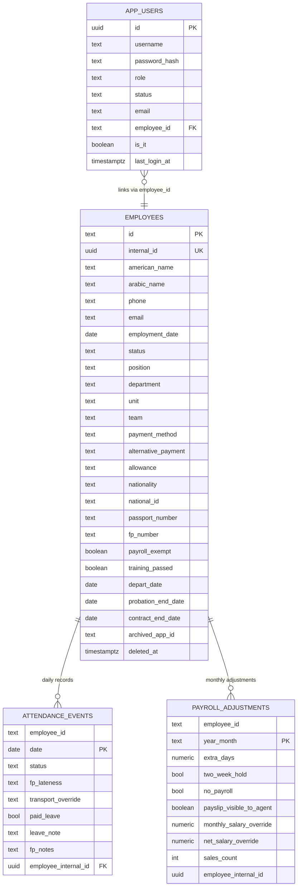

**Diagram sources**
- [DB_SCHEMA.md:60-106](file://DB_SCHEMA.md#L60-L106)
- [20260706_employee_internal_id.sql](file://supabase/migrations/20260706_employee_internal_id.sql)
- [20260725_add_net_salary_override.sql:1-6](file://supabase/migrations/20260725_add_net_salary_override.sql#L1-L6)

**Section sources**
- [DB_SCHEMA.md:60-106](file://DB_SCHEMA.md#L60-L106)
- [20260725_add_net_salary_override.sql:1-6](file://supabase/migrations/20260725_add_net_salary_override.sql#L1-L6)

### Attendance and Leave Management
- attendance_events: Composite PK (employee_id, date); tracks daily attendance, lateness, overrides, and notes.
- leave_requests: Supports full-day, half-day, quarter-day via day_fraction, half_day, half_day_part; request_kind values include annual, unpaid, medical, same_day, pause.

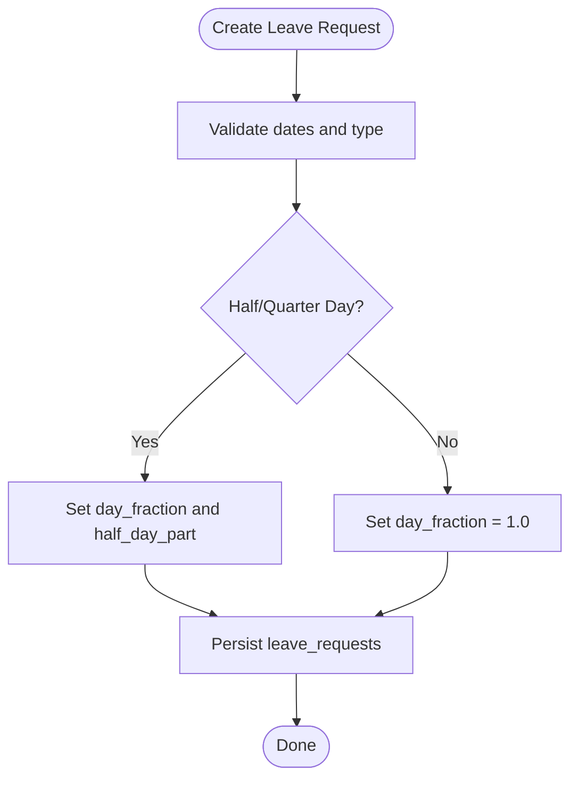

**Diagram sources**
- [20260726_v178_leave_fraction_pause.sql:1-29](file://supabase/migrations/20260726_v178_leave_fraction_pause.sql#L1-L29)
- [20260702_hrms_advanced_schema.sql:87-99](file://supabase/migrations/20260702_hrms_advanced_schema.sql#L87-L99)

**Section sources**
- [DB_SCHEMA.md:86-93](file://DB_SCHEMA.md#L86-L93)
- [20260702_hrms_advanced_schema.sql:87-99](file://supabase/migrations/20260702_hrms_advanced_schema.sql#L87-L99)
- [20260726_v178_leave_fraction_pause.sql:1-29](file://supabase/migrations/20260726_v178_leave_fraction_pause.sql#L1-L29)

### Payroll Adjustments and Visibility
- payroll_adjustments: Monthly adjustments with salary overrides, commission fields, sales_count, and visibility controls.
- payslip_visible_to_agent: HR releases payslip to agent per month.
- net_salary_override: Optional manual override replacing calculated netSalary for the month.

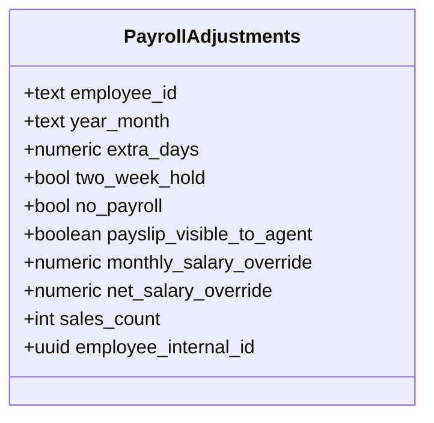

**Diagram sources**
- [DB_SCHEMA.md:94-102](file://DB_SCHEMA.md#L94-L102)
- [20260715_rbac_payslip_grants.sql:1-6](file://supabase/migrations/20260715_rbac_payslip_grants.sql#L1-L6)
- [20260725_add_net_salary_override.sql:1-6](file://supabase/migrations/20260725_add_net_salary_override.sql#L1-L6)

**Section sources**
- [DB_SCHEMA.md:94-102](file://DB_SCHEMA.md#L94-L102)
- [20260715_rbac_payslip_grants.sql:1-6](file://supabase/migrations/20260715_rbac_payslip_grants.sql#L1-L6)
- [20260725_add_net_salary_override.sql:1-6](file://supabase/migrations/20260725_add_net_salary_override.sql#L1-L6)

### Sales Data Model and Permissions
- sales: Core sales log with JSON form_data, working_day, submission_time, price_tier_label, and Airtable sync fields.
- Field-level permissions: sales_field_permissions defines view/edit roles and sections.
- Action-level permissions: sales_action_permissions controls allowed roles per action.
- List column configuration: sales_list_column_config manages UI columns and admin-only toggles.
- Attachment permissions: sales_attachment_permissions controls view/edit roles per attachment kind.
- Attachments: sales_attachments stores Dropbox references with kind validation.
- Temporary visibility grants: sales_visibility_grants allows time-bound wider views.

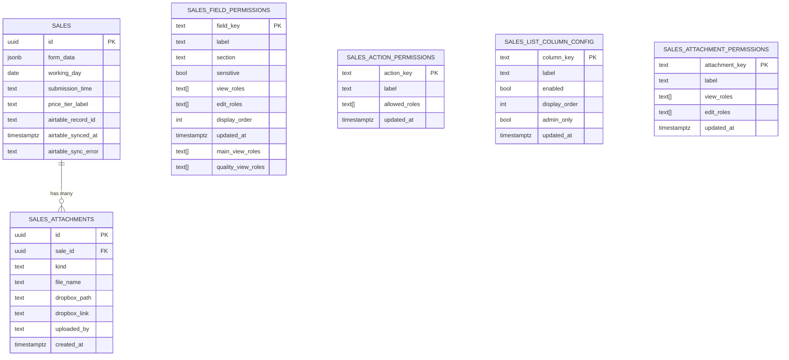

**Diagram sources**
- [DB_SCHEMA.md:124-140](file://DB_SCHEMA.md#L124-L140)
- [20260709_v109b5_sprint.sql:7-30](file://supabase/migrations/20260709_v109b5_sprint.sql#L7-L30)
- [20260719_v140_sales_org_dashboards.sql:1-36](file://supabase/migrations/20260719_v140_sales_org_dashboards.sql#L1-L36)
- [20260720_sales_attachment_permissions.sql:1-22](file://supabase/migrations/20260720_sales_attachment_permissions.sql#L1-L22)
- [20260721_sales_airtable_sync.sql:1-9](file://supabase/migrations/20260721_sales_airtable_sync.sql#L1-L9)

**Section sources**
- [DB_SCHEMA.md:124-140](file://DB_SCHEMA.md#L124-L140)
- [20260709_v109b5_sprint.sql:7-30](file://supabase/migrations/20260709_v109b5_sprint.sql#L7-L30)
- [20260719_v140_sales_org_dashboards.sql:1-36](file://supabase/migrations/20260719_v140_sales_org_dashboards.sql#L1-L36)
- [20260720_sales_attachment_permissions.sql:1-22](file://supabase/migrations/20260720_sales_attachment_permissions.sql#L1-L22)
- [20260721_sales_airtable_sync.sql:1-9](file://supabase/migrations/20260721_sales_airtable_sync.sql#L1-L9)

### Finance and Expenses with Company Scoping
- Finance tables include unit column for per-company separation: employee_loans, loan_payments, bonus_events, deduction_events, bonus_requests, expense_requests, monthly_bills, petty_cash_funds, petty_cash_ledger.
- Backfills populate unit from employee.unit where missing.

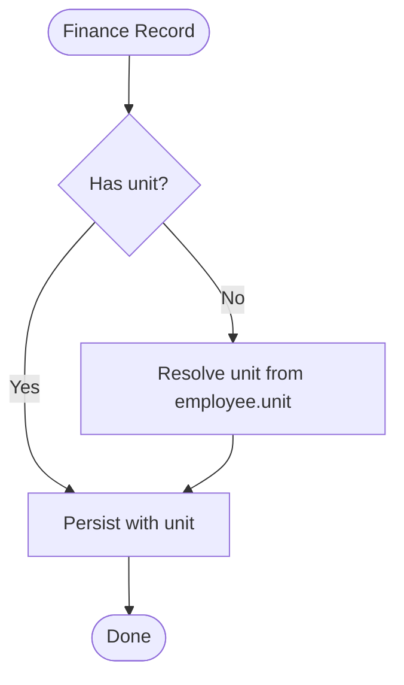

**Diagram sources**
- [20260724_v130_finance_company_scope.sql:1-112](file://supabase/migrations/20260724_v130_finance_company_scope.sql#L1-L112)

**Section sources**
- [DB_SCHEMA.md:106-107](file://DB_SCHEMA.md#L106-L107)
- [20260724_v130_finance_company_scope.sql:1-112](file://supabase/migrations/20260724_v130_finance_company_scope.sql#L1-L112)

### Organizations, Teams, and Companies
- companies: Dynamic registry with slug, name, short_name, is_default, active, sort_order, color, audit fields.
- org_unit_managers: Links units to companies via company_slug; supports OP/HR per unit.
- org_teams: Teams with tl_employee_id; unique index on lower(trim(name)).

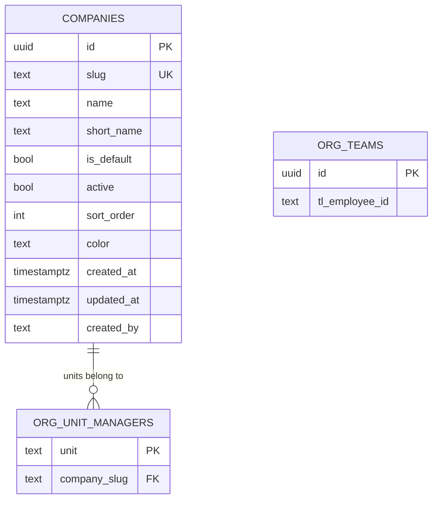

**Diagram sources**
- [20260723_v129_multi_feature_sprint.sql:47-101](file://supabase/migrations/20260723_v129_multi_feature_sprint.sql#L47-L101)
- [DB_SCHEMA.md:141-153](file://DB_SCHEMA.md#L141-L153)

**Section sources**
- [DB_SCHEMA.md:141-153](file://DB_SCHEMA.md#L141-L153)
- [20260723_v129_multi_feature_sprint.sql:47-101](file://supabase/migrations/20260723_v129_multi_feature_sprint.sql#L47-L101)

### RBAC and Permission Overrides
- app_role_permissions: Global role-permission overrides with PK (role, permission_key).
- company_role_permissions: Per-company overrides extending app_role_permissions with company_slug scope.
- app_user_permissions: Per-user exceptions keyed by (username, permission_key).

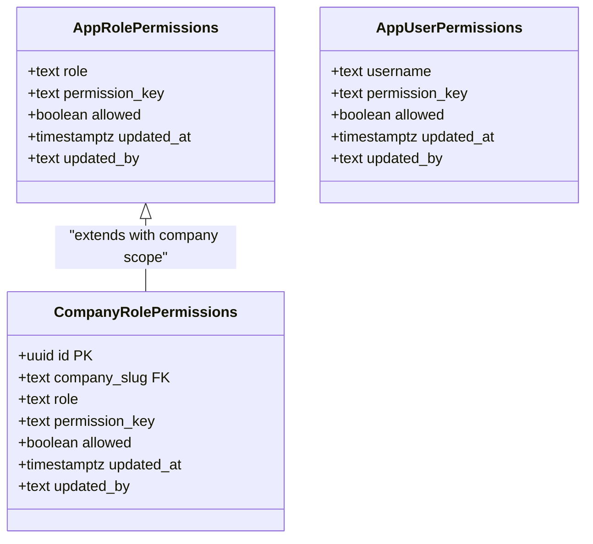

**Diagram sources**
- [20260716_app_role_permissions.sql:1-26](file://supabase/migrations/20260716_app_role_permissions.sql#L1-L26)
- [20260717_app_user_permissions.sql:1-12](file://supabase/migrations/20260717_app_user_permissions.sql#L1-L12)
- [20260723_v129_multi_feature_sprint.sql:74-91](file://supabase/migrations/20260723_v129_multi_feature_sprint.sql#L74-L91)

**Section sources**
- [DB_SCHEMA.md:175-218](file://DB_SCHEMA.md#L175-L218)
- [20260716_app_role_permissions.sql:1-26](file://supabase/migrations/20260716_app_role_permissions.sql#L1-L26)
- [20260717_app_user_permissions.sql:1-12](file://supabase/migrations/20260717_app_user_permissions.sql#L1-L12)
- [20260723_v129_multi_feature_sprint.sql:74-91](file://supabase/migrations/20260723_v129_multi_feature_sprint.sql#L74-L91)

### Notifications and Quality Notes
- notification_routing_rules: Configurable recipients per action (roles/usernames).
- employee_quality_notes: Quality-team notes per employee with author metadata and timestamps.

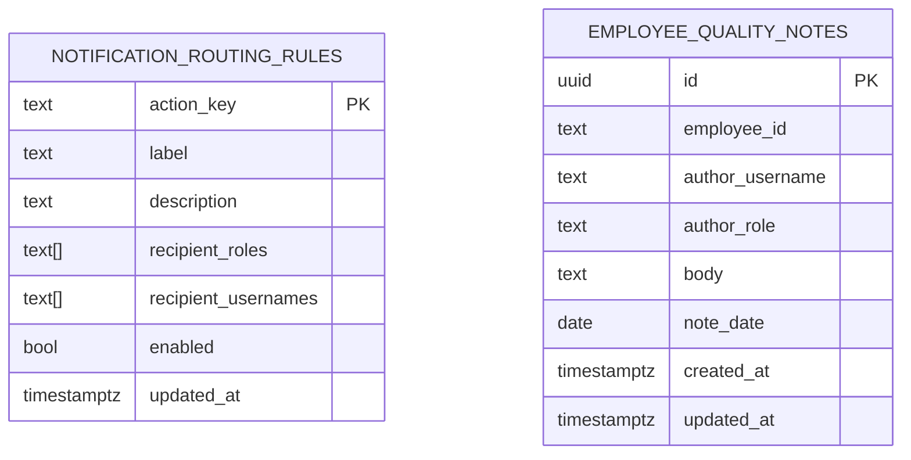

**Diagram sources**
- [20260718_notifications_quality_notes.sql:1-37](file://supabase/migrations/20260718_notifications_quality_notes.sql#L1-37)

**Section sources**
- [DB_SCHEMA.md:124-140](file://DB_SCHEMA.md#L124-L140)
- [20260718_notifications_quality_notes.sql:1-37](file://supabase/migrations/20260718_notifications_quality_notes.sql#L1-37)

## Dependency Analysis
Key foreign key relationships and constraints:
- attendance_events.employee_internal_id → employees.internal_id
- payroll_adjustments.employee_internal_id → employees.internal_id
- sales_attachments.sale_id → sales.id
- equipment_assignments.equipment_id → equipment.id
- equipment_assignments.employee_id → employees.id
- leave_requests.employee_id → employees.id
- employment_periods.employee_id → employees.id
- action_improvement_plans.employee_id → employees.id
- clearance_items.employee_id → employees.id
- org_unit_managers.company_slug → companies.slug
- company_role_permissions.company_slug → companies.slug
- app_users.employee_id → employees.id

Indexes commonly used:
- idx_employment_periods_employee
- idx_aip_employee
- idx_equipment_assign_emp
- idx_org_teams_name_lower
- idx_companies_slug
- idx_companies_active
- idx_company_role_perms_company
- idx_company_role_perms_role
- idx_employee_loans_unit
- idx_loan_payments_unit
- idx_bonus_events_unit
- idx_deduction_events_unit
- idx_bonus_requests_unit
- idx_expense_requests_unit
- idx_monthly_bills_unit
- idx_petty_cash_funds_unit
- idx_petty_cash_ledger_unit
- idx_it_requests_unit
- idx_leave_requests_request_kind
- idx_quality_notes_employee
- idx_quality_notes_created
- idx_app_sessions_user
- sales_airtable_record_id_idx

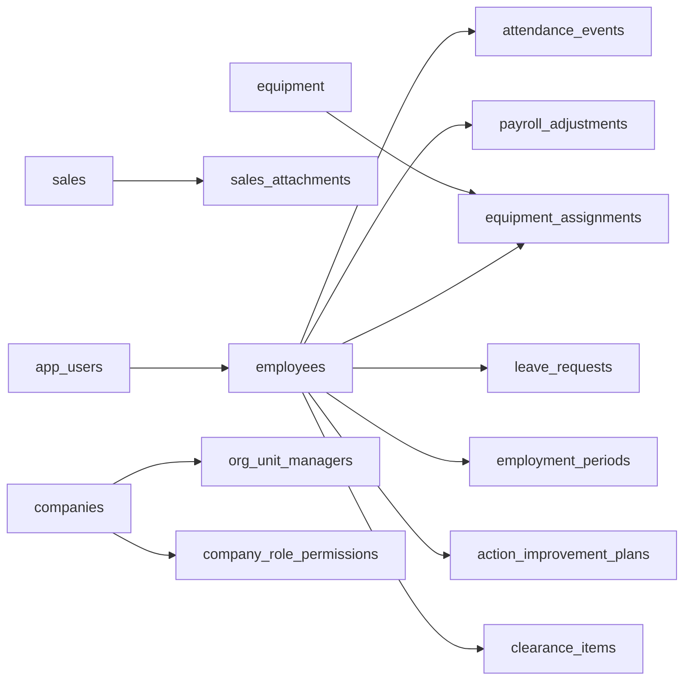

**Diagram sources**
- [20260702_hrms_advanced_schema.sql:9-85](file://supabase/migrations/20260702_hrms_advanced_schema.sql#L9-L85)
- [20260709_v109b5_sprint.sql:20-30](file://supabase/migrations/20260709_v109b5_sprint.sql#L20-L30)
- [20260723_v129_multi_feature_sprint.sql:47-101](file://supabase/migrations/20260723_v129_multi_feature_sprint.sql#L47-L101)
- [20260724_v130_finance_company_scope.sql:1-112](file://supabase/migrations/20260724_v130_finance_company_scope.sql#L1-L112)

**Section sources**
- [20260702_hrms_advanced_schema.sql:9-85](file://supabase/migrations/20260702_hrms_advanced_schema.sql#L9-L85)
- [20260709_v109b5_sprint.sql:20-30](file://supabase/migrations/20260709_v109b5_sprint.sql#L20-L30)
- [20260723_v129_multi_feature_sprint.sql:47-101](file://supabase/migrations/20260723_v129_multi_feature_sprint.sql#L47-L101)
- [20260724_v130_finance_company_scope.sql:1-112](file://supabase/migrations/20260724_v130_finance_company_scope.sql#L1-L112)

## Performance Considerations
- Index usage:
  - Prefer filters on indexed columns such as unit, company_slug, employee_id, sale_id, request_kind, and created_at for reporting queries.
  - Use partial indexes like sales_airtable_record_id_idx when querying synced records.
- Partitioning candidates:
  - Large tables like attendance_events and sales may benefit from partitioning by date ranges if growth warrants it.
- Denormalization:
  - price_tier_label on sales reduces joins for quality views.
- Locking and concurrency:
  - payroll_month_locks prevents concurrent payroll runs per month.
- Query patterns:
  - Filter by unit/company early to leverage indexes and reduce scan size.
  - Avoid SELECT *; project only needed columns.
- JSONB:
  - For sales.form_data, considerGIN indexes on frequently queried keys if needed.

[No sources needed since this section provides general guidance]

## Troubleshooting Guide
- Direct client access denied:
  - Ensure requests use service role; anon/authenticated are blocked by deny-all policies.
- Missing RLS policies on new tables:
  - Verify deny_all_<table> policies exist; apply migration that creates them.
- Permission issues:
  - Check app_role_permissions, company_role_permissions, and app_user_permissions for overrides.
- Payslip not visible to agents:
  - Confirm payslip_visible_to_agent is set for the relevant month.
- Net salary mismatch:
  - Inspect net_salary_override; if present, it replaces calculated netSalary.
- Leave fraction anomalies:
  - Ensure day_fraction, half_day, half_day_part are set correctly; backfill if necessary.

**Section sources**
- [20260702_rls_deny_all.sql:1-23](file://supabase/migrations/20260702_rls_deny_all.sql#L1-L23)
- [20260715_rbac_payslip_grants.sql:1-6](file://supabase/migrations/20260715_rbac_payslip_grants.sql#L1-L6)
- [20260725_add_net_salary_override.sql:1-6](file://supabase/migrations/20260725_add_net_salary_override.sql#L1-L6)
- [20260726_v178_leave_fraction_pause.sql:1-29](file://supabase/migrations/20260726_v178_leave_fraction_pause.sql#L1-L29)

## Conclusion
The HR system’s database schema emphasizes secure access via RLS, robust multi-company scoping, and granular permissions for sales and finance. Migrations provide a clear evolution path with consistent indexing and constraint strategies. Following the recommended query patterns and maintenance procedures will ensure reliable performance and data integrity.

[No sources needed since this section summarizes without analyzing specific files]

## Appendices

### Migration History and Version Management
- Apply migrations in filename order using npm run apply:migrations or Supabase MCP apply_migration.
- Key milestones:
  - Initial HR schema stub and advanced HRMS features.
  - Global RLS deny-all policy.
  - Compliance and sales enhancements.
  - Team dedupe and payroll flags.
  - Sales field/attachment/action permissions and list column config.
  - Multi-feature sprint introducing IT routing, half/quarter-day leave, price tier labels, companies table, and per-company permissions.
  - Finance company scoping with unit columns and backfills.
  - Agent payslip visibility and temporary sales visibility grants.
  - Net salary override support.
  - Leave fraction consistency and pause request kind.

**Section sources**
- [DB_SCHEMA.md:13-50](file://DB_SCHEMA.md#L13-L50)
- [20260702_hrms_advanced_schema.sql:1-140](file://supabase/migrations/20260702_hrms_advanced_schema.sql#L1-L140)
- [20260702_rls_deny_all.sql:1-23](file://supabase/migrations/20260702_rls_deny_all.sql#L1-L23)
- [20260709_v109b5_sprint.sql:1-46](file://supabase/migrations/20260709_v109b5_sprint.sql#L1-L46)
- [20260715_rbac_payslip_grants.sql:1-6](file://supabase/migrations/20260715_rbac_payslip_grants.sql#L1-L6)
- [20260716_app_role_permissions.sql:1-26](file://supabase/migrations/20260716_app_role_permissions.sql#L1-L26)
- [20260717_app_user_permissions.sql:1-12](file://supabase/migrations/20260717_app_user_permissions.sql#L1-L12)
- [20260718_notifications_quality_notes.sql:1-37](file://supabase/migrations/20260718_notifications_quality_notes.sql#L1-37)
- [20260719_v140_sales_org_dashboards.sql:1-36](file://supabase/migrations/20260719_v140_sales_org_dashboards.sql#L1-L36)
- [20260720_sales_attachment_permissions.sql:1-22](file://supabase/migrations/20260720_sales_attachment_permissions.sql#L1-L22)
- [20260721_sales_airtable_sync.sql:1-9](file://supabase/migrations/20260721_sales_airtable_sync.sql#L1-L9)
- [20260723_v129_multi_feature_sprint.sql:1-133](file://supabase/migrations/20260723_v129_multi_feature_sprint.sql#L1-L133)
- [20260724_v130_finance_company_scope.sql:1-112](file://supabase/migrations/20260724_v130_finance_company_scope.sql#L1-L112)
- [20260725_add_net_salary_override.sql:1-6](file://supabase/migrations/20260725_add_net_salary_override.sql#L1-L6)
- [20260726_v178_leave_fraction_pause.sql:1-29](file://supabase/migrations/20260726_v178_leave_fraction_pause.sql#L1-L29)

### Upgrade Procedures
- Pre-upgrade checks:
  - Review pending migrations and dependencies.
  - Backup database before applying.
- Apply steps:
  - Run npm run apply:migrations or use Supabase MCP apply_migration.
  - Verify RLS policies on newly created tables.
  - Validate backfills (e.g., unit backfills for finance tables).
- Post-upgrade verification:
  - Confirm indexes exist and are healthy.
  - Test critical queries and reports.
  - Ensure RBAC overrides behave as expected.

**Section sources**
- [DB_SCHEMA.md:13-50](file://DB_SCHEMA.md#L13-L50)
- [20260724_v130_finance_company_scope.sql:1-112](file://supabase/migrations/20260724_v130_finance_company_scope.sql#L1-L112)

### Sample Queries
- Retrieve current employment period for an employee:
  - Select employment_periods where employee_id = '<id>' AND is_current = true.
- Get monthly payroll adjustments with net override:
  - Select payroll_adjustments where employee_id = '<id>' AND year_month = '<YYYY-MM>'.
- List sales with attachments for a given month:
  - Join sales and sales_attachments on sale_id; filter by working_day range.
- Finance summary by company:
  - Group bonus_events and deduction_events by unit and company_slug (via org_unit_managers) for totals.
- Leave requests with fractions:
  - Select leave_requests where employee_id = '<id>' AND day_fraction IS NOT NULL.

[No sources needed since this section provides general guidance]

### Data Validation Rules
- sales_attachments.kind must be one of: recording, receipt, quality_record, raw_call, confirmation.
- leave_requests.half_day_part must be morning or afternoon when half_day is true.
- companies.is_default should have exactly one row marked true.
- Unique constraints:
  - org_teams.name (case-insensitive via index).
  - public_holidays.holiday_date (unique).
  - companies.slug (unique).

**Section sources**
- [20260709_v109b5_sprint.sql:20-30](file://supabase/migrations/20260709_v109b5_sprint.sql#L20-L30)
- [20260726_v178_leave_fraction_pause.sql:8-12](file://supabase/migrations/20260726_v178_leave_fraction_pause.sql#L8-L12)
- [20260723_v129_multi_feature_sprint.sql:47-71](file://supabase/migrations/20260723_v129_multi_feature_sprint.sql#L47-L71)

### Backup and Restore Strategies
- Use Supabase native backups or pg_dump/pg_restore for logical backups.
- Schedule regular backups aligned with payroll cycles and major migrations.
- Include RLS policies and indexes in restore tests to validate security posture.
- Maintain separate environments for staging and production to test upgrades safely.

[No sources needed since this section provides general guidance]