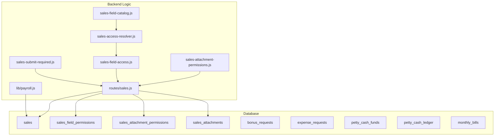
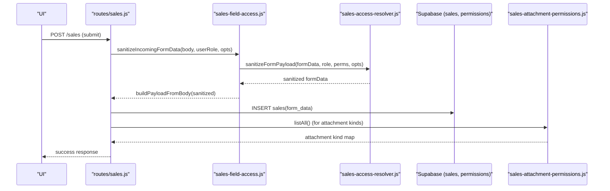
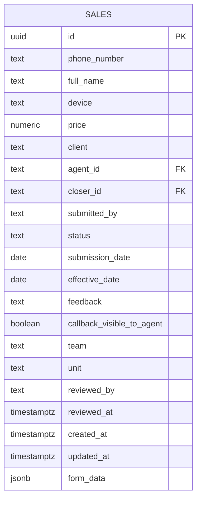
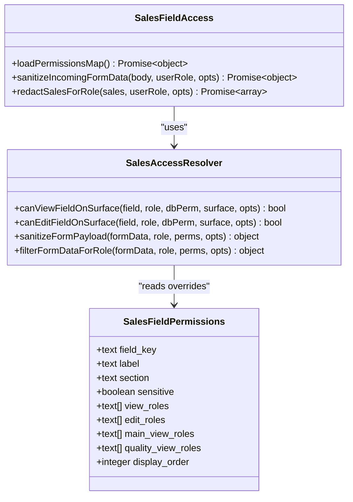
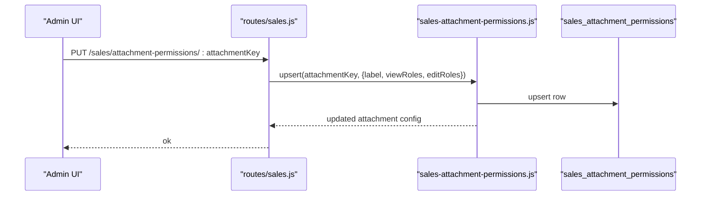
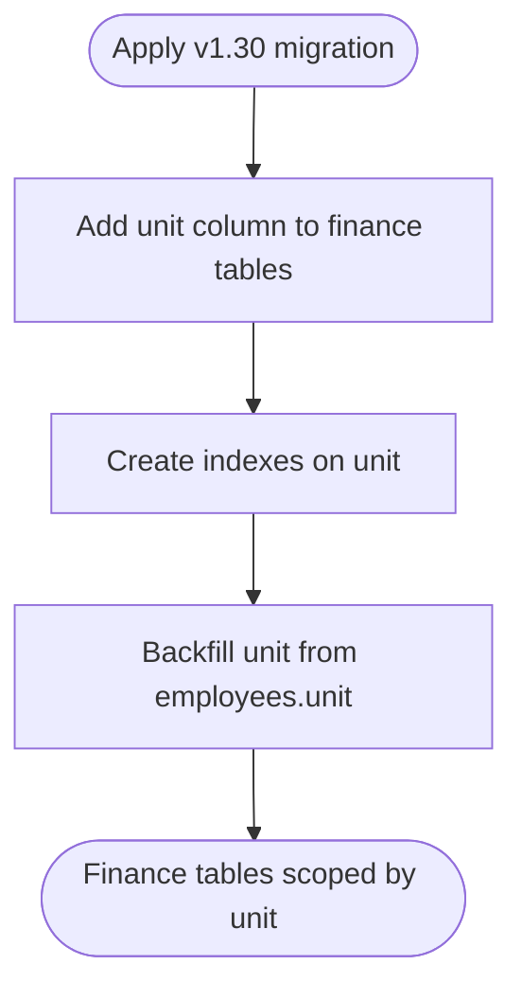
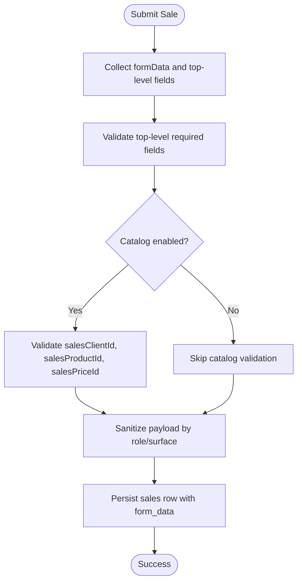
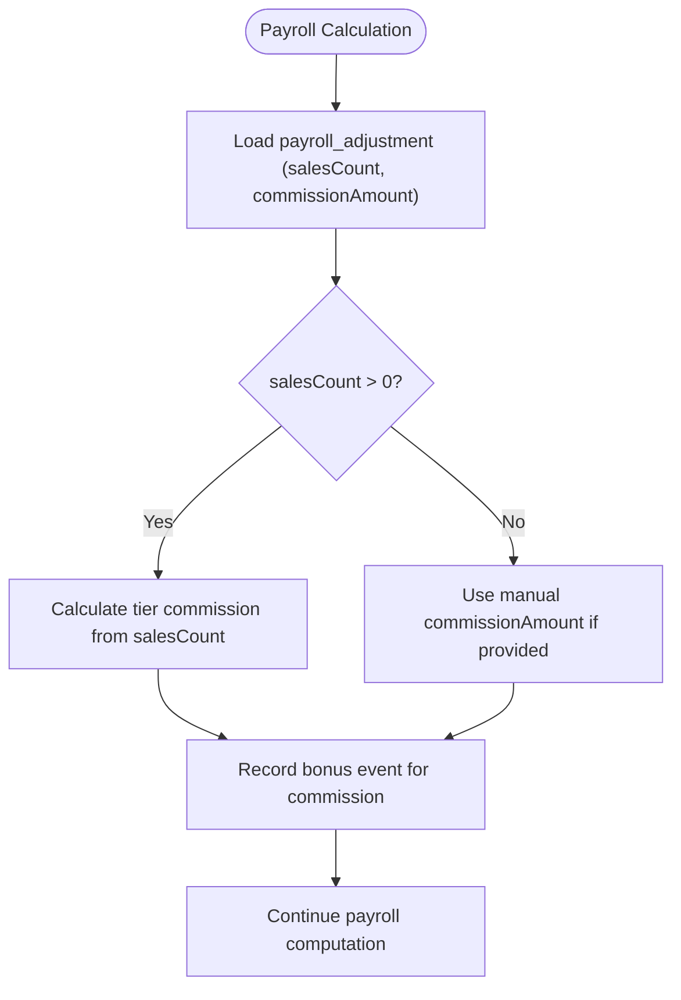
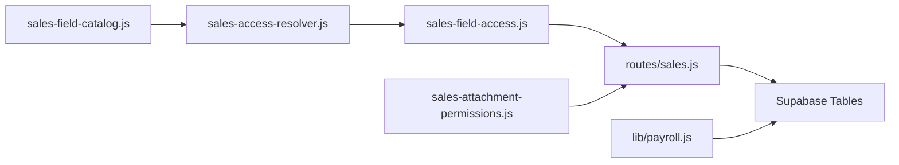

# Sales & Finance Schema

<cite>
**Referenced Files in This Document**
- [DB_SCHEMA.md](file://DB_SCHEMA.md)
- [README.md](file://README.md)
- [20260702_sales_bonus_costs.sql](file://supabase/migrations/20260702_sales_bonus_costs.sql)
- [20260709_v109b5_sprint.sql](file://supabase/migrations/20260709_v109b5_sprint.sql)
- [20260720_sales_attachment_permissions.sql](file://supabase/migrations/20260720_sales_attachment_permissions.sql)
- [20260724_v130_finance_company_scope.sql](file://supabase/migrations/20260724_v130_finance_company_scope.sql)
- [sales-field-catalog.js](file://lib/sales-field-catalog.js)
- [sales-access-resolver.js](file://lib/sales-access-resolver.js)
- [sales-attachment-permissions.js](file://lib/sales-attachment-permissions.js)
- [sales-field-access.js](file://lib/sales-field-access.js)
- [sales-submit-required.js](file://lib/sales-submit-required.js)
- [sales.js](file://routes/sales.js)
- [payroll.js](file://lib/payroll.js)
</cite>

## Table of Contents
1. Introduction
2. Project Structure
3. Core Components
4. Architecture Overview
5. Detailed Component Analysis
6. Dependency Analysis
7. Performance Considerations
8. Troubleshooting Guide
9. Conclusion
10. Appendices

## Introduction
This document describes the sales and finance database schema with a focus on:
- Sales records integration with MLA-Ray via a flexible form_data JSONB field
- Attachment permissions system for sales attachments
- Multi-company financial scope using unit columns to separate data per company/unit
- Permission-based access control for sales fields and attachments through dedicated permission tables
- Examples of sales data validation, commission calculations, and financial reporting queries
- The relationship between sales performance and payroll adjustments

The backend is Supabase Postgres with Row Level Security (RLS) deny-all policies; application code uses service role access and enforces business-level permissions.

## Project Structure
Key areas relevant to this documentation:
- Database migrations define core sales, bonus, expense, petty cash, and multi-company scope
- Business logic modules implement field and attachment permissions, payload sanitization, and submission validation
- Routes expose endpoints for managing attachment kind permissions
- Payroll module integrates sales counts into commission calculations

**Diagram sources**
- [20260702_sales_bonus_costs.sql:26-52](file://supabase/migrations/20260702_sales_bonus_costs.sql#L26-L52)
- [20260709_v109b5_sprint.sql:7-30](file://supabase/migrations/20260709_v109b5_sprint.sql#L7-L30)
- [20260720_sales_attachment_permissions.sql:1-21](file://supabase/migrations/20260720_sales_attachment_permissions.sql#L1-L21)
- [sales-field-catalog.js:1-462](file://lib/sales-field-catalog.js#L1-L462)
- [sales-access-resolver.js:1-356](file://lib/sales-access-resolver.js#L1-L356)
- [sales-attachment-permissions.js:1-137](file://lib/sales-attachment-permissions.js#L1-L137)
- [sales-field-access.js:1-111](file://lib/sales-field-access.js#L1-L111)
- [sales-submit-required.js:52-110](file://lib/sales-submit-required.js#L52-L110)
- [sales.js:1067-1097](file://routes/sales.js#L1067-L1097)
- [payroll.js:116-192](file://lib/payroll.js#L116-L192)

**Section sources**
- [DB_SCHEMA.md:124-174](file://DB_SCHEMA.md#L124-L174)
- [README.md:25-58](file://README.md#L25-L58)

## Core Components
- Sales table with MLA-Ray integration:
  - Stores structured sale metadata plus a flexible form_data JSONB field capturing MLA-Ray form values
  - Includes workflow status, agent/closer references, team/unit context, and timestamps
- Field and attachment permissions:
  - sales_field_permissions controls view/edit roles per field and surface
  - sales_attachment_permissions controls view/edit roles per attachment kind
- Attachments:
  - sales_attachments stores file metadata and Dropbox links linked to sales
- Multi-company financial scope:
  - Finance tables include unit column to separate data by company/unit
- Bonus requests and expenses:
  - bonus_requests tracks approval workflows
  - expense_requests and petty cash tables manage expenditures and ledger entries
- Monthly bills:
  - monthly_bills tracks recurring operational costs

**Section sources**
- [20260702_sales_bonus_costs.sql:26-134](file://supabase/migrations/20260702_sales_bonus_costs.sql#L26-L134)
- [20260709_v109b5_sprint.sql:7-30](file://supabase/migrations/20260709_v109b5_sprint.sql#L7-L30)
- [20260720_sales_attachment_permissions.sql:1-21](file://supabase/migrations/20260720_sales_attachment_permissions.sql#L1-L21)
- [20260724_v130_finance_company_scope.sql:1-112](file://supabase/migrations/20260724_v130_finance_company_scope.sql#L1-L112)
- [DB_SCHEMA.md:124-174](file://DB_SCHEMA.md#L124-L174)

## Architecture Overview
High-level flow for sales submission and permission enforcement:

**Diagram sources**
- [sales.js:1067-1097](file://routes/sales.js#L1067-L1097)
- [sales-field-access.js:29-44](file://lib/sales-field-access.js#L29-L44)
- [sales-access-resolver.js:197-227](file://lib/sales-access-resolver.js#L197-L227)
- [sales-attachment-permissions.js:61-88](file://lib/sales-attachment-permissions.js#L61-L88)

## Detailed Component Analysis

### Sales Table and MLA-Ray Integration
- Purpose: Store each sale record with key identifiers and a flexible JSONB form_data field that captures MLA-Ray form submissions
- Key columns:
  - id, phone_number, full_name, device, price, client, agent_id, closer_id, submitted_by, status, submission_date, effective_date, feedback, callback_visible_to_agent, team, unit, reviewed_by, reviewed_at, created_at, updated_at
- form_data JSONB:
  - Holds MLA-Ray fields such as payment method, card/bank details, billing dates, quality notes, and catalog reference IDs (salesClientId, salesProductId, salesPriceId)
- Indexes:
  - agent_id, status, effective_date, team, unit for efficient filtering and reporting

**Diagram sources**
- [20260702_sales_bonus_costs.sql:26-52](file://supabase/migrations/20260702_sales_bonus_costs.sql#L26-L52)
- [20260709_v109b5_sprint.sql:7-7](file://supabase/migrations/20260709_v109b5_sprint.sql#L7-L7)

**Section sources**
- [20260702_sales_bonus_costs.sql:26-52](file://supabase/migrations/20260702_sales_bonus_costs.sql#L26-L52)
- [20260709_v109b5_sprint.sql:7-7](file://supabase/migrations/20260709_v109b5_sprint.sql#L7-L7)
- [DB_SCHEMA.md:124-139](file://DB_SCHEMA.md#L124-L139)

### Sales Field Permissions and Access Control
- sales_field_permissions:
  - Controls per-field view/edit roles and surface-specific visibility (main vs quality)
  - Columns include field_key, label, section, sensitive flags, view_roles, edit_roles, main_view_roles, quality_view_roles, display_order
- sales-access-resolver:
  - Implements role-based checks for viewing/editing fields across surfaces
  - Handles special cases like verifier/client feedback editing and quality-only fields
- sales-field-access:
  - Loads permissions from DB, sanitizes incoming payloads, redacts responses based on role and surface

**Diagram sources**
- [20260709_v109b5_sprint.sql:9-18](file://supabase/migrations/20260709_v109b5_sprint.sql#L9-L18)
- [sales-access-resolver.js:132-169](file://lib/sales-access-resolver.js#L132-L169)
- [sales-field-access.js:11-44](file://lib/sales-field-access.js#L11-L44)

**Section sources**
- [20260709_v109b5_sprint.sql:9-18](file://supabase/migrations/20260709_v109b5_sprint.sql#L9-L18)
- [sales-access-resolver.js:1-356](file://lib/sales-access-resolver.js#L1-L356)
- [sales-field-access.js:1-111](file://lib/sales-field-access.js#L1-L111)

### Sales Attachment Permissions and Storage
- sales_attachment_permissions:
  - Per-kind view/edit roles for attachments (e.g., recording, receipt, confirmation)
  - Supports dynamic overrides via admin UI and routes
- sales_attachments:
  - Stores file metadata and Dropbox links tied to a sale
- sales-attachment-permissions:
  - Caches and upserts attachment kind permissions; seeds defaults from catalog

**Diagram sources**
- [20260720_sales_attachment_permissions.sql:1-21](file://supabase/migrations/20260720_sales_attachment_permissions.sql#L1-L21)
- [sales.js:1079-1097](file://routes/sales.js#L1079-L1097)
- [sales-attachment-permissions.js:66-88](file://lib/sales-attachment-permissions.js#L66-L88)

**Section sources**
- [20260720_sales_attachment_permissions.sql:1-21](file://supabase/migrations/20260720_sales_attachment_permissions.sql#L1-L21)
- [sales.js:1067-1097](file://routes/sales.js#L1067-L1097)
- [sales-attachment-permissions.js:1-137](file://lib/sales-attachment-permissions.js#L1-L137)

### Multi-Company Financial Scope (unit Column)
- Finance tables extended with unit column to separate data per company/unit:
  - employee_loans, loan_payments, bonus_events, deduction_events, bonus_requests, expense_requests, monthly_bills, petty_cash_funds, petty_cash_ledger
- Backfill scripts populate unit from employees.unit where missing
- Enables per-company reporting and access scoping

**Diagram sources**
- [20260724_v130_finance_company_scope.sql:1-112](file://supabase/migrations/20260724_v130_finance_company_scope.sql#L1-L112)

**Section sources**
- [20260724_v130_finance_company_scope.sql:1-112](file://supabase/migrations/20260724_v130_finance_company_scope.sql#L1-L112)
- [DB_SCHEMA.md:106-106](file://DB_SCHEMA.md#L106-L106)

### Sales Data Validation and Submission
- Validation rules ensure required fields are present and catalog references exist when applicable
- Top-level required keys include phone number, full name, device, client (when catalog enabled), and catalog IDs
- Payload sanitization removes unauthorized fields based on role and surface

**Diagram sources**
- [sales-submit-required.js:52-110](file://lib/sales-submit-required.js#L52-L110)
- [sales-field-access.js:29-44](file://lib/sales-field-access.js#L29-L44)

**Section sources**
- [sales-submit-required.js:52-110](file://lib/sales-submit-required.js#L52-L110)
- [sales-field-access.js:29-44](file://lib/sales-field-access.js#L29-L44)

### Commission Calculations and Payroll Adjustments
- Payroll module calculates commission based on sales_count from payroll_adjustments or derived totals
- Tiered commission logic applies thresholds and amounts defined in commission tiers
- If no sales count, manual commission amount can be used
- Commission results are recorded as bonus events for payroll processing

**Diagram sources**
- [payroll.js:116-192](file://lib/payroll.js#L116-L192)

**Section sources**
- [payroll.js:116-192](file://lib/payroll.js#L116-L192)
- [DB_SCHEMA.md:94-104](file://DB_SCHEMA.md#L94-L104)

## Dependency Analysis
Relationships among components:
- sales-field-catalog defines default roles and attachment kinds
- sales-access-resolver implements permission logic using catalog and DB overrides
- sales-field-access loads permissions and sanitizes payloads
- routes/sales exposes endpoints for attachment permissions and interacts with sales-attachment-permissions
- payroll depends on sales counts and commission tiers to compute bonuses

**Diagram sources**
- [sales-field-catalog.js:1-462](file://lib/sales-field-catalog.js#L1-L462)
- [sales-access-resolver.js:1-356](file://lib/sales-access-resolver.js#L1-L356)
- [sales-field-access.js:1-111](file://lib/sales-field-access.js#L1-L111)
- [sales.js:1067-1097](file://routes/sales.js#L1067-L1097)
- [sales-attachment-permissions.js:1-137](file://lib/sales-attachment-permissions.js#L1-L137)
- [payroll.js:116-192](file://lib/payroll.js#L116-L192)

**Section sources**
- [sales-field-catalog.js:1-462](file://lib/sales-field-catalog.js#L1-L462)
- [sales-access-resolver.js:1-356](file://lib/sales-access-resolver.js#L1-L356)
- [sales-field-access.js:1-111](file://lib/sales-field-access.js#L1-L111)
- [sales.js:1067-1097](file://routes/sales.js#L1067-L1097)
- [sales-attachment-permissions.js:1-137](file://lib/sales-attachment-permissions.js#L1-L137)
- [payroll.js:116-192](file://lib/payroll.js#L116-L192)

## Performance Considerations
- Use indexes on frequently filtered columns:
  - sales(agent_id, status, effective_date, team, unit)
  - finance tables(unit) for per-company scoping
- Cache permission maps in memory with short TTL to reduce DB reads
- Avoid heavy JSONB operations on large datasets; consider denormalized columns for common filters when needed

[No sources needed since this section provides general guidance]

## Troubleshooting Guide
Common issues and resolutions:
- Missing form_data or invalid JSONB:
  - Ensure payload sanitization runs before persisting; check sales-field-access sanitization path
- Attachment kind permissions not applied:
  - Verify sales_attachment_permissions rows exist and cache invalidated after updates
- Unit scoping not reflected in reports:
  - Confirm backfill ran for unit columns; check indexes on unit
- Commission not calculated:
  - Verify payroll_adjustments.salesCount or commissionAmount; confirm commission tiers configured

**Section sources**
- [sales-field-access.js:29-44](file://lib/sales-field-access.js#L29-L44)
- [sales-attachment-permissions.js:66-88](file://lib/sales-attachment-permissions.js#L66-L88)
- [20260724_v130_finance_company_scope.sql:1-112](file://supabase/migrations/20260724_v130_finance_company_scope.sql#L1-L112)
- [payroll.js:116-192](file://lib/payroll.js#L116-L192)

## Conclusion
The sales and finance schema integrates MLA-Ray form data via JSONB, enforces granular field and attachment permissions, and supports multi-company separation through unit columns. Validation and sanitization ensure data integrity, while payroll ties sales performance to commissions. Proper indexing and caching improve performance and reliability.

[No sources needed since this section summarizes without analyzing specific files]

## Appendices

### Example Queries

- Sales data validation example (conceptual):
  - Validate required fields and catalog references before insert
  - Reference: [sales-submit-required.js:52-110](file://lib/sales-submit-required.js#L52-L110)

- Commission calculation example (conceptual):
  - Read payroll_adjustment.salesCount/commissionAmount
  - Apply tiered commission logic
  - Record bonus event
  - Reference: [payroll.js:116-192](file://lib/payroll.js#L116-L192)

- Financial reporting by unit (conceptual):
  - Filter finance tables by unit column
  - Aggregate expenses, petty cash ledger, and bills per company
  - Reference: [20260724_v130_finance_company_scope.sql:1-112](file://supabase/migrations/20260724_v130_finance_company_scope.sql#L1-L112)

**Section sources**
- [sales-submit-required.js:52-110](file://lib/sales-submit-required.js#L52-L110)
- [payroll.js:116-192](file://lib/payroll.js#L116-L192)
- [20260724_v130_finance_company_scope.sql:1-112](file://supabase/migrations/20260724_v130_finance_company_scope.sql#L1-L112)