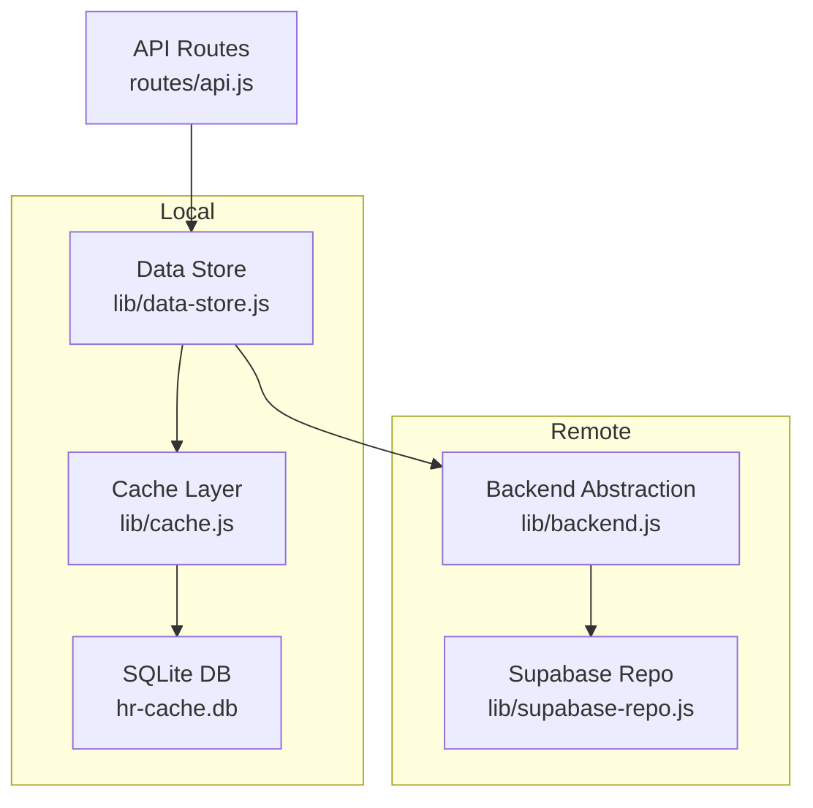
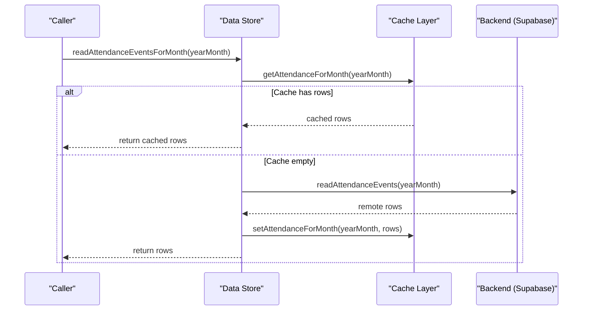
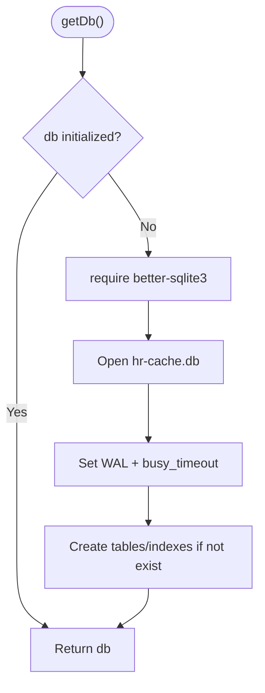
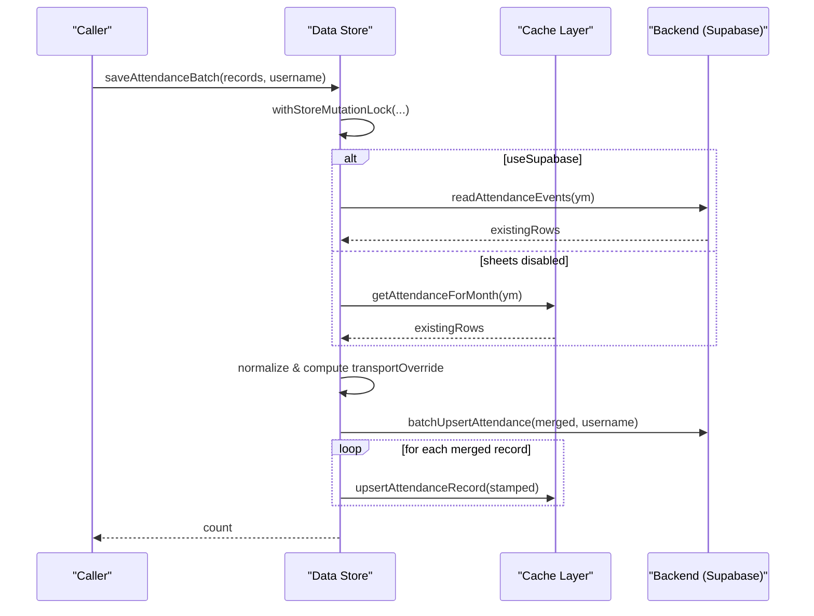
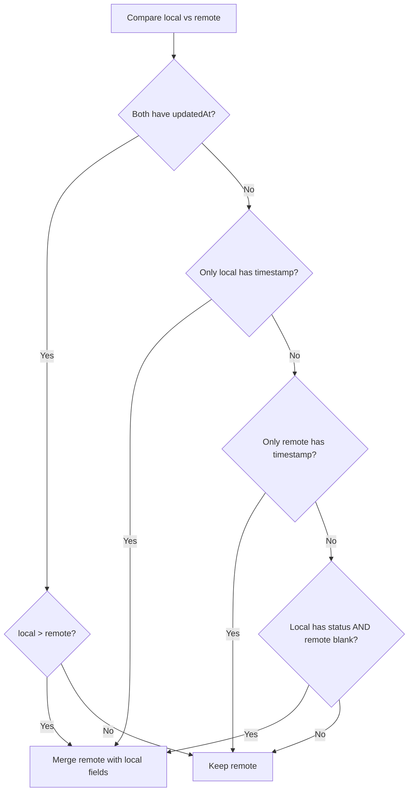
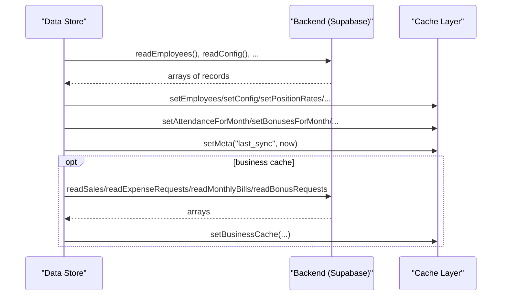
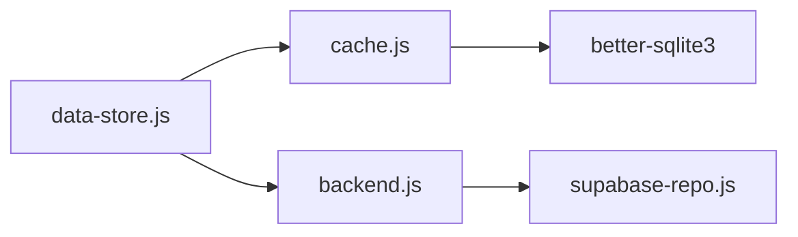

# Local SQLite Cache Layer

<cite>
**Referenced Files in This Document**
- [cache.js](file://lib/cache.js)
- [data-store.js](file://lib/data-store.js)
- [backend.js](file://lib/backend.js)
- [api.js](file://routes/api.js)
- [business-repo.js](file://lib/business-repo.js)
- [attendance-supabase-path.test.js](file://test/attendance-supabase-path.test.js)
</cite>

## Table of Contents
1. [Introduction](#introduction)
2. [Project Structure](#project-structure)
3. [Core Components](#core-components)
4. [Architecture Overview](#architecture-overview)
5. [Detailed Component Analysis](#detailed-component-analysis)
6. [Dependency Analysis](#dependency-analysis)
7. [Performance Considerations](#performance-considerations)
8. [Troubleshooting Guide](#troubleshooting-guide)
9. [Conclusion](#conclusion)

## Introduction
This document explains the local caching strategy that enables offline-first functionality using an embedded SQLite database. It focuses on:
- The cache layer implementation in lib/cache.js, including schema design and data access patterns
- The data store abstraction in lib/data-store.js that unifies access to both cached and remote data
- Data synchronization between local storage and the Supabase backend
- Cache invalidation strategies, conflict resolution mechanisms, and performance optimizations
- Examples of cache query patterns, batch operations, and migration handling for schema changes
- Cache size management, cleanup policies, and debugging techniques

## Project Structure
The cache system is implemented as a thin persistence layer over SQLite with higher-level orchestration in the data store. Key files:
- lib/cache.js: SQLite initialization, schema, and CRUD helpers
- lib/data-store.js: Orchestration of sync, conflict resolution, and unified API
- lib/backend.js: Backend selection (Supabase only)
- routes/api.js: Health endpoint exposing cache directory
- lib/business-repo.js: Business cache refresh helper
- test/attendance-supabase-path.test.js: Tests validating cache-first reads and fallback behavior

**Diagram sources**
- [cache.js:27-35](file://lib/cache.js#L27-L35)
- [data-store.js:105-120](file://lib/data-store.js#L105-L120)
- [backend.js:1-29](file://lib/backend.js#L1-L29)
- [api.js:525-550](file://routes/api.js#L525-L550)

**Section sources**
- [cache.js:1-135](file://lib/cache.js#L1-L135)
- [data-store.js:1-120](file://lib/data-store.js#L1-L120)
- [backend.js:1-29](file://lib/backend.js#L1-L29)
- [api.js:525-550](file://routes/api.js#L525-L550)

## Core Components
- SQLite Initialization and Schema
  - Database file path resolved from environment or default .cache/hr-cache.db
  - WAL journaling and busy timeout configured for concurrency
  - Schema includes tables for employees, attendance, bonuses, deductions, position rates, config, payroll adjustments, commission types/tiers, employee documents/warnings, loans/payments, payroll splits, and business cache metadata
- Cache Layer API
  - Batch set/get per month for attendance/bonuses/deductions/payroll adjustments
  - Upsert/delete helpers for individual records
  - Config and meta key/value storage
  - Business cache helpers for sales/expenses/bills/bonus requests
- Data Store Abstraction
  - Ensures initial sync if cache is cold
  - Provides read APIs that prefer local cache with optional Supabase fallback
  - Orchestrates write paths with immediate local upserts after successful remote writes
  - Implements conflict resolution for attendance merges based on timestamps and status heuristics
  - Exposes mutation lock to serialize concurrent mutations

**Section sources**
- [cache.js:27-135](file://lib/cache.js#L27-L135)
- [cache.js:137-748](file://lib/cache.js#L137-L748)
- [data-store.js:221-226](file://lib/data-store.js#L221-L226)
- [data-store.js:492-512](file://lib/data-store.js#L492-L512)
- [data-store.js:828-880](file://lib/data-store.js#L828-L880)

## Architecture Overview
The system follows an offline-first pattern:
- Reads prefer local SQLite; if empty, fall back to Supabase and warm the cache
- Writes go to Supabase first, then immediately update local cache
- Full sync can be triggered to reconcile all entities and mark last_sync timestamp
- Business caches are refreshed optionally when Supabase is available

**Diagram sources**
- [data-store.js:492-512](file://lib/data-store.js#L492-L512)
- [cache.js:178-197](file://lib/cache.js#L178-L197)

**Section sources**
- [data-store.js:492-512](file://lib/data-store.js#L492-L512)
- [data-store.js:114-219](file://lib/data-store.js#L114-L219)

## Detailed Component Analysis

### Cache Layer (lib/cache.js)
Responsibilities:
- Initialize SQLite connection and configure pragmas
- Create schema if missing
- Provide transactional batch writes for monthly datasets
- Offer upsert/delete/read helpers for each entity
- Manage meta keys and business cache entries

Key implementation highlights:
- Database path resolution and lazy initialization
- WAL mode and busy_timeout for concurrency
- Transactional bulk inserts with DELETE + INSERT OR REPLACE patterns
- JSON serialization for complex payloads
- Indexes on date/year_month fields for efficient range queries

**Diagram sources**
- [cache.js:27-35](file://lib/cache.js#L27-L35)
- [cache.js:37-135](file://lib/cache.js#L37-L135)

**Section sources**
- [cache.js:1-135](file://lib/cache.js#L1-L135)
- [cache.js:137-748](file://lib/cache.js#L137-L748)

### Data Store Abstraction (lib/data-store.js)
Responsibilities:
- Ensure cache is warm before serving data
- Provide unified read APIs that prefer local cache
- Implement conflict resolution for attendance merges
- Serialize mutations via a global lock
- Coordinate full sync and partial updates

Key implementation highlights:
- ensureSynced triggers full sync if no last_sync or employees
- readAttendanceEventsForMonth prefers cache, falls back to Supabase and warms cache
- saveAttendanceBatch normalizes input, persists to Supabase, stamps updatedAt, and updates cache
- mergeAttendanceMonth resolves conflicts by comparing updatedAt or preferring non-empty local status
- refreshCache wraps syncFromSheet under mutation lock

**Diagram sources**
- [data-store.js:828-880](file://lib/data-store.js#L828-L880)
- [data-store.js:105-112](file://lib/data-store.js#L105-L112)

**Section sources**
- [data-store.js:105-120](file://lib/data-store.js#L105-L120)
- [data-store.js:492-512](file://lib/data-store.js#L492-L512)
- [data-store.js:828-880](file://lib/data-store.js#L828-L880)

### Conflict Resolution Strategy
Conflict resolution for attendance records:
- Compare updatedAt vs updated_at timestamps if present
- If only one side has a timestamp, prefer that side
- If neither has timestamps, prefer local row only when it carries a real status and remote is blank

**Diagram sources**
- [data-store.js:67-103](file://lib/data-store.js#L67-L103)

**Section sources**
- [data-store.js:67-103](file://lib/data-store.js#L67-L103)

### Data Synchronization Patterns
Full sync flow:
- Parallel fetch of employees, config, rates, attendance/bonuses/deductions/payroll adjustments, commission types/tiers, documents, warnings, loans/payments, payroll splits
- Persist into cache tables
- Optionally map app users to employee IDs
- Warm business caches for sales/expenses/bills/bonus requests
- Mark last_sync timestamp

**Diagram sources**
- [data-store.js:122-219](file://lib/data-store.js#L122-L219)
- [business-repo.js:905-927](file://lib/business-repo.js#L905-L927)

**Section sources**
- [data-store.js:122-219](file://lib/data-store.js#L122-L219)
- [business-repo.js:905-927](file://lib/business-repo.js#L905-L927)

### Cache Invalidation Strategies
- Full refresh: refreshCache calls syncFromSheet under mutation lock
- Partial updates: most write paths call specific upsert/delete helpers immediately after backend success
- Business cache: refreshBusinessCache re-fetches and sets business caches when cache is warm

Examples:
- Attendance batch writes stamp updatedAt and update cache immediately
- Employee promotions/reversions update cache and optionally user login mappings
- Commission tiers and position rates update cache after backend writes

**Section sources**
- [data-store.js:743-745](file://lib/data-store.js#L743-L745)
- [data-store.js:828-880](file://lib/data-store.js#L828-L880)
- [business-repo.js:905-927](file://lib/business-repo.js#L905-L927)

### Performance Optimization Techniques
- SQLite WAL mode and busy_timeout for concurrent readers/writers
- Transactional batch writes for monthly datasets
- Indexes on date/year_month columns for fast range queries
- Cache-first reads with Supabase fallback only when needed
- Mutation lock serializes writes to avoid race conditions
- Group-by-year-month processing reduces repeated I/O during sync

**Section sources**
- [cache.js:27-35](file://lib/cache.js#L27-L35)
- [cache.js:178-197](file://lib/cache.js#L178-L197)
- [data-store.js:105-112](file://lib/data-store.js#L105-L112)

### Query Patterns and Examples
- Read attendance for month: prefers cache; if empty, fetches from Supabase and warms cache
- Get employees filtered by month and hideOut policy
- Get bonus/deduction events for month and optional employee filter
- Payroll adjustments and splits retrieval by month and employee

Example references:
- readAttendanceEventsForMonth
- getEmployeesForMonth
- getBonusEvents / getDeductionEvents
- getPayrollAdjustments / getPayrollSplitsForMonth

**Section sources**
- [data-store.js:492-512](file://lib/data-store.js#L492-L512)
- [data-store.js:235-252](file://lib/data-store.js#L235-L252)
- [data-store.js:522-536](file://lib/data-store.js#L522-L536)
- [data-store.js:589-607](file://lib/data-store.js#L589-L607)

### Batch Operations
- saveAttendanceBatch normalizes records, persists to backend, stamps updatedAt, and updates cache
- Monthly set functions in cache delete old month rows and insert new ones within a transaction

References:
- saveAttendanceBatch
- setAttendanceForMonth / setBonusesForMonth / setDeductionsForMonth / setPayrollAdjustmentsForMonth

**Section sources**
- [data-store.js:828-880](file://lib/data-store.js#L828-L880)
- [cache.js:178-197](file://lib/cache.js#L178-L197)
- [cache.js:220-282](file://lib/cache.js#L220-L282)
- [cache.js:414-431](file://lib/cache.js#L414-L431)

### Migration Handling for Schema Changes
- Schema creation uses CREATE TABLE IF NOT EXISTS and CREATE INDEX IF NOT EXISTS, ensuring idempotent upgrades
- New tables and indexes are added without dropping existing data
- Meta table stores version-like markers such as last_sync; additional versioning can be stored similarly if needed

References:
- initSchema function creating tables and indexes

**Section sources**
- [cache.js:37-135](file://lib/cache.js#L37-L135)

### Cache Size Management and Cleanup Policies
- No automatic size-based eviction is implemented in the cache layer
- Monthly partitioning helps bound growth by replacing entire month’s dataset atomically
- Business cache stores lightweight summaries keyed by table name

Recommendations:
- Add periodic pruning of historical months beyond retention window
- Implement size thresholds and LRU-style eviction for large JSON blobs
- Monitor hr-cache.db size and archive older months if necessary

[No sources needed since this section provides general guidance]

### Debugging Cache-Related Issues
- Health endpoint exposes cache directory and backend connectivity
- Tests validate cache-first behavior and Supabase fallback
- Use getLastSync and isCacheWarm to inspect cache state

References:
- routes/api.js health check
- attendance-supabase-path.test.js scenarios

**Section sources**
- [api.js:525-550](file://routes/api.js#L525-L550)
- [attendance-supabase-path.test.js:31-60](file://test/attendance-supabase-path.test.js#L31-L60)

## Dependency Analysis
The cache layer depends on better-sqlite3 and is orchestrated by the data store. The data store depends on the backend abstraction which enforces Supabase-only usage.

**Diagram sources**
- [data-store.js:1-10](file://lib/data-store.js#L1-L10)
- [backend.js:1-29](file://lib/backend.js#L1-L29)
- [cache.js:7-18](file://lib/cache.js#L7-L18)

**Section sources**
- [data-store.js:1-10](file://lib/data-store.js#L1-L10)
- [backend.js:1-29](file://lib/backend.js#L1-L29)
- [cache.js:7-18](file://lib/cache.js#L7-L18)

## Performance Considerations
- Prefer local reads to minimize network latency
- Use transactions for bulk writes to reduce disk I/O overhead
- Leverage indexes on date/year_month for faster queries
- Serialize mutations to prevent contention and inconsistent states
- Warm cache on first load to avoid repeated network calls

[No sources needed since this section provides general guidance]

## Troubleshooting Guide
Common issues and checks:
- Verify cache directory accessibility via health endpoint
- Confirm last_sync timestamp and employee count to determine cache warmth
- Inspect whether attendance reads hit cache or Supabase using tests
- Validate that writes update cache immediately after backend success

Operational tips:
- Use getLastSync and isCacheWarm to diagnose cold caches
- Trigger refreshCache to force a full sync
- Review business cache refresh flows for optional features

**Section sources**
- [api.js:525-550](file://routes/api.js#L525-L550)
- [data-store.js:221-226](file://lib/data-store.js#L221-L226)
- [data-store.js:743-745](file://lib/data-store.js#L743-L745)
- [attendance-supabase-path.test.js:31-60](file://test/attendance-supabase-path.test.js#L31-L60)

## Conclusion
The local SQLite cache layer provides robust offline-first capabilities with clear separation of concerns:
- lib/cache.js manages persistent storage and offers efficient CRUD operations
- lib/data-store.js orchestrates synchronization, conflict resolution, and unified access
- Supabase remains the source of truth while local cache ensures responsiveness and resilience
- Transactions, indexing, and cache-first reads deliver strong performance characteristics
- Extensible design allows future enhancements like size-based cleanup and advanced conflict strategies

[No sources needed since this section summarizes without analyzing specific files]