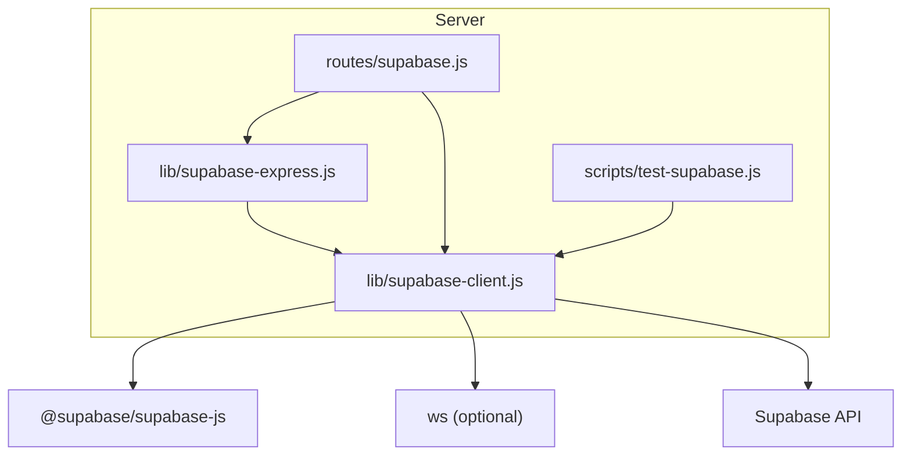
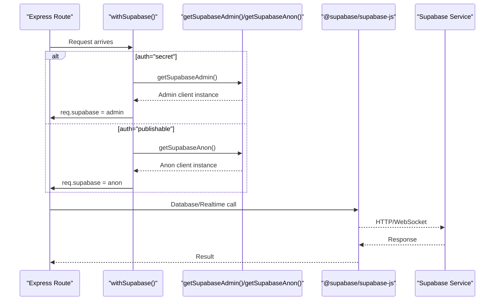
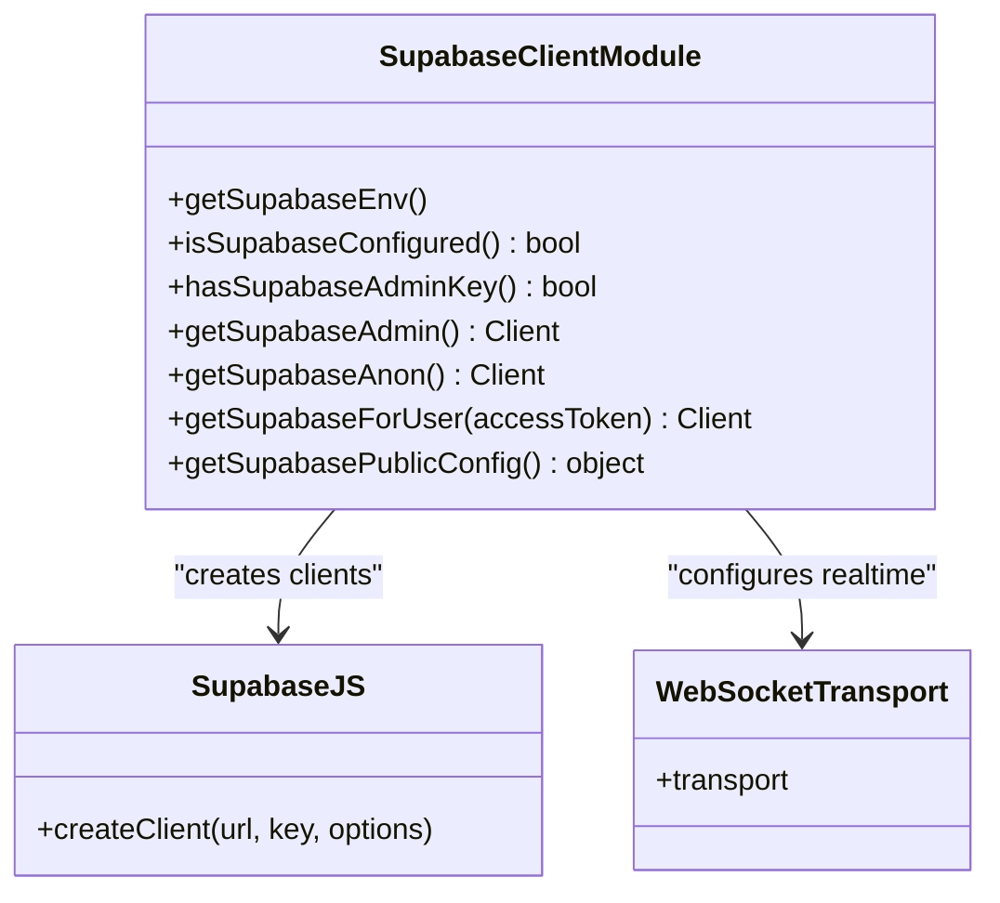
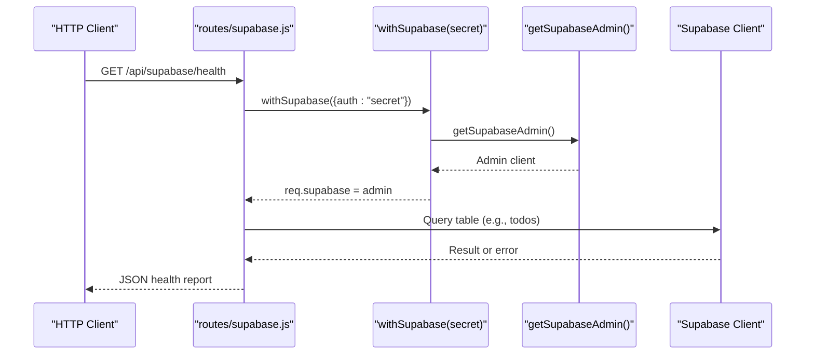
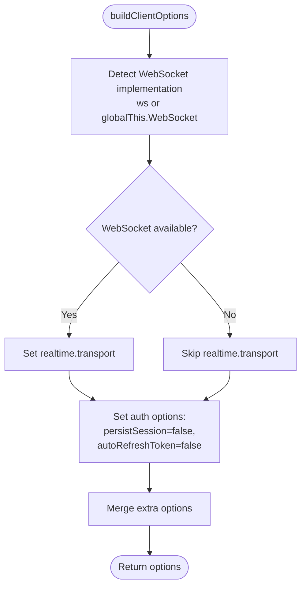
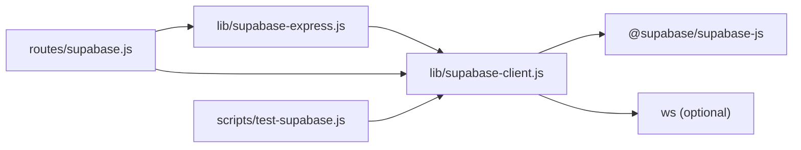

# Supabase Client Configuration

<cite>
**Referenced Files in This Document**
- [lib/supabase-client.js](file://lib/supabase-client.js)
- [lib/supabase-express.js](file://lib/supabase-express.js)
- [routes/supabase.js](file://routes/supabase.js)
- [scripts/test-supabase.js](file://scripts/test-supabase.js)
</cite>

## Table of Contents
1. [Introduction](#introduction)
2. [Project Structure](#project-structure)
3. [Core Components](#core-components)
4. [Architecture Overview](#architecture-overview)
5. [Detailed Component Analysis](#detailed-component-analysis)
6. [Dependency Analysis](#dependency-analysis)
7. [Performance Considerations](#performance-considerations)
8. [Troubleshooting Guide](#troubleshooting-guide)
9. [Conclusion](#conclusion)

## Introduction
This document explains the Supabase client configuration and connection management system used by the application. It focuses on the dual-client architecture that provides:
- An admin client that bypasses Row Level Security (RLS), intended for server-side operations only.
- An anonymous/publishable client that respects RLS, suitable for standard access patterns.
- A user-scoped client factory that attaches a JWT to requests for per-user authorization.

It also covers environment variable configuration, security considerations for server vs client usage, real-time WebSocket transport setup, error handling strategies, and practical examples for initialization, validation, and troubleshooting.

## Project Structure
The Supabase client configuration is centralized in a single module and integrated with Express middleware for request-level injection. Health and status endpoints expose safe diagnostics without leaking secrets.

**Diagram sources**
- [lib/supabase-client.js:1-134](file://lib/supabase-client.js#L1-L134)
- [lib/supabase-express.js:1-39](file://lib/supabase-express.js#L1-L39)
- [routes/supabase.js:1-122](file://routes/supabase.js#L1-L122)
- [scripts/test-supabase.js:1-66](file://scripts/test-supabase.js#L1-L66)

**Section sources**
- [lib/supabase-client.js:1-134](file://lib/supabase-client.js#L1-L134)
- [lib/supabase-express.js:1-39](file://lib/supabase-express.js#L1-L39)
- [routes/supabase.js:1-122](file://routes/supabase.js#L1-L122)
- [scripts/test-supabase.js:1-66](file://scripts/test-supabase.js#L1-L66)

## Core Components
- Environment readers and validators:
  - URL, secret key, and publishable key readers with fallbacks.
  - Configuration readiness checks for both general and admin-only features.
- Client factories:
  - Admin client: bypasses RLS; requires secret key.
  - Anonymous client: uses publishable key; RLS applies.
  - User-scoped client: injects Authorization header with a JWT.
- Real-time options:
  - Optional WebSocket transport via ws or global WebSocket.
  - Session persistence disabled for server-side clients.
- Public config helper:
  - Exposes non-sensitive configuration state for diagnostics.

Key responsibilities:
- Centralize all Supabase client creation and options.
- Enforce security boundaries between admin and anonymous modes.
- Provide consistent real-time transport selection across clients.

**Section sources**
- [lib/supabase-client.js:19-78](file://lib/supabase-client.js#L19-L78)
- [lib/supabase-client.js:80-123](file://lib/supabase-client.js#L80-L123)

## Architecture Overview
The system exposes three primary client types and integrates them into Express routes via middleware. The admin client is guarded by an environment check and should never be exposed to the browser. The anonymous client is safe for public-facing endpoints where RLS policies control data access. The user-scoped client allows per-request identity propagation using a JWT.

**Diagram sources**
- [lib/supabase-express.js:10-34](file://lib/supabase-express.js#L10-L34)
- [lib/supabase-client.js:80-111](file://lib/supabase-client.js#L80-L111)
- [routes/supabase.js:14-30](file://routes/supabase.js#L14-L30)

## Detailed Component Analysis

### Environment Variables and Validation
- SUPABASE_URL: Required for any operation.
- SUPABASE_SECRET_KEY (or SERVICE_ROLE_KEY): Enables admin client; bypasses RLS.
- SUPABASE_PUBLISHABLE_KEY (or ANON_KEY): Enables anonymous client; RLS applies.
- Readiness helpers determine if configuration is sufficient and whether admin mode is available.

Security considerations:
- Secret keys must remain server-side only.
- Publishable keys are safe to expose to clients when appropriate.
- Public config endpoint returns only non-sensitive fields.

**Section sources**
- [lib/supabase-client.js:19-67](file://lib/supabase-client.js#L19-L67)
- [routes/supabase.js:14-17](file://routes/supabase.js#L14-L17)

### Client Factories
- getSupabaseAdmin():
  - Throws if no secret key is configured.
  - Creates a singleton admin client with real-time transport enabled when available.
- getSupabaseAnon():
  - Creates a singleton anonymous client with real-time transport enabled when available.
- getSupabaseForUser(accessToken):
  - Requires a valid JWT.
  - Returns a new client instance with Authorization header set for per-request identity.

Real-time configuration:
- Uses optional ws module or global WebSocket.
- Disables session persistence and auto-refresh for server-side clients.

**Section sources**
- [lib/supabase-client.js:69-111](file://lib/supabase-client.js#L69-L111)

### Express Middleware Integration
- withSupabase({ auth }):
  - auth="secret": Requires admin key; attaches admin client to req.supabase and req.supabaseContext.authMode.
  - auth="publishable": Attaches anonymous client; sets context accordingly.
  - Returns 401 with structured error if required keys are missing.

Usage pattern:
- Routes can opt-in to admin or publishable mode via middleware configuration.

**Section sources**
- [lib/supabase-express.js:10-34](file://lib/supabase-express.js#L10-L34)

### Diagnostic Endpoints
- GET /api/supabase/config:
  - Returns non-sensitive configuration state (URL, publishable key presence, flags).
- GET /api/supabase/ping:
  - Uses publishable key; validates RLS-enabled connectivity.
- GET /api/supabase/health:
  - Uses secret key; probes database reachability and reports additional health details.
- GET /api/supabase/status:
  - Aggregates env checks and pings both admin and anon clients.

These endpoints help validate configuration and connectivity without exposing secrets.

**Section sources**
- [routes/supabase.js:14-122](file://routes/supabase.js#L14-L122)

### Connectivity Script
- scripts/test-supabase.js:
  - Loads .env, checks environment variables, and performs basic connectivity tests against admin and anon clients.
  - Provides guidance on expected API routes for further checks.

**Section sources**
- [scripts/test-supabase.js:1-66](file://scripts/test-supabase.js#L1-L66)

### Class Diagram: Client Factory Module

**Diagram sources**
- [lib/supabase-client.js:1-134](file://lib/supabase-client.js#L1-L134)

### Sequence Diagram: Admin Route Flow

**Diagram sources**
- [routes/supabase.js:32-77](file://routes/supabase.js#L32-L77)
- [lib/supabase-express.js:15-24](file://lib/supabase-express.js#L15-L24)
- [lib/supabase-client.js:80-91](file://lib/supabase-client.js#L80-L91)

### Flowchart: Client Options and Realtime Transport

**Diagram sources**
- [lib/supabase-client.js:69-78](file://lib/supabase-client.js#L69-L78)

## Dependency Analysis
- lib/supabase-client.js depends on @supabase/supabase-js and optionally ws.
- lib/supabase-express.js depends on lib/supabase-client.js for client factories and guards.
- routes/supabase.js composes both modules to provide diagnostic endpoints and route-level client injection.
- scripts/test-supabase.js exercises the client factories for quick validation.

**Diagram sources**
- [lib/supabase-client.js:1-15](file://lib/supabase-client.js#L1-L15)
- [lib/supabase-express.js:1-8](file://lib/supabase-express.js#L1-L8)
- [routes/supabase.js:1-11](file://routes/supabase.js#L1-L11)
- [scripts/test-supabase.js:8-13](file://scripts/test-supabase.js#L8-L13)

**Section sources**
- [lib/supabase-client.js:1-15](file://lib/supabase-client.js#L1-L15)
- [lib/supabase-express.js:1-8](file://lib/supabase-express.js#L1-L8)
- [routes/supabase.js:1-11](file://routes/supabase.js#L1-L11)
- [scripts/test-supabase.js:8-13](file://scripts/test-supabase.js#L8-L13)

## Performance Considerations
- Singleton clients:
  - Admin and anonymous clients are cached to avoid repeated instantiation overhead.
- Real-time transport:
  - Using ws or global WebSocket enables efficient real-time subscriptions when available.
- Auth options:
  - Disabling session persistence and token refresh reduces background work on the server.
- Error handling:
  - Early validation prevents unnecessary network calls when configuration is incomplete.

[No sources needed since this section provides general guidance]

## Troubleshooting Guide
Common issues and resolutions:
- Missing SUPABASE_URL:
  - Ensure the URL is set in the environment before starting the server.
- Missing secret key for admin routes:
  - Add SUPABASE_SECRET_KEY (or SERVICE_ROLE_KEY) to the server environment.
  - Admin routes will return a 401 with a structured error if the key is absent.
- Missing publishable key for anonymous routes:
  - Add SUPABASE_PUBLISHABLE_KEY (or ANON_KEY) to enable RLS-based access.
- Real-time not working:
  - Verify ws is installed or that global WebSocket is available in the runtime.
- Connectivity verification:
  - Use GET /api/supabase/status to inspect configuration flags and ping results.
  - Use GET /api/supabase/health to probe database reachability with admin credentials.
  - Use GET /api/supabase/ping to validate publishable key acceptance.
- Quick local check:
  - Run scripts/test-supabase.js to validate environment and client connectivity.

Operational tips:
- Keep secret keys out of client bundles and logs.
- Prefer anonymous client for public endpoints and rely on RLS policies.
- Use user-scoped client when you have a valid JWT and need per-user authorization.

**Section sources**
- [lib/supabase-client.js:41-67](file://lib/supabase-client.js#L41-L67)
- [lib/supabase-express.js:15-24](file://lib/supabase-express.js#L15-L24)
- [routes/supabase.js:14-122](file://routes/supabase.js#L14-L122)
- [scripts/test-supabase.js:15-66](file://scripts/test-supabase.js#L15-L66)

## Conclusion
The Supabase client configuration centralizes environment reading, client creation, and real-time transport setup while enforcing clear security boundaries between admin and anonymous modes. Express middleware simplifies route integration, and diagnostic endpoints provide safe visibility into configuration and connectivity. By following the recommended practices—guarding secret keys, leveraging RLS with the anonymous client, and using user-scoped clients for per-user operations—you can maintain a secure, performant, and maintainable backend.