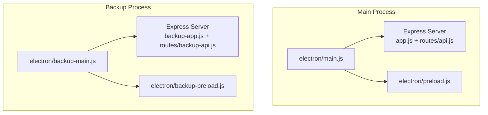
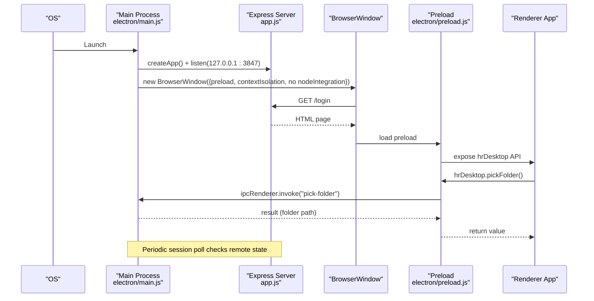
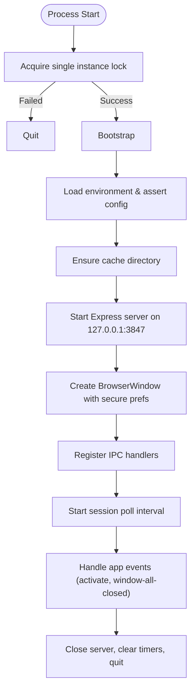
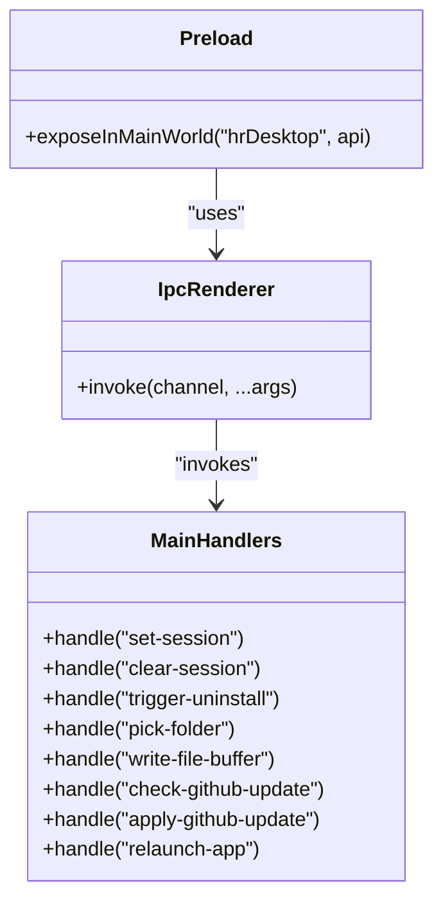
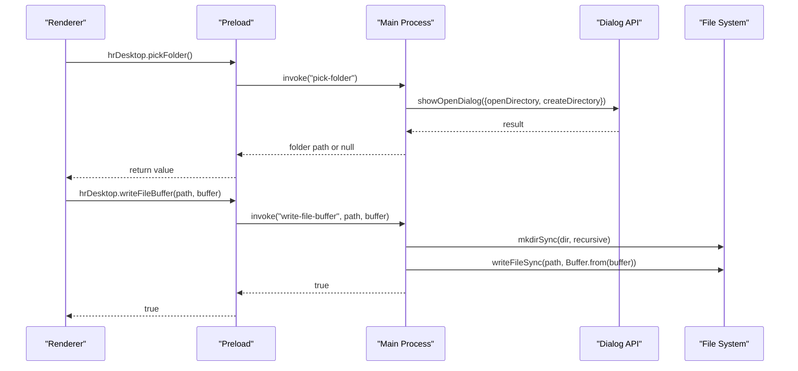
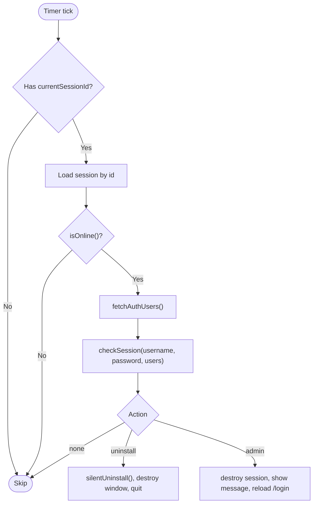
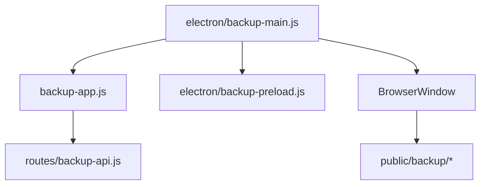
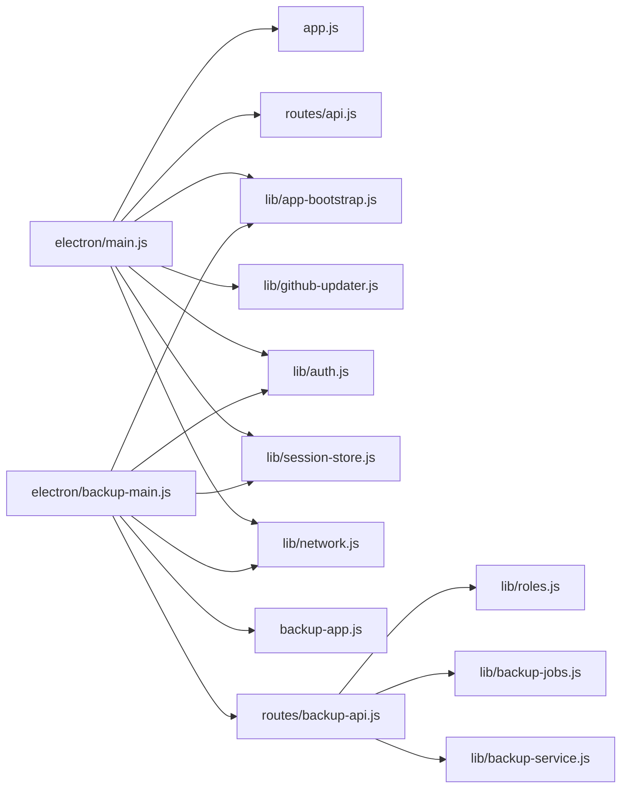

# Electron Desktop Structure

<cite>
**Referenced Files in This Document**
- [electron/main.js](file://electron/main.js)
- [electron/preload.js](file://electron/preload.js)
- [app.js](file://app.js)
- [routes/api.js](file://routes/api.js)
- [lib/app-bootstrap.js](file://lib/app-bootstrap.js)
- [lib/github-updater.js](file://lib/github-updater.js)
- [electron/backup-main.js](file://electron/backup-main.js)
- [electron/backup-preload.js](file://electron/backup-preload.js)
- [backup-app.js](file://backup-app.js)
- [routes/backup-api.js](file://routes/backup-api.js)
</cite>

## Table of Contents
1. [Introduction](#introduction)
2. [Project Structure](#project-structure)
3. [Core Components](#core-components)
4. [Architecture Overview](#architecture-overview)
5. [Detailed Component Analysis](#detailed-component-analysis)
6. [Dependency Analysis](#dependency-analysis)
7. [Performance Considerations](#performance-considerations)
8. [Troubleshooting Guide](#troubleshooting-guide)
9. [Conclusion](#conclusion)

## Introduction
This document explains the Electron desktop application structure with a focus on:
- Main process architecture in electron/main.js, including single instance management, window lifecycle, and IPC patterns
- Preload script security model using context isolation and disabled nodeIntegration
- Backup application structure for standalone backup operations (electron/backup-main.js)
- Port binding to 127.0.0.1:3847, session polling mechanism, and error handling strategies
- Examples of IPC handlers for file operations, folder selection, and application control
- Portable mode configuration and cross-platform considerations

## Project Structure
The Electron app consists of two main processes:
- Main process for the primary application (electron/main.js), which starts an Express server and manages the BrowserWindow
- A separate backup application process (electron/backup-main.js) that runs its own Express server and UI for backup tasks

**Diagram sources**
- [electron/main.js:1-309](file://electron/main.js#L1-L309)
- [electron/preload.js:1-14](file://electron/preload.js#L1-14)
- [app.js:1-57](file://app.js#L1-57)
- [routes/api.js:1-664](file://routes/api.js#L1-L664)
- [electron/backup-main.js:1-57](file://electron/backup-main.js#L1-L57)
- [electron/backup-preload.js:1-10](file://electron/backup-preload.js#L1-10)
- [backup-app.js:1-35](file://backup-app.js#L1-35)
- [routes/backup-api.js:1-127](file://routes/backup-api.js#L1-L127)

**Section sources**
- [electron/main.js:1-309](file://electron/main.js#L1-L309)
- [electron/backup-main.js:1-57](file://electron/backup-main.js#L1-L57)
- [app.js:1-57](file://app.js#L1-57)
- [backup-app.js:1-35](file://backup-app.js#L1-35)

## Core Components
- Main process bootstrap and server startup
- Single instance lock and second-instance behavior
- BrowserWindow creation with secure webPreferences
- IPC bridge via preload exposing minimal APIs to renderer
- Session polling timer for remote admin controls
- Error handling at process and window levels
- Portable mode path configuration
- Backup process with isolated server and UI

Key responsibilities:
- electron/main.js: orchestrates server, window, IPC, polling, updates, and cleanup
- electron/preload.js: exposes safe API surface to renderer
- app.js: Express setup for main app routes and static assets
- routes/api.js: authentication, session validation, and business endpoints
- lib/app-bootstrap.js: environment loading and portable detection
- lib/github-updater.js: update strategy per platform/install kind
- electron/backup-main.js: standalone backup process entrypoint
- electron/backup-preload.js: minimal API exposure for backup UI
- backup-app.js: Express setup for backup routes and static assets
- routes/backup-api.js: backup-specific auth and job orchestration

**Section sources**
- [electron/main.js:1-309](file://electron/main.js#L1-L309)
- [electron/preload.js:1-14](file://electron/preload.js#L1-14)
- [app.js:1-57](file://app.js#L1-57)
- [routes/api.js:1-664](file://routes/api.js#L1-L664)
- [lib/app-bootstrap.js:1-76](file://lib/app-bootstrap.js#L1-L76)
- [lib/github-updater.js:1-501](file://lib/github-updater.js#L1-L501)
- [electron/backup-main.js:1-57](file://electron/backup-main.js#L1-L57)
- [electron/backup-preload.js:1-10](file://electron/backup-preload.js#L1-10)
- [backup-app.js:1-35](file://backup-app.js#L1-35)
- [routes/backup-api.js:1-127](file://routes/backup-api.js#L1-L127)

## Architecture Overview
The main process boots an Express server bound to localhost and serves login/index pages. The renderer loads through a preload script that exposes only necessary methods via contextBridge. A periodic session poll checks remote status and can trigger uninstall or forced re-login. The backup process is independent, running on a different port with its own server and UI.

**Diagram sources**
- [electron/main.js:53-115](file://electron/main.js#L53-L115)
- [electron/preload.js:1-14](file://electron/preload.js#L1-14)
- [app.js:1-57](file://app.js#L1-57)

## Detailed Component Analysis

### Main Process Architecture (electron/main.js)
- Single instance management:
  - Uses requestSingleInstanceLock; if not acquired, quits immediately
  - On second-instance, focuses/restores existing window
- Environment and paths:
  - Configures portable data directory when PORTABLE_EXECUTABLE_DIR is set
  - Loads .env candidates via app-bootstrap
- Server startup:
  - Creates Express app and listens on 127.0.0.1:3847
  - Handles EADDRINUSE and other errors with user-facing dialogs
- Window lifecycle:
  - Creates BrowserWindow with preload, contextIsolation true, nodeIntegration false
  - Shows window on ready-to-show
  - Closes window and cleans up resources on exit
- IPC handlers:
  - Folder picker for payroll export
  - File write from ArrayBuffer
  - Session control (set/clear)
  - Trigger uninstall
  - GitHub update check/apply/relaunch
- Session polling:
  - Interval-based check against remote users list
  - Actions include uninstall or force admin logout
- Error handling:
  - Fatal dialog for startup failures and uncaught exceptions
  - Graceful server close and timer cleanup on window-all-closed

**Diagram sources**
- [electron/main.js:258-309](file://electron/main.js#L258-L309)
- [electron/main.js:166-256](file://electron/main.js#L166-L256)
- [electron/main.js:125-164](file://electron/main.js#L125-L164)

**Section sources**
- [electron/main.js:1-309](file://electron/main.js#L1-L309)

### Preload Security Model (electron/preload.js)
- Uses contextBridge.exposeInMainWorld to expose a minimal API surface
- All interactions go through ipcRenderer.invoke to the main process
- WebPreferences enforce contextIsolation: true and nodeIntegration: false
- Exposed functions:
  - Session control: setSession, clearSession
  - Uninstall trigger
  - File system access: pickFolder, writeFileBuffer
  - Update control: checkGitHubUpdate, applyGitHubUpdate, relaunchApp
  - Feature flag: isDesktop

**Diagram sources**
- [electron/preload.js:1-14](file://electron/preload.js#L1-14)
- [electron/main.js:196-254](file://electron/main.js#L196-L254)

**Section sources**
- [electron/preload.js:1-14](file://electron/preload.js#L1-14)
- [electron/main.js:88-93](file://electron/main.js#L88-L93)

### IPC Handlers for File Operations, Folder Selection, and Application Control
- Folder selection:
  - Handler: pick-folder
  - Behavior: opens directory picker with openDirectory and createDirectory options
  - Returns null if canceled, otherwise absolute path
- File writing:
  - Handler: write-file-buffer
  - Behavior: ensures parent directories exist, writes Buffer from ArrayBuffer
- Application control:
  - Handlers: set-session, clear-session, trigger-uninstall
  - Behaviors: manage current session ID, terminate app safely
- Updates:
  - Handlers: check-github-update, apply-github-update, relaunch-app
  - Behaviors: query latest release, apply update, relaunch when needed

**Diagram sources**
- [electron/main.js:196-209](file://electron/main.js#L196-L209)

**Section sources**
- [electron/main.js:196-254](file://electron/main.js#L196-L254)

### Session Polling Mechanism
- Purpose: periodically verify user status remotely and enforce admin actions
- Interval: every 5 minutes
- Flow:
  - If no current session, skip
  - Load session by ID
  - Check online status
  - Fetch remote users and validate session
  - Actions:
    - uninstall: silent uninstall, destroy window, quit
    - admin: destroy session, show warning, reload login page
  - Errors are ignored to tolerate transient network issues

**Diagram sources**
- [electron/main.js:125-164](file://electron/main.js#L125-L164)

**Section sources**
- [electron/main.js:125-164](file://electron/main.js#L125-L164)

### Backup Application Structure (Standalone)
- Entry point: electron/backup-main.js
  - Single instance lock with role "hangup-backup"
  - Loads environment, asserts Supabase config, ensures cache directory
  - Starts Express server on 127.0.0.1:3848
  - Creates BrowserWindow with preload and secure webPreferences
  - Registers IPC handlers for folder selection and opening paths
- Server: backup-app.js
  - Express setup with cookie parser, JSON body limit, session middleware
  - Static assets under public/css, js, img
  - Routes mounted at /api/backup
  - Login and index pages served from public/backup
- API: routes/backup-api.js
  - Authentication via x-session-id header or session storage
  - Role gating: only Admin and RTM can use backup app
  - Endpoints:
    - POST /api/backup/login: authenticate and create session
    - POST /api/backup/logout: destroy session
    - GET /api/backup/me: current user info and supported kinds
    - POST /api/backup/full: start full backup job
    - POST /api/backup/sales: start sales backup job with optional date range
    - GET /api/backup/jobs/:id: get job status
- Preload: electron/backup-preload.js
  - Exposes hrBackup API: setSession, clearSession, pickFolder, openPath, isDesktop

**Diagram sources**
- [electron/backup-main.js:1-57](file://electron/backup-main.js#L1-L57)
- [backup-app.js:1-35](file://backup-app.js#L1-35)
- [routes/backup-api.js:1-127](file://routes/backup-api.js#L1-L127)
- [electron/backup-preload.js:1-10](file://electron/backup-preload.js#L1-10)

**Section sources**
- [electron/backup-main.js:1-57](file://electron/backup-main.js#L1-L57)
- [backup-app.js:1-35](file://backup-app.js#L1-35)
- [routes/backup-api.js:1-127](file://routes/backup-api.js#L1-L127)
- [electron/backup-preload.js:1-10](file://electron/backup-preload.js#L1-10)

### Port Binding and Network Configuration
- Main app binds to 127.0.0.1:3847
- Backup app binds to 127.0.0.1:3848
- Both servers handle EADDRINUSE and general errors during startup
- Localhost-only binding ensures the app does not expose services externally

**Section sources**
- [electron/main.js:19-23](file://electron/main.js#L19-L23)
- [electron/main.js:53-76](file://electron/main.js#L53-L76)
- [electron/backup-main.js:7-18](file://electron/backup-main.js#L7-L18)

### Error Handling Strategies
- Startup errors:
  - Missing Supabase configuration: fatal dialog and quit
  - Cache directory creation failure: fatal dialog and quit
  - Server startup failure (including EADDRINUSE): fatal dialog and quit
- Window load failures:
  - did-fail-load handler shows a detailed error dialog for login page load issues
- Uncaught exceptions:
  - Global handler shows a fatal dialog and quits
- Session polling:
  - Network blips are tolerated; next poll will retry
- Backup app:
  - Generic error middleware returns JSON error responses

**Section sources**
- [electron/main.js:166-193](file://electron/main.js#L166-L193)
- [electron/main.js:99-108](file://electron/main.js#L99-L108)
- [electron/main.js:305-309](file://electron/main.js#L305-L309)
- [backup-app.js:28-31](file://backup-app.js#L28-L31)

### Portable Mode Configuration and Cross-Platform Considerations
- Portable detection:
  - Presence of PORTABLE_EXECUTABLE_DIR indicates portable mode
  - Sets HR_PORTABLE=1 and redirects userData to HangupHR-data inside executable directory
- Environment loading:
  - Prioritizes .env files in portable directory and HangupHR-data/.env
- Install kind detection:
  - Determines nsis vs portable vs mac install to choose update strategy
- Platform asset suffixes:
  - Selects appropriate update package based on platform and arch
- Cross-platform behaviors:
  - macOS uses .app bundle detection
  - Windows detects NSIS installer presence and common installation paths
  - Portable fallback used when installer detection fails

**Section sources**
- [electron/main.js:37-51](file://electron/main.js#L37-L51)
- [lib/app-bootstrap.js:20-23](file://lib/app-bootstrap.js#L20-L23)
- [lib/github-updater.js:51-68](file://lib/github-updater.js#L51-L68)
- [lib/github-updater.js:70-75](file://lib/github-updater.js#L70-L75)
- [lib/github-updater.js:459-501](file://lib/github-updater.js#L459-L501)

## Dependency Analysis
The main process depends on:
- Express server (app.js) and routes (routes/api.js)
- Bootstrap utilities (lib/app-bootstrap.js)
- Auth and session store (lib/auth.js, lib/session-store.js)
- Network utilities (lib/network.js)
- GitHub updater (lib/github-updater.js)
- Uninstall utility (lib/uninstall.js)

The backup process depends on:
- Backup Express server (backup-app.js) and routes (routes/backup-api.js)
- Bootstrap utilities (lib/app-bootstrap.js)
- Auth and session store (lib/auth.js, lib/session-store.js)
- Network utilities (lib/network.js)
- Roles and backup jobs/services (lib/roles.js, lib/backup-jobs.js, lib/backup-service.js)

**Diagram sources**
- [electron/main.js:1-309](file://electron/main.js#L1-L309)
- [app.js:1-57](file://app.js#L1-57)
- [routes/api.js:1-664](file://routes/api.js#L1-L664)
- [lib/app-bootstrap.js:1-76](file://lib/app-bootstrap.js#L1-L76)
- [lib/github-updater.js:1-501](file://lib/github-updater.js#L1-L501)
- [electron/backup-main.js:1-57](file://electron/backup-main.js#L1-L57)
- [backup-app.js:1-35](file://backup-app.js#L1-35)
- [routes/backup-api.js:1-127](file://routes/backup-api.js#L1-L127)

**Section sources**
- [electron/main.js:1-309](file://electron/main.js#L1-L309)
- [electron/backup-main.js:1-57](file://electron/backup-main.js#L1-L57)

## Performance Considerations
- Session polling interval is set to 5 minutes to balance responsiveness and network overhead
- Server limits:
  - Main app JSON body size limit is larger than backup app to accommodate uploads
- File operations:
  - Directory creation is performed recursively before writing files
- Update strategy:
  - Portable updates use staged extraction and swap manifest to minimize downtime

[No sources needed since this section provides general guidance]

## Troubleshooting Guide
- Could not open login page:
  - Indicates local server failed to serve /login; ensure port 3847 is free and server started successfully
- Port already in use:
  - Close other instances or change port; the app reports a specific error message
- Storage error:
  - Ensure permissions to create cache directory under userData
- Configuration error:
  - Verify Supabase configuration variables in .env
- Unexpected error:
  - Global uncaught exception handler displays a fatal dialog; review logs and reinstall if necessary
- Backup app cannot connect:
  - Confirm backup server is listening on 127.0.0.1:3848 and credentials are valid

**Section sources**
- [electron/main.js:99-108](file://electron/main.js#L99-L108)
- [electron/main.js:53-76](file://electron/main.js#L53-L76)
- [electron/main.js:166-193](file://electron/main.js#L166-L193)
- [electron/main.js:305-309](file://electron/main.js#L305-L309)

## Conclusion
The Electron desktop application follows a secure and modular architecture:
- Main process manages a local Express server, secure BrowserWindow, and IPC bridge
- Preload exposes a minimal API surface with strict security settings
- Session polling enforces remote administrative controls
- Backup process operates independently with its own server and UI
- Portable mode and cross-platform update logic provide flexible deployment options