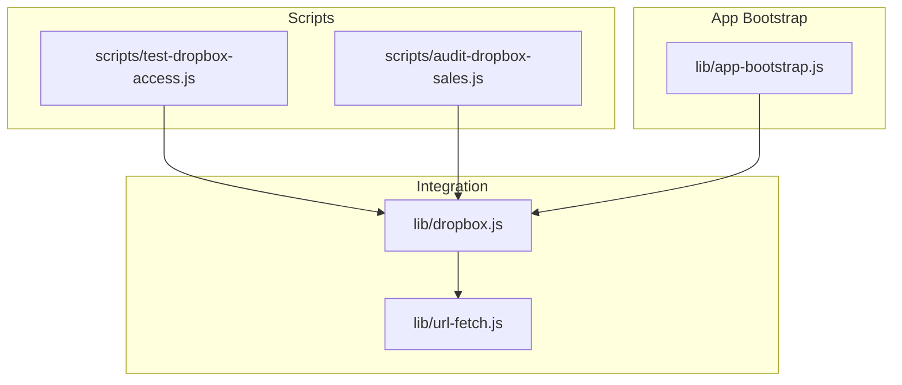
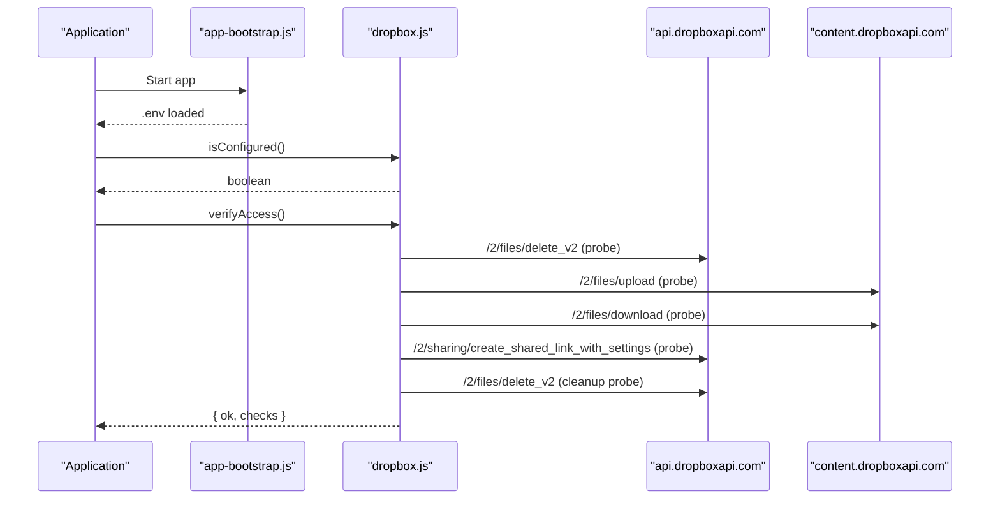
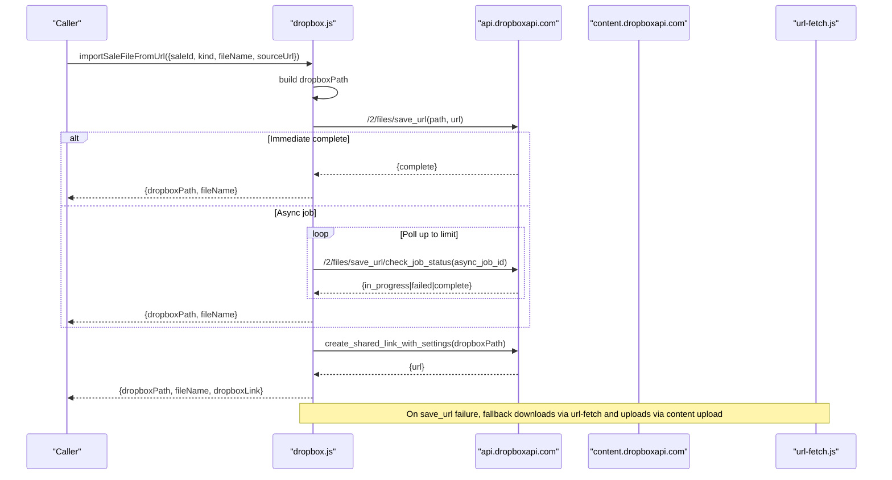
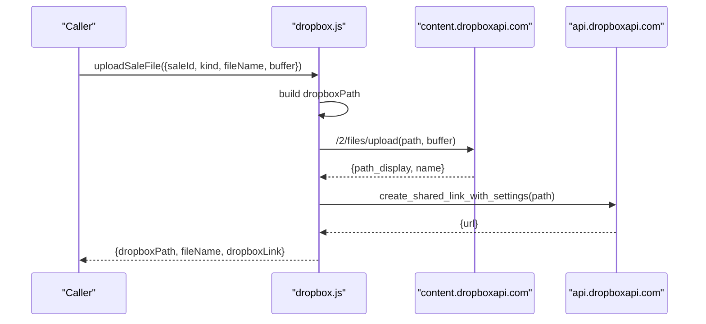
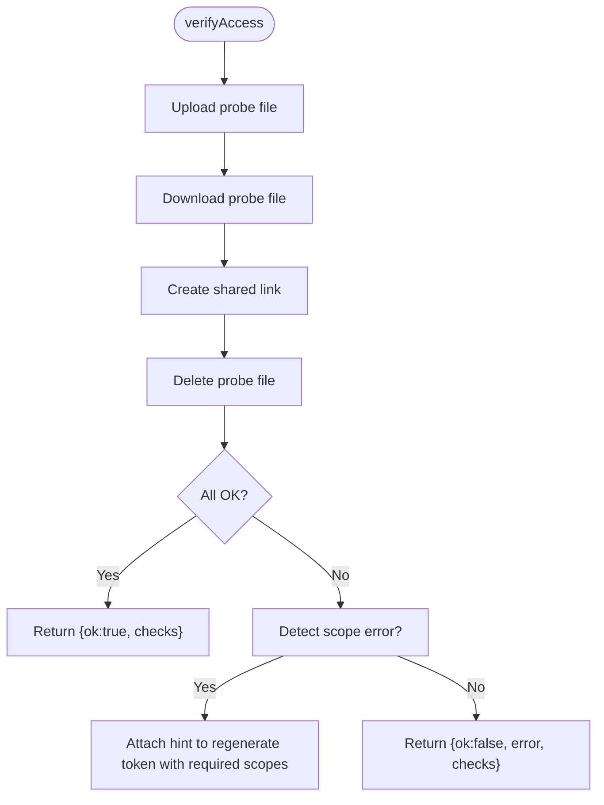
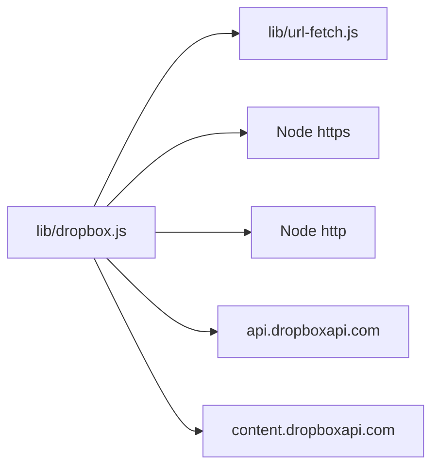

# Dropbox Integration

<cite>
**Referenced Files in This Document**
- [lib/dropbox.js](file://lib/dropbox.js)
- [scripts/test-dropbox-access.js](file://scripts/test-dropbox-access.js)
- [scripts/audit-dropbox-sales.js](file://scripts/audit-dropbox-sales.js)
- [lib/url-fetch.js](file://lib/url-fetch.js)
- [lib/app-bootstrap.js](file://lib/app-bootstrap.js)
</cite>

## Table of Contents
1. [Introduction](#introduction)
2. [Project Structure](#project-structure)
3. [Core Components](#core-components)
4. [Architecture Overview](#architecture-overview)
5. [Detailed Component Analysis](#detailed-component-analysis)
6. [Dependency Analysis](#dependency-analysis)
7. [Performance Considerations](#performance-considerations)
8. [Troubleshooting Guide](#troubleshooting-guide)
9. [Conclusion](#conclusion)
10. [Appendices](#appendices)

## Introduction
This document explains the Dropbox integration used for storing sales recordings and attachments. It covers authentication setup, folder organization, core operations (upload, download, shared link creation, deletion), direct URL-to-Dropbox import with async job polling, error handling patterns, configuration examples, troubleshooting, and performance considerations for large files.

## Project Structure
The Dropbox integration is implemented as a small, focused module that wraps Dropbox REST APIs using Node’s built-in HTTP client. Supporting scripts provide quick access verification and auditing against the database.

**Diagram sources**
- [lib/dropbox.js:1-323](file://lib/dropbox.js#L1-L323)
- [lib/url-fetch.js:1-32](file://lib/url-fetch.js#L1-L32)
- [scripts/test-dropbox-access.js:1-21](file://scripts/test-dropbox-access.js#L1-L21)
- [scripts/audit-dropbox-sales.js:1-117](file://scripts/audit-dropbox-sales.js#L1-L117)
- [lib/app-bootstrap.js:1-75](file://lib/app-bootstrap.js#L1-L75)

**Section sources**
- [lib/dropbox.js:1-323](file://lib/dropbox.js#L1-L323)
- [scripts/test-dropbox-access.js:1-21](file://scripts/test-dropbox-access.js#L1-L21)
- [scripts/audit-dropbox-sales.js:1-117](file://scripts/audit-dropbox-sales.js#L1-L117)
- [lib/url-fetch.js:1-32](file://lib/url-fetch.js#L1-L32)
- [lib/app-bootstrap.js:1-75](file://lib/app-bootstrap.js#L1-L75)

## Core Components
- Authentication and configuration
  - Access token is read from an environment variable; presence is checked before any API call.
  - A helper verifies configured status and provides scope diagnostics.
- Folder structure
  - Base folder defaults to a well-known path under a top-level directory and can be overridden via an environment variable.
- Core operations
  - Upload content directly to Dropbox.
  - Download file content from Dropbox.
  - Create or reuse a shared link for a file.
  - Delete a file by path.
  - Import a remote URL into Dropbox using save_url with async job polling.
  - Helper utilities to confirm file existence and ensure a shared link exists.

Key responsibilities are encapsulated within a single module, exposing a clean API surface for callers.

**Section sources**
- [lib/dropbox.js:8-14](file://lib/dropbox.js#L8-L14)
- [lib/dropbox.js:22-44](file://lib/dropbox.js#L22-L44)
- [lib/dropbox.js:88-129](file://lib/dropbox.js#L88-L129)
- [lib/dropbox.js:131-163](file://lib/dropbox.js#L131-L163)
- [lib/dropbox.js:169-208](file://lib/dropbox.js#L169-L208)
- [lib/dropbox.js:232-261](file://lib/dropbox.js#L232-L261)
- [lib/dropbox.js:276-279](file://lib/dropbox.js#L276-L279)
- [lib/dropbox.js:281-308](file://lib/dropbox.js#L281-L308)

## Architecture Overview
At runtime, the application loads environment variables from multiple locations and then uses the Dropbox module to perform storage operations. The module communicates with two Dropbox endpoints:
- api.dropboxapi.com for metadata and sharing operations
- content.dropboxapi.com for binary upload/download

**Diagram sources**
- [lib/app-bootstrap.js:4-47](file://lib/app-bootstrap.js#L4-L47)
- [lib/dropbox.js:22-44](file://lib/dropbox.js#L22-L44)
- [lib/dropbox.js:46-86](file://lib/dropbox.js#L46-L86)
- [lib/dropbox.js:88-129](file://lib/dropbox.js#L88-L129)
- [lib/dropbox.js:131-163](file://lib/dropbox.js#L131-L163)
- [lib/dropbox.js:232-261](file://lib/dropbox.js#L232-L261)

## Detailed Component Analysis

### Authentication and Configuration
- Environment variables
  - DROPBOX_ACCESS_TOKEN: Required for all operations. If missing, calls throw descriptive errors.
  - DROPBOX_SALES_FOLDER: Optional override for the base sales folder; defaults to a standard path if not set.
- Verification
  - A diagnostic routine writes a small probe file, reads it back, creates a shared link, and deletes the probe to validate write, read, and sharing scopes.
  - Scope-related errors are detected and surfaced with actionable guidance to update permissions and regenerate tokens.

Configuration loading
- The application bootstrap attempts to load .env from several candidate locations, ensuring the token is available at runtime.

**Section sources**
- [lib/dropbox.js:8-14](file://lib/dropbox.js#L8-L14)
- [lib/dropbox.js:22-44](file://lib/dropbox.js#L22-L44)
- [lib/app-bootstrap.js:4-47](file://lib/app-bootstrap.js#L4-L47)

### Folder Structure Organization
- Default base folder: a predefined path under a top-level directory.
- Override: set an environment variable to point to a different root.
- File paths are normalized to absolute Dropbox paths when needed.

Practical implications
- All uploads and imports place files under this base folder, organized by sale ID and kind (e.g., recording).

**Section sources**
- [lib/dropbox.js:22-26](file://lib/dropbox.js#L22-L26)
- [lib/dropbox.js:210-215](file://lib/dropbox.js#L210-L215)
- [lib/dropbox.js:263-267](file://lib/dropbox.js#L263-L267)

### Core Operations

#### Upload (contentUpload)
- Sends binary data to Dropbox using the content endpoint.
- Returns normalized metadata including display path and original file name.
- Used internally by higher-level helpers to persist uploaded buffers.

Operational notes
- Uses a dedicated content host for efficient binary transfer.
- Normalizes provided paths to absolute Dropbox paths.

**Section sources**
- [lib/dropbox.js:88-129](file://lib/dropbox.js#L88-L129)

#### Download (downloadFile)
- Streams binary content from Dropbox and returns a buffer.
- Suitable for on-demand retrieval and local processing.

Error behavior
- Non-2xx responses are converted to errors with HTTP status context.

**Section sources**
- [lib/dropbox.js:232-261](file://lib/dropbox.js#L232-L261)

#### Shared Link Creation (createSharedLink)
- Attempts to reuse an existing shared link if allowed.
- Creates a new link with team visibility if none exists.
- Handles “already exists” conflicts by listing current links and returning the first match.

Return value
- Returns a shareable URL string.

**Section sources**
- [lib/dropbox.js:131-163](file://lib/dropbox.js#L131-L163)

#### Deletion (deleteFile)
- Deletes a file by its Dropbox path.
- Safe no-op when path is empty.

**Section sources**
- [lib/dropbox.js:276-279](file://lib/dropbox.js#L276-L279)

#### Direct URL-to-Dropbox Import (importFromUrl)
- Initiates a server-side save_url operation to fetch a remote resource into Dropbox without downloading locally.
- Polls job status until completion or failure.
- Returns normalized metadata upon success.

Fallback behavior
- When the high-level wrapper encounters a failure during save_url, it falls back to downloading the URL locally and uploading via content upload.

**Section sources**
- [lib/dropbox.js:169-208](file://lib/dropbox.js#L169-L208)
- [lib/dropbox.js:210-230](file://lib/dropbox.js#L210-L230)
- [lib/url-fetch.js:1-32](file://lib/url-fetch.js#L1-L32)

#### Helpers
- confirmFileExists: Validates that a given path points to a file and returns size and name.
- ensureSharedLink: Ensures a shared link exists; creates one if missing.

**Section sources**
- [lib/dropbox.js:281-308](file://lib/dropbox.js#L281-L308)

### Sequence Diagrams

#### End-to-end Import Flow (URL → Dropbox)

**Diagram sources**
- [lib/dropbox.js:210-230](file://lib/dropbox.js#L210-L230)
- [lib/dropbox.js:169-208](file://lib/dropbox.js#L169-L208)
- [lib/dropbox.js:131-163](file://lib/dropbox.js#L131-L163)
- [lib/url-fetch.js:1-32](file://lib/url-fetch.js#L1-L32)

#### Upload Flow (Buffer → Dropbox + Shared Link)

**Diagram sources**
- [lib/dropbox.js:263-274](file://lib/dropbox.js#L263-L274)
- [lib/dropbox.js:88-129](file://lib/dropbox.js#L88-L129)
- [lib/dropbox.js:131-163](file://lib/dropbox.js#L131-L163)

### Flowchart: Scope Verification Routine

**Diagram sources**
- [lib/dropbox.js:22-44](file://lib/dropbox.js#L22-L44)

## Dependency Analysis
- Internal dependencies
  - lib/url-fetch.js: Used by the import wrapper to download remote URLs when server-side save_url fails.
- External dependencies
  - Node built-ins: https/http for network requests.
  - Dropbox REST APIs:
    - api.dropboxapi.com for metadata, sharing, and job status.
    - content.dropboxapi.com for binary upload/download.

**Diagram sources**
- [lib/dropbox.js:1-323](file://lib/dropbox.js#L1-L323)
- [lib/url-fetch.js:1-32](file://lib/url-fetch.js#L1-L32)

**Section sources**
- [lib/dropbox.js:1-323](file://lib/dropbox.js#L1-L323)
- [lib/url-fetch.js:1-32](file://lib/url-fetch.js#L1-L32)

## Performance Considerations
- Large file uploads/downloads
  - Use streaming where possible; avoid buffering entire files in memory unless necessary.
  - Prefer server-side save_url for large remote resources to minimize bandwidth and memory usage.
- Network timeouts
  - Remote URL fetching includes a configurable timeout; adjust based on expected latency and file sizes.
- Job polling
  - The save_url polling loop uses incremental delays and a fixed maximum number of iterations to prevent indefinite waits.
- Shared link caching
  - Reuse existing shared links to reduce API calls and improve responsiveness.

[No sources needed since this section provides general guidance]

## Troubleshooting Guide

Common issues and resolutions
- Missing or invalid token
  - Symptom: Errors indicating Dropbox is not configured.
  - Resolution: Ensure the access token environment variable is set and valid.
- Missing scopes
  - Symptom: Errors mentioning missing scopes or not permitted.
  - Resolution: Enable required scopes in the Dropbox App Console and regenerate the access token. Update the environment variable with the new token.
- Network timeouts
  - Symptom: Timeout errors when fetching remote URLs.
  - Resolution: Increase timeout settings or retry with exponential backoff. Verify network connectivity and destination availability.
- Graceful fallbacks
  - Behavior: If server-side URL saving fails, the system falls back to downloading the URL locally and uploading via the content endpoint.
  - Impact: Higher memory usage and bandwidth; consider improving upstream reliability or increasing timeouts.

Verification and audit tools
- Quick access check script: validates configuration and basic operations.
- Audit script: compares Dropbox contents with database records and can fix missing shared links.

**Section sources**
- [lib/dropbox.js:16-19](file://lib/dropbox.js#L16-L19)
- [lib/dropbox.js:22-44](file://lib/dropbox.js#L22-L44)
- [lib/url-fetch.js:1-32](file://lib/url-fetch.js#L1-L32)
- [scripts/test-dropbox-access.js:1-21](file://scripts/test-dropbox-access.js#L1-L21)
- [scripts/audit-dropbox-sales.js:1-117](file://scripts/audit-dropbox-sales.js#L1-L117)

## Conclusion
The Dropbox integration provides a concise, robust interface for managing sales recordings and attachments. It emphasizes safe configuration checks, clear error signaling, and resilient workflows with fallbacks. By following the configuration and troubleshooting guidance, teams can reliably store, retrieve, and share large media assets while maintaining operational clarity.

[No sources needed since this section summarizes without analyzing specific files]

## Appendices

### Configuration Examples
- Required
  - Set the access token environment variable so that the module can authenticate with Dropbox.
- Optional
  - Override the base sales folder by setting the corresponding environment variable.

Environment loading
- The application bootstrap searches multiple locations for a .env file and loads it automatically when present.

**Section sources**
- [lib/dropbox.js:8-14](file://lib/dropbox.js#L8-L14)
- [lib/dropbox.js:22-26](file://lib/dropbox.js#L22-L26)
- [lib/app-bootstrap.js:4-47](file://lib/app-bootstrap.js#L4-L47)