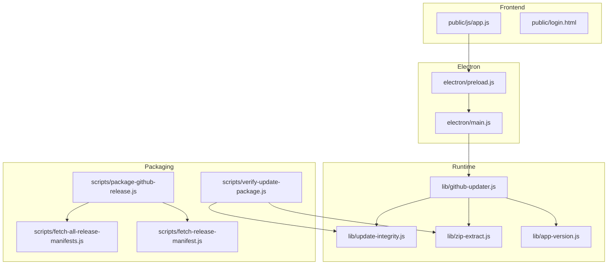
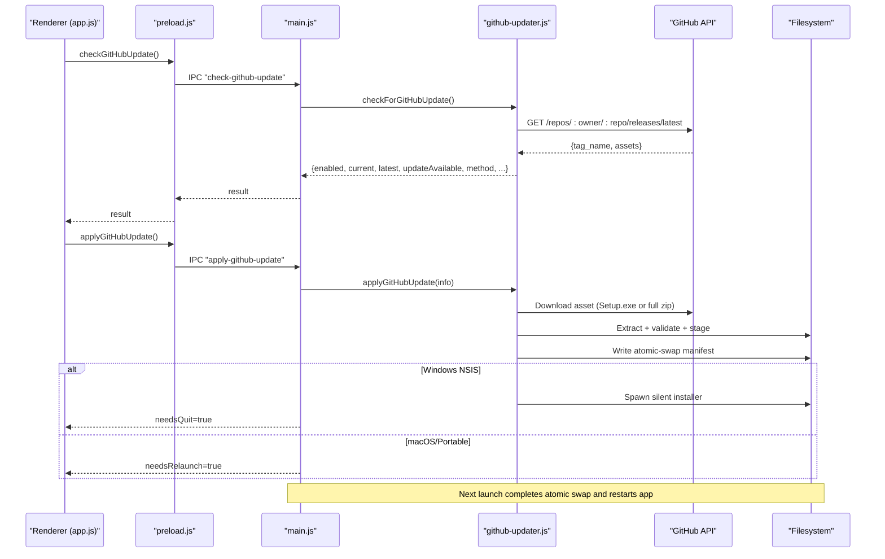
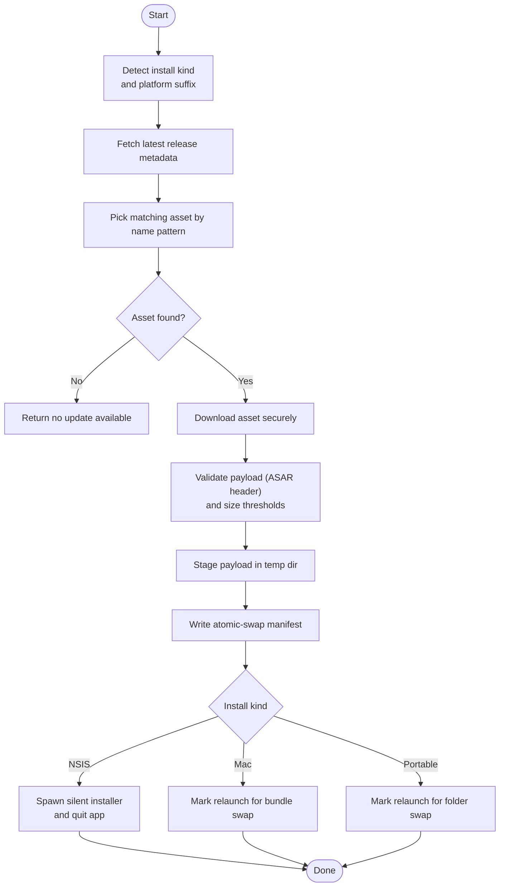
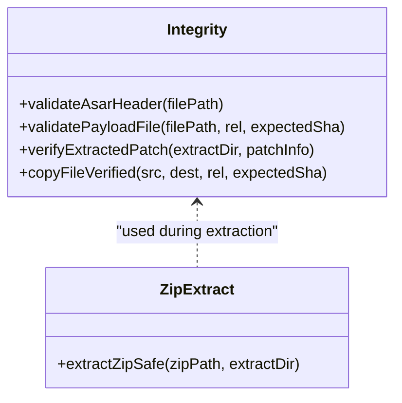
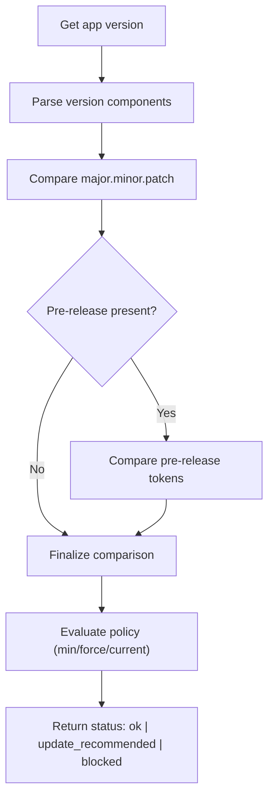
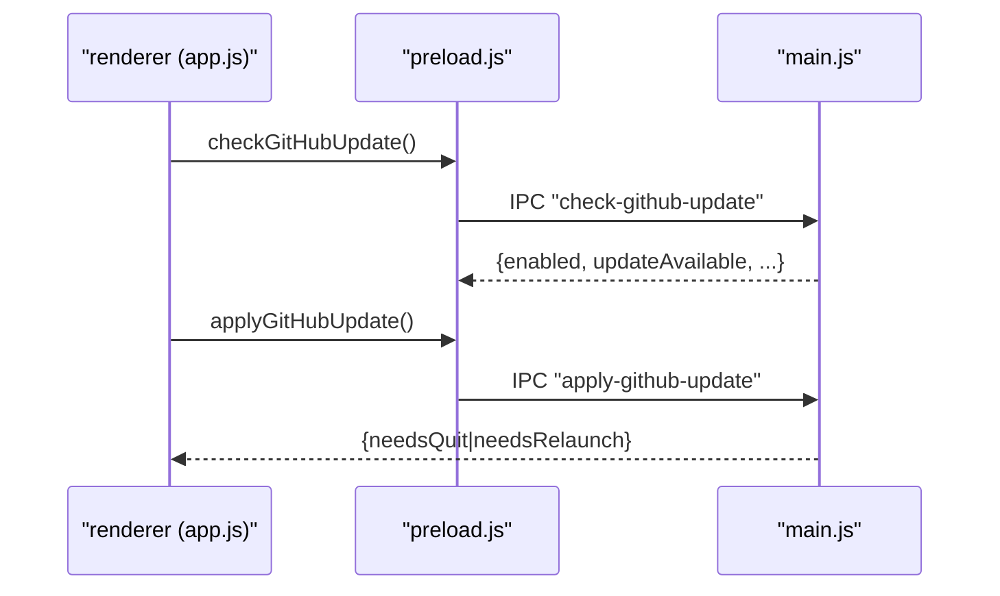
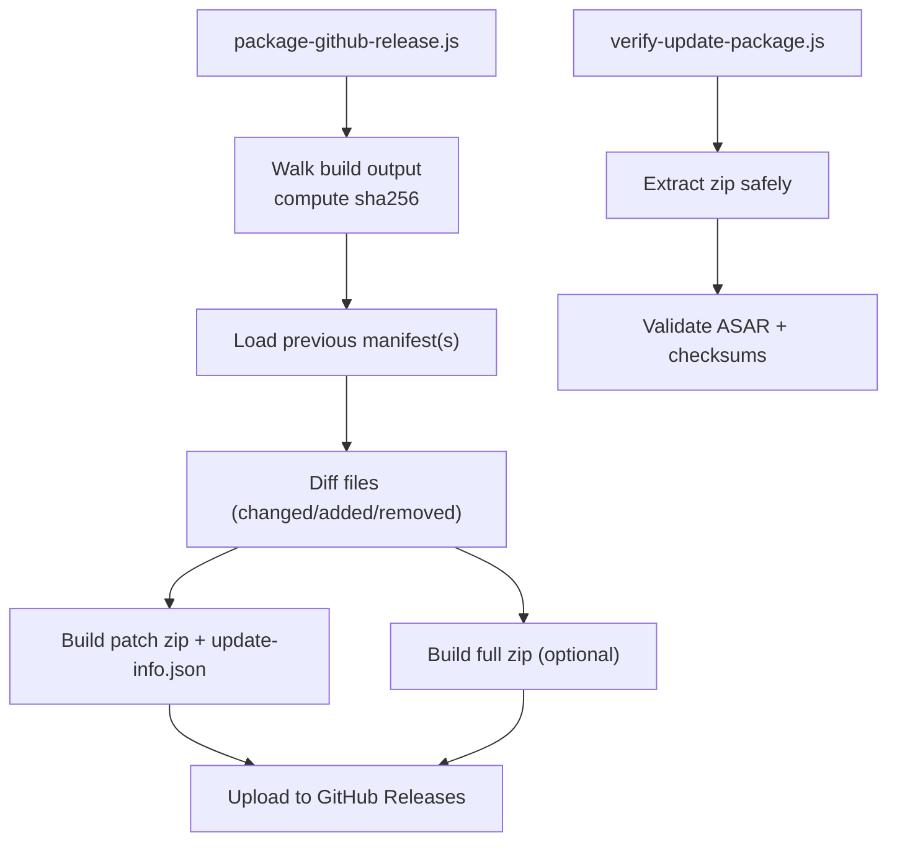
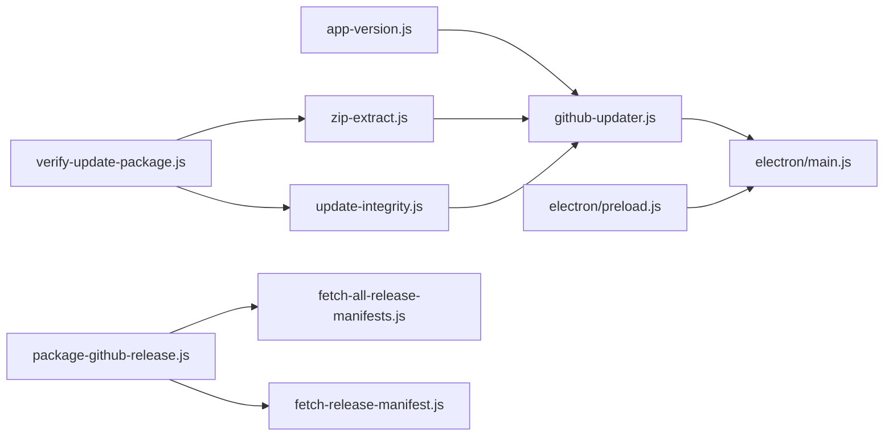

# GitHub Update System

<cite>
**Referenced Files in This Document**
- [lib/github-updater.js](file://lib/github-updater.js)
- [lib/update-integrity.js](file://lib/update-integrity.js)
- [lib/zip-extract.js](file://lib/zip-extract.js)
- [lib/app-version.js](file://lib/app-version.js)
- [electron/main.js](file://electron/main.js)
- [electron/preload.js](file://electron/preload.js)
- [public/js/app.js](file://public/js/app.js)
- [public/login.html](file://public/login.html)
- [scripts/package-github-release.js](file://scripts/package-github-release.js)
- [scripts/verify-update-package.js](file://scripts/verify-update-package.js)
- [scripts/fetch-all-release-manifests.js](file://scripts/fetch-all-release-manifests.js)
- [scripts/fetch-release-manifest.js](file://scripts/fetch-release-manifest.js)
- [UPDATES.md](file://UPDATES.md)
</cite>

## Table of Contents
1. Introduction
2. Project Structure
3. Core Components
4. Architecture Overview
5. Detailed Component Analysis
6. Dependency Analysis
7. Performance Considerations
8. Troubleshooting Guide
9. Conclusion
10. Appendices

## Introduction
This document explains the GitHub-based application update system used by the desktop app. It covers how the app checks for updates against GitHub Releases, downloads and applies platform-specific installers or full app bundles, verifies integrity, performs atomic swaps with rollback support, and integrates user notifications and manual triggers. It also documents the update manifest format, release asset handling, security measures (secure channels, checksum validation), scheduling behavior, and edge-case handling such as partial downloads and network interruptions.

## Project Structure
The update system spans runtime modules, Electron IPC bridges, UI flows, packaging scripts, and documentation:

- Runtime updater logic: lib/github-updater.js
- Integrity verification: lib/update-integrity.js
- Safe zip extraction: lib/zip-extract.js
- Version parsing and policy helpers: lib/app-version.js
- Electron main process IPC: electron/main.js
- Preload bridge to renderer: electron/preload.js
- Frontend update prompts and flows: public/js/app.js, public/login.html
- Packaging and manifests: scripts/package-github-release.js, scripts/verify-update-package.js, scripts/fetch-all-release-manifests.js, scripts/fetch-release-manifest.js
- Release notes and workflows: UPDATES.md

**Diagram sources**
- [lib/github-updater.js](file://lib/github-updater.js)
- [lib/update-integrity.js](file://lib/update-integrity.js)
- [lib/zip-extract.js](file://lib/zip-extract.js)
- [lib/app-version.js](file://lib/app-version.js)
- [electron/main.js](file://electron/main.js)
- [electron/preload.js](file://electron/preload.js)
- [public/js/app.js](file://public/js/app.js)
- [public/login.html](file://public/login.html)
- [scripts/package-github-release.js](file://scripts/package-github-release.js)
- [scripts/verify-update-package.js](file://scripts/verify-update-package.js)
- [scripts/fetch-all-release-manifests.js](file://scripts/fetch-all-release-manifests.js)
- [scripts/fetch-release-manifest.js](file://scripts/fetch-release-manifest.js)

**Section sources**
- [lib/github-updater.js](file://lib/github-updater.js)
- [lib/update-integrity.js](file://lib/update-integrity.js)
- [lib/zip-extract.js](file://lib/zip-extract.js)
- [lib/app-version.js](file://lib/app-version.js)
- [electron/main.js](file://electron/main.js)
- [electron/preload.js](file://electron/preload.js)
- [public/js/app.js](file://public/js/app.js)
- [public/login.html](file://public/login.html)
- [scripts/package-github-release.js](file://scripts/package-github-release.js)
- [scripts/verify-update-package.js](file://scripts/verify-update-package.js)
- [scripts/fetch-all-release-manifests.js](file://scripts/fetch-all-release-manifests.js)
- [scripts/fetch-release-manifest.js](file://scripts/fetch-release-manifest.js)
- [UPDATES.md](file://UPDATES.md)

## Core Components
- GitHub updater module: detects install type, fetches latest release, selects appropriate asset, downloads, stages payload, writes swap manifest, and executes platform-specific apply paths.
- Integrity module: validates ASAR headers and optional SHA-256 checksums; provides safe copy utilities.
- Zip extractor: iterates entries safely and validates .asar files during extraction.
- Version helpers: parse versions, compare pre-release semantics, evaluate compatibility policy.
- Electron IPC: exposes check/apply/relaunch operations from renderer to main process.
- Frontend: polls for updates, shows banners/modals, triggers manual updates, handles blocked version screens.
- Packaging scripts: generate patch/full zips and manifests; verify packages before publish; fetch previous manifests.

**Section sources**
- [lib/github-updater.js](file://lib/github-updater.js)
- [lib/update-integrity.js](file://lib/update-integrity.js)
- [lib/zip-extract.js](file://lib/zip-extract.js)
- [lib/app-version.js](file://lib/app-version.js)
- [electron/main.js](file://electron/main.js)
- [electron/preload.js](file://electron/preload.js)
- [public/js/app.js](file://public/js/app.js)
- [public/login.html](file://public/login.html)
- [scripts/package-github-release.js](file://scripts/package-github-release.js)
- [scripts/verify-update-package.js](file://scripts/verify-update-package.js)
- [scripts/fetch-all-release-manifests.js](file://scripts/fetch-all-release-manifests.js)
- [scripts/fetch-release-manifest.js](file://scripts/fetch-release-manifest.js)

## Architecture Overview
End-to-end flow:
- On startup, the app recovers any pending atomic swap and checks install health.
- The frontend periodically checks GitHub for a newer release and displays a banner or modal.
- When triggered, the main process downloads the correct asset, stages it, writes an atomic-swap manifest, and either runs a silent installer (Windows NSIS) or relaunches to perform a bundle/folder swap.
- On next launch, the swap is executed atomically with backup and re-launch.

**Diagram sources**
- [public/js/app.js](file://public/js/app.js)
- [electron/preload.js](file://electron/preload.js)
- [electron/main.js](file://electron/main.js)
- [lib/github-updater.js](file://lib/github-updater.js)

## Detailed Component Analysis

### GitHub Updater Module
Responsibilities:
- Detect install kind (NSIS, macOS .app, portable).
- Fetch latest release metadata and pick the right asset based on naming patterns and platform suffixes.
- Download via secure HTTPS with optional bearer token.
- Stage payload safely, validate ASAR header, and write an atomic-swap manifest.
- Apply updates:
  - Windows NSIS: download Setup.exe, kill running processes, run silently, cleanup temp.
  - macOS: replace entire .app bundle on relaunch.
  - Portable: atomic folder swap on relaunch.
- Recover interrupted swaps at startup and report install health.

Key behaviors:
- Asset selection uses regex patterns for both legacy and new naming conventions.
- Atomic swap manifest includes stagedPath, targetPath, backupPath, exe, and version.
- Platform-specific scripts move target to backup, then move staged into place and relaunch.

**Diagram sources**
- [lib/github-updater.js](file://lib/github-updater.js)

**Section sources**
- [lib/github-updater.js](file://lib/github-updater.js)

### Integrity Verification and Safe Extraction
- ASAR header validation ensures the package is not truncated or corrupted.
- Optional SHA-256 verification supports patch payloads that include file hashes.
- Safe zip extraction avoids known pitfalls (PowerShell Expand-Archive, chmod issues) and validates each .asar entry.

**Diagram sources**
- [lib/update-integrity.js](file://lib/update-integrity.js)
- [lib/zip-extract.js](file://lib/zip-extract.js)

**Section sources**
- [lib/update-integrity.js](file://lib/update-integrity.js)
- [lib/zip-extract.js](file://lib/zip-extract.js)

### Version Policy and Compatibility
- Parses semantic versions including pre-release tokens.
- Compares versions with numeric and string precedence rules.
- Evaluates server-provided policy to block or recommend updates based on roles and minimum versions.

**Diagram sources**
- [lib/app-version.js](file://lib/app-version.js)

**Section sources**
- [lib/app-version.js](file://lib/app-version.js)

### Electron IPC and Frontend Integration
- Preload exposes hrDesktop.checkGitHubUpdate(), applyGitHubUpdate(), relaunchApp().
- Main registers handlers that delegate to the updater module and manage lifecycle (quit/relaunch).
- Frontend polls periodically, shows banners/modals, and triggers manual updates. Login page can show update notices even before sign-in.

**Diagram sources**
- [electron/preload.js](file://electron/preload.js)
- [electron/main.js](file://electron/main.js)
- [public/js/app.js](file://public/js/app.js)
- [public/login.html](file://public/login.html)

**Section sources**
- [electron/preload.js](file://electron/preload.js)
- [electron/main.js](file://electron/main.js)
- [public/js/app.js](file://public/js/app.js)
- [public/login.html](file://public/login.html)

### Packaging, Manifests, and Verification
- Package script walks the built output, computes per-file SHA-256, diffs against previous manifests, and creates:
  - Patch zip with update-info.json listing changed/added/removed files and fileHashes.
  - Full zip for first releases or when requested.
  - Per-platform manifests (win-x64-latest.json, mac-x64-latest.json, mac-arm64-latest.json).
- Verification script extracts and validates patches/full zips prior to publishing.
- Manifest fetch scripts retrieve previous manifests to enable patch generation.

**Diagram sources**
- [scripts/package-github-release.js](file://scripts/package-github-release.js)
- [scripts/verify-update-package.js](file://scripts/verify-update-package.js)
- [scripts/fetch-all-release-manifests.js](file://scripts/fetch-all-release-manifests.js)
- [scripts/fetch-release-manifest.js](file://scripts/fetch-release-manifest.js)

**Section sources**
- [scripts/package-github-release.js](file://scripts/package-github-release.js)
- [scripts/verify-update-package.js](file://scripts/verify-update-package.js)
- [scripts/fetch-all-release-manifests.js](file://scripts/fetch-all-release-manifests.js)
- [scripts/fetch-release-manifest.js](file://scripts/fetch-release-manifest.js)

## Dependency Analysis
- github-updater depends on:
  - app-version for version comparison and policy evaluation.
  - zip-extract for safe extraction.
  - update-integrity for ASAR/header validation and optional checksum verification.
- electron/main wires IPC to github-updater and controls process lifecycle.
- preload exposes limited APIs to renderer.
- packaging scripts depend on filesystem and crypto; verification depends on integrity and extraction modules.

**Diagram sources**
- [lib/app-version.js](file://lib/app-version.js)
- [lib/zip-extract.js](file://lib/zip-extract.js)
- [lib/update-integrity.js](file://lib/update-integrity.js)
- [lib/github-updater.js](file://lib/github-updater.js)
- [electron/main.js](file://electron/main.js)
- [electron/preload.js](file://electron/preload.js)
- [scripts/package-github-release.js](file://scripts/package-github-release.js)
- [scripts/fetch-all-release-manifests.js](file://scripts/fetch-all-release-manifests.js)
- [scripts/fetch-release-manifest.js](file://scripts/fetch-release-manifest.js)
- [scripts/verify-update-package.js](file://scripts/verify-update-package.js)

**Section sources**
- [lib/github-updater.js](file://lib/github-updater.js)
- [lib/app-version.js](file://lib/app-version.js)
- [lib/zip-extract.js](file://lib/zip-extract.js)
- [lib/update-integrity.js](file://lib/update-integrity.js)
- [electron/main.js](file://electron/main.js)
- [electron/preload.js](file://electron/preload.js)
- [scripts/package-github-release.js](file://scripts/package-github-release.js)
- [scripts/verify-update-package.js](file://scripts/verify-update-package.js)
- [scripts/fetch-all-release-manifests.js](file://scripts/fetch-all-release-manifests.js)
- [scripts/fetch-release-manifest.js](file://scripts/fetch-release-manifest.js)

## Performance Considerations
- Network requests use timeouts and redirect handling to avoid hanging.
- Downloads stream directly to disk to minimize memory usage.
- Atomic swap defers heavy filesystem operations until relaunch, keeping the active session responsive.
- Patch zips reduce bandwidth and installation time by shipping only changed files.

[No sources needed since this section provides general guidance]

## Troubleshooting Guide
Common issues and resolutions:
- Invalid package app.asar: The updater restores from .hr-backup if possible; otherwise prompt reinstall via Update now or manual Setup.exe.
- No update popup: Ensure GITHUB_UPDATES_REPO (+ GITHUB_UPDATES_TOKEN for private repos) is configured in packaged .env.
- NSIS update fails: Confirm release includes Setup.exe; rebuild installers locally before publishing.
- Stuck on old patch-only updater: Close app; run Setup.exe manually or use standalone patch apply script.
- Private repo rate limits: Set GITHUB_UPDATES_TOKEN in .env.
- macOS Gatekeeper warnings: Unsigned builds may require manual allow; plan code signing later.

**Section sources**
- [lib/github-updater.js](file://lib/github-updater.js)
- [UPDATES.md](file://UPDATES.md)

## Conclusion
The update system combines robust asset selection, secure downloads, strict integrity checks, and atomic installation strategies tailored per platform. It balances reliability (rollback via backups), efficiency (patch zips), and user experience (timely notifications and manual triggers). Packaging and verification tooling ensure artifacts are consistent and safe before distribution.

[No sources needed since this section summarizes without analyzing specific files]

## Appendices

### Update Manifest Format
- Per-platform manifest (e.g., win-x64-latest.json):
  - version: string
  - platform: string
  - generatedAt: ISO timestamp
  - files: map of relative path -> { sha256, size }
- Patch update-info.json (inside patch zip):
  - type: "patch"
  - fromVersion: string
  - toVersion: string
  - platform: string
  - changed: number
  - added: number
  - removed: array of relative paths
  - files: array of relative paths to include
  - fileHashes: map of relative path -> sha256

**Section sources**
- [scripts/package-github-release.js](file://scripts/package-github-release.js)
- [scripts/verify-update-package.js](file://scripts/verify-update-package.js)

### Security Measures
- Secure channels: HTTPS with optional bearer token for authenticated access to private repositories.
- Integrity verification: ASAR header validation and optional SHA-256 checksums for patch files.
- Safe extraction: Entry-by-entry extraction with validation to prevent corruption.

**Section sources**
- [lib/github-updater.js](file://lib/github-updater.js)
- [lib/update-integrity.js](file://lib/update-integrity.js)
- [lib/zip-extract.js](file://lib/zip-extract.js)

### Scheduling and User Notifications
- Periodic checks:
  - Boot-time recovery and health check.
  - Poll intervals for session and update checks (documented in docs).
- User-facing notifications:
  - Login banner for updates or blocked versions.
  - In-app modal/banner with “Update now” action.
- Manual triggers:
  - Renderer calls hrDesktop.applyGitHubUpdate() to start the update process.

**Section sources**
- [public/js/app.js](file://public/js/app.js)
- [public/login.html](file://public/login.html)
- [electron/main.js](file://electron/main.js)
- [UPDATES.md](file://UPDATES.md)

### Edge Cases and Resilience
- Partial downloads: HTTP errors and redirects handled; temporary files cleaned up on failure.
- Corrupted files: Size threshold checks for installers; ASAR header validation; checksum mismatches raise errors.
- Network interruptions: Timeouts and retries at higher layers; atomic swap ensures consistency across restarts.
- Interrupted swaps: Startup recovery reads manifest and completes swap or cleans stale state.

**Section sources**
- [lib/github-updater.js](file://lib/github-updater.js)
- [lib/update-integrity.js](file://lib/update-integrity.js)
- [lib/zip-extract.js](file://lib/zip-extract.js)