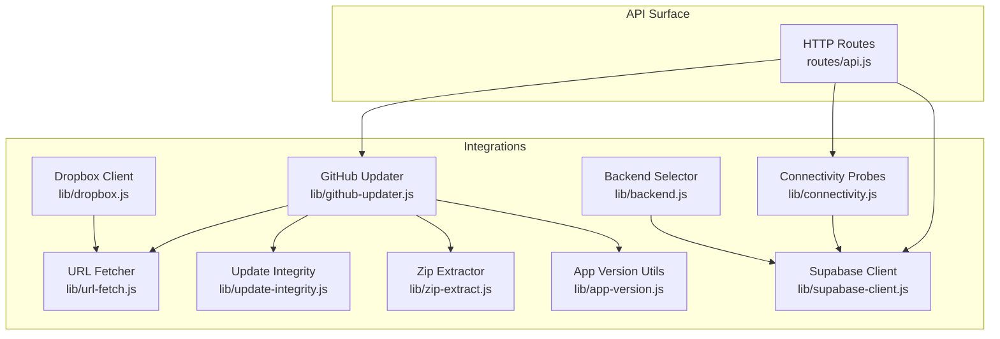
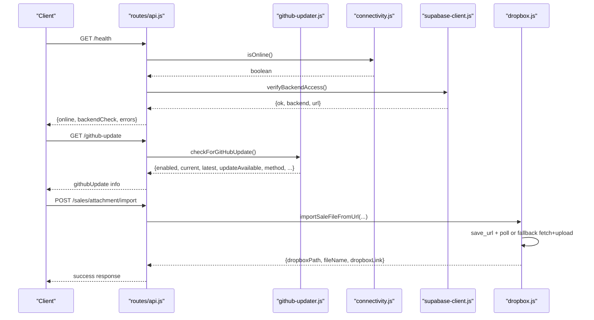
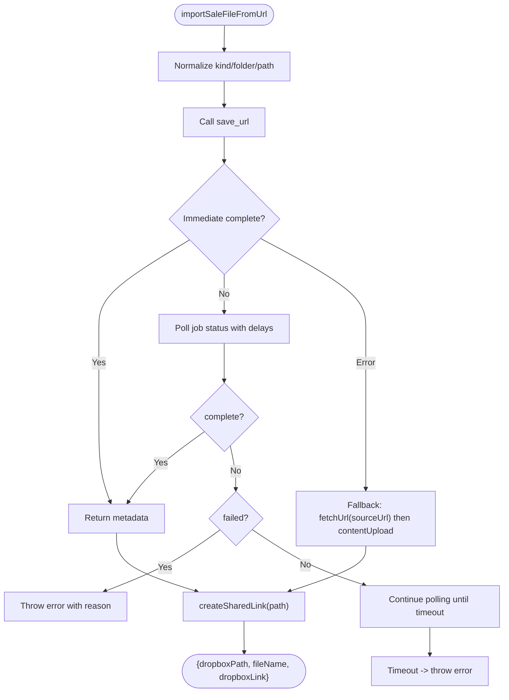
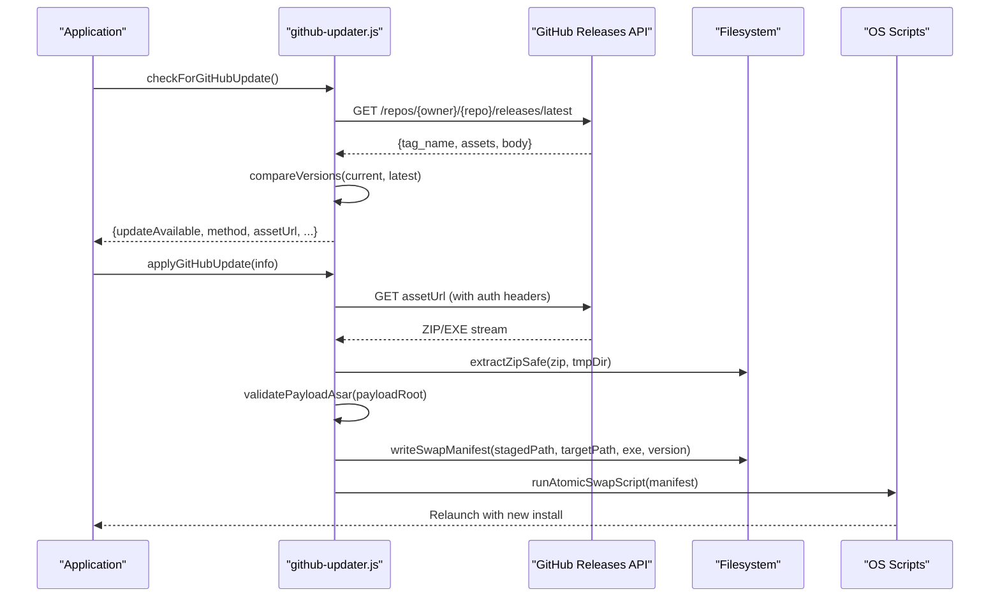
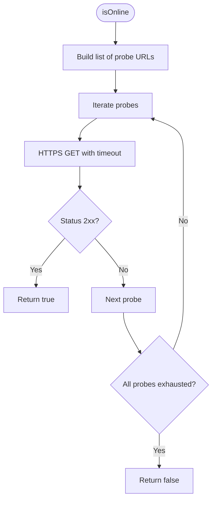
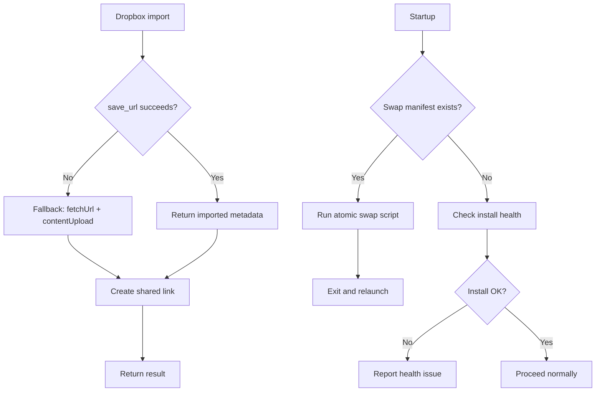
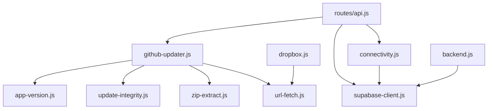

# Integration Patterns

<cite>
**Referenced Files in This Document**
- [dropbox.js](file://lib/dropbox.js)
- [github-updater.js](file://lib/github-updater.js)
- [connectivity.js](file://lib/connectivity.js)
- [network.js](file://lib/network.js)
- [url-fetch.js](file://lib/url-fetch.js)
- [update-integrity.js](file://lib/update-integrity.js)
- [zip-extract.js](file://lib/zip-extract.js)
- [app-version.js](file://lib/app-version.js)
- [supabase-client.js](file://lib/supabase-client.js)
- [backend.js](file://lib/backend.js)
- [api.js](file://routes/api.js)
</cite>

## Table of Contents
1. [Introduction](#introduction)
2. [Project Structure](#project-structure)
3. [Core Components](#core-components)
4. [Architecture Overview](#architecture-overview)
5. [Detailed Component Analysis](#detailed-component-analysis)
6. [Dependency Analysis](#dependency-analysis)
7. [Performance Considerations](#performance-considerations)
8. [Troubleshooting Guide](#troubleshooting-guide)
9. [Conclusion](#conclusion)

## Introduction
This document explains the external service integration and communication patterns used by the application, focusing on:
- Dropbox integration for file storage (authentication, upload/download, shared links, error handling)
- Network connectivity monitoring and offline detection
- GitHub-based automatic updates (version checking, download verification, rollback via atomic swap)
- Transport layer abstractions and resilience patterns (timeouts, redirects, integrity checks)
- Rate limiting, timeout handling, logging strategies, fallback mechanisms, and graceful degradation when external services are unavailable

The goal is to provide both a high-level understanding and code-level traceability so that developers can extend or troubleshoot integrations confidently.

## Project Structure
External integrations are implemented as modular libraries under lib/, with thin HTTP routes exposing update and health endpoints. Key modules:
- Dropbox client for sales recordings and attachments
- GitHub updater for automatic application updates
- Connectivity probes and backend verification
- URL fetcher with redirect and timeout handling
- Update integrity validation and safe zip extraction
- Version comparison utilities
- Supabase client configuration and access helpers
- API routes that orchestrate update checks and health diagnostics



**Diagram sources**
- [dropbox.js:1-323](file://lib/dropbox.js#L1-L323)
- [github-updater.js:1-752](file://lib/github-updater.js#L1-L752)
- [connectivity.js:1-78](file://lib/connectivity.js#L1-L78)
- [url-fetch.js:1-33](file://lib/url-fetch.js#L1-L33)
- [update-integrity.js:1-97](file://lib/update-integrity.js#L1-L97)
- [zip-extract.js:1-31](file://lib/zip-extract.js#L1-L31)
- [app-version.js:1-190](file://lib/app-version.js#L1-L190)
- [supabase-client.js:1-134](file://lib/supabase-client.js#L1-L134)
- [backend.js:1-29](file://lib/backend.js#L1-L29)
- [api.js:481-550](file://routes/api.js#L481-L550)

**Section sources**
- [dropbox.js:1-323](file://lib/dropbox.js#L1-L323)
- [github-updater.js:1-752](file://lib/github-updater.js#L1-L752)
- [connectivity.js:1-78](file://lib/connectivity.js#L1-L78)
- [url-fetch.js:1-33](file://lib/url-fetch.js#L1-L33)
- [update-integrity.js:1-97](file://lib/update-integrity.js#L1-L97)
- [zip-extract.js:1-31](file://lib/zip-extract.js#L1-L31)
- [app-version.js:1-190](file://lib/app-version.js#L1-L190)
- [supabase-client.js:1-134](file://lib/supabase-client.js#L1-L134)
- [backend.js:1-29](file://lib/backend.js#L1-L29)
- [api.js:481-550](file://routes/api.js#L481-L550)

## Core Components
- Dropbox client: Provides authentication via bearer token, content upload/download, shared link management, remote import from URL, and file existence confirmation. Includes scope-aware error hints and async job polling for save_url operations.
- GitHub updater: Detects install type, compares versions, selects platform-specific assets, downloads packages, validates payloads, stages updates, and performs atomic swaps with rollback support.
- Connectivity: Probes network reachability and verifies backend availability; exposes online/offline status and backend health.
- URL fetcher: Generic HTTP(S) fetch with configurable timeouts and redirect handling.
- Update integrity: Validates ASAR headers and optional SHA-256 checksums to ensure payload correctness.
- Zip extractor: Safe extraction avoiding known pitfalls with large app.asar files.
- App version: Parses and compares semantic versions including pre-release tokens.
- Supabase client: Centralizes environment configuration and creates admin/anon/user-scoped clients.
- Backend selector: Enforces production backend (Supabase) and blocks legacy Sheets mode.

**Section sources**
- [dropbox.js:1-323](file://lib/dropbox.js#L1-L323)
- [github-updater.js:1-752](file://lib/github-updater.js#L1-L752)
- [connectivity.js:1-78](file://lib/connectivity.js#L1-L78)
- [url-fetch.js:1-33](file://lib/url-fetch.js#L1-L33)
- [update-integrity.js:1-97](file://lib/update-integrity.js#L1-L97)
- [zip-extract.js:1-31](file://lib/zip-extract.js#L1-L31)
- [app-version.js:1-190](file://lib/app-version.js#L1-L190)
- [supabase-client.js:1-134](file://lib/supabase-client.js#L1-L134)
- [backend.js:1-29](file://lib/backend.js#L1-L29)

## Architecture Overview
The system integrates with Dropbox for file storage and GitHub for updates, while using Supabase as the primary data backend. Connectivity probes determine online state and backend accessibility. The updater orchestrates version checks, asset selection, download, integrity validation, staging, and atomic swap with rollback.



**Diagram sources**
- [api.js:481-550](file://routes/api.js#L481-L550)
- [github-updater.js:227-259](file://lib/github-updater.js#L227-L259)
- [connectivity.js:19-49](file://lib/connectivity.js#L19-L49)
- [supabase-client.js:80-99](file://lib/supabase-client.js#L80-L99)
- [dropbox.js:210-230](file://lib/dropbox.js#L210-L230)

## Detailed Component Analysis

### Dropbox Integration
Responsibilities:
- Authentication via bearer token from environment variables
- Upload binary content to Dropbox
- Download binary content from Dropbox
- Create and manage shared links
- Import remote URLs into Dropbox (async save_url with polling)
- Fallback to direct fetch-and-upload if save_url fails
- Confirm file existence and ensure shared links exist

Key behaviors:
- Scope-aware error detection provides actionable guidance when permissions are missing
- Asynchronous job polling for save_url with exponential backoff-like delays
- Shared link creation attempts to reuse existing links before creating new ones
- Path normalization ensures consistent Dropbox paths



**Diagram sources**
- [dropbox.js:210-230](file://lib/dropbox.js#L210-L230)
- [dropbox.js:169-208](file://lib/dropbox.js#L169-L208)
- [dropbox.js:131-163](file://lib/dropbox.js#L131-L163)
- [url-fetch.js:4-30](file://lib/url-fetch.js#L4-L30)

Operational notes:
- Authentication requires DROPBOX_ACCESS_TOKEN; otherwise calls fail early with clear messages
- Error messages include scope hints when Dropbox reports permission issues
- Shared link creation handles already-existing links gracefully
- File path normalization avoids common mistakes with leading slashes

**Section sources**
- [dropbox.js:8-14](file://lib/dropbox.js#L8-L14)
- [dropbox.js:16-19](file://lib/dropbox.js#L16-L19)
- [dropbox.js:22-44](file://lib/dropbox.js#L22-L44)
- [dropbox.js:46-86](file://lib/dropbox.js#L46-L86)
- [dropbox.js:88-129](file://lib/dropbox.js#L88-L129)
- [dropbox.js:131-163](file://lib/dropbox.js#L131-L163)
- [dropbox.js:169-208](file://lib/dropbox.js#L169-L208)
- [dropbox.js:210-230](file://lib/dropbox.js#L210-L230)
- [dropbox.js:232-261](file://lib/dropbox.js#L232-L261)
- [dropbox.js:263-274](file://lib/dropbox.js#L263-L274)
- [dropbox.js:276-279](file://lib/dropbox.js#L276-L279)
- [dropbox.js:281-293](file://lib/dropbox.js#L281-L293)
- [dropbox.js:295-308](file://lib/dropbox.js#L295-L308)

### GitHub Update System
Responsibilities:
- Detect installation type (NSIS installer, macOS .app bundle, portable)
- Compare current app version with latest release tag
- Select appropriate asset based on platform and architecture
- Download update package with proper headers and redirects
- Validate payload integrity (ASAR header and optional SHA-256)
- Stage update safely outside the running install directory
- Perform atomic swap with backup and relaunch
- Recover interrupted swaps on startup

Key behaviors:
- Version parsing supports pre-release identifiers and numeric comparisons
- Asset selection uses regex patterns tailored to NSIS installers and full app bundles
- Payload validation prevents corrupted or incomplete updates
- Atomic swap writes a manifest and executes a platform-specific script to move staged content into place and restart the app
- Legacy deferred swap support ensures older update flows can be completed safely



**Diagram sources**
- [github-updater.js:227-259](file://lib/github-updater.js#L227-L259)
- [github-updater.js:186-225](file://lib/github-updater.js#L186-L225)
- [github-updater.js:125-152](file://lib/github-updater.js#L125-L152)
- [github-updater.js:288-307](file://lib/github-updater.js#L288-L307)
- [github-updater.js:330-343](file://lib/github-updater.js#L330-L343)
- [github-updater.js:503-549](file://lib/github-updater.js#L503-L549)
- [zip-extract.js:9-28](file://lib/zip-extract.js#L9-L28)
- [update-integrity.js:15-42](file://lib/update-integrity.js#L15-L42)

Operational notes:
- Install health checks detect missing or invalid app.asar and guide users to reinstall
- Atomic swap includes backup archiving and cleanup of manifests after successful swap
- Process names are killed silently during NSIS installer flow to avoid file locks
- Relaunch logic prefers manifest-driven swap; falls back to direct process spawn

**Section sources**
- [github-updater.js:28-40](file://lib/github-updater.js#L28-L40)
- [github-updater.js:51-68](file://lib/github-updater.js#L51-L68)
- [github-updater.js:70-75](file://lib/github-updater.js#L70-L75)
- [github-updater.js:97-123](file://lib/github-updater.js#L97-L123)
- [github-updater.js:154-176](file://lib/github-updater.js#L154-L176)
- [github-updater.js:178-184](file://lib/github-updater.js#L178-L184)
- [github-updater.js:186-225](file://lib/github-updater.js#L186-L225)
- [github-updater.js:227-259](file://lib/github-updater.js#L227-L259)
- [github-updater.js:261-286](file://lib/github-updater.js#L261-L286)
- [github-updater.js:288-307](file://lib/github-updater.js#L288-L307)
- [github-updater.js:309-320](file://lib/github-updater.js#L309-L320)
- [github-updater.js:330-343](file://lib/github-updater.js#L330-L343)
- [github-updater.js:345-347](file://lib/github-updater.js#L345-L347)
- [github-updater.js:356-391](file://lib/github-updater.js#L356-L391)
- [github-updater.js:393-410](file://lib/github-updater.js#L393-L410)
- [github-updater.js:412-420](file://lib/github-updater.js#L412-L420)
- [github-updater.js:422-457](file://lib/github-updater.js#L422-L457)
- [github-updater.js:459-492](file://lib/github-updater.js#L459-L492)
- [github-updater.js:494-501](file://lib/github-updater.js#L494-L501)
- [github-updater.js:503-549](file://lib/github-updater.js#L503-L549)
- [github-updater.js:551-600](file://lib/github-updater.js#L551-L600)
- [github-updater.js:602-638](file://lib/github-updater.js#L602-L638)
- [github-updater.js:640-650](file://lib/github-updater.js#L640-L650)
- [github-updater.js:652-664](file://lib/github-updater.js#L652-L664)
- [github-updater.js:670-700](file://lib/github-updater.js#L670-L700)
- [github-updater.js:702-713](file://lib/github-updater.js#L702-L713)
- [github-updater.js:715-733](file://lib/github-updater.js#L715-L733)

### Network Connectivity Monitoring and Offline Detection
Responsibilities:
- Probe multiple endpoints to determine online status
- Verify backend access through Supabase query with timeout protection
- Provide convenience functions to require online state or verify backend

Key behaviors:
- Uses HTTPS probes to well-known endpoints and configured Supabase URL
- Limits probe timeout to avoid blocking
- Verifies Supabase configuration and queries a small table to confirm connectivity
- Throws descriptive errors when backend is unreachable or misconfigured



**Diagram sources**
- [connectivity.js:5-17](file://lib/connectivity.js#L5-L17)
- [connectivity.js:19-29](file://lib/connectivity.js#L19-L29)

Operational notes:
- requireOnline combines network probing and backend verification, throwing detailed errors if either fails
- verifyBackendAccess enforces Supabase configuration and applies a timeout to the query

**Section sources**
- [connectivity.js:5-17](file://lib/connectivity.js#L5-L17)
- [connectivity.js:19-29](file://lib/connectivity.js#L19-L29)
- [connectivity.js:31-49](file://lib/connectivity.js#L31-L49)
- [connectivity.js:57-69](file://lib/connectivity.js#L57-L69)
- [network.js:1-3](file://lib/network.js#L1-L3)

### Transport Layer Abstractions and Resilience
Responsibilities:
- Provide generic HTTP(S) fetching with timeout and redirect handling
- Support JSON responses and streaming downloads
- Apply consistent headers and user agents for external APIs

Key behaviors:
- fetchUrl handles redirects up to a maximum depth and rejects non-2xx responses
- Timeouts are enforced at the request level to prevent hanging connections
- GitHub updater uses dedicated helper functions for JSON and binary downloads with explicit headers and redirect handling

```mermaid
classDiagram
class UrlFetcher {
+fetchUrl(url, options) Promise~{buffer, contentType, statusCode}~
}
class GithubUpdater {
+fetchJson(url, headers) Promise~object~
+downloadFile(url, dest, headers) Promise~string~
}
class UpdateIntegrity {
+validateAsarHeader(filePath) void
+validatePayloadFile(filePath, rel, expectedSha) void
}
class ZipExtractor {
+extractZipSafe(zipPath, extractDir) void
}
GithubUpdater --> UrlFetcher : "uses"
GithubUpdater --> UpdateIntegrity : "validates"
GithubUpdater --> ZipExtractor : "extracts"
```

**Diagram sources**
- [url-fetch.js:4-30](file://lib/url-fetch.js#L4-L30)
- [github-updater.js:97-123](file://lib/github-updater.js#L97-L123)
- [github-updater.js:125-152](file://lib/github-updater.js#L125-L152)
- [update-integrity.js:15-42](file://lib/update-integrity.js#L15-L42)
- [zip-extract.js:9-28](file://lib/zip-extract.js#L9-L28)

Operational notes:
- Redirect handling is bounded to avoid infinite loops
- Timeouts protect against slow or unresponsive servers
- Integrity checks guard against partial or corrupted downloads

**Section sources**
- [url-fetch.js:4-30](file://lib/url-fetch.js#L4-L30)
- [github-updater.js:97-123](file://lib/github-updater.js#L97-L123)
- [github-updater.js:125-152](file://lib/github-updater.js#L125-L152)
- [update-integrity.js:15-42](file://lib/update-integrity.js#L15-L42)
- [zip-extract.js:9-28](file://lib/zip-extract.js#L9-L28)

### Rate Limiting, Timeout Handling, and Logging Strategies
- Rate limiting: No explicit rate limiting is implemented in the examined modules. External services (Dropbox, GitHub) may enforce their own limits; callers should implement retry/backoff policies where needed.
- Timeout handling:
  - Connectivity probes use short timeouts to quickly determine online status
  - URL fetcher supports configurable timeouts per request
  - GitHub updater sets explicit timeouts for JSON requests and relies on OS scripts for long-running operations
- Logging strategies:
  - The examined modules do not include centralized logging; they rely on throwing descriptive errors and returning structured results
  - For production systems, consider adding structured logging around key operations (e.g., Dropbox uploads, GitHub updates) to capture metrics and aid troubleshooting

Recommendations:
- Add exponential backoff and jitter for retries on transient failures
- Introduce request-level metrics (latency, success rate) and error categorization
- Centralize logging with correlation IDs for cross-service tracing

[No sources needed since this section provides general guidance]

### Fallback Mechanisms and Graceful Degradation
- Dropbox import fallback: If save_url fails, the client falls back to downloading the source URL locally and uploading directly to Dropbox.
- Shared link reuse: When creating shared links, existing links are reused to avoid duplication.
- Update recovery: On startup, the updater recovers interrupted swaps and cleans up stale manifests; it also checks install health and guides users to reinstall if necessary.
- Health endpoints: The API returns combined health information including online status and backend verification, allowing clients to degrade gracefully when dependencies are unavailable.



**Diagram sources**
- [dropbox.js:210-230](file://lib/dropbox.js#L210-L230)
- [dropbox.js:131-163](file://lib/dropbox.js#L131-L163)
- [github-updater.js:670-700](file://lib/github-updater.js#L670-L700)
- [api.js:525-550](file://routes/api.js#L525-L550)

**Section sources**
- [dropbox.js:210-230](file://lib/dropbox.js#L210-L230)
- [dropbox.js:131-163](file://lib/dropbox.js#L131-L163)
- [github-updater.js:670-700](file://lib/github-updater.js#L670-L700)
- [api.js:525-550](file://routes/api.js#L525-L550)

## Dependency Analysis
The following diagram shows how core integration modules depend on each other and on external services.



**Diagram sources**
- [api.js:481-550](file://routes/api.js#L481-L550)
- [github-updater.js:1-15](file://lib/github-updater.js#L1-L15)
- [connectivity.js:1-4](file://lib/connectivity.js#L1-L4)
- [supabase-client.js:1-10](file://lib/supabase-client.js#L1-L10)
- [app-version.js:1-5](file://lib/app-version.js#L1-L5)
- [update-integrity.js:1-7](file://lib/update-integrity.js#L1-L7)
- [zip-extract.js:1-7](file://lib/zip-extract.js#L1-L7)
- [url-fetch.js:1-2](file://lib/url-fetch.js#L1-L2)
- [dropbox.js:1-6](file://lib/dropbox.js#L1-L6)
- [backend.js:1-5](file://lib/backend.js#L1-L5)

**Section sources**
- [api.js:481-550](file://routes/api.js#L481-L550)
- [github-updater.js:1-15](file://lib/github-updater.js#L1-L15)
- [connectivity.js:1-4](file://lib/connectivity.js#L1-L4)
- [supabase-client.js:1-10](file://lib/supabase-client.js#L1-L10)
- [app-version.js:1-5](file://lib/app-version.js#L1-L5)
- [update-integrity.js:1-7](file://lib/update-integrity.js#L1-L7)
- [zip-extract.js:1-7](file://lib/zip-extract.js#L1-L7)
- [url-fetch.js:1-2](file://lib/url-fetch.js#L1-L2)
- [dropbox.js:1-6](file://lib/dropbox.js#L1-L6)
- [backend.js:1-5](file://lib/backend.js#L1-L5)

## Performance Considerations
- Prefer streaming downloads for large assets (GitHub updater streams to disk)
- Validate payloads early to avoid unnecessary processing of corrupted updates
- Use minimal probes for connectivity checks to reduce latency
- Avoid redundant shared link creation by reusing existing links
- Keep timeouts reasonable to balance responsiveness and reliability

[No sources needed since this section provides general guidance]

## Troubleshooting Guide
Common issues and resolutions:
- Dropbox not configured: Ensure DROPBOX_ACCESS_TOKEN is set; verify scopes (files.content.read, files.content.write, sharing.write) and regenerate token if scopes changed
- Dropbox scope errors: The client detects missing scopes and provides guidance to enable required permissions in the Dropbox App Console
- Dropbox save_url failures: Check network access to the source URL; the client will fall back to local fetch and upload
- GitHub update disabled: Ensure GITHUB_UPDATES_REPO is configured; verify token and repo visibility
- Invalid package app.asar: The updater’s integrity checks detect corruption; reinstall via “Update now” or the latest Setup.exe
- Missing install health: The updater reports missing or invalid app.asar and suggests corrective actions
- Backend unreachable: Connectivity probes and Supabase verification return detailed errors; check internet connection and .env keys

**Section sources**
- [dropbox.js:8-14](file://lib/dropbox.js#L8-L14)
- [dropbox.js:16-19](file://lib/dropbox.js#L16-L19)
- [dropbox.js:22-44](file://lib/dropbox.js#L22-L44)
- [dropbox.js:169-208](file://lib/dropbox.js#L169-L208)
- [github-updater.js:227-259](file://lib/github-updater.js#L227-L259)
- [github-updater.js:288-307](file://lib/github-updater.js#L288-L307)
- [github-updater.js:602-638](file://lib/github-updater.js#L602-L638)
- [connectivity.js:31-49](file://lib/connectivity.js#L31-L49)
- [connectivity.js:57-69](file://lib/connectivity.js#L57-L69)

## Conclusion
The application implements robust integration patterns for Dropbox and GitHub, with strong emphasis on integrity validation, atomic updates, and graceful degradation. Connectivity probes and health endpoints provide clear signals about external dependency status. While explicit rate limiting and centralized logging are not present in the analyzed modules, the design allows for straightforward extension with retry/backoff policies and structured logging to improve observability and resilience.

[No sources needed since this section summarizes without analyzing specific files]