# Network Connectivity & Monitoring

<cite>
**Referenced Files in This Document**
- [connectivity.js](file://lib/connectivity.js)
- [network.js](file://lib/network.js)
- [url-fetch.js](file://lib/url-fetch.js)
- [supabase-client.js](file://lib/supabase-client.js)
- [backend.js](file://lib/backend.js)
- [supabase-repo.js](file://lib/supabase-repo.js)
- [cache.js](file://lib/cache.js)
- [storage.js](file://lib/storage.js)
- [api.js](file://routes/api.js)
- [main.js](file://electron/main.js)
- [preload.js](file://electron/preload.js)
- [github-updater.js](file://lib/github-updater.js)
</cite>

## Table of Contents
1. [Introduction](#introduction)
2. [Project Structure](#project-structure)
3. [Core Components](#core-components)
4. [Architecture Overview](#architecture-overview)
5. [Detailed Component Analysis](#detailed-component-analysis)
6. [Dependency Analysis](#dependency-analysis)
7. [Performance Considerations](#performance-considerations)
8. [Troubleshooting Guide](#troubleshooting-guide)
9. [Conclusion](#conclusion)
10. [Appendices](#appendices)

## Introduction
This document explains the network connectivity monitoring and offline detection mechanisms used by the application, focusing on connection status checking, backend reachability verification, timeout handling, and resilience patterns. It also covers how the app behaves when offline using a local SQLite cache, how health endpoints expose system state, and platform-specific considerations for Electron (desktop) versus browser environments. Where applicable, we map implementation details to source files and provide diagrams to visualize flows and dependencies.

## Project Structure
The networking and connectivity features are implemented across several modules:
- Connectivity probes and online checks
- HTTP helpers with timeouts and redirects
- Supabase client configuration and session options
- Backend selection and repository layer
- Local cache for offline-first behavior
- Health endpoint exposing runtime status
- Electron main process integration and IPC bridge
- GitHub updater with its own HTTP transport

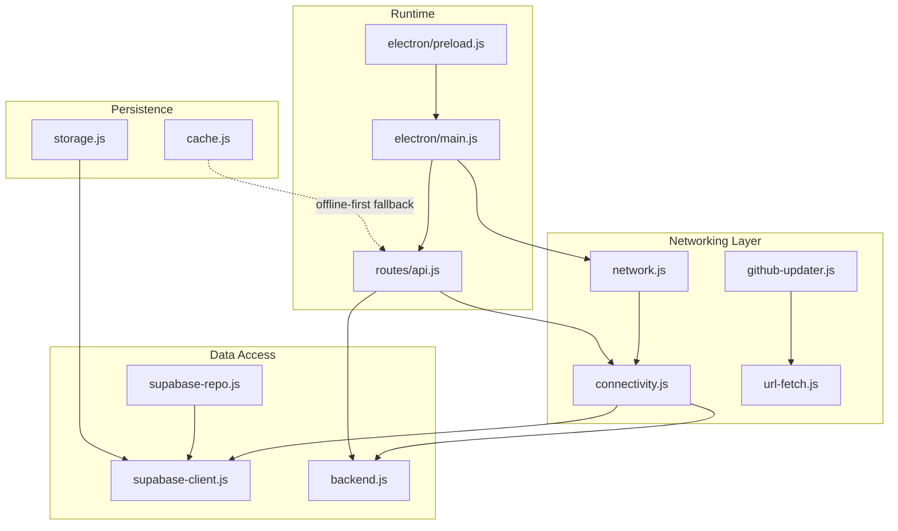

**Diagram sources**
- [connectivity.js:1-78](file://lib/connectivity.js#L1-L78)
- [network.js:1-4](file://lib/network.js#L1-L4)
- [url-fetch.js:1-33](file://lib/url-fetch.js#L1-L33)
- [supabase-client.js:1-134](file://lib/supabase-client.js#L1-L134)
- [backend.js:1-29](file://lib/backend.js#L1-L29)
- [supabase-repo.js:1-733](file://lib/supabase-repo.js#L1-L733)
- [cache.js:1-748](file://lib/cache.js#L1-L748)
- [storage.js:1-96](file://lib/storage.js#L1-L96)
- [api.js:525-550](file://routes/api.js#L525-L550)
- [main.js:1-309](file://electron/main.js#L1-L309)
- [preload.js:1-14](file://electron/preload.js#L1-L14)
- [github-updater.js:1-752](file://lib/github-updater.js#L1-L752)

**Section sources**
- [connectivity.js:1-78](file://lib/connectivity.js#L1-L78)
- [network.js:1-4](file://lib/network.js#L1-L4)
- [url-fetch.js:1-33](file://lib/url-fetch.js#L1-L33)
- [supabase-client.js:1-134](file://lib/supabase-client.js#L1-L134)
- [backend.js:1-29](file://lib/backend.js#L1-L29)
- [supabase-repo.js:1-733](file://lib/supabase-repo.js#L1-L733)
- [cache.js:1-748](file://lib/cache.js#L1-L748)
- [storage.js:1-96](file://lib/storage.js#L1-L96)
- [api.js:525-550](file://routes/api.js#L525-L550)
- [main.js:1-309](file://electron/main.js#L1-L309)
- [preload.js:1-14](file://electron/preload.js#L1-L14)
- [github-updater.js:1-752](file://lib/github-updater.js#L1-L752)

## Core Components
- Connectivity probing and online checks:
  - Probes external URLs and Supabase URL to determine if the host is reachable.
  - Verifies backend access by performing a minimal query against Supabase with an explicit timeout.
  - Provides a convenience function that enforces online availability before proceeding.
- HTTP utilities:
  - A small HTTP/HTTPS fetch helper with configurable timeouts and redirect handling.
- Supabase client configuration:
  - Centralized environment-based client creation with optional WebSocket transport for realtime.
  - Distinction between admin and anonymous clients.
- Backend abstraction:
  - Enforces use of Supabase as the active backend and prevents legacy usage.
- Data repository:
  - Implements data operations over Supabase with error mapping and table-missing fallbacks.
- Offline-first persistence:
  - Local SQLite-backed cache stores employees, attendance, bonuses, deductions, payroll splits, documents, warnings, loans, and more.
- Health endpoint:
  - Aggregates online status, cache directory presence, and backend check results into a single JSON response.
- Electron integration:
  - Main process uses online checks during session polling and exposes desktop-only capabilities via preload.
- GitHub updater:
  - Independent HTTP transport for release checks and asset downloads with timeouts and redirects.

**Section sources**
- [connectivity.js:1-78](file://lib/connectivity.js#L1-L78)
- [url-fetch.js:1-33](file://lib/url-fetch.js#L1-L33)
- [supabase-client.js:1-134](file://lib/supabase-client.js#L1-L134)
- [backend.js:1-29](file://lib/backend.js#L1-L29)
- [supabase-repo.js:1-733](file://lib/supabase-repo.js#L1-L733)
- [cache.js:1-748](file://lib/cache.js#L1-L748)
- [api.js:525-550](file://routes/api.js#L525-L550)
- [main.js:1-309](file://electron/main.js#L1-L309)
- [github-updater.js:1-752](file://lib/github-updater.js#L1-L752)

## Architecture Overview
The system combines lightweight connectivity probes, a Supabase client layer, and a local SQLite cache to ensure resilience. The Express API exposes a health endpoint that reports current connectivity and backend status. In Electron, the main process periodically polls sessions only when online and delegates file operations and update checks through IPC.

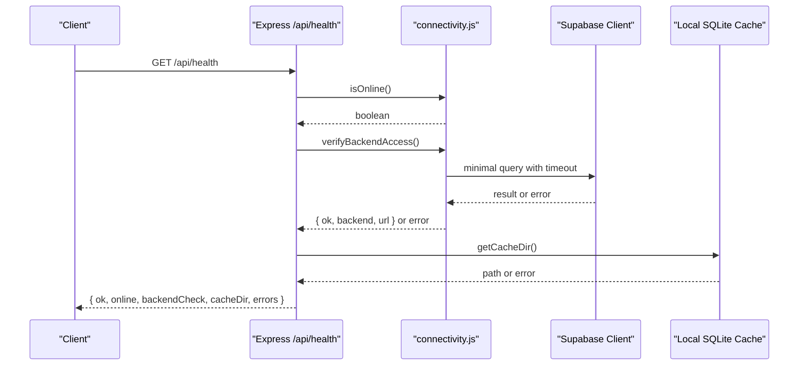

**Diagram sources**
- [api.js:525-550](file://routes/api.js#L525-L550)
- [connectivity.js:1-78](file://lib/connectivity.js#L1-L78)
- [supabase-client.js:1-134](file://lib/supabase-client.js#L1-L134)
- [cache.js:1-748](file://lib/cache.js#L1-L748)

## Detailed Component Analysis

### Connectivity Probing and Online Checks
- Probe strategy:
  - Attempts multiple endpoints including configured Supabase URL and public 204 generators.
  - Uses short timeouts to fail fast on DNS/network issues.
- Backend verification:
  - Ensures Supabase keys are configured and performs a minimal read with a longer timeout.
  - Returns structured success info or throws descriptive errors.
- Enforcement:
  - A helper requires online status and backend reachability before proceeding with sensitive operations.

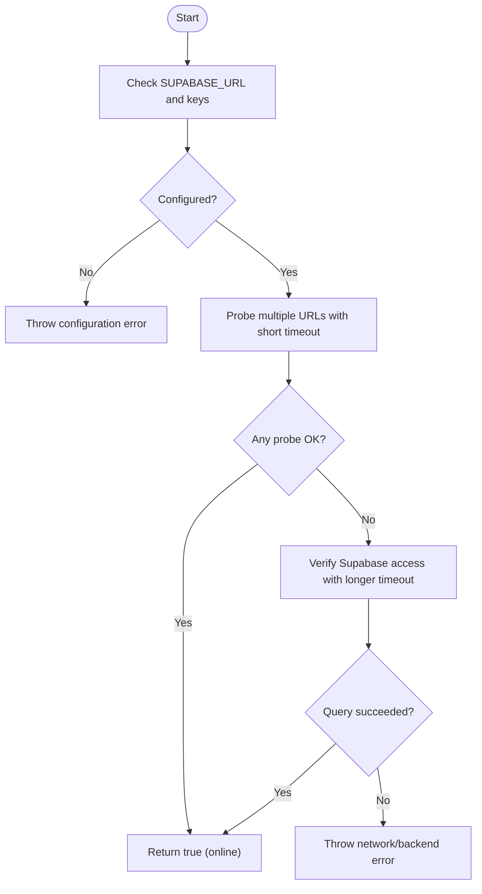

**Diagram sources**
- [connectivity.js:1-78](file://lib/connectivity.js#L1-L78)

**Section sources**
- [connectivity.js:1-78](file://lib/connectivity.js#L1-L78)

### HTTP Utilities with Timeouts and Redirects
- Features:
  - Supports both http and https based on URL scheme.
  - Configurable timeout per request.
  - Follows common redirects up to a limit; rejects non-successful status codes.
- Error handling:
  - Rejects with descriptive messages for timeouts and HTTP errors.

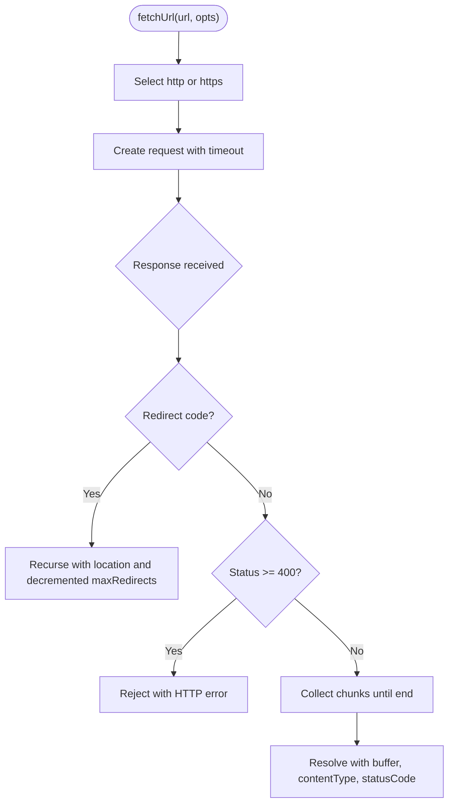

**Diagram sources**
- [url-fetch.js:1-33](file://lib/url-fetch.js#L1-L33)

**Section sources**
- [url-fetch.js:1-33](file://lib/url-fetch.js#L1-L33)

### Supabase Client Configuration and Realtime Transport
- Environment-driven configuration:
  - Reads URL and secret/publishable keys from environment variables.
  - Validates presence of required values and exposes public config.
- Client variants:
  - Admin client bypasses RLS; anonymous client applies RLS.
  - User-scoped client attaches Authorization header for JWT-based requests.
- Realtime transport:
  - Uses Node ws module if available, otherwise falls back to global WebSocket.

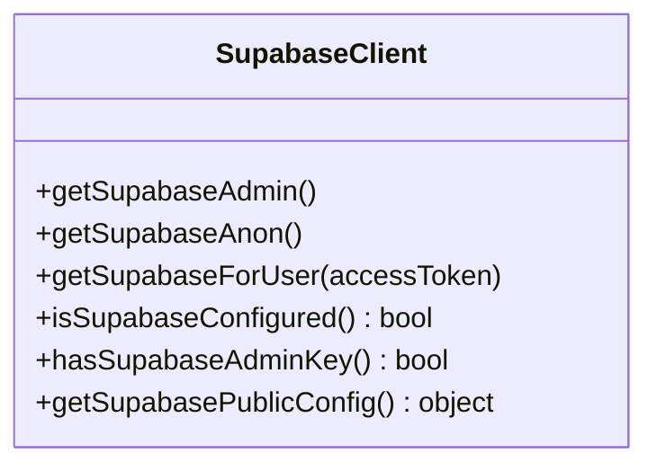

**Diagram sources**
- [supabase-client.js:1-134](file://lib/supabase-client.js#L1-L134)

**Section sources**
- [supabase-client.js:1-134](file://lib/supabase-client.js#L1-L134)

### Backend Abstraction and Repository Layer
- Backend selection:
  - Forces Supabase as the active backend and blocks legacy sheets mode.
- Repository responsibilities:
  - Maps entities to/from database rows.
  - Handles missing tables gracefully for certain queries.
  - Wraps errors with context for easier diagnostics.

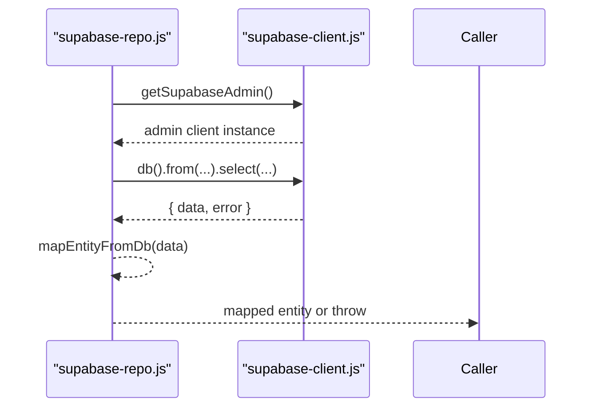

**Diagram sources**
- [backend.js:1-29](file://lib/backend.js#L1-L29)
- [supabase-repo.js:1-733](file://lib/supabase-repo.js#L1-L733)
- [supabase-client.js:1-134](file://lib/supabase-client.js#L1-L134)

**Section sources**
- [backend.js:1-29](file://lib/backend.js#L1-L29)
- [supabase-repo.js:1-733](file://lib/supabase-repo.js#L1-L733)

### Offline-First Persistence with Local SQLite Cache
- Purpose:
  - Provide immediate access to critical data when offline.
- Storage model:
  - SQLite database with WAL mode and busy timeout.
  - Tables for employees, attendance, bonuses, deductions, position rates, payroll adjustments, commission types/tiers, employee documents/warnings, loans/payments, payroll splits, and business caches.
- Warmth check:
  - Determines if cache has been populated at least once.

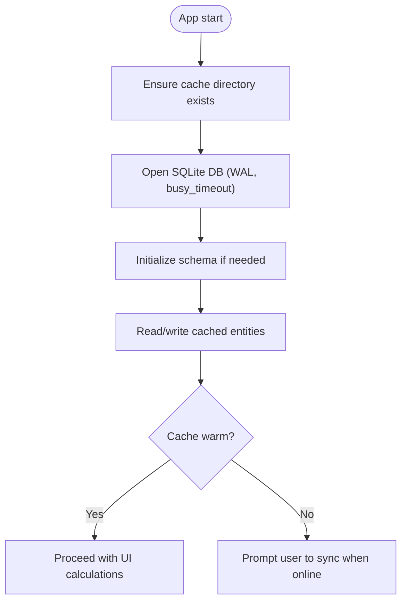

**Diagram sources**
- [cache.js:1-748](file://lib/cache.js#L1-L748)

**Section sources**
- [cache.js:1-748](file://lib/cache.js#L1-L748)

### Health Endpoint Implementation
- Behavior:
  - Reports overall health, online status, backend type, cache directory, and backend check result.
  - Returns 200 when healthy, 503 when degraded.
- Composition:
  - Combines connectivity checks and filesystem checks into a single response.

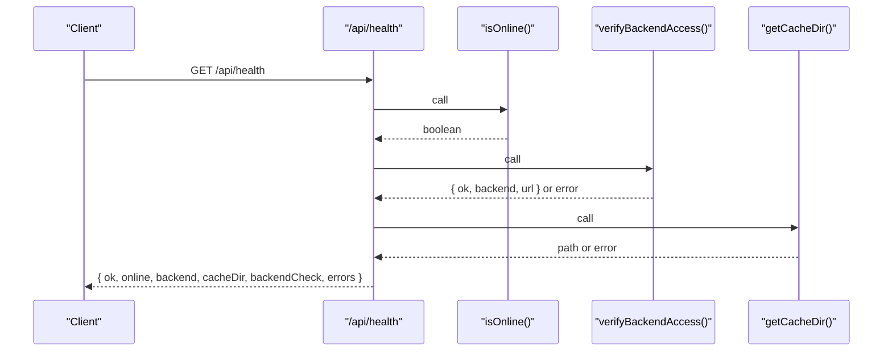

**Diagram sources**
- [api.js:525-550](file://routes/api.js#L525-L550)
- [connectivity.js:1-78](file://lib/connectivity.js#L1-L78)
- [cache.js:1-748](file://lib/cache.js#L1-L748)

**Section sources**
- [api.js:525-550](file://routes/api.js#L525-L550)

### Electron Integration and Platform-Specific Networking
- Main process:
  - Starts an internal Express server and BrowserWindow.
  - Periodically polls authentication/session state only when online.
  - Exposes IPC handlers for desktop-only tasks (folder picker, file writes, update checks).
- Preload bridge:
  - Exposes a minimal API surface to the renderer process.

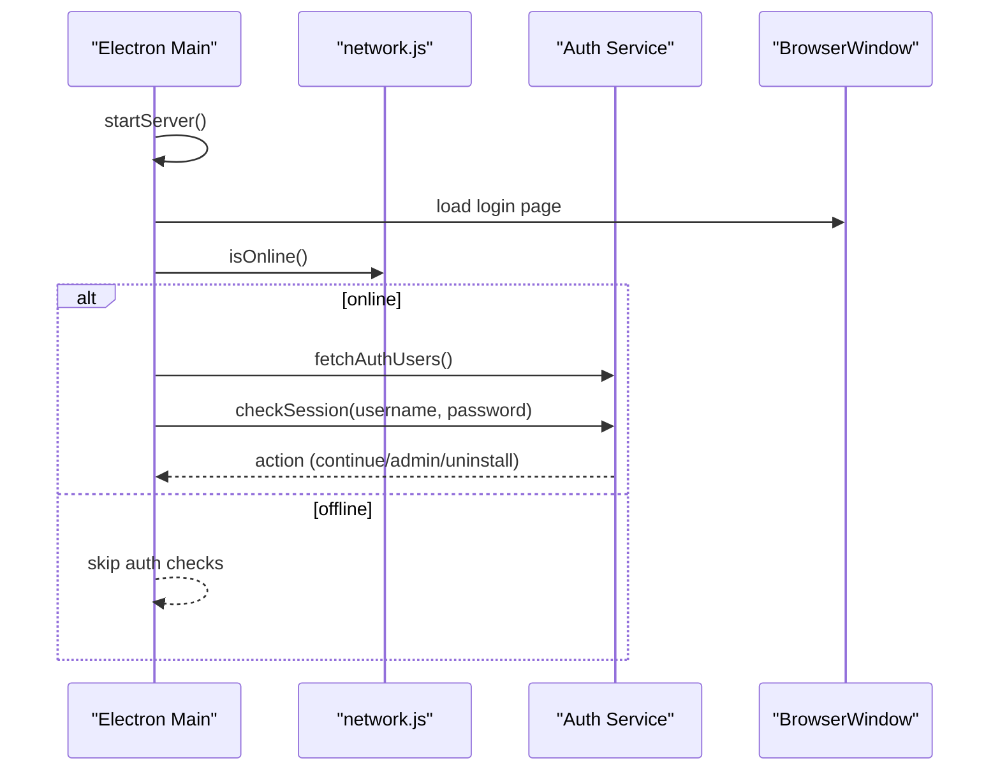

**Diagram sources**
- [main.js:1-309](file://electron/main.js#L1-L309)
- [network.js:1-4](file://lib/network.js#L1-L4)
- [preload.js:1-14](file://electron/preload.js#L1-L14)

**Section sources**
- [main.js:1-309](file://electron/main.js#L1-L309)
- [preload.js:1-14](file://electron/preload.js#L1-L14)

### GitHub Updater Networking
- Capabilities:
  - Fetches latest release metadata and downloads assets.
  - Handles redirects and timeouts explicitly.
  - Applies updates via NSIS installer or atomic swap depending on platform/installation kind.

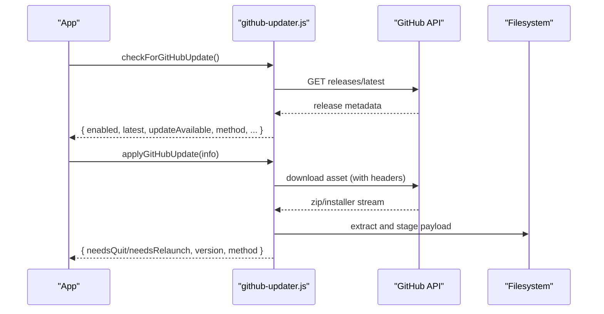

**Diagram sources**
- [github-updater.js:1-752](file://lib/github-updater.js#L1-L752)

**Section sources**
- [github-updater.js:1-752](file://lib/github-updater.js#L1-L752)

## Dependency Analysis
- Connectivity depends on:
  - Node http/https for probes.
  - Supabase client for backend verification.
- HTTP utilities are independent and reused by updater.
- Supabase client is shared by repository and storage modules.
- Health endpoint composes connectivity and cache checks.
- Electron main orchestrates online checks and IPC.

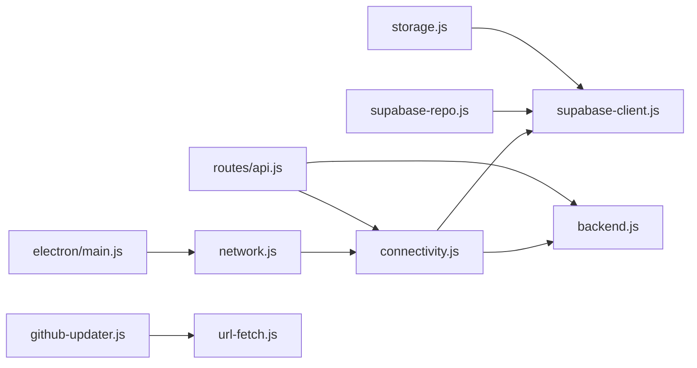

**Diagram sources**
- [connectivity.js:1-78](file://lib/connectivity.js#L1-L78)
- [network.js:1-4](file://lib/network.js#L1-L4)
- [url-fetch.js:1-33](file://lib/url-fetch.js#L1-L33)
- [supabase-client.js:1-134](file://lib/supabase-client.js#L1-L134)
- [backend.js:1-29](file://lib/backend.js#L1-L29)
- [supabase-repo.js:1-733](file://lib/supabase-repo.js#L1-L733)
- [storage.js:1-96](file://lib/storage.js#L1-L96)
- [api.js:525-550](file://routes/api.js#L525-L550)
- [main.js:1-309](file://electron/main.js#L1-L309)
- [github-updater.js:1-752](file://lib/github-updater.js#L1-L752)

**Section sources**
- [connectivity.js:1-78](file://lib/connectivity.js#L1-L78)
- [network.js:1-4](file://lib/network.js#L1-L4)
- [url-fetch.js:1-33](file://lib/url-fetch.js#L1-L33)
- [supabase-client.js:1-134](file://lib/supabase-client.js#L1-L134)
- [backend.js:1-29](file://lib/backend.js#L1-L29)
- [supabase-repo.js:1-733](file://lib/supabase-repo.js#L1-L733)
- [storage.js:1-96](file://lib/storage.js#L1-L96)
- [api.js:525-550](file://routes/api.js#L525-L550)
- [main.js:1-309](file://electron/main.js#L1-L309)
- [github-updater.js:1-752](file://lib/github-updater.js#L1-L752)

## Performance Considerations
- Timeouts:
  - Short timeouts for connectivity probes reduce perceived latency during outages.
  - Longer timeouts for backend verification avoid premature failures on slow networks.
- Redirect handling:
  - Limiting redirect depth prevents loops and excessive network calls.
- Local caching:
  - Using SQLite with WAL improves concurrency and reduces blocking under load.
- Client reuse:
  - Singleton Supabase clients minimize overhead and connection churn.

[No sources needed since this section provides general guidance]

## Troubleshooting Guide
- Common symptoms and causes:
  - Health endpoint returns 503: indicates either no internet or backend unreachable.
  - Supabase errors include context labels to pinpoint failing operations.
  - Missing-asar or invalid-asar indicates incomplete installation after update.
- Diagnostics:
  - Inspect /api/health output for online flag, backendCheck, and errors array.
  - Validate environment variables for Supabase URL and keys.
  - Confirm cache directory exists and is writable.
- Recovery steps:
  - If install health is bad, trigger update flow to reinstall the app bundle.
  - For transient network blips, retry operations after delay.

**Section sources**
- [api.js:525-550](file://routes/api.js#L525-L550)
- [supabase-repo.js:1-733](file://lib/supabase-repo.js#L1-L733)
- [github-updater.js:1-752](file://lib/github-updater.js#L1-L752)

## Conclusion
The application implements robust connectivity monitoring and offline-first behavior. Connectivity probes and backend verification provide clear signals about network state, while a comprehensive local cache ensures continuity when offline. The health endpoint centralizes observability, and Electron integration ensures platform-appropriate behavior. While advanced resilience patterns like exponential backoff and circuit breakers are not present in the analyzed modules, the existing timeouts, retries via periodic polling, and offline caching form a solid foundation for resilient operation.

[No sources needed since this section summarizes without analyzing specific files]

## Appendices

### Retry Mechanisms, Backoff, and Circuit Breakers
- Current state:
  - No explicit exponential backoff or circuit breaker implementations were found in the analyzed modules.
- Recommendations:
  - Introduce a retry wrapper with exponential backoff around network calls.
  - Implement a simple circuit breaker to temporarily halt requests after repeated failures.
  - Add jitter to backoff intervals to prevent thundering herds.

[No sources needed since this section provides general guidance]

### Request Queuing During Offline Periods and Auto-Sync on Restore
- Current state:
  - No dedicated request queue was identified in the analyzed modules.
  - The app reads from the local cache when offline and can prompt users to sync later.
- Recommendations:
  - Implement an in-memory or persistent queue for write operations when offline.
  - On connectivity restoration, flush queued operations with idempotency guarantees.
  - Surface progress and conflicts to users.

[No sources needed since this section provides general guidance]

### Connection Pooling Strategies
- Current state:
  - Supabase client instances are reused; no custom pooling logic is visible.
- Recommendations:
  - For high-throughput scenarios, consider connection pooling at the HTTP level or using a library that manages pooled connections.
  - Monitor connection metrics and adjust pool sizes accordingly.

[No sources needed since this section provides general guidance]

### Monitoring Endpoints and Logging Strategies
- Monitoring:
  - /api/health aggregates connectivity and backend status.
- Logging:
  - Repository functions wrap errors with context labels for traceability.
  - Consider structured logging for network events (timeouts, retries, failures).

**Section sources**
- [api.js:525-550](file://routes/api.js#L525-L550)
- [supabase-repo.js:1-733](file://lib/supabase-repo.js#L1-L733)

### Browser vs Desktop Environment Differences
- Desktop (Electron):
  - Uses Node http/https and native modules (SQLite).
  - IPC bridge exposes file system and update capabilities.
- Browser:
  - Would rely on fetch/XHR and Web APIs; native modules unavailable.
  - Must avoid bundling secrets and restrict privileged operations.

**Section sources**
- [main.js:1-309](file://electron/main.js#L1-L309)
- [preload.js:1-14](file://electron/preload.js#L1-L14)
- [cache.js:1-748](file://lib/cache.js#L1-L748)