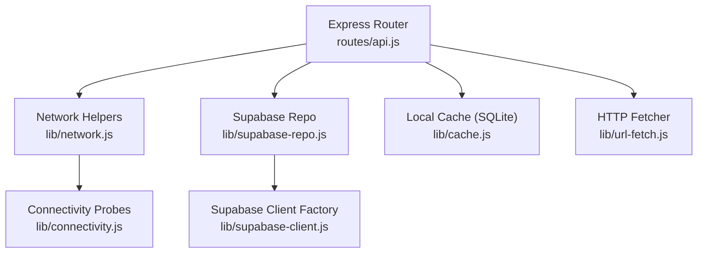
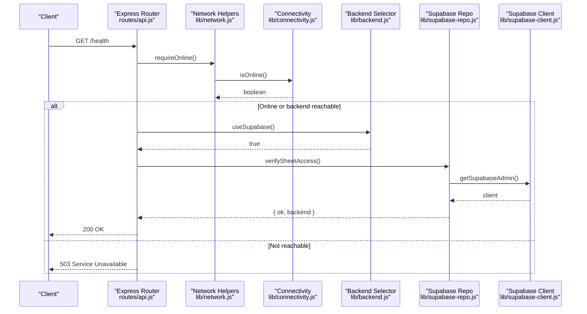
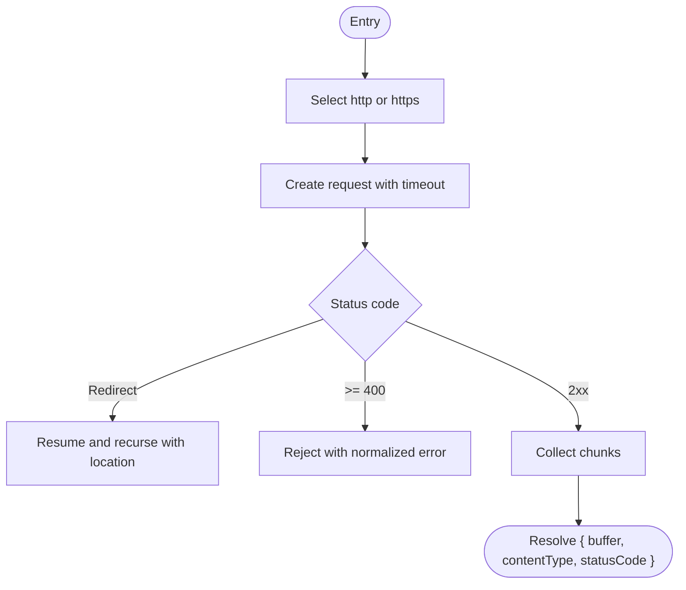
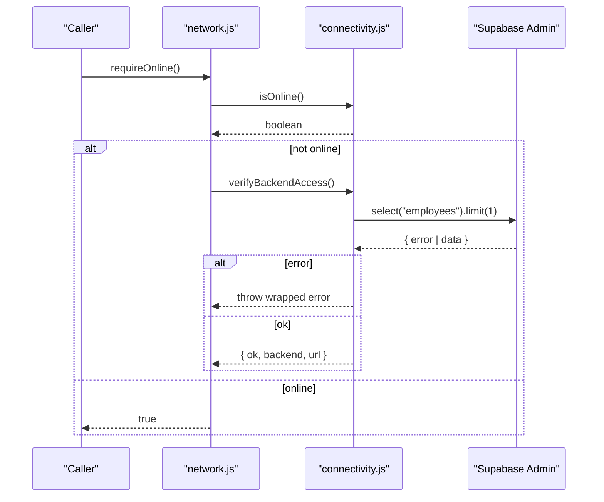
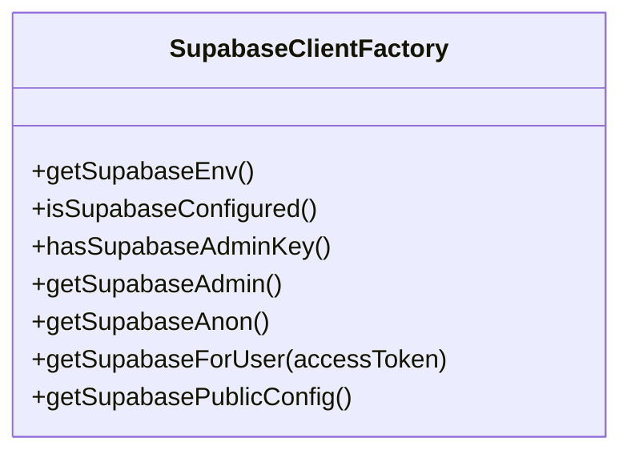
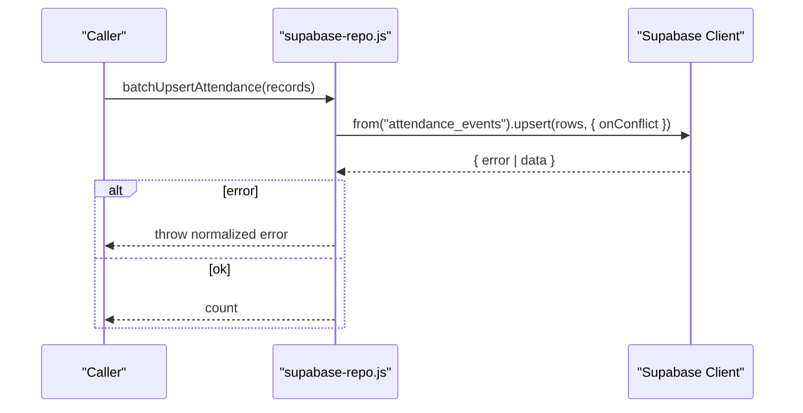
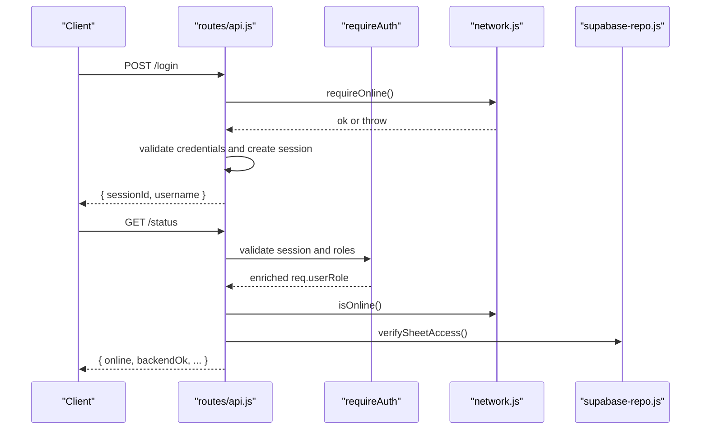
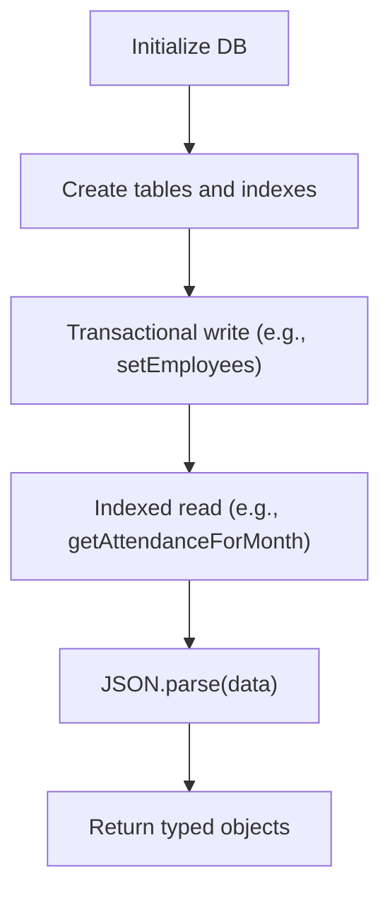
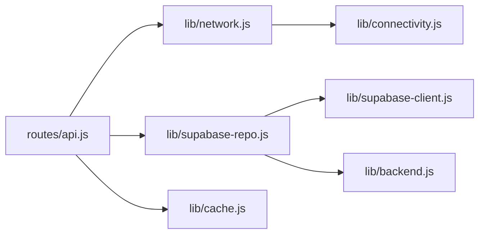

# Transport Layer Abstractions

<cite>
**Referenced Files in This Document**
- [lib/url-fetch.js](file://lib/url-fetch.js)
- [lib/connectivity.js](file://lib/connectivity.js)
- [lib/supabase-client.js](file://lib/supabase-client.js)
- [lib/backend.js](file://lib/backend.js)
- [lib/supabase-repo.js](file://lib/supabase-repo.js)
- [routes/api.js](file://routes/api.js)
- [lib/network.js](file://lib/network.js)
- [lib/cache.js](file://lib/cache.js)
</cite>

## Table of Contents
1. [Introduction](#introduction)
2. [Project Structure](#project-structure)
3. [Core Components](#core-components)
4. [Architecture Overview](#architecture-overview)
5. [Detailed Component Analysis](#detailed-component-analysis)
6. [Dependency Analysis](#dependency-analysis)
7. [Performance Considerations](#performance-considerations)
8. [Security Considerations](#security-considerations)
9. [Testing Strategies](#testing-strategies)
10. [Conclusion](#conclusion)

## Introduction
This document describes the transport layer abstractions and communication patterns used across the application. It focuses on HTTP client wrappers, error normalization, response caching strategies, middleware patterns for request interception, logging, and metrics collection, as well as serialization/deserialization utilities, content type handling, encoding/decoding mechanisms, connection management, request deduplication, batch operations, security considerations, and testing strategies. The goal is to provide a clear mental model of how outbound requests are made, how responses are handled, and how reliability and security are enforced at the transport boundary.

## Project Structure
The transport-related code spans several modules:
- Low-level HTTP fetcher with redirect handling and timeouts
- Connectivity probes and backend access verification
- Supabase client factory and configuration
- Backend selection abstraction (Supabase only)
- Data repository layer using Supabase
- Express API routes that orchestrate authentication, session checks, health checks, and business endpoints
- Network helpers re-exporting connectivity functions
- Local SQLite-backed cache for offline-first scenarios

**Diagram sources**
- [routes/api.js](file://routes/api.js)
- [lib/network.js](file://lib/network.js)
- [lib/connectivity.js](file://lib/connectivity.js)
- [lib/supabase-repo.js](file://lib/supabase-repo.js)
- [lib/supabase-client.js](file://lib/supabase-client.js)
- [lib/url-fetch.js](file://lib/url-fetch.js)
- [lib/cache.js](file://lib/cache.js)

**Section sources**
- [routes/api.js](file://routes/api.js)
- [lib/network.js](file://lib/network.js)
- [lib/connectivity.js](file://lib/connectivity.js)
- [lib/supabase-repo.js](file://lib/supabase-repo.js)
- [lib/supabase-client.js](file://lib/supabase-client.js)
- [lib/url-fetch.js](file://lib/url-fetch.js)
- [lib/cache.js](file://lib/cache.js)

## Core Components
- HTTP fetcher: A minimal wrapper around Node’s http/https modules providing timeout control, redirect following, and standardized error messages.
- Connectivity probes: Lightweight reachability checks against configurable endpoints and a Supabase query probe to validate backend access.
- Supabase client factory: Centralized creation of admin and anonymous clients with optional WebSocket transport and per-user header injection.
- Backend abstraction: Enforces use of Supabase and prevents legacy backends from being selected.
- Repository layer: Encapsulates all data operations over Supabase, normalizes errors, and provides batch upserts.
- Express router: Implements middleware for authentication, session validation, and health/status endpoints; orchestrates calls to network and repo layers.
- Local cache: SQLite-backed persistence for employees, attendance, bonuses, deductions, payroll adjustments, and more, enabling offline-first workflows.

**Section sources**
- [lib/url-fetch.js](file://lib/url-fetch.js)
- [lib/connectivity.js](file://lib/connectivity.js)
- [lib/supabase-client.js](file://lib/supabase-client.js)
- [lib/backend.js](file://lib/backend.js)
- [lib/supabase-repo.js](file://lib/supabase-repo.js)
- [routes/api.js](file://routes/api.js)
- [lib/cache.js](file://lib/cache.js)

## Architecture Overview
The system uses a layered approach:
- Presentation layer (Express router) handles HTTP requests, applies middleware, and delegates to domain logic.
- Transport layer includes a low-level HTTP fetcher and Supabase client factory.
- Data layer (repo) abstracts database interactions and normalizes errors.
- Connectivity layer performs reachability and backend verification.
- Cache layer persists critical datasets locally for resilience.

**Diagram sources**
- [routes/api.js](file://routes/api.js)
- [lib/network.js](file://lib/network.js)
- [lib/connectivity.js](file://lib/connectivity.js)
- [lib/backend.js](file://lib/backend.js)
- [lib/supabase-repo.js](file://lib/supabase-repo.js)
- [lib/supabase-client.js](file://lib/supabase-client.js)

## Detailed Component Analysis

### HTTP Client Wrapper (fetchUrl)
Responsibilities:
- Select http vs https based on URL scheme
- Apply request timeout
- Follow redirects up to a configured limit
- Normalize non-2xx status codes into errors
- Return buffer payload and content-type metadata

Error normalization:
- Timeout errors include truncated URL context
- Non-2xx responses produce an error message including HTTP status and truncated URL

Content type handling:
- Returns raw buffer and content-type string for caller to parse

Connection management:
- Uses Node’s built-in agents implicitly; no explicit keep-alive configuration here

Request deduplication and batching:
- Not implemented at this level; callers can implement if needed

**Diagram sources**
- [lib/url-fetch.js](file://lib/url-fetch.js)

**Section sources**
- [lib/url-fetch.js](file://lib/url-fetch.js)

### Connectivity Probes and Backend Access Verification
Responsibilities:
- Probe external URLs with short timeouts to determine online status
- Verify Supabase access by executing a lightweight query with a timeout guard
- Provide a convenience function that throws when neither internet nor Supabase is reachable

Error normalization:
- Wraps underlying errors with descriptive messages indicating connectivity issues

**Diagram sources**
- [lib/network.js](file://lib/network.js)
- [lib/connectivity.js](file://lib/connectivity.js)

**Section sources**
- [lib/network.js](file://lib/network.js)
- [lib/connectivity.js](file://lib/connectivity.js)

### Supabase Client Factory
Responsibilities:
- Read environment variables for URL and keys
- Build client options with optional WebSocket transport
- Provide admin client (bypasses RLS), anonymous client (RLS applies), and user-scoped client with Authorization header

Security considerations:
- Secret key usage is restricted to server-side
- Per-user tokens injected via global headers for user-scoped client

**Diagram sources**
- [lib/supabase-client.js](file://lib/supabase-client.js)

**Section sources**
- [lib/supabase-client.js](file://lib/supabase-client.js)

### Backend Selection Abstraction
Responsibilities:
- Enforce Supabase-only backend in production
- Throw when legacy Sheets backend is requested

**Section sources**
- [lib/backend.js](file://lib/backend.js)

### Repository Layer (Supabase Repo)
Responsibilities:
- Wrap Supabase queries with consistent error handling
- Map entities between DB and application models
- Provide batch upsert operations for efficiency
- Implement missing-table fallbacks where appropriate

Batch operations:
- Batch upsert attendance records with conflict resolution

Error normalization:
- Centralized helper wraps errors with operation context

**Diagram sources**
- [lib/supabase-repo.js](file://lib/supabase-repo.js)

**Section sources**
- [lib/supabase-repo.js](file://lib/supabase-repo.js)

### Express Router Middleware and Patterns
Responsibilities:
- Session-based authentication and authorization
- Impersonation support with role enforcement
- Health and status endpoints integrating connectivity and backend checks
- Version compatibility checks and update notifications

Middleware pattern:
- Authentication middleware validates sessions, resolves roles, and enriches request context

Logging and metrics:
- Basic console logging present in some repo methods; centralized logging/metrics not implemented at transport layer

**Diagram sources**
- [routes/api.js](file://routes/api.js)
- [lib/network.js](file://lib/network.js)
- [lib/supabase-repo.js](file://lib/supabase-repo.js)

**Section sources**
- [routes/api.js](file://routes/api.js)

### Local Cache Layer
Responsibilities:
- Initialize and manage a local SQLite database
- Persist employees, attendance, bonuses, deductions, payroll adjustments, commission tiers, loans, splits, documents, warnings, and business caches
- Provide transactional writes and indexed reads for performance
- Offer warm-cache detection and last-sync timestamps

Serialization and encoding:
- Stores JSON strings in TEXT columns; parses on read

Connection management:
- Single shared database instance with WAL mode and busy timeout

**Diagram sources**
- [lib/cache.js](file://lib/cache.js)

**Section sources**
- [lib/cache.js](file://lib/cache.js)

## Dependency Analysis
High-level dependencies among transport components:

**Diagram sources**
- [routes/api.js](file://routes/api.js)
- [lib/network.js](file://lib/network.js)
- [lib/connectivity.js](file://lib/connectivity.js)
- [lib/supabase-repo.js](file://lib/supabase-repo.js)
- [lib/supabase-client.js](file://lib/supabase-client.js)
- [lib/backend.js](file://lib/backend.js)

**Section sources**
- [routes/api.js](file://routes/api.js)
- [lib/network.js](file://lib/network.js)
- [lib/connectivity.js](file://lib/connectivity.js)
- [lib/supabase-repo.js](file://lib/supabase-repo.js)
- [lib/supabase-client.js](file://lib/supabase-client.js)
- [lib/backend.js](file://lib/backend.js)

## Performance Considerations
- Use batch upserts for large datasets to reduce round trips and contention.
- Prefer indexed queries in the local cache (already defined for common filters).
- Keep payloads small and avoid unnecessary fields in responses.
- Leverage offline cache for read-heavy flows to reduce network load.
- Tune timeouts according to expected latency profiles.

[No sources needed since this section provides general guidance]

## Security Considerations
- Header sanitization: Avoid echoing untrusted headers; ensure only necessary headers are forwarded.
- Payload validation: Validate and normalize inputs before persisting or forwarding.
- Secure protocols: Always prefer HTTPS; enforce TLS for database connections where applicable.
- Secrets management: Store service role keys server-side only; never expose them to the client.
- Authorization: Enforce role-based access and company scoping at the route layer.

[No sources needed since this section provides general guidance]

## Testing Strategies
- Unit tests for normalization and parsing utilities (e.g., attendance record normalization).
- Mock external dependencies:
  - Replace Supabase client with a test double for repository tests.
  - Stub connectivity probes to simulate online/offline states.
  - Mock file system and SQLite for cache tests.
- Integration tests:
  - Spin up a local SQLite cache and run CRUD operations.
  - Use a test Supabase project or mock HTTP responses for repo-level integration.
- Route-level tests:
  - Assert authentication middleware behavior and error responses.
  - Validate health and status endpoints under various connectivity conditions.

**Section sources**
- [test/attendance-validation.test.js](file://test/attendance-validation.test.js)

## Conclusion
The transport layer combines a lean HTTP fetcher, robust connectivity probing, a centralized Supabase client factory, and a repository layer with consistent error handling. The Express router enforces authentication and integrates health checks, while the local cache enables resilient offline-first workflows. To further strengthen the transport layer, consider adding centralized logging/metrics, request deduplication, and comprehensive response caching strategies tailored to each endpoint’s semantics.