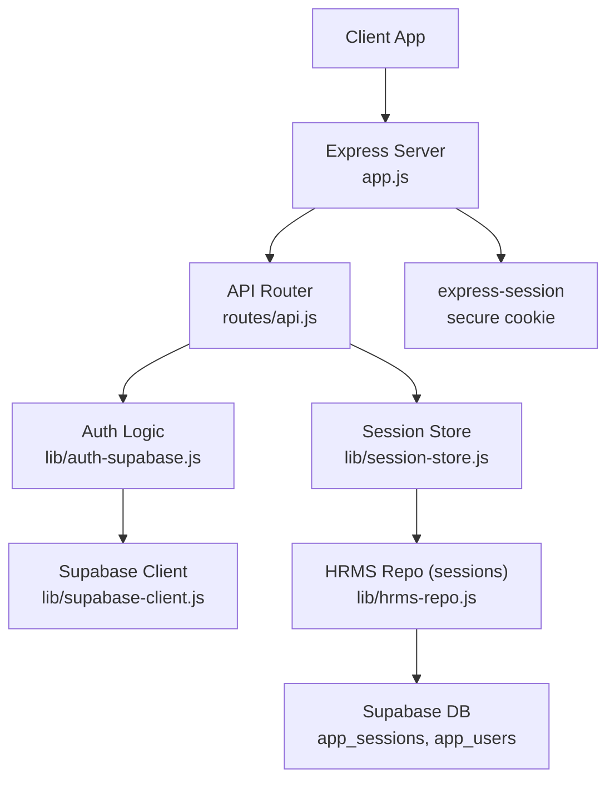
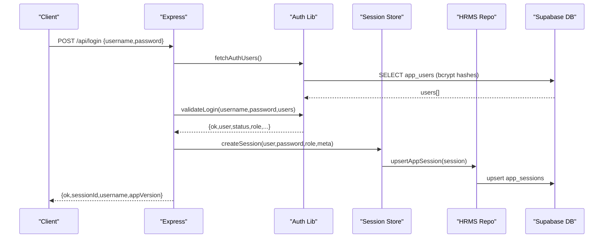
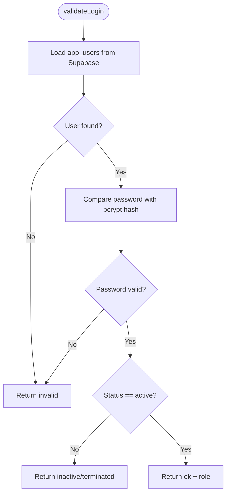
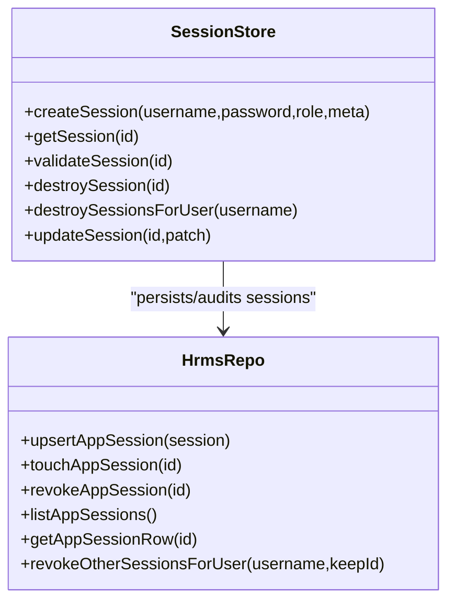
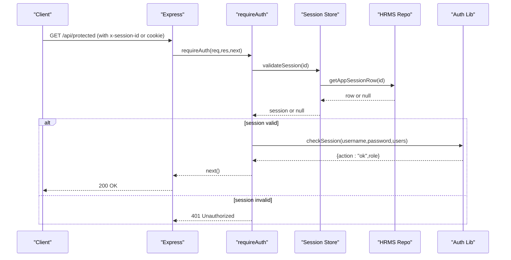
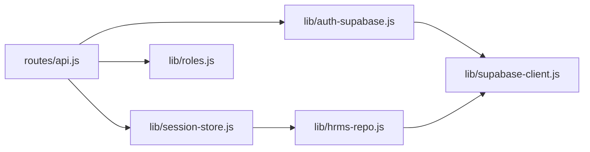

# Authentication System

<cite>
**Referenced Files in This Document**
- [app.js](file://app.js)
- [routes/api.js](file://routes/api.js)
- [lib/auth-supabase.js](file://lib/auth-supabase.js)
- [lib/session-store.js](file://lib/session-store.js)
- [lib/supabase-client.js](file://lib/supabase-client.js)
- [lib/users-admin.js](file://lib/users-admin.js)
- [lib/hrms-repo.js](file://lib/hrms-repo.js)
- [routes/auth-routes.js](file://routes/auth-routes.js)
- [supabase/migrations/20260712_org_registration.sql](file://supabase/migrations/20260712_org_registration.sql)
</cite>

## Table of Contents
1. [Introduction](#introduction)
2. [Project Structure](#project-structure)
3. [Core Components](#core-components)
4. [Architecture Overview](#architecture-overview)
5. [Detailed Component Analysis](#detailed-component-analysis)
6. [Dependency Analysis](#dependency-analysis)
7. [Performance Considerations](#performance-considerations)
8. [Troubleshooting Guide](#troubleshooting-guide)
9. [Conclusion](#conclusion)

## Introduction
This document explains the authentication system architecture, focusing on:
- Supabase-backed user management and password hashing with bcrypt
- Login validation and session lifecycle (creation, validation, expiration, concurrent control)
- Secure cookie handling via express-session
- Authentication middleware for protected routes
- Session revocation and admin controls
- Security considerations including brute-force protection, account lockout, and password policies

The system uses a custom authentication flow over Supabase’s Postgres database rather than Supabase Auth. User credentials are stored in app_users with bcrypt-hashed passwords. Sessions are managed server-side with an in-memory store and optional Supabase persistence for audit and concurrency control.

## Project Structure
Key files involved in authentication:
- Application bootstrap and session configuration
- API routes for login/logout and session checks
- Authentication logic (fetch users, validate credentials, check sessions)
- Session store (in-memory + Supabase persistence)
- Supabase client utilities
- Admin operations for user management and password updates
- HRMS repository for session persistence and revocation
- Registration-related RLS policies

**Diagram sources**
- [app.js:1-57](file://app.js#L1-L57)
- [routes/api.js:552-627](file://routes/api.js#L552-L627)
- [lib/auth-supabase.js:1-73](file://lib/auth-supabase.js#L1-L73)
- [lib/session-store.js:1-83](file://lib/session-store.js#L1-L83)
- [lib/supabase-client.js:1-134](file://lib/supabase-client.js#L1-L134)
- [lib/hrms-repo.js:870-930](file://lib/hrms-repo.js#L870-L930)

**Section sources**
- [app.js:1-57](file://app.js#L1-L57)
- [routes/api.js:552-627](file://routes/api.js#L552-L627)

## Core Components
- Authentication library: fetches users from Supabase, validates credentials using bcrypt, and supports status checks (active/inactive/terminated).
- Session store: creates secure sessions, validates them, enforces idle timeout, persists to Supabase when enabled, and supports revocation.
- API routes: implement login, logout, session-check, and admin session management endpoints.
- Supabase client: provides admin/anon clients and environment configuration.
- Users admin: manages user creation, updates, password hashing, and last-login tracking.
- HRMS repo: persists and audits sessions, revokes sessions, and lists active sessions.

**Section sources**
- [lib/auth-supabase.js:1-73](file://lib/auth-supabase.js#L1-L73)
- [lib/session-store.js:1-83](file://lib/session-store.js#L1-L83)
- [routes/api.js:552-697](file://routes/api.js#L552-L697)
- [lib/supabase-client.js:1-134](file://lib/supabase-client.js#L1-L134)
- [lib/users-admin.js:224-259](file://lib/users-admin.js#L224-L259)
- [lib/hrms-repo.js:870-930](file://lib/hrms-repo.js#L870-L930)

## Architecture Overview
The authentication flow is centered around:
- Login endpoint validating credentials against Supabase-stored bcrypt hashes
- Creating a server-side session with a random ID and persisting metadata
- Middleware enforcing authenticated access and validating sessions per request
- Optional Supabase persistence for session audit and concurrent session control

**Diagram sources**
- [routes/api.js:552-621](file://routes/api.js#L552-L621)
- [lib/auth-supabase.js:10-47](file://lib/auth-supabase.js#L10-L47)
- [lib/session-store.js:8-24](file://lib/session-store.js#L8-L24)
- [lib/hrms-repo.js:870-880](file://lib/hrms-repo.js#L870-L880)

## Detailed Component Analysis

### Authentication Library (Supabase + bcrypt)
Responsibilities:
- Fetch all app_users from Supabase
- Validate login by comparing provided password with bcrypt hash
- Enforce user status (active/inactive/terminated)
- Check session validity by re-verifying credentials and status

Security notes:
- Passwords are always compared using bcrypt.compare when hashed
- Status transitions can invalidate sessions immediately

**Diagram sources**
- [lib/auth-supabase.js:24-47](file://lib/auth-supabase.js#L24-L47)

**Section sources**
- [lib/auth-supabase.js:1-73](file://lib/auth-supabase.js#L1-L73)

### Session Management (In-memory + Supabase Persistence)
Responsibilities:
- Create sessions with unique IDs and metadata (deviceLabel, ip)
- Validate sessions on each request, checking Supabase for revocation and idle timeout
- Revoke sessions on logout or admin action
- Destroy all sessions for a user on password change or status deactivation

Key behaviors:
- Idle timeout: sessions older than configured threshold are revoked
- Concurrent control: only one active session per user can be enforced via revocation of others at login time
- Persistence: session rows are upserted and touched regularly; revoked_at marks expired sessions

**Diagram sources**
- [lib/session-store.js:1-83](file://lib/session-store.js#L1-L83)
- [lib/hrms-repo.js:870-930](file://lib/hrms-repo.js#L870-L930)

**Section sources**
- [lib/session-store.js:1-83](file://lib/session-store.js#L1-L83)
- [lib/hrms-repo.js:870-930](file://lib/hrms-repo.js#L870-L930)

### API Routes (Login, Logout, Session Check, Admin Controls)
Endpoints:
- POST /api/login: authenticates user, creates session, returns sessionId
- POST /api/logout: destroys current session and Express session
- GET /api/session-check: validates session, rechecks user status and role, returns enriched payload
- GET /api/admin/users/* and /api/auth-routes/*: admin operations for user/password changes and session management

Protected route enforcement:
- requireAuth middleware extracts session id from header or cookie, validates it, enriches userRole, and denies access if revoked or unauthorized

**Diagram sources**
- [routes/api.js:90-145](file://routes/api.js#L90-L145)
- [routes/api.js:631-697](file://routes/api.js#L631-L697)
- [lib/session-store.js:30-52](file://lib/session-store.js#L30-L52)
- [lib/auth-supabase.js:49-65](file://lib/auth-supabase.js#L49-L65)

**Section sources**
- [routes/api.js:552-697](file://routes/api.js#L552-L697)
- [routes/auth-routes.js:11-61](file://routes/auth-routes.js#L11-L61)

### Secure Cookie Handling and Session Expiration
- express-session configures cookies with httpOnly and maxAge for automatic expiration
- The application also enforces server-side idle timeout via session validation and revokes sessions in Supabase when exceeded

Configuration highlights:
- Cookie maxAge set to 24 hours
- httpOnly enabled to mitigate XSS exposure
- resave=false and saveUninitialized=false to reduce unnecessary writes

**Section sources**
- [app.js:12-19](file://app.js#L12-L19)
- [lib/session-store.js:30-52](file://lib/session-store.js#L30-L52)

### Token Validation and Protected Route Implementation
- Protected routes use requireAuth middleware to ensure a valid session exists
- Session validation includes checking Supabase for revocation and idle timeout
- After validation, req.userRole is enriched with permissions and context before proceeding

Example pattern:
- Any route under router.use(requireAuth) is protected
- Session id can be passed via x-session-id header or cookie

**Section sources**
- [routes/api.js:90-145](file://routes/api.js#L90-L145)

### Error Handling Patterns
- Login errors return specific statuses: 400 for missing fields, 401 for invalid credentials, 403 for inactive/terminated accounts
- Session revocation returns actionable messages indicating admin intervention or version blocking
- Global error handler returns JSON with error message and 500 status when headers not sent

**Section sources**
- [routes/api.js:552-621](file://routes/api.js#L552-L621)
- [routes/api.js:631-697](file://routes/api.js#L631-L697)
- [app.js:36-41](file://app.js#L36-L41)

### Security Considerations
Brute force protection:
- No explicit rate limiting or lockout mechanism is implemented in the analyzed code. Consider adding request throttling and account lockout after repeated failures.

Account lockout mechanisms:
- Not present. Implement counters and temporary locks based on failed attempts.

Secure password policies:
- Minimum length enforced during user creation and password updates (at least 4 characters)
- Passwords are hashed with bcrypt before storage
- Current password verification required for self-service password changes

Concurrent session control:
- On successful login, other sessions for the same user can be revoked to enforce single-session policy
- Sessions can be revoked by admins or automatically due to idle timeout

Data protection:
- Cookies are httpOnly
- Supabase admin client bypasses RLS; ensure secrets are kept server-side only

**Section sources**
- [lib/users-admin.js:224-259](file://lib/users-admin.js#L224-L259)
- [lib/users-admin.js:261-337](file://lib/users-admin.js#L261-L337)
- [lib/session-store.js:8-24](file://lib/session-store.js#L8-L24)
- [lib/hrms-repo.js:921-930](file://lib/hrms-repo.js#L921-L930)
- [app.js:12-19](file://app.js#L12-L19)

## Dependency Analysis
Authentication components depend on:
- Supabase client for admin queries and session persistence
- HRMS repo for session CRUD operations
- Roles and permissions modules for access control decisions
- express-session for cookie-based session transport

**Diagram sources**
- [lib/auth-supabase.js:1-73](file://lib/auth-supabase.js#L1-L73)
- [lib/supabase-client.js:1-134](file://lib/supabase-client.js#L1-L134)
- [lib/session-store.js:1-83](file://lib/session-store.js#L1-L83)
- [lib/hrms-repo.js:870-930](file://lib/hrms-repo.js#L870-L930)
- [routes/api.js:90-145](file://routes/api.js#L90-L145)

**Section sources**
- [lib/auth-supabase.js:1-73](file://lib/auth-supabase.js#L1-L73)
- [lib/session-store.js:1-83](file://lib/session-store.js#L1-L83)
- [lib/hrms-repo.js:870-930](file://lib/hrms-repo.js#L870-L930)
- [routes/api.js:90-145](file://routes/api.js#L90-L145)

## Performance Considerations
- Loading all users on every login may be expensive; consider caching user list with short TTL and invalidation on user updates
- Session validation touches Supabase on each request; consider batching or reducing frequency where possible
- Idle timeout revocations should be efficient; ensure indexes exist on app_sessions columns used for filtering

[No sources needed since this section provides general guidance]

## Troubleshooting Guide
Common issues:
- “Not logged in”: Missing or invalid session id in header or cookie
- “Session expired or revoked”: Session invalidated due to idle timeout, admin revocation, or concurrent session policy
- “Access revoked. Contact Admin.”: User status changed or RBAC denied
- “Invalid username or password”: Credentials mismatch or account inactive/terminated

Diagnostic steps:
- Verify Supabase connectivity and keys
- Check app_sessions table for revoked_at and last_seen_at timestamps
- Confirm user status and role in app_users
- Review global error handler logs for stack traces

**Section sources**
- [routes/api.js:90-145](file://routes/api.js#L90-L145)
- [routes/api.js:552-621](file://routes/api.js#L552-L621)
- [lib/session-store.js:30-52](file://lib/session-store.js#L30-L52)

## Conclusion
The authentication system combines bcrypt-based credential verification with robust server-side session management and Supabase-backed persistence. It enforces access control through middleware and supports admin-driven session revocation and concurrent session control. While basic security measures like httpOnly cookies and password hashing are in place, additional protections such as rate limiting and account lockout would further harden the system against brute-force attacks.