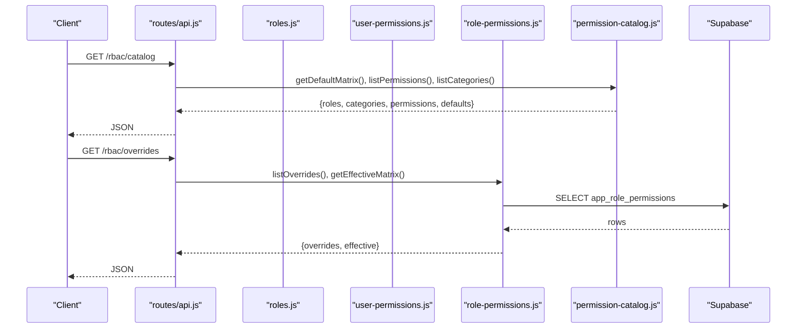
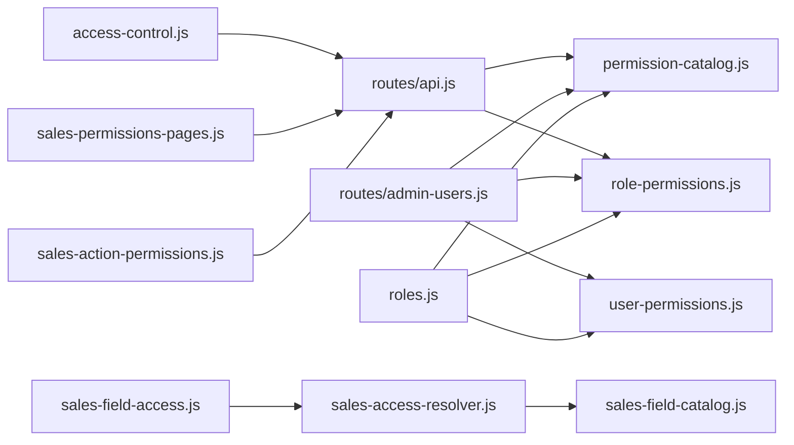
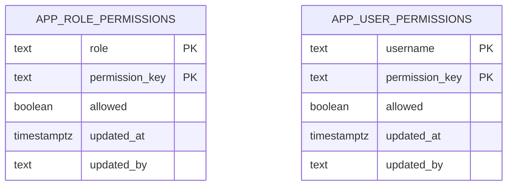

# Authorization & Permissions

<cite>
**Referenced Files in This Document**
- [permission-catalog.js](file://lib/permission-catalog.js)
- [role-permissions.js](file://lib/role-permissions.js)
- [user-permissions.js](file://lib/user-permissions.js)
- [roles.js](file://lib/roles.js)
- [sales-field-access.js](file://lib/sales-field-access.js)
- [sales-field-catalog.js](file://lib/sales-field-catalog.js)
- [sales-access-resolver.js](file://lib/sales-access-resolver.js)
- [sales-action-permissions.js](file://lib/sales-action-permissions.js)
- [access-control.js](file://public/js/access-control.js)
- [sales-permissions-pages.js](file://public/js/sales-permissions-pages.js)
- [admin-users.js](file://routes/admin-users.js)
- [api.js](file://routes/api.js)
- [20260716_app_role_permissions.sql](file://supabase/migrations/20260716_app_role_permissions.sql)
- [20260717_app_user_permissions.sql](file://supabase/migrations/20260717_app_user_permissions.sql)
</cite>

## Table of Contents
1. [Introduction](#introduction)
2. [Project Structure](#project-structure)
3. [Core Components](#core-components)
4. [Architecture Overview](#architecture-overview)
5. [Detailed Component Analysis](#detailed-component-analysis)
6. [Dependency Analysis](#dependency-analysis)
7. [Performance Considerations](#performance-considerations)
8. [Troubleshooting Guide](#troubleshooting-guide)
9. [Conclusion](#conclusion)
10. [Appendices](#appendices)

## Introduction
This document explains the role-based access control (RBAC) system, including:
- Permission hierarchy and role normalization
- Field-level permissions for sales forms and attachments
- The permission evaluation engine with context-aware decisions and dynamic resolution
- The permission catalog with predefined roles and custom overrides
- Practical examples for implementing checks in routes and business logic
- Relationships between users, roles, and permissions
- Performance optimization and caching strategies

## Project Structure
The RBAC system is implemented across several modules:
- Catalog and defaults: defines roles, aliases, and default permission matrices
- Overrides: DB-backed role and user permission overrides with in-memory cache
- Evaluation engine: central helpers to resolve effective permissions
- Sales field-level permissions: catalog, resolver, and enforcement
- Admin UIs: Access Control and Sales Permissions pages
- API endpoints: expose catalog, overrides, and management operations
- Database schema: tables for role and user permission overrides

```mermaid
graph TB
subgraph "Catalog & Defaults"
PC["permission-catalog.js"]
RFC["sales-field-catalog.js"]
end
subgraph "Overrides & Cache"
RP["role-permissions.js"]
UP["user-permissions.js"]
end
subgraph "Evaluation Engine"
ROLES["roles.js"]
SAR["sales-access-resolver.js"]
SFA["sales-field-access.js"]
SAP["sales-action-permissions.js"]
end
subgraph "Admin UI"
AC["access-control.js"]
SPF["sales-permissions-pages.js"]
end
subgraph "API"
API["routes/api.js"]
AU["routes/admin-users.js"]
end
subgraph "Database"
RPT["app_role_permissions"]
UPT["app_user_permissions"]
end
PC --> RP
PC --> UP
RP --> ROLES
UP --> ROLES
ROLES --> API
ROLES --> AU
RFC --> SAR
SAR --> SFA
SAP --> API
AC --> API
SPF --> API
RP --> RPT
UP --> UPT
```

**Diagram sources**
- [permission-catalog.js](file://lib/permission-catalog.js)
- [role-permissions.js](file://lib/role-permissions.js)
- [user-permissions.js](file://lib/user-permissions.js)
- [roles.js](file://lib/roles.js)
- [sales-field-catalog.js](file://lib/sales-field-catalog.js)
- [sales-access-resolver.js](file://lib/sales-access-resolver.js)
- [sales-field-access.js](file://lib/sales-field-access.js)
- [sales-action-permissions.js](file://lib/sales-action-permissions.js)
- [access-control.js](file://public/js/access-control.js)
- [sales-permissions-pages.js](file://public/js/sales-permissions-pages.js)
- [api.js](file://routes/api.js)
- [admin-users.js](file://routes/admin-users.js)
- [20260716_app_role_permissions.sql](file://supabase/migrations/20260716_app_role_permissions.sql)
- [20260717_app_user_permissions.sql](file://supabase/migrations/20260717_app_user_permissions.sql)

**Section sources**
- [permission-catalog.js](file://lib/permission-catalog.js)
- [role-permissions.js](file://lib/role-permissions.js)
- [user-permissions.js](file://lib/user-permissions.js)
- [roles.js](file://lib/roles.js)
- [sales-field-catalog.js](file://lib/sales-field-catalog.js)
- [sales-access-resolver.js](file://lib/sales-access-resolver.js)
- [sales-field-access.js](file://lib/sales-field-access.js)
- [sales-action-permissions.js](file://lib/sales-action-permissions.js)
- [access-control.js](file://public/js/access-control.js)
- [sales-permissions-pages.js](file://public/js/sales-permissions-pages.js)
- [api.js](file://routes/api.js)
- [admin-users.js](file://routes/admin-users.js)
- [20260716_app_role_permissions.sql](file://supabase/migrations/20260716_app_role_permissions.sql)
- [20260717_app_user_permissions.sql](file://supabase/migrations/20260717_app_user_permissions.sql)

## Core Components
- Permission catalog: Defines roles, aliases, categories, and a default matrix mapping each role to boolean permissions. It also exposes listing utilities and category grouping.
- Role overrides: Loads role-to-permission overrides from the database into an in-memory map with TTL-based caching. Provides sync and async checks.
- User overrides: Per-user exception overrides that short-circuit role-based decisions when present.
- Roles engine: Central helper perm() that first checks user overrides, then role overrides, then falls back to catalog defaults via legacy functions. Exposes many domain-specific can* helpers.
- Sales field-level permissions: A catalog of fields and surfaces (main, quality), a resolver that computes view/edit per surface, and enforcement utilities to sanitize input and redact output.
- Sales action permissions: Configurable actions like approve/deny/callback with role allowlists.
- Admin UIs: Access Control page for role overrides; Sales Permissions page for field, attachment, and action permissions.
- API endpoints: Serve catalog, overrides, effective matrix, and mutation endpoints for admin operations.
- Database schema: Tables for app_role_permissions and app_user_permissions with RLS deny-all policies.

**Section sources**
- [permission-catalog.js](file://lib/permission-catalog.js)
- [role-permissions.js](file://lib/role-permissions.js)
- [user-permissions.js](file://lib/user-permissions.js)
- [roles.js](file://lib/roles.js)
- [sales-field-catalog.js](file://lib/sales-field-catalog.js)
- [sales-access-resolver.js](file://lib/sales-access-resolver.js)
- [sales-field-access.js](file://lib/sales-field-access.js)
- [sales-action-permissions.js](file://lib/sales-action-permissions.js)
- [access-control.js](file://public/js/access-control.js)
- [sales-permissions-pages.js](file://public/js/sales-permissions-pages.js)
- [api.js](file://routes/api.js)
- [admin-users.js](file://routes/admin-users.js)
- [20260716_app_role_permissions.sql](file://supabase/migrations/20260716_app_role_permissions.sql)
- [20260717_app_user_permissions.sql](file://supabase/migrations/20260717_app_user_permissions.sql)

## Architecture Overview
The permission evaluation pipeline combines three layers:
- User overrides (highest priority)
- Role overrides (second priority)
- Catalog defaults (fallback)

For sales data, field-level permissions are enforced by a resolver that considers surface (main vs quality), DB overrides, and special rules for sensitive or workflow fields.



**Diagram sources**
- [api.js](file://routes/api.js)
- [roles.js](file://lib/roles.js)
- [user-permissions.js](file://lib/user-permissions.js)
- [role-permissions.js](file://lib/role-permissions.js)
- [permission-catalog.js](file://lib/permission-catalog.js)
- [20260716_app_role_permissions.sql](file://supabase/migrations/20260716_app_role_permissions.sql)

## Detailed Component Analysis

### Permission Catalog and Role Hierarchy
- Role ranks and aliases define canonical roles and normalize inputs.
- Default matrix maps each manageable role to boolean flags for all permissions.
- Categories group permissions for UI presentation.

Key behaviors:
- normalizeRole maps various strings to canonical roles.
- defaultForRole returns a full permission object for a given role and optional user context.
- listPermissions and listCategories provide metadata for admin UIs.

Practical usage patterns:
- Use permission keys directly in code via roles.js helpers.
- Render UI toggles based on catalog metadata and defaults.

**Section sources**
- [permission-catalog.js](file://lib/permission-catalog.js)

### Role Overrides and Caching
- Loads app_role_permissions into an in-memory Map keyed by normalized role and permission key.
- TTL-based cache avoids frequent DB reads; supports forced reload and invalidation.
- isAllowedSync and isAllowed evaluate override -> fallback chain.

Operational notes:
- saveOverrides upserts rows and invalidates cache.
- resetRole clears overrides for a role or specific keys.
- getEffectiveMatrix merges defaults and overrides for UI display.

**Section sources**
- [role-permissions.js](file://lib/role-permissions.js)
- [20260716_app_role_permissions.sql](file://supabase/migrations/20260716_app_role_permissions.sql)

### User Overrides (Exception Access)
- Loads app_user_permissions into an in-memory Map keyed by username and permission key.
- getOverrideSync allows immediate short-circuit before role checks.
- saveForUser replaces existing overrides for a user atomically.

Use cases:
- Temporary exceptions for specific usernames without changing their role.
- Auditable per-user adjustments persisted to DB.

**Section sources**
- [user-permissions.js](file://lib/user-permissions.js)
- [20260717_app_user_permissions.sql](file://supabase/migrations/20260717_app_user_permissions.sql)

### Roles Engine and Context-Aware Decisions
- perm(key, userRole, legacyFn) orchestrates evaluation:
  - Check user overrides first
  - Then role overrides
  - Finally catalog defaults via legacy function
- Many domain helpers delegate to perm() with sensible defaults:
  - viewPayroll, editAttendance, submitSales, workQualityTicket, manageOrgStructure, etc.
- Context enrichment attaches employeeId, unit, team, leadTeams to userRole for scoped decisions.

Example integration points:
- Route guards call roles.canManageAccessControl(req.userRole).
- Business logic calls roles.canViewEmployeeNotes(userRole) or roles.canSubmitExpense(userRole, username).

**Section sources**
- [roles.js](file://lib/roles.js)

### Sales Field-Level Permissions
- sales-field-catalog.js defines fields, sections, and default view/edit role sets.
- sales-access-resolver.js computes per-surface permissions:
  - main vs quality surfaces
  - special handling for verifier/client feedback and always-hidden fields
  - passthrough keys preserved across surfaces
- sales-field-access.js enforces:
  - sanitizeIncomingFormData to strip unauthorized fields
  - redactSaleForRole/redactSalesForRole to hide fields from responses
  - buildPayloadFromBody to construct safe payloads

Implementation pattern:
- Load permissions map once per request with TTL cache.
- For create flows, exclude workflow-only fields unless approver has status control.
- Merge quality fields selectively when rendering main view.

**Section sources**
- [sales-field-catalog.js](file://lib/sales-field-catalog.js)
- [sales-access-resolver.js](file://lib/sales-access-resolver.js)
- [sales-field-access.js](file://lib/sales-field-access.js)

### Sales Action Permissions
- sales-action-permissions.js manages actions like approve/deny/callback.
- Default actions include allowedRoles lists; DB can override.
- canPerformAction checks current role against configured allowlist.

Integration:
- Combine with Access Control gate approveSales to enforce layered authorization.

**Section sources**
- [sales-action-permissions.js](file://lib/sales-action-permissions.js)

### Admin UIs for RBAC Management
- Access Control page (public/js/access-control.js):
  - Fetches catalog and effective matrix
  - Renders role-by-permission matrix with badges (default/override/pending)
  - Saves pending changes via PUT /rbac/overrides
  - Resets role to defaults via POST /rbac/reset
- Sales Permissions page (public/js/sales-permissions-pages.js):
  - Tabs for Edit sale, Quality ticket, Attachments, Actions
  - Manages field view/edit, attachment kinds, and action allowlists
  - Seeds defaults and persists changes via dedicated endpoints

**Section sources**
- [access-control.js](file://public/js/access-control.js)
- [sales-permissions-pages.js](file://public/js/sales-permissions-pages.js)
- [api.js](file://routes/api.js)

### API Endpoints for RBAC
- GET /rbac/catalog: Returns roles, categories, permissions, and defaults.
- GET /rbac/overrides: Returns overrides and effective matrix.
- PUT /rbac/overrides: Persists role permission overrides.
- POST /rbac/reset: Resets a role’s overrides to defaults.
- Admin Users endpoints (routes/admin-users.js):
  - Manage users and per-user permission overrides
  - List defaults and overrides for a user

Authorization:
- Access Control endpoints require canManageAccessControl.
- Admin Users endpoints require canManageAppUsers.

**Section sources**
- [api.js](file://routes/api.js)
- [admin-users.js](file://routes/admin-users.js)

### Database Schema for Overrides
- app_role_permissions: role, permission_key, allowed, timestamps, updated_by
- app_user_permissions: username, permission_key, allowed, timestamps, updated_by
- Both tables have indexes and RLS deny-all policies to restrict direct client access.

**Section sources**
- [20260716_app_role_permissions.sql](file://supabase/migrations/20260716_app_role_permissions.sql)
- [20260717_app_user_permissions.sql](file://supabase/migrations/20260717_app_user_permissions.sql)

## Dependency Analysis
The following diagram shows how components depend on each other during runtime:



**Diagram sources**
- [access-control.js](file://public/js/access-control.js)
- [sales-permissions-pages.js](file://public/js/sales-permissions-pages.js)
- [api.js](file://routes/api.js)
- [role-permissions.js](file://lib/role-permissions.js)
- [user-permissions.js](file://lib/user-permissions.js)
- [permission-catalog.js](file://lib/permission-catalog.js)
- [roles.js](file://lib/roles.js)
- [sales-field-access.js](file://lib/sales-field-access.js)
- [sales-access-resolver.js](file://lib/sales-access-resolver.js)
- [sales-field-catalog.js](file://lib/sales-field-catalog.js)
- [sales-action-permissions.js](file://lib/sales-action-permissions.js)

**Section sources**
- [access-control.js](file://public/js/access-control.js)
- [sales-permissions-pages.js](file://public/js/sales-permissions-pages.js)
- [api.js](file://routes/api.js)
- [role-permissions.js](file://lib/role-permissions.js)
- [user-permissions.js](file://lib/user-permissions.js)
- [permission-catalog.js](file://lib/permission-catalog.js)
- [roles.js](file://lib/roles.js)
- [sales-field-access.js](file://lib/sales-field-access.js)
- [sales-access-resolver.js](file://lib/sales-access-resolver.js)
- [sales-field-catalog.js](file://lib/sales-field-catalog.js)
- [sales-action-permissions.js](file://lib/sales-action-permissions.js)

## Performance Considerations
- In-memory caches:
  - Role overrides: TTL 60 seconds, deduplicated load promise
  - User overrides: TTL 60 seconds, deduplicated load promise
  - Sales field permissions: TTL 60 seconds, refreshed on demand
- Avoid redundant DB calls:
  - Use isAllowedSync after initial async load
  - Batch updates via saveOverrides/saveForUser to minimize round-trips
- UI optimizations:
  - Pending state tracking prevents unnecessary saves
  - Effective matrix precomputed for fast rendering
- Recommendations:
  - Invalidate caches explicitly after mutations
  - Consider longer TTLs for read-heavy environments
  - Monitor cache hit rates and adjust TTL if needed

[No sources needed since this section provides general guidance]

## Troubleshooting Guide
Common issues and resolutions:
- Missing table errors:
  - If app_role_permissions or app_user_permissions do not exist, loaders fall back to empty overrides and continue using catalog defaults.
- RLS policy blocks:
  - Direct client access to override tables is denied; use server endpoints only.
- Stale overrides:
  - After saving changes, ensure invalidateCache/loadOverrides(true) is called; UI should refresh effective matrix.
- Unexpected denials:
  - Verify user overrides take precedence over role overrides; check both tables for conflicting entries.
- Sales field visibility:
  - Confirm surface (main vs quality) and special rules for verifier/client feedback fields; ensure permissions map includes correct roles.

**Section sources**
- [role-permissions.js](file://lib/role-permissions.js)
- [user-permissions.js](file://lib/user-permissions.js)
- [sales-access-resolver.js](file://lib/sales-access-resolver.js)
- [20260716_app_role_permissions.sql](file://supabase/migrations/20260716_app_role_permissions.sql)
- [20260717_app_user_permissions.sql](file://supabase/migrations/20260717_app_user_permissions.sql)

## Conclusion
The RBAC system provides a robust, layered authorization model:
- Clear separation between catalog defaults, role overrides, and user exceptions
- Context-aware decisions through enriched user roles and surface-specific logic
- Comprehensive admin UIs for managing permissions at multiple granularities
- Efficient caching and clear APIs for consistent behavior across the application

Adopting these patterns ensures maintainable, auditable, and performant access control across the platform.

[No sources needed since this section summarizes without analyzing specific files]

## Appendices

### Implementing Permission Checks in Routes and Business Logic
- Route-level guard example path:
  - [assertAccessControlAdmin:845-851](file://routes/api.js#L845-L851)
- Business logic helpers:
  - [canManageEmployees:485-487](file://lib/roles.js#L485-L487)
  - [canViewEmployeeNotes:498-500](file://lib/roles.js#L498-L500)
  - [canSubmitSales:402-407](file://lib/roles.js#L402-L407)
  - [canWorkQualityTicket:409-414](file://lib/roles.js#L409-L414)
- Sales field sanitization:
  - [sanitizeIncomingFormData:29-44](file://lib/sales-field-access.js#L29-L44)
  - [redactSaleForRole:46-73](file://lib/sales-field-access.js#L46-L73)

**Section sources**
- [api.js](file://routes/api.js)
- [roles.js](file://lib/roles.js)
- [sales-field-access.js](file://lib/sales-field-access.js)

### Data Models Diagram


**Diagram sources**
- [20260716_app_role_permissions.sql](file://supabase/migrations/20260716_app_role_permissions.sql)
- [20260717_app_user_permissions.sql](file://supabase/migrations/20260717_app_user_permissions.sql)