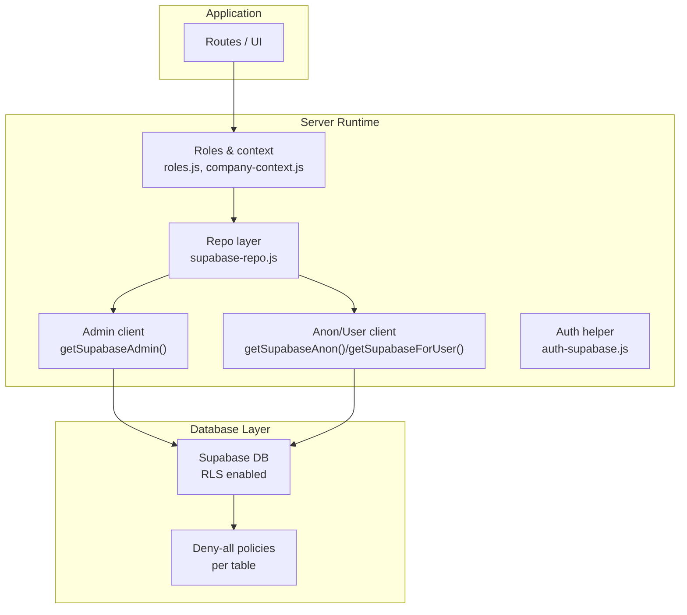
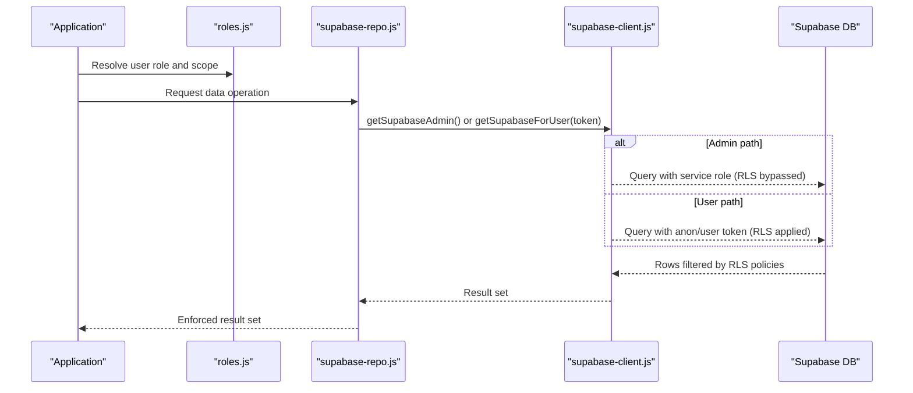
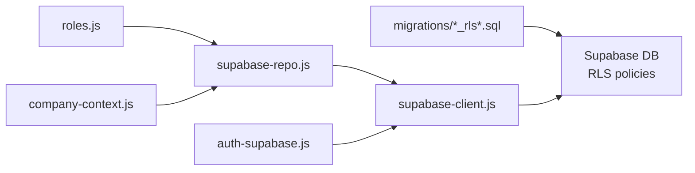

# Data Security & Row Level Security

<cite>
**Referenced Files in This Document**
- [20260702_rls_deny_all.sql](file://supabase/migrations/20260702_rls_deny_all.sql)
- [20260702_sales_bonus_costs.sql](file://supabase/migrations/20260702_sales_bonus_costs.sql)
- [20260711_v112_clients_breaks.sql](file://supabase/migrations/20260711_v112_clients_breaks.sql)
- [20260715_rbac_payslip_grants.sql](file://supabase/migrations/20260715_rbac_payslip_grants.sql)
- [20260716_app_role_permissions.sql](file://supabase/migrations/20260716_app_role_permissions.sql)
- [20260723_v129_multi_feature_sprint.sql](file://supabase/migrations/20260723_v129_multi_feature_sprint.sql)
- [supabase-client.js](file://lib/supabase-client.js)
- [supabase-repo.js](file://lib/supabase-repo.js)
- [auth-supabase.js](file://lib/auth-supabase.js)
- [roles.js](file://lib/roles.js)
- [company-context.js](file://lib/company-context.js)
</cite>

## Table of Contents
1. [Introduction](#introduction)
2. [Project Structure](#project-structure)
3. [Core Components](#core-components)
4. [Architecture Overview](#architecture-overview)
5. [Detailed Component Analysis](#detailed-component-analysis)
6. [Dependency Analysis](#dependency-analysis)
7. [Performance Considerations](#performance-considerations)
8. [Troubleshooting Guide](#troubleshooting-guide)
9. [Conclusion](#conclusion)

## Introduction
This document explains the database-level security model implemented with Supabase Row Level Security (RLS). It focuses on:
- Deny-all-by-default policy pattern across all tables
- Explicit permission grants and role-based access control
- Company-scoped data isolation for multi-tenant boundaries
- RLS policy implementation patterns for employees, attendance records, sales data, and organizational structures
- Integration between application-level permissions and database-level policies
- Performance considerations and debugging techniques for RLS policies

The system enforces a strict deny-all baseline at the database layer and relies on server-side service roles to perform privileged operations while user-facing requests are constrained by RLS policies.

## Project Structure
Security is enforced through a combination of:
- Database migrations that enable RLS and create deny-all policies
- Server-side clients that bypass or respect RLS depending on the key used
- Application logic that implements company scoping and role-based checks before issuing queries

**Diagram sources**
- [supabase-client.js:80-111](file://lib/supabase-client.js#L80-L111)
- [supabase-repo.js:1-30](file://lib/supabase-repo.js#L1-L30)
- [auth-supabase.js:1-20](file://lib/auth-supabase.js#L1-L20)
- [roles.js:1-120](file://lib/roles.js#L1-L120)
- [company-context.js:1-40](file://lib/company-context.js#L1-L40)
- [20260702_rls_deny_all.sql:1-23](file://supabase/migrations/20260702_rls_deny_all.sql#L1-L23)

**Section sources**
- [20260702_rls_deny_all.sql:1-23](file://supabase/migrations/20260702_rls_deny_all.sql#L1-L23)
- [supabase-client.js:80-111](file://lib/supabase-client.js#L80-L111)
- [supabase-repo.js:1-30](file://lib/supabase-repo.js#L1-L30)

## Core Components
- Deny-all-by-default RLS: All tables have RLS enabled and default deny policies for both anonymous and authenticated users.
- Admin vs. user clients: The server uses an admin client that bypasses RLS for internal operations; user-facing calls use anon/user clients where RLS applies.
- Role-based permissions: Application-level roles define who can view/edit what; these drive query filters and write guards.
- Company scoping: Multi-tenant boundaries are enforced via company context helpers that filter data by company/unit/team.

Key responsibilities:
- Migrations: Enable RLS and create deny-all policies per table.
- Client factory: Provide admin and user-scoped clients.
- Repo layer: Perform CRUD using admin client; apply business rules and filters.
- Roles and context: Implement authorization and tenant scoping.

**Section sources**
- [20260702_rls_deny_all.sql:1-23](file://supabase/migrations/20260702_rls_deny_all.sql#L1-L23)
- [supabase-client.js:80-111](file://lib/supabase-client.js#L80-L111)
- [supabase-repo.js:1-30](file://lib/supabase-repo.js#L1-L30)
- [roles.js:1-120](file://lib/roles.js#L1-L120)
- [company-context.js:1-40](file://lib/company-context.js#L1-L40)

## Architecture Overview
The security architecture follows a deny-all-by-default posture with explicit exceptions:
- All tables have RLS enabled and deny-all policies for anon and authenticated roles.
- Server-side operations use the admin client which bypasses RLS.
- User-facing operations must rely on RLS policies; currently, most tables remain denied unless specific policies are added later.
- Application code enforces additional constraints (roles, company scope) before issuing queries.

**Diagram sources**
- [supabase-client.js:80-111](file://lib/supabase-client.js#L80-L111)
- [supabase-repo.js:1-30](file://lib/supabase-repo.js#L1-L30)
- [20260702_rls_deny_all.sql:1-23](file://supabase/migrations/20260702_rls_deny_all.sql#L1-L23)

## Detailed Component Analysis

### Deny-all-by-default Policy Pattern
- Every table in the public schema has RLS enabled.
- Two deny policies are created per table: one for anonymous users and one for authenticated users, both denying all operations.
- New tables created in subsequent migrations also receive deny-all policies.

Implementation highlights:
- Global loop over tables enabling RLS and creating deny policies.
- Per-table deny policies for new entities such as sales, bonus/costs, org teams, and settings revisions.

Operational impact:
- Direct client access from the browser or unprivileged tokens cannot read or modify any table.
- Only server-side operations using the admin client can bypass RLS.

**Section sources**
- [20260702_rls_deny_all.sql:1-23](file://supabase/migrations/20260702_rls_deny_all.sql#L1-L23)
- [20260702_sales_bonus_costs.sql:150-181](file://supabase/migrations/20260702_sales_bonus_costs.sql#L150-L181)
- [20260711_v112_clients_breaks.sql:65-89](file://supabase/migrations/20260711_v112_clients_breaks.sql#L65-L89)
- [20260723_v129_multi_feature_sprint.sql:118-132](file://supabase/migrations/20260723_v129_multi_feature_sprint.sql#L118-L132)

### Explicit Permission Grants and RBAC Integration
- An app-wide role permissions table exists to allow runtime overrides of defaults defined in code.
- The roles module centralizes permission checks and integrates with the permissions table.
- Some features add columns to support visibility controls (e.g., payslip visibility flag).

Key elements:
- Role permissions table with deny-all policy to protect configuration.
- Roles module functions that gate access to features and data scopes.
- Feature flags like payslip visibility to agent.

**Section sources**
- [20260716_app_role_permissions.sql:1-26](file://supabase/migrations/20260716_app_role_permissions.sql#L1-L26)
- [roles.js:1-120](file://lib/roles.js#L1-L120)
- [20260715_rbac_payslip_grants.sql:1-6](file://supabase/migrations/20260715_rbac_payslip_grants.sql#L1-L6)

### Company-scoped Data Isolation (Multi-tenant Boundaries)
- Company context determines whether data belongs to “Hang-Up” or “HS-2”.
- Helpers filter employees, units, and sales based on user role and company context.
- Certain roles can manage HS-2; others see only Hang-Up data.

Behavioral rules:
- HS-2 unit filtering for non-managing roles.
- Sales visibility rules for quality vs. RTM vs. agents.
- Company context resolution depends on user role.

**Section sources**
- [company-context.js:1-117](file://lib/company-context.js#L1-L117)
- [roles.js:709-727](file://lib/roles.js#L709-L727)

### RLS Policy Implementation for Entity Types

#### Employees
- Employee management flows use the admin client to read/write employee records.
- Access to employee rows is governed by application-level role checks before querying.
- No explicit per-row RLS policies are present in the referenced files; enforcement is primarily application-scoped.

Operational notes:
- Admin client bypasses RLS; ensure all writes go through repo layer.
- Role checks restrict which employees are visible to each user.

**Section sources**
- [supabase-repo.js:22-57](file://lib/supabase-repo.js#L22-L57)
- [roles.js:198-218](file://lib/roles.js#L198-L218)

#### Attendance Records
- Attendance events are read/written via the repo layer using the admin client.
- Filters may be applied by month or employee within the repo layer.
- RLS remains deny-all; no explicit attendance-specific policies found in the referenced migrations.

Operational notes:
- Batch upserts and monthly filters are handled in the repo layer.
- Ensure sensitive fields are not exposed to user clients if future RLS policies are introduced.

**Section sources**
- [supabase-repo.js:214-237](file://lib/supabase-repo.js#L214-L237)

#### Sales Data
- Sales-related tables (sales, sales clients, attachments, permissions) have RLS enabled and deny-all policies.
- Application logic includes extensive role-based checks for viewing, editing, submitting, exporting, and approving sales.
- Temporary visibility grants exist for short-term access expansion.

Operational notes:
- Admin client performs writes; user clients would be blocked by deny-all until explicit policies are added.
- Visibility grants and field permissions are managed via dedicated tables and UI.

**Section sources**
- [20260702_sales_bonus_costs.sql:150-181](file://supabase/migrations/20260702_sales_bonus_costs.sql#L150-L181)
- [20260711_v112_clients_breaks.sql:65-89](file://supabase/migrations/20260711_v112_clients_breaks.sql#L65-L89)
- [roles.js:398-449](file://lib/roles.js#L398-L449)
- [20260715_rbac_payslip_grants.sql:4-6](file://supabase/migrations/20260715_rbac_payslip_grants.sql#L4-L6)

#### Organizational Structures
- Org teams and related tables have RLS enabled and deny-all policies.
- Management of org structure is restricted to specific roles.

Operational notes:
- Admin client required for structural changes.
- Role checks prevent unauthorized modifications.

**Section sources**
- [20260723_v129_multi_feature_sprint.sql:118-132](file://supabase/migrations/20260723_v129_multi_feature_sprint.sql#L118-L132)
- [roles.js:465-475](file://lib/roles.js#L465-L475)

### Security Context Propagation
- Auth helper reads user records and validates login status and role.
- Client factory provides user-scoped clients when a JWT is available; otherwise, anon client is used.
- Repo layer typically uses admin client; user-scoped paths should be gated by roles and company context.

Flow overview:
- Login validation returns role and status.
- Subsequent requests may carry a token to construct a user-scoped client.
- If no token is provided, anon client is used; RLS will block access due to deny-all policies.

**Section sources**
- [auth-supabase.js:10-47](file://lib/auth-supabase.js#L10-L47)
- [supabase-client.js:93-111](file://lib/supabase-client.js#L93-L111)
- [supabase-repo.js:14-20](file://lib/supabase-repo.js#L14-L20)

### Integration Between Application Permissions and Database RLS
- Application roles determine which data subsets are requested.
- Repo layer executes queries using admin client; RLS is bypassed here.
- For user-facing endpoints, if user clients are used, RLS policies must explicitly allow access; currently, deny-all blocks all direct access.

Recommendation:
- When introducing user-facing DB access, add targeted RLS policies aligned with application role checks and company context.

**Section sources**
- [supabase-client.js:80-111](file://lib/supabase-client.js#L80-L111)
- [supabase-repo.js:1-30](file://lib/supabase-repo.js#L1-L30)
- [roles.js:1-120](file://lib/roles.js#L1-L120)
- [company-context.js:1-40](file://lib/company-context.js#L1-L40)

## Dependency Analysis
The following diagram shows how components depend on each other to enforce security:

**Diagram sources**
- [20260702_rls_deny_all.sql:1-23](file://supabase/migrations/20260702_rls_deny_all.sql#L1-L23)
- [supabase-client.js:80-111](file://lib/supabase-client.js#L80-L111)
- [supabase-repo.js:1-30](file://lib/supabase-repo.js#L1-L30)
- [auth-supabase.js:1-20](file://lib/auth-supabase.js#L1-L20)
- [roles.js:1-120](file://lib/roles.js#L1-L120)
- [company-context.js:1-40](file://lib/company-context.js#L1-L40)

**Section sources**
- [supabase-client.js:80-111](file://lib/supabase-client.js#L80-L111)
- [supabase-repo.js:1-30](file://lib/supabase-repo.js#L1-L30)
- [auth-supabase.js:1-20](file://lib/auth-supabase.js#L1-L20)
- [roles.js:1-120](file://lib/roles.js#L1-L120)
- [company-context.js:1-40](file://lib/company-context.js#L1-L40)

## Performance Considerations
- Prefer admin client for server-side operations to avoid repeated RLS evaluations and complex policy joins.
- Use targeted selects and filters in the repo layer to minimize payload size.
- Avoid broad scans; leverage indexes on commonly filtered columns (e.g., year_month, employee_id, unit).
- Cache frequently accessed role and company context computations in memory where appropriate.
- When adding RLS policies later, keep expressions simple and indexed-friendly to reduce overhead.

[No sources needed since this section provides general guidance]

## Troubleshooting Guide
Common issues and diagnostics:
- Unexpected empty results: Verify whether the request uses the admin client or a user/anon client. With deny-all policies, user/anon clients will return no rows.
- Authentication failures: Check auth helper validation and user status.
- Role misconfiguration: Confirm role normalization and override behavior in the roles module.
- Company scope mismatches: Validate company context resolution and HS-2 visibility rules.

Diagnostic steps:
- Inspect client selection in the repo layer to confirm admin vs. user path.
- Review role checks around the requested operation.
- Confirm company context resolution for HS-2 vs. Hang-Up.
- Add logging around query execution to identify where access is denied.

**Section sources**
- [supabase-client.js:80-111](file://lib/supabase-client.js#L80-L111)
- [auth-supabase.js:24-65](file://lib/auth-supabase.js#L24-L65)
- [roles.js:78-128](file://lib/roles.js#L78-L128)
- [company-context.js:72-98](file://lib/company-context.js#L72-L98)

## Conclusion
The system adopts a secure-by-default posture with RLS enabled and deny-all policies across all tables. Server-side operations use an admin client to bypass RLS, while user-facing access is intentionally blocked until explicit policies are added. Application-level roles and company context provide robust scoping and guardrails. Future enhancements should introduce targeted RLS policies aligned with application permissions to support direct user access safely and efficiently.

[No sources needed since this section summarizes without analyzing specific files]