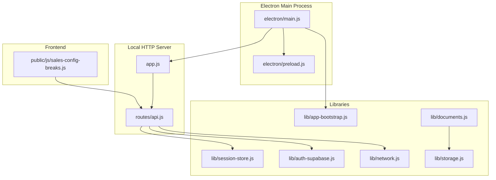
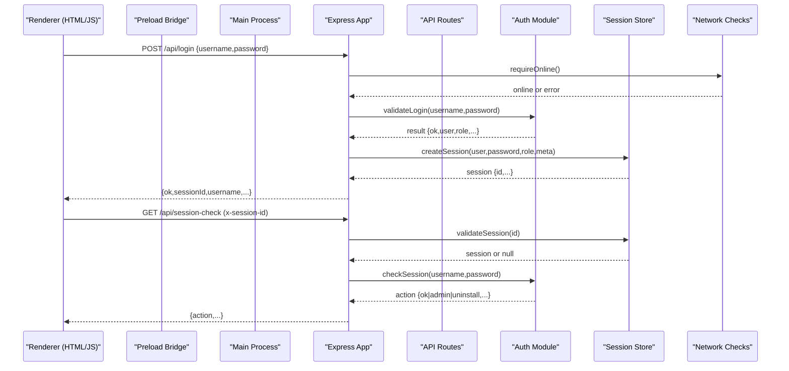
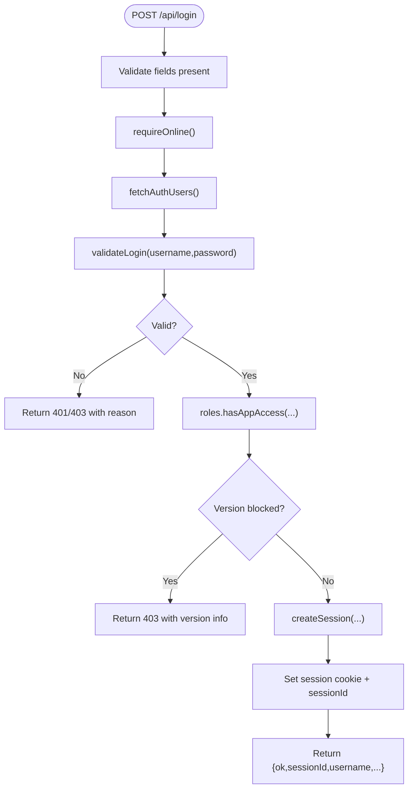
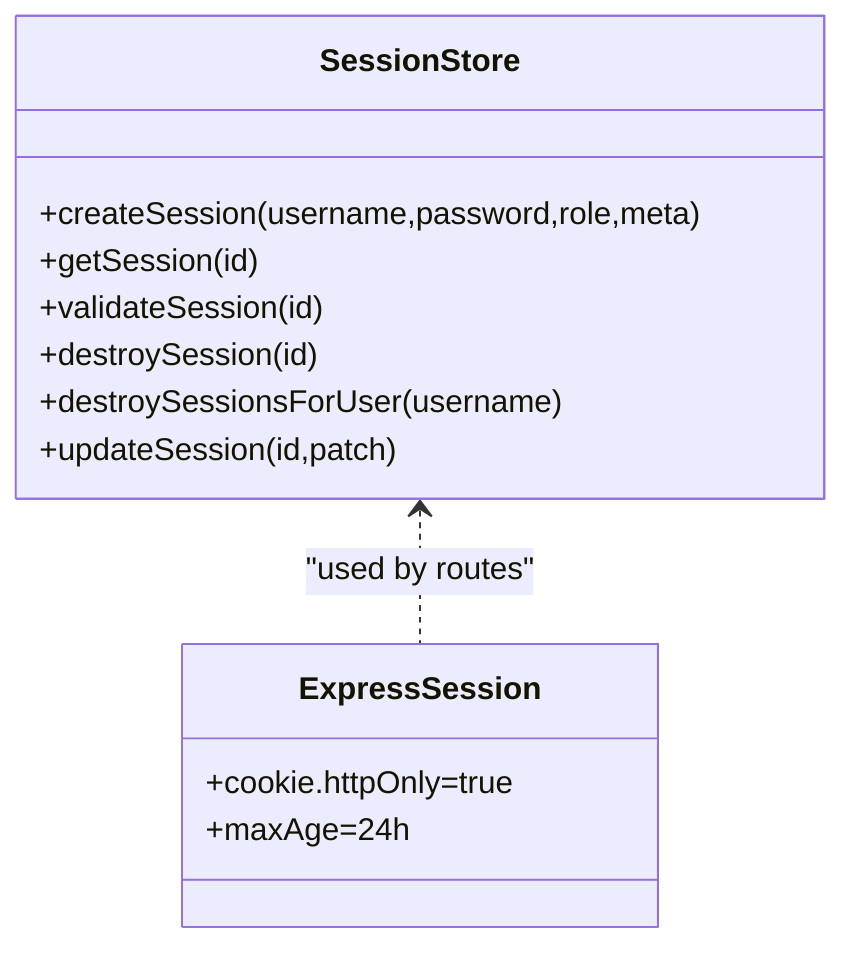
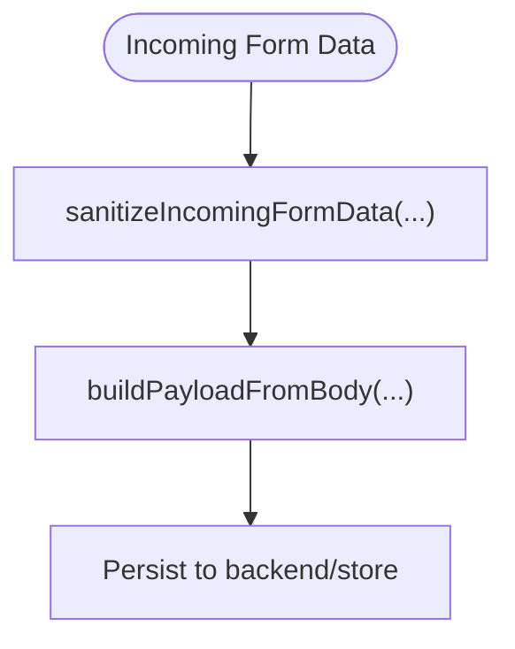
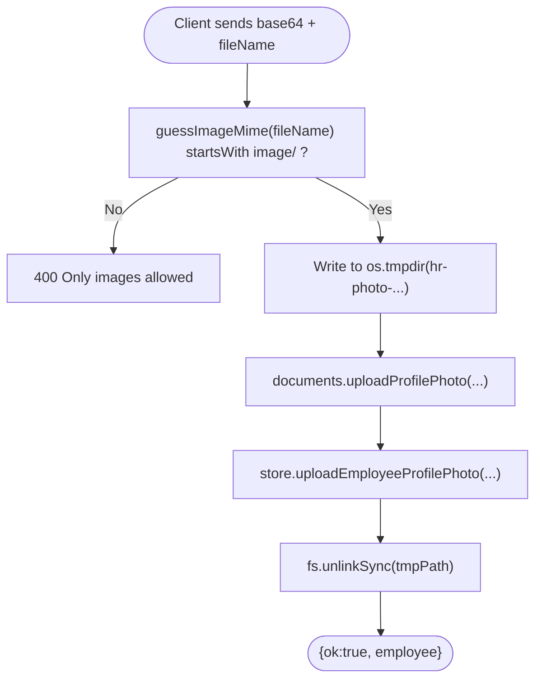
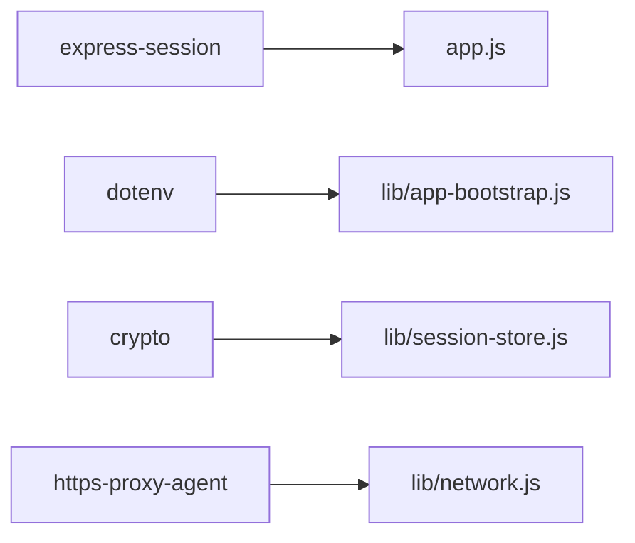

# Security Best Practices

<cite>
**Referenced Files in This Document**
- [app.js](file://app.js)
- [electron/main.js](file://electron/main.js)
- [electron/preload.js](file://electron/preload.js)
- [routes/api.js](file://routes/api.js)
- [lib/auth-supabase.js](file://lib/auth-supabase.js)
- [lib/session-store.js](file://lib/session-store.js)
- [lib/app-bootstrap.js](file://lib/app-bootstrap.js)
- [lib/documents.js](file://lib/documents.js)
- [lib/storage.js](file://lib/storage.js)
- [public/js/sales-config-breaks.js](file://public/js/sales-config-breaks.js)
- [lib/network.js](file://lib/network.js)
</cite>

## Table of Contents
1. [Introduction](#introduction)
2. [Project Structure](#project-structure)
3. [Core Components](#core-components)
4. [Architecture Overview](#architecture-overview)
5. [Detailed Component Analysis](#detailed-component-analysis)
6. [Dependency Analysis](#dependency-analysis)
7. [Performance Considerations](#performance-considerations)
8. [Troubleshooting Guide](#troubleshooting-guide)
9. [Conclusion](#conclusion)
10. [Appendices](#appendices)

## Introduction
This document consolidates security best practices and implementation patterns for the application, focusing on input validation and sanitization, CSRF protection, XSS prevention, secure file uploads, environment variable management, secret handling, secure communication protocols, HTTPS enforcement, certificate validation, secure coding guidelines, vulnerability assessment, testing approaches, and desktop-specific IPC and local storage considerations. The guidance is grounded in the current codebase to ensure practical applicability.

## Project Structure
The application is an Electron-based desktop app that runs a local Express server (bound to localhost) and serves static HTML/JS assets. Authentication and authorization are enforced via session middleware and route-level guards. File uploads are validated and persisted to remote storage with signed URLs. Environment variables are loaded from multiple locations at startup.

**Diagram sources**
- [electron/main.js:1-120](file://electron/main.js#L1-L120)
- [electron/preload.js:1-14](file://electron/preload.js#L1-L14)
- [app.js:1-57](file://app.js#L1-L57)
- [routes/api.js:1-120](file://routes/api.js#L1-L120)
- [lib/session-store.js:1-83](file://lib/session-store.js#L1-L83)
- [lib/auth-supabase.js:38-72](file://lib/auth-supabase.js#L38-L72)
- [lib/app-bootstrap.js:1-53](file://lib/app-bootstrap.js#L1-L53)
- [lib/documents.js:1-81](file://lib/documents.js#L1-L81)
- [lib/storage.js:39-95](file://lib/storage.js#L39-L95)
- [public/js/sales-config-breaks.js:488-520](file://public/js/sales-config-breaks.js#L488-L520)

**Section sources**
- [electron/main.js:1-120](file://electron/main.js#L1-L120)
- [app.js:1-57](file://app.js#L1-L57)
- [routes/api.js:1-120](file://routes/api.js#L1-L120)

## Core Components
- Localhost-only HTTP server with Express, cookie parser, JSON body parsing, and session middleware.
- Session store with in-memory cache and optional Supabase persistence, including idle timeout and revocation.
- Authentication flow using user credentials and role checks; supports hashed passwords.
- Secure file upload pipeline with type validation and temporary file handling.
- Signed URL generation for time-limited access to stored files.
- Environment loading across multiple candidate paths for both development and portable deployments.
- IPC bridge exposing minimal, purpose-bound APIs from preload to renderer.

**Section sources**
- [app.js:1-57](file://app.js#L1-L57)
- [lib/session-store.js:1-83](file://lib/session-store.js#L1-L83)
- [lib/auth-supabase.js:38-72](file://lib/auth-supabase.js#L38-L72)
- [lib/documents.js:1-81](file://lib/documents.js#L1-L81)
- [lib/storage.js:39-95](file://lib/storage.js#L39-L95)
- [lib/app-bootstrap.js:1-53](file://lib/app-bootstrap.js#L1-L53)
- [electron/preload.js:1-14](file://electron/preload.js#L1-L14)

## Architecture Overview
Security-critical flows include authentication, session validation, file uploads, and IPC interactions.

**Diagram sources**
- [routes/api.js:552-621](file://routes/api.js#L552-L621)
- [routes/api.js:631-697](file://routes/api.js#L631-L697)
- [lib/auth-supabase.js:38-72](file://lib/auth-supabase.js#L38-L72)
- [lib/session-store.js:1-83](file://lib/session-store.js#L1-L83)
- [lib/network.js:1-4](file://lib/network.js#L1-L4)

## Detailed Component Analysis

### Authentication and Authorization
- Login endpoint validates presence of username/password, enforces online requirement, verifies credentials, checks account status and role permissions, applies version policy, creates a session, and returns a session identifier.
- Session middleware requires a valid session ID from header or cookie, validates against in-memory and persistent stores, handles impersonation safely, enriches user roles, and denies access if revoked or expired.
- Password verification supports hashed passwords via bcrypt comparison when configured.

**Diagram sources**
- [routes/api.js:552-621](file://routes/api.js#L552-L621)
- [lib/auth-supabase.js:38-72](file://lib/auth-supabase.js#L38-L72)

**Section sources**
- [routes/api.js:552-621](file://routes/api.js#L552-L621)
- [routes/api.js:90-145](file://routes/api.js#L90-L145)
- [lib/auth-supabase.js:38-72](file://lib/auth-supabase.js#L38-L72)
- [lib/session-store.js:1-83](file://lib/session-store.js#L1-L83)

### Session Management
- Sessions are created with random IDs and metadata (device label, IP). They are kept in memory and optionally persisted to Supabase. Idle sessions are revoked after a threshold.
- Session validation checks revocation and last-seen timestamps, updating last seen on each validation.
- Admin endpoints allow listing and revoking sessions for administrators.

**Diagram sources**
- [lib/session-store.js:1-83](file://lib/session-store.js#L1-L83)
- [app.js:12-19](file://app.js#L12-L19)

**Section sources**
- [lib/session-store.js:1-83](file://lib/session-store.js#L1-L83)
- [app.js:12-19](file://app.js#L12-L19)
- [routes/auth-routes.js:36-59](file://routes/auth-routes.js#L36-L59)

### Input Validation and Sanitization
- Login inputs are validated for presence before processing.
- Sales form data is sanitized through a dedicated helper that builds payloads from normalized forms, reducing risk of unexpected fields.
- Frontend uses an escape function when rendering dynamic content into HTML to mitigate XSS.

**Diagram sources**
- [lib/sales-field-access.js:81-102](file://lib/sales-field-access.js#L81-L102)
- [public/js/sales.js:228-263](file://public/js/sales.js#L228-L263)

**Section sources**
- [routes/api.js:552-558](file://routes/api.js#L552-L558)
- [lib/sales-field-access.js:81-102](file://lib/sales-field-access.js#L81-L102)
- [public/js/sales.js:228-263](file://public/js/sales.js#L228-L263)

### CSRF Protection
- The application binds the Express server to localhost only and uses httpOnly cookies for sessions. Cross-site requests from external origins cannot reach the server due to binding constraints.
- For additional hardening, consider adding SameSite cookie attributes and origin checking where appropriate.

**Section sources**
- [electron/main.js:19-22](file://electron/main.js#L19-L22)
- [app.js:12-19](file://app.js#L12-L19)

### XSS Prevention
- Frontend renders dynamic values using an escape function to prevent injection into HTML contexts.
- Ensure all new templates consistently use escaping for any interpolated values.

**Section sources**
- [public/js/sales.js:228-263](file://public/js/sales.js#L228-L263)

### Secure File Upload Handling
- Profile photo uploads enforce MIME type checks based on file extension mapping and reject non-image types.
- Uploaded content is written to a temporary file in the OS temp directory, then uploaded to storage; the temp file is deleted afterward.
- Storage operations provide signed URLs with configurable TTL for sharing.

**Diagram sources**
- [routes/api.js:1775-1803](file://routes/api.js#L1775-L1803)
- [lib/documents.js:18-29](file://lib/documents.js#L18-L29)
- [lib/storage.js:39-95](file://lib/storage.js#L39-L95)

**Section sources**
- [routes/api.js:1775-1803](file://routes/api.js#L1775-L1803)
- [lib/documents.js:1-81](file://lib/documents.js#L1-L81)
- [lib/storage.js:39-95](file://lib/storage.js#L39-L95)

### Environment Variable Management and Secret Key Handling
- Environment variables are loaded from multiple candidate paths, including app root, working directory, resources path, portable executable dir, execution directory, and Electron app path.
- Session secret is read from environment with a fallback value.

Recommendations:
- Avoid default secrets in production; always supply SESSION_SECRET via environment.
- Restrict .env file permissions and avoid committing secrets.
- Use platform keychain or secure vault integrations for sensitive runtime secrets.

**Section sources**
- [lib/app-bootstrap.js:1-53](file://lib/app-bootstrap.js#L1-L53)
- [app.js:12-19](file://app.js#L12-L19)

### Secure Communication Protocols, HTTPS Enforcement, and Certificate Validation
- The Express server listens on localhost only, minimizing exposure.
- No explicit HTTPS termination is implemented in-process; consider enabling TLS at the process boundary (e.g., reverse proxy or Electron’s built-in capabilities) if external exposure is required.
- Network utilities provide online checks and backend access verification; ensure upstream services enforce TLS and validate certificates.

**Section sources**
- [electron/main.js:19-22](file://electron/main.js#L19-L22)
- [lib/network.js:1-4](file://lib/network.js#L1-L4)

### Desktop Application Security Considerations (IPC and Local Storage)
- The preload script exposes a minimal, typed API surface to the renderer via contextBridge, limiting direct Node.js access.
- IPC handlers perform specific actions such as folder selection, writing buffers to disk, session control, uninstall triggers, and update checks.
- BrowserWindow webPreferences enable contextIsolation and disable nodeIntegration, reducing attack surface.

Best practices:
- Keep the preload API minimal and purpose-bound.
- Validate all IPC parameters and sanitize file paths.
- Prefer writing to safe directories (e.g., userData) and avoid arbitrary paths.
- Implement strict allowlists for IPC channels and arguments.

**Section sources**
- [electron/preload.js:1-14](file://electron/preload.js#L1-L14)
- [electron/main.js:196-253](file://electron/main.js#L196-L253)
- [electron/main.js:78-93](file://electron/main.js#L78-L93)

### Secure Coding Practices, Vulnerability Assessment, and Testing Approaches
- Enforce input validation at boundaries (API entry points), sanitize before persistence, and escape during rendering.
- Apply least privilege to IPC methods and validate all parameters.
- Use short-lived signed URLs for file sharing and rotate secrets regularly.
- Conduct regular dependency audits and keep packages updated.
- Integrate automated tests for auth flows, session lifecycle, and file upload validations.
- Perform manual penetration testing focused on login, session hijacking, file upload bypass, and IPC misuse.

[No sources needed since this section provides general guidance]

## Dependency Analysis
Key dependencies and their security relevance:
- express-session: manages session cookies; ensure strong secret and httpOnly flags.
- dotenv: loads environment variables; restrict file access and avoid defaults in production.
- crypto: used for generating session IDs; ensure randomness and length.
- https-proxy-agent: indicates potential outbound HTTPS usage; verify certificate validation settings.

**Diagram sources**
- [app.js:1-19](file://app.js#L1-L19)
- [lib/app-bootstrap.js:1-53](file://lib/app-bootstrap.js#L1-L53)
- [lib/session-store.js:1-20](file://lib/session-store.js#L1-L20)
- [lib/network.js:1-4](file://lib/network.js#L1-L4)

**Section sources**
- [app.js:1-19](file://app.js#L1-L19)
- [lib/app-bootstrap.js:1-53](file://lib/app-bootstrap.js#L1-L53)
- [lib/session-store.js:1-20](file://lib/session-store.js#L1-L20)
- [lib/network.js:1-4](file://lib/network.js#L1-L4)

## Performance Considerations
- Session validation includes database lookups and idle checks; cache frequently accessed data where safe.
- File uploads write to temporary storage; ensure adequate disk space and cleanup.
- Signed URL creation is lightweight but should be rate-limited if exposed widely.

[No sources needed since this section provides general guidance]

## Troubleshooting Guide
Common issues and mitigations:
- Port conflicts: The server binds to a fixed port on localhost; resolve conflicts by closing other instances or changing the port.
- Session expiration: Idle sessions are revoked; re-authenticate when prompted.
- Backend connectivity: Health and session-check endpoints report offline states; verify network and service availability.
- File upload failures: Ensure MIME type matches allowed list and temp directory is writable.

**Section sources**
- [electron/main.js:53-76](file://electron/main.js#L53-L76)
- [routes/api.js:525-550](file://routes/api.js#L525-L550)
- [routes/api.js:631-697](file://routes/api.js#L631-L697)

## Conclusion
The application implements several foundational security controls: localhost-only server binding, httpOnly session cookies, session validation with revocation and idle timeouts, input validation at API boundaries, MIME-based file type checks, temporary file handling, and signed URLs for controlled file access. Strengthening efforts should focus on enforcing HTTPS at the boundary, tightening CSRF protections, expanding input sanitization coverage, and integrating comprehensive security testing.

[No sources needed since this section summarizes without analyzing specific files]

## Appendices

### Appendix A: API Endpoints Relevant to Security
- POST /api/login: Authenticates users and establishes sessions.
- GET /api/session-check: Validates active sessions and enforces admin/version policies.
- POST /logout: Destroys current session.
- GET /health: Reports online status and backend connectivity.

**Section sources**
- [routes/api.js:552-621](file://routes/api.js#L552-L621)
- [routes/api.js:631-697](file://routes/api.js#L631-L697)
- [routes/api.js:525-550](file://routes/api.js#L525-L550)