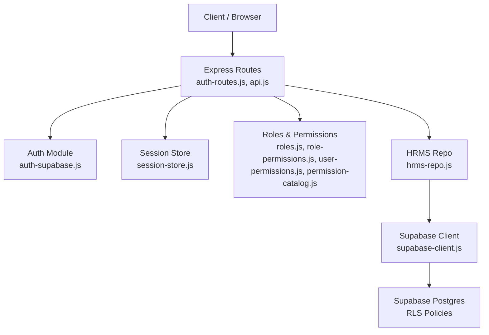
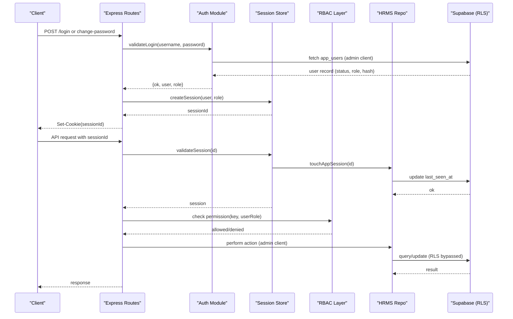
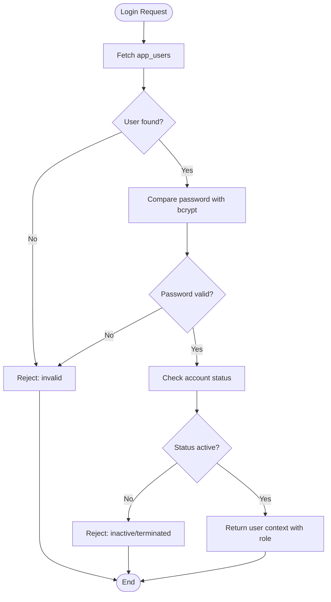
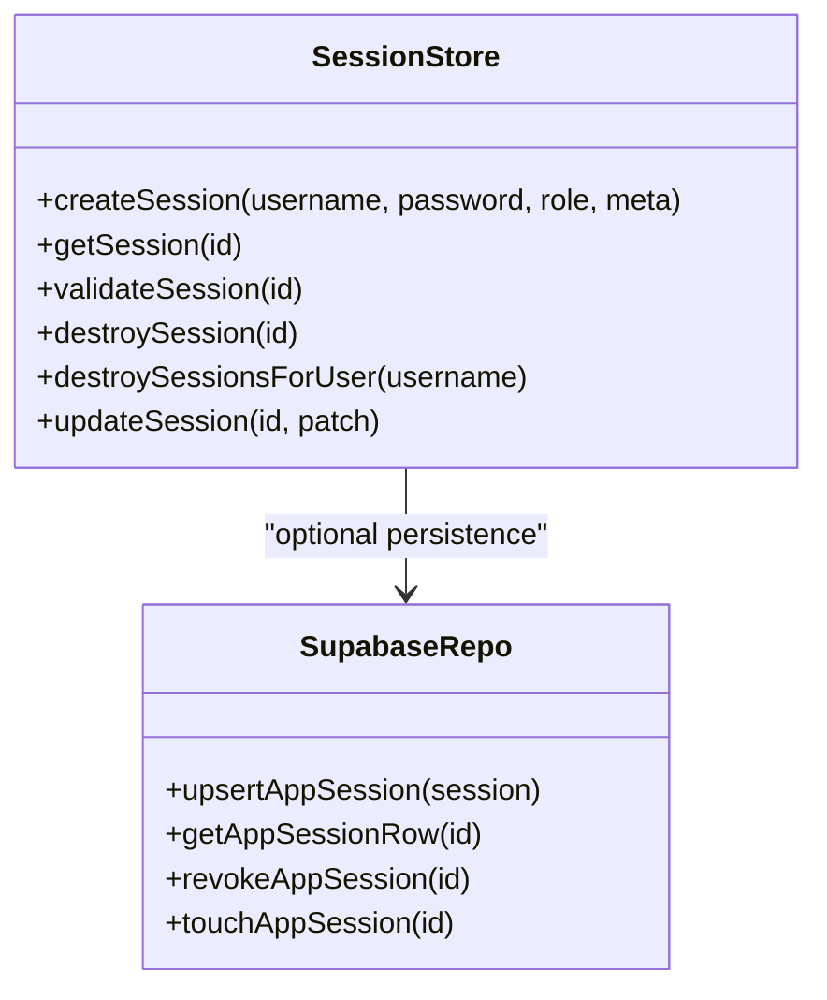
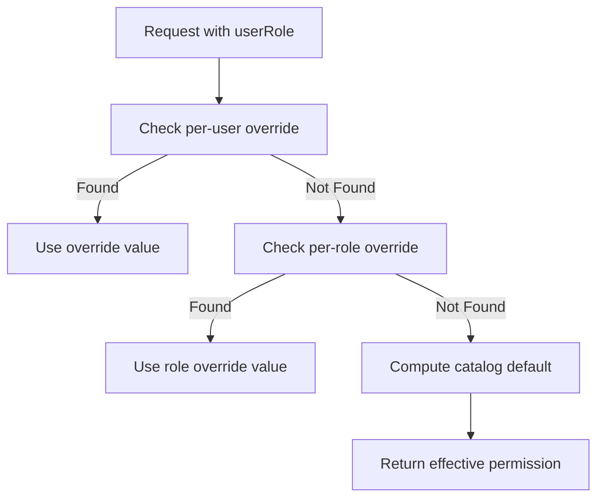
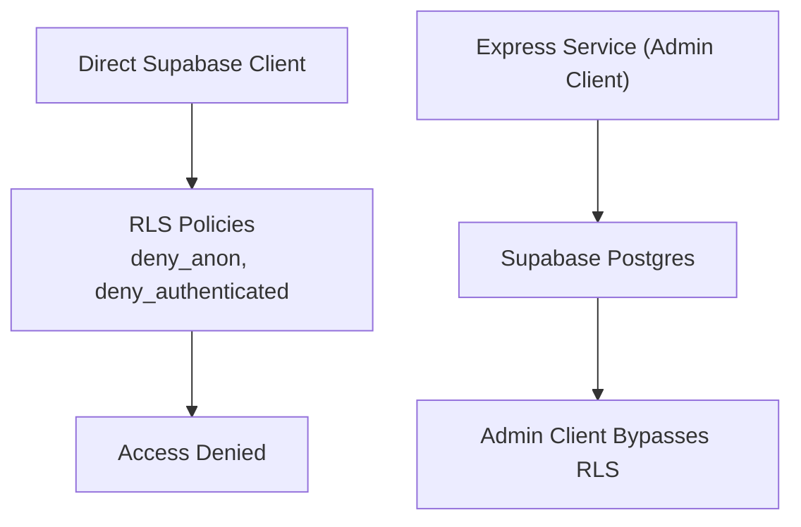
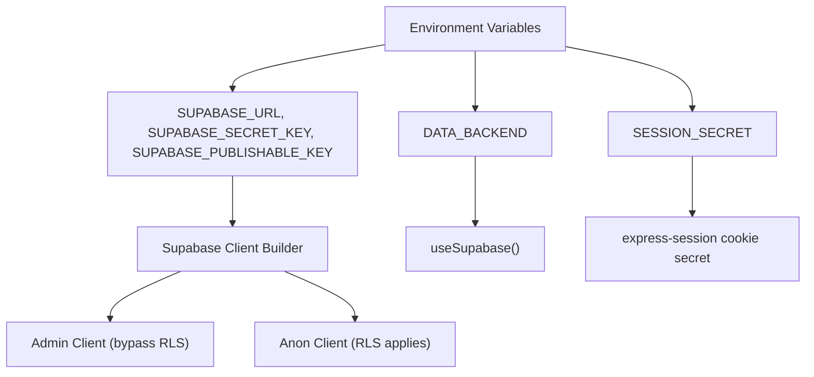
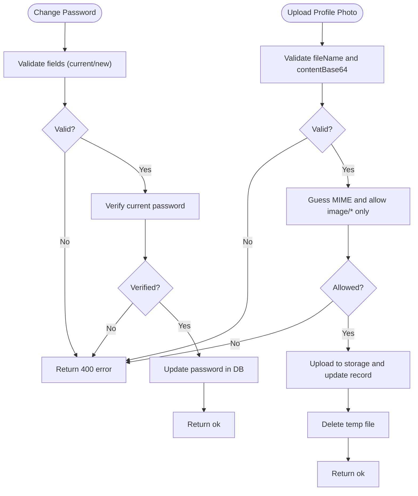
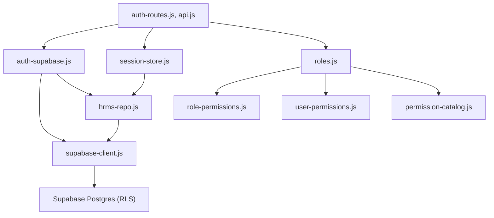

# Security Model

<cite>
**Referenced Files in This Document**
- [auth-supabase.js](file://lib/auth-supabase.js)
- [auth-routes.js](file://routes/auth-routes.js)
- [session-store.js](file://lib/session-store.js)
- [roles.js](file://lib/roles.js)
- [role-permissions.js](file://lib/role-permissions.js)
- [user-permissions.js](file://lib/user-permissions.js)
- [permission-catalog.js](file://lib/permission-catalog.js)
- [supabase-client.js](file://lib/supabase-client.js)
- [backend.js](file://lib/backend.js)
- [hrms-repo.js](file://lib/hrms-repo.js)
- [20260702_rls_deny_all.sql](file://supabase/migrations/20260702_rls_deny_all.sql)
- [20260711_v112_clients_breaks.sql](file://supabase/migrations/20260711_v112_clients_breaks.sql)
- [20260723_v129_multi_feature_sprint.sql](file://supabase/migrations/20260723_v129_multi_feature_sprint.sql)
- [api.js](file://routes/api.js)
- [app.js](file://app.js)
- [backup-app.js](file://backup-app.js)
</cite>

## Table of Contents
1. [Introduction](#introduction)
2. [Project Structure](#project-structure)
3. [Core Components](#core-components)
4. [Architecture Overview](#architecture-overview)
5. [Detailed Component Analysis](#detailed-component-analysis)
6. [Dependency Analysis](#dependency-analysis)
7. [Performance Considerations](#performance-considerations)
8. [Troubleshooting Guide](#troubleshooting-guide)
9. [Conclusion](#conclusion)
10. [Appendices](#appendices)

## Introduction
This document describes the security model implemented across the application, focusing on authentication, session management, role-based access control (RBAC), Row Level Security (RLS), secret key and environment handling, input validation patterns, and security best practices such as CSRF protection, XSS prevention, and secure file upload handling. The goal is to provide a comprehensive view for both technical and non-technical readers.

## Project Structure
The security-related code spans several modules:
- Authentication and password hashing are handled by the auth module using bcrypt and Supabase-backed user records.
- Session management uses an in-memory store with optional Supabase persistence and idle timeout enforcement.
- RBAC is implemented via roles, permission catalogs, and DB-backed overrides for both roles and individual users.
- Database access is enforced at the RLS layer; server-side admin client bypasses RLS where necessary.
- Secret keys and environment variables are centralized in a dedicated client module.
- Input validation and authorization checks are applied at route handlers and business logic layers.

**Diagram sources**
- [auth-routes.js:1-62](file://routes/auth-routes.js#L1-L62)
- [auth-supabase.js:1-73](file://lib/auth-supabase.js#L1-L73)
- [session-store.js:1-83](file://lib/session-store.js#L1-L83)
- [roles.js:1-120](file://lib/roles.js#L1-L120)
- [role-permissions.js:1-159](file://lib/role-permissions.js#L1-L159)
- [user-permissions.js:1-127](file://lib/user-permissions.js#L1-L127)
- [permission-catalog.js:1-120](file://lib/permission-catalog.js#L1-L120)
- [hrms-repo.js:1-20](file://lib/hrms-repo.js#L1-L20)
- [supabase-client.js:1-134](file://lib/supabase-client.js#L1-L134)

**Section sources**
- [auth-supabase.js:1-73](file://lib/auth-supabase.js#L1-L73)
- [auth-routes.js:1-62](file://routes/auth-routes.js#L1-L62)
- [session-store.js:1-83](file://lib/session-store.js#L1-L83)
- [roles.js:1-120](file://lib/roles.js#L1-L120)
- [role-permissions.js:1-159](file://lib/role-permissions.js#L1-L159)
- [user-permissions.js:1-127](file://lib/user-permissions.js#L1-L127)
- [permission-catalog.js:1-120](file://lib/permission-catalog.js#L1-L120)
- [hrms-repo.js:1-20](file://lib/hrms-repo.js#L1-L20)
- [supabase-client.js:1-134](file://lib/supabase-client.js#L1-L134)

## Core Components
- Authentication flow: Validates credentials against app_users table using bcrypt and enforces account status checks.
- Session management: Creates sessions with random IDs, tracks last seen timestamps, and enforces idle expiration.
- RBAC system: Combines role defaults, per-role overrides, and per-user overrides to compute effective permissions.
- RLS policies: Denies direct client access to all tables; server-side admin client bypasses RLS when needed.
- Secret key management: Centralized environment variable handling for Supabase URLs and keys.
- Input validation: Route-level validation for sensitive operations like password changes and file uploads.

**Section sources**
- [auth-supabase.js:10-47](file://lib/auth-supabase.js#L10-L47)
- [auth-routes.js:11-34](file://routes/auth-routes.js#L11-L34)
- [session-store.js:8-52](file://lib/session-store.js#L8-L52)
- [role-permissions.js:19-83](file://lib/role-permissions.js#L19-L83)
- [user-permissions.js:15-83](file://lib/user-permissions.js#L15-L83)
- [permission-catalog.js:121-213](file://lib/permission-catalog.js#L121-L213)
- [20260702_rls_deny_all.sql:1-23](file://supabase/migrations/20260702_rls_deny_all.sql#L1-L23)
- [supabase-client.js:19-67](file://lib/supabase-client.js#L19-L67)

## Architecture Overview
The security architecture follows a layered approach:
- Express routes enforce request validation and call into business logic.
- Auth module verifies credentials and returns user context.
- Session store maintains active sessions with idle timeouts and optional persistence.
- RBAC computes effective permissions from catalog defaults, role overrides, and user overrides.
- HRMS repo performs database operations using the Supabase admin client, which bypasses RLS.
- RLS policies deny direct client access to all tables, ensuring only authorized server paths can read/write data.

**Diagram sources**
- [auth-routes.js:1-62](file://routes/auth-routes.js#L1-L62)
- [auth-supabase.js:24-65](file://lib/auth-supabase.js#L24-L65)
- [session-store.js:8-52](file://lib/session-store.js#L8-L52)
- [hrms-repo.js:1-20](file://lib/hrms-repo.js#L1-L20)
- [supabase-client.js:80-99](file://lib/supabase-client.js#L80-L99)
- [20260702_rls_deny_all.sql:1-23](file://supabase/migrations/20260702_rls_deny_all.sql#L1-L23)

## Detailed Component Analysis

### Authentication Flow (bcrypt + app_users)
- Credentials are validated by comparing provided passwords against stored hashes using bcrypt.
- Account status is checked; terminated or inactive accounts are rejected.
- Successful login returns user context including role for subsequent authorization checks.

**Diagram sources**
- [auth-supabase.js:10-47](file://lib/auth-supabase.js#L10-L47)

**Section sources**
- [auth-supabase.js:10-47](file://lib/auth-supabase.js#L10-L47)

### Session Management (Secure Cookies + Expiration)
- Sessions are created with cryptographically random IDs and metadata (username, role, device label, IP).
- Idle timeout is enforced based on last_seen_at; expired sessions are revoked and destroyed.
- Optional Supabase persistence allows cross-process session revocation and inspection.

**Diagram sources**
- [session-store.js:8-83](file://lib/session-store.js#L8-L83)
- [hrms-repo.js:1-20](file://lib/hrms-repo.js#L1-L20)

**Section sources**
- [session-store.js:8-52](file://lib/session-store.js#L8-L52)
- [hrms-repo.js:1-20](file://lib/hrms-repo.js#L1-L20)

### Role-Based Access Control (Permission Inheritance + Field-Level)
- Permission resolution order: per-user override → per-role override → catalog default.
- Catalog defines defaults for each role; overrides are persisted in DB and cached in memory.
- Many permission checks map to field-level controls (e.g., sales column visibility, notes write/view).

**Diagram sources**
- [role-permissions.js:71-83](file://lib/role-permissions.js#L71-L83)
- [user-permissions.js:56-68](file://lib/user-permissions.js#L56-L68)
- [permission-catalog.js:121-213](file://lib/permission-catalog.js#L121-L213)

**Section sources**
- [roles.js:69-88](file://lib/roles.js#L69-L88)
- [role-permissions.js:19-83](file://lib/role-permissions.js#L19-L83)
- [user-permissions.js:15-83](file://lib/user-permissions.js#L15-L83)
- [permission-catalog.js:121-213](file://lib/permission-catalog.js#L121-L213)

### Row Level Security (RLS) Policy Implementation
- All public tables have RLS enabled with deny-all policies for anon and authenticated clients.
- Server-side admin client bypasses RLS; this must be used carefully and only within trusted server paths.
- Additional deny-all policies are applied to specific feature tables to ensure strict access control.

**Diagram sources**
- [20260702_rls_deny_all.sql:1-23](file://supabase/migrations/20260702_rls_deny_all.sql#L1-L23)
- [20260711_v112_clients_breaks.sql:65-89](file://supabase/migrations/20260711_v112_clients_breaks.sql#L65-L89)
- [20260723_v129_multi_feature_sprint.sql:118-132](file://supabase/migrations/20260723_v129_multi_feature_sprint.sql#L118-L132)
- [supabase-client.js:80-99](file://lib/supabase-client.js#L80-L99)

**Section sources**
- [20260702_rls_deny_all.sql:1-23](file://supabase/migrations/20260702_rls_deny_all.sql#L1-L23)
- [20260711_v112_clients_breaks.sql:65-89](file://supabase/migrations/20260711_v112_clients_breaks.sql#L65-L89)
- [20260723_v129_multi_feature_sprint.sql:118-132](file://supabase/migrations/20260723_v129_multi_feature_sprint.sql#L118-L132)
- [supabase-client.js:80-99](file://lib/supabase-client.js#L80-L99)

### Secret Key Management and Environment Variables
- Supabase URL and keys are read from environment variables; admin key presence is required for server-side operations.
- Backend selection is controlled by DATA_BACKEND; sheets backend is disabled.
- Session secrets are configured per app instance.

**Diagram sources**
- [supabase-client.js:19-67](file://lib/supabase-client.js#L19-L67)
- [backend.js:5-17](file://lib/backend.js#L5-L17)
- [app.js:13](file://app.js#L13)
- [backup-app.js:11-16](file://backup-app.js#L11-L16)

**Section sources**
- [supabase-client.js:19-67](file://lib/supabase-client.js#L19-L67)
- [backend.js:5-17](file://lib/backend.js#L5-L17)
- [app.js:13](file://app.js#L13)
- [backup-app.js:11-16](file://backup-app.js#L11-L16)

### Input Validation Patterns
- Password change endpoint validates presence and minimum length of new password and verifies current password before updating.
- Profile photo upload validates MIME type and restricts to images; temporary files are cleaned up after processing.

**Diagram sources**
- [auth-routes.js:11-34](file://routes/auth-routes.js#L11-L34)
- [api.js:1763-1803](file://routes/api.js#L1763-L1803)

**Section sources**
- [auth-routes.js:11-34](file://routes/auth-routes.js#L11-L34)
- [api.js:1763-1803](file://routes/api.js#L1763-L1803)

### Security Best Practices
- CSRF Protection: No explicit CSRF middleware is present in the analyzed routes. For browser-based forms, consider adding CSRF tokens or enforcing SameSite cookies and double-submit token patterns.
- XSS Prevention: Ensure responses set appropriate Content-Type headers and avoid rendering unsanitized user input in HTML contexts.
- Secure File Upload Handling: Enforce MIME type checks, limit file sizes, sanitize filenames, and delete temporary files promptly.

[No sources needed since this section provides general guidance]

## Dependency Analysis
The following diagram shows how core security components depend on each other and external services.

**Diagram sources**
- [auth-supabase.js:1-73](file://lib/auth-supabase.js#L1-73)
- [auth-routes.js:1-62](file://routes/auth-routes.js#L1-62)
- [session-store.js:1-83](file://lib/session-store.js#L1-83)
- [roles.js:1-120](file://lib/roles.js#L1-120)
- [role-permissions.js:1-159](file://lib/role-permissions.js#L1-159)
- [user-permissions.js:1-127](file://lib/user-permissions.js#L1-127)
- [permission-catalog.js:1-120](file://lib/permission-catalog.js#L1-L120)
- [hrms-repo.js:1-20](file://lib/hrms-repo.js#L1-L20)
- [supabase-client.js:1-134](file://lib/supabase-client.js#L1-L134)

**Section sources**
- [auth-supabase.js:1-73](file://lib/auth-supabase.js#L1-73)
- [auth-routes.js:1-62](file://routes/auth-routes.js#L1-62)
- [session-store.js:1-83](file://lib/session-store.js#L1-83)
- [roles.js:1-120](file://lib/roles.js#L1-120)
- [role-permissions.js:1-159](file://lib/role-permissions.js#L1-L159)
- [user-permissions.js:1-127](file://lib/user-permissions.js#L1-L127)
- [permission-catalog.js:1-120](file://lib/permission-catalog.js#L1-L120)
- [hrms-repo.js:1-20](file://lib/hrms-repo.js#L1-L20)
- [supabase-client.js:1-134](file://lib/supabase-client.js#L1-L134)

## Performance Considerations
- Permission caches reduce repeated DB reads; TTL is short to balance freshness and performance.
- Session validation touches last_seen_at asynchronously; failures are ignored to keep requests fast.
- Avoid heavy synchronous operations in hot paths; prefer async calls and caching strategies.

[No sources needed since this section provides general guidance]

## Troubleshooting Guide
- Authentication failures: Check bcrypt comparison results and account status values in app_users.
- Session issues: Inspect session existence, last_seen_at timestamps, and revocation state in the session store and DB.
- Permission denials: Review per-user and per-role overrides and catalog defaults; invalidate caches if needed.
- RLS errors: Ensure server-side admin client is used for privileged operations; verify RLS policies are correctly applied.

**Section sources**
- [auth-supabase.js:24-65](file://lib/auth-supabase.js#L24-L65)
- [session-store.js:30-52](file://lib/session-store.js#L30-L52)
- [role-permissions.js:19-83](file://lib/role-permissions.js#L19-L83)
- [user-permissions.js:15-83](file://lib/user-permissions.js#L15-L83)
- [20260702_rls_deny_all.sql:1-23](file://supabase/migrations/20260702_rls_deny_all.sql#L1-L23)

## Conclusion
The application implements a robust security model combining strong authentication, secure session management, fine-grained RBAC, and strict database access controls via RLS. Secret keys and environment variables are centrally managed, and input validation is applied at critical endpoints. To further harden the system, consider adding CSRF protection, enhancing XSS safeguards, and continuing to audit file upload handling.

[No sources needed since this section summarizes without analyzing specific files]

## Appendices
- Example permission keys and categories are defined in the permission catalog and mapped to role helpers.
- RLS deny-all policies are applied broadly to prevent direct client access to all tables.

**Section sources**
- [permission-catalog.js:215-289](file://lib/permission-catalog.js#L215-L289)
- [20260702_rls_deny_all.sql:1-23](file://supabase/migrations/20260702_rls_deny_all.sql#L1-L23)