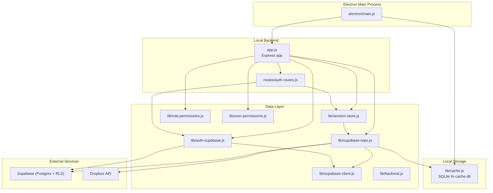
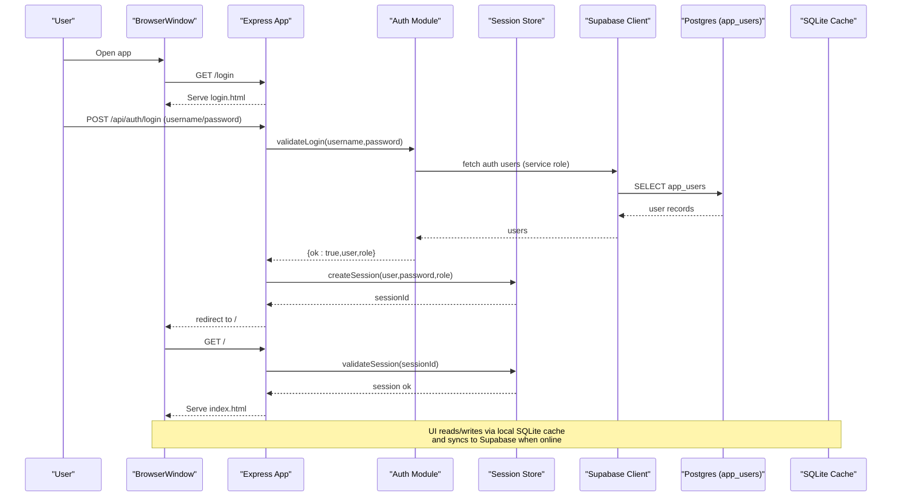
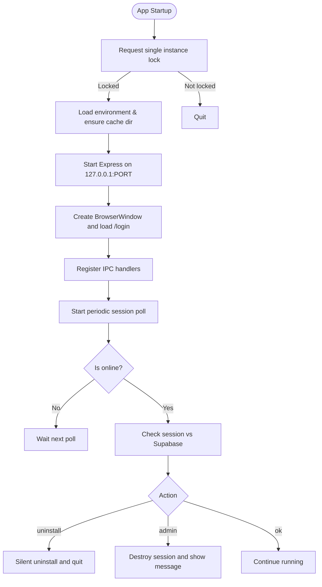
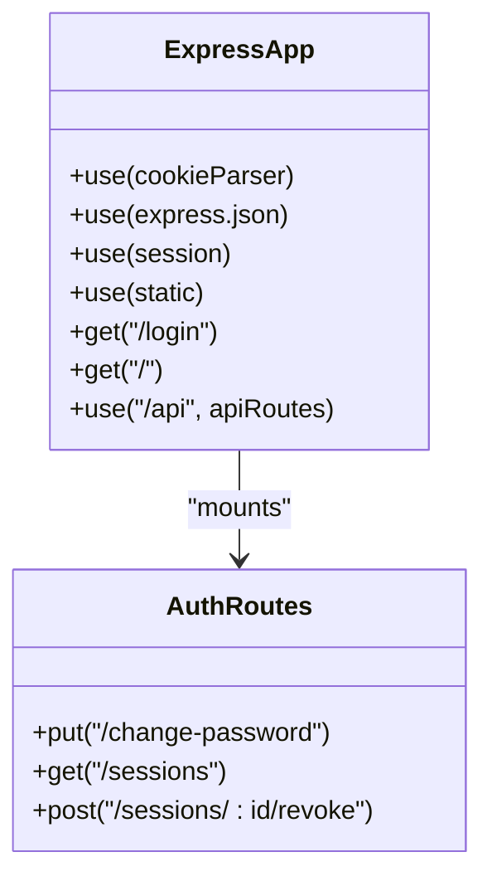
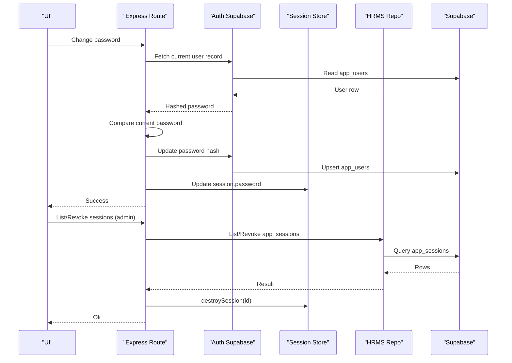
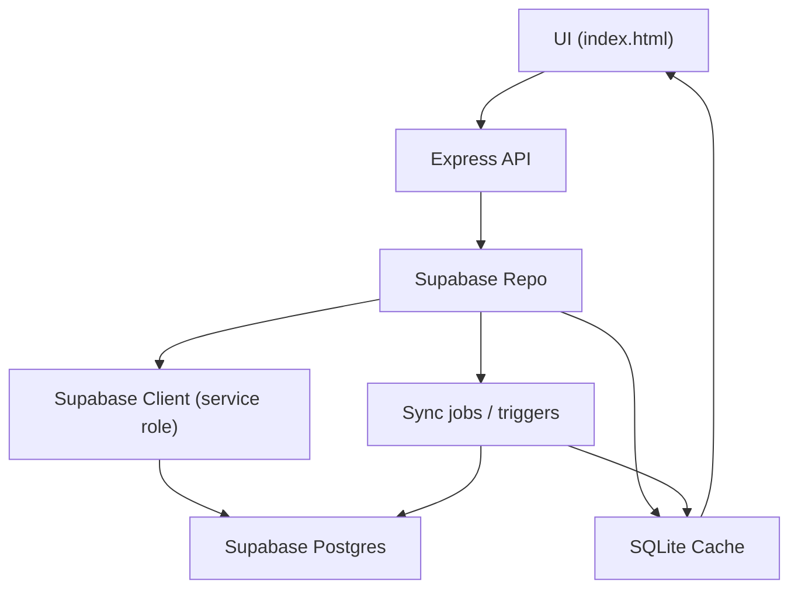
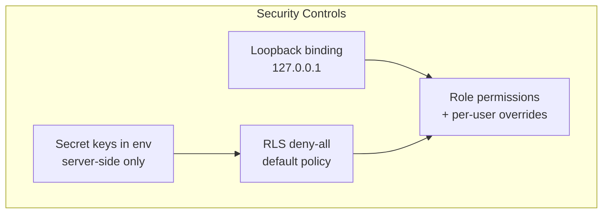
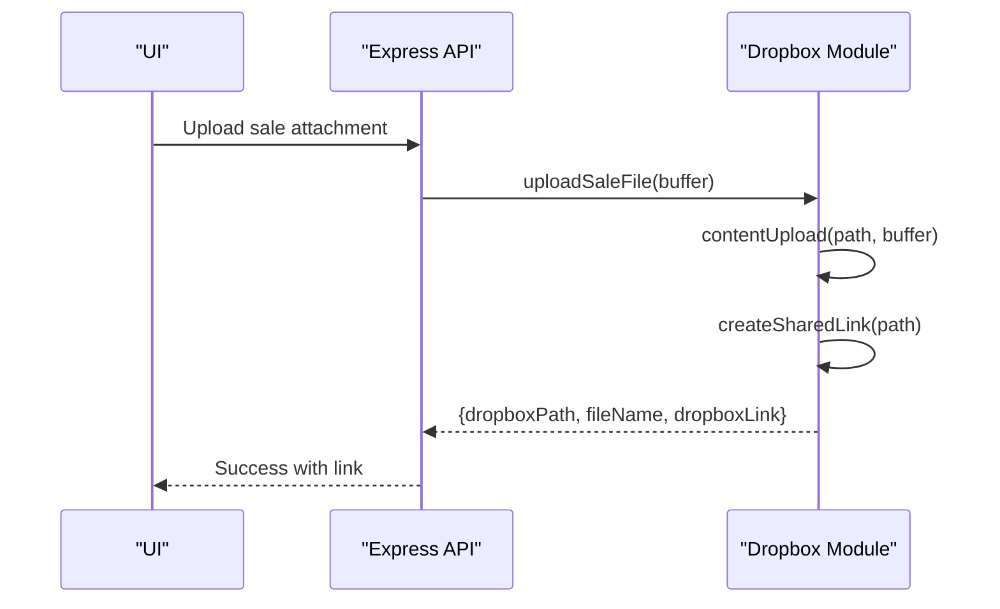
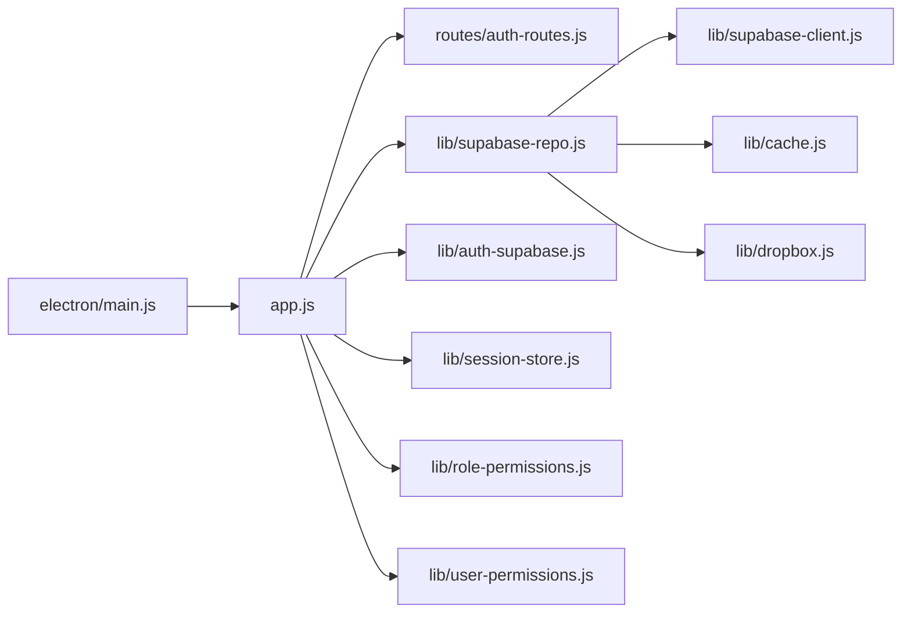

# System Architecture

<cite>
**Referenced Files in This Document**
- [electron/main.js](file://electron/main.js)
- [app.js](file://app.js)
- [lib/backend.js](file://lib/backend.js)
- [lib/supabase-client.js](file://lib/supabase-client.js)
- [lib/auth-supabase.js](file://lib/auth-supabase.js)
- [lib/session-store.js](file://lib/session-store.js)
- [routes/auth-routes.js](file://routes/auth-routes.js)
- [lib/role-permissions.js](file://lib/role-permissions.js)
- [lib/user-permissions.js](file://lib/user-permissions.js)
- [lib/cache.js](file://lib/cache.js)
- [lib/dropbox.js](file://lib/dropbox.js)
- [DB_SCHEMA.md](file://DB_SCHEMA.md)
</cite>

## Table of Contents
1. [Introduction](#introduction)
2. [Project Structure](#project-structure)
3. [Core Components](#core-components)
4. [Architecture Overview](#architecture-overview)
5. [Detailed Component Analysis](#detailed-component-analysis)
6. [Dependency Analysis](#dependency-analysis)
7. [Performance Considerations](#performance-considerations)
8. [Troubleshooting Guide](#troubleshooting-guide)
9. [Conclusion](#conclusion)

## Introduction
This document describes the Hangup Portal system architecture as a hybrid Electron desktop application that combines:
- An Electron main process that manages the desktop window lifecycle and local IPC
- A local Express.js backend serving the browser-based UI and API endpoints
- A Supabase (PostgreSQL) data layer with Row Level Security (RLS) deny-all by default, enforced server-side via service role keys
- A local SQLite cache for offline-first operation and performance
- Optional external integrations such as Dropbox for file storage

The design emphasizes security (loopback-only HTTP, secret key handling), resilience (offline-first caching), and scalability across multi-PC deployments.

## Project Structure
At runtime, Electron boots an Express server on loopback, serves static HTML/JS/CSS from the public directory, and exposes internal APIs under /api. The main process coordinates startup, session polling, and IPC handlers. Data flows between the UI, Express routes, Supabase client, and local SQLite cache.

**Diagram sources**
- [electron/main.js:1-309](file://electron/main.js#L1-L309)
- [app.js:1-57](file://app.js#L1-L57)
- [routes/auth-routes.js:1-62](file://routes/auth-routes.js#L1-L62)
- [lib/backend.js:1-29](file://lib/backend.js#L1-L29)
- [lib/supabase-client.js:1-134](file://lib/supabase-client.js#L1-L134)
- [lib/auth-supabase.js:1-73](file://lib/auth-supabase.js#L1-L73)
- [lib/session-store.js:1-83](file://lib/session-store.js#L1-L83)
- [lib/role-permissions.js:1-159](file://lib/role-permissions.js#L1-L159)
- [lib/user-permissions.js:1-127](file://lib/user-permissions.js#L1-L127)
- [lib/cache.js:1-748](file://lib/cache.js#L1-L748)

**Section sources**
- [electron/main.js:1-309](file://electron/main.js#L1-L309)
- [app.js:1-57](file://app.js#L1-L57)

## Core Components
- Electron main process: starts Express on loopback, creates BrowserWindow, sets up IPC, polls sessions, handles updates and uninstall flow.
- Express app: configures middleware (cookies, JSON parsing, sessions), mounts routes, serves login/index pages, global error handler.
- Authentication: bcrypt password verification against Supabase app_users; session store with optional Supabase persistence and idle revocation.
- Data access: Supabase client using service role key (bypasses RLS); repository layer maps entities; local SQLite cache mirrors key datasets for offline use.
- Permissions: role-based and per-user permission overrides cached in memory, loaded from Supabase tables.
- External integrations: Dropbox API for sales recordings and attachments.

**Section sources**
- [electron/main.js:1-309](file://electron/main.js#L1-L309)
- [app.js:1-57](file://app.js#L1-L57)
- [lib/auth-supabase.js:1-73](file://lib/auth-supabase.js#L1-L73)
- [lib/session-store.js:1-83](file://lib/session-store.js#L1-L83)
- [lib/supabase-client.js:1-134](file://lib/supabase-client.js#L1-L134)
- [lib/role-permissions.js:1-159](file://lib/role-permissions.js#L1-L159)
- [lib/user-permissions.js:1-127](file://lib/user-permissions.js#L1-L127)
- [lib/cache.js:1-748](file://lib/cache.js#L1-L748)
- [lib/dropbox.js:1-323](file://lib/dropbox.js#L1-L323)

## Architecture Overview
The system follows a layered architecture:
- Presentation: Electron-hosted browser UI served by Express
- Application: Express routes and business logic modules
- Data Access: Supabase client and repository layer
- Persistence: Supabase Postgres and local SQLite cache
- Integration: Dropbox for file operations

**Diagram sources**
- [electron/main.js:78-115](file://electron/main.js#L78-L115)
- [app.js:43-51](file://app.js#L43-L51)
- [lib/auth-supabase.js:24-47](file://lib/auth-supabase.js#L24-L47)
- [lib/session-store.js:8-24](file://lib/session-store.js#L8-L24)
- [lib/supabase-client.js:80-99](file://lib/supabase-client.js#L80-L99)

## Detailed Component Analysis

### Electron Main Process
Responsibilities:
- Single-instance lock and portable path configuration
- Environment loading and cache directory creation
- Starting Express on loopback host and port
- Creating BrowserWindow with preload and context isolation
- Handling IPC for file dialogs, writing files, session management, update checks, relaunch
- Periodic session polling to enforce admin actions or account termination

**Diagram sources**
- [electron/main.js:258-309](file://electron/main.js#L258-L309)
- [electron/main.js:166-194](file://electron/main.js#L166-L194)
- [electron/main.js:125-164](file://electron/main.js#L125-L164)

**Section sources**
- [electron/main.js:1-309](file://electron/main.js#L1-L309)

### Express Application and Routing
Responsibilities:
- Middleware setup (cookie parser, JSON body, sessions)
- Static file serving for UI
- Mounting API routes including authentication
- Global error handling
- Redirects based on session state

**Diagram sources**
- [app.js:1-57](file://app.js#L1-L57)
- [routes/auth-routes.js:1-62](file://routes/auth-routes.js#L1-L62)

**Section sources**
- [app.js:1-57](file://app.js#L1-L57)
- [routes/auth-routes.js:1-62](file://routes/auth-routes.js#L1-L62)

### Authentication Model and Session Management
Key points:
- Passwords stored as bcrypt hashes in Supabase app_users table
- Login validates credentials against cached/fetched user list
- Sessions are created in-memory with optional Supabase persistence and idle timeout revocation
- Admin can revoke sessions; terminated accounts trigger uninstall flow

**Diagram sources**
- [routes/auth-routes.js:11-59](file://routes/auth-routes.js#L11-L59)
- [lib/auth-supabase.js:10-47](file://lib/auth-supabase.js#L10-L47)
- [lib/session-store.js:8-59](file://lib/session-store.js#L8-L59)

**Section sources**
- [lib/auth-supabase.js:1-73](file://lib/auth-supabase.js#L1-L73)
- [lib/session-store.js:1-83](file://lib/session-store.js#L1-L83)
- [routes/auth-routes.js:1-62](file://routes/auth-routes.js#L1-L62)

### Data Flow: Supabase to Local SQLite Cache to UI
Highlights:
- Repository layer uses Supabase service role client to read/write canonical data
- Local SQLite cache stores employees, attendance, bonuses, deductions, payroll adjustments, documents, warnings, loans, splits, etc.
- UI reads from cache for responsiveness and offline capability; background sync writes back to Supabase when online

**Diagram sources**
- [lib/supabase-repo.js:1-733](file://lib/supabase-repo.js#L1-L733)
- [lib/supabase-client.js:80-99](file://lib/supabase-client.js#L80-L99)
- [lib/cache.js:1-748](file://lib/cache.js#L1-L748)

**Section sources**
- [lib/supabase-repo.js:1-733](file://lib/supabase-repo.js#L1-L733)
- [lib/cache.js:1-748](file://lib/cache.js#L1-L748)

### Security Architecture
- Loopback-only Express API bound to 127.0.0.1 prevents external network exposure
- Secret keys (Supabase service role) never reach the browser; only publishable keys may be exposed where appropriate
- RLS is deny-all by default; server-side operations bypass RLS using service role
- RBAC and per-user overrides are enforced server-side with in-memory caches

**Diagram sources**
- [electron/main.js:19-22](file://electron/main.js#L19-L22)
- [lib/supabase-client.js:80-99](file://lib/supabase-client.js#L80-L99)
- [DB_SCHEMA.md:51-54](file://DB_SCHEMA.md#L51-L54)
- [lib/role-permissions.js:1-159](file://lib/role-permissions.js#L1-L159)
- [lib/user-permissions.js:1-127](file://lib/user-permissions.js#L1-L127)

**Section sources**
- [electron/main.js:19-22](file://electron/main.js#L19-L22)
- [lib/supabase-client.js:1-134](file://lib/supabase-client.js#L1-L134)
- [DB_SCHEMA.md:51-54](file://DB_SCHEMA.md#L51-L54)
- [lib/role-permissions.js:1-159](file://lib/role-permissions.js#L1-L159)
- [lib/user-permissions.js:1-127](file://lib/user-permissions.js#L1-L127)

### External Integrations: Dropbox
- Credentials managed via environment variables
- Supports upload, download, shared link creation, URL import, and scope validation
- Used for sales recordings and attachments

**Diagram sources**
- [lib/dropbox.js:263-274](file://lib/dropbox.js#L263-L274)
- [lib/dropbox.js:131-163](file://lib/dropbox.js#L131-L163)

**Section sources**
- [lib/dropbox.js:1-323](file://lib/dropbox.js#L1-L323)

## Dependency Analysis
High-level dependencies:
- Electron main depends on Express app and lib modules
- Express app depends on routes and core libs (auth, session, permissions, supabase client)
- Supabase repo depends on supabase client and mappers
- Session store optionally persists to Supabase via HRMS repo
- Dropbox module is independent and invoked by business logic

**Diagram sources**
- [electron/main.js:1-309](file://electron/main.js#L1-L309)
- [app.js:1-57](file://app.js#L1-L57)
- [routes/auth-routes.js:1-62](file://routes/auth-routes.js#L1-L62)
- [lib/supabase-repo.js:1-733](file://lib/supabase-repo.js#L1-L733)
- [lib/supabase-client.js:1-134](file://lib/supabase-client.js#L1-L134)
- [lib/auth-supabase.js:1-73](file://lib/auth-supabase.js#L1-L73)
- [lib/session-store.js:1-83](file://lib/session-store.js#L1-L83)
- [lib/role-permissions.js:1-159](file://lib/role-permissions.js#L1-L159)
- [lib/user-permissions.js:1-127](file://lib/user-permissions.js#L1-L127)
- [lib/cache.js:1-748](file://lib/cache.js#L1-L748)
- [lib/dropbox.js:1-323](file://lib/dropbox.js#L1-L323)

**Section sources**
- [lib/backend.js:1-29](file://lib/backend.js#L1-L29)

## Performance Considerations
- Use WAL mode and busy_timeout in SQLite to improve concurrency and reduce locking contention
- Batch operations and transactions in cache writes (e.g., setAttendanceForMonth, setPayrollAdjustmentsForMonth)
- In-memory caching for role and user permission overrides reduces repeated database calls
- Minimize network calls by reading from local cache first and syncing in background
- Avoid unnecessary full-table scans; leverage indexes defined in cache schema

[No sources needed since this section provides general guidance]

## Troubleshooting Guide
Common issues and resolutions:
- Port already in use: Ensure no other instance binds to the configured loopback port
- Missing Supabase configuration: Verify environment variables for URL and keys
- Session revoked or expired: Admin revocation or idle timeout will invalidate sessions; re-authenticate
- Dropbox scope errors: Regenerate access token with required scopes if verifyAccess fails
- Cache initialization failures: Rebuild native modules or reinstall the app if better-sqlite3 fails to load

**Section sources**
- [electron/main.js:53-76](file://electron/main.js#L53-L76)
- [lib/supabase-client.js:41-59](file://lib/supabase-client.js#L41-L59)
- [lib/session-store.js:30-59](file://lib/session-store.js#L30-L59)
- [lib/dropbox.js:22-44](file://lib/dropbox.js#L22-L44)
- [lib/cache.js:7-18](file://lib/cache.js#L7-L18)

## Conclusion
Hangup Portal’s architecture balances security, reliability, and usability:
- Loopback-only Express and server-side secret keys protect sensitive operations
- RLS deny-all plus service-role access ensures strict data boundaries
- Offline-first SQLite cache enables responsive UX and robust operation without connectivity
- Role-based and per-user permission overrides provide flexible access control
- Modular integration points (Supabase, Dropbox) keep the system extensible and maintainable

[No sources needed since this section summarizes without analyzing specific files]